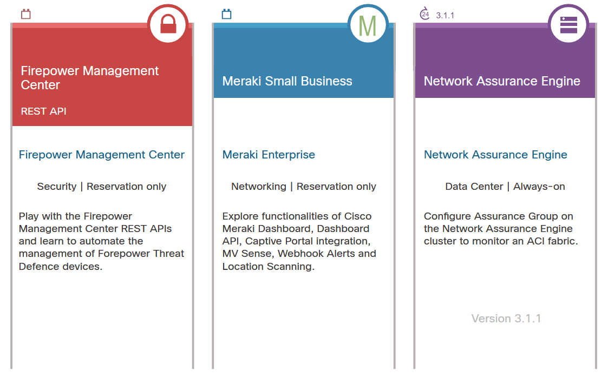

<!-- 2.2.1 -->
## Начало работы с ресурсами DevNet

DevNet дает разработчикам отправную точку для всех API Cisco, включая документацию по API, обучение и поддержку разработчиков. Часть вашей сертификации включает в себя понимание большого количества онлайн-ресурсов, доступных для продуктов Cisco, которые актуальны для разработчиков с точки зрения разработки приложений или автоматизации, и в этом модуле эти ресурсы обсуждаются.

Для получения общего обзора перейдите на стартовую страницу DevNet по адресу developer.cisco.com. Вы увидите, что сайт организован по типу предложений, включая «Start Now (Начать сейчас)», «Learning Tracks (Обучающие треки)», «Video Course (Видеокурс)», «Sandbox (Песочница)», «Code Exchange (Обмен кодом)» и «Ecosystem Exchange (Обмен экосистемами)». Вы также можете изучить интересующую вас платформу, включая Интернет вещей, облако, сеть, центр обработки данных, безопасность, мобильность, открытый исходный код, совместную работу и службы, или переходить по ссылкам специально для разработчиков приложений, разработчиков инфраструктуры или сетевых инженеров.

<!-- 2.2.2 -->
## Учебные лабораторные работы DevNet

DevNet Learning Labs содержат учебные пособия, которые охватывают инженерные технологии, языки программирования и концепции, такие как программирование управляемое моделями, REST API, Python, JavaScript и инструкции и упражнения для платформ Cisco.

Часто учебные лабораторные работы предоставляют лучший пошаговый метод использования песочницы DevNet, которая представляет собой предварительно настроенную среду, которая уже установлена с платформами Cisco. В учебных лабораторных работах также объясняется, как настроить собственную среду разработки, чтобы вы могли неоднократно практиковаться и пробовать задачи на локальном компьютере. Категории Learning Labs имитируют общий сайт DevNet с учебными пособиями по кодированию, совместной работе, IoT, центрам обработки данных, мобильности (мобильной и беспроводной) и сетям.

<!-- 2.2.3 -->
## Песочница DevNet

Когда вы разрабатываете и тестируете технологию, вам нужен стенд, на котором вы можете опробовать код в реалистичной среде, не затрагивая производственные системы. Для этого перейдите в предложение DevNet Sandbox, где вы можете опробовать оборудование и среды Cisco.

<!-- /courses/devnet/b7787a00-a780-11ea-9def-5fe628e1058f/b77bfc70-a780-11ea-9def-5fe628e1058f/assets/aca84c78-7316-4975-8e1a-9f6ce7de3875.svg -->
DevNet предлагает множество песочниц, позволяющих на практике изучить программное обеспечение и API.

Лабораторная среда разработчика, которую вы настроили в начале этого курса, - это то, что вы будете использовать для всех лабораторных работ в этом курсе.

<!-- 2.2.4 -->
## DevNet Exchange

### DevNet Exchange

DevNet предоставляет членам сообщества несколько способов поделиться друг с другом. Это так называемые площадки обмена (Exchange). В настоящее время доступны Automation Exchange, Code Exchange и Ecosystem Exchange. Вы можете представить примеры разным аудиториям, таким как разработчики или бизнес-эксперты.

### Automation Exchange

Automation Exchange предоставляет набор сценариев использования сетевой автоматизации с различными решениями и наборами инструментов.

Например, типичный жизненный цикл - это перевести устройства в рабочее состояние, применить конфигурации к устройствам и затем оптимизировать. Если что-то пойдет не так, вы также должны контролировать и иметь под рукой инструменты для устранения неполадок. На этой площадке обмена представлены примеры, помогающие решить эти задачи.

### Code Exchange

Механизм социального кодирования GitHub изменил то, как мы работаем над кодом. Для создания доступного для поиска подмножества исходного кода или репозиториев инструментов в DevNet есть Code Exchange. Кто угодно может отправить репозиторий, который он сочтет полезным для любой области технологий. Сайт Code Exchange использует GitHub API, а также модераторов-людей для категоризации и отображения сотен связанных репозиториев. Вы можете выполнить поиск по любому ключевому слову в репозитории и получить список результатов.

### Ecosystem Exchange

Поскольку многие платформы Cisco предназначены для поставщиков решений (в отличие от частных лиц), DevNet объединяет точки, позволяющие партнерам реализовывать решения со сценариями разработчиков. В Ecosystem Exchange вы можете найти более 1500 решений для различных технологий, отраслей и регионов, чтобы быстро приступить к проектированию и разработке решений.

<!-- 2.2.5 -->
## Найдите вариант использования в Automation Exchange

Automation Exchange предоставляет различные варианты использования для автоматизации сети, от перечисления данных до добавления конфигураций и активации политик для доменов, пользователей или устройств. Списки предназначены для различных наборов инструментов, таких как Ansible или Puppet, и для различных сценариев инфраструктуры, от кампуса или филиала до центра обработки данных и поставщика услуг.

<!-- 2.2.6 -->
## Поддержка разработчиков DevNet

DevNet предлагает поддержку разработчиков. DevNet может помочь в устранении неполадок интеграции, подключений API и других специальных вопросов о вариантах использования разработчиками продуктов Cisco. Хорошей отправной точкой для получения ответов на вопросы по конкретному сценарию разработчика является developer.cisco.com/support.

Вы можете получить поддержку через:

* регистрацию тикета
* публикацию на форуме сообщества
* доступ к пространству Webex Teams

DevNet также имеет базу знаний со статьями по устранению неполадок для справки.

### Открытие обращения в службу поддержки

DevNet обеспечивает поддержку заявок на участие в программе для участников программы Solution Partner. Обращение в службу поддержки используется для индивидуальной поддержки со временем ответа в один рабочий день. Вы также можете связаться с DevNet напрямую через форумы или Webex Teams. Чтобы открыть обращение в службу поддержки DevNet, перейдите на сайт developer.cisco.com/support и нажмите "Войти". Следуйте инструкциям на экране.

### Форумы в сообществе разработчиков Cisco

Вы можете пойти в https://devnetsupport.cisco.com и щелкните «Community», чтобы перейти в сообщество разработчиков Cisco. Нажмите «Register» или «Log in», чтобы взаимодействовать с сообществом в Интернете.

<!-- 2.2.7 -->
## Лабораторная работа - Изучение ресурсов DevNet

DevNet содержит множество ресурсов для разработчиков. Как разработчик, вам необходимо понимать, что доступно для использования и какие предложения относятся к платформе, на которой вы будете разрабатывать. Вы должны быть знакомы с тем, что доступно на сайте, и как найти то, что вам нужно, чтобы начать разработку.

В этой лабораторной работе вы перейдете в лабораторию на сайте DevNet и используете ее для выполнения некоторых собственных запросов API, прямо к реальному оборудованию!

В этой лабораторной работе вы выполните следующие задачи:

* Часть 1. Найдите учебную лабораторную работу и поперемещаетесь по ней
* Часть 2. Дополнительные ресурсы

[Перейти к лабораторной работе](../02.02.07-lab-explore-devnet-resources/README.md)