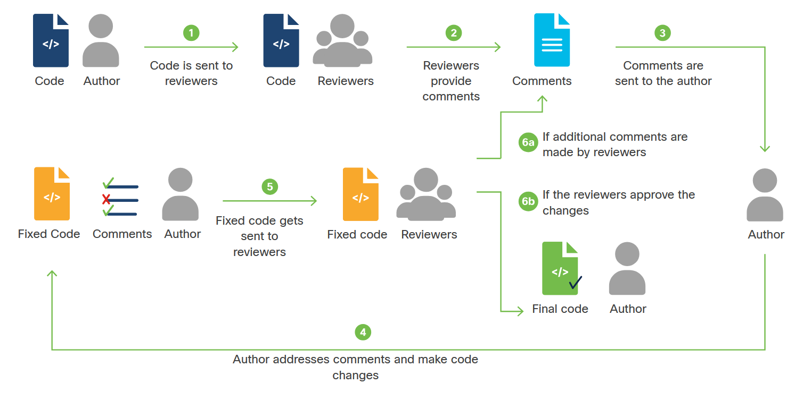

<!-- 3.5.1 -->
## Что такое проверка кода и почему вы должны это делать?

Проверка кода - это когда разработчики просматривают кодовую базу, подмножество кода или конкретные изменения кода и предоставляют отзывы. Этих разработчиков часто называют обозревателями. По возможности лучше иметь более одного рецензента.

Лучше всего иметь рецензентов, которые понимают цель кода, чтобы они могли давать качественные и актуальные отзывы. Рецензенты будут комментировать, как правило, автору кода, что, по их мнению, необходимо исправить. Поскольку многие комментарии могут быть субъективными, автор должен решить, нужно ли рассматривать этот комментарий, но желательно получить согласие рецензента (ов), если он не будет исправлен. Этот процесс проверки кода происходит только после завершения и тестирования изменений кода.

Цель проверки кода - убедиться, что окончательный код:

* легко читать
* легко понять
* следует передовым методам кодирования
* использует правильное форматирование
* без ошибок
* есть соответствующие комментарии и документация
* чистый

Выполнение проверки кода приносит пользу всей команде. Что касается автора, они получают информацию от рецензентов и изучают дополнительные передовые практики, другие способы реализации кода и различные стили кодирования. В результате обзора автор учится на своих ошибках и в следующий раз может написать лучший код. Проверка кода предназначена не только для младших разработчиков, это отличный процесс обучения для всех разработчиков.

Проверки кода также передают знания о коде между разработчиками. Если рецензентам придется работать над этим фрагментом кода в будущем, они будут лучше понимать, как он работает.

Проверки кода - это способ уточнить рабочий код или выявить потенциальные ошибки, что повышает качество кода. В общем, наличие другого взгляда на код никогда не бывает плохим.

<!-- 3.5.2 -->
## Типы проверки кода


<!-- /courses/devnet/ce497bc0-a786-11ea-aa1c-f915852d4dce/ce673cf0-a786-11ea-aa1c-f915852d4dce/assets/85bb1566-bcbe-11ea-8b68-49335aec753f.svg -->
Есть много способов делать обзоры кода. У каждого свои преимущества. Наиболее распространенные типы процессов проверки кода включают:

* Формальная проверка кода
* Проверка кода на основе изменений
* Проверка кода через плечо
* Передача электронной почты

### Официальный обзор кода

При формальном обзоре кода разработчики проводят серию встреч для обзора всей кодовой базы. На этой встрече они проходят код построчно, подробно обсуждая каждый из них. Этот тип процесса проверки кода способствует обсуждению между всеми рецензентами.

Формальная проверка кода позволяет рецензентам прийти к консенсусу, что может улучшить обратную связь. Вы можете делать новую проверку кода каждый раз, когда рассматриваются комментарии.

Подробности собраний по проверке кода, такие как участники, комментарии и комментарии, которые будут рассмотрены, документируются. Этот тип проверки кода часто называется проверкой Фагана и является обычным для проектов, использующих водопадную методологию разработки программного обеспечения.

Современная адаптация формального обзора кода состоит в том, чтобы провести одно собрание для рассмотрения только изменений кода. Таким образом, код может выиграть от живого обсуждения рецензентов. Иногда это называют пошаговым руководством.

### Проверка кода на основе изменений

Проверка кода на основе изменений, также известная как проверка кода с помощью инструментов, проверяет код, который был изменен в результате ошибки, пользовательской истории, функции, фиксации и т. д.

Чтобы определить изменения кода, которые необходимо проверить, обычно используется инструмент коллегиальной проверки кода, который выделяет изменения кода. Этот тип проверки кода инициируется разработчиками, которые внесли изменения в код, и несут ответственность за рассмотрение согласованных комментариев. В этом типе процесса проверки кода рецензенты обычно проводят проверку независимо и предоставляют комментарии через инструмент коллегиальной проверки кода.

Проверка кода на основе изменений упрощает определение фактических изменений кода, подлежащих проверке, и позволяет нескольким рецензентам получить разнообразный взгляд на код.

### Обзор кода через плечо

Обзор кода через плечо - это именно то, на что это похоже. Рецензент смотрит через плечо разработчика, написавшего код. Разработчик, написавший код, последовательно вносит изменения в код, а рецензент предоставляет обратную связь.

При использовании этого метода, если исправление несложно, код можно изменить на месте, чтобы рецензент мог немедленно повторно просмотреть его. Преимущество прямой проверки кода состоит в том, что между автором кода и рецензентом происходит прямое взаимодействие, что позволяет обсудить, какое исправление является правильным. Обратной стороной этого типа проверки кода является то, что в нем обычно участвует только один рецензент, поэтому комментарии могут быть односторонними.

### Передача электронной почты

Повторная проверка может происходить после получения автоматических электронных писем, отправляемых системами управления исходным кодом при проверке. Когда электронные письма отправлены, другие разработчики должны проверить изменения кода, которые были внесены в эту проверку. Обратной стороной этого типа проверки кода является то, что иногда одна проверка может быть лишь частью всего изменения кода, поэтому она может не включать надлежащий контекст, чтобы полностью понять изменения кода.

<!-- 3.5.3 -->
## Тестирование

Почему программисты тестируют программное обеспечение? Простой ответ - убедиться, что он работает так, как должен работать. Этот ответ скрывает множество нюансов и деталей.

Начнем с того, что тестирование программного обеспечения классически подразделяется на две общие категории:

* Функциональное тестирование направлено на определение правильности работы программного обеспечения. Ведет ли он себя так, как задумано в логическом смысле, от самых низких уровней детализации, исследуемых с помощью модульного тестирования, до более высоких уровней сложности, исследуемых с помощью интеграционного тестирования?
* Нефункциональное тестирование исследует удобство использования, производительность, безопасность, отказоустойчивость, соответствие, локализацию и многие другие вопросы. Этот тип тестирования определяет, подходит ли программное обеспечение для своих целей, обеспечивает ли оно предполагаемое значение и минимизирует риск.

Вы можете подумать, что функциональное тестирование происходит на ранней стадии цикла разработки, а нефункциональное тестирование начинается после того, как части программного обеспечения построены или даже завершены. Это неверно. Некоторые типы нефункционального тестирования (например, определение того, соответствует ли конкретный язык, библиотека с открытым исходным кодом или компонент требованиям дизайна или стандарта) должны выполняться задолго до того, как дизайн будет исправлен.

«Гибкая» разработка программного обеспечения способствует легко адаптируемому, минимально планируемому созданию и расширению минимально жизнеспособного продукта (MVP) в течение коротких спринтов. Это означает, что продукт существует в той или иной форме с самого начала процесса. А это значит, что он с самого начала может подвергаться как функциональным, так и нефункциональным тестам.

Фактически, как вы увидите ближе к концу этого раздела, некоторые разработчики выступают за использование тестирования в качестве основы для руководства разработкой программного обеспечения. Это означает сбор требований к дизайну в виде тестов, а затем написание программного обеспечения для прохождения этих тестов. Это называется разработкой через тестирование (TDD).

Давайте рассмотрим некоторые методы и инструменты для тестирования строк кода, блоков, функций и классов.

<!-- 3.5.4 -->
## Модульное тестирование

Подробное функциональное тестирование небольших фрагментов кода (строк, блоков, функций, классов и других компонентов по отдельности) обычно называется модульным тестированием. Современные разработчики обычно автоматизируют этот вид тестирования с помощью фреймворков модульного тестирования. Эти тестовые платформы представляют собой программное обеспечение, которое позволяет вам делать утверждения о тестируемых условиях и определять, действительны ли эти утверждения в момент выполнения. Например:

```python
a = 2 + 2
assert a == 4
```

Ключевое слово `assert` фактически является родным для Python. В этом случае утверждение вернет истину, потому что 2 + 2 фактически равно 4. С другой стороны, если бы вы имели:

assert a == 5

Он вернет `false` и вызовет ошибку.

Сбор утверждений и создание отчетов по тестам упрощаются с помощью фреймворков тестирования. Вот некоторые примеры тестовых фреймворков для Python:

* **unittest** - Это фреймворк, включенный по умолчанию в Python. Он позволяет создавать тестовые коллекции как методы, расширяющие класс TestCase по умолчанию.
* **PyTest**- Это фреймворк, который легко добавляется в Python (из репозиториев pip:`pip3 install pytest`). PyTest может запускать модульные тесты без изменений, но он также упрощает тестирование, позволяя кодерам создавать тесты как простые функции, а не методы класса. PyTest используется некоторыми более специализированными наборами тестов, такими как PyATS от Cisco.

В этой части используются оба, поэтому вы можете увидеть некоторые различия между ними.

### Простое модульное тестирование с помощью PyTest

PyTest удобен тем, что он автоматически выполняет любые скрипты, которые начинаются с `test_` или заканчиваются `_test.py`, а внутри этих скриптов автоматически выполняет любые функции, начинающиеся с `test_` или `tests_`. Таким образом, мы можем выполнить модульное тестирование фрагмента кода (например, функции), скопировав его в файл, импортировав `pytest`, добавив тестовые функции с соответствующими именами (имена начинающиеся с `tests_`), сохранив файл под именем, которое также начинается с `tests_`, и запустив его с помощью PyTest.

Предположим, мы хотим протестировать функцию `add5 ()`, которая добавляет `5` к переданному значению и возвращает результат:

```python
def add5(v):
  myval = v + 5
  return myval
```

Мы можем сохранить функцию в файле с именем `tests_mytest.py`. Затем импортируйте `pytest` и напишите функцию, содержащую наши тесты, с именем `tests_add5()`:

```python
# в файле tests_mytest.py
import pytest
def add5(v):
  myval = v + 5
  return myval
def tests_add5():
  r = add5(1)
  assert r == 6
  r = add5(5)
  assert r == 10
  r = add5(10.102645)
  assert r == 15.102645
```

Тесты в нашей функции тестирования используют стандартное ключевое слово Python `assert`. PyTest будет компилировать и сообщать об этих результатах как при сборе тестовых элементов из файла (предварительный шаг, на котором PyTest изучает собственный анализ кода Python и сообщает о правильном использовании типов и других проблемах, которые возникают до выполнения), так и при запуске функции `tests_add5()`.

Затем вы можете запустить тесты, используя:

```
pytest tests_mytest.py
```
И получите результат, который выглядит примерно так:

```
============================= test session starts ==============================
platform darwin -- Python 3.8.1, pytest-5.3.5, py-1.8.1, pluggy-0.13.1
rootdir: /home/tana/python/mytest
collected 1 item                                                               
tests_mytest.py .                                                        [100%]
============================== 1 passed in 0.01s ===============================
```

Обратите внимание, что, хотя тестируемая функция, безусловно, тривиальна, многие реальные программы содержат функции, которые, как эта, выполняют математические вычисления со своими аргументами. Обычно эти функции вызываются функциями более высокого уровня, которые затем выполняют дополнительную обработку возвращаемых значений.

Если в функции нижнего уровня есть ошибка, из-за которой она возвращает плохой результат, это, вероятно, отразится на выходе более высокого уровня. Но из-за всей промежуточной обработки может быть трудно или невозможно найти источник ошибки (или даже отметить, произошла ли ошибка), просматривая выходные данные этих функций более высокого уровня или выходные данные программы в целом.

Это одна из причин, почему детальное модульное тестирование важно для разработки надежного программного обеспечения. И это причина, по которой следует добавлять модульные тесты каждый раз, когда вы добавляете что-то важное в код на любом уровне, а затем повторно запускать их при каждом внесенном вами изменении. Мы рекомендуем при завершении рабочего сеанса написать намеренно нарушенный модульный тест в качестве заполнителя, а затем использовать запуск модульного теста в начале сеанса, чтобы напомнить вам, где вы остановились.

### Простое модульное тестирование с помощью unittest

Инфраструктура unittest требует другого синтаксиса, чем PyTest. Для unittest вам необходимо создать подкласс встроенного класса TestCase и протестировать, переопределив его встроенные методы или добавив новые методы, имена которых начинаются с `test_`. Пример сценария модульного теста, приведенный выше, можно изменить для работы с модульным тестом следующим образом:

```python
import unittest
def add5(v):
    myval = v + 5
    return myval
class tests_add5(unittest.TestCase):
    def test_add5(self):
        self.assertEqual(add5(1),6)
        self.assertEqual(add5(5),10)
        self.assertEqual(add5(10.102645),15.102645)
if __name__ == '__main__':
    unittest.main()
```

Как и в случае с PyTest, вы импортируете модуль unittest для запуска. Затем следует ваша функция.

Чтобы создать подкласс класса TestCase, передайте его в собственный (производный) тестовый класс (снова называемый `tests_add5`, хотя теперь это класс, а не функция), в результате чего последний унаследует все характеристики первого. Подробнее об объектно-ориентированном программировании Python (ООП) см. в документации.

Затем используйте метод unittest `assertEqual` (это один из широкого диапазона встроенных методов тестирования) так же, как вы использовали собственный `assert` Python в примере PyTest. По сути, вы запускаете свою функцию с разными аргументами и проверяете, соответствуют ли возвращаемые значения ожиданиям.

Последняя строфа - это стандартный способ разрешить выполнение нашей программы из командной строки, вызвав ее основную функцию; который в данном случае определяется unittest.

Сохраните этот файл (снова как `tests_mytest.py`), убедитесь, что он исполняемый (например, в Linux, используя `chmod + x tests_mytest.py`), и выполните его, добавив аргумент `-v` для предоставления подробного отчета:

```
python3 tests_mytest.py –v

test_add5 (__main__.tests_add5) ... ok
----------------------------------------------------------------------
Ran 1 test in 0.000s
OK
```
<!-- 3.5.5 -->
## Интеграционное тестирование

После модульного тестирования следует интеграционное тестирование, которое гарантирует, что все эти отдельные модули, которые вы создавали, правильно подходят друг к другу для создания полного приложения. Например, предположим, что приложение, которое вы пишете, должно обратиться к локальной веб-службе для получения данных конфигурации, включая имя соответствующего хоста базы данных. Возможно, вы захотите проверить значения переменных, установленных при вызове этих функций. Если бы вы использовали PyTest, вы могли бы сделать это так:

```python
import requests   # модуль Python, упрощающий выполнение веб-запросов
def get_config():
    return requests.get("http://localhost/get_config").content
def set_config(dbhost):
    requests.get("http://localhost/config_action?dbhost="+dbhost)
save_dbhost = ""
def setUp():
    global save_dbhost
    save_dbhost = get_config()
def tearDown():
    global save_dbhost
    set_config(save_dbhost)
def test_setconfig():
    setUp()
    set_config("TESTVAL")
    assert get_config() == "ESTVAL"
    tearDown()
```

Обратите внимание, что ваш метод `test_setconfig()` намеренно вызывает вашу функцию `setUp()` перед запуском тестов и вашу функцию `tearDown()` после. В unittest методы `setUp()` и `tearDown()` предоставляются классом TestCase, могут быть переопределены в вашем определенном подклассе и выполняются автоматически.

Запуск этого кода с PyTest может привести к следующему выводу:

```
============================== test session starts ===============================
platform linux2 -- Python 2.7.15+, pytest-3.3.2, py-1.5.2, pluggy-0.6.0
rootdir: /home/ubuntu/deploysample, inifile:
collected 1 item                                                                 
test_sample_app.py F                                                       [100%]
==================================== FAILURES ====================================
_________________________________ test_setconfig _________________________________
    def test_setconfig():
        setUp()
        set_config("TESTVAL")
>       assert get_config() == "ESTVAL"
E       AssertionError: assert 'TESTVAL' == 'ESTVAL'
E         - TESTVAL
E         ? -
E         + ESTVAL
test_sample_app.py:21: AssertionError
------------------------------- Captured log call --------------------------------
connectionpool.py          225 DEBUG    Starting new HTTP connection (1): localhost:80
connectionpool.py          437 DEBUG    http://localhost:80 "GET /get_config HTTP/1.1" 200 7
connectionpool.py          225 DEBUG    Starting new HTTP connection (1): localhost:80
connectionpool.py          437 DEBUG    http://localhost:80 "GET /config_action?dbhost=TESTVAL HTTP/1.1" 200 30
connectionpool.py          225 DEBUG    Starting new HTTP connection (1): localhost:80
connectionpool.py          437 DEBUG    http://localhost:80 "GET /get_config HTTP/1.1" 200 7
============================ 1 failed in 0.09 seconds ============================
```

Если вы исправите сломанный тест, вы увидите, что все работает отлично:

```
============================== test session starts ===============================
platform linux2 -- Python 2.7.15+, pytest-3.3.2, py-1.5.2, pluggy-0.6.0
rootdir: /home/ubuntu/deploysample, inifile:
collected 1 item                                                                 
test_sample_app.py .                                                       [100%]
============================ 1 passed in 0.07 seconds ============================
```

Опять же, вам следует запускать интеграционные тесты перед тем, как вносить какие-либо изменения в течение дня, всякий раз, когда вы вносите существенные изменения, и перед закрытием дня. Если вы используете непрерывную интеграцию, любые обнаруженные ошибки необходимо исправить, прежде чем делать что-либо еще.

Примечание: Вы можете запустить этот сценарий на своей виртуальной машине с помощью pytest. Однако понимание результатов и исправление ошибок выходит за рамки этого курса.

<!-- 3.5.6 -->
## Разработка через тестирование (TDD)

Создание небольших, простых модульных и интеграционных тестов на основе небольших фрагментов кода помогает двумя способами:

* Это гарантирует, что агрегаты соответствуют назначению. Другими словами, вы убедитесь, что подразделения выполняют то, что диктуют требования, в контексте вашего развивающегося решения.
* Он обнаруживает ошибки локально и исправляет их на раннем этапе, избавляя от проблем позже при тестировании или использовании частей вашего решения более высокого порядка, которые зависят от этих компонентов.

Первое из этих действий так же важно, как и второе, потому что оно позволяет тестированию проверять проект системы или, если это не удается, направлять локальный рефакторинг, более широкий редизайн или пересмотр требований.

Тестирование для проверки замысла проекта в свете требований подразумевает, что вы должны написать тестовый код, прежде чем писать код приложения. Выразив требования в тестовом коде, вы можете писать код приложения до тех пор, пока он не пройдет тесты, которые вы создали в тестовом коде.

Это принцип разработки через тестирование (иногда называемый разработкой сначала через тестирование). Базовый шаблон TDD - это повторяющийся пятиэтапный процесс:

1.	Создайте новый тест (добавив его к существующим тестам, если они уже существуют). Идея здесь состоит в том, чтобы зафиксировать некоторые требования к единице кода приложения, которую вы хотите создать.
2.	Выполните тесты, чтобы узнать, не сработают ли какие-либо из них по неожиданным причинам. В таком случае исправьте тесты. Обратите внимание, что ожидаемые сбои здесь допустимы (например, если ваш новый тест не прошел из-за того, что функция, для тестирования которой он предназначен, еще не существует, это является допустимым сбоем на данном этапе).
3.	Напишите код приложения, чтобы пройти новый тест. Правило здесь - ничего не добавлять в приложение, кроме того, что требуется для прохождения теста.
4.	Выполните тесты, чтобы узнать, не сработают ли какие-либо. Если это так, исправьте код приложения и повторите попытку.
5.	Рефакторинг и улучшение кода приложения. Каждый раз, когда вы это делаете, повторно запускайте тесты и исправляйте код приложения, если вы обнаружите какие-либо ошибки.

Поступая таким образом, тестовая оснастка ведет и растет вместе с вашим приложением. Это может быть построчно, обеспечивая очень высокий тестовый охват и высокую уверенность в том, что и тестовая система, и приложение корректны в любой заданной точке остановки. Совместное развитие теста и кода приложения следующим образом:

* Обязывает разработчиков постоянно думать о требованиях (и о том, как отразить их в тестах).
* Помогает прояснить и ограничить, что должен делать код (потому что он просто должен пройти тесты), ускоряя разработку и поощряя простоту и хорошее использование шаблонов проектирования.
* Поручает создание хорошо тестируемого кода. Это код, который, например, разбивает операции на чистые функции, которые можно тестировать изолированно, в любом порядке и т. д.