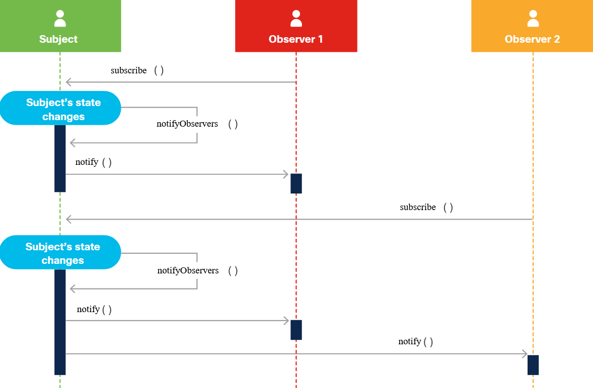

<!-- 3.2.1 -->
## Введение

Шаблоны проектирования программного обеспечения - это лучшие практические решения для решения типичных проблем при разработке программного обеспечения. Шаблоны проектирования не зависят от языка. Это означает, что они могут быть реализованы на любом современном вычислительном языке общего назначения или на любом языке, поддерживающем объектно-ориентированное программирование. Часто популярные шаблоны проектирования поощряют создание дополнительных фреймворков, которые упрощают реализацию в широко используемых языках и парадигмах.

Ремесленники всегда делились проверенными временем методами и техниками решения проблем. Называние этих вещей «шаблонами (паттернами) проектирования» впервые было систематизировано в области архитектуры и городского планирования. Архитектурные шаблоны были организованы по абстрактному классу решаемых проблем, побуждая дизайнеров распознавать общие основные темы, разделяемые во многих различных контекстах. Например, автобусная остановка и зал ожидания больницы - это оба места, где люди ждут; так что оба могут с пользой реализовать особенности шаблона МЕСТО ОЖИДАНИЯ.

Такой способ мышления о шаблонах быстро подхватили пионеры объектно-ориентированного кодирования и гибкой разработки программного обеспечения. В 1994 году Эрих Гамма, Ричард Хелм, Ральф Джонсон и Джон Влиссидес (известные под общим названием «Банда четырех» (GoF)) опубликовали книгу под названием «Шаблоны проектирования - элементы многоразового объектно-ориентированного программного обеспечения». Мы предложим широкий обзор выявленных и задокументированных закономерностей.

Программа для интерфейса, а не реализация. Тесное соединение логики основной программы с реализацией определенных функций обычно затрудняет понимание и поддержку кода. Опыт показал, что слабое связывание логических уровней лучше с помощью абстрактных интерфейсов. Например, основной код вызывает функции и методы обычным образом. Функции нижнего уровня реализуют соответствующие интерфейсы для предоставляемых ими функций, обеспечивая, например, то, что все функции сериализации, используемые в программе, вызываются аналогичным образом.

Объектно-ориентированные языки, такие как Java, формализуют эти идеи. Они позволяют явное объявление интерфейсов, которые могут реализовать классы. Определение интерфейса - это в основном набор прототипов функций, определяющих имена и типы для функций и параметров, которые логика более высокого уровня может использовать для вызова ряда классов. Например, интерфейс для ряда классов «транспортных средств» (например, класса «автомобиль», «мотоцикл», «трактор») может включать прототипы start_engine (), stop_engine (), accelerate () и brake ().

Предпочитайте композицию объектов наследованию классов. Объектно-ориентированные языки допускают наследование: более общие базовые классы могут наследоваться производными классами. Таким образом, класс «утка» может унаследовать существенную функциональность от класса «птица». Однако для этого требуется, чтобы класс Bird реализовал очень широкий спектр методов, большинство из которых не может использоваться конкретным производным классом.

Принцип предпочтения композиции перед наследованием предполагает, что лучшей идеей может быть поддержка реализации определенного класса (класс - утка) путем создания только необходимых уникальных подклассов (класс - кряква) вместе с абстрактными интерфейсами (интерфейс - «утиный») для классов ( класс - летает, класс - плавает), которые могут широко совместно использоваться аналогичным образом (класс – «пингвин» реализует интерфейс «пингвиноподобный», позволяющий разделять класс «плавает», но не «летает»). Подобная организация программного обеспечения оказалась наиболее гибкой, в конечном итоге более простой в обслуживании и поощряет повторное использование кода.

Успешность шаблонов проектирования программного обеспечения уже доказана, поэтому их использование может ускорить разработку, поскольку разработчикам не нужно придумывать новые решения и проходить проверку концепции, чтобы убедиться, что они работают.

<!-- 3.2.2-->
## Исходные шаблоны проектирования

В своей книге «Паттерны дизайна» «Банда четырех» разделила паттерны на три основные категории:

* **Творческие** - Шаблоны, используемые для руководства, упрощения и абстрактного создания программных объектов в масштабе.
* **Структурные** - Шаблоны, описывающие надежные способы использования объектов и классов для различных программных проектов.
* **Поведенческие** - Шаблоны, подробно описывающие, как объекты могут взаимодействовать и работать вместе для решения знакомых задач в разработке программного обеспечения.

Они перечислили в общей сложности 23 шаблона проектирования, которые теперь считаются основой новых шаблонов проектирования. Большинство из этих шаблонов на каком-то уровне выражают основные принципы хорошего объектно-ориентированного проектирования программного обеспечения.

Давайте углубимся в два наиболее часто используемых шаблона проектирования: шаблон проектирования Observer (шаблон проектирования поведения) и Model-View-Controller (MVC).

<!-- 3.2.3 -->
## Шаблон проектирования наблюдателя (Observer)

Шаблон проектирования наблюдателя - это дизайн уведомления о подписке, который позволяет объектам (наблюдателям или подписчикам) получать события, когда есть изменения в объекте (субъект или издатель), за которым они наблюдают. Примеры шаблона проектирования наблюдателя изобилуют в современных приложениях. Подумайте о социальных сетях. Пользователи (наблюдатели) следят за другими пользователями (субъектами). Когда субъект публикует что-то в своих социальных сетях, он уведомляет всех наблюдателей о публикации, и наблюдатели просматривают это обновление.

Чтобы реализовать этот механизм подписки:

1.	Субъект должен иметь возможность хранить список всех своих наблюдателей.
2.	Субъект должен иметь методы для добавления и удаления наблюдателей.
3.	Все наблюдатели должны реализовать обратный вызов для вызова, когда издатель отправляет уведомление, предпочтительно с использованием стандартного интерфейса, чтобы упростить задачу для издателя. Этот интерфейс должен объявлять механизм уведомления и иметь параметры для издателя, чтобы отправлять необходимые данные наблюдателю.

<!-- /courses/devnet/ce497bc0-a786-11ea-aa1c-f915852d4dce/ce5080a0-a786-11ea-aa1c-f915852d4dce/assets/ff6734e0-c072-11ea-9836-bd6a462885ba.svg -->
Выполнение этого паттерна проектирования выглядит так:

1.	Наблюдатель добавляет себя в список наблюдателей субъекта, вызывая метод субъекта для добавления наблюдателя.
2.	Когда происходит изменение субъекта, субъект уведомляет всех наблюдателей в списке, вызывая обратный вызов каждого наблюдателя и передавая необходимые данные.
3.	Обратный вызов наблюдателя запускается и, следовательно, выполняется для обработки уведомления.
4.	Шаги 2 и 3 продолжаются всякий раз, когда изменяется тема.
5.	Когда наблюдатель завершает получение уведомлений, он удаляется из списка наблюдателей субъекта, вызывая метод субъекта для удаления наблюдателя.

Преимущество шаблона проектирования наблюдателя заключается в том, что наблюдатели могут получать данные от субъекта в реальном времени, когда происходит изменение. Механизмы подписки всегда обеспечивают лучшую производительность, чем другие варианты, такие как опрос.

<!-- 3.2.4 -->
## Модель-представление-контроллер (MVC)

<!-- /courses/devnet/ce497bc0-a786-11ea-aa1c-f915852d4dce/ce5080a0-a786-11ea-aa1c-f915852d4dce/assets/85baee50-bcbe-11ea-8b68-49335aec753f.svg -->
Шаблон проектирования модель-представление-контроллер (MVC) иногда считается шаблоном архитектурного проектирования. Его цель - упростить разработку приложений, зависящих от графических пользовательских интерфейсов. MVC разделяет код и ответственность на три разных компонента: модель, представление и контроллер. Каждый компонент взаимодействует друг с другом в одном направлении. Этот шаблон проектирования обычно используется в пользовательских интерфейсах и веб-приложениях.

### Компоненты

* **Модель** -Модель - это структура данных приложения, которая отвечает за управление данными, логикой и правилами приложения. Он получает данные от контроллера.
* **Представление** - Представление - это визуальное представление данных. Может быть несколько представлений одних и тех же данных.
* **Контроллер** -Контроллер подобен посреднику между моделью и представлением. Он принимает вводимые пользователем данные и манипулирует им в соответствии с форматом модели или представления.

Выполнение Model-View-Controller выглядит так:

1.	Пользователь предоставляет ввод.
2.	Контроллер принимает ввод и обрабатывает данные.
3.	Контроллер отправляет обработанные данные в модель.
4.	Модель принимает обрабатываемые данные, обрабатывает их и отправляет выбранные данные (в самых строгих формах MVC через контроллер) в представление.
5.	Представление принимает выбранные данные и отображает их пользователю.
6.	Пользователь видит обновленные данные в результате своего ввода.
Преимущество шаблона проектирования модель-представление-контроллер заключается в том, что каждый компонент может быть построен параллельно. Поскольку каждый компонент является абстрактным, единственная информация, которая нужна каждому компоненту, - это интерфейс ввода и вывода для двух других компонентов. Компонентам не нужно знать о реализации в других компонентах. Более того, поскольку каждый компонент зависит только от входных данных, которые он получает, компоненты можно использовать повторно, если другие компоненты предоставляют данные в соответствии с правильным интерфейсом.
