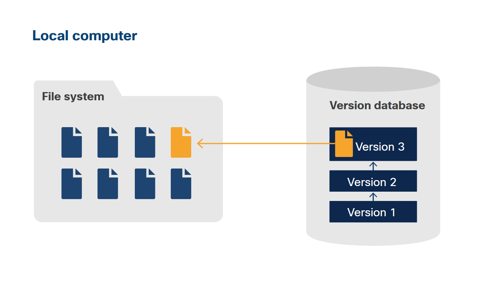
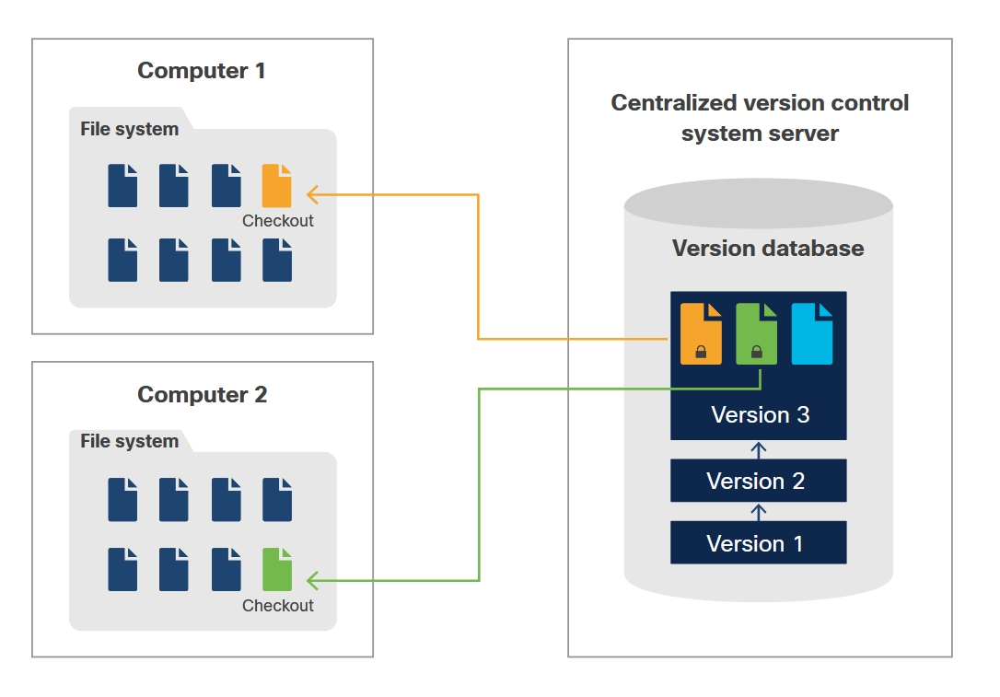
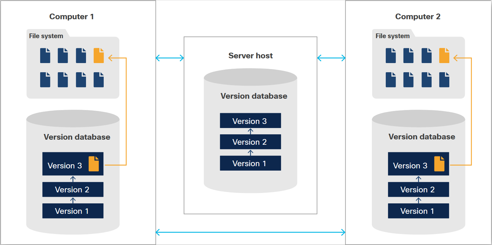
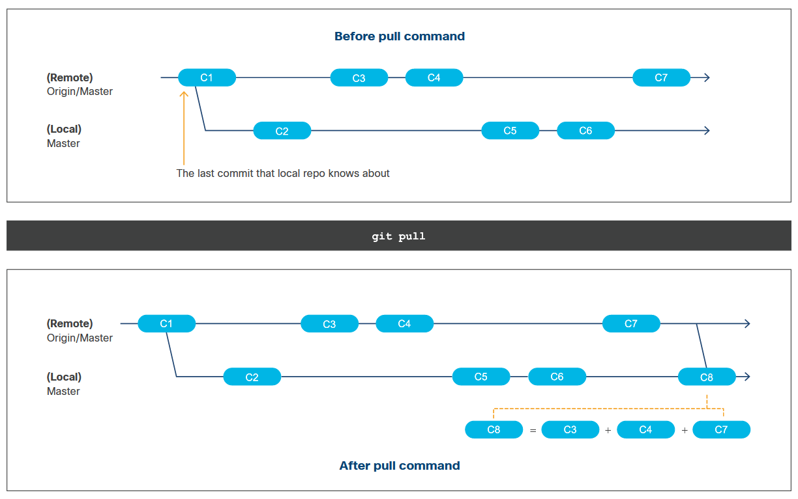
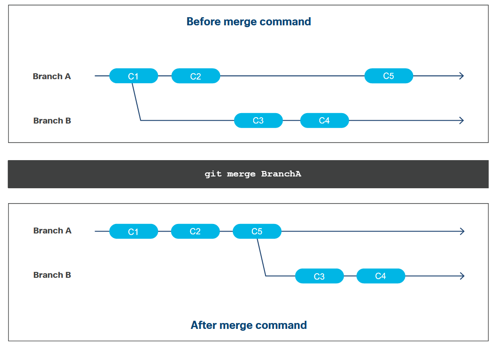
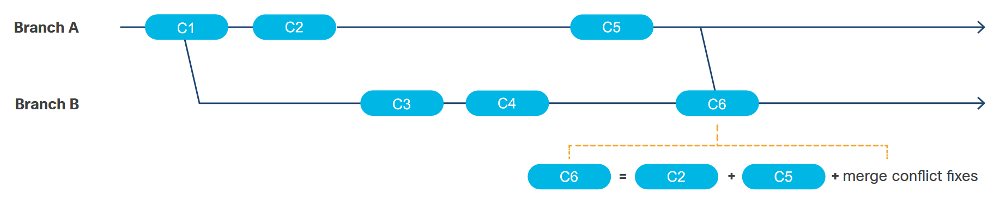

<!-- 3.3.1 -->
## Типы систем контроля версий

Контроль версий, также называемый системами контроля версий, контролем версий или контролем версий, - это способ управлять изменениями в наборе файлов для сохранения истории этих изменений. Подумайте, сколько раз вы делали копию файла перед его изменением, на всякий случай, если вы хотите вернуться к оригиналу. Контроль версий сделает все это за вас.

Системы контроля версий хранят основной набор файлов и историю изменений в хранилище, также известном как репозиторий. Чтобы внести изменения в файл, пользователь должен получить рабочую копию репозитория в своей локальной системе. Рабочая копия - это личная копия файлов, в которую они могут вносить изменения, не затрагивая других. Некоторые из преимуществ контроля версий:

* **Сотрудничество** - Несколько человек могут работать над проектом (набором файлов) одновременно, не отменяя изменения друг друга.
* **Подотчетность и видимость** - Знайте, кто какие изменения внес, когда и почему.
* **Работайте изолированно** - Создавайте новые функции самостоятельно, не затрагивая существующее программное обеспечение.
* **Безопасность** - Файлы могут быть возвращены в случае ошибки.
* **Работайте где угодно** - Файлы хранятся в репозитории, поэтому любое устройство может иметь рабочую копию.

### Типы систем контроля версий

Существует три типа систем контроля версий:

* Локальная
* Централизованная
* Распределенная


<!-- /courses/devnet/ce497bc0-a786-11ea-aa1c-f915852d4dce/ce522e50-a786-11ea-aa1c-f915852d4dce/assets/85baee51-bcbe-11ea-8b68-49335aec753f.svg -->

Как и указано в названии, локальная система контроля версий (LVCS) отслеживает файлы в локальной системе. Локальная система контроля версий заменяет сценарий «сделать копию файла перед дальнейшим редактированием». Основная задача локальной системы управления версиями - это возможность вернуться к предыдущей версии. Этот тип контроля версий не предназначен для реализации большинства перечисленных выше преимуществ.

Локальные системы контроля версий используют простую базу данных для отслеживания всех изменений в файле. В большинстве случаев система хранит разницу между двумя версиями файла, а не сам файл. Когда пользователь хочет вернуть файл, дельта возвращается к запрошенной версии.


<!-- /courses/devnet/ce497bc0-a786-11ea-aa1c-f915852d4dce/ce522e50-a786-11ea-aa1c-f915852d4dce/assets/85baee52-bcbe-11ea-8b68-49335aec753f.svg -->

Централизованная система контроля версий (CVCS) использует модель сервер-клиент. Репозиторий (также известный как репо), который является единственной копией набора файлов и истории, хранится в централизованном месте на сервере. Каждый раз, когда человек хочет внести изменения в файл, он должен сначала получить рабочую копию файла из репозитория в свою собственную систему, клиент.

В централизованной системе контроля версий только один человек может одновременно работать с определенным файлом. Чтобы обеспечить соблюдение этого ограничения, человек должен проверить файл, который блокирует файл и предотвращает его изменение кем-либо еще. Когда человек закончит вносить изменения, он должен зарегистрировать файл, который применяет индивидуальные изменения к основной копии в репо, маркирует новую версию и разблокирует файл, чтобы другие могли вносить изменения.


<!-- /courses/devnet/ce497bc0-a786-11ea-aa1c-f915852d4dce/ce522e50-a786-11ea-aa1c-f915852d4dce/assets/85baee53-bcbe-11ea-8b68-49335aec753f.svg -->

Распределенная система управления версиями (DVCS) - это одноранговая модель. Репозиторий может храниться в клиентской системе, но обычно он хранится в службе хостинга репозитория. Когда человек хочет внести изменение в файл, он должен сначала клонировать полный репозиторий в свою собственную систему. Это включает в себя набор файлов, а также всю историю файлов. Преимущество этой модели состоит в том, что полный репозиторий будет находиться в нескольких системах и может использоваться для восстановления репозитория в службе хостинга репозитория в случае возникновения такого события, как повреждение данных.

В распределенной системе контроля версий каждый человек может работать с любым файлом, даже одновременно, потому что локальный файл в рабочей копии - это то, что изменяется. В результате блокировать файл не нужно. Когда человек завершает внесение изменений, он отправляет файл в основной репозиторий, который находится в службе хостинга репозитория, и система контроля версий обнаруживает любые конфликты между изменениями файлов.

<!-- 3.3.2 -->
## Git

На момент написания этой статьи самой популярной системой контроля версий была Git. Git - это реализация распределенной системы контроля версий с открытым исходным кодом, которая в настоящее время является последней тенденцией в разработке программного обеспечения. Git:

* Легко учиться
* Может обрабатывать все типы проектов, в том числе крупные корпоративные проекты
* Имеет высокую производительность
* Создан для совместных проектов
* Гибкий
* Имеет небольшую площадь
* Имеет все преимущества распределенной системы контроля версий
* Это бесплатно

На клиентском компьютере должен быть установлен клиент Git. Он доступен для MacOS, Windows и Linux/Unix. Хотя некоторые клиенты Git поставляются с базовым графическим интерфейсом пользователя, Git сосредоточен на интерфейсе командной строки, о котором мы подробнее поговорим позже.

Одно из ключевых различий между Git и другими системами управления версиями заключается в том, что Git хранит данные в виде снимков, а не различий (разницы между текущим файлом и предыдущей версией). Если файл не изменяется, git использует ссылку на последний снимок в системе вместо создания нового идентичного снимка.


<!-- /courses/devnet/ce497bc0-a786-11ea-aa1c-f915852d4dce/ce522e50-a786-11ea-aa1c-f915852d4dce/assets/85baee54-bcbe-11ea-8b68-49335aec753f.svg -->
### Тройки Git

Git состоит из троек - трех этапов и трех состояний.

### Три стадии Git


<!-- /courses/devnet/ce497bc0-a786-11ea-aa1c-f915852d4dce/ce522e50-a786-11ea-aa1c-f915852d4dce/assets/85baee55-bcbe-11ea-8b68-49335aec753f.svg -->

В Git есть три стадии:

* репозиторий (каталог .git)
* рабочий каталог
* промежуточная область

### РЕПОЗИТОРИЙ (.GIT DIRECTORY)

Поскольку Git - это распределенная система контроля версий, у каждого клиента есть полная копия репозитория. Когда проект становится репозиторием Git, создается скрытый каталог .git, который по сути является репозиторием. Каталог .git содержит метаданные, такие как файлы (сжатые), коммиты (фиксации) и журналы (история коммитов).

### РАБОЧИЙ КАТАЛОГ

Рабочий каталог - это папка, видимая в файловой системе. Это копия файлов в репозитории. Эти файлы можно изменять, и изменения видны только пользователю клиента. Если файловая система клиента будет повреждена, эти изменения будут потеряны, но основной репозиторий останется нетронутым.

### ПРОМЕЖУТОЧНАЯ ОБЛАСТЬ

Промежуточная область хранит информацию о том, что пользователь хочет добавить/обновить/удалить в репозитории. Пользователю не нужно добавлять все свои измененные файлы в промежуточную область/репо; они могут выбирать определенные файлы. Хотя это называется областью, на самом деле это просто индексный файл, расположенный в каталоге .git.

### Три стадии

Поскольку в Git три стадии, существует три соответствующих состояния для файла Git:

* **фиксированный** - это версия файла, сохраненная в репозитории (каталог .git).
* **модифицированный** - файл был изменен, но не был добавлен в область подготовки или зафиксирован в репозитории.
* **постановочный** - измененный файл готов к фиксации в репозитории.

<!-- 3.3.3 -->
## Локальные и удаленные репозитории

В Git есть два типа репозиториев: локальные и удаленные.

Локальный репозиторий хранится в файловой системе клиентской машины, которая является той же, на которой выполняются команды git.

Удаленный репозиторий хранится не на клиентском компьютере, обычно на сервере или в службе хостинга репозитория. Удаленные репозитории не являются обязательными и обычно используются, когда проект требует сотрудничества между командой с несколькими пользователями и клиентскими машинами.

Удаленные репозитории можно рассматривать как «централизованный» репозиторий для Git, но это не делает его CVCS. Удаленный репозиторий с Git продолжает оставаться DVCS, потому что удаленный репозиторий будет содержать полный репозиторий, который включает код и историю файлов. Когда клиентский компьютер клонирует репозиторий, он получает полный репозиторий без необходимости блокировать его, как в CVCS.

После клонирования локального репозитория из удаленного репозитория или создания удаленного репозитория из локального репозитория два репозитория не зависят друг от друга до тех пор, пока изменения содержимого не будут применены к другой ветви посредством ручного выполнения команды Git.

<!-- 3.3.4 -->
## Что такое ветвление?


<!-- /courses/devnet/ce497bc0-a786-11ea-aa1c-f915852d4dce/ce522e50-a786-11ea-aa1c-f915852d4dce/assets/85baee56-bcbe-11ea-8b68-49335aec753f.svg -->

Ветвление позволяет пользователям работать с кодом независимо, не затрагивая основной код в репозитории. При создании репозитория код автоматически помещается в ветку под названием Master. У пользователей может быть несколько ветвей, и они не зависят друг от друга. Ветвление позволяет пользователям:

* Независимую работу над функцией, при этом пользуясь преимуществами распределенной системы контроля версий
* Работайть над несколькими функциями одновременно
* Экспериментировать с идеями кода
* Хранить производственный код, разработку и код функций отдельно
* Сохранять стабильность основной строки кода

Ветки могут быть локальными или удаленными, и их можно удалять. Локальные ветки позволяют легко пробовать различные реализации кода, потому что ветвь может использоваться, если она успешна, и удаляться, если это не так. Слияние ветки с родительской веткой не обязательно.

В отличие от других систем управления версиями, создание веток в Git не требует больших усилий, а переключение между ветвями происходит практически мгновенно. Хотя ветви часто визуально рисуются как отдельные пути, ветки Git по сути являются просто указателями на соответствующий коммит.


<!-- /courses/devnet/ce497bc0-a786-11ea-aa1c-f915852d4dce/ce522e50-a786-11ea-aa1c-f915852d4dce/assets/85baee57-bcbe-11ea-8b68-49335aec753f.svg -->

Ветви похожи на развилку дороги, где они начинаются с кода и истории в точке ответвления, а затем самостоятельно строят свой путь с новыми коммитами. В результате у ветвей есть собственная история, промежуточная область и рабочий каталог. Когда пользователь переходит из одной ветки в другую, код в их рабочем каталоге и файлы в промежуточной области соответственно изменяются, но каталоги репозитория (.git) остаются неизменными.

По возможности старайтесь использовать ветки, а не обновлять код непосредственно в главной ветке, чтобы предотвратить случайные обновления, нарушающие код.

<!-- 3.3.5 -->
## GitHub и другие провайдеры

Работа с проектами с использованием Git часто ассоциируется с GitHub, но Git и GitHub - это не одно и то же. Git - это реализация распределенного управления версиями и интерфейс командной строки. GitHub - это сервис, предоставляемый Microsoft, который реализует сервис хостинга репозитория с Git.

Помимо обеспечения распределенного контроля версий и функций управления исходным кодом Git, GitHub также предоставляет дополнительные функции, такие как:

* обзор кода
* документация
* управление проектом
* отслеживание ошибок
* запросы функций

GitHub эволюционировал для поддержки многих форм совместного кодирования, в том числе:

* частные репозитории доступны только для определенных команд
* публичные проекты "социального кодирования", но участники которых могут быть анонимными.
* широкие усилия с открытым исходным кодом с множеством участников, иногда исчисляемых тысячами

Чтобы владельцы проектов могли управлять такими разнородными сценариями, GitHub ввел концепцию «пул реквест». Запрос на вытягивание - это способ формализации запроса со стороны участника на проверку изменений, таких как новый код, изменения существующего кода и т. д. в ветви участника для включения в основную или другие курируемые ветви проекта. Идиома запроса на вытягивание теперь повсеместно реализована в сервисах хостинга Git.

GitHub - не единственная служба хостинга репозиториев, использующая Git, другие включают Gitlab и Bitbucket.

<!-- 3.3.6 -->
## Команды Git

### Настройка Git

После установки Git на клиентский компьютер его необходимо настроить. Git предоставляет команду git config для получения и установки глобальных настроек Git или параметров репозитория.

Чтобы настроить Git, используйте параметр --global, чтобы установить начальные глобальные настройки.

**Команда**: `git config --global key value`

Использование опции `--global` приведет к записи в глобальный файл `~/.gitconfig`.

Чтобы каждый пользователь отвечал за изменения своего кода, при каждой установке Git необходимо указать имя и адрес электронной почты пользователя. Для этого используйте следующие команды:

```
$ git config --global user.name "<имя пользователя>"

$ git config --global user.email "<адрес электронной почты пользователя>"
```
Где `<имя пользователя>` а также `<адрес электронной почты пользователя >` - это имя и адрес электронной почты пользователя соответственно.

### Создать новый репозиторий Git

Любой проект (папка) в локальной файловой системе клиента может стать репозиторием Git. Git предоставляет `git init`, чтобы создать пустой репозиторий Git, или сделать существующую папку репозиторием Git. Когда новый или существующий проект становится репозиторием Git, в этой папке проекта создается скрытый каталог `.git`. Помните, что каталог .git - это репозиторий, в котором хранятся метаданные, такие как сжатые файлы, история коммитов и промежуточная область. Помимо создания каталога `.git`, Git также создает главную ветку.

**Команда**: `git init`

Чтобы сделать новый или существующий проект репозиторием Git, используйте следующую команду:
```
$ git init <каталог проекта>
```
где `<каталог проекта>` абсолютный или относительный путь к новому или существующему проекту. Для нового репозитория Git сначала будет создан каталог по указанному пути, а затем будет создан каталог `.git`.

Создание репозитория Git не отслеживает файлы в проекте автоматически. Файлы должны быть явно добавлены во вновь созданный репозиторий, чтобы их можно было отслеживать. Подробности о том, как добавлять файлы в репозиторий, будут рассмотрены позже.


<!-- /courses/devnet/ce497bc0-a786-11ea-aa1c-f915852d4dce/ce522e50-a786-11ea-aa1c-f915852d4dce/assets/85baee58-bcbe-11ea-8b68-49335aec753f.svg -->

### Получить существующий репозиторий Git

С Git легко получить копию и внести свой вклад в существующие репозитории. Git предоставляет команду git clone, которая клонирует существующий репозиторий в локальную файловую систему. Поскольку Git является DVCS, он клонирует полный репозиторий, который включает историю файлов и ветки удаленного отслеживания.

**Команда**: `git clone <репозиторий> [целевой каталог]`

где `<репозиторий>` - это расположение репозитория для клонирования. Git поддерживает четыре основных транспортных протокола для доступа к `<репозиторий>`: Локальный, Secure Shell (SSH), Git и HTTP. [Целевой каталог] является необязательным и представляет собой абсолютный или относительный путь к месту хранения клонированных файлов. Если вы не укажете каталог проекта, git скопирует репозиторий в то место, где вы выполнили команду.


<!-- /courses/devnet/ce497bc0-a786-11ea-aa1c-f915852d4dce/ce522e50-a786-11ea-aa1c-f915852d4dce/assets/a9c08fd0-c074-11ea-ae08-59a8cc45a4e5.svg -->
Когда вы выполняете команду `git clone`, Git:

1.	Создает рабочий каталог в локальной файловой системе с именем репозитория или указанным именем, если оно предоставлено.
2.	Создает каталог .git внутри вновь созданной папки.
3.	Копирует метаданные репозитория во вновь созданный каталог `.git`.
4.	Создает рабочую копию последней версии файлов проекта.
5.	Дублирует структуру ветвей клонированного удаленного репозитория и позволяет отслеживать изменения, внесенные в каждую ветку, локально и удаленно - это включает создание и извлечение локальной активной ветки, «разветвленной» из текущей активной ветки клонированного репозитория.
Дополнительные сведения и параметры командной строки см. В официальной документации по `git clone`.

### Просмотр измененных файлов в рабочем каталоге

Что было изменено в рабочем каталоге? Какие файлы были добавлены в промежуточную область? Git предоставляет команду `git status` для получения списка файлов, которые имеют различия между рабочим каталогом и родительской ветвью. Сюда входят недавно добавленные неотслеживаемые файлы и удаленные файлы. Он также предоставляет список файлов, находящихся в промежуточной области. Обратите внимание, что разница рассчитывается на основе последней фиксации, которую локальный клон скопировал из родительской ветки в репозитории Git, не обязательно последней версии в удаленном репозитории. Если изменения были внесены с момента клонирования репозитория, Git не учтет эти изменения.

**Команда**: `git status`

Помимо списка файлов, вывод команды git status предоставляет дополнительную информацию, например:

* Текущая ветка рабочего каталога
* Количество коммитов: рабочий каталог находится за последней версией родительской ветки.
* Инструкции о том, как обновить локальный репозиторий и как разместить/деактивировать файлы
Дополнительную информацию и параметры командной строки см. В официальной документации по статусу git.

### Сравнение изменений файлов

Хотите знать, что было изменено в файле, или разницу между двумя файлами? Git предоставляет команду `git diff`, которая, по сути, является универсальным инструментом сравнения файлов.

**Команда**: `git diff`

Поскольку эта команда является универсальным инструментом для сравнения файлов, она включает множество опций для сравнения файлов. При использовании этой команды файл не обязательно должен быть файлом, отслеживаемым Git.

Например, вы можете:

1.	Показать изменения между версией файла в рабочем каталоге и последним коммитом, которую локальный клон скопировал из родительской ветки в репозитории Git:
```
$ git diff <путь к файлу>
```
2.	Показать изменения между версией файла в рабочем каталоге и конкретным коммитом из истории файла:
```
$ git diff <идентификатор коммита> <путь к файлу>
```
3.	Показать изменения между двумя фиксациями файла из истории файла. <путь к файлу> это абсолютный или относительный путь файла для сравнения и <идентификатор коммита> это идентификатор версии файла для сравнения.
```
$ git diff <идентификатор фиксации 1> <идентификатор фиксации 2> <путь к файлу>
```
4.	Показать изменения между двумя файлами в рабочем каталоге или на диске.
```
$ git diff <путь к файлу 1> <путь к файлу 2>
```
Дополнительные сведения и параметры командной строки см. В официальной документации `git diff`.

<!-- 3.3.7 -->
## Добавление и удаление файлов

### Добавление файлов в промежуточную область

После внесения изменений в файл в рабочем каталоге он должен сначала перейти в промежуточную область, прежде чем его можно будет обновить в репозитории Git. Git предоставляет команду `git add` для добавления файла (ов) в область подготовки. Эти файлы, добавляемые в промежуточную область, могут включать новые неотслеживаемые файлы, существующие отслеживаемые файлы, которые были изменены, или даже отслеживаемые файлы, которые необходимо удалить из репозитория. Измененные файлы не нужно добавлять в рабочий каталог, если только изменения не нужно добавлять в репозиторий.

**Команда**: `git add`

Эту команду можно использовать более одного раза перед обновлением репозитория Git (с помощью коммита). Кроме того, один и тот же файл можно добавить в сцену несколько раз перед фиксацией. В промежуточную область добавляются только файлы, указанные в команде `git add`.

Чтобы добавить один файл в промежуточную область:

```
$ git add <путь к файлу>
```
Можно добавить несколько файлов в промежуточную область, где `<путь к файлу>`- это абсолютный или относительный путь к файлу, который будет добавлен в область подготовки, и может принимать подстановочные знаки.

```
$ git add <путь к файлу 1> ... <путь к файлу n>
```
Чтобы добавить все измененные файлы в область подготовки:

```
$ git add .
```
Помните, что Git состоит из трех этапов, поэтому добавление файлов в промежуточную область - это только первый этап двухэтапного процесса обновления репозитория Git.

Пожалуйста, обратитесь к официальной документации git add для получения дополнительных сведений и параметров командной строки.


<!-- /courses/devnet/ce497bc0-a786-11ea-aa1c-f915852d4dce/ce522e50-a786-11ea-aa1c-f915852d4dce/assets/85baee59-bcbe-11ea-8b68-49335aec753f.svg -->

### Удаление файлов из репозитория Git

Есть два способа удалить файлы из репозитория Git.

### СПОСОБ 1

Git предоставляет команду git rm для удаления файлов из репозитория Git. Эта команда добавит удаление указанного файла (ов) в область подготовки. Он не выполняет второй шаг по обновлению самого репозитория Git.

**Команда**: `git rm`

Чтобы удалить указанный файл (ы) из рабочего каталога и добавить это изменение в промежуточную область, используйте следующую команду:

```
$ git rm <путь к файлу 1> ... <путь к файлу n>
```
где `<путь к файлу>` - это абсолютный или относительный путь к файлу, который нужно удалить из репозитория Git.

Чтобы добавить указанный файл (ы) для удаления в промежуточную область без удаления самого файла (ов) из рабочего каталога, используйте следующую команду:

```
$ git rm --cached <путь к файлу 1> ... <путь к файлу n>
```
Эта команда не будет работать, если файл уже находится в промежуточной области с изменениями.

Пожалуйста, обратитесь к официальной документации `git rm` для получения дополнительных сведений и параметров командной строки.


<!-- /courses/devnet/ce497bc0-a786-11ea-aa1c-f915852d4dce/ce522e50-a786-11ea-aa1c-f915852d4dce/assets/85bb1560-bcbe-11ea-8b68-49335aec753f.svg -->
### СПОСОБ 2

Этот вариант состоит из двух этапов. Сначала используйте обычную команду файловой системы для удаления файла (ов). Затем добавьте файл на сцену с помощью команды Git `git add`, о которой говорилось ранее.

```
$ rm <путь к файлу 1> ... <путь к файлу n>

$ git add <путь к файлу 1> ... <путь к файлу n>
```
Этот двухэтапный процесс эквивалентен использованию команды `git rm <путь к файлу 1> ... <путь к файлу n>`. Использование этой опции не позволяет сохранить файл в рабочем каталоге.

<!-- 3.3.8 -->
## Обновление репозиториев

### Обновление локального репозитория с учетом изменений в промежуточной области

Помните, что в Git изменения в файле проходят три этапа: рабочий каталог, промежуточная область и репозиторий. Получить изменения содержимого из рабочего каталога в промежуточную область можно с помощью команды `git add`, но как обновления попадают в репозиторий? Git предоставляет команду `git commit` для обновления локального репозитория с изменениями, которые были добавлены в промежуточную область.

**Команда**: `git commit`

Эта команда объединяет все изменения содержимого в промежуточной области в один коммит и обновляет локальный репозиторий Git. Этот новый коммит становится последним изменением в репозитории Git. Если есть удаленный репозиторий Git, он не изменяется с помощью этой команды.

Чтобы зафиксировать изменения из промежуточной области, используйте следующую команду:

```
$ git commit
```
Хорошей практикой разработки программного обеспечения является добавление примечания к фиксации, объясняющее причину изменений. Чтобы зафиксировать изменения из промежуточной области с сообщением, используйте следующую команду:

```
$ git commit -m "<сообщение>"
```
Если команда `git commit` выполняется без какого-либо содержимого в промежуточной области, Git вернет сообщение, и с репозиторием Git ничего не произойдет. Эта команда только обновляет репозиторий Git, добавляя содержимое из промежуточной области. Никаких изменений из рабочего каталога не произойдет.

Пожалуйста, обратитесь к официальной документации по `git commit` для получения дополнительных сведений и параметров командной строки.


<!-- /courses/devnet/ce497bc0-a786-11ea-aa1c-f915852d4dce/ce522e50-a786-11ea-aa1c-f915852d4dce/assets/85bb1561-bcbe-11ea-8b68-49335aec753f.svg -->

```
git commit -m "Add new files"
```

### Обновление удаленного репозитория

Чтобы поделиться изменениями содержимого из локального репозитория Git с другими, удаленный репозиторий Git необходимо обновить вручную. Git предоставляет команду `git push` для обновления удаленного репозитория Git с изменениями содержимого из локального репозитория Git.

**Команда**: `git push`

Эта команда не будет выполнена успешно, если возникнет конфликт с добавлением изменений из локального репозитория Git в удаленный репозиторий Git. Конфликты возникают, когда два человека редактируют одну и ту же часть одного и того же файла. Например, если вы клонируете репозиторий, и кто-то другой отправляет изменения раньше вас, ваша отправка может вызвать конфликт. Прежде чем `git push` будет успешным, необходимо разрешить конфликты.

Чтобы обновить содержимое из локального репозитория до конкретной ветки в удаленном репозитории, используйте следующую команду:

```
$ git push origin <название ветки>
```
Чтобы обновить содержимое из локального репозитория в главную ветку удаленного репозитория, используйте следующую команду:

```
$ git push origin master
```
Дополнительные сведения и параметры командной строки см. В официальной документации git diff.


<!-- /courses/devnet/ce497bc0-a786-11ea-aa1c-f915852d4dce/ce522e50-a786-11ea-aa1c-f915852d4dce/assets/85bb1562-bcbe-11ea-8b68-49335aec753f.svg -->

### Обновление вашей локальной копии репозитория

Локальные копии репозитория Git не обновляются автоматически, когда другой участник обновляет удаленный репозиторий Git. Обновление локальной копии репозитория выполняется вручную. Git предоставляет команду `git pull` для получения обновлений из ветки или репозитория. Эту команду также можно использовать для интеграции локальной копии с не родительской веткой.

**Команда**: `git pull`

Чтобы получить более подробную информацию о команде `git pull`, при выполнении команды выполняются следующие шаги:

1.	Локальный репозиторий (каталог `.git`) обновляется с учетом последнего коммита, истории файлов и т. д. из удаленного репозитория Git. (Это эквивалентно команде Git `git fetch`.)
2.	Рабочий каталог и ветка обновляются последними данными с шага 1. (Это эквивалентно команде Git `git merge`.)
3.	В локальной ветке создается единая фиксация с изменениями, внесенными на шаге 1. Если есть конфликт слияния, его необходимо разрешить.
4.	Рабочий каталог обновлен до последней версии.

Чтобы обновить локальную копию репозитория Git из родительской ветви, используйте следующую команду:

```
$ git pull
```
Или

```
$ git pull origin
```
Чтобы обновить локальную копию репозитория Git из определенной ветки, используйте следующую команду:

```
$ git pull origin <ветка>
```
Дополнительную информацию и параметры командной строки см. в официальной документации git pull.


<!-- /courses/devnet/ce497bc0-a786-11ea-aa1c-f915852d4dce/ce522e50-a786-11ea-aa1c-f915852d4dce/assets/85bb1563-bcbe-11ea-8b68-49335aec753f.svg -->

<!-- 3.3.9 -->
## Особенности ветвления

### Создание и удаление ветки

Ветви - очень полезная функция Git. Как обсуждалось ранее, использование ветвей дает много преимуществ, но одно из основных преимуществ заключается в том, что они позволяют вносить изменения в функции и код независимо от основного кода (главной ветви).

Есть два способа создания ветки.

### СПОСОБ 1

Git предоставляет команду `git branch` для отображения, создания или удаления ветки.

**Команда**: `git branch`

Чтобы создать ветку, используйте следующую команду:

```
$ git branch <родительская ветка> <имя ветки>
```

где `<родительская ветка>` ветвь, от которой нужно разветвляться, и `<имя ветки>` это имя для создания новой ветви.

При использовании этой команды для создания ветки Git создаст ветку, но не переключит рабочий каталог на эту ветку автоматически. Вы должны использовать команду `git <имя ветки>` для переключения рабочего каталога на новую ветку.

### СПОСОБ 2

Git предоставляет команду `git checkout` для переключения ветвей путем обновления рабочего каталога содержимым ветки.

**Команда**: `git checkout`

Чтобы создать ветку и переключить рабочий каталог на эту ветку, используйте следующую команду:

```
$ git checkout -b <родительская ветка> <имя ветки>
```
где `<родительская ветка>` ветвь, от которой нужно разветвляться, и `<имя ветки>` это имя для вызова новой ветви.

### Удаление ветки

Чтобы удалить ветку, используйте следующую команду:

```
$ git branch -d <имя ветки>
```
Дополнительные сведения и параметры командной строки см. в официальной документации по `git branch` и `git checkout`.

### ПОЛУЧИТЬ СПИСОК ВСЕХ ВЕТОК

Чтобы получить список всех локальных веток, используйте следующую команду:

```
$ git branch
```
или

```
$ git branch --list
```

### Слияние веток

Ветви расходятся друг от друга, когда они изменяются после создания. Чтобы получить изменения из одной ветки (источник) в другую (цель), вы должны объединить исходную ветвь с целевой веткой. Когда Git объединяет ветку, он берет изменения/коммиты из исходной ветки и применяет их к целевой ветке. Во время слияния изменяется только целевая ветка. Исходная ветка остается нетронутой.

Например:


<!-- /courses/devnet/ce497bc0-a786-11ea-aa1c-f915852d4dce/ce522e50-a786-11ea-aa1c-f915852d4dce/assets/85bb1564-bcbe-11ea-8b68-49335aec753f.svg -->

1.	При коммите `commit#1` ветка B ответвилась от ветки A.
2.	После того, как ветви расходятся, кто-то добавляет фиксацию `commit#2` в ветвь A. В ветви B эти изменения не поступают.
3.	Кто-то добавляет `commit#3` и `commit#4` в ветвь B. Ветка A не получает этих изменений.
4.	Кто-то добавляет `commit#5` в ветвь A. В ветке B эти изменения отсутствуют.
5.	Теперь ветвь A и ветка B разошлись на две коммиты каждая.
6.	Предположим, что ветвь B требует изменений из ветки A, поскольку она расходится (`commit#2` и `commit#5`). Итак, ветвь A является исходной ветвью, а ветка B - целевой веткой. В этом примере давайте заявим, что коммиты были изменениями в разных файлах. В результате `commit#2` и `commit#5` применяются к ветви B, а ветвь A остается прежней. Это называется слиянием с перемоткой вперед.

### БЫСТРОЕ ОБЪЕДИНЕНИЕ

Ускоренное слияние - это когда алгоритм Git может автоматически и без конфликтов применять изменения/коммиты из исходной (ых) ветки (-ей) к целевой ветке. Обычно это возможно при изменении разных файлов в объединяемых ветвях. Это все еще возможно при изменении одного и того же файла, но обычно при изменении разных строк файла. Слияние с перемоткой вперед - лучший сценарий при выполнении слияния.

При ускоренном слиянии Git интегрирует различные коммиты из исходной ветки в целевую. Поскольку ветки по сути являются просто указателями на коммиты в бэкэнде, слияние с быстрой перемоткой вперед просто перемещает указатель, представляющий HEAD целевой ветки, а не добавляет новую фиксацию.

Обратите внимание, что для выполнения быстрого слияния Git должен иметь возможность слить все существующие коммиты без каких-либо конфликтов.

### КОНФЛИКТЫ СЛИЯНИЯ

Изменение одного и того же файла в разных ветвях для слияния увеличивает вероятность конфликта слияния. Конфликт слияния возникает, когда Git не может выполнить слияние с перемоткой вперед, потому что он не знает, как автоматически применить изменения из веток вместе для файла(ов). Когда это происходит, пользователь должен вручную исправить эти конфликты, прежде чем ветви можно будет объединить вместе. Исправление конфликта вручную добавляет новую фиксацию в целевую ветвь, содержащую фиксации из исходной ветки, а также фиксированный конфликт(ы) слияния.


<!-- /courses/devnet/ce497bc0-a786-11ea-aa1c-f915852d4dce/ce522e50-a786-11ea-aa1c-f915852d4dce/assets/85bb1565-bcbe-11ea-8b68-49335aec753f.svg -->

### ВЫПОЛНЕНИЕ ОБЪЕДИНЕНИЯ

Git предоставляет команду `git merge` для объединения двух или более веток вместе.

**Команда**: `git merge`

Чтобы объединить ветку с текущей веткой/репозиторием клиента, используйте следующую команду:

```
$ git merge <имя ветки>
```

где `<имя ветки>` это исходная ветвь, которая объединяется с текущей веткой

При использовании команды git merge целевая ветвь должна быть текущей веткой/репозиторием, поэтому для объединения ветки в ветку, которая не является текущей веткой/репозиторием клиента, используйте следующие команды:

```
$ git checkout <имя целевой ветки>

$ git merge <имя исходной ветки>
```

где `<имя целевой ветки>` целевая ветвь и `<имя исходной ветки>` это исходная ветка.

Чтобы объединить более одной ветки в текущую ветку/репозиторий клиента, используйте следующую команду:

```
$ git merge <имя ветки 1> ... <имя ветки n>
```

Это называется слиянием осьминога.

Дополнительные сведения и параметры командной строки см. в официальной документации по `git merge`.

<!-- 3.3.10 -->
## Файлы .diff

### Что такое файл .diff?

Разработчики используют файл .diff, чтобы показать, как изменились две разные версии файла. Используя определенные символы, этот файл может быть прочитан другими системами, чтобы понять, как файлы могут быть обновлены. Разница используется для реализации изменений путем сравнения и объединения двух версий. Некоторые проекты требуют, чтобы изменения были отправлены через файл .diff в качестве патча. Поскольку это все в одном файле, это называется унифицированным файлом diff.

Символы и значения в едином файле различий показаны ниже:

* **+**: Указывает, что линия добавлена.
* **-**: указывает на то, что линия была удалена.
* **/dev/null**: показывает, что файл был добавлен или удален.
* или «**blank**»: дает контекстные строки вокруг измененных строк.
* **@@**: Визуальный индикатор начала следующего блока информации. Внутри изменений для одного файла может быть несколько.
* **index**: отображает сравниваемые коммиты.

Пример сравнения для файла с именем `check-network.yml`:

```
diff --git a/check-network.yml b/check-network.yml

index 09b4f0c..b1978ca 100644

--- a/check-network.yml

+++ b/check-network.yml

@@ -4,7 +4,7 @@

   roles:

     - ansible-pyats

   vars:

-    snapshot_file: "{{ inventory_hostname }}_bgp.json"

+    snapshot_file: "{{ inventory_hostname }}_routes.json"

   tasks:

   - set_fact:

       snapshot_data: "{{ lookup('file', snapshot_file) | from_json }}"

@@ -13,7 +13,7 @@

 #      var: snapshot_data

 #

   - pyats_parse_command:

-      command: show ip route bgp

+      command: show ip route

       compare: "{{ snapshot_data }}"

     register: command_output
```

Сигнал может быть «+» или «-» в зависимости от порядка хэшей.

В этом формате для контекста показаны три строки выше и ниже точной измененной строки, но вы можете заметить различия, сравнив строку - со строкой +. Одним из изменений в этом патче является изменение имени файла моментального снимка, замена ... bgp.json на ... routes.json.

```
- snapshot_file: "{{inventory_hostname}} _ bgp.json"

+ snapshot_file: "{{inventory_hostname}} _ routes.json"
```

Вы всегда можете посмотреть на разницу между двумя файлами из запроса на извлечение GitHub как на унифицированную разницу, добавив `.diff` к URL-адресу GitHub.

<!-- 3.3.11 -->
## Лабораторная работа - Контроль версий программного обеспечения с помощью Git

В этой лабораторной работе вы изучите основы распределенной системы управления версиями Git, включая большинство функций, которые вам необходимо знать для совместной работы над программным проектом. Вы также интегрируете свой локальный репозиторий Git с облачным репозиторием GitHub.

Вы выполните следующие задачи:

* Часть 1. Запуск виртуальной машины DEVASC
* Часть 2: Инициализация Git
* Часть 3: Размещение и фиксация файла в репозитории Git
* Часть 4: Управление файлом и отслеживание изменений
* Часть 5: Ветви и слияние
* Часть 6: Обработка конфликтов слияния
* Часть 7: интеграция Git с GitHub
