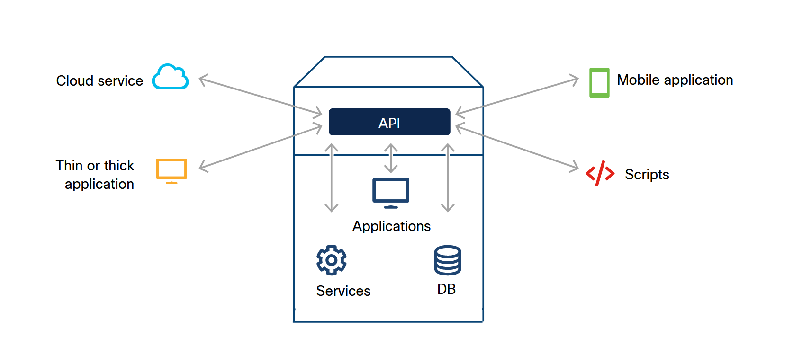

<!-- 4.1.1 -->
## Что такое API?

API позволяет одному программному обеспечению взаимодействовать с другим. API аналогичен розетке. Что бы вам пришлось делать без розетки для питания ноутбука?

* Вскрыть стену
* Зачистить провода от оболочки
* Соединить провода вместе
* Вернуть все провода в стену

API определяет, как программист может написать одну часть программного обеспечения, чтобы взаимодействовать с функциями существующего приложения или даже создавать совершенно новые приложения.

API может использовать обычные веб-взаимодействия или протоколы связи, а также может использовать свои собственные проприетарные стандарты. Хорошим примером возможностей использования API является приложение для рекомендации ресторанов, которое возвращает список соответствующих ресторанов в этом районе. Вместо того, чтобы создавать функцию сопоставления с нуля, приложение интегрирует сторонний API для обеспечения функциональности карты. Создатель API указывает, как и при каких обстоятельствах программисты могут получить доступ к интерфейсу.

В рамках этого процесса API также определяет, какой тип данных, услуг и функций приложение предоставляет третьим лицам; если он не предоставляется API, он не отображается, точка. (То есть при условии, что безопасность настроена правильно!) Предоставляя API, приложения могут безопасно контролировать то, что они раскрывают.

На рисунке показана прямоугольная передняя часть контейнера, разделенная на две основные секции. В верхнем разделе находится API с линиями со стрелками на обоих концах, ведущими к 4 значкам за пределами коробки: облачный сервис, тонкое или толстое приложение, мобильное приложение и скрипты. В нижнем разделе есть три значка и соответствующие слова, при этом каждый значок имеет линию со стрелками на обоих концах, указывающими на поле API в разделе выше. Это службы, приложения и БД.

### Пример различных типов интеграции API.

<!-- /courses/devnet/337c1050-b012-11ea-8a1b-c929643d7563/337ecf70-b012-11ea-8a1b-c929643d7563/assets/97806480-bcc3-11ea-af32-dfde9d560aae.svg -->

Думайте об этом как о кнопках на приборной панели вашего автомобиля. Когда вы поворачиваете ключ или нажимаете кнопку включения двигателя, чтобы завести машину, вы видите, что машина заводится. Вы не видите и даже не заботитесь о том, что двигатель запускает электронную систему зажигания, которая заставляет газ поступать в двигатель и поршни начинают двигаться. Все, что вы знаете, это то, что если вы хотите, чтобы машина завелась, вы поворачиваете ключ или нажимаете кнопку ON Engine. Если вы нажмете другую кнопку, например кнопку включения радио, автомобиль не запустится, потому что это не было определением, которое автомобиль (приложение) определил для запуска двигателя. Сам автомобиль (приложение) может делать гораздо больше, чем запускать двигатель, но эти функции не доступны водителю (стороннему пользователю).

<!-- 4.1.2 -->
## Зачем использовать API?

API-интерфейсы обычно создаются для программного использования другими приложениями, поэтому они называются интерфейсами пригладного программирования. Но их не нужно использовать программно; они также могут использоваться людьми, которые хотят взаимодействовать с приложением вручную.

Вот лишь некоторые из множества вариантов использования API:

* **Задачи автоматизации** - Создайте сценарий, который автоматически и программно выполняет ваши ручные задачи. *Пример*: Вы являетесь менеджером, и в последний день каждого платежного периода вам необходимо вручную войти на портал и загрузить табель учета рабочего времени для каждого человека, который отчитывается перед вами. Затем вам нужно вручную сложить количество часов, отработанных каждым человеком, чтобы вы могли видеть, сколько им нужно заплатить. Если вы создаете автоматизированный сценарий, который вызывает API портала для получения данных из каждой карты учета рабочего времени и вычисления общего количества на основе этих данных, ваш сценарий может распечатать список общих часов, отработанных на человека, в удобном для пользователя формате. Подумайте, сколько времени это сэкономит!
* **Интеграция данных** - Приложение может потреблять данные, предоставленные другим приложением, или реагировать на них. *Пример*: Многие сайты электронной коммерции используют платежные сервисы, доступ к которым осуществляется через REST API. Платежный интерфейс позволяет сайту продавца передавать относительно малоценные данные, такие как описание приобретенного объекта и его цена. Затем пользователь самостоятельно аутентифицируется в платежной службе, чтобы подтвердить платеж. Это позволяет продавцу получать платеж без прямого доступа к данным кредитной карты клиента. Поставщик возвращает код подтверждения для использования в бухгалтерском учете.
* **Функциональность** - Приложение может интегрировать в свой продукт функции другого приложения. *Пример*: Многие онлайн-сервисы, такие как Yelp и Uber, обмениваются данными с Google Maps для создания и оптимизации маршрутов путешествий. Они также встраивают функции Google Maps в свои приложения и веб-сайты для представления карт маршрутов в реальном времени.

<!-- 4.1.3 -->
## Почему API так популярны?

API-интерфейсы существуют уже несколько десятилетий, но за последние 10 лет или около того их использование и распространение выросло экспоненциально. В прошлом приложения были заблокированы, и единственная интеграция между ними осуществлялась через заранее определенные партнерские отношения. По мере роста индустрии программного обеспечения растет и потребность в интеграции. В результате все больше и больше приложений начали открывать части себя для использования сторонними приложениями или отдельными лицами.

Большинство современных API-интерфейсов встроены в продукт, а не являются второстепенным. Эти API-интерфейсы обычно тщательно тестируются, как и любой другой компонент продукта. Эти API-интерфейсы надежны и иногда даже используются самим продуктом. Например, иногда пользовательский интерфейс приложения построен на тех же API, которые предоставляются третьим лицам.

Популярность более простых и упрощенных языков программирования, таких как Python, позволила инженерам, не связанным с программным обеспечением, создавать приложения и использовать эти API. Они получают желаемые результаты, не нанимая дорогих специалистов по разработке.
