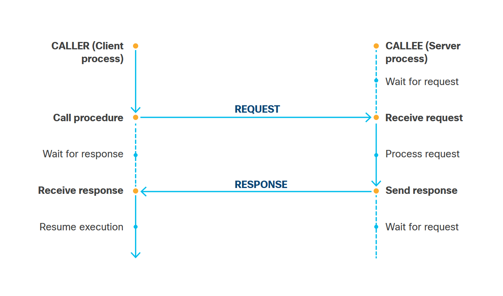
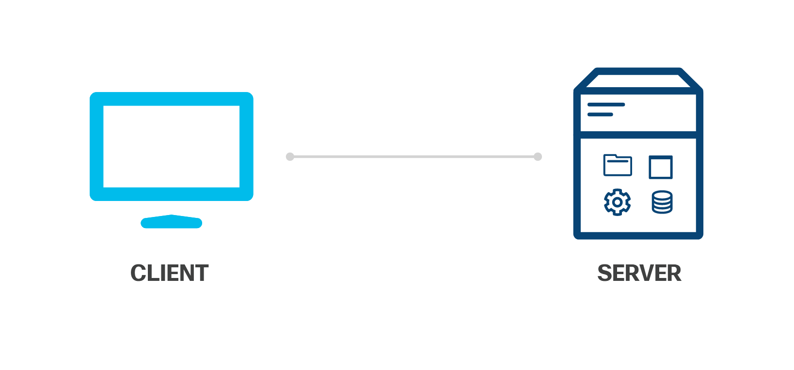
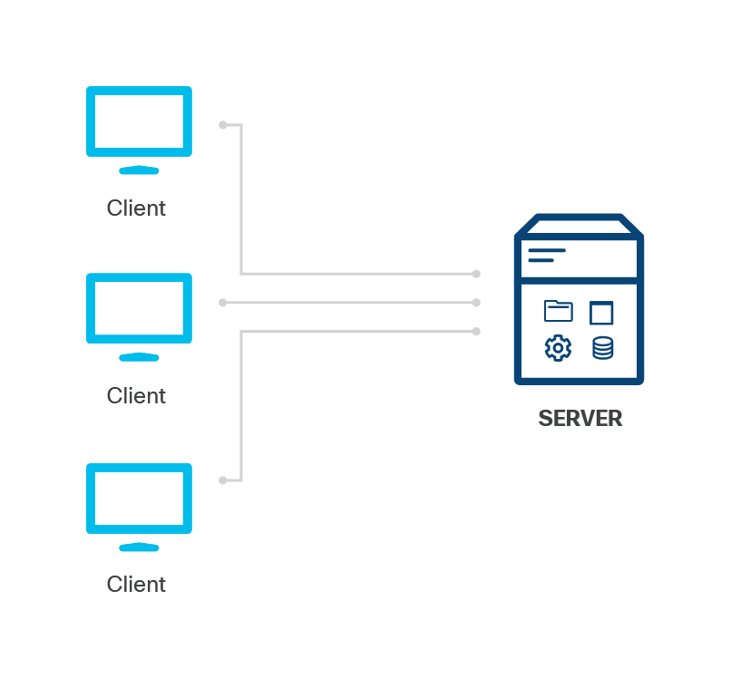
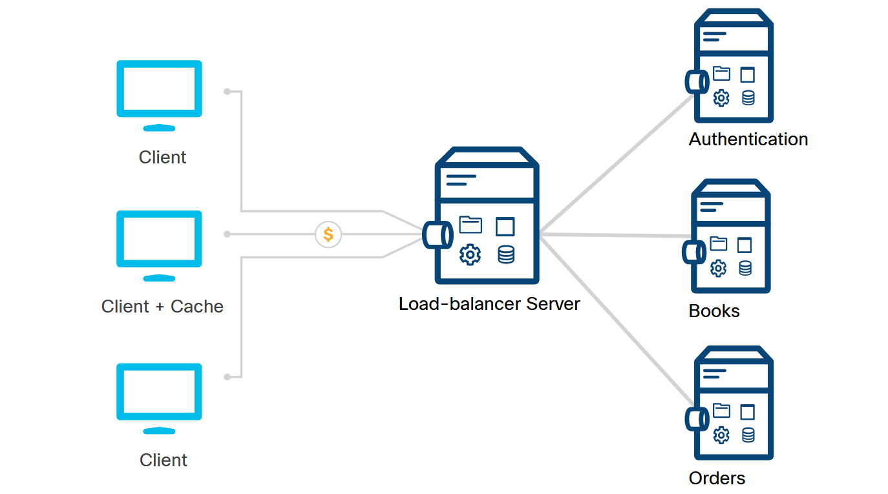

<!-- 4.3.1 -->
## Общие архитектурные стили

Приложение определяет, как с ним взаимодействуют третьи стороны, а это означает, что не существует «стандартного» способа создания API. Однако, хотя приложение технически может предоставлять случайный интерфейс, лучше всего следовать стандартам, протоколам и определенным архитектурным стилям. Это значительно упрощает потребителям API изучение и понимание API, поскольку концепции уже знакомы.

Три самых популярных типа архитектурных стилей API - это RPC, SOAP и REST.

<!-- 4.3.2 -->
## RPC

Удаленный вызов процедур (RPC) - это модель запроса-ответа, которая позволяет приложению (действующему как клиент) выполнять вызов процедуры к другому приложению (действующему как сервер). «Серверное» приложение обычно находится в другой системе в сети.

При использовании RPC клиент обычно не знает, что запрос процедуры выполняется удаленно, поскольку запрос направлен на уровень, который скрывает эти детали. Для клиента эти вызовы процедур - это просто действия, которые он хочет выполнить. Другими словами, для клиента удаленный вызов процедуры - это просто метод с аргументами. Когда он вызывается, метод запускается и возвращаются результаты.

### Модель запроса/ответа удаленного вызова процедур


<!-- /courses/devnet/337c1050-b012-11ea-8a1b-c929643d7563/33855f20-b012-11ea-8a1b-c929643d7563/assets/97808b92-bcc3-11ea-af32-dfde9d560aae.svg -->

В наиболее распространенном использовании RPC клиент выполняет синхронный запрос к серверу и блокируется, пока сервер обрабатывает запрос. Когда сервер завершает запрос, он отправляет ответ клиенту, который разблокирует его процесс. (Это не относится к асинхронным запросам.)

RPC - это стиль API, который можно применять к различным транспортным протоколам. Примеры реализации включают:

* XML-RPC
* JSON-RPC
* NFS (сетевая файловая система)
* Протокол простого доступа к объектам (SOAP)

<!-- 4.3.3 -->
## SOAP

SOAP - это протокол обмена сообщениями. Он используется для связи между приложениями, которые могут быть на разных платформах или построены с использованием разных языков программирования. Это протокол на основе XML, разработанный Microsoft. SOAP обычно используется с транспортом по протоколу передачи гипертекста (HTTP), но может применяться и к другим протоколам. SOAP является независимым, расширяемым и нейтральным.

**Независимый**

SOAP был разработан таким образом, чтобы все типы приложений могли взаимодействовать друг с другом. Приложения могут быть созданы с использованием разных языков программирования, могут работать в разных операционных системах и могут быть как можно более разными.

**Расширяемый**

Сам протокол SOAP считается приложением XML, поэтому на его основе можно создавать расширения. Эта расширяемость означает, что вы можете добавлять такие функции, как надежность и безопасность.

**Нейтральный**

SOAP можно использовать по любому протоколу, включая HTTP, SMTP, TCP, UDP или JMS.

### Сообщения SOAP

Сообщение SOAP - это просто XML-документ, который может содержать четыре элемента:

* Конверт (envelop)
* Заголовок (header)
* Тело (body)
* Неисправность (fault)

Пример сообщения SOAP

```xml
<?xml version="1.0"?>
<soap:Envelope xmlns:soap="http://schemas.xmlsoap.org/soap/envelope/">
    <soap:Header/>
    <soap:Body>
        <soap:Fault>
            <faultcode>soap:Server</faultcode>
            <faultstring>Query request too large.</faultstring>
        </soap:Fault>
    </soap:Body>
</soap:Envelope>
```


**Envelop**

`Envelop` должен быть корневым элементом XML-документа. В `envelop`, предоставленное пространство имен сообщает вам, что XML-документ является сообщением SOAP.

**Header**

`Header` является необязательным элементом, но если заголовок присутствует, он должен быть первым дочерним элементом элемента `Envelope`. Как и большинство других заголовков, он содержит информацию о приложении, такую как авторизация, специфические атрибуты SOAP или любые атрибуты, определенные приложением.

**Body**

`Body` содержит данные, которые необходимо передать получателю. Эти данные должны быть в формате XML и в собственном пространстве имен.

**Fault**

`Fault` - это необязательный элемент, но он должен быть дочерним элементом `Body`. В сообщении SOAP может быть только один элемент `fault`. Элемент неисправности предоставляет информацию об ошибке и/или состоянии.

<!-- 4.3.4 -->
## REST

**RE**presentational **S**тейт**Т**ransfer (REST) - архитектурный стиль, созданный американским ученым-компьютерщиком Роем Томасом Филдингом в главе 5 его докторской диссертации, *“Архитектурные стили и проектирование сетевых архитектур программного обеспечения”* в 2000 году. Рой Филдинг определяет REST как гибридный стиль, производный от нескольких сетевых архитектурных стилей, которые он описал в другом месте в документе, «в сочетании с дополнительными ограничениями, которые определяют унифицированный интерфейс соединителя».

> **Примечание**: Поищите в Интернете диссертацию Филдинга для получения дополнительной информации.

Мы подробно рассмотрим REST в следующих двух разделах, но давайте рассмотрим основы.

В диссертации Филдинга он устанавливает шесть ограничений, применяемых к элементам в архитектуре:

* Клиент-Сервер
* Без сохранения состояния
* Кеш
* Единый интерфейс
* Многоуровневая система
* Код по запросу

Эти шесть ограничений могут применяться к любому протоколу, и когда они применяются, вы часто слышите, что это *RESTful*.

### Клиент-Сервер

Клиент и сервер должны быть независимыми друг от друга, что позволяет создавать клиента для нескольких платформ и упрощать компоненты на стороне сервера.

**Модель клиент-сервер REST**


<!-- /courses/devnet/337c1050-b012-11ea-8a1b-c929643d7563/33855f20-b012-11ea-8a1b-c929643d7563/assets/9780b2a0-bcc3-11ea-af32-dfde9d560aae.svg -->

### Без сохранения состояния

Запросы от клиента к серверу должны содержать всю информацию, необходимую серверу для выполнения запроса. Сервер не может содержать состояния сеанса.

**Модель без сохранения состояния REST**


<!-- /courses/devnet/337c1050-b012-11ea-8a1b-c929643d7563/33855f20-b012-11ea-8a1b-c929643d7563/assets/9780b2a1-bcc3-11ea-af32-dfde9d560aae.svg -->

### Кеш

Ответы от сервера должны указывать, является ли ответ кешируемым или некэшируемым. Если он кэшируется, клиент может использовать данные из ответа для последующих запросов.

**Модель кеша REST**


<!-- /courses/devnet/337c1050-b012-11ea-8a1b-c929643d7563/33855f20-b012-11ea-8a1b-c929643d7563/assets/9780b2a2-bcc3-11ea-af32-dfde9d560aae.svg -->

### Единый интерфейс

Интерфейс между клиентом и сервером должен соответствовать этим четырем принципам:

* **Идентификация ресурсов** - Ресурс должен быть идентифицирован в запросе как отдельный объект, к которому сервер будет обращаться и которым будет управлять. Ресурс может быть любой информацией, такой как документ, изображение, человек, набор других ресурсов и т. Д. Например, в запросе на изменение пароля для пользователя должен быть указан индивидуальный пользователь.
* **Манипулирование ресурсами через представления** - Клиент получает представление ресурса от сервера. Это представление должно содержать достаточно данных или метаданных, чтобы клиент мог управлять ресурсом. Например, запрос, предназначенный для заполнения профиля пользователя, должен включать информацию профиля. Представление может быть точной копией ресурса на сервере или даже упрощенной версией ресурса, но не, например, просто идентификатором дополнительного ресурса.
* **Самоописательные сообщения** - Каждое сообщение должно содержать всю информацию, чтобы получатель мог его обработать. Примеры информации могут быть:
    * Тип протокола
    * Формат данных сообщения
    * Запрошенная операция
* **Гипермедиа как двигатель состояния приложения** - Данные, отправленные сервером, должны включать дополнительные действия и ресурсы, доступные клиенту для доступа к дополнительной информации о ресурсе.

### Многослойная система

Система состоит из различных иерархических уровней, в которых каждый уровень предоставляет услуги только вышестоящему уровню. В результате он потребляет услуги нижележащего уровня.

На рисунке слева показан прямоугольник с надписью «Клиент», а справа - значок компьютера с надписью «Сервер». Между двумя значками проходит линия с точками на обоих концах.

**Модель многослойной системы REST**


<!-- /courses/devnet/337c1050-b012-11ea-8a1b-c929643d7563/33855f20-b012-11ea-8a1b-c929643d7563/assets/9780b2a3-bcc3-11ea-af32-dfde9d560aae.svg -->
### Код по запросу

Это ограничение является необязательным и ссылается на тот факт, что информация, возвращаемая службой REST, может включать в себя исполняемый код (например, JavaScript) или ссылки на такой код, предназначенные для полезного расширения клиентских функций. Например, платежный сервис может использовать REST, чтобы сделать доступными ссылки на свои опубликованные библиотеки JavaScript для совершения платежей. Затем эти файлы JavaScript могут быть загружены и (если будут признаны заслуживающими доверия) выполнятся клиентским приложением. Это избавляет разработчиков клиентов от необходимости создавать и поддерживать отдельный код обработки платежей и управлять изменениями зависимостей, которые могут время от времени нарушать работу такого кода.

Ограничение является необязательным, потому что выполнение стороннего кода представляет потенциальные риски безопасности, а также потому, что брандмауэры и другие инструменты управления политиками могут в некоторых случаях сделать выполнение стороннего кода невозможным.
