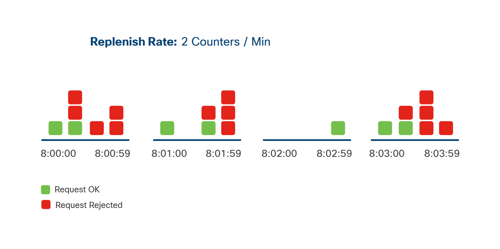

<!-- 4.6.1 -->
## Что такое ограничения скорости?

REST API позволяют создавать сложные взаимодействия.

Использование ограничения скорости API - это способ для веб-службы контролировать количество запросов, которые пользователь или приложение может сделать за определенную единицу времени. Внедрение ограничений скорости - лучшая практика для общедоступных и неограниченных API. Ограничение скорости помогает:

* избежать перегрузки сервера из-за слишком большого количества запросов одновременно
* обеспечить лучшее обслуживание и время отклика для всех пользователей
* защита от атак типа отказ в обслуживании (DoS)

Пользователи API должны понимать различные реализации алгоритмов ограничения скорости, чтобы избежать выхода за пределы, но приложения также должны корректно обрабатывать ситуации, в которых эти ограничения превышаются.

<!-- 4.6.2 -->
## Алгоритмы ограничения скорости

Не существует стандартного способа реализации ограничения скорости, но распространенные алгоритмы включают:

* Дырявое ведро
* Ведро токенов
* Фиксированный счетчик окон
* Счетчик раздвижных окон

### Дырявое ведро

<!-- /courses/devnet/337c1050-b012-11ea-8a1b-c929643d7563/339f76d0-b012-11ea-8a1b-c929643d7563/assets/9780d9b4-bcc3-11ea-af32-dfde9d560aae.svg -->

Визуальное представление алгоритма дырявого ведра

<!-- /courses/devnet/337c1050-b012-11ea-8a1b-c929643d7563/339f76d0-b012-11ea-8a1b-c929643d7563/assets/9780d9b5-bcc3-11ea-af32-dfde9d560aae.svg -->
Пример алгоритма дырявого ведра

Алгоритм дырявого ведра помещает все входящие запросы в очередь запросов в том порядке, в котором они были получены. Входящие запросы могут поступать с любой скоростью, но сервер будет обрабатывать запросы из очереди с фиксированной скоростью. Если очередь запросов заполнена, запрос отклоняется.

При использовании этого алгоритма клиент должен быть готов к отложенным ответам или отклоненным запросам.

### Ведро токенов

<!-- /courses/devnet/337c1050-b012-11ea-8a1b-c929643d7563/339f76d0-b012-11ea-8a1b-c929643d7563/assets/9780d9b6-bcc3-11ea-af32-dfde9d560aae.svg -->

Модель алгоритма Token Bucket

<!-- /courses/devnet/337c1050-b012-11ea-8a1b-c929643d7563/339f76d0-b012-11ea-8a1b-c929643d7563/assets/9780d9b7-bcc3-11ea-af32-dfde9d560aae.svg -->

Пример алгоритма token bucket

Алгоритм сегмента токенов дает каждому пользователю определенное количество токенов, которые они могут использовать в течение определенного промежутка времени, и эти токены накапливаются до тех пор, пока они не будут использованы. Когда клиент делает запрос, сервер проверяет корзину, чтобы убедиться, что она содержит хотя бы один токен. Если это так, он удаляет этот токен и обрабатывает запрос. Если токен недоступен, он отклоняет запрос.

Все запросы, сделанные до пополнения токена, будут отклонены. После пополнения токенов пользователь может снова делать запросы.

Например, API, использующий алгоритм Token Bucket, устанавливает ограничение скорости в 10 запросов на клиента в час. Если клиент сделает 11 запросов в течение часа, 11-й запрос будет отклонен, так как токенов не останется. С другой стороны, если клиент затем не делает запросов в течение 6 часов, он может сделать 60 запросов одновременно, потому что эти токены накопились.

С помощью этого алгоритма клиент должен рассчитать, сколько токенов у него в настоящее время, чтобы избежать отклоненных запросов. Он также должен обрабатывать потенциально отклоненные запросы, встраивая механизм повтора, когда токены пополняются.

### Фиксированный счетчик окон

<!-- /courses/devnet/337c1050-b012-11ea-8a1b-c929643d7563/339f76d0-b012-11ea-8a1b-c929643d7563/assets/9780d9b8-bcc3-11ea-af32-dfde9d560aae.svg -->

Алгоритм счетчика с фиксированным окном похож на алгоритм token bucket, за исключением двух основных отличий:

* Он использует счетчик, а не набор токенов.
* Счетчик не накапливается.

Для этого алгоритма фиксированному временному окну назначается счетчик, показывающий, сколько запросов может быть обработано за этот период. Когда сервер получает запрос, счетчик текущего окна времени проверяется, чтобы убедиться, что он не равен нулю. При обработке запроса счетчик списывается. Если предел для этого временного окна соблюден, все последующие запросы в течение этого временного окна будут отклонены. Когда начнется следующее временное окно, счетчик вернется к заранее заданному значению, и запросы можно будет обрабатывать снова.

Чтобы вернуться к нашему предыдущему примеру с 10 запросами в час с использованием этого алгоритма, 11-й запрос за час все равно будет отклонен, но после 6 часов без запросов клиент все еще может сделать только 10 запросов за один час, потому что неиспользованные запросы не накапливались.

С помощью этого алгоритма клиент должен знать, когда начинается и заканчивается временное окно, чтобы он знал, сколько запросов может быть выполнено в течение этого периода времени. Так же, как алгоритм ведра токенов, клиент должен создать механизм повтора, чтобы он мог повторить запросы, когда начнется следующее окно времени.

### Счетчик раздвижных окон

<!--  -->

Алгоритм счетчика скользящего окна позволяет делать фиксированное количество запросов за установленный промежуток времени. Этот промежуток времени не является фиксированным окном, и счетчик не пополняется, когда окно начинается снова. В этом алгоритме сервер сохраняет временную метку при выполнении запроса. Когда делается новый запрос, сервер подсчитывает, сколько запросов уже было сделано с начала окна до текущего времени, чтобы определить, должен ли запрос быть обработан или отклонен. Например, если скорость составляет пять запросов в минуту, когда сервер получает новый запрос, он проверяет, сколько запросов было сделано за последние 60 секунд. Если уже было сделано пять запросов, новый запрос будет отклонен.

Благодаря этому алгоритму клиенту не нужно знать, когда начинается и заканчивается временное окно. Ему просто нужно убедиться, что лимит скорости не был превышен во время запроса. Клиенту также необходимо разработать способ задержки запросов, если это необходимо, чтобы она не превышала допустимую скорость, и, конечно же, учитывать отклоненные запросы.

<!-- 4.6.3 -->
## Знание предела скорости

Документация API обычно предоставляет подробную информацию об ограничении скорости и единице времени. Кроме того, многие API, ограничивающие скорость, добавляют подробности об ограничении скорости в заголовок ответа. Поскольку стандарта нет, пара "ключ-значение", используемая в заголовке, может отличаться в зависимости от API. Вот некоторые часто используемые ключи:

* **X-RateLimit-Limit**: Максимальное количество запросов, которое может быть выполнено за указанную единицу времени.
* **X-RateLimit-Remaining**: Количество оставшихся запросов, которые запрашивающая сторона может сделать в текущем окне ограничения скорости.
* **X-RateLimit-Reset**: Время сброса окна ограничения скорости.

Клиент может использовать эту информацию, чтобы отслеживать, сколько еще запросов API он может сделать в текущем окне, помогая клиенту избежать превышения предела скорости.

<!-- 4.6.4 -->
## Превышение предела скорости

Когда лимит скорости превышен, сервер автоматически отклоняет запрос и отправляет ответ HTTP, информирующий пользователя. Кроме того, часто в ответ, содержащий ошибку «превышен предел скорости», также содержится значимый код состояния HTTP. К сожалению, поскольку для этого взаимодействия нет стандарта, сервер может выбрать, какой код состояния отправлять. Наиболее часто используемые коды состояния HTTP: `429: Too Many Requests` или `403: Forbidden`; убедитесь, что ваш клиент запрограммирован для конкретного API, который он использует.
