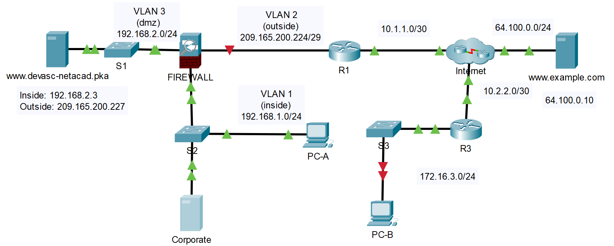

## Топология



## Таблица адресации

| Устройство     | Интерфейс     | IPv4-адрес           | Маска подсети   | Шлюз по умолчанию |
|----------------|---------------|----------------------|-----------------|-------------------|
| R1             | G0/0/0        | 209.165.200.225      | 255.255.255.248 | Н/Д               |
| R1             | G0/0/1        | 10.1.1.2             | 255.255.255.252 | Н/Д               |
| R3             | G0/0/0        | 10.2.2.2             | 255.255.255.252 | Н/Д               |
| R3             | G0/0/1        | 172.16.3.1           | 255.255.255.0   | Н/Д               |
| FIREWALL       | VLAN1         | 192.168.1.1          | 255.255.255.0   | Н/Д               |
| FIREWALL       | VLAN2         | 209.165.200.226      | 255.255.255.248 | Н/Д               |
| FIREWALL       | VLAN3         | 192.168.2.1          | 255.255.255.0   | Н/Д               |
| DEVASC Server  | сетевая карта | IN: 192.168.2.3      | 255.255.255.0   | 192.168.1.1       |
| DEVASC Server  | VLAN1         | OUT: 209.165.200.227 | 255.255.255.248 | 209.165.200.225   |
| Example Server | сетевая карта | 64.100.0.10          | 255.255.255.0   | 64.100.0.1        |
| PC-A           | сетевая карта | DHCP назначен        | 255.255.255.0   | 192.168.1.1       |
| PC-B           | сетевая карта | 172.16.3.2           | 255.255.255.0   | 172.16.3.1        |

## Цели

-   **Часть 1. Проверка подключения**
-   **Часть 2. Устранение неполадок R3**
-   **Часть 3. Устранение неполадок R1**
-   **Часть 4. Устранение неполадок DNS**

## Предыстория/сценарий

Сети имеют множество компонентов, работающих вместе для обеспечения связи и доставки данных. Часто эти компоненты могут работать неправильно. Это может быть связано как с простой неправильной настройкой устройства, так и с множеством, казалось бы, не связанных между собой проблем, которые необходимо систематически решать. Как разработчику, вам может потребоваться устранить проблемы с сетью, чтобы восстановить подключение. Для устранения неполадок в сети необходимо использовать пошаговый методический подход, используя подсказки для определения проблемы и реализации решения. Часто вы можете обнаружить более одной проблемы, препятствующей работе соединения.

>   **Примечание**. В этом упражнении два веб-сервера называются **DEVASC Server** и **Example Server**. В топологии они называются по URL-адресу: **www.devasc-netacad.pka** и **www.example.com**.

## Инструкции

### Часть 1. Проверить подключение

В этой части вы находитесь на PC-B и пытаетесь получить доступ к веб-странице **DEVASC Server**.

**Шаг 1. Проверьте подключение к сети.**

1.  Нажмите **PC-B**.
2.  Щелкните **Desktop**.
3.  Щелкните **Web Browser**.
4.  Введите **www.devasc-netacad.pka** в поле URL и нажмите **Go**.

    Запрос веб-страницы не будет работать. Между PC-B и сервером может возникнуть одна или несколько различных проблем. Мы начнем устранение неполадок с PC-B и перейдем к серверу, устраняя неполадки по ходу дела.

**Шаг 2. Устраните неполадки базовой конфигурации PC-B.**

В рабочей области Packet Tracer видно, что соединение между PC-B и S3 имеет красные значки. Это означает, что соединение между ними физически отключено или TCP/IP неправильно настроен на PC-B. Сначала начните с устранения неполадок в стеке протоколов.

1.  Нажмите **PC-B**.
2.  Закройте **Web Browser**, если он открыт.
3.  Щелкните **Command Prompt**.
4.  Пропингуйте адрес обратной связи, чтобы убедиться, что TCP/IP установлен и работает правильно.

    ```
    C:\>ping 127.0.0.1

    Pinging 127.0.0.1 with 32 bytes of data:

    Reply from 127.0.0.1: bytes=32 time=3ms TTL=128
    Reply from 127.0.0.1: bytes=32 time=16ms TTL=128
    Reply from 127.0.0.1: bytes=32 time=3ms TTL=128
    Reply from 127.0.0.1: bytes=32 time=3ms TTL=128

    Ping statistics for 127.0.0.1:
        Packets: Sent = 4, Received = 4, Lost = 0 (0% loss),
    Approximate round trip times in milli-seconds:
        Minimum = 3ms, Maximum = 16ms, Average = 6ms

    C:\>
    ```

    Поскольку были успешные ответы, мы знаем, что TCP/IP установлен и работает правильно. Это означает, что, скорее всего, либо порт Ethernet на PC-B, либо на S3 не включен.

1.  Щелкните **Config** на **PC-B**.
2.  Нажмите **FastEthernet0**.
3.  Состояние порта выключено. Щелкните **On** рядом с **Port Status**, чтобы включить интерфейс.

    Обратите внимание, что значки между PC-B и S3 через несколько секунд становятся зелеными, указывая на связь между двумя устройствами.

4.  Щелкните **Desktop**.
5.  Закройте окно **Command** **Prompt.**

**Шаг 3. Проверьте конфигурацию IP.**

1.  Щелкните **IP Configuration**.
2.  Вам должен быть предоставлен IP-адрес, если в сети есть DHCP-сервер.

    Обратите внимание, что запрос DHCP не выполнен. Поскольку PC-B не может подключиться к DHCP-серверу, вам потребуется предоставить информацию о статическом IP-адресе.

3.  Щелкните переключатель рядом с **Static**, чтобы назначить интерфейсу информацию о конфигурации IP:

    IP-адрес: 172.16.3.2

    Маска подсети: 255.255.255.0

    Шлюз по умолчанию: 172.16.3.1

    DNS-сервер: 64.100.0.10

    Теперь у вас есть правильная информация для доступа к шлюзу по умолчанию.

4.  Закройте **IP Configuration** и щелкните **Web Browser**.
5.  Введите **www.devasc-netacad.pka** в поле URL и нажмите **Go**.

    Опять запрос не проходит.

### Часть 2. Устранение неполадок R3

В этой части вы проверите подключение к следующему сетевому устройству, **R3**, чтобы продолжить устранение неполадок.

**Шаг 1. Связь со шлюзом по умолчанию.**

1.  Закройте **Web Browser**, если он открыт.
2.  Щелкните **Command Prompt**.
3.  Пропингуйте шлюз по умолчанию.

    ```
    C:\>ping 172.16.3.1

    Pinging 172.16.3.1 with 32 bytes of data:

    Request timed out.
    Request timed out.
    Request timed out.
    Request timed out.

    Ping statistics for 172.16.3.1:
        Packets: Sent = 4, Received = 0, Lost = 4 (100% loss),

    C:\>
    ```

    Вы знаете, что информация об IP-адресации на PC-B верна, что интерфейс включен и что стек TCP/IP работает правильно. Должно быть что-то не так со шлюзом по умолчанию, препятствующим обмену данными.

**Шаг 2. Проверьте конфигурацию IP маршрутизатора R3.**

1.  Щелкните **R3**.
2.  Щелкните **Config**.
3.  Щелкните **GigabitEthernet0/0/1**. Это интерфейс, подключенный к сети 172.16.3.0/24.

    Интерфейс работает, и для него есть информация об IP-адресации, но она неверна для сети 172.16.3.0.

4.  Измените IP-адрес интерфейса на **172.16.3.1**.

**Шаг 3. Проверьте подключение.**

1.  Вернитесь к **PC-B** и снова пропингуйте шлюз по умолчанию, чтобы убедиться, что связь между устройствами работает.

    ```
    C:\>ping 172.16.3.1

    Pinging 172.16.3.1 with 32 bytes of data:

    Reply from 172.16.3.1: bytes=32 time<1ms TTL=255
    Reply from 172.16.3.1: bytes=32 time<1ms TTL=255
    Reply from 172.16.3.1: bytes=32 time=2ms TTL=255
    Reply from 172.16.3.1: bytes=32 time<1ms TTL=255

    Ping statistics for 172.16.3.1:
        Packets: Sent = 4, Received = 4, Lost = 0 (0% loss),
    Approximate round trip times in milli-seconds:
        Minimum = 0ms, Maximum = 2ms, Average = 0ms

    C:\>
    ```

    Отлично! Теперь у нас есть связь между PC-B и шлюзом по умолчанию.

1.  Вернитесь в **Web Browser** на **PC-B** и снова попытайтесь подключиться к веб-странице **www.devasc-netacad.pka** на **DEVASC Server**.

    Она все еще не работает.

### Часть 3. Устранение неполадок R1

В этой части вы продолжите устранение неполадок на следующем устройстве на пути, **R1**, поскольку у вас нет никакого контроля над устройствами в интернет-облаке.

**Шаг 1. Проверьте базовую конфигурацию маршрутизатора R1.**

Глядя на рабочую область Packet Tracer, мы видим, что существует физическая проблема с кабелем между **R1** и **FIREWALL**.

1.  Нажмите **R1**, а затем вкладку **Config.**
2.  Проверьте состояние **Port Status** каждого интерфейса.

    Порты включены.

    Сеть между устройствами 209.165.200.224/29. IP-адреса портов на обоих концах кабеля должны находиться в этом диапазоне для осуществления связи.

**Шаг 2. Проверьте кабель.**

1.  Наведите курсор на **FIREWALL**.

    VLAN2 имеет приемлемый IP-адрес, и связь установлена.

2.  Наведите курсор на **R1**.

    G0/0/0 имеет приемлемый IP-адрес, и связь установлена. Проблема в самом кабеле. Возможно, он поврежден или подключен к неправильному порту.

    Вам потребуется повторно подключить кабельное соединение между устройствами.

**Шаг 3. Замените кабель.**

1.  Не забудьте щелкнуть любое пустое место в топологии, чтобы отменить выбор любых устройств, которые могут быть выбраны в данный момент. Затем используйте инструмент **Delete**, чтобы удалить кабель между маршрутизатором R1 и **FIREWALL**.
2.  Щелкните **Connections**.
3.  Щелкните **Copper Straight-Through**, а затем щелкните **FIREWALL**.
4.  Выберите **Ethernet0/0** для подключения. Это порт, назначенный 209.165.200.224/29 (VLAN1).
5.  Нажмите **R1**.
6.  Выберите порт **GigabitEthernet0/0/0**. Это порт, назначенный 209.165.200.224/29.

    Теперь вы должны увидеть значки с обеих сторон кабеля, и вскоре они станут зелеными.

**Шаг 4. Проверьте подключение.**

1.  Вернитесь в **Web Browser** на PC-B и попытайтесь открыть веб-страницу **DEVASC Server**.

    Это все еще не работает. Чтобы выяснить, является ли это проблемой соединения или проблемы протокола, попробуйте пропинговать IP-адрес **DEVASC Server**.

2.  Вернуться к **команде** **Подскажите**.
3.  IP-адрес **DEVASC Server**. В Packet Tracer первый набор эхо-запросов может завершиться ошибкой до тех пор, пока сеть не сойдется.

    ```
    C:\> ping 209.165.200.225

    Pinging 209.165.200.225 with 32 bytes of data:

    Request timed out.
    Request timed out.
    Request timed out.
    Request timed out.

    Ping statistics for 209.165.200.225:
        Packets: Sent = 4, Received = 0, Lost = 4 (100% loss),

    C:\> ping 209.165.200.225

    Pinging 209.165.200.225 with 32 bytes of data:

    Reply from 209.165.200.225: bytes=32 time<1ms TTL=253
    Reply from 209.165.200.225: bytes=32 time=1ms TTL=253
    Reply from 209.165.200.225: bytes=32 time<1ms TTL=253
    Reply from 209.165.200.225: bytes=32 time<1ms TTL=253

    Ping statistics for 209.165.200.225:
        Packets: Sent = 4, Received = 4, Lost = 0 (0% loss),
    Approximate round trip times in milli-seconds:
        Minimum = 0ms, Maximum = 1ms, Average = 0ms

    C:\>
    ```

    Это то, что вы хотели увидеть. Мы проходим весь путь до **DEVASC Server** и обратно с помощью ICMP. Это говорит о том, что может быть что-то не так с конфигурацией DNS.

### Часть 4. Устранение неполадок DNS

**Шаг 1. Проверьте подключение к веб-серверу.**

Поскольку существует возможность подключения PC-B к **DEVASC Server.** используя ICMP, вы знаете обо всех физических проблемах и проблемах с конфигурацией, препятствующих соединениям, до того, как они будут решены. Это означает, что, скорее всего, проблема с протоколом препятствует отображению веб-страницы.

1.  Откройте **Web Browser** на **PC-B**.
2.  Введите IP-адрес сервера DEVASC вместе с портом, к которому вы хотите подключиться: 80.

    209.165.200.227:80

    Вы получите ответ от сервера.

    ```
    Request Timeout
    ```

    Веб-страница не отвечает на порт 80. В предыдущей лабораторной работе сервер был настроен для подключения только с использованием безопасного HTTP (HTTPS). Это было сделано для того, чтобы брандмауэр не перенаправлял трафик на незашифрованный порт 80. Вам нужно использовать HTTPS для подключения к веб-странице:

    https://209.165.200.227

    Через несколько секунд веб-страница наконец отобразится!

    Скорее всего проблема в настройках DNS.

**Шаг 2. Проверьте DNS.**

1.  На **PC-B** откройте **IP Configuration**.
2.  Убедитесь, что **DNS Server** установлен на 64.100.0.10.
3.  Поскольку он настроен правильно, проверьте настройку параметров DNS на **Example Server**.

**Шаг 3. Проверьте конфигурацию DNS-сервера.**

1.  Щелкните **Example** **Server**.
2.  Щелкните **Services**.
3.  Щелкните **DNS**.

    Записей DNS нет, и служба отключена .

4.  Добавьте запись для **DEVASC Server** с **именем**, установленным на **www.devasc-netacad.pka,** и **адресом**, установленным на 209.165.200.227. Затем нажмите **Add**.

    Несмотря на то, что запись теперь верна, DNS не был включен.

5.  Включите **DNS**.
6.  Вернитесь к **PC-B**, откройте **Web Browser** и введите **https://www.devasc-netacad.pka** в поле **URL**. Убедитесь, что вы добавили https://, так как брандмауэр разрешает только безопасный веб-трафик.

    Теперь вы увидите, что веб-страница доступна через DNS через сеть.
