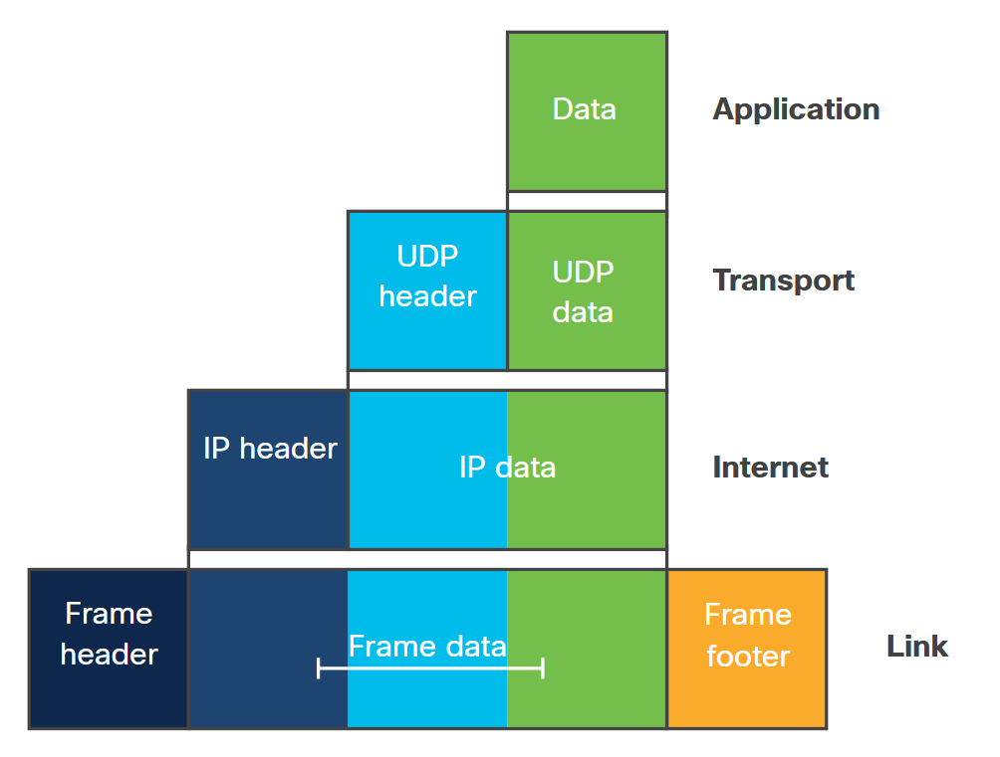
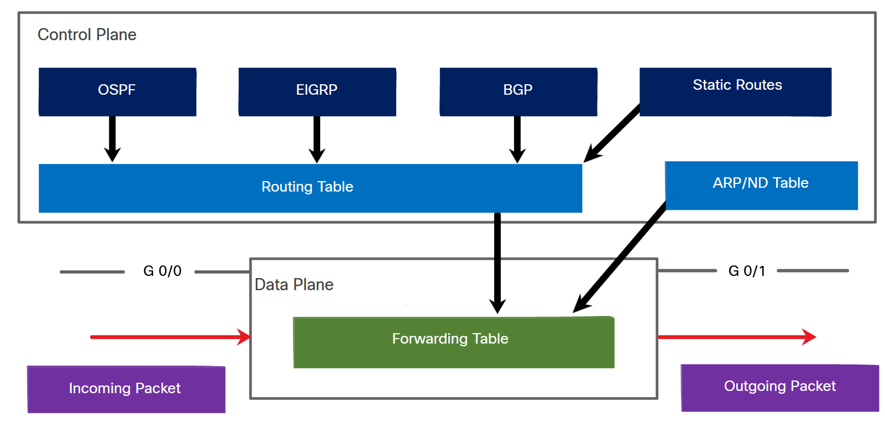

<!-- 5.1.1 -->
## Обзор

Для конечных пользователей сети они просто хотят, чтобы она работала. Разработчики более любопытны и часто сами решают проблемы с подключением. Сетевые администраторы извлекают выгоду из методов, которые автоматически и программно управляют и развертывают конфигурации сети, включая сценарии нулевого дня.

Производительность важна для всех, независимо от их точки зрения. Благодаря автоматизации вы можете ускорить развертывание. С помощью мониторинга приложений вы можете быстрее устранять неполадки. Знание того, как устранять неполадки сетевого подключения, имеет решающее значение как для разработчиков, так и для администраторов, поэтому быстрое решение проблем имеет решающее значение для всех.

В этом разделе рассматриваются фундаментальные части сети. Вы хотите знать, какие стандарты используются для сетей, чтобы убедиться, что у вас есть правильный словарный запас, чтобы говорить о сетевых проблемах или решениях с кем-либо в любой команде. Понимание высокого уровня уровней, через которые проходит сетевой трафик, дает вам фору в знаниях, необходимых для работы с сетями, приложениями и автоматизацией.

<!-- 5.1.2 -->
## Что такое сеть?

Сеть состоит из оконечных устройств, таких как компьютеры, мобильные устройства и принтеры. Эти устройства соединены сетевыми устройствами, такими как коммутаторы и маршрутизаторы. Сеть позволяет устройствам связываться друг с другом и обмениваться данными. Есть много способов подключиться к сети. Наиболее распространенные методы локальной сети (LAN), определенные Институтом инженеров по электротехнике и электронике (IEEE), - это проводные локальные сети Ethernet (IEEE 802.3) и беспроводные локальные сети (IEEE 802.11). Эти оконечные устройства подключаются к сети с помощью Ethernet или беспроводной сетевой карты (NIC).

Сетевые адаптеры Ethernet подключаются к сети через зарегистрированные порты jack 45 (RJ-45) и кабели Ethernet с витой парой. Беспроводные сетевые адаптеры подключаются к сети с помощью беспроводных радиосигналов в полосах частот 2,4 ГГц или чаще 5 ГГц.

### Протоколы

Набор протоколов - это набор протоколов, которые работают вместе для предоставления комплексных услуг сетевой связи. С 1970-х годов появилось несколько различных наборов протоколов, некоторые из которых были разработаны организацией по стандартизации, а другие - различными поставщиками. В ходе развития сетевых коммуникаций и Интернета появилось несколько конкурирующих наборов протоколов:

* **Пакет Интернет-протокола или TCP/IP** - Модель протокола TCP/IP для межсетевого взаимодействия была создана в начале 1970-х годов и иногда упоминается как модель Интернета. Это наиболее распространенный и актуальный набор протоколов, используемый сегодня. Набор протоколов TCP/IP - это открытый стандартный набор протоколов, поддерживаемый Инженерной группой Интернета (IETF).
* **Протоколы взаимодействия открытых систем (OSI)** - Это семейство протоколов, разработанное совместно в 1977 году Международной организацией по стандартизации (ISO) и Международным союзом электросвязи (ITU). Протоколы OSI включают семиуровневую модель, называемую эталонной моделью OSI. Эталонная модель OSI классифицирует функции своих протоколов. Сегодня OSI в основном известна своей многоуровневой моделью. Протоколы OSI в значительной степени были заменены TCP/IP.
* **AppleTalk** - Недолговечный набор проприетарных протоколов, выпущенный Apple Inc. в 1985 году для устройств Apple. В 1995 году Apple заменила AppleTalk на TCP/IP.
* **Novell NetWare** - Недолговечный проприетарный набор протоколов и сетевая операционная система, разработанные Novell Inc. в 1983 году с использованием сетевого протокола IPX. В 1995 году Novell заменила IPX протоколом TCP/IP.

Сегодня модель OSI и модель TCP/IP, показанные на рисунке, используются для описания сетевых операций.

<!-- /courses/devnet/9c5edeb0-ba29-11ea-b646-8dfbdd4ba015/9c6ee440-ba29-11ea-b646-8dfbdd4ba015/assets/2dc319f2-1c25-11ea-81a0-ffc2c49b96bc.svg -->

Модели OSI и TCP/IP используют уровни для описания функций и служб, которые могут выполняться на этом уровне. Эти модели обеспечивают согласованность во всех типах сетевых протоколов и служб, описывая, что должно быть сделано на определенном уровне, но не предписывая, как это должно быть выполнено. Он также описывает взаимодействие каждого уровня с уровнями непосредственно выше и ниже.

Обе модели могут использоваться со следующими отличиями:

* Модель OSI нумерует каждый уровень.
* Модель TCP/IP использует один прикладной уровень, объединяющий сеансовый, представительский и прикладной уровни модели OSI.
* Модель TCP/IP использует уровень сетевого доступа, объединяюший канальный и физический уровни модели OSI.
* Сетевой уровень модели OSI соответствует межсетевому уровню модели TCP/IP.

<!-- /courses/devnet/9c5edeb0-ba29-11ea-b646-8dfbdd4ba015/9c6ee440-ba29-11ea-b646-8dfbdd4ba015/assets/acdd35c0-c04b-11ea-91bd-4b7461d9a91b.svg -->
Форма, которую принимает часть данных на любом уровне, называется блоком данных протокола (PDU). Во время инкапсуляции каждый последующий уровень инкапсулирует PDU, который он получает с вышележащего уровня в соответствии с используемым протоколом. Когда сообщения отправляются по сети, процесс инкапсуляции работает сверху вниз, как показано на рисунке.

<!-- /courses/devnet/9c5edeb0-ba29-11ea-b646-8dfbdd4ba015/9c6ee440-ba29-11ea-b646-8dfbdd4ba015/assets/acdd83e0-c04b-11ea-91bd-4b7461d9a91b.svg -->

На каждом этапе процесса PDU имеет другое имя, отражающее его новые функции. Как правило, PDU именуются в соответствии со следующими уровнями:

* **Данные** - Общий термин для PDU, используемый на прикладном уровне.
* **Сегмент** - PDU транспортного уровня
* **Пакет** - PDU сетевого уровня
* **Кадр** - PDU уровня канала передачи данных
* **Биты** - PDU физического уровня, используемый при физической передаче данных по среде

На каждом уровне информация верхнего уровня считается данными в инкапсулированном протоколе. Например, сегмент транспортного уровня считается данными в пакете интернет-уровня. В этом случае пакет считается данными в кадре канального уровня.

Преимущество многоуровневого процесса передачи данных - это абстракция, которая может быть реализована с его помощью. Для каждого уровня могут быть разработаны разные протоколы и при необходимости заменены. Пока протокол предоставляет функции, ожидаемые на уровне выше, реализация может быть абстрагирована и скрыта от других уровней. Абстракция протокола и сервисов в этих моделях осуществляется посредством инкапсуляции.

Как правило, приложение использует набор протоколов для отправки данных с одного хоста на другой. Спускаясь по уровням, от верхнего к нижнему на хосте-отправителе, а затем по обратному пути от нижнего уровня до верхнего уровня на принимающем хосте, на каждом слое данные инкапсулируются.

На каждом уровне протоколы выполняют функции, необходимые для этого конкретного уровня. Ниже описываются функциональные возможности каждого уровня модели OSI, начиная с уровня 1.

> **Примечание**: Уровень модели OSI часто называют его номером.

### Физический уровень (уровень 1)

Этот уровень отвечает за передачу и прием необработанных битовых потоков. На этом уровне передаваемые данные преобразуются в электрические, радио или оптические сигналы. Спецификации физического уровня определяют уровни напряжения, физические скорости передачи данных, схему модуляции, расположение выводов для кабельных разъемов, спецификации кабеля и многое другое. Ethernet, Bluetooth и универсальная последовательная шина (USB) являются примерами протоколов, которые имеют спецификации для физического уровня.

### Канальный уровень (уровень 2)

Этот уровень обеспечивает связь между сетевыми адаптерами в одной сети. Спецификация канального уровня определяет протоколы для установления и завершения соединений, а также управление потоком между двумя физически подключенными устройствами. IEEE имеет несколько протоколов, определенных для уровня канала передачи данных. Семейство протоколов IEEE 802, которое включает Ethernet и беспроводные локальные сети (WLAN), подразделяет этот уровень на два подуровня:

* **Подуровень управления доступом к среде (MAC)** - Подуровень MAC отвечает за управление тем, как устройства в сети получают доступ к среде передачи и получают разрешение на передачу данных.
* **Подуровень Logical Link Control (LLC)** - Подуровень LLC отвечает за идентификацию и инкапсуляцию протоколов сетевого уровня, средства контроля ошибок и синхронизацию кадров. Протоколы IEEE 802.3 Ethernet, 802.11 Wi-Fi и 802.15.4 ZigBee работают на канальном уровне. Подуровень MAC на уровне канала данных критически важен в средах широковещательной передачи (таких как беспроводная передача), в которых необходимо тщательно реализовать управление средой передачи.

### Сетевой уровень (уровень 3)

Этот уровень предоставляет услуги адресации и маршрутизации, позволяющие конечным устройствам обмениваться данными между сетями. IP версии 4 (IPv4) и IP версии 6 (IPv6) являются основными протоколами адресации сетевого уровня. Такие протоколы, как Open Shortest Path First (OSPF) и Border Gateway Protocol (BGP), предоставляют услуги маршрутизации.

Для осуществления сквозной связи через границы сети протоколы сетевого уровня выполняют две основные функции:

* **Обращение** - Все устройства должны иметь уникальный IP-адрес для идентификации в сети.
* **Маршрутизация** - Протоколы маршрутизации предоставляют услуги для направления пакетов на конечный хост в другой сети. Для передачи в другие сети пакет должен быть обработан маршрутизатором. Роль маршрутизатора заключается в выборе наилучшего пути и пересылке пакетов на хост назначения в процессе, известном как маршрутизация. Пакет может пройти через множество маршрутизаторов, прежде чем достигнет хоста назначения. Каждый маршрутизатор, через который проходит пакет для достижения хоста назначения, называется переходом.

Сетевой уровень также включает протокол управляющих сообщений Интернета (ICMP) для предоставления услуг обмена сообщениями, например, для проверки возможности подключения используйте `ping` или найдите путь между источником и местом назначения с помощью команды `traceroute`.

### Транспортный уровень (уровень 4)

Транспортный уровень определяет службы для сегментации, передачи и повторной сборки данных для индивидуальной связи между конечными устройствами. Этот уровень имеет два протокола: протокол управления передачей (TCP) и протокол дейтаграмм пользователя (UDP).

TCP обеспечивает надежность и управление потоком с помощью следующих основных операций:

* Нумерация и отслеживание сегментов данных, передаваемых на конкретный хост из определенного приложения.
* Подтверждение полученных данные.
* Повторная передача любых неподтвержденных данных через определенное время.
* Упорядочение последовательности, которые могут поступать в неправильном порядке.
* Отправка данных с эффективной скоростью, приемлемой для получателя.

TCP используется с такими приложениями, как базы данных, веб-браузеры и почтовые клиенты. TCP требует, чтобы все отправляемые данные поступали в пункт назначения в исходном состоянии. Любые отсутствующие данные могут повредить сообщение, сделав его неполным или нечитаемым.

UDP - это более простой протокол транспортного уровня, чем TCP. Он не обеспечивает надежности и управления потоком, а значит, требует меньшего количества полей заголовка. Дейтаграммы UDP могут обрабатываться быстрее, чем сегменты TCP.

UDP предпочтительнее для таких приложений, как передача голоса по IP (VoIP). Подтверждения и повторная передача замедлили бы доставку и сделали бы голосовой разговор неприемлемым. UDP также используется приложениями запроса и ответа, в которых данные минимальны, а повторная передача может быть выполнена быстро. Служба доменных имен (DNS) использует UDP для этого типа транзакции.

Разработчики приложений должны выбрать подходящий тип транспортного протокола в зависимости от требований приложений. Видео можно отправлять по TCP или UDP. Приложения, которые транслируют сохраненные аудио и видео, обычно используют TCP. Приложение использует TCP для выполнения буферизации, проверки пропускной способности и контроля перегрузки, чтобы лучше контролировать взаимодействие с пользователем.

### Сессионный уровень (уровень 5)

Сеансовый уровень предоставляет приложениям механизмы для установления сеансов между двумя хостами. В рамках этих сквозных сеансов могут быть предложены различные услуги. Функции сеансового уровня отслеживают, чья очередь передавать данные, следят за тем, чтобы две стороны не пытались выполнить одну и ту же операцию одновременно, выбирают передачу, которая не удалась, с того момента, когда она не удалась, и завершают передачу. Сеансовый уровень явно реализован в приложениях, использующих удаленные вызовы процедур (RPC).

### Уровень презентации (уровень 6)

Уровень представления определяет контекст между объектами уровня приложения. До сих пор уровни модели OSI в основном имели дело с перемещением битов с исходного хоста на целевой. Уровень представления связан с синтаксисом и семантикой передаваемой информации, а также с тем, как эта информация организована. На этом уровне выполняется различие между типом данных, кодированных для передачи, например текстовыми файлами, двоичными файлами или видеофайлами.

### Уровень приложения (уровень 7)

Прикладной уровень - это уровень OSI, ближайший к конечному пользователю и содержащий множество протоколов, обычно необходимых пользователям. Одним из широко используемых протоколов приложений является протокол передачи гипертекста (HTTP) и его безопасная версия HTTPS. HTTP/HTTPS лежит в основе всемирной паутины (WWW). Обмен информацией между клиентским браузером и веб-сервером осуществляется с помощью HTTP. Когда клиентский браузер хочет отобразить веб-страницу, он отправляет имя страницы на сервер, на котором размещена страница, с помощью HTTP. Сервер отправляет веб-страницу обратно через HTTP. На протяжении многих лет разрабатывались другие протоколы для передачи файлов, электронной почты и другие.

Некоторые другие примеры протоколов, которые работают на прикладном уровне, включают протокол передачи файлов (FTP), используемый для передачи файлов между хостами, и протокол динамической конфигурации хоста (DHCP), используемый для динамического назначения IP-адресов хостам.

### Поток данных в многоуровневых моделях

<!-- /courses/devnet/9c5edeb0-ba29-11ea-b646-8dfbdd4ba015/9c6ee440-ba29-11ea-b646-8dfbdd4ba015/assets/acddaaf0-c04b-11ea-91bd-4b7461d9a91b.svg -->

Конечные устройства реализуют протоколы для всего «стека» уровней. Источник сообщения (данные) инкапсулирует данные с соответствующим заголовком/трейлером протокола на каждом уровне, в то время как конечный пункт назначения деинкапсулирует каждый заголовок/трейлер протокола для получения сообщения (данных).

Уровень доступа к сети (обозначенный как «Ссылка» на рисунке выше) работает в локальном сетевом соединении, к которому подключено конечное устройство. Он имеет дело с перемещением кадров от одной сетевой карты к другой сетевой карте в той же сети. На этом уровне работают коммутаторы Ethernet.

Интернет-уровень отвечает за отправку данных по потенциально нескольким удаленным сетям. Соединение физически разрозненных сетей называется межсетевым взаимодействием. Протоколы маршрутизации отвечают за отправку данных из исходной сети в целевую. Маршрутизаторы - это устройства, которые работают на уровне Интернета и выполняют функцию маршрутизации. Маршрутизаторы более подробно рассматриваются далее в этом модуле. IP работает на уровне Интернета в эталонной модели TCP/IP и выполняет две основные функции: адресацию и маршрутизацию.

Хосты идентифицируются по их IP-адресу. Для идентификации компьютеров сетевых узлов и определения их местонахождения в сети в настоящее время поддерживаются две системы адресации. IPv4 использует 32-битные адреса. Это означает, что можно идентифицировать примерно 4,3 миллиарда устройств. Сегодня к Интернету подключено более 4,3 миллиарда хостов, поэтому в конце 1990-х годов была разработана новая система адресации. IPv6 использует 128-битные адреса. Он был стандартизирован в 1998 году, а реализация началась в 2006 году. 128-битное адресное пространство IPv6 обеспечивает 340 ундециллионов адресов. В настоящее время в Интернете поддерживаются хосты с адресами IPv4 и IPv6.

Вторая функция интернет-уровня - маршрутизация пакетов. Эта функция означает отправку пакетов от источника к месту назначения путем пересылки их на следующий маршрутизатор, который находится ближе к конечному месту назначения. Благодаря этой функциональности уровень Интернета делает возможным межсетевое взаимодействие, соединение различных IP-сетей и, по сути, создание Интернета. Передача IP-пакетов на Интернет-уровне является оптимальной и ненадежной. Любая повторная передача или исправление ошибок должны выполняться более высокими уровнями на конечных устройствах, обычно TCP.

<!-- /courses/devnet/9c5edeb0-ba29-11ea-b646-8dfbdd4ba015/9c6ee440-ba29-11ea-b646-8dfbdd4ba015/assets/b37e3b63-6fa2-4d11-aaa9-6309365b1eee.svg -->

### Плоскости маршрутизатора

Логика маршрутизатора управляется тремя функциональными плоскостями: уровнем управления, уровнем управления и уровнем данных. Каждый из них предоставляет разные функции:

* **Плоскость управления** - Уровень управления управляет трафиком, предназначенным для самого сетевого устройства. Примеры включают Secure Shell (SSH) и простой протокол управления сетью (SNMP).
* **Плоскость управления** - Плоскость управления сетевого устройства обрабатывает трафик, необходимый для поддержания функциональности сетевой инфраструктуры. Уровень управления состоит из приложений и протоколов между сетевыми устройствами, таких как протоколы маршрутизации OSPF, BGP и протокол расширенной внутренней маршрутизации шлюза (EIGRP). Уровень управления обрабатывает данные в программном обеспечении.
* **Плоскость данных** - Плоскость данных - это плоскость пересылки, которая отвечает за коммутацию пакетов в оборудовании с использованием информации из плоскости управления. Уровень данных обрабатывает данные аппаратно.
