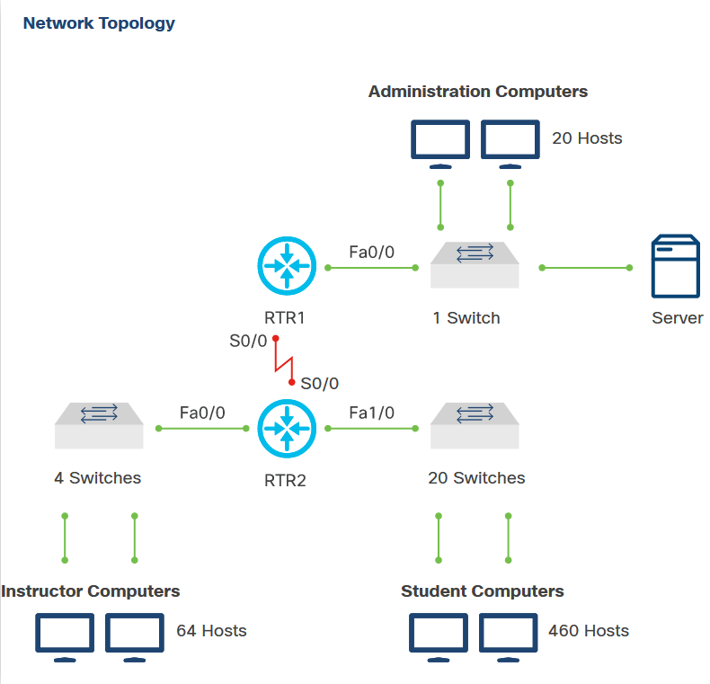
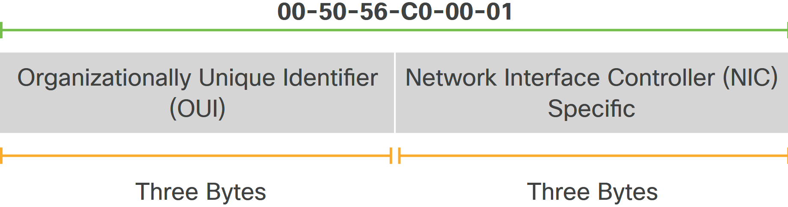
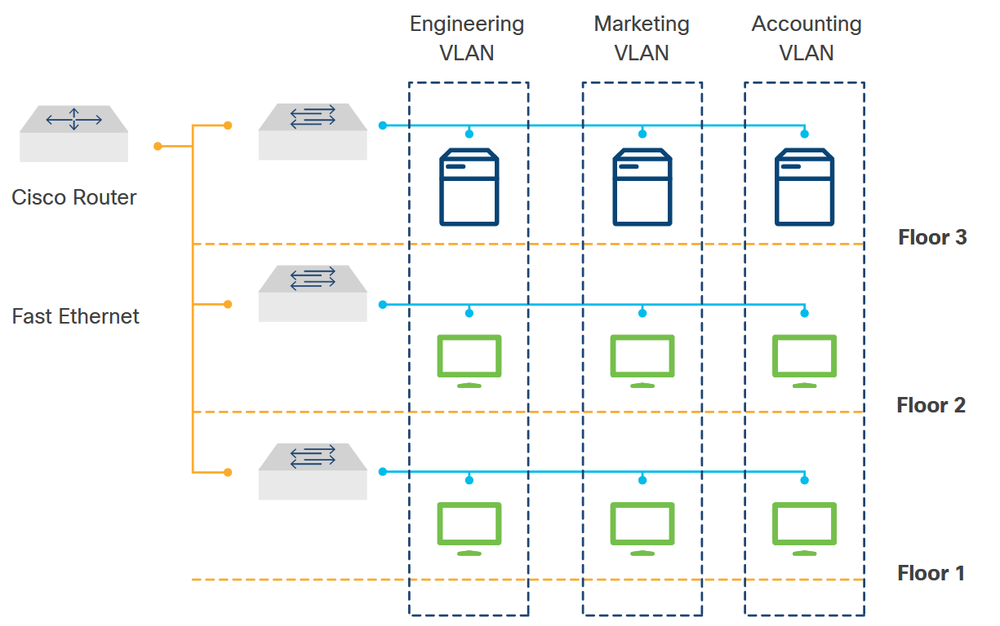

<!-- 5.2.1 -->
## Понимание уровня сетевого интерфейса

Сеть состоит из конечных устройств, таких как компьютеры, мобильные устройства и принтеры, которые соединены сетевыми устройствами, такими как коммутаторы и маршрутизаторы. Сеть позволяет устройствам связываться друг с другом и обмениваться данными, как показано на рисунке.

<!-- /courses/devnet/9c5edeb0-ba29-11ea-b646-8dfbdd4ba015/9ca2ec90-ba29-11ea-b646-8dfbdd4ba015/assets/acddd202-c04b-11ea-91bd-4b7461d9a91b.svg -->

На рисунке выше данные с компьютера ученика на компьютер преподавателя проходят через коммутатор к маршрутизатору (интерфейс FastEthernet 1/0), затем к следующему коммутатору (интерфейс FastEthernet 0/0) и, наконец, к компьютеру преподавателя.

Все хосты и сетевые устройства, которые соединены между собой в небольшой физической области, образуют локальную сеть. Сетевые устройства, соединяющие локальные сети на больших расстояниях, образуют глобальную сеть (WAN).

<!-- 5.2.2 -->
## Ethernet

Для подключения устройств в локальной сети требуется набор технологий. Наиболее распространенной технологией LAN является Ethernet. Ethernet - это не просто тип кабеля или протокола. Это сетевой стандарт, опубликованный IEEE. Ethernet - это набор рекомендаций и правил, которые позволяют различным сетевым компонентам работать вместе. Эти рекомендации определяют кабели и сигнализацию на физическом уровне и уровне канала передачи данных модели OSI. Например, стандарты Ethernet рекомендуют разные типы кабелей и определяют максимальную длину сегмента для каждого типа.

Протокол Ethernet работает с несколькими типами носителей: коаксиальный кабель, витая медная пара, одномодовая и многомодовая волоконная оптика.

Биты, которые передаются по локальной сети Ethernet, организованы в кадры. Формат кадра Ethernet показан на рисунке.

### Фрейм Ethernet

<!-- /courses/devnet/9c5edeb0-ba29-11ea-b646-8dfbdd4ba015/9ca2ec90-ba29-11ea-b646-8dfbdd4ba015/assets/acddaaf2-c04b-11ea-91bd-4b7461d9a91b.svg -->

В терминологии Ethernet контейнер, в который помещаются данные для передачи, называется фреймом. Кадр содержит информацию заголовка, информацию о конце и фактические данные, которые передаются.

На рисунке выше показаны наиболее важные поля кадра Ethernet:

* **Преамбула** - Это поле состоит из семи байтов чередующихся единиц и нулей, которые используются для синхронизации сигналов взаимодействующих компьютеров.
* **Разделитель начала кадра (SFD)** - Это 1-байтовое поле, которое отмечает конец преамбулы и указывает начало кадра Ethernet.
* **MAC-адрес назначения** - Поле адреса назначения имеет длину шесть байтов (48 бит) и содержит адрес сетевой карты в локальной сети, в которую отправляются инкапсулированные данные.
* **MAC-адрес источника** - Поле адреса источника имеет длину шесть байтов (48 бит) и содержит адрес сетевой карты отправляющего устройства.
* **Тип** - Это поле содержит код, определяющий протокол сетевого уровня. Например, если протокол сетевого уровня - IPv4, то это поле имеет значение 0x0800, а для IPv6 - значение 0x086DD.
* **Данные** - Это поле содержит данные, полученные от сетевого уровня на передающем компьютере. Затем эти данные отправляются по тому же протоколу на конечном компьютере. Если данные короче минимальной длины в 46 байтов, для заполнения поля используется строка посторонних битов.
* **Последовательность проверки кадра (FCS)** - Поле FCS включает механизм проверки, чтобы гарантировать, что пакет данных был передан без повреждений.

MAC-адреса используются при транспортировке кадра через совместно используемый локальный носитель. Это связь NIC-NIC в одной сети. Если данные (инкапсулированный IP-пакет) предназначены для устройства в другой сети, MAC-адресом назначения будет адрес локального маршрутизатора (шлюз по умолчанию). Заголовок и трейлер Ethernet будут деинкапсулированы маршрутизатором. Пакет будет инкапсулирован в новый заголовок и трейлер Ethernet с использованием MAC-адреса выходного интерфейса маршрутизатора в качестве исходного MAC-адреса. Если следующим переходом является другой маршрутизатор, то MAC-адрес назначения будет таким же, как у маршрутизатора следующего перехода. Если маршрутизатор находится в той же сети, что и место назначения пакета, MAC-адрес назначения будет таким же, как и конечное устройство.

<!-- 5.2.3 -->
## MAC-адреса

Все сетевые устройства в одной сети должны иметь уникальный MAC-адрес. MAC-адрес - это средство, с помощью которого данные направляются в соответствующее устройство назначения. MAC-адрес устройства - это адрес, который записан в сетевую карту. Следовательно, он также называется физическим адресом или записанным адресом (BIA).

MAC-адрес состоит из 12 шестнадцатеричных чисел, что означает, что он имеет 48 бит. Есть два основных компонента MAC. Первые 24 бита составляют OUI. Последние 24 бита составляют назначенный поставщиком адрес конечной станции, как показано на рисунке.

* **24-битный OUI** - OUI идентифицирует производителя сетевой карты. IEEE регулирует присвоение номеров OUI. В OUI есть 2 бита, которые имеют значение только при использовании в поле адреса назначения (DA) заголовка Ethernet:
* **24-битный адрес конечной станции, назначаемый поставщиком** - Эта часть однозначно идентифицирует оборудование Ethernet.

MAC-адрес может отображаться любым из следующих способов:

* 0050.56c0.0001
* 00: 50: 56: c0: 00: 01
* 00-50-56-c0-00-01

### Формат MAC-адреса

<!-- /courses/devnet/9c5edeb0-ba29-11ea-b646-8dfbdd4ba015/9ca2ec90-ba29-11ea-b646-8dfbdd4ba015/assets/acddaaf3-c04b-11ea-91bd-4b7461d9a91b.svg -->
MAC-адреса назначения включают три основных типа сетевых соединений:

* **Unicast** - Связь, при которой кадр отправляется с одного хоста и адресован одному конкретному месту назначения. В одноадресной передаче есть только один отправитель и один получатель. Одноадресная передача - это преобладающая форма передачи в локальных сетях и в Интернете.
* **Трансляция** - Связь, при которой кадр отправляется с одного адреса на все другие адреса. В этом случае отправитель только один, но информация отправляется всем подключенным получателям. Широковещательная передача необходима для отправки одного и того же сообщения на все устройства в локальной сети. Широковещательные рассылки обычно используются, когда устройство ищет MAC-адрес места назначения.
* **Многоадресная рассылка** - Связь, при которой информация отправляется определенной группе устройств или клиентов. В отличие от широковещательной передачи, при многоадресной передаче клиенты должны быть членами многоадресной группы, чтобы получать информацию.
* 
<!-- 5.2.4 -->
## Коммутация

Коммутатор создает и поддерживает таблицу (называемую таблицей MAC-адресов), которая сопоставляет MAC-адрес назначения с портом, который используется для подключения к узлу. Таблица MAC-адресов хранится в Content Addressable Memory (CAM), что обеспечивает очень быстрый поиск.

Коммутатор динамически создает таблицу MAC-адресов, проверяя MAC-адрес источника кадров, полученных через порт. Коммутатор пересылает кадры путем поиска совпадения между MAC-адресом назначения в кадре и записью в таблице MAC-адресов. В зависимости от результата коммутатор решит, фильтровать или заливать раму. Если MAC-адрес назначения находится в таблице MAC-адресов, он отправит его на указанный порт. В противном случае он затопит все порты, кроме входящего.

### Процесс коммутации

<!-- /courses/devnet/9c5edeb0-ba29-11ea-b646-8dfbdd4ba015/9ca2ec90-ba29-11ea-b646-8dfbdd4ba015/assets/acddaaf4-c04b-11ea-91bd-4b7461d9a91b.svg -->

На рисунке показаны четыре топологии. Каждая топология имеет коммутатор и три хоста (HOST A, HOST B и HOST C). Ниже описан процесс переключения, показанный на рисунке, когда узел A отправляет кадр узлу B:

1.	В первой топологии, вверху слева, коммутатор получает кадр от хоста A на порт 1.
2.	Коммутатор вводит MAC-адрес источника и порт коммутатора, который получил кадр, в таблицу MAC-адресов.
3.	Коммутатор проверяет таблицу на предмет MAC-адреса назначения. Поскольку адрес назначения неизвестен, коммутатор рассылает кадр по всем портам, кроме порта, на котором он получил кадр. Во второй топологии, вверху справа, хост B, MAC-адрес назначения, получает кадр Ethernet.
4.	В третьей топологии, внизу слева, хост B отвечает хосту A с MAC-адресом назначения хоста A.
5.	Коммутатор вводит исходный MAC-адрес хоста B и номер порта порта коммутатора, который получил кадр, в таблицу MAC-адресов. Адрес назначения кадра и связанный с ним порт известны в таблице MAC-адресов.
6.	В четвертой топологии, внизу справа, коммутатор может теперь напрямую пересылать этот кадр на выходной порт хоста A 1. Кадры между исходным и целевым устройствами отправляются без лавинной рассылки, поскольку коммутатор имеет записи в таблице MAC-адресов, которые идентифицируют связанные порты.

<!-- 5.2.5 -->
## Виртуальные локальные сети (VLAN)

Виртуальная локальная сеть (VLAN) используется для сегментирования различных широковещательных доменов уровня 2 на одном или нескольких коммутаторах. VLAN группирует устройства в одной или нескольких локальных сетях, которые настроены для связи, как если бы они были подключены к одному проводу, хотя на самом деле они расположены в нескольких разных сегментах локальной сети. Поскольку VLAN основаны на логических, а не физических соединениях, они чрезвычайно гибки.

Например, на рисунке администратор сети создал три сети VLAN в зависимости от функций пользователей: инженерные, маркетинговые и бухгалтерские. Обратите внимание, что устройства не обязательно должны находиться на одном этаже.

### VLAN

<!-- /courses/devnet/9c5edeb0-ba29-11ea-b646-8dfbdd4ba015/9ca2ec90-ba29-11ea-b646-8dfbdd4ba015/assets/acddaaf5-c04b-11ea-91bd-4b7461d9a91b.svg -->

Сети VLAN определяют широковещательные домены 2-го уровня. Домены широковещательной рассылки обычно ограничиваются маршрутизаторами, поскольку маршрутизаторы не пересылают широковещательные кадры. Сети VLAN на коммутаторах уровня 2 создают широковещательные домены на основе конфигурации коммутатора. Порты коммутатора назначаются VLAN. Широковещательная рассылка уровня 2, полученная на порту коммутатора, распространяется только на другие порты, принадлежащие той же VLAN.

Вы можете определить одну или несколько VLAN внутри коммутатора. Каждая VLAN, которую вы создаете в коммутаторе, определяет новый широковещательный домен. Трафик не может проходить напрямую в другую VLAN (между широковещательными доменами) внутри коммутатора или между двумя коммутаторами. Чтобы соединить две разные сети VLAN, необходимо использовать маршрутизатор или коммутатор уровня 3.

VLAN часто связаны с IP-сетями или подсетями. Например, все конечные станции в определенной IP-подсети принадлежат одной и той же VLAN. Трафик между VLAN должен быть маршрутизирован. Вы должны назначить членство в VLAN (идентификатор VLAN) порту коммутатора для каждого порта (это известно как членство в VLAN на основе интерфейса или статическое членство в VLAN). При создании VLAN на коммутаторе вы можете установить различные параметры, включая номер VLAN (идентификатор VLAN) и имя VLAN.

Коммутаторы поддерживают 4096 VLAN в соответствии со стандартом IEEE 802.1Q, который определяет 12 бит (2 ^ 12 = 4096) для идентификатора VLAN.

Магистраль - это двухточечный канал между двумя сетевыми устройствами, по которому передается более одной VLAN. Магистраль VLAN расширяет VLAN по всей сети. IEEE 802.1Q определяет «тег», который вставляется в кадр, содержащий идентификатор VLAN. Этот тег вставляется, когда кадр пересылается коммутатором на его выходном интерфейсе. Тег удаляется коммутатором, который получает кадр. Таким образом коммутаторы узнают, членом какой VLAN является фрейм.

Эти сети VLAN подразделяются на три диапазона: зарезервированные, обычные и расширенные. Некоторые из этих VLAN распространяются на другие коммутаторы в сети при использовании протокола VLAN Trunking Protocol (VTP).

| **VLAN**      | **Диапазон**      | **Применение**                                                                                    |

| ------------- | ----------------- | ------------------------------------------------------------------------------------------------- |

| **0, 4095**   | Зарезервированный | Только для системного использования. Вы не можете видеть или использовать эти сети VLAN.          |

| **1**         | Обычный           | Cisco по умолчанию. Вы можете использовать эту VLAN, но не можете ее удалить.                     |

| **2 - 1001**  | Обычный           | Используется для сетей Ethernet  VLAN; вы можете создавать, использовать и удалять эти сети VLAN. |

| **1002–1005** | Обычный           | Cisco по умолчанию для FDDI и Token  Ring. Вы не можете удалить VLAN 1002-1005.                   |

| **1006–4094** | Расширенный       | Только для сетей Ethernet VLAN.                                                                   |
