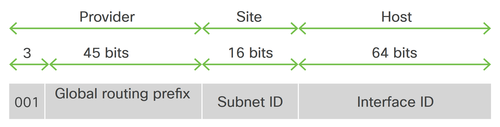
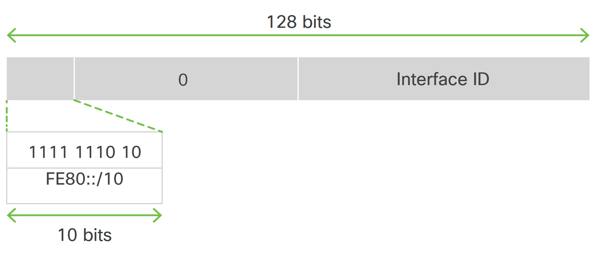
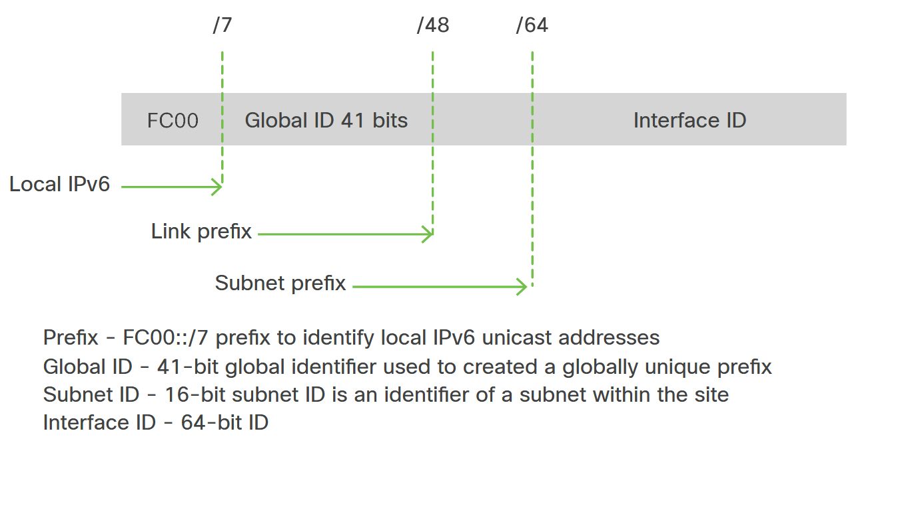
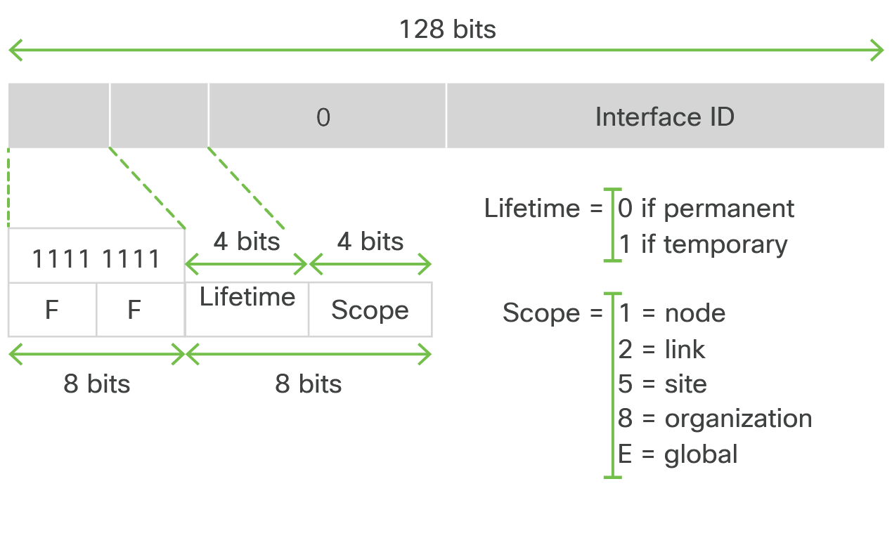

<!-- 5.3.1 -->
## Понимание межсетевого уровня

У взаимосвязанных сетей должны быть способы связи. Межсетевое взаимодействие обеспечивает метод связи «между» (меж) сетями. В этом разделе описывается адресация и маршрутизация.

<!-- 5.3.2 -->
## Адреса IPv4

Каждое устройство в сети имеет уникальный IP-адрес. IP-адрес и MAC-адрес используются для доступа и связи между всеми сетевыми устройствами. Без IP-адресов не было бы Интернета.

Несмотря на введение IPv6, IPv4 продолжает маршрутизировать большую часть интернет-трафика сегодня. В последние годы через IPv6 отправляется больше трафика из-за исчерпания адресов IPv4 и распространения мобильных устройств и устройств Интернета вещей (IoT).

Адрес IPv4 составляет 32 бита, каждый октет (8 бит) представлен как десятичное значение, разделенное точкой. Это представление называется десятичной системой счисления с точками. Например, 192.168.48.64 и 64.100.36.254 - это адреса IPv4, представленные в десятичном формате с разделительными точками. В таблице показано двоичное значение для каждого октета.

| **Ценность** | **192**  | **168**  | **48**   | **64**   |
| Двоичный     | 11000000 | 10101000 | 00110000 | 01000000 |
| **Ценность** | **64**   | **100**  | **36**   | **254**  |
| Двоичный     | 01000000 | 01100100 | 00100100 | 11111110 |

Маска подсети IPv4 (или длина префикса) используется, чтобы отличать сетевую часть от части хоста IPv4-адреса. Маска подсети содержит четыре байта и может быть записана в том же формате, что и IP-адрес. В допустимой маске подсети самые важные биты, начинающиеся слева, должны быть установлены на 1. Эти биты являются сетевой частью маски подсети. Биты, установленные в 0, являются основной частью маски.

Для этого примера посмотрите 203.0.113.0/24. IPv4-адрес сети - 203.0.113.0 с маской подсети 255.255.255.0. Последний октет маски подсети имеет все 8 битов, доступных для IPv4-адресов хоста, что означает, что в сети 203.0.113.0/24 может быть до 28 (256) доступных адресов подсети.

По умолчанию используются два IPv4-адреса, которые нельзя назначить устройствам:

* 203.0.113.0 - сетевой адрес
* 203.0.113.255 - широковещательный адрес

Таким образом, доступно 254 (256 - 2) IP-адреса хоста, а диапазон адресов, доступных для хостов, будет от 203.0.113.1 до 203.0.113.254.

Есть три типа IPv4-адресов:

* **Сетевой адрес** - Сетевой адрес - это адрес, который представляет определенную сеть и содержит все 0 бит в части адреса, связанной с хостом.
* **Адреса хостов** - Адреса хостов - это адреса, которые могут быть назначены устройству, например хост-компьютеру, ноутбуку, смартфону, веб-камере, принтеру, маршрутизатору и т. Д. Адреса хоста содержат по крайней мере один 0-битный и один 1-битный бит в части хоста адрес.
* **Адрес трансляции** - Широковещательный адрес - это адрес, который используется, когда требуется достичь всех устройств в сети IPv4. Он содержит все 1 бит в хост-части адреса.

Сеть можно разделить на более мелкие сети, называемые подсетями. Подсети могут быть предоставлены отдельным организационным единицам, таким как группы или бизнес-отделы, чтобы упростить сеть и потенциально сделать данные отдела конфиденциальными. Подсеть предоставляет определенный диапазон IP-адресов для группы хостов. Каждая сеть обычно является подсетью более крупной сети.

Например, сетевой IPv4-адрес 192.168.2.0/24. Маска подсети/24 (255.255.255.0) означает, что последний октет имеет 8 бит, доступных для адресов хоста. Вы можете заимствовать из хоста для создания подсетей. Например, вам нужно использовать три бита для создания восьми подсетей (23 = 8). Остальные пять бит остаются для хостов (25 = 32).

Это легче визуализировать, если отобразить маску подсети в двоичном формате.

* / 24 маска подсети: 11111111.11111111.11111111.00000000
* Измененная маска подсети/27: 11111111.11111111.11111111.11100000

Поскольку вам нужно создать восемь подсетей, вы назначаете три бита в последнем октете для использования подсети. Остальные пять бит предназначены для хостов и предоставляют каждой подсети 32 IP-адреса.

В следующей таблице перечислены сетевой адрес, широковещательный адрес и доступный диапазон адресов хоста для каждой подсети.

| **Подсеть**   | **Сетевой адрес** | **Адрес трансляции** | **Доступный диапазон адресов хоста** |
| ------------- | ----------------- | -------------------- | ------------------------------------ |
| **Подсеть 1** | 192.168.2.0       | 192.168.2.31         | От 192.168.2.1 до 192.168.2.30       |
| **Подсеть 2** | 192.168.2.32      | 192.168.2.63         | От 192.168.2.33 до 192.168.2.62      |
| **Подсеть 3** | 192.168.2.64      | 192.168.2.95         | От 192.168.2.65 до 192.168.2.94      |
| **Подсеть 4** | 192.168.2.96      | 192.168.2.127        | От 192.168.2.97 до 192.168.2.126     |
| **Подсеть 5** | 192.168.2.128     | 192.168.2.159        | От 192.168.2.129 до 192.168.2.158    |
| **Подсеть 6** | 192.168.2.160     | 192.168.2.191        | От 192.168.2.161 до 192.168.2.190    |
| **Подсеть 7** | 192.168.2.192     | 192.168.2.223        | От 192.168.2.193 до 192.168.2.222    |
| **Подсеть 8** | 192.168.2.224     | 192.168.2.255        | От 192.168.2.225 до 192.168.2.254    |

Обратите внимание на выделение подсетей и хостов, указанное для каждой строки. Теперь вы должны понять, как назначение битов для создания подсетей уменьшает количество хостов, доступных для каждой подсети. Количество хостов, доступных для каждой подсети, учитывает, что для каждого сетевого и широковещательного адресов требуется IP-адрес. Чем больше битов вы используете для создания подсетей, тем меньше у вас битов для хостов в каждой подсети.

В таблице ниже показаны различные варианты, если у вас есть маска подсети/24.

| **Маска подсети**   | **Двоичный**                         | **CIDR** | **Подсети** | **Хосты в подсети** |
| ------------------- | ------------------------------------ | -------- | ----------- | ------------------- |
| **255.255.255.255** | 11111111.11111111.111111111.11111111 | / 32     | Никто       | Нет данных          |
| **255.255.255.254** | 11111111.11111111.111111111.11111110 | / 31     | 128         | Нет данных          |
| **255.255.255.252** | 11111111.11111111.111111111.11111100 | / 30     | 64          | 2                   |
| **255.255.255.248** | 11111111.11111111.111111111.11111000 | / 29     | 32          | 6                   |
| **255.255.255.240** | 11111111.11111111.111111111.11110000 | / 28     | 16          | 14                  |
| **255.255.255.224** | 11111111.11111111.111111111.11100000 | / 27     | 8           | 30                  |
| **255.255.255.192** | 11111111.11111111.111111111.11000000 | / 26     | 4           | 62                  |
| **255.255.255.128** | 11111111.11111111.111111111.10000000 | / 25     | 2           | 126                 |
| **255.255.255.0**   | 11111111.11111111.111111111.00000000 | / 24     | 1           | 254                 |

Из-за истощения адресов IPv4 большинство адресов внутри компании используют частные адреса IPv4 (RFC 1918). Использование масок подсети переменной длины (VLSM) также может способствовать более эффективному использованию адресного пространства IPv4. Первоначально использовался, когда IPv4-адреса были классовыми (класс A, B, C). VLSM - это метод разделения одной сети (или подсети) с использованием разных масок подсети для предоставления подсетям с разным количеством адресов узлов.

Сетевой адрес и префикс RFC 1918 Диапазон частных адресов

* 10.0.0.0/8 10.0.0.0 - 10.255.255.255
* 172.16.0.0/12 172.16.0.0 - 172.31.255.255
* 192.168.0.0/16 192.168.0.0 - 192.168.255.255

Устройства, использующие частные адреса IPv4, могут получить доступ к Интернету через преобразование сетевых адресов (NAT) и преобразование адресов портов (PAT). Исходящие данные с вашего устройства отправляются через маршрутизатор, который сопоставляет частный IPv4-адрес вашего устройства с общедоступным IPv4-адресом. Когда данные возвращаются к этому маршрутизатору, он ищет частный IP-адрес вашего устройства и направляет его к месту назначения.

<!-- 5.3.3 -->
## Адреса IPv6

IPv6 разработан, чтобы стать преемником IPv4. IPv6 имеет большее 128-битное адресное пространство, обеспечивая 340 ундециллионов (т. Е. 340 с последующими 36 нулями) возможных адресов. Однако IPv6 - это больше, чем просто адреса большего размера.

Когда IETF приступил к разработке преемника IPv4, он использовал эту возможность, чтобы исправить ограничения IPv4 и включил улучшения. Одним из примеров является протокол управляющих сообщений Интернета версии 6 (ICMPv6), который включает функции разрешения адресов и автоконфигурации адресов, которых нет в ICMP для IPv4 (ICMPv4).

Истощение адресного пространства IPv4 было мотивирующим фактором для перехода на IPv6. Поскольку Африка, Азия и другие регионы мира становятся все более подключенными к Интернету, не хватает адресов IPv4 для удовлетворения этого роста.

Первоначально IPv6 описан в RFC 2460. Дальнейшие RFC описывают архитектуру и услуги, поддерживаемые IPv6.

Архитектура IPv6 была разработана, чтобы позволить существующим пользователям IPv4 легко переходить на IPv6, обеспечивая при этом такие услуги, как сквозная безопасность, качество обслуживания (QoS) и глобальные уникальные адреса. Увеличенное адресное пространство IPv6 позволяет масштабировать сети и обеспечивать глобальную доступность. Упрощенный формат заголовка пакета IPv6 обрабатывает пакеты более эффективно. Предварительная агрегация IPv6, упрощенная перенумерация сети и множественная адресация сайтов IPv6 обеспечивают иерархию адресации IPv6, которая обеспечивает более эффективную маршрутизацию. IPv6 поддерживает широко распространенные протоколы маршрутизации, такие как Routing Information Protocol (RIP), Integrated Intermediate System-to-Intermediate System (IS-IS), OSPF и многопротокольный BGP (mBGP). Другие доступные функции включают автоконфигурацию без сохранения состояния и увеличенное количество многоадресных адресов.

Частные адреса в сочетании с преобразованием сетевых адресов (NAT) сыграли важную роль в замедлении истощения адресного пространства IPv4. Однако NAT проблематичен для многих приложений, создает задержки и имеет ограничения, которые серьезно затрудняют одноранговую связь. Адресное пространство IPv6 устраняет необходимость в частных адресах; поэтому IPv6 позволяет использовать новые протоколы приложений, которые не требуют специальной обработки граничными устройствами на границе сети.

С постоянно растущим количеством мобильных устройств операторы мобильной связи лидируют в переходе на IPv6. Два ведущих оператора мобильной связи в США сообщают, что более 90% их трафика проходит через IPv6. Большинство ведущих интернет-провайдеров и поставщиков контента, таких как YouTube, Facebook и NetFlix, также осуществили переход. Многие компании, такие как Microsoft, Facebook и LinkedIn, переходят на IPv6 только внутри страны. В 2018 году широкополосный интернет-провайдер Comcast сообщил о развертывании более 65%, а British Sky Broadcasting - более 86%.

Адреса IPv6 представлены как серия 16-битных шестнадцатеричных полей (гекстет), разделенных двоеточиями (:) в формате: x: x: x: x: x: x: x: x. Предпочтительный формат включает все шестнадцатеричные значения. Есть два правила, которые можно использовать для уменьшения представления IPv6-адреса:

1.	Пропускать ведущие нули в каждом гекстете
2.	Замените одну строку гекстетов с нулевыми нулями двойным двоеточием (: :)

Начальные нули в каждом 16-битном гекстете можно опустить. Например:

### Предпочтительный

2001:0db8:0000:1111:0000:0000:0000:0200

### Нет ведущих нулей

2001:db8:0:1111:0:0:0:200

Адреса IPv6 обычно содержат последовательные шестнадцатеричные поля нулей. Два двоеточия (: :) могут использоваться для сжатия последовательных шестнадцатеричных полей нулей в начале, середине или конце адреса IPv6 (двоеточия представляют собой последовательные шестнадцатеричные поля нулей).

Двойное двоеточие (: :) может заменить любую одиночную непрерывную строку из одного или нескольких 16-битных шестнадцатеричных шестнадцатеричных значений, состоящих из нулей. Например, следующий предпочтительный адрес IPv6 может быть отформатирован без начальных нулей.

### Предпочтительный

2001:0db8:0000:1111:0000:0000:0000:0200

### Нет ведущих нулей

2001:db8:0:1111::200

Два двоеточия (::) можно использовать только один раз в адресе IPv6 для представления самых длинных последовательных шестнадцатеричных полей нулей. Шестнадцатеричные буквы в адресах IPv6 не чувствительны к регистру согласно RFC 5952. В таблице ниже перечислены сжатые форматы адресов IPv6:

| **Тип IPv6-адреса**        | **Предпочтительный формат**  | **Сжатый формат**       |
| -------------------------- | ---------------------------- | ----------------------- |
| **Unicast**                | 2001:0:0:0:db8:800:200c:417a | 2001::db8:800:200c:417a |
| **Многоадресная рассылка** | ff01:0:0:0:0:0:0:101         | ff01::101               |
| **Петля**                  | 0:0:0:0:0:0:0:1              | ::1                     |
| **Неопределенные**         | 0:0:0:0:0:0:0:0              | ::                      |

Неуказанный адрес, указанный в таблице выше, указывает на отсутствие адреса IPv6 или на то, что адрес IPv6 не требуется знать. Например, новое инициализированное устройство в сети IPv6 может использовать неуказанный адрес в качестве адреса источника в своих пакетах, пока оно не получит или не создаст свой собственный адрес IPv6.

Префикс IPv6-адреса в формате ipv6-префикс/длина-префикса может использоваться для побитового представления непрерывных блоков всего адресного пространства. Длина префикса - это десятичное значение, которое указывает, сколько непрерывных битов высокого порядка адреса составляют префикс (сетевая часть адреса). Например, 2001:db8:8086:6502::/32 - допустимый префикс IPv6.

<!-- 5.3.4 -->
## Одноадресные IPv6-адреса

Одноадресный IPv6-адрес - это идентификатор для одного интерфейса на одном устройстве. Пакет, который отправляется на одноадресный адрес, доставляется на интерфейс, идентифицированный этим адресом. Существует несколько типов одноадресных адресов IPv6, в том числе:

* Глобальные уникальные адреса
* Адреса локальных ссылок
* Уникальные локальные адреса
* Многоадресные адреса

> **Примечание**: Существуют и другие типы одноадресных адресов IPv6, но эти четыре являются наиболее важными для нашего обсуждения.

### Глобальные одноадресные адреса

Глобальный одноадресный адрес (GUA) - это IPv6, аналогичный общедоступному IPv4-адресу. Глобальные одноадресные IPv6-адреса глобально уникальны и маршрутизируются в Интернете IPv6. Интернет-комитет по присвоению имен и номеров (ICANN), оператор Управления по присвоению номеров в Интернете (IANA), распределяет блоки адресов IPv6 между пятью региональными интернет-регистратурами (RIR). В настоящее время назначаются только GUA с первыми тремя битами (001), которые преобразуются в 2000::/3, как показано на рисунке.

### Формат IPv6 GUA

<!-- /courses/devnet/9c5edeb0-ba29-11ea-b646-8dfbdd4ba015/9ce43b50-ba29-11ea-b646-8dfbdd4ba015/assets/acddaaf6-c04b-11ea-91bd-4b7461d9a91b.svg -->

Части GUA на рисунке выше следующие:

* **Префикс глобальной маршрутизации** - Префикс глобальной маршрутизации - это префикс или сетевая часть адреса, которая назначается провайдером, например интернет-провайдером, клиенту или сайту. Некоторые интернет-провайдеры обычно назначают своим клиентам префикс глобальной маршрутизации/48, который всегда включает первые 3 бита (001), показанные на рисунке. Префикс глобальной маршрутизации обычно зависит от политик провайдера. Например, IPv6-адрес 2001:db8:acad::/48 имеет префикс глобальной маршрутизации, который указывает, что первые 48 битов (3 гекстета или 2001:db8:acad) - это то, как провайдер узнает об этом префиксе (сети). Двойное двоеточие (::) после длины префикса/48 означает, что остальная часть адреса содержит все 0. Размер префикса глобальной маршрутизации определяет размер идентификатора подсети.
* **ID подсети** - Поле ID подсети - это область между префиксом глобальной маршрутизации и идентификатором интерфейса. В отличие от IPv4, где для создания подсетей вы должны заимствовать биты из узла, IPv6 был разработан с учетом подсетей. Идентификатор подсети используется организацией для идентификации подсетей на своем сайте. Чем больше идентификатор подсети, тем больше подсетей доступно. Например, если префикс имеет префикс глобальной маршрутизации/48 и используется типичная длина префикса/64, первые четыре гекстета предназначены для сетевой части адреса, а четвертый hextet, указывающий ID подсети. Остальные четыре гекстета предназначены для идентификатора интерфейса.
* **ID интерфейса** - Идентификатор интерфейса IPv6 эквивалентен хостовой части адреса IPv4. Термин «идентификатор интерфейса» используется потому, что одно устройство может иметь несколько интерфейсов, каждый из которых имеет один или несколько адресов IPv6. В большинстве случаев настоятельно рекомендуется использовать/64 подсети, что создает 64-битный идентификатор интерфейса. 64-битный идентификатор интерфейса позволяет использовать 18 квинтиллионов устройств или хостов в каждой подсети. Подсеть A/64 или префикс (глобальный префикс маршрутизации + идентификатор подсети) оставляет 64 бита для идентификатора интерфейса. Это рекомендуется, чтобы разрешить устройствам, на которых включена автоконфигурация адреса без сохранения состояния (SLAAC), создавать свой собственный 64-битный идентификатор интерфейса. Это также делает разработку плана адресации IPv6 простой и эффективной.

GUA не является требованием; однако каждый сетевой интерфейс с поддержкой IPv6 должен иметь локальный адрес канала (LLA).

### Адреса локального канала

Локальный адрес канала IPv6 (LLA) позволяет устройству взаимодействовать с другими устройствами с поддержкой IPv6 по тому же каналу и только по этому каналу (подсети). Пакеты с исходным или целевым LLA не могут быть маршрутизированы за пределы канала, из которого был создан пакет.

Если LLA не настроен вручную на интерфейсе, устройство автоматически создаст свой собственный без взаимодействия с DHCP-сервером. Хосты с поддержкой IPv6 создают LLA IPv6, даже если устройству не был назначен глобальный одноадресный IPv6-адрес. Это позволяет устройствам с поддержкой IPv6 взаимодействовать с другими устройствами с поддержкой IPv6 в той же подсети. Это включает связь со шлюзом по умолчанию (маршрутизатором).

Формат LLA IPv6 показан на рисунке.

### Формат IPv6 LLA

<!-- /courses/devnet/9c5edeb0-ba29-11ea-b646-8dfbdd4ba015/9ce43b50-ba29-11ea-b646-8dfbdd4ba015/assets/acddaaf7-c04b-11ea-91bd-4b7461d9a91b.svg -->

LLA IPv6 находятся в диапазоне fe80 ::/10./10 указывает, что первые 10 бит - 1111 1110 10. Первый гекстет имеет следующий диапазон:

**1111 1110 1000 0000**(fe80) в

**1111 1110 1011 1111**(febf)

Устройства IPv6 не должны пересылать пакеты, содержащие LLA источника или назначения, по другим каналам.

### Уникальные локальные адреса

Уникальные локальные адреса (диапазон от fc00::/7 до fdff::/7) пока широко не используются. Однако уникальные локальные адреса могут в конечном итоге использоваться для адресации устройств, которые не должны быть доступны извне, например внутренних серверов и принтеров.

Уникальные локальные адреса IPv6 имеют некоторое сходство с частными адресами RFC 1918 для IPv4, но есть существенные различия:

* Уникальные локальные адреса используются для локальной адресации внутри сайта или между ограниченным количеством сайтов.
* Уникальные локальные адреса могут использоваться для устройств, которым никогда не потребуется доступ к другой сети.
* Уникальные локальные адреса не маршрутизируются и не преобразуются в глобальный адрес IPv6.

> **Примечание**: Многие сайты также используют частный характер адресов RFC 1918, чтобы попытаться защитить или скрыть свою сеть от потенциальных угроз безопасности. Однако эти технологии никогда не использовались по назначению, и IETF всегда рекомендовала сайтам принимать надлежащие меры безопасности на своих маршрутизаторах с выходом в Интернет.

На рисунке показана структура уникального локального адреса.

### Формат уникального локального адреса IPv6

<!-- /courses/devnet/9c5edeb0-ba29-11ea-b646-8dfbdd4ba015/9ce43b50-ba29-11ea-b646-8dfbdd4ba015/assets/acddaaf8-c04b-11ea-91bd-4b7461d9a91b.svg -->

### Многоадресные адреса

В IPv6 нет широковещательных адресов. Вместо широковещательных адресов используются многоадресные IPv6-адреса. Адреса многоадресной рассылки IPv6 аналогичны адресам многоадресной рассылки IPv4. Напомним, что многоадресный адрес используется для отправки одного пакета одному или нескольким адресатам (многоадресная группа). Адреса многоадресной рассылки IPv6 имеют префикс ff00::/8.

> **Примечание**: Многоадресные адреса могут быть только адресами назначения, но не адресами источника.

Существует два типа адресов многоадресной рассылки IPv6:

* Хорошо известные многоадресные адреса
* Запрошенные групповые адреса узлов

Назначены хорошо известные многоадресные IPv6-адреса. Назначенные адреса многоадресной рассылки - это зарезервированные адреса многоадресной рассылки для заранее определенных групп устройств. Назначенный многоадресный адрес - это один адрес, используемый для доступа к группе устройств, на которых работает общий протокол или служба. Назначенные адреса многоадресной рассылки используются в контексте определенных протоколов, таких как DHCPv6.

Это две общие группы многоадресной рассылки IPv6:

* **ff02::1 Группа многоадресной рассылки для всех узлов** - Это группа многоадресной рассылки, к которой присоединяются все устройства с поддержкой IPv6. Пакет, отправленный в эту группу, принимается и обрабатывается всеми интерфейсами IPv6 в канале или сети. Это имеет тот же эффект, что и широковещательный адрес в IPv4.
* **ff02::2 многоадресная группа для всех маршрутизаторов** - Это группа многоадресной рассылки, к которой присоединяются все маршрутизаторы IPv6. Маршрутизатор становится членом этой группы, когда он включен как маршрутизатор IPv6 с помощью команды глобальной конфигурации ipv6 unicast-routing. Пакет, отправленный в эту группу, принимается и обрабатывается всеми маршрутизаторами IPv6 в канале или сети.

Формат многоадресного IPv6-адреса показан на рисунке.

### Формат многоадресного IPv6-адреса

<!-- /courses/devnet/9c5edeb0-ba29-11ea-b646-8dfbdd4ba015/9ce43b50-ba29-11ea-b646-8dfbdd4ba015/assets/acddd200-c04b-11ea-91bd-4b7461d9a91b.svg -->

Многоадресный адрес запрошенного узла аналогичен многоадресному адресу всех узлов. Преимущество многоадресного адреса запрошенного узла заключается в том, что он отображается на специальный многоадресный адрес Ethernet. Это позволяет сетевому адаптеру Ethernet фильтровать кадр, проверяя MAC-адрес назначения, не отправляя его процессу IPv6, чтобы узнать, является ли устройство предполагаемой целью пакета IPv6.

Формат многоадресного IPv6-адреса запрошенного узла показан на рисунке.

### Формат адреса запрошенного узла IPv6

<!-- /courses/devnet/9c5edeb0-ba29-11ea-b646-8dfbdd4ba015/9ce43b50-ba29-11ea-b646-8dfbdd4ba015/assets/acddd201-c04b-11ea-91bd-4b7461d9a91b.svg -->

Одноадресный или произвольный IPv6-адрес ID интерфейса Префикс 24 бита Нижний 24 Многоадресный адрес запрошенного узла 128 бит

<!-- 5.3.5 -->
## Маршрутизаторы и маршрутизация

Напомним, что маршрутизатор - это сетевое устройство, которое функционирует на интернет-уровне модели TCP/IP или сетевом уровне 3-го уровня модели OSI. Маршрутизация включает пересылку пакетов между разными сетями. Маршрутизаторы используют таблицу маршрутизации для маршрутизации между сетями. Маршрутизатор обычно выполняет две основные функции: определение пути и маршрутизацию или пересылку пакетов.

### Определение пути

Определение пути - это процесс, посредством которого маршрутизатор использует свою таблицу маршрутизации, чтобы определить, куда пересылать пакеты. Каждый маршрутизатор поддерживает свою собственную локальную таблицу маршрутизации, которая содержит список всех назначений, которые известны маршрутизатору, и способы их достижения. Когда маршрутизатор получает входящий пакет на одном из своих интерфейсов, он проверяет IP-адрес назначения в пакете и ищет наилучшее совпадение между адресом назначения и сетевыми адресами в своей таблице маршрутизации. Соответствующая запись указывает, что пункт назначения напрямую подключен к маршрутизатору или что его можно достичь путем пересылки пакета другому маршрутизатору. Этот маршрутизатор становится маршрутизатором следующего перехода к конечному месту назначения пакета. Если подходящей записи нет, маршрутизатор отправляет пакет по маршруту по умолчанию. Если нет маршрута по умолчанию,

### Пересылка пакетов

После того как маршрутизатор определяет правильный путь для пакета, он пересылает пакет через сетевой интерфейс к сети назначения.

Таблица маршрутизации может выглядеть следующим образом:

| **Сеть**        | **Интерфейс или следующий переход**                |
| --------------- | -------------------------------------------------- |
| **10.9.2.0/24** | напрямую подключен: Gi0/0                          |
| **10.9.1.0/24** | напрямую подключен: Gi0/1                          |
| **10.5.3.0/24** | напрямую подключен: Se0/0/1                        |
| **10.8.3.0/24** | через 10.9.2.2 (маршрутизатор следующего перехода) |

Как видите, каждая строка в таблице маршрутизации содержит целевую сеть и соответствующий интерфейс или адрес следующего перехода. Для сетей с прямым подключением это означает, что у маршрутизатора есть интерфейс, который является частью этой сети. Например, предположим, что маршрутизатор получает пакет на своем интерфейсе Serial 0/0/1 с адресом назначения 10.9.1.5. Маршрутизатор ищет адрес назначения в своей таблице маршрутизации и решает переслать пакет через свой интерфейс GigabitEthernet 0/1 к месту назначения. Следуя той же логике, предположим, что маршрутизатор получает пакет с адресом назначения в сети 10.8.3.0 на свой интерфейс GigabitEthernet0/1. Выполняя поиск в таблице маршрутизации, маршрутизатор решает переслать этот пакет через свой интерфейс GigabitEthernet0/0, который соединяет его с маршрутизатором следующего перехода к конечному пункту назначения в 10.8.3.

Таблица маршрутизации может содержать следующие типы записей:

* **Сети с прямым подключением** - Эти записи сетевого маршрута являются активными интерфейсами маршрутизатора. Маршрутизаторы добавляют маршрут с прямым подключением, когда интерфейс настроен с IP-адресом и активирован. Каждый интерфейс маршрутизатора подключен к отдельному сегменту сети.
* **Статические маршруты** - Это маршруты, которые вручную настраивает сетевой администратор. Статические маршруты относительно хорошо работают для небольших сетей, которые не меняются во времени, но в больших динамических сетях они имеют много недостатков.
* **Динамические маршруты** - Это маршруты, полученные автоматически при настройке протокола динамической маршрутизации и установлении отношений соседства с другими маршрутизаторами. Информация о доступности в этом случае динамически обновляется при изменении в сети. За прошедшие годы было разработано несколько протоколов маршрутизации с различными преимуществами и недостатками. Протоколы маршрутизации широко используются во всех сетях, развернутых по всему миру. Примеры протоколов маршрутизации включают OSPF, EIGRP, IS-IS и BGP.
* **Маршруты по умолчанию** - Маршруты по умолчанию вводятся вручную или изучаются через протокол динамической маршрутизации. Маршруты по умолчанию используются, когда в таблице маршрутизации не найден явный путь к месту назначения. Это последний вариант шлюза, а не просто отбрасывание пакета.
