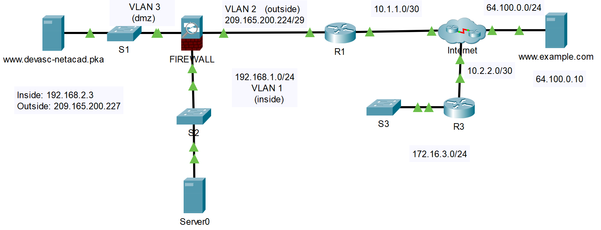

## Топология



## Таблица адресации

| Устройство     | Интерфейс     | IPv4-адрес           | Маска подсети   | Шлюз по умолчанию |
|----------------|---------------|----------------------|-----------------|-------------------|
| R1             | G0/0/0        | 209.165.200.225      | 255.255.255.248 | -                 |
| R1             | G0/0/1        | 10.1.1.2             | 255.255.255.252 | Н/Д               |
| R3             | G0/0/0        | 10.2.2.2             | 255.255.255.252 | -                 |
| R3             | G0/0/1        | 172.16.3.1           | 255.255.255.0   | Н/Д               |
| FIREWALL       | VLAN1         | 192.168.1.1          | 255.255.255.0   | -                 |
| FIREWALL       | VLAN2         | 209.165.200.226      | 255.255.255.248 | Н/Д               |
| FIREWALL       | VLAN3         | 192.168.2.1          | 255.255.255.0   | Н/Д               |
| DEVASC Server  | сетевая карта | IN: 192.168.2.3      | 255.255.255.0   | 192.168.1.1       |
| DEVASC Server  | VLAN1         | OUT: 209.165.200.227 | 255.255.255.248 | 209.165.200.225   |
| Example Server | сетевая карта | 64.100.0.10          | 255.255.255.0   | 64.100.0.1        |
| PC-A           | сетевая карта | 192.168.1.2          | 255.255.255.0   | 192.168.1.1       |
| PC-B           | сетевая карта | 172.16.3.2           | 255.255.255.0   | 172.16.3.1        |

> **Примечание**. Вы добавите компьютеры PC-A и PC-B в топологию на шаге 1.

## Цели

* **Часть 1. Добавление компьютеров в топологию**
* **Часть 2. Проверка возможности подключения по сети**
* **Часть 3. Создайте веб-страницу и просмотрите ее**
* **Часть 4. Изучение списков доступа брандмауэра**

## Предыстория/сценарий

Packet Tracer — отличный инструмент для построения и тестирования сетей и сетевого оборудования. Как разработчику важно, чтобы вы были знакомы с сетевыми устройствами и тем, как они взаимодействуют друг с другом. Простая сеть в этом упражнении Packet Tracer предварительно настроена, чтобы дать вам возможность исследовать устройства.

>   **Примечание** . В этом упражнении два веб-сервера называются **DEVASC Server** и **Example Server**. В топологии они называются по URL-адресу: **www.devasc-netacad.pka** и **www.example.com** .

## Инструкции

### Часть 1. Добавьте ПК в топологию

В этой части вы добавите ПК в топологию и настроите для них адресацию IPv4.

**Шаг 1. Разместите ПК и подключите их к сети.**

>   **Примечание** . В именах устройств учитывается регистр. Если вы используете другой регистр или другое имя, это повлияет на вашу оценку.

1.  Перетащите ПК в рабочую зону и поместите его рядом с S2.
1.  Переименуйте ПК в **PC-A** .
1.  Перетащите ПК в рабочую зону и поместите его рядом с S3.
1.  Переименуйте ПК в **PC-B** .
2.  Подключите **медный прямой (Copper Straight-Through)** кабель от порта **FastEthernet0** на PC-A к любому доступному порту FastEthernet на S2.
3.  Подключите **медный прямой (Copper Straight-Through)** кабель от порта **FastEthernet0** на PC-B к любому доступному порту FastEthernet на S3.

**Шаг 2. Настройте адресацию IPv4 для ПК.**

1.  Нажмите **PC-A**.
1.  Щелкните **Desktop**.
1.  Щелкните **IP Configuration**.
1.  Назначьте следующую информацию об адресации IPv4:

    IPv4-адрес: 192.168.1.2

    Маска подсети: 255.255.255.0

    Шлюз по умолчанию: 192.168.1.1

2.  Повторите это для PC-B, но используйте следующую информацию об адресации IPv4:

    IPv4-адрес: 172.16.3.2

    Маска подсети: 255.255.255.0

    Шлюз по умолчанию: 172.16.3.1

3.  В окне Инструкции для этого действия ваш процент завершения должен быть 100%. Если нет, нажмите **Check Results**, чтобы увидеть, какие обязательные компоненты еще не выполнены. Остальная часть этой деятельности не оценивается.

### Часть 2. Проверка подключения по сети

1.  Нажмите **PC-B**.
1.  Нажмите **Command** **Prompt**.
1.  Попытаться пропинговать R3. Введите **ping 172.16.3.1** (ваш шлюз по умолчанию).

    Возможно, вам придется ввести команду пару раз, но вы должны начать получать ответы от маршрутизатора.

1.  Пропингуйте **Example Server** по адресу 64.100.0.10.

    У вас могут возникнуть проблемы на начальном этапе, когда сеть сходится. При необходимости повторите пинг. Теперь вы знаете, что у вас есть подключение через Интернет.

2.  Пропингуйте **DEVASC Server** по адресу 209.165.200.227.

    У вас могут возникнуть проблемы на начальном этапе, когда сеть сходится. При необходимости повторите пинг. Теперь вы знаете, что у вас есть сквозное подключение по сетевой топологии.

### Часть 3. Создайте веб-страницу и просмотрите ее

В этой части вы создадите простую веб-страницу на сервере DEVASC, а затем убедитесь, что компьютер PC-B может получить доступ к этой веб-странице.

**Шаг 1. Создайте веб-страницу.**

1.  Щелкните сервер **Server-PT www.devasc-netacad.pka** .
1.  Щелкните **Services**.
1.  В разделе **Services** вы по умолчанию используете первую службу, то есть HTTP. Щелкните **New File (Новый файл)**.
1.  Назовите файл **index.html**.
2.  Packet Tracer понимает базовый язык гипертекстовой разметки (HTML). Поместите следующий HTML-код в поле под именем файла. Если вы знаете HTML, не стесняйтесь настраивать код.

    ```html
    <html>
    <center><font size='+2' color='blue'>DevNet Associate</font></center>
    <hr>Welcome to the NetAcad DEVASC course!
    ```

1.  Нажмите **Save (Сохранить)**. Нажмите **Yes** (**Да)** в окне предупреждения.

**Шаг 2. Просмотр веб-страницы.**

1.  Нажмите **PC-B**.
1.  Щелкните **Desktop**. При необходимости закройте окно **Command Prompt.**
1.  Щелкните **Web Browser**.
1.  Поместите следующий адрес в поле URL: **http://209.165.200.227** .

    Ваша веб-страница должна отображаться. Если нет, проверьте настройки и повторите попытку.

### Часть 4. Изменить список доступа брандмауэра

В этой части вы изучите список доступа устройства брандмауэра, отредактируете список доступа и проверите, что брандмауэр теперь запрещает ping-доступ.

**Шаг 1. Изучите список доступа на устройстве брандмауэра.**

1.  Щелкните **FIREWALL.**
1.  Щелкните **CLI**.
1.  Нажмите **Enter** пару раз, чтобы получить подсказку.
1.  Введите **en** и нажмите **Enter** .
2.  Пароля нет. Нажмите **Enter** еще раз.
3.  Введите **show run** и нажмите **Enter** .
4.  Нажмите **пробел,** чтобы просмотреть текущую конфигурацию.
5.  Обратите внимание на следующий список доступа:

    ```
    access-list OUTSIDE-DMZ extended permit icmp any host 192.168.2.3
    access-list OUTSIDE-DMZ extended permit tcp any host 192.168.2.3 eq www
    ```

    Хост 192.168.2.3 — это внутренний IPv4-адрес сервера DEVASC в демилитаризованной зоне.

    -   Первый оператор **access-list** позволяет любому устройству получить доступ к серверу с использованием протокола управляющих сообщений Интернета (ICMP), который является протоколом, используемым командой **ping**.
    -   Второй оператор **access-list** позволяет любому устройству получить доступ к серверу с использованием протокола передачи гипертекста (HTTP), который является протоколом, используемым веб-браузерами.

1.  При необходимости нажимайте **пробел,** пока не окажетесь в командной строке.

    ```
    FIREWALL#
    ```

**Шаг 2. Измените и проверьте эффективность списка доступа.**

Как правило, вы не хотите, чтобы внешний мир мог пинговать ваши внутренние серверы. Следовательно, вы должны удалить оператор **access-list**, который явно разрешает доступ для проверки связи.

1.  Войдите в режим глобальной конфигурации с помощью команды **configure terminal**.

    ```
    FIREWALL# configure terminal
    ```

1.  Удалите оператор **access-list**, который разрешает ping, с помощью следующей команды и нажмите **Enter**.

    > **Примечание**. Команда находится в одной строке, хотя в терминале она может переноситься по словам.

    ```
    FIREWALL(config)# no access-list OUTSIDE-DMZ extended permit icmp any host 192.168.2.3
    ```

1.  Из **Command Prompt** на **PC-B** отправьте эхо- запрос на **DEVASC Server** по внешнему IPv4-адресу. Теперь пинг должен завершиться неудачно.

1.  В **Web Browser** на **PC-B** перейдите на веб-страницу **DEVASC Server** по адресу **http://209.165.200.227** . Вы по-прежнему должны видеть веб-страницу, поскольку вы не удалили этот оператор **access-list**, разрешающий доступ по протоколу HTTP.
