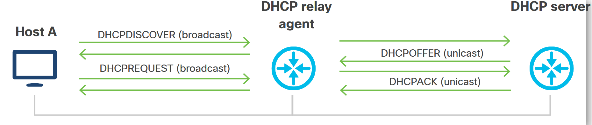
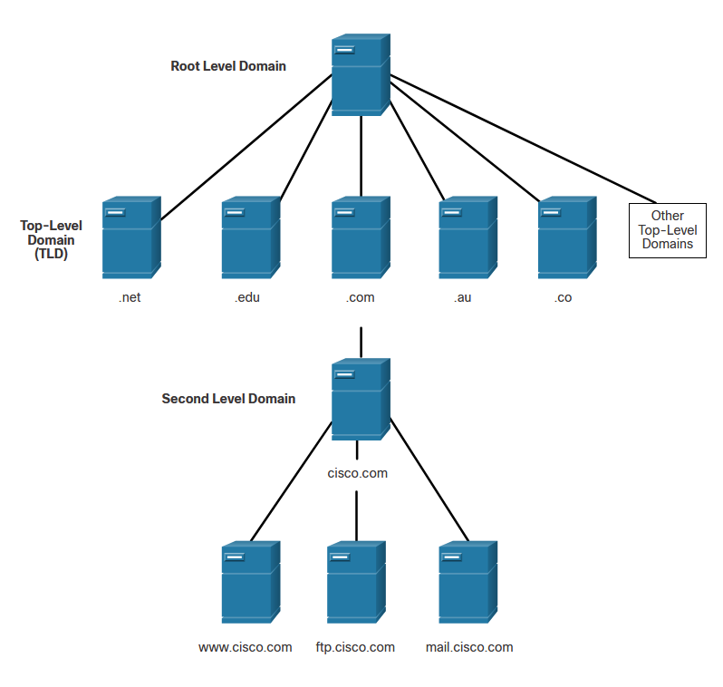
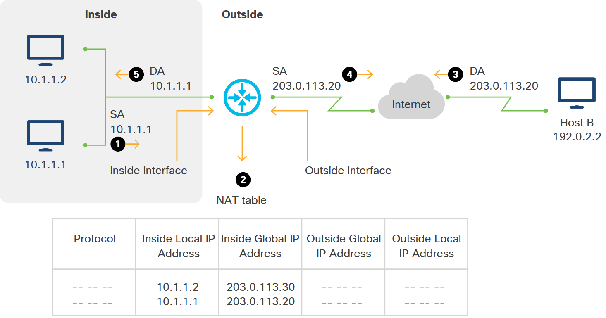

<!-- 5.5.1 -->
## Сетевые протоколы

Интернет был построен по разным стандартам. Вы должны понимать стандартные сетевые протоколы, чтобы эффективно общаться и устранять неполадки.

Каждый протокол отвечает требованиям и использует стандартные значения портов. Вы должны знать, когда использовать тот или иной протокол, и знать стандартный порт для соединений. Многие разработчики были озадачены несоответствием значения порта; поэтому проверка этих значений может быть первой линией атаки при устранении неполадок.

### Telnet и безопасная оболочка (SSH)

Telnet и SSH используются для подключения к удаленному компьютеру и входа в эту систему с использованием учетных данных. Telnet сегодня менее распространен, поскольку SSH использует шифрование для защиты данных, проходящих через сетевое соединение. Telnet следует использовать только в непроизводственной среде.

Соединения SSH могут использовать открытый ключ для аутентификации, а не отправлять имя пользователя и пароль по сети. Этот метод аутентификации означает, что SSH - хороший выбор для подключения к сетевым устройствам, облачным устройствам и контейнерам.

По умолчанию SSH использует порт 22, а Telnet - порт 23. Telnet может использовать порт 992 при создании сеанса через Transport Layer Security (TLS) или SSL.

### HTTP и HTTPS

HTTP и его безопасная версия HTTPS - это протоколы, распознаваемые веб-браузерами и используемые для подключения к веб-сайтам. HTTPS использует TLS или SSL для создания безопасного соединения. Вы можете увидеть http: или https: в адресной строке браузера. Многие браузеры также распознают протоколы ssh: и ftp: и позволяют таким образом подключаться к удаленным серверам.

### NETCONF и RESTCONF

Позже в этом курсе вы будете использовать NETCONF и RESTCONF для управления маршрутизатором Cisco. NETCONF использует порт 830. RESTCONF не имеет зарезервированного значения порта. Вы можете увидеть различные реализации разных значений. Обычно значение порта составляет 8000.

Чтобы иметь несколько сетевых операций, вы хотите убедиться, что каждый протокол имеет порт по умолчанию, и использовать стандарты, чтобы избежать конфликтов. Трафик TCP и UDP требует указания порта назначения для каждого пакета. Исходный порт автоматически создается отправляющим устройством. В следующей таблице показаны некоторые общие, хорошо известные значения портов для протоколов, используемых в этом курсе. Номера системных портов находятся в диапазоне от 0 до 1023, хотя вы можете видеть, что другие используются по разным причинам.

Примечание: Для получения более полного списка портов поищите в Интернете номера портов TCP и UPD.

| **Значение порта**   | **Протокол**                   |
| -------------------- | ------------------------------ |
| **22**               | SSH                            |
| **23, 992**          | Telnet                         |
| **53**               | DNS                            |
| **80**               | HTTP                           |
| **443**              | HTTPS (HTTP через TLS или SSL) |
| **830**              | NETCONF                        |
| **8008, 8080, 8888** | РЕСТКОНФ                       |

<!-- 5.5.2 -->
## DHCP

Как вы видели ранее в этом модуле, IP-адреса необходимы всем устройствам, подключенным к сети, чтобы они могли обмениваться данными. Назначение этих IP-адресов вручную и по одному для каждого устройства в сети обременительно и требует много времени. DHCP был разработан для динамической настройки устройств с использованием информации об IP-адресации. DHCP работает в рамках модели клиент/сервер, где назначенные DHCP-серверы выделяют IP-адреса и доставляют информацию о конфигурации устройствам, которые настроены на динамический запрос информации об адресации.

Помимо IP-адреса самого устройства, DHCP-сервер может также предоставить дополнительную информацию, такую как IP-адрес DNS-сервера, маршрутизатора по умолчанию и другие параметры конфигурации. Например, точки беспроводного доступа Cisco используют опцию 43 в запросах DHCP для получения IP-адреса контроллера беспроводной локальной сети, к которому им необходимо подключиться в целях управления.

Некоторые из преимуществ использования DHCP вместо ручной настройки:

* **Снижение задач и затрат на настройку клиента** - Благодаря тому, что вам не нужно физически подходить к устройству и вручную настраивать параметры сети, можно значительно сэкономить. Это особенно актуально в случае интернет-провайдеров, которые могут удаленно и динамически назначать IP-адреса кабельным модемам или модемам цифровой абонентской линии (DSL) своих клиентов без необходимости посылать человека каждый раз, когда необходимо изменение конфигурации сети.
* **Централизованное управление** - DHCP-сервер обычно поддерживает настройки конфигурации для нескольких подсетей. Поэтому администратору необходимо настроить и обновить только один центральный сервер.

DHCP выделяет IP-адреса тремя способами:

* **Автоматическое распределение** - Сервер DHCP назначает клиенту постоянный IP-адрес.
* **Динамическое размещение** - DHCP назначает IP-адрес клиенту на ограниченный период времени (время аренды).
* **Распределение вручную** - Сетевой администратор назначает IP-адрес клиенту, и DHCP используется для ретрансляции адреса клиенту.

DHCP определяет процесс, с помощью которого DHCP-сервер знает IP-подсеть, в которой находится клиент, и может назначить IP-адрес из пула доступных адресов в этой подсети. Остальные параметры конфигурации сети, которые предоставляет DHCP-сервер, такие как IP-адрес маршрутизатора по умолчанию или IP-адрес DNS-сервера, обычно одинаковы для всей подсети, поэтому DHCP-сервер может иметь эти конфигурации для каждой подсети, а не для каждого хоста. .

Спецификации протокола IPv4 DHCP описаны в RFC 2131 - протокол динамической конфигурации хоста и RFC 2132 - параметры DHCP и расширения поставщика BOOTP. DHCP для IPv6 был первоначально описан в RFC 3315 - Протокол динамической конфигурации хоста для IPv6 (DHCPv6) в 2003 году, но он был обновлен в нескольких последующих RFC. В RFC 3633 - Параметры префикса IPv6 для протокола динамической конфигурации хоста (DHCP) версии 6 добавлен механизм DHCPv6 для делегирования префикса, а в RFC 3736 - Служба протокола динамической настройки хоста (DHCP) без сохранения состояния для IPv6 добавлен SLAAC. Основное различие между DHCP для IPv4 и DHCP для IPv6 заключается в том, что DHCP для IPv6 не включает адрес шлюза по умолчанию. Адрес шлюза по умолчанию может быть получен автоматически только в IPv6 из сообщения Router Advertisement.

### Ретранслятор DHCP

В случаях, когда клиент и сервер DHCP находятся в разных подсетях, можно использовать агент ретрансляции DHCP. Агент ретрансляции - это любой хост, который пересылает пакеты DHCP между клиентами и серверами. Пересылка агента ретрансляции отличается от обычной пересылки, которую выполняет IP-маршрутизатор, когда IP-пакеты маршрутизируются между сетями прозрачно. Агенты ретрансляции получают входящие сообщения DHCP, а затем генерируют новые сообщения DHCP на другом интерфейсе, как показано на рисунке.

### Ретранслятор DHCP

<!-- /courses/devnet/9c5edeb0-ba29-11ea-b646-8dfbdd4ba015/9e9dd230-ba29-11ea-b646-8dfbdd4ba015/assets/acddd203-c04b-11ea-91bd-4b7461d9a91b.svg -->

Клиенты используют порт 67 для отправки сообщений DHCP на серверы DHCP. DHCP-серверы используют порт 68 для отправки DHCP-сообщений клиентам.

Операции DHCP включают четыре сообщения между клиентом и сервером:

* DHCPDISCOVER - обнаружение сервера
* DHCPPOFFER - предложение аренды IP
* DHCPREQUEST - запрос аренды IP
* DHCPACK - подтверждение аренды IP

На рисунке показано, как эти сообщения отправляются между клиентом и сервером.

### DHCP-операции

<!-- /courses/devnet/9c5edeb0-ba29-11ea-b646-8dfbdd4ba015/9e9dd230-ba29-11ea-b646-8dfbdd4ba015/assets/acddd204-c04b-11ea-91bd-4b7461d9a91b.svg -->

Клиент также может запросить адрес, который ранее был выделен сервером. Предполагая, что IPv4-адрес, запрошенный клиентом или предложенный сервером, все еще доступен, сервер отправляет одноадресное сообщение DHCP-подтверждения (DHCPACK), которое подтверждает клиенту, что аренда завершена. Если предложение больше не действует, выбранный сервер отвечает сообщением об отрицательном подтверждении DHCP (DHCPNAK). Если возвращается сообщение DHCPNAK, то процесс выбора должен начинаться снова с нового сообщения DHCPDISCOVER. После того, как клиент получит аренду, она должна быть продлена до истечения срока аренды с помощью другого сообщения DHCPREQUEST.

Сервер DHCP обеспечивает уникальность всех IP-адресов (один и тот же IP-адрес не может быть назначен двум разным сетевым устройствам одновременно). Большинство интернет-провайдеров используют DHCP для распределения адресов своим клиентам.

DHCPv6 имеет набор сообщений, аналогичный таковым для DHCPv4. Сообщения DHCPv6: SOLICIT, ADVERTISE, INFORMATION REQUEST и REPLY.

<!-- 5.5.3 -->
## DNS

В сетях передачи данных устройства помечаются числовыми IP-адресами для отправки и получения данных по сети. Доменные имена были созданы для преобразования числового адреса в простое, узнаваемое имя.

В Интернете полные доменные имена (FQDN), такие как http://www.cisco.com, гораздо легче запомнить, чем 198.133.219.25, который является действительным числовым адресом этого сервера. Если Cisco решит изменить числовой адрес www.cisco.com, он будет прозрачен для пользователя, потому что имя домена останется прежним. Новый адрес просто связывается с существующим доменным именем, и связь сохраняется.

Примечание: Вы не сможете получить доступ к www.cisco.com, просто введя этот IP-адрес 198.133.219.25 в свой веб-браузер.

Протокол DNS определяет автоматическую службу, которая сопоставляет доменные имена с IP-адресами. Он включает в себя формат запросов, ответов и данных. DNS использует единый формат, называемый сообщением DNS. Этот формат сообщений используется для всех типов клиентских запросов и ответов сервера, сообщений об ошибках и передачи информации о записях ресурсов между серверами.

### Формат сообщения DNS

DNS-сервер хранит различные типы записей ресурсов, которые используются для разрешения имен. Эти записи содержат имя, адрес и тип записи. Вот некоторые из этих типов записей:

* **A** - IPv4-адрес конечного устройства
* **NS** - Авторитетный сервер имен
* **AAAA** - IPv6-адрес конечного устройства (произносится quad-A)
* **MX** - запись почтового обмена

Когда клиент делает запрос к настроенному DNS-серверу, DNS-сервер сначала просматривает свои собственные записи, чтобы разрешить имя. Если ему не удается разрешить имя с помощью сохраненных записей, он связывается с другими серверами для разрешения имени. После того, как совпадение найдено и возвращено исходному запрашивающему серверу, сервер временно сохраняет пронумерованный адрес на случай, если то же имя будет запрошено снова.

Клиентская служба DNS на ПК с Windows также сохраняет в памяти ранее разрешенные имена. Команда `ipconfig/displaydns` отображает все кэшированные записи DNS.

Как показано в таблице, DNS использует один и тот же формат сообщений между серверами. Он состоит из вопроса, ответа, полномочий и дополнительной информации для всех типов клиентских запросов и ответов сервера, сообщений об ошибках и передачи информации о ресурсных записях.

| **Раздел сообщения DNS** | **Описание**                                          |
| ------------------------ | ----------------------------------------------------- |
| **Вопрос**               | Вопрос к серверу имён                                 |
| **Ответ**                | Resource  Records, отвечающие на вопрос               |
| **Власть**               | Записи ресурсов, указывающие на авторитет             |
| **Дополнительные**       | Записи ресурсов, содержащие дополнительную информацию |

### Иерархия DNS

DNS использует иерархическую систему, основанную на доменных именах, для создания базы данных для обеспечения разрешения имен, как показано на рисунке.

<!-- /courses/devnet/9c5edeb0-ba29-11ea-b646-8dfbdd4ba015/9e9dd230-ba29-11ea-b646-8dfbdd4ba015/assets/2e75a113-1c25-11ea-81a0-ffc2c49b96bc.svg -->

Структура именования разбита на небольшие управляемые зоны. Каждый DNS-сервер поддерживает определенный файл базы данных и отвечает только за управление сопоставлением имен и IP-адресов для этой небольшой части всей структуры DNS. Когда DNS-сервер получает запрос на перевод имени, который находится вне его зоны DNS, DNS-сервер перенаправляет запрос на другой DNS-сервер в соответствующей зоне для перевода. DNS является масштабируемым, поскольку разрешение имен хостов распространяется на несколько серверов.

Различные домены верхнего уровня представляют либо тип организации, либо страну происхождения. Примеры доменов верхнего уровня:

* .com - компания или отрасль
* .org - некоммерческая организация
* .au - Австралия
* .co - Колумбия

> **Примечание**: Дополнительные примеры поищите в Интернете список всех доменов верхнего уровня.

<!-- 5.5.4 -->
## SNMP

SNMP был разработан, чтобы позволить администраторам управлять такими устройствами, как серверы, рабочие станции, маршрутизаторы, коммутаторы и устройства безопасности. Это позволяет сетевым администраторам контролировать и управлять производительностью сети, находить и решать сетевые проблемы, а также планировать рост сети. SNMP - это протокол прикладного уровня, который обеспечивает формат сообщений для связи между менеджерами и агентами.

На протяжении многих лет было разработано несколько версий SNMP:

* SNMP версии 1 (SNMPv1)
* SNMP версии 2c (SNMPv2c)
* SNMP версии 3 (SNMPv3)

SNMP версии 1 больше не используется, но версии 2c и 3 все еще широко используются. По сравнению с предыдущими версиями, SNMPv2c включает дополнительные операции протокола и поддержку 64-битного мониторинга производительности. SNMPv3 ориентирован в первую очередь на повышение безопасности протокола. SNMPv3 включает аутентификацию, шифрование и целостность сообщений.

Система SNMP состоит из трех элементов:

* SNMP-менеджер: система управления сетью (NMS)
* Агенты SNMP (управляемое устройство)
* База управленческой информации (MIB)

На рисунке показаны отношения между диспетчером SNMP, агентами и управляемыми устройствами.

На рисунке показан объект управления, обозначенный как NMS, который подключается к 3 цилиндрам, обозначенным как агент. Под каждым агентом расположена база данных управления словами, а под всеми тремя - устройства управления словами. Пунктирная линия со стрелками на обоих концах проходит между управляющим объектом и агентом. Стрелка выходит из текстового поля агента обратно в текстовое поле агента.

### Компоненты SNMP

<!-- /courses/devnet/9c5edeb0-ba29-11ea-b646-8dfbdd4ba015/9e9dd230-ba29-11ea-b646-8dfbdd4ba015/assets/acddd205-c04b-11ea-91bd-4b7461d9a91b.svg -->

Чтобы настроить SNMP на сетевом устройстве, сначала необходимо определить отношения между диспетчером SNMP и устройством (агентом).

Менеджер SNMP является частью системы управления сетью (NMS). Менеджер SNMP запускает программное обеспечение для управления SNMP. Как показано на рисунке, диспетчер SNMP может собирать информацию от агента SNMP, используя действие «получить». Он также может изменять конфигурации агента с помощью действия «установить». Кроме того, агенты SNMP могут пересылать информацию непосредственно менеджеру SNMP с помощью «ловушек».

### Получение запросов SNMP

<!-- /courses/devnet/9c5edeb0-ba29-11ea-b646-8dfbdd4ba015/9e9dd230-ba29-11ea-b646-8dfbdd4ba015/assets/acddd206-c04b-11ea-91bd-4b7461d9a91b.svg -->

### Работа SNMP

Агент SNMP, работающий на устройстве, собирает и хранит информацию об устройстве и его работе. Эта информация хранится локально агентом в MIB. Затем диспетчер SNMP использует агент SNMP для доступа к информации в MIB и внесения изменений в конфигурацию устройства.

Существует два основных запроса диспетчера SNMP: получение и установка. Запрос на получение используется диспетчером SNMP для запроса данных на устройстве. Запрос на установку используется менеджером SNMP для изменения переменных конфигурации в устройстве агента. Запрос набора также может инициировать действия на устройстве. Например, набор может вызвать перезагрузку маршрутизатора, отправку файла конфигурации или получение файла конфигурации.

### Опрос SNMP

NMS можно настроить так, чтобы менеджеры SNMP периодически опрашивали агентов SNMP, находящихся на управляемых устройствах, с помощью запроса получения. Менеджер SNMP запрашивает данные у устройства. Используя этот процесс, приложение управления сетью может собирать информацию для отслеживания нагрузки трафика и проверки конфигурации управляемых устройств. Информация может отображаться через графический интерфейс в NMS. Можно рассчитать средние, минимальные или максимальные значения. Данные могут быть отображены в виде графиков или могут быть установлены пороговые значения для запуска процесса уведомления при превышении пороговых значений. Например, NMS может контролировать использование ЦП маршрутизатора Cisco. Диспетчер SNMP периодически производит выборку значения и представляет эту информацию в виде графика, чтобы администратор сети мог использовать его при создании базовых показателей, создании отчета или просмотре информации в реальном времени.

### SNMP-ловушки

Периодический опрос SNMP имеет недостатки. Во-первых, существует задержка между моментом возникновения события и моментом, когда оно обнаруживается (посредством опроса) NMS. Во-вторых, существует компромисс между частотой опроса и использованием полосы пропускания.

Чтобы смягчить эти недостатки, агенты SNMP могут генерировать и отправлять прерывания, чтобы немедленно информировать NMS об определенных событиях. Ловушки - это незапрошенные сообщения, предупреждающие диспетчер SNMP о состоянии или событии в сети. Примеры условий прерывания включают в себя, помимо прочего, неправильную аутентификацию пользователя, перезапуски, статус соединения (вверх или вниз), отслеживание MAC-адреса, закрытие TCP-соединения, потерю соединения с соседом или другие важные события. Уведомления о прерывании сокращают ресурсы сети и агента, устраняя необходимость в некоторых запросах опроса SNMP.

### Строки сообщества SNMP

Для работы SNMP NMS должен иметь доступ к MIB. Чтобы гарантировать, что запросы на доступ действительны, должна быть какая-то форма аутентификации.

SNMPv1 и SNMPv2c используют строки сообщества, которые управляют доступом к MIB. Строки сообщества - это пароли в открытом виде. Строки сообщества SNMP подтверждают доступ к объектам MIB.

Есть два типа строк сообщества:

* **Только чтение (ro)** - Этот тип обеспечивает доступ к переменным MIB, но не позволяет изменять эти переменные. Поскольку в версии 2c безопасность минимальна, многие организации используют SNMPv2c в режиме только для чтения.
* **Чтение-запись (rw)** - Этот тип обеспечивает доступ для чтения и записи ко всем объектам в MIB.

Чтобы получить или установить переменные MIB, пользователь должен указать соответствующую строку сообщества для доступа на чтение или запись.

### База управленческой информации (MIB)

Агент захватывает данные из MIB, которые представляют собой структуры данных, описывающие сетевые элементы SNMP в виде списка объектов данных. Думайте о MIB как о «карте» всех компонентов устройства, которыми управляет SNMP. Для мониторинга устройств диспетчер SNMP должен скомпилировать файл MIB для каждого типа оборудования в сети. При наличии соответствующей MIB агент и диспетчер SNMP могут использовать относительно небольшое количество команд для обмена широким диапазоном информации друг с другом.

База MIB имеет древовидную структуру с уникальными переменными, представленными в виде конечных листьев. Идентификатор объекта (OID) - это длинный числовой тег. Он используется для уникального различения каждой переменной в MIB и в сообщениях SNMP. Переменные, которые измеряют такие вещи, как температура процессора, входящие пакеты на интерфейсе, скорость вращения вентилятора и другие показатели, имеют связанные значения OID. MIB связывает каждый OID с понятной человеку меткой и другими параметрами, выступая в качестве словаря или кодовой книги. Чтобы получить метрику (например, состояние тревоги, имя хоста или время безотказной работы устройства), менеджер SNMP собирает пакет получения, который включает OID для каждого интересующего объекта. Агент SNMP на устройстве получает запрос и ищет каждый OID в своей MIB. Если OID найден, пакет ответа собирается и отправляется с текущим значением объекта. Если OID не найден, отправляется ответ об ошибке, который идентифицирует неуправляемый объект.

Ловушки SNMP используются для генерации сигналов тревоги и событий, происходящих на устройстве. Ловушки содержат:

* OID, которые идентифицируют каждое событие и сопоставляют его с сущностью, сгенерировавшей событие.
* Серьезность тревоги (критическая, серьезная, незначительная, информационная или событийная)
* Отметка даты и времени

### Сообщества SNMP

Имена сообществ SNMP используются для группировки адресатов ловушек SNMP. Когда имена сообществ назначаются ловушкам SNMP, запрос от менеджера SNMP считается действительным, если имя сообщества совпадает с именем, настроенным на управляемом устройстве. Если это так, все переменные MIB, управляемые агентом, становятся доступными.

Однако, если имя сообщества не совпадает, SNMP отбрасывает запрос. Новые устройства часто предварительно сконфигурированы для поддержки SNMP и снабжены базовыми сообществами, называемыми общедоступными для доступа только для чтения и частными для доступа для чтения/записи в систему. С точки зрения безопасности очень важно либо переименовать эти сообщества, либо полностью удалить их и отключить SNMP, если он не используется, либо применить список доступа к сообществу, ограничив доступ только IP-адресом или именем хоста управляющей станции SNMP.

### Сообщения SNMP

SNMP использует следующие сообщения для связи между менеджером и агентом:

* Получить
* GetNext
* GetResponse
* Установлен
* Ловушка

Сообщения Get и GetNext используются, когда менеджер запрашивает информацию для конкретной переменной. Когда агент получает сообщение Get или GetNext, он отправляет сообщение GetResponse менеджеру. Ответное сообщение будет содержать либо запрошенную информацию, либо сообщение об ошибке, указывающее, почему запрос не может быть обработан.

Сообщение Set используется менеджером для запроса изменения значения определенной переменной. Аналогично, на запросы Get и GetNext агент ответит сообщением GetResponse, указывающим либо на то, что изменение было успешно выполнено, либо на сообщение об ошибке, указывающее, почему запрошенное изменение не может быть реализовано.

Сообщение Trap используется агентом для информирования менеджера о важных событиях. Ловушка SNMP - это сообщение об изменении состояния. Это означает, что это может быть одно из следующих значений:

* сигнализация
* чистота
* статусное сообщение

Несколько запросов на комментарии (RFC) были опубликованы на протяжении многих лет, касающихся SNMP. Вот некоторые из них: RFC 1155 - Структура и идентификация управляющей информации для сетей на базе TCP/IP, RFC 1213 - База управляющей информации для сетевого управления сетями на базе TCP/IP: MIB-II и RFC 2578 - Структура управления Информационная версия 2 (SNMP).

<!-- 5.5.5 -->
## NTP

Точное время и обеспечение того, чтобы все устройства в сети имели единообразное и правильное представление времени, всегда были критически важными компонентами для обеспечения бесперебойной работы инфраструктуры. ИТ-инфраструктура, включая сеть, вычислительные ресурсы и хранилище, сегодня стала критически важной для успеха почти всех предприятий. Каждая секунда простоя или недоступности услуг в сети может быть очень дорогой. В случаях, когда эти проблемы растягиваются на несколько часов или дней, это может означать банкротство и выход из бизнеса. Соглашения об уровне обслуживания (SLA) - это контракты между сторонами, которые используют услуги инфраструктуры, и сторонами, которые предоставляют эти услуги. Обе стороны зависят от точного и последовательного выбора времени с точки зрения сети. Время имеет основополагающее значение для измерения SLA и исполнения контрактов.

Системные часы на каждом устройстве - это сердце службы времени. Системные часы работают с момента запуска операционной системы и отслеживают дату и время. Системные часы могут быть настроены на обновление из разных источников и могут использоваться для распределения времени по другим системам с помощью различных механизмов. Большинство сетевых устройств содержат часы с батарейным питанием для инициализации системных часов. Часы с батарейным питанием отслеживают дату и время при перезапусках и отключениях электроэнергии. Системные часы отслеживают время на основе универсального временного кода (UTC), что эквивалентно среднему времени по Гринвичу (GMT). Информацию о местном часовом поясе и региональном переходе на летнее время можно настроить так, чтобы можно было отображать местное время и дату, где бы ни находился сервер.

### Обзор NTP

Протокол сетевого времени (NTP) позволяет устройству обновлять свои часы из надежного сетевого источника времени, компенсируя дрейф локальных часов. Устройство, получающее достоверное время, может быть сконфигурировано для обслуживания времени другим машинам, что позволяет тесно синхронизировать группы устройств.

NTP использует порт 123 UDP в качестве источника и назначения. RFC 5905 содержит определение NTP версии 4, которая является последней версией протокола. NTP используется для распределения и синхронизации времени между распределенными серверами времени и клиентами. Группа устройств в сети, которые настроены для распространения NTP, и устройства, которые обновляют свое местное время с этих серверов времени, образуют подсеть синхронизации. В одной подсети синхронизации могут одновременно существовать несколько мастеров времени NTP (основные серверы). NTP не определяет какой-либо механизм выбора между несколькими серверами NTP в одной подсети синхронизации. Все доступные NTP-серверы могут использоваться для синхронизации времени одновременно.

Авторитетный источник времени - это обычно радиочасы или атомные часы, подключенные к серверу времени. Авторитетный сервер на жаргоне NTP просто означает очень точный источник времени. Роль NTP - распределять время по сети. Клиенты NTP опрашивают группы серверов времени через динамически управляемые интервалы, чтобы отразить изменяющиеся условия в сети (в первую очередь, задержку) и оценочную точность каждого времени, с которым обращается к серверу (определяется путем сравнения с местными часами). Только одна транзакция NTP в минуту необходима для синхронизации времени между двумя машинами.

NTP использует концепцию слоев (слоев), чтобы описать, как далеко хост находится от авторитетного источника времени. Наиболее авторитетные источники находятся в страте 1. Обычно это серверы, подключенные напрямую к очень точному источнику времени, например, к рубидиевым атомным часам. Сервер времени уровня 2 получает время от сервера уровня 1 и так далее. Когда устройство настроено для связи с несколькими серверами NTP, оно автоматически выбирает устройство с наименьшим номером слоя в качестве источника времени. Эта стратегия строит самоорганизующееся дерево носителей NTP. NTP хорошо работает в сетях с коммутацией пакетов, таких как Интернет, поскольку он правильно оценивает следующие три переменные во взаимосвязи между клиентом и сервером времени:

* Сетевая задержка между сервером и клиентом.
* Дисперсия обменов данными о времени. Дисперсия представляет собой меру максимальной ошибки часов между сервером и клиентом.
* Смещение часов, то есть поправка, применяемая к часам клиента для их синхронизации с текущим временем.

Нередко можно увидеть синхронизацию часов NTP на уровне 10 миллисекунд в глобальных сетях большого расстояния с устройствами на расстоянии до 2000 миль и на уровне 1 миллисекунды для локальных сетей.

NTP избегает синхронизации с вышестоящими серверами, время которых неточно. Это происходит двумя способами:

* NTP никогда не синхронизируется с сервером NTP, который сам не синхронизирован.
* NTP сравнивает время, сообщаемое несколькими серверами NTP, и не будет синхронизироваться с сервером, время которого отличается от времени, даже если его уровень ниже, чем уровень других серверов.

Связь между устройствами, на которых работает NTP, также известная как ассоциации, обычно настраивается статически. Каждому устройству дается IP-адрес или имя хоста всех серверов NTP, с которыми оно должно быть связано, и оно подключается к ним напрямую, чтобы запрашивать обновления времени. В среде локальной сети NTP можно настроить для использования вместо этого широковещательных IP-сообщений. В этом случае уменьшается сложность конфигурации, поскольку каждое устройство может быть настроено для отправки или приема широковещательных сообщений. Обратной стороной этой ситуации является то, что точность отсчета времени немного снижается, поскольку поток информации является только односторонним.

Время на устройстве - критический ресурс. Настоятельно рекомендуется использовать функции безопасности, поставляемые с NTP, чтобы избежать случайной или злонамеренной настройки неправильного времени. Обычно используются две функции безопасности:

* Схема ограничения на основе списка доступа, в которой трафик NTP разрешен в сети только из определенных источников.
* Механизм зашифрованной аутентификации, в котором и клиенты, и серверы надежно аутентифицируют друг друга.

Клиенты обычно синхронизируются с сервером нижнего уровня, к которому они могут получить доступ. Но NTP также включает меры предосторожности: он предпочитает иметь доступ по крайней мере к трем источникам времени нижнего уровня (давая ему кворум), потому что это помогает ему определить, является ли какой-либо один источник неправильным. Когда все серверы хорошо синхронизированы, NTP выбирает лучший сервер на основе ряда переменных: самого низкого уровня, сетевого расстояния (задержки) и заявленной точности. Это говорит о том, что, хотя нужно стремиться предоставить каждому клиенту три или более источников времени нижнего слоя, не обязательно, чтобы все эти источники были самого высокого качества. Например, хороший сервис резервного копирования может быть предоставлен одноранговым узлом одного уровня, который получает время от разных источников нижнего уровня.

Чтобы определить, является ли сервер надежным, клиент применяет множество проверок работоспособности:

* Таймауты для предотвращения передачи прерываний, если программа мониторинга не обновляет эту информацию после длительного интервала.
* Проверяет аутентификацию, границы диапазона и избегает использования очень старых данных.
* Проверки предупреждают, что осциллятор сервера (источник тиков локальных часов) слишком долго работал без обновления из эталонного источника.
* Недавние дополнения, позволяющие избежать нестабильности, когда опорный источник быстро меняется из-за серьезной перегрузки сети.

Если какая-либо из этих проверок не удалась, устройство объявляет источник ненормальным.

### Режимы ассоциации NTP

Серверы NTP могут связываться в нескольких режимах, включая:

* Клиент/Сервер
* Симметричный активный/пассивный
* Трансляция

### Клиент/Серверный режим

Наиболее распространен режим клиент/сервер. В этом режиме клиент или зависимый сервер может синхронизироваться с членом группы, но не наоборот, защищая от атак протокола или сбоев.

Запросы между клиентом и сервером выполняются через асинхронные удаленные вызовы процедур, когда клиент отправляет запрос и ожидает ответа в какое-то время в будущем (не указано). Иногда это называют «опросом». На стороне клиента режим клиент/сервер можно включить с помощью одной команды или изменения конфигурации с последующим перезапуском службы NTP на хосте. Никакой дополнительной настройки на сервере NTP не требуется.

В этом режиме клиент запрашивает время у одного или нескольких серверов и обрабатывает полученные ответы. Сервер меняет адреса и порты, перезаписывает определенные поля сообщений, пересчитывает контрольную сумму и немедленно возвращает сообщение. Информация, содержащаяся в сообщении NTP, позволяет клиенту определять расхождение между серверным и местным временем, что позволяет регулировать часы. Сообщение также содержит информацию для расчета ожидаемой точности и надежности хронометража, а также помогает клиенту выбрать лучший сервер.

Серверы, которые предоставляют время многим клиентам, обычно работают как кластер из трех серверов, каждый из которых получает время от трех или более серверов уровня 1 или 2, а также всех других членов группы. Это защищает от ситуаций, когда один или несколько серверов выходят из строя или становятся неточными. Алгоритмы NTP предназначены для выявления и игнорирования неправильно функционирующих источников времени и даже устойчивы к атакам, при которых серверы NTP намеренно подрываются и отправляют клиентам неверное время. В качестве резервной копии локальные хосты могут быть оснащены внешними часами и могут временно обслуживать время, если обычные источники времени или пути связи, используемые для их достижения, будут нарушены.

### Симметричный активный/пассивный режим

В этом режиме группа одноранговых узлов нижнего уровня работает как резервные копии друг для друга. Каждый одноранговый узел получает время от одного или нескольких первичных источников ссылок или от надежных вторичных серверов. В качестве примера эталонным источником могут быть радиочасы, принимающие скорректированный сигнал времени от атомных часов. Если одноранговый узел теряет все ссылочные источники или перестает работать, другие одноранговые узлы автоматически изменяют конфигурацию для поддержки друг друга. В некоторых контекстах это называется «выталкивающей» операцией: одноранговые узлы либо подтягивают, либо проталкивают время, в зависимости от самоконфигурации.

Симметричный/активный режим обычно конфигурируется путем объявления однорангового узла в файле конфигурации, сообщения одноранговому узлу о том, что он желает получить от него время, и при необходимости предоставить время назад. Этот режим хорошо работает в конфигурациях, в которых резервные серверы времени соединены между собой различными сетевыми путями, что является хорошим описанием того, как сегодня настроено большинство серверов слоев 1 и 2 в Интернете.

Симметричные режимы чаще всего используются для соединения двух или более серверов, которые работают как взаимно избыточная группа. Члены группы организуют свои пути синхронизации, чтобы минимизировать сетевое дрожание и задержку распространения.

Настройка однорангового узла в симметричном/активном режиме выполняется с помощью команды однорангового узла, а затем предоставляется DNS-имя или адрес другого однорангового узла. Другой одноранговый узел также может быть настроен таким образом в симметричном активном режиме.

В противном случае симметричная пассивная ассоциация активируется автоматически при получении симметричного активного сообщения. Поскольку злоумышленники могут выдавать себя за однорангового узла и вводить ложные значения времени, симметричный режим всегда должен быть аутентифицирован.

### Широковещательный и/или многоадресный режим

Когда существуют лишь скромные требования к точности, клиенты могут использовать режимы широковещательной и/или многоадресной передачи NTP, когда многие клиенты настроены одинаково, а один широковещательный сервер (в той же подсети) предоставляет время для всех. Широковещательные сообщения не распространяются маршрутизаторами, что означает, что этот режим нельзя использовать за пределами одной подсети.

Настройка широковещательного сервера выполняется с помощью широковещательной команды с последующим указанием адреса локальной подсети. Команда широковещательного клиента позволяет широковещательному клиенту отвечать на широковещательные сообщения, полученные на любом интерфейсе. Этот режим всегда должен быть аутентифицирован, потому что злоумышленник может выдать себя за широковещательный сервер и распространять ложные значения времени.

<!-- 5.5.6 -->
## NAT

Хотя реализация IPv6 и его 40 ундециллионов адресов продолжается, IPv4 все еще широко используется. IPv4 может содержать не более 4 миллиардов уникальных адресов (2 в 32-й степени). Это создает проблемы. Учитывая неизбежно ограниченный диапазон общедоступных или внешних IPv4-адресов, которые организация (или подсеть) может контролировать, как многие другие устройства могут использовать эти адреса для внешней связи?

Трансляция сетевых адресов (NAT) помогает решить проблему истощения адресов IPv4. NAT работает путем сопоставления многих частных внутренних IPv4-адресов диапазону общедоступных адресов или одному единственному адресу (как это делается в большинстве домашних сетей). NAT идентифицирует трафик к конкретному устройству и от него, выполняя преобразование между внешними/общедоступными и внутренними/частными адресами IPv4.

NAT также скрывает клиентов во внутренней сети за рядом общедоступных адресов, обеспечивая «чувство безопасности» от прямых атак извне на эти устройства. Как упоминалось ранее, IETF не считает частные адреса IPv4 или NAT эффективными мерами безопасности.

NAT поддерживается на большом количестве маршрутизаторов от разных поставщиков для упрощения и сохранения адресов IPv4. Кроме того, с помощью NAT вы можете выбрать, какие внутренние хосты доступны для NAT и, следовательно, для внешнего доступа.

NAT может быть настроен на хостах и маршрутизаторах, требующих этого, без каких-либо изменений в хостах или маршрутизаторах, которым не нужен NAT. Это важное преимущество.

### Назначение NAT

Путем сопоставления внешних и внутренних IPv4-адресов NAT позволяет организациям с неглобально маршрутизируемыми IPv4-адресами подключаться к Интернету путем преобразования адресов в глобально-маршрутизируемый IPv4-адрес. Адреса, не поддерживающие глобальную маршрутизацию, или частные адреса, определены в RFC 1918 (10.0.0.0/8, 172.16.0.0/12, 192.168.0.0/16). Эти адреса являются частными и не могут быть маршрутизированы в Интернете. За исключением нескольких других типов адресов IPv4, другие адреса IPv4 имеют глобальную маршрутизацию в Интернете. Они известны как общедоступные адреса IPv4.

NAT также позволяет организации легко менять поставщиков услуг или добровольно перенумеровать сетевые ресурсы, не затрагивая их общедоступное адресное пространство IPv4. NAT является стандартом IETF и описан в RFC 1631 - Транслятор сетевых IP-адресов (NAT).

NAT обычно настраивается в точке соединения между внутренней сетью и внешней сетью или Интернетом. Для каждого пакета, выходящего из домена, NAT преобразует исходный адрес в глобально уникальный адрес и наоборот. Сети с более чем одной точкой входа/выхода требуют нескольких NAT с использованием одной и той же таблицы преобразования. Если у NAT заканчиваются адреса из пула, он отбрасывает пакет и отправляет ICMP сообщение о недоступности хоста адресату.

Используемый в контексте NAT термин "внутри" обычно означает сети, контролируемые организацией, с адресами в одном локальном адресном пространстве. «Внешние» относятся к сетям, к которым подключается сеть и которые могут не находиться под контролем организации. Хосты во внешних сетях также могут подвергаться трансляции с их собственными локальными и глобальными адресами IPv4.

### Типы NAT

NAT обычно работает на маршрутизаторе. Перед пересылкой пакетов между сетями NAT преобразует частные (внутренние локальные) адреса во внутренней сети в общедоступные (внутренние глобальные) адреса. Эта функция дает возможность настроить NAT так, чтобы он объявлял только один адрес внешнему миру для всей внутренней сети. Тем самым NAT эффективно скрывает внутреннюю сеть от внешнего мира.

Типы NAT включают:

* **Статическая трансляция адресов (статический NAT)** - Это взаимно-однозначное сопоставление между глобальным и локальным IPv4-адресами.
* **Динамическая трансляция адресов (динамический NAT)** - Это сопоставляет зарегистрированные IPv4-адреса из пула с зарегистрированными IP-адресами.
* **Перегрузка (также называемая преобразованием адресов порта или PAT)** - Это сопоставляет множество незарегистрированных адресов IPv4 с одним зарегистрированным адресом (многие к одному) на разных портах. Благодаря перегрузке тысячи пользователей могут быть подключены к Интернету, используя только один реальный глобальный IP-адрес.

IPv6 был разработан с намерением сделать NAT ненужным. Однако IPv6 действительно включает собственное пространство частных адресов IPv6, называемое уникальными локальными адресами (ULA). ULA IPv6 похожи на частные адреса RFC 1918 в IPv4, но имеют другое назначение. ULA предназначены только для локальной связи внутри сайта. ULA не предназначены ни для предоставления дополнительного адресного пространства IPv6, ни для обеспечения определенного уровня безопасности.

IPv6 обеспечивает трансляцию протоколов между IPv4 и IPv6. Это известно как NAT64. NAT для IPv6 используется в совершенно другом контексте, чем NAT для IPv4. Разновидности NAT для IPv6 используются для прозрачного предоставления доступа между сетями только IPv6 и IPv4. Он не используется в качестве формы преобразования частного IPv6 в глобальный IPv6.

### Четыре адреса NAT

NAT включает четыре типа адресов:

* Внутренний местный адрес
* Внутренний глобальный адрес
* За пределами местного адреса
* Внешний глобальный адрес

При определении того, какой тип адреса используется, важно помнить, что терминология NAT всегда применяется с точки зрения устройства с преобразованным адресом:

* **Внутренний адрес** - Это адрес устройства, транслируемого NAT.
* **Внешний адрес** - Это адрес устройства назначения.

NAT также использует понятие локального или глобального в отношении адресов:

* **Местный адрес** - Это любой адрес, который появляется во внутренней части сети.
* **Глобальный адрес** - Это любой адрес, который появляется во внешней части сети.

### Преобразование внутреннего адреса источника

Адреса IPv4 могут быть преобразованы в глобально уникальные адреса IPv4 при обмене данными за пределами внутренней сети. Для этого есть два варианта:

* **Статический перевод** - Этот метод устанавливает взаимно-однозначное соответствие между внутренним локальным адресом и внутренним глобальным адресом. Это полезно, когда к внутреннему узлу необходимо получить доступ с фиксированного внешнего адреса.
* **Динамический перевод** - Этот метод сопоставляет внутренние локальные адреса с глобальным пулом адресов.

На рисунке показано устройство, преобразующее адрес источника внутри сети в адрес источника вне сети:

### NAT

<!-- /courses/devnet/9c5edeb0-ba29-11ea-b646-8dfbdd4ba015/9e9dd230-ba29-11ea-b646-8dfbdd4ba015/assets/acddd207-c04b-11ea-91bd-4b7461d9a91b.svg -->

Как показано на рисунке выше, внутреннее преобразование адреса источника работает следующим образом:

1.	Пользователь 10.1.1.1 устанавливает соединение с хостом B во внешней сети.
2.	Когда пакет получен от 10.1.1.1, устройство NAT проверяет свою таблицу NAT и определяет, что делать дальше:
    * Если статическое сопоставление найдено, устройство переходит к шагу 3 ниже.
    * Если статическое отображение не найдено, адрес источника (SA) 10.1.1.1 динамически транслируется. Законный глобальный адрес выбирается из пула динамических адресов, и создается запись преобразования в таблице NAT, называемая простой записью.

    Устройство NAT меняет местами внутренний локальный адрес источника хоста 10.1.1.1 на глобальный адрес записи трансляции, а затем пересылает пакет.

3.	Хост B получает пакет и отвечает хосту 10.1.1.1, используя внутренний глобальный IP-адрес назначения (DA) 203.0.113.20.
4.	Устройство NAT использует внутренний глобальный адрес в качестве ключа, выполняет поиск в таблице NAT, а затем преобразует его во внутренний локальный адрес хоста 10.1.1.1 перед пересылкой пакета.
5.	Хост 10.1.1.1 получает пакет и продолжает обмен, начиная с шага 1 выше.

### Перегрузка внутренних глобальных адресов

Использование одного глобального адреса для нескольких локальных адресов называется перегрузкой. Когда настроена перегрузка, устройство NAT собирает информацию из протоколов более высокого уровня (например, номера портов TCP или UDP) для преобразования глобальных адресов обратно в правильные локальные адреса. Чтобы сопоставить несколько локальных адресов одному глобальному адресу, используются номера портов TCP или UDP для различения локальных адресов. Этот процесс NAT называется преобразованием адресов порта (PAT). Пример показан на следующем рисунке.

### PAT

<!-- /courses/devnet/9c5edeb0-ba29-11ea-b646-8dfbdd4ba015/9e9dd230-ba29-11ea-b646-8dfbdd4ba015/assets/acddd208-c04b-11ea-91bd-4b7461d9a91b.svg -->

PAT работает следующим образом. И хост B, и хост C думают, что они обмениваются данными с одним хостом по адресу 203.0.113.20. На самом деле они обмениваются данными с разными хостами, различающимися по номеру порта:

1.	Хост 10.1.1.1 инициирует соединение с хостом B.
2.	Первый пакет, полученный от хоста 10.1.1.1, заставляет устройство проверять свою таблицу NAT:
    * Если запись преобразования не существует, устройство преобразует внутренний локальный адрес в глобальный адрес из доступного пула.
    * Если выполняется другое преобразование (при условии, что включена перегрузка), устройство повторно использует глобальный адрес этого преобразования и сохраняет информацию в таблице NAT, которую можно использовать для обратного преобразования процесса, переводя глобальный адрес обратно в правильный локальный адрес. Это называется расширенной записью.

    Устройство NAT заменяет адрес источника 10.1.1.1 глобальным адресом, а затем пересылает пакет.

3.	Хост B получает пакет и отвечает, используя внутренний глобальный IP-адрес 203.0.113.20.
4.	Затем устройство NAT использует внутренние и внешние адреса и номера портов для выполнения поиска в таблице NAT. Он переводит на внутренний локальный адрес 10.1.1.1 и пересылает пакет.
5.	Хост 10.1.1.1 получает пакет и продолжает обмен, начиная с шага 1 выше.

<!-- 5.5.7 -->
## Packet Tracer - изучение сетевых протоколов

Многие службы запускаются в сетях за сценой, чтобы все происходило надежно и эффективно. Как разработчик вы должны понимать, какие услуги доступны и как они могут вам помочь. Вы также должны понимать основы настройки наиболее полезных и популярных сервисов. В Packet Tracer эти сервисы моделируются, а их настройка проста и понятна. Однако Packet Tracer очень хорошо моделирует реальный трафик. По мере того, как вы работаете в этой лабораторной работе и отправляете трафик, мы рекомендуем вам переключиться в режим моделирования, чтобы исследовать содержимое различных типов пакетов, генерируемых сетью.

Вы выполните следующие задачи:

* Часть 1: Настройка DNS
* Часть 2: Настройка DHCP
* Часть 3: Настройка NTP
* Часть 4. Использование SSH для настройки коммутатора
* Часть 5: Используйте SNMP
* Часть 6: Настройка HTTPS
* Часть 7. Настройка EMAIL
* Часть 8: Настройка FTP
