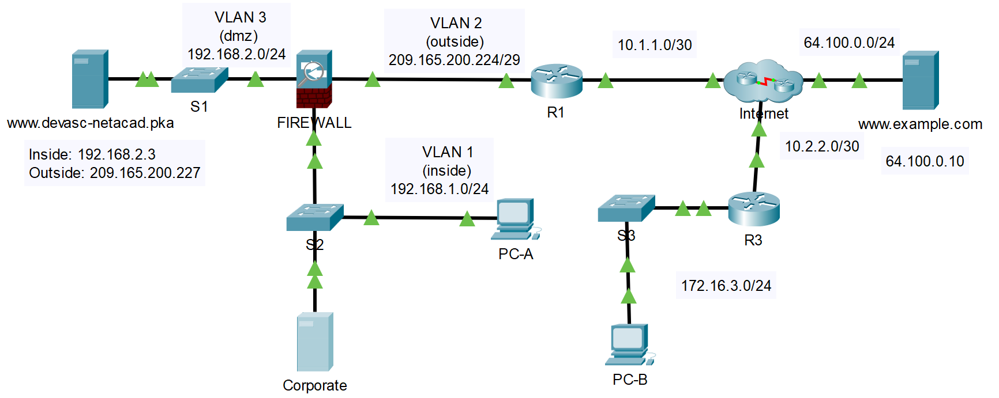

## Топология



## Таблица адресации

| Устройство     | Интерфейс     | IPv4-адрес           | Маска подсети   | Шлюз по умолчанию |
|----------------|---------------|----------------------|-----------------|-------------------|
| R1             | G0/0/0        | 209.165.200.225      | 255.255.255.248 | Н/Д               |
| R1             | G0/0/1        | 10.1.1.2             | 255.255.255.252 | Н/Д               |
| R3             | G0/0/0        | 10.2.2.2             | 255.255.255.252 | Н/Д               |
| R3             | G0/0/1        | 172.16.3.1           | 255.255.255.0   | Н/Д               |
| FIREWALL       | VLAN1         | 192.168.1.1          | 255.255.255.0   | Н/Д               |
| FIREWALL       | VLAN2         | 209.165.200.226      | 255.255.255.248 | Н/Д               |
| FIREWALL       | VLAN3         | 192.168.2.1          | 255.255.255.0   | Н/Д               |
| DEVASC Server  | сетевая карта | IN: 192.168.2.3      | 255.255.255.0   | 192.168.1.1       |
| DEVASC Server  | VLAN1         | OUT: 209.165.200.227 | 255.255.255.248 | 209.165.200.225   |
| Example Server | сетевая карта | 64.100.0.10          | 255.255.255.0   | 64.100.0.1        |
| PC-A           | сетевая карта | DHCP назначен        | 255.255.255.0   | 192.168.1.1       |
| PC-B           | сетевая карта | 172.16.3.2           | 255.255.255.0   | 172.16.3.1        |

## Цели

-   **Часть 1. Настройка DNS**
-   **Часть 2. Настройка DHCP**
-   **Часть 3. Настройка NTP**
-   **Часть 4. Использование SSH для настройки коммутатора**
-   **Часть 5: Используйте SNMP**
-   **Часть 6. Настройка HTTPS**
-   **Часть 7. Настройка электронной почты**
-   **Часть 8. Настройка FTP**

## Предыстория/сценарий

Многие службы работают в сетях за кулисами, чтобы все происходило надежно и эффективно. Как разработчик, вы должны понимать, какие услуги доступны и как они могут вам помочь. Также следует понимать основы настройки самых полезных и популярных сервисов. В Packet Tracer эти сервисы моделируются, а их конфигурация проста и понятна. Однако Packet Tracer очень хорошо имитирует реальный трафик. По мере того, как вы выполняете это практическое задание и отправляете трафик, мы рекомендуем вам переключиться в режим имитации, чтобы изучить содержимое различных типов пакетов, генерируемых сетью.

>   **Примечание**. Packet Tracer оценивает не все, что вы делаете в этом упражнении. Однако вы должны быть в состоянии проверить свои конфигурации, следуя инструкциям. В конце действия ваш процент завершения должен быть 100%.

>   **Примечание**. В этом упражнении два веб-сервера называются **DEVASC Server** и **Example Server**. В топологии они называются по URL-адресу: **www.devasc-netacad.pka** и **www.example.com** .

## Инструкции

### Часть 1. Настроить DNS

Всем хостам в сети назначается IP-адрес. IP-адрес может быть адресом IPv4, адресом IPv6 или обоими. Это также включает в себя все хосты в Интернете. Но вы не используете их IP-адрес для связи с ними. Вы используете распространенные имена, такие как cisco.com. Система доменных имен (DNS) — это служба, которая автоматически переводит распространенные, легко запоминающиеся имена в IP-адреса, чтобы между устройствами могла осуществляться связь. В этом действии Packet Tracer устройства используют адреса IPv4.

**Шаг 1. Настройте локальный DNS-сервер.**

1.  Щелкните сервер **Corporate**.
2.  Щелкните **Services**.
3.  Щелкните **DNS**.
4.  Щелкните переключатель **On**, чтобы включить службу DNS.

    Теперь, когда DNS включен, вам нужно будет предоставить информацию обо всех хостах в сети (сетях), для которых вы хотите преобразовать их имена в адреса IPv4.

5.  В поле **Name** введите **www.example.com**.
6.  IPv4-адрес сервера — 64.100.0.10. В поле **Address** введите адрес IPv4.
7.  Щелкните **Add**.

    Теперь вы увидите запись, которая показывает имя хоста и IPv4-адрес **Example Server**. Здесь DNS будет искать имя хоста и возвращать IPv4-адрес этого хоста любому устройству, которое его запрашивает.

**Шаг 2. Настройте и протестируйте использование локального DNS-сервера.**

1.  Нажмите **PC-A**.
2.  Щелкните **Config**.
3.  В поле **DNS Server** введите IPv4-адрес DNS-сервера **Corporate**: 192.168.1.3.

    Теперь, когда компьютер PC-A использует общие имена хостов, он будет отправлять DNS-запрос на IPv4-адрес хоста с таким именем.

4.  Щелкните **Desktop \> Command Prompt**.
5.  Пинг **www.example.com**. Пинг может не пройти с первого раза, а то и со второго, так как сеть сходится. Но с третьей попытки все должно получиться. Обратите внимание, что самая первая строка выходных данных показывает, что компьютер PC-A использует правильный адрес IPv4 для **Example Server**.

    ```
    Packet Tracer PC Command Line 1.0
    C:\> ping www.example.com

    Pinging 64.100.0.10 with 32 bytes of data:

    Request timed out.
    <output omitted>

    C:\> ping www.example.com

    Pinging 64.100.0.10 with 32 bytes of data:

    Reply from 64.100.0.10: bytes=32 time=3ms TTL=125
    <output omitted>

    C:\>
    ```

    >   **Примечание**. Существует известная проблема с реализацией брандмауэра Packet Tracer. Вы не сможете получить доступ к веб-серверам с PC-A. Однако компьютер PC-A сможет отправлять и получать электронную почту через **Example Server** позже в этом упражнении.

**Шаг 3. Настройте и протестируйте использование удаленного DNS-сервера.**

На PC-B нет локального DNS-сервера. Поэтому он будет использовать **Example Server** в качестве своего DNS-сервера.

1.  Нажмите **PC-B.**
2.  Щелкните **Config.**
3.  В поле **DNS Server** введите IPv4-адрес DNS-сервера **Corporate**: 64.100.0.10.
4.  Щелкните **Desktop \> Command Prompt**.
5.  Пинг **www.example.com.** Пинг может занять несколько секунд, но он должен пройти успешно.
6.  Пропингуйте **www.devasc-netacad.pka.** Пинг может не пройти с первого раза, а то и со второго, так как сеть сходится. Но с третьей попытки все должно получиться.
7.  Закройте окно **Command Prompt** и щелкните **Web Browser.**
8.  Введите **www.example.com** в поле URL и нажмите **Go.** Теперь вы должны увидеть веб-страницу Example.com, отображаемую в веб-браузере.
9.  Введите **www.devasc-netacad.pka** в поле URL и нажмите **Go.** Теперь вы должны увидеть веб-страницу сервера DEVASC, отображаемую в веб-браузере.

### Часть 2. Настройте DHCP

Ручная настройка IPv4-адресов подходит для очень маленьких сетей, но в более крупных сетях необходимо автоматически предоставлять IPv4-адресацию устройствам при их подключении к сети. Протокол динамической конфигурации хоста (DHCP) предоставляет эту услугу. Это также удобно при перемещении устройств, потому что, если они перейдут в другую подсеть, они получат новый адрес и смогут общаться с другими хостами.

Еще одна замечательная особенность DHCP заключается в том, что он автоматически устанавливает не только адрес IPv4 для хоста, но также подсеть, шлюз по умолчанию и адрес DNS-сервера. Это упрощает автоматическую настройку множества фрагментов информации на хостах.

**Шаг 1. Настройте DHCP на корпоративном сервере Corporate.**

**Примечание.** Ваш процент **завершения** не увеличится, пока вы не нажмете **Save** (Сохранить) в конце этого шага.

1.  Щелкните сервер **Corporate**, затем **Services,** если необходимо.
2.  Нажмите **DHCP.**
3.  Щелкните переключатель **On**, чтобы включить службу DHCP.

    Теперь вы определите пул адресов IPv4, которые вы хотите назначить хостам. Вы будете использовать адреса IPv4 в подсети 192.168.1.0. Вы не можете использовать адрес 192.168.1.1, потому что он уже используется интерфейсом **FIREWALL.** Вы также не можете использовать адрес корпоративного сервера 192.168.1.3. Кроме того, рекомендуется оставлять некоторые адреса свободными для статического назначения серверам или другим устройствам, где вы хотите, чтобы их адреса оставались прежними.

4.  Имя пула **Pool Name** в настоящее время **serverPool**. Не меняйте его.
5.  В качестве **шлюза по умолчанию** введите IPv4-адрес ВНУТРЕННЕГО интерфейса **FIREWALL:** 192.168.1.1.

    Это предоставит каждому хосту DHCP маршрут к другим сетям.

6.  Для **DNS Server** введите IPv4-адрес сервера **Corporate**: 192.168.1.3.

    Это предоставит каждому хосту DHCP адрес, который будет использоваться для отправки сообщений DNS.

7.  В качестве **Start IP Address** используйте 192.168.1.10.

    Это обеспечивает несколько статически назначенных устройств в сети в будущем.

8.  В качестве **Subnet Mask** используйте 255.255.255.0.
9.  В поле «Максимальное количество пользователей» введите 245, оставшуюся сумму после откладывания 10.
10. Щелкните **Save,** чтобы перезаписать имя **serverPool** по умолчанию**.**

**Шаг 2. Проверьте конфигурацию DHCP.**

1.  Нажмите **PC-A.**
2.  Закройте **Command Prompt,** если она все еще открыта.
3.  Щелкните **IP Configuration**.
4.  Щелкните **DCHP.**

    Это может занять некоторое время, но вам должен быть предоставлен адрес IPv4 от маршрутизатора за пределами первых 10 адресов. Вы также должны увидеть маску подсети, шлюз по умолчанию и DNS-сервер, предоставленные вам автоматически.

### Часть 3. Настроить NTP

Часы на маршрутизаторе или коммутаторе важны для управления сетями, их защиты и устранения неполадок. Даже в небольших сетях важно синхронизировать время на всех устройствах. Попытка сделать это вручную практически невозможна, особенно для больших сетей. Сетевой протокол времени (NTP) можно использовать для синхронизации времени на каждом устройстве, получая его от сервера NTP, гарантируя, что время будет одинаковым.

**Шаг 1. Включите службу NTP.**

1.  Щелкните сервер **Corporate**.
2.  Щелкните **Services.**
3.  Щелкните **NTP.**
4.  Щелкните переключатель **On** рядом с **Service**.

**Шаг 2. Исследуйте NTP на S2.**

S2 уже настроен на использование корпоративного сервера в качестве NTP-сервера.

1.  Щелкните **S2.**
2.  Щелкните **CLI.**
3.  Нажмите **Enter**, чтобы получить командную строку. Вход в привилегированный режим EXEC с помощью команды **enable**. Используйте **cisco** в качестве пароля.

    ```
    S2> enable
    Password: <cisco>
    S2#
    ```

1.  Отображение текущего времени и даты с помощью команды **show clock details** . Обратите внимание, что время устанавливается аппаратно и не является точным.

    ```
    S2# show clock detail
    *0:3:44.318 UTC Mon Mar 1 1993
    Time source is hardware calendar
    S2#
    ```

1.  Вы можете настроить время вручную с помощью команды **clock**. Однако лучше использовать сервер NTP. Войдите в режим глобальной конфигурации с помощью команды **configure terminal**.

    ```
    S2# configure terminal
    Enter configuration commands, one per line.  End with CNTL/Z.
    S2(config)#
    ```

1.  Настройте S2 для использования корпоративного сервера в качестве NTP-сервера. Выйдите из режима глобальной конфигурации и убедитесь, что S2 теперь использует NTP. Теперь ваше время и дата должны быть точными.

    ```
    S2(config)# ntp server 192.168.1.3
    S2(config)# exit
    S2# show clock detail
    14:1:26.216 UTC Thu May 21 2020
    Time source is NTP
    S2#
    ```

>   **Примечание.** Обновление источника до NTP может занять некоторое время. Вы можете нажать **Fast Forward Time** (кнопка с двойной стрелкой), чтобы ускорить симуляцию.

### Часть 4. Используйте SSH для безопасного доступа к коммутатору

Secure Shell (SSH) — это протокол, который используется для шифрования связи между клиентом и хостом. SSH является предпочтительным типом подключения, поскольку он безопаснее по сравнению с Telnet. SSH уже настроен на S2.

1.  Щелкните PC-A. Закройте **IP Configuration,** если это необходимо.
2.  Щелкните **Desktop \> Command Prompt**.
3.  Попытайтесь установить небезопасный сеанс Telnet с S2.

    ```
    C:\> telnet 192.168.1.4
    Trying 192.168.1.4 ...Open

    [Connection to 192.168.1.4 closed by foreign host]
    ```

1.  S2 отклоняет ваш запрос, поскольку он настроен только для доступа по SSH. Введите команду **ssh** и нажмите **Enter**, чтобы узнать, как использовать эту команду. Обратите внимание, что опция — это строчная буква **L**, а не цифра **1**.

    ```
    C:\> ssh
    Packet Tracer PC SSH

    Usage: SSH -l username target.

    C:\>
    ```

1.  Попытайтесь установить SSH-соединение с S2. Пароль **cisco.**

    ```
    C:\> ssh -l administrator 192.168.1.4

    Password: 


    S2>
    ```

    Теперь вы можете безопасно настроить S2.

1.  Теперь вы получаете доступ к командной строке для S2 через безопасное соединение. Войдите в режим глобальной конфигурации с помощью команды **enable**, чтобы убедиться, что вы можете настроить коммутатор удаленно. Используйте **cisco** в качестве пароля. Затем введите **exit**, чтобы завершить сеанс SSH.

    ```
    S2> enable
    Password: 
    S2# exit

    [Connection to 192.168.1.4 closed by foreign host]
    C:\>
    ```

### Часть 5. Исследование идентификаторов объектов SNMP MIB

Простой протокол управления сетью (SNMP) можно использовать для получения и установки переменных, связанных со статусом и конфигурацией сетевых узлов, таких как маршрутизаторы и коммутаторы, а также сетевых клиентских компьютеров. Диспетчер SNMP может запрашивать данные у агентов SNMP, либо данные могут автоматически отправляться диспетчеру SNMP путем настройки ловушек на агентах SNMP. В этой части вы получите коды идентификаторов объектов базы данных управления (MIB), чтобы узнать подробности сообщений с помощью браузера MIB.

Устройства Cisco используют строки сообщества для аутентификации доступа к информационной базе управления (MIB). Здесь хранится вся информация об устройстве. Строка сообщества — это просто текстовый пароль. Строки сообщества могут быть доступны только для чтения (ro) или для чтения и записи (rw). Эти строки сообщества были созданы для вас на R3, чтобы вы могли исследовать MIB.

**Примечание.** Хотя для управления сетью можно использовать программный доступ к SNMP, теперь доступны более сложные инструменты, как вы увидите в оставшейся части этого курса. Однако на сегодняшний день SNMP имеет большое количество установок в сетях и останется ценным инструментом управления в обозримом будущем.

Выполните следующие действия, чтобы изучить моделирование SNMP в Packet Tracer.

1.  Нажмите **PC-B** . Закройте **Web Browser,** если это необходимо.
2.  Щелкните **MIB Browser.**
3.  Введите адрес **R3** в поле **Address**: 172.16.3.1.
4.  Нажмите **Advanced.**
5.  Введите **read** в поле **Read Community.**
6.  Введите **write** в поле для **Write Community.**
7.  Измените **SNMP Version** на **v3.**
8.  Нажмите **ОК.**
9.  Щелкните стрелку рядом с **MIB** **Tree,** чтобы расширить дерево.
10. Щелкните стрелку рядом с **router_std MIBs**.
11. Продолжайте расширять дерево, пока не дойдете до **.mgmt** .
12. Раскройте **.mgmt** .
13. Продолжайте раскрывать дерево, пока не дойдете до **.system**.
14. Развернуть **.system**. Возможно, вам придется сделать окно шире в этой точке. Вы также можете захватить среднюю полосу между **MIB Tree** слева и **Result Table** справа.
15. Нажмите **.sysName**.
16. Нажмите кнопку **GO**.

    Теперь вы увидите, что значение объекта равно **R3**. Вы можете просмотреть другие объекты в MIB, такие как интерфейсы на маршрутизаторе.

17. Разверните дерево **.interfaces \> .ifTable \> .ifEntry \> .ifOperStatus** и нажмите **GO** .

    Вы увидите, что два из трех интерфейсов работают. Теперь вы можете легко запросить что-либо о маршрутизаторе.

### Часть 6. Настроить HTTPS

Когда вы подключаетесь к серверу с помощью HTTP, вы подключаетесь и предполагаете, что это правильный сервер. Данные, передаваемые между вами и сервером, отправляются в виде открытого текста, поэтому, если кто-то перехватит эти данные, он сможет прочитать их и манипулировать ими. Обычно это не проблема, если вы просто просматриваете Интернет. Но если вы создаете учетную запись, получаете доступ к учетной записи или предоставляете какую-либо личную информацию, она может быть перехвачена и использована кем-то другим. Безопасный HTTP (HTTPS) добавляет уровень безопасности, шифруя соединение между вами и сервером. Сайт должен иметь сертификат безопасности из надежного источника, чтобы убедиться, что сайт является законным. Ваш браузер проверяет, действителен ли сертификат и получен ли он из надежного источника, прежде чем подключить вас к сайту.

**Шаг 1. Откройте свою веб-страницу с ПК.**

1.  Нажмите **PC-B**.
2.  Щелкните **Desktop**.
3.  Щелкните **Web Browser**.
4.  Введите **www.devasc-netacad.pka** в поле **URL** и нажмите **Go**. Вы подтвердили доступ ранее. Однако после того, как вы нажмете **Go**, обратите внимание, что используется протокол HTTP (http://).

**Шаг 2. Осмотрите FIREWALL.**

1.  Нажмите **FIREWALL**.
2.  Щелкните **CLI**.
3.  Нажмите **Enter**.
4.  Введите **enable** и нажмите **Enter**.

    Пароля нет, поэтому нажмите **Enter**.

5.  Введите **show run** и нажмите **Enter**.
6.  Используйте пробел для прокрутки конфигурации межсетевого экрана.

    Обратите внимание на следующие две конфигурации в списке доступа OUTSIDE-DMZ:

    ```
    <output omitted>
    access-list OUTSIDE-DMZ extended permit icmp any host 192.168.2.3 
    access-list OUTSIDE-DMZ extended permit tcp any host 192.168.2.3 eq www
    access-list OUTSIDE-DMZ extended permit tcp any host 192.168.2.3 eq 443
    <output omitted>
    ```

    Строка с **www** разрешает порт 80, который является незащищенным HTTP-трафиком. Строка с портом **443** разрешает порт 443, который является защищенным трафиком HTTP (HTTPS).

1.  Удалите оператор **access-list**, который разрешает незащищенный HTTP-трафик через порт 80. Введите версию списка доступа, как показано ниже **.** Команда будет перенесена на следующую строку, но не нажимайте **Enter**, пока не выполните полную команду.

    ```
    FIREWALL# configure terminal
    FIREWALL(config)# no access-list OUTSIDE-DMZ extended permit tcp any host 192.168.2.3 eq www
    FIREWALL(config)#
    ```

**Шаг 3. Настройте HTTPS.**

1.  Щелкните **DEVASC Server**.
2.  Щелкните **Services \> HTTP**. Обратите внимание, что для HTTP установлено значение **On** , а для HTTPS — **Off** .
3.  Выключите HTTP и включите HTTPS. Несмотря на то, что брандмауэр больше не разрешает доступ по протоколу HTTP, рекомендуется настроить сервер так, чтобы он разрешал только HTTPS.
4.  Щелкните переключатель HTTPS, чтобы включить его в положение **On**.

**Шаг 4. Проверьте конфигурацию HTTPS.**

1.  Нажмите **PC-B** .
2.  закройте **MIB Browser**. Щелкните **Web Browser**, чтобы снова открыть его.
3.  Убедитесь , что компьютер **PC-B** больше не может получить доступ к **www.devasc-netacad.pka** по протоколу HTTP. Через несколько секунд вы должны получить сообщение **Request Timeout**. Нажмите **Fast Forward Time** , чтобы ускорить это.
4.  Измените **http** на **https** и нажмите **Go**. Теперь вы должны увидеть веб-страницу.

    **http://www.devasc-netacad.pka**

### Часть 7. Настройте электронную почту

Почтовые клиенты используют простой протокол передачи почты (SMTP), порт 25, для отправки электронной почты на сервер. SMTP также используется для отправки электронной почты между серверами. Почтовый клиент использует почтовый протокол 3 (POP3), порт 110, для получения почты с сервера.

**Шаг 1. Настройте сервер электронной почты.**

1.  Нажмите **Example Server**.
2.  Щелкните **Services**.
3.  Нажмите **EMAIL**.
4.  Включите службы **SMTP** и **POP3.**
5.  Введите **www.example.com** в поле **Domain** **Name**.
6.  Щелкните **Set**.

**Шаг 2. Создайте пользователей.**

1.  В поле **User** введите **Student1**.
2.  Введите **class** для пароля.
3.  Щелкните поле **plus (+)**, чтобы добавить пользователя.
4.  Повторите этот шаг, чтобы добавить пользователя с именем **Student2** с тем же паролем.

**Шаг 3. Настройте клиентов.**

1.  Нажмите **PC-A**.
2.  Щелкните **Desktop**.
3.  Щелкните **Email**.
4.  Введите следующую информацию:

    Ваше имя: **Student1**

    Адрес электронной почты: **Student1@www.example.com**

    Сервер входящей почты: **64.100.0.10**

    Сервер исходящей почты: **64.100.0.10**

    Имя пользователя: **Student1**

    Пароль: **class**

5.  Нажмите **Save**.
6.  Повторите эту настройку на **PC-B,** заменив **Student1** на **Student2**.

**Шаг 4. Отправка и получение электронной почты**

1.  На **PC-B** откройте **Email,** если она не открыта.
2.  Нажмите **Compose**.
3.  Заполните следующую информацию:

    To: Student1@www.example.com

    Subject: Email

    В поле сообщения введите сообщение для Student1, например " How are you?"

4.  Щелкните **Send**.
5.  На **PC-A** откройте **Email,** если она не открыта.
6.  Щелкните **Receive**. Это может занять некоторое время и несколько попыток.
7.  Дважды щелкните сообщение, когда оно придет, чтобы прочитать его.
8.  Щелкните **Reply**.
9.  Введите ответ на письмо и нажмите **Send**.
10. Щелкните **Send**.
11. Вернитесь к **PC-B**, нажмите **Receive,** чтобы прочитать ответ.

### Часть 8. Настроить FTP

Протокол передачи файлов (FTP) — широко используемое приложение для передачи файлов между клиентами и серверами в сети. Сервер настроен для запуска службы, в которой клиенты подключаются, входят в систему и передают файлы. FTP использует порт 21 в качестве командного порта сервера для создания соединения. Затем FTP использует порт 20 для передачи данных.

**Шаг 1. Настройте сервер.**

1.  Щелкните сервер **Corporate**.
2.  Щелкните **Services**.
3.  Нажмите **FTP**.
4.  Щелкните переключатель **On**, чтобы включить службу FTP.
5.  В поле **Username** введите **Student**.
6.  В поле **Password** введите **class**.
7.  Установите все флажки под этими полями, чтобы разрешить пользователю запись, чтение, удаление, переименование и список.
8.  Щелкните **Add.**

    **Примечание**. На этом этапе ваш процент завершения должен составлять 100%. Если нет, нажмите **Check Results**, чтобы увидеть, какие обязательные компоненты еще не выполнены. Остальная часть этой деятельности не оценивается.

**Шаг 2. Воспользуйтесь FTP-сервисом.**

1.  Нажмите **PC-A**.
2.  Щелкните **Desktop**.
3.  Щелкните **Command Prompt.**
4.  Введите **dir**, чтобы увидеть файлы на ПК.

    ```
    C:\> dir
    Volume in drive C has no label.
    Volume Serial Number is 5E12-4AF3
    Directory of C:\

    2/6/2106 23:28 PM 26 sampleFile.txt 
    26 bytes 1 File(s) 
    C:\>
    ```

1.  FTP на IPv4-адрес Корпоративного сервера.

    ```
    C:\> ftp 192.168.1.3
    Trying to connect...192.168.1.3
    Connected to 192.168.1.3
    220- Welcome to PT Ftp server
    Username:
    ```

1.  Введите имя пользователя и пароль, которые вы настроили ранее, чтобы получить доступ.
2.  Войти **?** и нажмите **Enter** , чтобы увидеть команды, доступные в ftp-клиенте.

    ```
    ftp> ?
            ?
            cd
            delete
            dir
            get
            help
            passive
            put
            pwd
            quit
            rename
    ftp>
    ```

1.  Введите **dir**, чтобы увидеть файлы, доступные на сервере.

    ```
    ftp> dir

    Listing /ftp directory from 192.168.1.3: 
    0 : asa842-k8.bin 5571584
    1 : asa923-k8.bin 30468096
    2 : c1841-advipservicesk9-mz.124-15.T1.bin 33591768
    3 : c1841-ipbase-mz.123-14.T7.bin 13832032
    <output omitted>
    ```

1.  Введите **put sampleFile.txt**, чтобы отправить файл на сервер.

    ```
    ftp> put sampleFile.txt

    Writing file sampleFile.txt to 192.168.1.3: 
    File transfer in progress...

    [Transfer complete - 26 bytes]

    26 bytes copied in 0.08 secs (325 bytes/sec)
    ftp>
    ```

1.  Используйте команду **dir** еще раз, чтобы снова просмотреть содержимое FTP-сервера, чтобы увидеть файл.
2.  Введите **get asa842-k8.bin**, чтобы получить файл с сервера. Это может занять 30 секунд или больше, так как файл большой. **Fast Forward Time** не помогает.

    ```
    ftp> get asa842-k8.bin

    Reading file asa842-k8.bin from 192.168.1.3: 
    File transfer in progress...

    [Transfer complete - 5571584 bytes]

    5571584 bytes copied in 46.893 secs (42706 bytes/sec)
    ftp>
    ```

1.  Введите **delete sampleFile.txt**, чтобы удалить файл с сервера.

    ```
    ftp> delete sampleFile.txt

    Deleting file sampleFile.txt from 192.168.1.3: ftp>
    [Deleted file sampleFile.txt successfully ]
    ftp>
    ```

1.  Введите **quit** , чтобы выйти из FTP-клиента.
2.  Снова отобразите содержимое каталога на ПК, чтобы увидеть файл изображения с FTP-сервера.

    В окне Instructions для этого действия ваш процент завершения должен быть 100%. Если нет, нажмите **Check Results**, чтобы увидеть, какие обязательные компоненты еще не выполнены.
