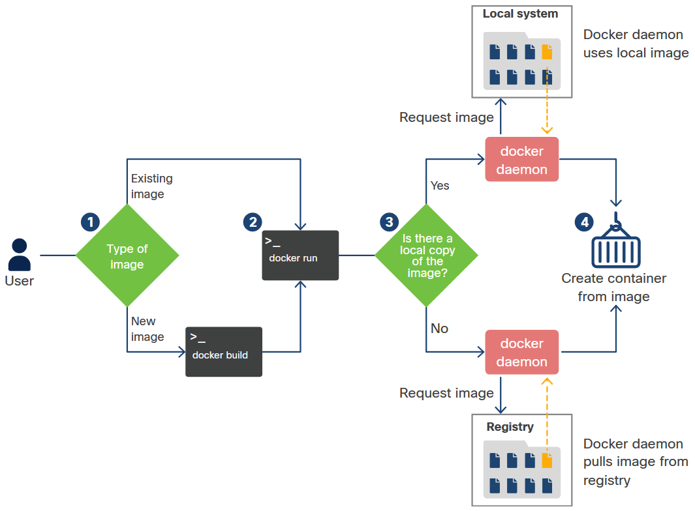

<!-- 6.2.1 -->
## Что такое Докер?

Самый популярный способ поместить приложение в контейнер - это развернуть его как контейнер Docker. Контейнер - это способ инкапсулировать все, что вам нужно для запуска вашего приложения, чтобы его можно было легко развернуть в различных средах. Docker - это способ создания и запуска этого контейнера. В частности, Docker - это формат, который объединяет ряд различных технологий для создания того, что мы сегодня знаем как контейнеры. Эти технологии:

* **Пространства имён** - Они изолируют разные части работающего контейнера. Например, сам процесс изолирован в пространстве имен pid (идентификатор процесса), файловая система изолирована в пространстве имен `mnt` (mount) пространство имен, а сеть изолирована в пространстве имен net.
* **Контрольные группы** - `cgroups` являются стандартной концепцией Linux, которая позволяет системе ограничивать ресурсы, такие как ОЗУ или хранилище, используемые приложением.
* **Union File Systems** - `UnionFS`- это файловые системы, которые построены слой за слоем и объединяют ресурсы.

Образ Docker - это набор файлов, доступных только для чтения, без состояния. Образ Docker содержит исходный код, библиотеки и другие зависимости, необходимые для запуска приложения. Контейнер Docker - это исполняемый экземпляр образа Docker. У вас может быть много запущенных контейнеров одного и того же образа Docker. Образ Docker похож на рецепт торта, и вы можете приготовить столько пирожных (контейнеров Docker), сколько захотите.

Образы, в свою очередь, могут храниться в реестрах, таких как Docker Hub. В целом система выглядит так:


<!-- /courses/devnet/9bd0a1b0-b013-11ea-b75f-ab3f17a06d7d/9bdb9e30-b013-11ea-b75f-ab3f17a06d7d/assets/238b15a7-c2dd-11ea-9970-b90c4abb30b0.svg -->

Создание контейнера включает извлечение изображения или шаблона из репо, а затем его использование для создания контейнера.

Итак, упрощенная версия рабочего процесса создания контейнера выглядит так:

**Шаг 1**. Либо создайте новое изображение, используя `docker build` или вытащите копию существующего образа из реестра с помощью docker pull. (В зависимости от обстоятельств этот шаг не является обязательным. См. Шаг 3.)
**Шаг 2**. Запустить контейнер на основе образа, используя `docker run` или `docker container create`.
**Шаг 3**. Демон Docker проверяет, есть ли у него локальная копия образа. Если этого не происходит, он вытаскивает образ из реестра.
**Шаг 4**. Демон Docker создает контейнер на основе образа и, если был использован `docker run`, входит в него и выполняет запрошенную команду.

Как видите, если вы собираетесь создать развертывание примера приложения на основе контейнера, вам придется создать образ. Для этого вам понадобится `Dockerfile`.

<!-- 6.2.2 -->
## Что такое Dockerfile?

Если вы использовали язык программирования, такой как C, вы знаете, что для этого вам нужно было скомпилировать свой код. Если да, то вы, возможно, знакомы с концепцией «make-файла». Это файл, который утилита make использует для компиляции и сборки всех частей приложения.

Вот что такое `Dockerfile` делает для Docker. Это простой текстовый файл с именем `Dockerfile`. Он определяет шаги, которые `docker build` необходимо использовать команду для создания образа, который затем можно использовать для создания целевого контейнера.

Вы можете создать очень простой `Dockerfile` который создает контейнер Ubuntu. Используйте команду cat, чтобы создать `Dockerfile`, а затем добавьте `FROM Ubuntu` в файл. Нажмите `Ctrl + D` чтобы сохранить и выйти из файла со следующим текстом и сохранить его в текущем каталоге:

```
devasc@labvm:~$ cat > Dockerfile
FROM ubuntu:latest
<Ctrl+D>
devasc@labvm:~$
```

Это все, что нужно, всего одна строчка. Теперь вы можете использовать `docker build` команда для создания образа, как показано в следующем примере. Опция `–t` используется для названия сборки. Обратите внимание на период (`.`) в конце команды, которая указывает, что изображение должно быть построено в текущем каталоге. Использовать `docker build –help` чтобы увидеть все доступные варианты.

```
devasc@labvm:~$ docker build -t myubuntu:latest .
Sending build context to Docker daemon  983.3MB
Step 1/1 : FROM ubuntu:latest
latest: Pulling from library/ubuntu
692c352adcf2: Pull complete 
97058a342707: Pull complete 
2821b8e766f4: Pull complete 
4e643cc37772: Pull complete 
Digest: sha256:55cd38b70425947db71112eb5dddfa3aa3e3ce307754a3df2269069d2278ce47
Status: Downloaded newer image for ubuntu:latest
 ---> adafef2e596e
Successfully built adafef2e596e
Successfully tagged myubuntu:latest
devasc@labvm:~$
```

Введите команду `docker images` чтобы увидеть ваше изображение в списке образов на виртуальной машине DEVASC:

```
devasc@labvm:~$ docker images
REPOSITORY          TAG                 IMAGE ID            CREATED             SIZE
myubuntu            latest              adafef2e596e        3 days ago          73.9MB
ubuntu              latest              adafef2e596e        3 days ago          73.9MB
devasc@labvm:~$
```

Теперь, когда у вас есть изображение, используйте `docker run`  команда для его запуска. Теперь вы находитесь в оболочке bash ВНУТРИ созданного вами образа докера. Перейдите в домашний каталог и введите `ls` чтобы убедиться, что он пустой и готов к использованию. Войти `exit`, чтобы покинуть контейнер Docker и вернуться в основную операционную систему DEVASC VM.

```
devasc@labvm:~$ docker run -it myubuntu:latest /bin/sh
# ls
bin  boot  dev  etc  home  lib  lib32  lib64  libx32  media  mnt  opt  proc  root  run  sbin  srv  sys  tmp  usr  var
# cd home
# ls
# exit
devasc@labvm:~$
```

<!-- 6.2.3 -->
## Анатомия Dockerfile

Конечно, если бы вы могли с помощью `Dockerfile` запустить чистую операционную систему, это было бы полезно, но вам нужен способ начать с шаблона и строить оттуда.

> **Примечание**: Шаги, показанные в оставшейся части этого раздела, предназначены только для инструкций. Дополнительные сведения, необходимые для выполнения этих команд на виртуальной машине DEVASC, не предоставляются. Однако вы выполните аналогичные шаги в лабораторной работе «Создание образца веб-приложения в контейнере Docker» далее в этом разделе.

Рассмотрим пример `Dockerfile` который контейнеризирует приложение Python:

```
FROM python
WORKDIR /home/ubuntu
COPY ./sample-app.py /home/ubuntu/.
RUN pip install flask
CMD python /home/ubuntu/sample-app.py
EXPOSE 8080
```

Объяснение команд `Dockerfile` выглядит следующим образом:

* Команда `FROM` устанавливает Python в образ Docker. Он вызывает образ по умолчанию на основе Debian Linux из Docker Hub с установленной последней версией Python.
* Команда `WORKDIR` говорит Docker использовать `/home/Ubuntu`  как рабочий каталог.
* Команда `COPY` указывает Docker скопировать файл **sample-app.py** из текущего каталога Dockerfile в `/home/Ubuntu`.
* Команда `RUN` позволяет напрямую запускать команды в контейнере. В этом примере установлен Flask. Flask - это платформа для поддержки вашего приложения как веб-приложения.
* Команда `CMD` запустит сервер, когда вы запустите фактический контейнер. Здесь вы используете команду python для запуска **sample-app.py** внутри контейнера.
* Команда `EXPOSE` сообщает Docker, что вы хотите открыть порт 8080. Обратите внимание, что это порт, который прослушивает Flask. Если вы настроили свой веб-сервер для прослушивания где-то еще (например, https-запросы на порт 443), это то место, чтобы это настроить.

Для построения образа используйте команду `docker build`. В следующем выводе образ был построен ранее. Таким образом, Docker использует то, что хранится в кеше, для ускорения процесса.

```
$ docker build -t sample-app-image .
Sending build context to Docker daemon  3.072kB
Step 1/6 : FROM python
 ---> 0a3a95c81a2b
Step 2/6 : WORKDIR /home/ubuntu
 ---> Using cache
 ---> 17befcf89bab
Step 3/6 : COPY ./sample-app.py /home/ubuntu/.
 ---> Using cache
 ---> c0b3a4f9c568
Step 4/6 : RUN pip install flask
 ---> Using cache
 ---> 8cf8226c9f31
Step 5/6 : CMD python /home/ubuntu/sample-app.py
 ---> Running in 267c5d569356
Removing intermediate container 267c5d569356
 ---> 75cd4bf1d02a
Step 6/6 : EXPOSE 8080
 ---> Running in cc82eaca2028
Removing intermediate container cc82eaca2028
 ---> 9616439582f8
Successfully built 9616439582f8
Successfully tagged sample-app-image:latest
$
```

Как видите, Docker выполняет каждый шаг в файле Dockerfile, начиная с базового образа Python. Если этого образа нет в вашей системе, Docker извлекает его из реестра. Реестр по умолчанию - Docker Hub. Однако в безопасной среде вы можете создать собственный реестр доверенных образов контейнеров. Обратите внимание, что изображение на самом деле представляет собой несколько разных изображений, наложенных друг на друга, точно так же, как вы накладываете свои собственные команды поверх базового изображения.

Обратите внимание, что между этапами, такими как выполнение команды, Docker фактически создает новый контейнер и строит промежуточный образ, новый уровень, сохраняя этот контейнер. Фактически, вы можете сделать это самостоятельно, создав контейнер, внося нужные изменения, а затем сохранив этот контейнер как новый образ.

В предыдущем примере использовалось лишь небольшое количество доступных команд Dockerfile. Полный список доступен в документации Docker в справочнике Dockerfile. На данный момент список доступных команд выглядит так:

* FROM
* MAINTAINER
* RUN
* CMD
* EXPOSE
* ENV
* COPY
* ENTRYPOINT
* VOLUME
* USER
* WORKDIR
* ARG
* ONBUILD
* STOPSIGNAL
* LABEL

Введите команду `docker images` для просмотра списка изображений. Обратите внимание, что на самом деле есть два изображения, которые теперь кэшируются на машине. Первый - это образ Python, который вы использовали в качестве основы. Docker сохранил его, так что, если вы собираетесь перестроить свой образ, вам не придется загружать его снова.

```
$ docker images
REPOSITORY          TAG                 IMAGE ID            CREATED             SIZE
sample-app-image    latest              7b1fd666ae4c        About an hour ago   410MB
python              latest              daddc1037fdf        2 days ago          410MB
$
```

<!-- 6.2.4 -->
## Локальный запуск Docker-контейнера

Теперь, когда изображение создано, используйте его для создания нового контейнера и фактически выполните некоторую работу, введя команду `docker run`, как показано в следующем выводе. В этом случае указывается несколько параметров. Параметр `–d` является сокращением от `--detach` и говорит, что вы хотите запустить его в фоновом режиме. Параметр `-P` сообщает Docker, что нужно опубликовать его на открытых вами портах (в данном случае `8080`).

```
$ docker run -d -P sample-app-image
1688a2c34c9e7725c38e3d9262117f1124f54685841e97c3c5225af88e30bfc5
$
```

Вы можете увидеть контейнер, перечислив процессы:

```
$ docker ps
CONTAINER ID        IMAGE               COMMAND                  CREATED             STATUS              PORTS                   NAMES
90edd03a9511        sample-app-image    "/bin/sh -c 'python …"   5 seconds ago       Up 3 seconds        0.0.0.0:32774->8080/tcp   jovial_sammet
$
```

Здесь следует отметить несколько моментов. Работая в обратном направлении, обратите внимание, что Docker присвоил контейнеру имя `jovial_sammet`. Вы также могли бы назвать его сами с помощью опции `--name`. Например:

```
docker run -d -P --name pythontest sample-app-image
```

Также обратите внимание, что, хотя контейнер прослушивает порт 8080, это всего лишь внутренний порт. Docker указал внешний порт, в данном случае 32774, который будет перенаправлять на этот внутренний порт. Это позволяет запускать несколько контейнеров, которые прослушивают один и тот же порт, без конфликтов. Если вы хотите открыть свой образец веб-сайта приложения, вы можете использовать общедоступный IP-адрес для хост-сервера и этого порта. В качестве альтернативы, если бы вы вызывали его с самого хост-компьютера, вы все равно использовали бы этот внешний порт, как показано с помощью следующей команды `curl`.

```
$ curl localhost:32774
You are calling me from 172.17.0.1
$
```

Docker также позволяет вам указать конкретный порт для пересылки, чтобы вы могли создать более предсказуемую систему:

```
$ docker run -d -p 8080:8080 --name pythontest sample-app-image
$ docker ps
CONTAINER ID        IMAGE               COMMAND                  CREATED             STATUS              PORTS                   NAMES
a51da037bf35        sample-app-image    "/bin/sh -c 'python …"   28 seconds ago      Up 27 seconds       0.0.0.0:8080->8080/tcp    pythontest
90edd03a9511        sample-app-image    "/bin/sh -c 'python …"   24 minutes ago      Up 24 minutes       0.0.0.0:32774->8080/tcp   jovial_sammet
$
```

Когда ваш контейнер запущен, вы можете войти в него так же, как если бы вы входили в любой физический или виртуальный хост, используя `exec` команда с хоста, на котором запущен контейнер:

```
$ docker exec -it pythontest /bin/sh
# whoami
root
# pwd
/var/www/html
# exit
$
```

Чтобы остановить и удалить работающий контейнер, вы можете назвать его по имени:

```
$ docker stop pythontest
pythontest
$ docker rm pythontest
pythontest
$
```

Теперь, если вы снова посмотрите на запущенные процессы, вы увидите, что они исчезли.

```
$ docker ps
CONTAINER ID        IMAGE               COMMAND                  CREATED             STATUS              PORTS                   NAMES
90edd03a9511        sample-app-image    "/bin/sh -c 'python …"   25 minutes ago      Up 25 minutes       0.0.0.0:32774->8080/tcp   jovial_sammet
$
```

<!-- 6.2.5 -->
## Сохранение образа Docker в реестр

Теперь, когда вы знаете, как создавать и использовать свое изображение, пришло время сделать его доступным для использования другими людьми. Один из способов сделать это - сохранить его в реестре образов.

По умолчанию Docker использует реестр Docker Hub, хотя вы можете создать и использовать свой собственный реестр. Вам нужно будет начать с входа в реестр:

```
$ docker login
Login with your Docker ID to push and pull images from Docker Hub. If you don't have a Docker ID, head over to https://hub.docker.com to create one.
Username: devnetstudent # This would be your username
Password:               # This would be your password
WARNING! Your password will be stored unencrypted in /home/ubuntu/.docker/config.json.
Configure a credential helper to remove this warning. See
https://docs.docker.com/engine/reference/commandline/login/#credentials-store
Login Succeeded
$
```

Затем вы фиксируете работающий экземпляр образа вашего контейнера. Например, `pythontest` в этом примере выполняется контейнер. Зафиксируйте контейнер командой `docker commit`.

```
$ docker ps
CONTAINER ID        IMAGE               COMMAND                  CREATED             STATUS              PORTS                   NAMES
54c44606344c        sample-app-image    "/bin/sh -c 'python …"   4 seconds ago       Up 2 seconds        0.0.0.0:8080->8080/tcp    pythontest
$ docker commit pythontest sample-app
Sha256:bddc326383032598a1c1c2916ce5a944849d90e4db0a34b139eb315af266e68b
$
```

Затем используйте команду `docker tag`, чтобы присвоить тег изображению, которое вы зафиксировали. Тег имеет следующую форму:

```
<repository>/<imagename>:<tag>
```

Первая часть, репозиторий, обычно представляет собой имя пользователя учетной записи, в которой хранится изображение. В этом примере это `devnetstudent`. Далее идет имя образа и, наконец, необязательный тег. (Помните, что если вы не укажете его, он будет самым последним.)

В этом примере тегом может быть v1, как показано здесь:

```
$ docker tag sample-app devnetstudent/sample-app:v1
$
```

Теперь образ готов к отправке в репозиторий:

```
$ docker push devnetstudent/sample-app:v1
The push refers to repository [docker.io/nickchase/sample-app]
e842dba90a43: Pushed
868914f88a69: Pushed
c7d71f6230b3: Pushed
1ed9b15dd229: Pushed
00947a3aa859: Mounted from library/python
7290ddeeb6e8: Mounted from library/python
d3bfe2faf397: Mounted from library/python
cecea5b3282e: Mounted from library/python
9437609235f0: Mounted from library/python
bee1c15bf7e8: Mounted from library/python
423d63eb4a27: Mounted from library/python
7f9bf938b053: Mounted from library/python
f2b4f0674ba3: Mounted from library/python
v1: digest: sha256:28e119f43e9c8e5e44f167d9baf113cc91d4f8b461714cd6bb578ebb0654f243 size: 3052
$
```

Отсюда вы можете видеть, что новый образ хранится локально:

```
$ docker images
REPOSITORY             TAG                 IMAGE ID            CREATED              SIZE
sample-app             latest              bddc32638303        About a minute ago   410MB
devnetstudent/sample-app   v1                  bddc32638303        About a minute ago   410MB
$
```

<!-- 6.2.6 -->
## Создание среды разработки

Как вы помните, в типичном рабочем процессе есть четыре различных среды:

* Среда разработки
* Среда тестирования
* Промежуточная среда
* Производственная среда

Начнем с создания среды разработки.

Среда разработки должна быть удобной для разработчика; он должен соответствовать производственной среде только там, где это необходимо. Например, если разработчик работает над функциональностью, которая не имеет ничего общего с базой данных, среда разработки не нуждается в реплике производственной базы данных или какой-либо базе данных вообще.

Типичная среда разработки может состоять из любого количества инструментов, от интегрированных сред разработки (IDE), таких как Eclipse, до баз данных и хранилища объектов. Важным моментом здесь является то, что это должно быть удобно для разработчика.

В этом случае вы собираетесь создать простое приложение Python с инструментами, доступными из базовой командной строки Bash. Вы также можете использовать Bash для выполнения задач тестирования и развертывания, поэтому начните с обновления Bash.

<!-- 6.2.7 -->
## Лабораторная работа - Создание образца веб-приложения в контейнере Docker

В этой лабораторной работе вы рассмотрите основные методы создания сценариев bash, поскольку создание сценариев bash является необходимым условием для остальной части лабораторной работы. Затем вы создадите и измените сценарий Python для простого веб-приложения. Затем вы создадите сценарий bash для автоматизации процесса создания Dockerfile, построения контейнера Docker и запуска контейнера Docker. Наконец, вы будете использовать команды docker, чтобы исследовать тонкости экземпляра контейнера Docker.

Вы выполните следующие задачи:

* Часть 1. Запуск виртуальной машины DEVASC
* Часть 2: Создание простого сценария Bash
* Часть 3. Создание образца веб-приложения
* Часть 4. Настройка веб-приложения для использования файлов веб-сайта
* Часть 5: Создание сценария Bash для сборки и запуска контейнера Docker
* Часть 6: Сборка, запуск и проверка контейнера Docker

[Создайте образец веб-приложения в контейнере Docker.](../06.02.07-lab-build-a-sample-web-app-in-a-docker-container/README.md)
