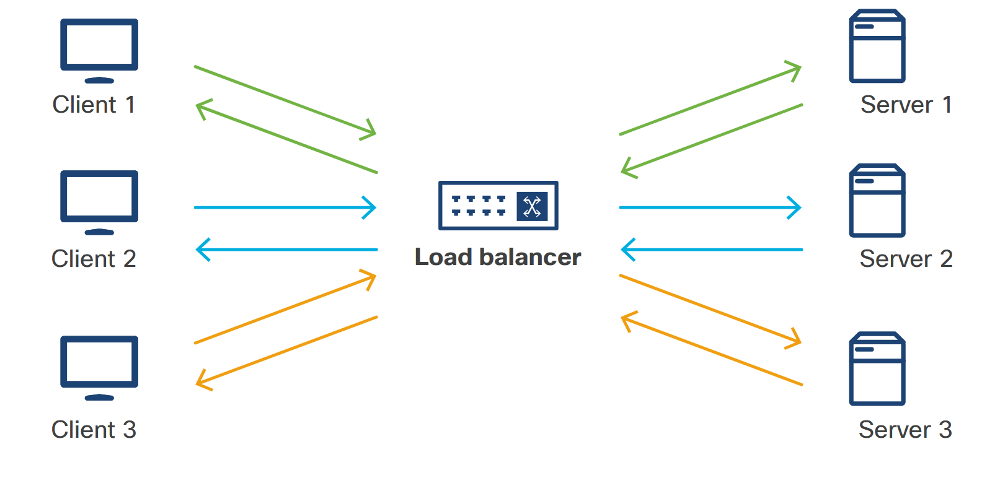
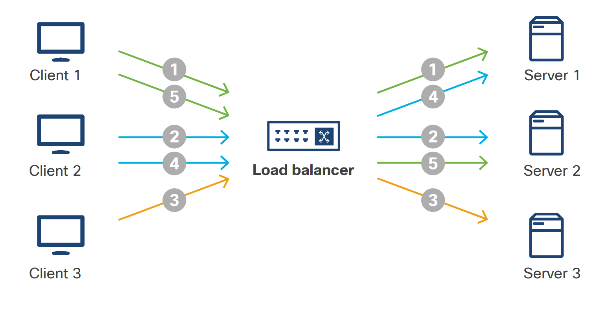
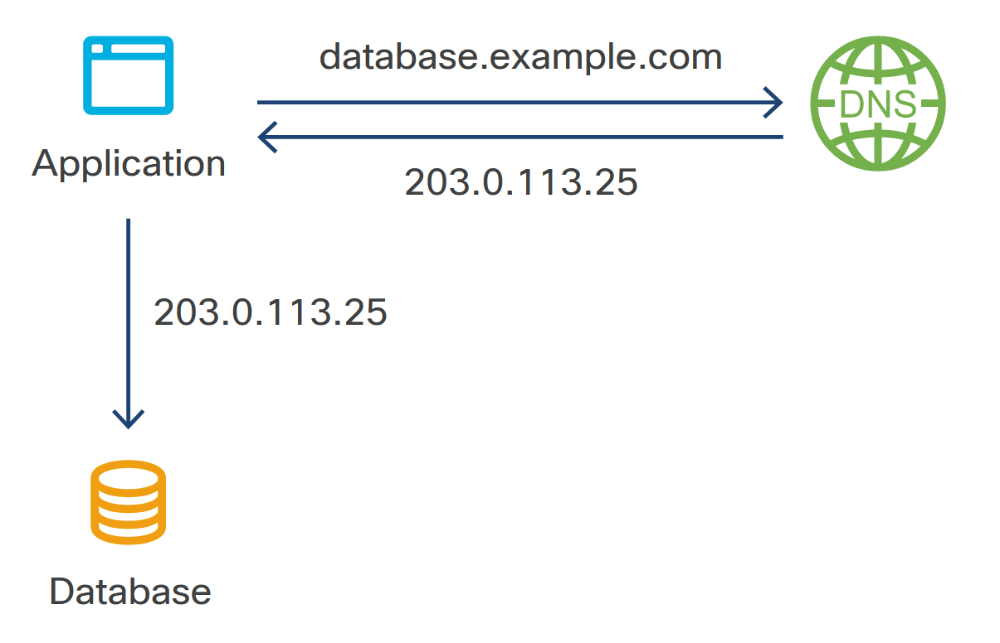
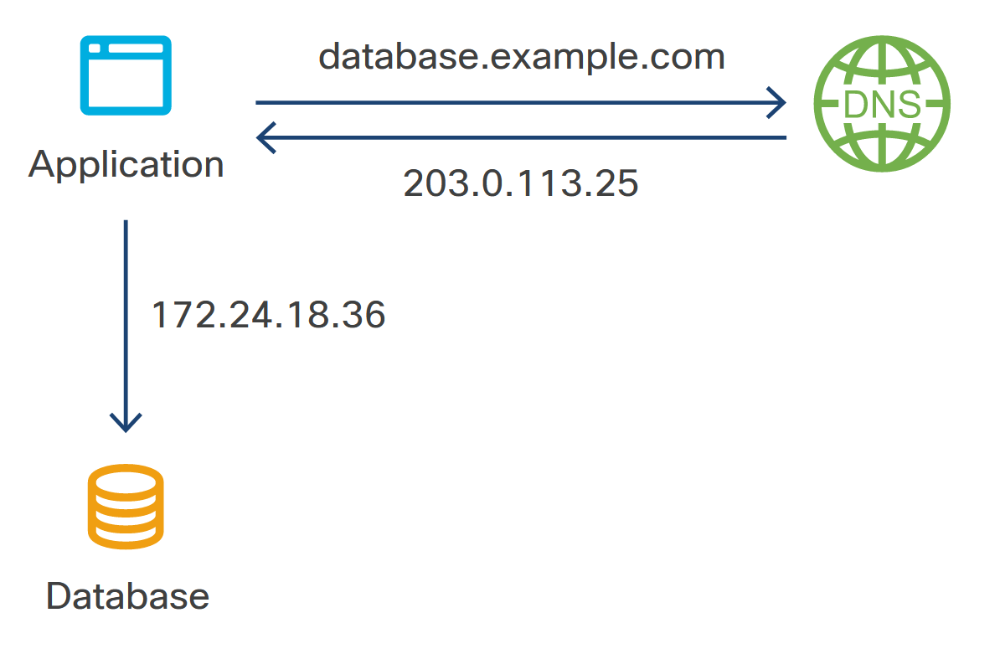
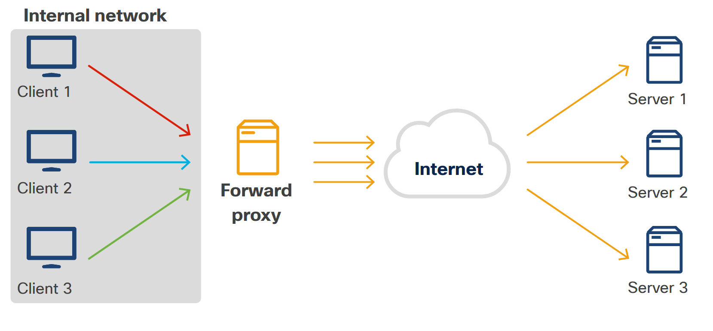
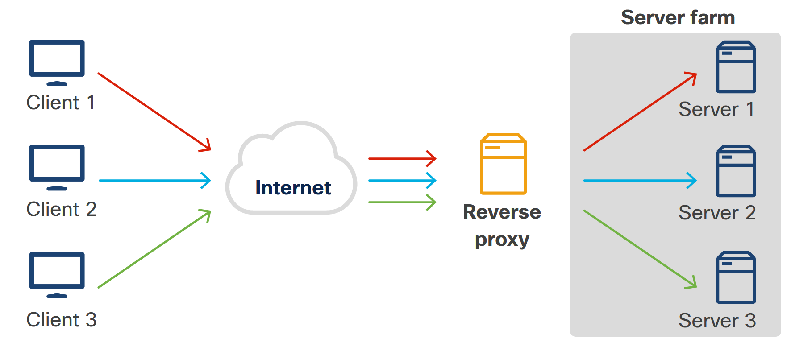

<!-- 6.4.1 -->
## Введение

В наши дни вы должны учитывать сеть во всех случаях, кроме самых простых. Это особенно верно, когда речь идет об облачных и контейнерных развертываниях. Вот некоторые из приложений, которые следует учитывать при развертывании в облаке:

* Межсетевые экраны
* Балансировщики нагрузки
* DNS
* Обратные прокси

<!-- 6.4.2 -->
## Межсетевой экран

Брандмауэры - это основная защита компьютера от несанкционированного доступа отдельных лиц или приложений. Они могут принимать любое количество форм, от выделенного аппаратного устройства до настроек в операционной системе отдельного компьютера.

На самом базовом уровне брандмауэр принимает или отклоняет пакеты в зависимости от IP-адресов и портов, которым они адресованы. Например, рассмотрим веб-сервер. На этом сервере есть фактическое программное обеспечение веб-сервера, а также приложение, представляющее сайт, и база данных, содержащая контент, отображаемый на сайте. Без брандмауэра к серверу можно было получить доступ несколькими способами:

<!-- /courses/devnet/9bd0a1b0-b013-11ea-b75f-ab3f17a06d7d/9bfd5700-b013-11ea-b75f-ab3f17a06d7d/assets/238b3cbe-c2dd-11ea-9970-b90c4abb30b0.svg  -->

Различные приложения получают доступ к серверу по-разному

* Веб-браузер может получить доступ к веб-приложению с помощью HTTP-запроса на порт 80 или HTTPS-запроса на порт 443.
* Клиент базы данных может получить доступ к базе данных с помощью UDP-запроса на порт 5000.
* Клиент SSH может войти на сам сервер с помощью TCP-запроса на порт 22.

Но действительно ли вы этого хотите? Вы определенно хотите получить доступ к веб-приложению, хотя, возможно, вам нужны только запросы HTTPS. Вы определенно НЕ хотите, чтобы кто-либо имел прямой доступ к базе данных; в этом случае такой доступ действительно нужен только веб-приложению. Возможно, вы захотите иметь возможность войти на сервер с помощью клиента SSH, вместо того, чтобы иметь физический доступ к машине.

Для этого настройте межсетевой экран с определенными «правилами», которые накладываются друг на друга. Так, например, у вас может быть такое правило:

* Запретить доступ кому бы то ни было с помощью этих правил ...
* Разрешить TCP-запросы к порту 443 от кого угодно
* Блокировать все запросы TCP к порту 22
* Блокировать все TCP-запросы к порту 80

(И HTTPS, и SSH используют TCP-запросы.)

<!-- /courses/devnet/9bd0a1b0-b013-11ea-b75f-ab3f17a06d7d/9bfd5700-b013-11ea-b75f-ab3f17a06d7d/assets/238b3cbf-c2dd-11ea-9970-b90c4abb30b0.svg  -->

Межсетевой экран может разрешить одни подключения и отклонить другие.

Таким образом, в этом случае единственным доступом к машине будут эти HTTPS-запросы. Все остальное будет заблокировано межсетевым экраном.

В некоторых случаях вы действительно хотите разрешить доступ, но не кому-либо еще. Например, вы можете настроить свои системы так, чтобы вход в конфиденциальные системы мог осуществляться только с одной машины. Это называется «jump box», и каждый должен сначала войти на этот сервер, а затем оттуда войти на целевую машину. Jump box можно использовать для обеспечения дополнительного доступа, при этом обеспечивая дополнительный уровень безопасности.

<!-- /courses/devnet/9bd0a1b0-b013-11ea-b75f-ab3f17a06d7d/9bfd5700-b013-11ea-b75f-ab3f17a06d7d/assets/238b3cc0-c2dd-11ea-9970-b90c4abb30b0.svg -->

Комбинация jump box и межсетевого экрана.

Например, если ваш блок перехода имеет внутренний IP-адрес 172.0.30.42, правила вашего брандмауэра могут выглядеть следующим образом:

* Запретить доступ никому, кроме ...
* Разрешить TCP-запросы к порту 443 от кого угодно
* Разрешить TCP-запросы к порту 22 только из 172.0.30.42
* Разрешить UDP-запросы к порту 5000 только из 172.0.30.42

При развертывании программного обеспечения следует учитывать следующие моменты, касающиеся межсетевых экранов:

* Межсетевые экраны должны сохранять *любой* внешний доступ к непроверенному приложению.
* Межсетевые экраны необходимо настроить так, чтобы можно было надлежащим образом протестировать приложение. Например, если приложению требуется доступ к разрабатываемой версии базы данных, правила межсетевого экрана должны разрешить это.
* Среда должна быть максимально приближена к производственной реплике, чтобы быстро выявлять любые проблемы конфигурации, связанные с межсетевым экраном.

Обратите внимание, что межсетевые экраны не просто предотвращают входящий трафик; их также можно настроить так, чтобы трафик не выходил. Например, в школах часто устанавливаются межсетевые экраны, которые не позволяют учащимся получить доступ ко всему, кроме небольшой горстки образовательных сайтов, использующих школьную сеть.

<!-- 6.4.3 -->
## Балансировщик нагрузки

Балансировщик нагрузки делает именно то, что говорит; он принимает запросы и «балансирует» их, распределяя их по нескольким серверам. Например, если у вас есть 10 серверов, на которых размещено ваше веб-приложение, запросы сначала поступают на балансировщик нагрузки, который затем распределяет их между этими 10 хостами.

<!-- /courses/devnet/9bd0a1b0-b013-11ea-b75f-ab3f17a06d7d/9bfd5700-b013-11ea-b75f-ab3f17a06d7d/assets/238b3cc1-c2dd-11ea-9970-b90c4abb30b0.svg -->

Балансировщик нагрузки рассылает запросы на разные серверы.

Балансировщики нагрузки могут принимать решения о том, какие серверы должны получать конкретный запрос, несколькими способами:

**Постоянные сеансы** - Если приложению требуется постоянный сеанс, например, пользователь должен войти в систему, балансировщик нагрузки отправит запросы на сервер, обрабатывающий этот сеанс.

<!-- /courses/devnet/9bd0a1b0-b013-11ea-b75f-ab3f17a06d7d/9bfd5700-b013-11ea-b75f-ab3f17a06d7d/assets/238b3cc2-c2dd-11ea-9970-b90c4abb30b0.svg -->

**По кругу** - При циклической балансировке нагрузки сервер просто отправляет каждый запрос «следующему» серверу в списке.

<!-- /courses/devnet/9bd0a1b0-b013-11ea-b75f-ab3f17a06d7d/9bfd5700-b013-11ea-b75f-ab3f17a06d7d/assets/238b3cc3-c2dd-11ea-9970-b90c4abb30b0.svg -->

**Наименьшее количество связей** - Часто имеет смысл отправлять запросы на наименее «занятый» сервер - с наименьшим количеством активных подключений. На рисунке Сервер 3 получает первый запрос, потому что в настоящее время он не обрабатывает никаких транзакций. Сервер 3 получает второй запрос, потому что у службы наименьшее количество активных транзакций. Сервер 1 и Сервер 3 теперь имеют по две активные транзакции, поэтому балансировщик нагрузки теперь будет использовать метод циклического перебора. Сервер 1 получает третий запрос, Сервер 3 - четвертый запрос, а Сервер 1 - пятый запрос.

<!-- /courses/devnet/9bd0a1b0-b013-11ea-b75f-ab3f17a06d7d/9bfd5700-b013-11ea-b75f-ab3f17a06d7d/assets/238b3cc4-c2dd-11ea-9970-b90c4abb30b0.svg -->

**IP-хэш** - С помощью этого алгоритма балансировщик нагрузки принимает решение на основе хэша (закодированного значения на основе IP-адреса запроса). Вы можете думать об этом как о том, когда вы посещаете мероприятие, и очереди для разных станций формируются на основе первой буквы вашей фамилии. Это также простой способ поддерживать последовательные сеансы.

<!-- /courses/devnet/9bd0a1b0-b013-11ea-b75f-ab3f17a06d7d/9bfd5700-b013-11ea-b75f-ab3f17a06d7d/assets/238b3cc5-c2dd-11ea-9970-b90c4abb30b0.svg -->

Для развертывания можно использовать другие, более сложные алгоритмы. Некоторые из этих примеров включают:

1.	**Сине-зеленое развертывание** - Напомним, что при таком развертывании изменения вносятся в новую производственную среду (синий), а не в существующей производственной среде (зеленый). Балансировщик нагрузки отправляет трафик в синюю среду, когда она готова, и, если возникают проблемы, балансировщик нагрузки может отправить трафик обратно в зеленую среду, и изменения можно будет откатить.
2.	**Канарское развертывание** - Это развертывание начинается с перенаправления небольшой части вашего трафика в синюю среду. Затем балансировщик нагрузки может увеличить объем трафика, перенаправляемого в синюю среду, до тех пор, пока проблемы не будут обнаружены и трафик не вернется в старую среду, или все серверы и пользователи будут в новой среде, а старая будет удалена или использована для следующей От себя.

<!-- 6.4.4 -->
## DNS

DNS или система доменных имен - это то, как серверы в Интернете переводят удобочитаемые имена (например, developer.cisco.com или www.example.com) в IP-адреса с машинной маршрутизацией, например 74.125.157.99 (для Google) или 208.80.152.201 (для Википедии). Эти IP-адреса необходимы для реальной навигации в Интернете.

 IP-адреса")
<!-- /courses/devnet/9bd0a1b0-b013-11ea-b75f-ab3f17a06d7d/9bfd5700-b013-11ea-b75f-ab3f17a06d7d/assets/238b3cc6-c2dd-11ea-9970-b90c4abb30b0.svg -->

При развертывании программного обеспечения эта система полезна, потому что вы можете изменить значение этих адресов. В этом примере приложение закодировано для поиска базы данных по адресу database.example.com:5000, который находится по IP-адресу 203.0.113.25.

<!-- /courses/devnet/9bd0a1b0-b013-11ea-b75f-ab3f17a06d7d/9bfd5700-b013-11ea-b75f-ab3f17a06d7d/assets/238b3cc7-c2dd-11ea-9970-b90c4abb30b0.svg -->

В другом примере вы можете создать разрабатываемую версию приложения и захотите, чтобы она попала в разрабатываемую версию базы данных, которая находится по адресу 172.24.18.36.

Вы можете настроить машину разработки на использование DNS-сервера, в котором database.example.com указан как 172.24.18.36. Вы можете протестировать приложение с тестовой базой данных, фактически не внося никаких изменений в приложение.

<!-- /courses/devnet/9bd0a1b0-b013-11ea-b75f-ab3f17a06d7d/9bfd5700-b013-11ea-b75f-ab3f17a06d7d/assets/238b3cc8-c2dd-11ea-9970-b90c4abb30b0.svg -->

Приложение может указывать на DNS-сервер, который использует разные IP-адреса для ресурсов разработки.

Другой способ использования DNS как части развертывания программного обеспечения - эмуляция некоторых функций, которые может выполнять балансировщик нагрузки. Сделайте это, изменив IP-адрес целевого сервера, когда вы будете готовы к работе. (Это не обязательно хороший вариант, потому что изменения DNS могут распространяться через Интернет в целом через день или больше.)

<!-- 6.4.5 -->
## Обратный прокси

Обратный прокси-сервер похож на обычный прокси: однако, в то время как обычный прокси-сервер работает, чтобы запросы с нескольких компьютеров выглядели так, как будто все они поступают от одного и того же клиента, обратный прокси-сервер работает, чтобы убедиться, что ответы выглядят так, как будто все они поступают с одного сервера.

Вот пример прямого прокси:

<!-- /courses/devnet/9bd0a1b0-b013-11ea-b75f-ab3f17a06d7d/9bfd5700-b013-11ea-b75f-ab3f17a06d7d/assets/238b3cc9-c2dd-11ea-9970-b90c4abb30b0.svg -->

Прямой прокси заставляет все запросы из сети выглядеть так, как будто они поступают с одного и того же IP-адреса.

Все запросы, поступающие из внутренней сети, проходят через прокси-сервер, поэтому невозможно узнать, что находится за прокси. Часто этот метод используется для отслеживания или ограничения доступа, как в школьной среде.

В случае обратного прокси ситуация аналогичная:

<!-- /courses/devnet/9bd0a1b0-b013-11ea-b75f-ab3f17a06d7d/9bfd5700-b013-11ea-b75f-ab3f17a06d7d/assets/238b3cca-c2dd-11ea-9970-b90c4abb30b0.svg-->

Обратный прокси-сервер позволяет распределять запросы к одному IP-адресу по разным адресатам внутри сети.

Все запросы к сети поступают на прокси-сервер, где они оцениваются и отправляются на соответствующий внутренний сервер для обработки. Как и прямой прокси, обратный прокси может оценивать трафик и действовать соответственно. В этом смысле он похож на брандмауэр или балансировщик нагрузки и может использоваться в качестве него.

Поскольку обратный прокси очень похож на эти функции, он также может использоваться для развертывания программного обеспечения аналогичными способами.
