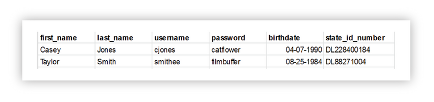
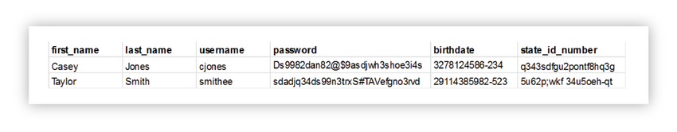
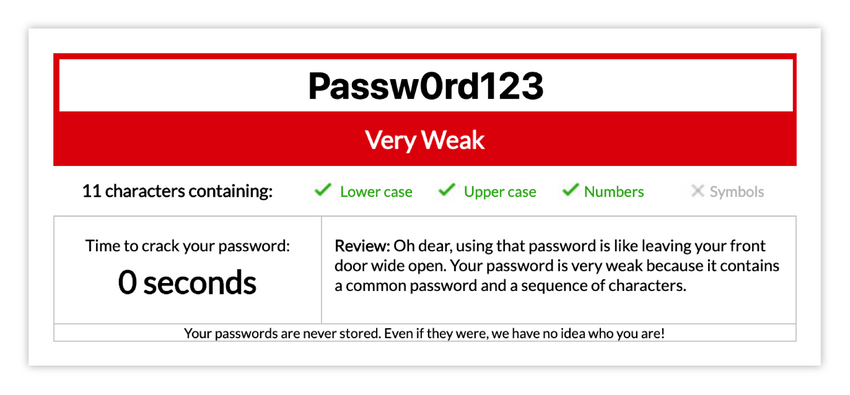

<!-- 6.5.1 -->
## Защита данных

Ни для кого не секрет, что безопасность является серьезной проблемой в современном мире. Это относится как к данным, так и к приложениям. Если один безопасен, а другой нет, уязвимы оба.

В этой части вы рассмотрите некоторые из проблем, связанных с защитой как ваших данных, так и вашего приложения, начиная с данных.

Данные - это не только сердце вашего приложения; говорят, что это новый бесценный ресурс; и он должен быть защищен как по практическим, так и по юридическим причинам. Это применимо независимо от того, хранятся ли данные (также известные как данные в состоянии покоя) или передаются с одного сервера на другой (также известные как данные в полете или в движении).

### Лучшие практики для хранения зашифрованных данных

Когда дело доходит до защиты данных в состоянии покоя, вам необходимо принять во внимание несколько вещей.

### Шифрование данных

Вы, наверное, видели множество новостей об утечках данных. Обычно это вопрос доступа отдельных лиц к данным, которые хранятся, но не защищены. В данном контексте это означает, что данные хранятся таким образом, чтобы не только отдельный человек мог получить доступ, но и чтобы в этом случае данные были легко видимыми и пригодными для использования.

В идеале посторонние лица или приложения никогда не получат доступ к вашим системам, но, очевидно, вы не можете этого гарантировать. Поэтому, когда человек с дурными намерениями (который с такой же легкостью может быть недовольным сотрудником, имеющим законный доступ) получает доступ к вашей базе данных, вы не хотите, чтобы он видел что-то вроде этого:


<!-- https://contenthub.netacad.com/courses/devnet/9bd0a1b0-b013-11ea-b75f-ab3f17a06d7d/9c04f820-b013-11ea-b75f-ab3f17a06d7d/assets/238b3ccb-c2dd-11ea-9970-b90c4abb30b0.png-->

Вместо этого вы хотите, чтобы они увидели нечто подобное:


<!-- https://contenthub.netacad.com/courses/devnet/9bd0a1b0-b013-11ea-b75f-ab3f17a06d7d/9c04f820-b013-11ea-b75f-ab3f17a06d7d/assets/238b3ccc-c2dd-11ea-9970-b90c4abb30b0.png-->

Существует два метода шифрования данных: одностороннее шифрование и двустороннее шифрование.

Двустороннее шифрование - это буквально то, на что похоже; вы шифруете данные с помощью ключа, а затем можете использовать этот ключ (или его вариант) для расшифровки данных, чтобы вернуть их в виде открытого текста. Вы могли бы использовать это для информации, к которой вам нужно будет получить доступ в ее первоначальной форме, такой как медицинские записи или номера социального страхования.

Одностороннее шифрование проще, так как вы можете легко создать зашифрованное значение, не обязательно используя определенный ключ, но вы не можете его расшифровать. Вы можете использовать это для информации, которую не нужно извлекать, просто нужно сравнивать, например, пароли. Например, у вас есть пользователь, `bob`, у кого есть пароль `munich`. Вы можете хранить данные как:

| **username** | **scrambled\_password** |
| ------------ | ----------------------- |
| **bob**      | @#$%SD@$$drw            |

В этом случае скремблирование `munich` дает тебе `@#$%SD@$$drw`, но от этого не вернуть «munich». Чтобы проверить пароль Боба, когда он снова войдет в систему, вам нужно будет сделать что-то вроде этого:

```
select * from users where username = ‘bob’ and scrambled_password=scrambledversion(‘munich’)
```

Это будет преобразовано в:

```
select * from users where username = ‘bob’ and scrambled_password=’@#$%SD@$$drw’
```

Конечно, тогда возникает вопрос: если вы собираетесь зашифровать свои данные с помощью ключа, где вы безопасно храните ключ? У вас есть ряд различных вариантов: от специализированного оборудования (хорошее, но сложное и дорогое) до использования службы управления ключами, такой как Amazon Key Management Service (использует специальное оборудование, но проще и дешевле), и до хранения его в базе данных. сам (что не является лучшей практикой, не имеет специального оборудования или физических характеристик и уязвим для атак).

### Уязвимости программного обеспечения

Когда дело доходит до уязвимостей программного обеспечения, вам нужно беспокоиться о двух разных типах: ваших собственных и всех остальных.

Большинство разработчиков не являются экспертами в области безопасности, поэтому нередко случайно закодировать уязвимости безопасности в вашем приложении. По этой причине существует ряд различных инструментов сканирования кода, таких как Bandit, Brakeman и VisualCodeGrepper, которые будут сканировать ваш код в поисках хорошо известных проблем. Эти проблемы могут быть встроены в код, который вы написали сами, или они могут включать использование других библиотек.

Благодаря этим другим библиотекам вы сталкиваетесь с уязвимостями всех остальных. Даже программное обеспечение, которое использовалось десятилетиями, может иметь проблемы, такие как ошибка Heartbleed, обнаруженная в OpenSSL, программном обеспечении, которое составляет основу большей части Интернета. Программное обеспечение существует с 1998 года, но ошибка появилась в 2012 году и оставалась незамеченной в течение двух лет, прежде чем была обнаружена и исправлена.

Убедитесь, что кто-то в вашей организации отвечает за то, чтобы следить за последними уязвимостями и исправлять их при необходимости.

### Хранение слишком большого количества данных

Помните, что хакеры не могут получить то, что вы не храните. Например, если вам нужен только код авторизации кредитной карты для регулярного выставления счетов, нет причин хранить весь номер кредитной карты. Это особенно важно, когда речь идет о личной идентифицирующей информации, такой как номера социального страхования и дни рождения, а также другой информации, которая может считаться «частной», например, история пользователя.

Если вам не нужны данные для важной функции, не храните их.

### Хранение данных в облаке

Помните, что, когда вы храните данные в «облаке», вы по определению сохраняете их на чужом компьютере. Хотя во многих случаях безопасность поставщика облачных услуг может быть лучше, чем у большинства предприятий, у вас все еще есть проблема, заключающаяся в том, что эти серверы полностью находятся вне вашего контроля. Вы не знаете, какие сотрудники обращаются к ним, и даже не знаете, что происходит с жесткими дисками, которые выведены из эксплуатации. Это особенно верно при использовании SSD в качестве хранилища, потому что архитектурная структура SSD делает трудным или невозможным по-настоящему стереть каждый сектор. Убедитесь, что ваши облачные данные зашифрованы или защищены иным образом.

### Устройства в роуминге

В мае 2006 года Департамент по делам ветеранов США потерял портативный компьютер с базой данных личной информации о 26,5 миллионах ветеранов и военнослужащих. Ноутбук был в конечном итоге восстановлен, но он по-прежнему является отличным примером того, почему информация должна храниться в безопасном режиме, особенно потому, что сейчас рабочая сила в мире намного более мобильна, чем в 2006 году.

Кроме того, приложения все чаще устанавливаются на устройства, которые даже более портативны, чем ноутбуки, такие как планшет и особенно мобильный телефон. Их просто легче потерять. Это могут быть даже не традиционные приложения, такие как базы данных, а приложения, ориентированные на конечного пользователя. Убедитесь, что вы не оставляете свои данные уязвимыми, по возможности шифруя их.

### Лучшие практики для передачи данных

Данные также уязвимы при их передаче. Фактически, он может быть еще более уязвимым из-за того, как устроен Интернет, где пакеты проходят через несколько серверов (которые могут принадлежать вам, а могут и не принадлежать) на своем пути к конечному пункту назначения.

Эта структура делает ваши данные уязвимыми для атак «человек посередине», при которых сервер в процессе может наблюдать, красть и даже изменять данные по мере их прохождения. Чтобы предотвратить эти проблемы, вы можете использовать:

* **SSH** - При подключении к вашим серверам всегда используйте безопасный протокол, такой как SSH, или безопасную оболочку, а не небезопасный протокол, такой как Telnet. SSH обеспечивает аутентификацию и шифрование сообщений между исходной и целевой машинами, что затрудняет или делает невозможным отслеживание ваших действий.
* **TLS** - В наши дни подавляющее большинство запросов к браузеру и от него используют `https://` протокол (а не `http://`). Первоначально этот протокол назывался SSL или Secured Sockets Layer, но с годами его постепенно заменили на TLS или Transport Layer Security. TLS обеспечивает аутентификацию сообщений и более надежные шифры, чем его предшественник. По возможности вы должны использовать TLS.
* **VPN** - Виртуальные частные сети, возможно, являются наиболее важным средством защиты вашего приложения. VPN позволяет удерживать весь связанный с приложениями трафик внутри вашей сети, даже при работе с удаленными сотрудниками. Удаленный сотрудник подключается к VPN-серверу, который затем действует как прокси-сервер и шифрует весь трафик к пользователю и от него.

Использование VPN дает несколько преимуществ. Во-первых, трафик к пользователю и от него не уязвим для отслеживания или манипуляций, поэтому никто не может использовать это соединение для повреждения вашего приложения или сети. Во-вторых, поскольку пользователь по существу находится внутри частной сети, вы можете ограничить доступ к ресурсам разработки и развертывания, а также к ресурсам, которые не должны быть доступны конечным пользователям, например, к необработанным базам данных.

<!-- 6.5.2 -->
## Что такое SQL-инъекция?

SQL-инъекция - это метод внедрения кода, который используется для атаки приложений, управляемых данными, в которых вредоносные операторы SQL вставляются в поле ввода для выполнения (например, для передачи содержимого базы данных злоумышленнику). SQL-инъекция должна использовать уязвимость системы безопасности в программном обеспечении приложения. Два примера: пользовательский ввод либо неправильно отфильтрован для строковых буквальных escape-символов, встроенных в операторы SQL, либо пользовательский ввод не является строго типизированным и неожиданно выполняется. SQL-инъекция в основном известна как вектор атаки для веб-сайтов, но может использоваться для атаки на любой тип базы данных SQL.

Атаки с использованием SQL-инъекций позволяют злоумышленникам подделать идентификационные данные, подделать существующие данные, вызвать проблемы отказа, такие как аннулирование транзакций или изменение балансов, разрешить полное раскрытие всех данных в системе, уничтожить данные или сделать их недоступными иным образом и стать администраторами сервер базы данных.

### SQL на веб-страницах

SQL-инъекция - один из наиболее распространенных методов взлома сети. Это размещение вредоносного кода в операторах SQL через ввод веб-страницы. Обычно это происходит, когда вы запрашиваете у пользователя ввод, например его имя пользователя/идентификатор пользователя, и вместо имени/идентификатора пользователь дает вам инструкцию SQL, которую вы бессознательно запускаете в своей базе данных.

Посмотрите на следующий пример, который создает оператор SELECT путем добавления переменной (`uid`) в строку выбора. Переменная извлекается из пользовательского ввода с помощью `request.args("uid")`:

```
uid = request.args("uid");
str_sql = "SELECT * FROM Users WHERE UserId = " + uid;
```

Одним из примеров является SQL-инъекция на основе `1=1` всегда верно (в языке SQL).

Взгляните на код для создания оператора SQL для выбора профиля пользователя по UID с заданным UID UserProfile.

Если нет валидатора ввода, чтобы предотвратить ввод "неправильного" ввода пользователем, пользователь может ввести ввод следующим образом:

UID:

```
2019 OR 1=1
```

Вывод SQL-запроса будет таким:

```
SELECT * FROM UserProfiles WHERE UID = 2019 OR 1=1;
```
Приведенный выше оператор SQL действителен, но вернет все строки из таблицы «UserProfiles», поскольку **OR 1=1** всегда **TRUE**.

Что произойдет, если таблица «UserProfiles» будет содержать имена, адреса электронной почты, адреса и пароли?

Выражение SQL будет таким:

```
SELECT UID, Address, Email, Name, Password FROM UserProfiles WHERE UID = 2019 or 1=1;
```

Создатель вредоносного ПО или хакер могут получить доступ ко всем профилям пользователей в базе данных, просто введя **2019 OR 1=1** в поле ввода.

Другой пример - SQL-инъекция, основанная на том, что **"" = ""** всегда верно. Вот тот пример.

Username: user_a Password: pass_user_a

Пример:

```
u_name = request.args("uid");
u_pass = request.args("password");
sql = 'SELECT * FROM UserProfiles WHERE Name ="' + u_name + '" AND Pass ="' + u_pass + '"'
```

Вот ожидаемый оператор SQL:

```
SELECT * FROM UserProfiles WHERE Name ="user_a" AND Pass ="pass_user_a"
```

Но хакер может получить доступ к именам пользователей и паролям в базе данных, просто вставив `" OR ""="` в текстовое поле имени пользователя или пароля:

```
User Name:
" OR ""="
Password:
" OR ""="
```

Выходной код создаст допустимый оператор SQL на стороне сервера, например:

Выход:

```
SELECT * FROM UserProfiles WHERE Name ="" OR ""="" AND Pass ="" OR ""=""
```
Приведенный выше SQL действителен и вернет все строки из таблицы «Пользователи», потому что `OR ""=""` всегда ИСТИНА.

### SQL-инъекция на основе пакетных операторов SQL

Большинство баз данных поддерживают пакетные операторы SQL. Пакет операторов SQL - это группа из двух или более операторов SQL, разделенных точкой с запятой.

Приведенный ниже оператор SQL вернет все строки из таблицы «UserProfiles», а затем удалит таблицу «UserImages».

Пример:

```
SELECT * FROM UserProfiles; DROP TABLE UserImages
```

Взгляните на следующий пример:

```
uid = request.args("uid");
strSQL = "SELECT * FROM UserProfiles WHERE UID = " + uid;
```

Теперь вы вводите UID:

```
2019; DROP TABLE UserImages
```

Оператор SQL будет выглядеть так:

SQL:

```
SELECT * FROM Users WHERE UID = 2019; DROP TABLE UserImages;
```

Надеюсь, эти примеры повлияют на вас при разработке форм приема данных, чтобы избежать этих распространенных взломов безопасности.

<!-- 6.5.3 -->
## Как обнаружить и предотвратить внедрение SQL

Уязвимость SQL-инъекции существует потому, что некоторые разработчики не заботятся о проверке данных и безопасности. Существуют инструменты, которые помогают обнаруживать недостатки и анализировать код.

### Инструменты с открытым исходным кодом

Чтобы упростить обнаружение атаки с использованием SQL-инъекции, разработчики создали хорошие механизмы обнаружения. Некоторые примеры - SQLmap или SQLninja.

### Инструменты анализа исходного кода

Инструменты анализа исходного кода, также называемые инструментами статического тестирования безопасности приложений (SAST), предназначены для анализа исходного кода и/или скомпилированных версий кода, чтобы помочь найти недостатки безопасности.

Эти инструменты могут автоматически находить недостатки, такие как переполнение буфера, недостатки внедрения SQL-кода и другие.

Вы можете обнаружить и предотвратить внедрение SQL-кода с помощью брандмауэра базы данных. Брандмауэры баз данных - это тип брандмауэра веб-приложений, который отслеживает базы данных для выявления и защиты от атак, специфичных для базы данных. Эти атаки в основном направлены на доступ к конфиденциальной информации, хранящейся в базах данных.

### Работа с межсетевым экраном базы данных

Фильтрация SQL-инъекций работает аналогично фильтрам спама в электронной почте. Брандмауэры баз данных обнаруживают SQL-инъекции на основе количества недействительных запросов от хоста, при наличии блоков OR и UNION внутри запроса или других.

### Используйте подготовленные операторы

Использование подготовленных операторов с привязкой переменных (также известных как параметризованные запросы) - это то, как всех разработчиков сначала нужно научить писать запросы к базе данных. Их просто написать и легче понять, чем динамические запросы. Параметризованные запросы заставляют разработчика сначала определять весь код SQL, а затем передавать каждый параметр в запрос позже. Этот стиль кодирования позволяет базе данных различать код и данные независимо от того, какой вводится пользователем.

Подготовленные операторы гарантируют, что злоумышленник не сможет изменить намерение запроса, даже если злоумышленник вставляет команды SQL. В приведенном ниже безопасном примере, если злоумышленник введет userID `tom' or '1'='1`, параметризованный запрос не будет уязвим и вместо этого будет искать имя пользователя, которое буквально соответствует всей строке tom `tom' or '1'='1`.

```
// Get customer's name from parameter
String              custname = request.getParameter("custname");
// Perform input validation to detect attacks
String              query = "SELECT account_balance FROM user_data WHERE user_name = ? ";
PreparedStatement   pStatement = connection.prepareStatement( query );
pStatement.setString( 1, custname);
ResultSet           results = pStatement.executeQuery();
```

### Использовать хранимые процедуры

Хранимые процедуры не всегда защищены от SQL-инъекции. Однако некоторые стандартные программные конструкции хранимых процедур имеют тот же эффект, что и использование параметризованных запросов, если они реализованы безопасно. Это норма для большинства языков хранимых процедур.

Они требуют, чтобы разработчик просто создавал операторы SQL с параметрами, которые автоматически параметризуются, если разработчик не сделает что-то в значительной степени необычное. Разница между подготовленными операторами и хранимыми процедурами заключается в том, что код SQL для хранимой процедуры определяется и сохраняется в самой базе данных, а затем вызывается из приложения. Оба этих метода имеют одинаковую эффективность в предотвращении внедрения SQL-кода, поэтому ваша организация должна выбрать наиболее подходящий для вас подход.

> **Примечание**: «Реализовано безопасно» означает, что хранимая процедура не включает небезопасную генерацию динамического SQL. Разработчики обычно не создают динамический SQL внутри хранимых процедур. Однако это можно сделать, но этого следует избегать. Если этого нельзя избежать, хранимая процедура должна использовать проверку ввода или правильное экранирование. Это необходимо для того, чтобы убедиться, что весь вводимый пользователем ввод в хранимую процедуру нельзя использовать для внедрения кода SQL в динамически генерируемый запрос. Аудиторы всегда должны искать способы использования `sp_execute`, `execute` или `exec` в хранимых процедурах SQL Server. Аналогичные руководящие принципы аудита необходимы для аналогичных функций для других поставщиков.

Также есть несколько случаев, когда хранимые процедуры могут увеличить риск. Например, на сервере MS SQL у вас есть три основные роли по умолчанию: `db_datareader`, `db_datawriter` а также `db_owner`. До того, как стали использоваться хранимые процедуры, администраторы баз данных давали `db_datareader` или `db_datawriter` права пользователю веб-сервиса в зависимости от требований. Однако для хранимых процедур требуются права на выполнение, а эта роль по умолчанию недоступна. Некоторые настройки, в которых управление пользователями было централизованным, но ограничено этими тремя ролями, заставляют все веб-приложения работать с правами db_owner, чтобы хранимые процедуры могли работать. Это означает, что если сервер взломан, злоумышленник имеет полные права на базу данных, где раньше он мог иметь доступ только для чтения.

### Проверка ввода белого списка

Различные части запросов SQL не являются допустимыми местами для использования переменных связывания, таких как имена таблиц или столбцов, а также индикатор порядка сортировки (ASC или DESC). В таких ситуациях наиболее подходящей защитой является проверка ввода или переработка запроса. В идеале для имен таблиц или столбцов эти значения берутся из кода, а не из пользовательских параметров.

Но если значения пользовательских параметров используются для таргетинга на разные имена таблиц и имена столбцов, тогда значения параметров должны быть сопоставлены с допустимыми/ожидаемыми именами таблиц или столбцов, чтобы гарантировать, что непроверенный пользовательский ввод не попадет в запрос. Обратите внимание, что это признак плохого дизайна, и следует рассмотреть возможность полной перезаписи.

### Пример проверки имени таблицы

```
String tableName;
switch(PARAM):
  case "Value1": tableName = "fooTable";
                 break;
  case "Value2": tableName = "barTable";
                 break;
  ...
  default      : throw new InputValidationException("unexpected value provided"
                                                  + " for table name");
```

Затем tableName можно напрямую добавить к SQL-запросу, поскольку теперь известно, что оно является одним из допустимых и ожидаемых значений для имени таблицы в этом запросе. Имейте в виду, что общие функции проверки таблиц могут привести к потере данных, поскольку имена таблиц используются в запросах, где они не ожидаются.

Для чего-то простого, например порядка сортировки, было бы лучше, если бы вводимые пользователем данные были преобразованы в логическое значение, а затем это логическое значение использовалось для выбора безопасного значения для добавления в запрос. Это стандартная потребность в создании динамических запросов.

Например:

```
public String someMethod(boolean sortOrder) {
 String SQLquery = "some SQL ... order by Salary " + (sortOrder ? "ASC" : "DESC");`
 ...
```

Любой пользовательский ввод можно преобразовать в нестроковый (например, тип даты, числовой, логический или перечислимый тип). Если вы конвертируете до того, как входные данные добавляются к запросу или используются для выбора значения для добавления к запросу, это преобразование гарантирует, что вы можете безопасно добавить в запрос.

Проверка ввода также рекомендуется в качестве вторичной защиты во ВСЕХ случаях. Дополнительные методы реализации строгой проверки входных данных белого списка описаны в документе Шпаргалка по проверке входных данных Open Web Application Security Project (OWASP).

### Экранирование всех вводимых пользователем данных

Этот метод следует использовать только в крайнем случае, когда ничего из вышеперечисленного невозможно. Проверка ввода, вероятно, является лучшим выбором, поскольку эта методология хрупкая по сравнению с другими средствами защиты, и мы не можем гарантировать, что она предотвратит все SQL-инъекции во всех ситуациях.

Этот метод заключается в том, чтобы избежать ввода пользователя перед тем, как поместить его в запрос. Его реализация очень привязана к базе данных. Обычно рекомендуется модифицировать устаревший код только в том случае, если реализация проверки ввода не является рентабельной. Приложения, созданные с нуля, или приложения, требующие низкой устойчивости к риску, должны быть созданы или переписаны с использованием параметризованных запросов, хранимых процедур или какого-либо типа Object Relational Mapper (ORM), который строит ваши запросы за вас.

Побег работает так. Каждая СУБД поддерживает одну или несколько схем экранирования символов, специфичных для определенных типов запросов. Если вы затем экранируете весь вводимый пользователем ввод, используя правильную схему экранирования для используемой вами базы данных, СУБД не будет путать этот ввод с кодом SQL, написанным разработчиком, что позволит избежать любых возможных уязвимостей внедрения SQL.

Есть несколько библиотек и инструментов, которые можно использовать для экранирования ввода. Например, OWASP Enterprise Security API или ESAPI - это бесплатная библиотека управления безопасностью веб-приложений с открытым исходным кодом, которая упрощает программистам создание приложений с низким уровнем риска.

Библиотеки ESAPI призваны упростить программистам установку системы безопасности в существующие приложения и служат прочной основой для новых разработок.

### Дополнительная защита

Помимо использования одной из четырех основных защит, мы также рекомендуем использовать все эти дополнительные средства защиты для обеспечения глубокой защиты. Эти дополнительные защиты могут быть:

### Наименьшая привилегия

Чтобы свести к минимуму потенциальный ущерб от успешной атаки с использованием SQL-инъекции, вы должны минимизировать привилегии, назначаемые каждой учетной записи базы данных в вашей среде. Не назначайте своим учетным записям приложений права доступа типа DBA или администратора. Мы понимаем, что это легко, и все просто «работает», когда вы делаете это так, но это очень опасно. Начните с нуля, чтобы определить, какие права доступа требуются вашим учетным записям приложений, вместо того, чтобы пытаться выяснить, какие права доступа вам необходимо отобрать. Убедитесь, что учетным записям, которым нужен только доступ для чтения, предоставляется доступ только для чтения к таблицам, к которым им нужен доступ. Если учетной записи требуется доступ только к частям таблицы, рассмотрите возможность создания представления, которое ограничивает доступ к этой части данных, и вместо этого назначьте доступ учетной записи к представлению, а не лежащую в основе таблицу. В редких случаях предоставлять доступ на создание или удаление учетным записям базы данных.

Если вы принимаете политику, в которой вы используете хранимые процедуры повсюду и не разрешаете учетным записям приложений напрямую выполнять свои собственные запросы, то ограничьте эти учетные записи, чтобы они могли выполнять только те хранимые процедуры, которые им нужны. Не предоставляйте им никаких прав непосредственно на таблицы в базе данных.

SQL-инъекция - не единственная угроза данным вашей базы данных. Злоумышленники могут просто изменить значения параметров с одного из допустимых значений, которые им представлены, на значение, которое для них неавторизовано, но само приложение может получить доступ. Сведение к минимуму привилегий, предоставленных вашему приложению, снизит вероятность таких попыток несанкционированного доступа, даже если злоумышленник не пытается использовать SQL-инъекцию как часть своего эксплойта.

Вы также должны минимизировать привилегии учетной записи операционной системы, под которой работает СУБД. Не запускайте СУБД как root или как систему! Большинство СУБД запускаются из коробки с очень мощной системной учетной **Примечание**ю. Например, MySQL по умолчанию работает как система в Windows. Измените учетную запись ОС СУБД на более подходящую с ограниченными правами.

### Несколько пользователей базы данных

Разработчикам веб-приложений следует избегать использования одной и той же учетной записи владельца/администратора в веб-приложениях для подключения к базе данных. Разных пользователей БД можно использовать для разных веб-приложений.

Как правило, каждое отдельное веб-приложение, которому требуется доступ к базе данных, может иметь назначенную учетную запись пользователя базы данных, которую веб-приложение использует для подключения к базе данных. Таким образом, разработчик приложения может иметь подробный контроль доступа, тем самым максимально сокращая привилегии. После этого каждый пользователь БД будет иметь доступ только к тому, что ему нужно, и доступ для записи по мере необходимости.

Например, для страницы входа в систему требуется доступ для чтения к полям имени пользователя и пароля в таблице, но нет доступа для записи в любой форме (без вставки, обновления или удаления). Однако страница регистрации определенно требует права вставки в эту таблицу; это ограничение может применяться только в том случае, если эти веб-приложения используют разных пользователей БД для подключения к базе данных.

### Представления SQL

Вы можете использовать представления SQL для дальнейшего увеличения детализации доступа, ограничивая доступ для чтения определенными полями таблицы или объединениями таблиц. Это потенциально может иметь дополнительные преимущества. Например, предположим, что системе требуется хранить пароли пользователей, а не хэшированные пароли. Дизайнер может использовать представления, чтобы компенсировать это ограничение; отменить весь доступ к таблице (от всех пользователей базы данных, кроме владельца или администратора) и создать представление, которое выводит хэш поля пароля, а не само поле. Любая атака с использованием SQL-инъекции, которая преуспевает в краже информации БД, будет ограничена кражей хеша паролей (даже хеша с ключом), потому что ни один пользователь базы данных для любого из веб-приложений не имеет доступа к самой таблице.

<!-- 6.5.4 -->
## Защита приложения

Защита вашего приложения - это тема, заслуживающая отдельной книги, но следующие несколько страниц иллюстрируют некоторые из наиболее распространенных проблем, которые вы должны искать в процессе развертывания.

### Что такое OWASP?

Проект Open Web Application Security Project (OWASP) ориентирован на предоставление обучения, инструментов и других ресурсов, чтобы помочь разработчикам избежать некоторых из наиболее распространенных проблем безопасности в веб-приложениях. Ресурсы, предоставляемые OWASP, включают:

* **Инструменты** - OWASP производит такие инструменты, как OWASP Zed Attack Proxy (ZAP), который ищет уязвимости во время разработки, OWASP Dependency Check, который ищет известные уязвимости в вашем коде, и OWASP DefectDojo, который оптимизирует процесс тестирования.
* **Кодовые проекты** - OWASP создает набор основных правил OWASP ModSecurity Core Rule Set (CRS), общие правила обнаружения атак, которые можно использовать с брандмауэрами веб-приложений, и OWASP CSRFGuard, который помогает предотвратить атаки с подделкой межсайтовых запросов (CSRF).
* **Документация проектов** - OWASP, пожалуй, наиболее известен своими проектами документации, которые включают в себя стандарт проверки безопасности приложений OWASP, десятку лучших OWASP, в которой описаны 10 наиболее распространенных проблем безопасности в веб-приложениях, и серию шпаргалок OWASP, в которой объясняется, как смягчить эти проблемы. .

Давайте посмотрим на некоторые из наиболее распространенных из этих десяти главных проблем.

### SQL-инъекция

Вы узнали об использовании данных в вашем приложении и о том, как их защитить. Одна из проблем с использованием данных в вашем приложении заключается в том, что если вы включите взаимодействие с пользователем, вы можете создать потенциально опасную ситуацию.

Например, вы когда-нибудь захотели бы выполнить такую инструкцию?

```
<p><code>select * from users where username = ‘bob’ and password = ‘pass’; drop table products;</code></p>
```

Конечно нет. Потому что, если бы вы это сделали, вы бы удалили свою таблицу продуктов. Но если вы не будете осторожны, вы сможете сделать именно это. Как? Рассмотрим этот пример. Допустим, у вас есть форма:


<!-- https://contenthub.netacad.com/courses/devnet/9bd0a1b0-b013-11ea-b75f-ab3f17a06d7d/9c04f820-b013-11ea-b75f-ab3f17a06d7d/assets/238b3ccd-c2dd-11ea-9970-b90c4abb30b0.png-->

Пользователь вводит следующие данные:


<!-- https://contenthub.netacad.com/courses/devnet/9bd0a1b0-b013-11ea-b75f-ab3f17a06d7d/9c04f820-b013-11ea-b75f-ab3f17a06d7d/assets/238b3cce-c2dd-11ea-9970-b90c4abb30b0.png-->

Это странное занятие, но следуйте примеру. Если у вас есть код, который просто интегрирует то, что набрал пользователь, вы получите эквивалент этого:

```
username = “bob”
userpass = “‘; drop table products; --”
sqlstatement = “select * from users where username=’”+username+”’ and password=’”+userpass+”’”
```

Если вы сделаете такую замену, вы получите:

```
sqlstatement = “select * from users where username=’bob’ and password=’‘; drop table products; --’”
```

В этом случае хакеру даже не нужно вводить действующий пароль для bob (или любое имя пользователя, если на то пошло); Важная часть состоит в том, что опасный оператор `drop table products` запускается несмотря ни на что, и этот двойной дефис (-) является комментарием, который не позволяет чему-либо после него вызвать ошибку и предотвратить выполнение оператора.

Как это предотвратить? Хотя заманчиво думать, что вы можете просто «очистить» ввод, удалив одинарные кавычки ('), это проигрышная битва. Вместо этого предотвратите это, используя параметризованные операторы. Как этого добиться для каждого языка и базы данных по-разному, но вот как это сделать в Python:

```python
   with connection.cursor() as cursor:
         cursor.execute("SELECT * FROM users WHERE username = %(username)s and password = %(userpass)s", {'username': request.args.get('username'), ‘userpass’: scrambled(request.args.get('userpass'))})
         result = cursor.fetchone()
```

Делая это таким образом, вы создаете эти строковые переменные, `username` а также `userpass`, которые динамически вставляются в строку таким образом, что пользователь не может использовать их для создания нескольких операторов.

Одна из мест, где эта ситуация часто возникает, - это поиск, когда по определению пользователь вводит то, что станет частью инструкции базы данных. Рассмотрим этот код:

```python
from flask import request
from flask import render_template
sample = Flask(__name__)
DBHOST = 'NOT SET'
def getdb(targethost = ''):
    import MySQLdb
    if targethost == '':
        global DBHOST
        targethost = DBHOST
    return MySQLdb.connect(host=targethost,
                     user="devnetstudent",
                     passwd="pass",
                     db="products")
@sample.route("/")
def main():
    return render_template("index.html")
@sample.route("/test")
def test():
    return "You are calling me from "+request.remote_addr
@sample.route("/config")
def config():
    return render_template("config.html")
@sample.route("/get_config")
def get_config():
    global DBHOST
    return DBHOST
@sample.route("/config_action", methods=['GET', 'POST'])
def config_action():
    global DBHOST
    DBHOST = request.args.get('dbhost')
    return "Saved database host as "+DBHOST
@sample.route("/search")
def search():
    db = getdb()
    cur = db.cursor()
    search_term = request.args.get(‘search_term’)
    cur.execute("select * from products where title like ‘%s’" % search_term)
    output = ""
    for row in cur.fetchall():
        output = output +  str(row[0]) + " -- " + str(row[1]) + "<br />"
    db.close()
    return output
if __name__ == "__main__":
    sample.run(host="0.0.0.0", port=80)
```

Как бы вы исправили этот код?

```python
...
@sample.route("/search")
def search():
    db = getdb()
    cur = db.cursor()
    search_term = request.args.get(‘search_term’)
    # Here you are ensuring that the search term is treated as a string value
    cur.execute("select * from products where title like %(search_term)s", {'search_term': search_term})
    output = ""
    for row in cur.fetchall():
        output = output +  str(row[0]) + " -- " + str(row[1]) + "<br />"
    db.close()
    return output
if __name__ == "__main__":
    sample.run(host="0.0.0.0", port=80)
```

<!-- 6.5.5 -->
## Межсайтовый скриптинг (XSS)

Атаки с использованием межсайтовых сценариев происходят, когда отправленный пользователем контент, который не был очищен, отображается другим пользователям. Наиболее очевидная версия этого эксплойта - когда один пользователь отправляет комментарий, который включает сценарий, выполняющий вредоносное действие, и любой, кто просматривает страницу комментариев, запускает этот сценарий на своем компьютере.

Например, рассмотрим страницу, отображаемую этим кодом:

```python
...
@sample.route("/product_comments")
def search():
    db = getdb()
    cur = db.cursor()
    prod_id = request.args.get(‘prod_id’)
    cur.execute("select * from products where id = %(prod_id)s", {'prod_id': prod_id})
    output = ""
    for row in cur.fetchall():
        output = output +  str(row[0]) + ": " + str(row[1]) + "<br />"
    db.close()
    return output
...
```

Этот код просто извлекает данные комментариев из базы данных и отображает их на странице. Если пользователь по имени Робин должен был отправить такой контент, как:
```html
<script type="text/javascript">alert("Gotcha!")</script>
```

Тогда пользователь, заходящий на страницу, получит контент, который выглядит следующим образом:

```html
Robin: <script type="text/javascript">alert("Gotcha!")</script>
```

Когда этот пользователь загружает страницу, он увидит окно с предупреждением, вызванное вставленным Javascript.

В данном случае мы просто показываем предупреждение, что безвредно. Но этот сценарий так же легко мог сделать что-то вредоносное, например, кражу файлов cookie или что-то еще хуже.

Более серьезная проблема заключается в том, что вы имеете дело не только с данными, которые хранятся в вашей базе данных, или с «сохраненными XSS-атаками». Например, рассмотрим эту страницу, на которой отображается контент из параметра запроса:
```html
...
<h1>Search results for {{ request.args[‘search_term’] }}</h1>
{ for item in cursor }
...
```

Хакер может обманом заставить кого-то перейти на вашу страницу с помощью ссылки в электронном письме, которое содержит вредоносный код в параметре:

```
http://www.example.com?search_term=%3Cscript%3Ealert%28%27Gotcha%21%27%29%3C%2Fscript%3E
```

Эта ссылка, которая включает в себя версию скрипта с «закодированным URL-адресом», приведет к тому, что ничего не подозревающий пользователь увидит страницу:

```
...
<h1>Search results for <script>alert('Gotcha!')</script></h1>
...
```

И это, конечно, приведет к выполнению сценария.

Это называется отраженной атакой XSS.

Так как же это предотвратить?

Основная стратегия - дезинфицировать контент, где это возможно, и, если он не может быть дезинфицирован, не отображать его.

Опытные веб-разработчики обычно знают, что нужно проверять комментарии на наличие вредоносного контента, но есть и другие места, где вы должны проверять «ненадежный» контент. OWASP рекомендует никогда не отображать ненадежный контент в следующих местах:

* Внутри тегов скрипта
* Внутренние комментарии
* Как часть имен атрибутов
* Как часть имен тегов
* В CSS (в тегах стиля)

Вы можете отображать контент в некоторых местах, если сначала его продезинфицируют. Эти места включают:

* Как содержимое HTML-тега
* Как значение атрибута
* Как переменная в вашем Javascript

Как видно из множества вариантов, имеющихся у злоумышленника, дезинфекция контента может оказаться сложным процессом. Имеет смысл использовать инструмент, созданный только для очистки содержимого, такой как OWASP Java HTML Sanitizer, HtmlSanitizer или Python Bleach.

<!-- 6.5.6 -->
## Подделка межсайтовых запросов (CSRF)

Другой тип атак, который имеет некоторые аспекты XSS-атак, - это подделка межсайтовых запросов (CSRF), иногда произносимая как «Sea Surf». В обоих случаях злоумышленник хочет, чтобы пользователь выполнил код злоумышленника, обычно даже не подозревая об этом. Разница в том, что атаки CSRF обычно нацелены не на целевой сайт, а на **другой** сайт, на котором пользователь уже прошел аутентификацию.

Вот пример. Допустим, пользователь входит на сайт своего банка **http://greatbank.example.com**. В другом окне они находятся на странице обсуждения, содержащей интересную ссылку, и нажимают на нее.

К сожалению, ссылка была на **http://greatbank.example.com/changeemail?new_email=attacker@example.com**. Браузер считает, что это обычная ссылка, поэтому он вызывает URL-адрес, отправляя файлы cookie для greatbank.example.com, которые, как вы помните, включают учетные данные пользователя для аутентификации. Что касается банка, то этот запрос пришел от пользователя, и он выполняет изменение. Теперь злоумышленник может сменить пароль пользователя, затем войти в банк и нанести любой ущерб, который он хочет.

Обратите внимание, что даже если пользователь достаточно умен, чтобы не нажимать на такую странную ссылку, если сайт уязвим для XSS-атак, эта атака может быть проведена без каких-либо действий пользователя. Тщательно созданный `` тег может достичь того же результата.

Интересным аспектом CSRF является то, что злоумышленник никогда не получает результатов атаки; они могут судить о результатах только постфактум, и они должны быть в состоянии предсказать, какими будут последствия, чтобы воспользоваться преимуществами успешной атаки.

CSRF-атаки, как известно, трудно предотвратить, но не невозможно. Один из способов - включить скрытый токен, который должен сопровождать любые запросы пользователя. Например, форма входа в банк может выглядеть так:

```html
...
<form action="https://greatbank.example.com" method="POST">
Username: <input type="text" name="username" style="width: 200px" />
Password: <input type="text" name="password" style="width: 200px" />
<br >
<input type="hidden" name="CSRFToken" value="d063937d-c117-46e6-8354-6f5d8faff095" />
<input type="submit" value="Log in">
</form>
...
```

Который `CSRFToken` должен сопровождать каждый запрос от пользователя, чтобы он считался законным. Поскольку злоумышленник не может предсказать этот токен, такой запрос, как https://greatbank.example.com/changeemail?new\_eamail=attacker@example.com будет автоматически отклонен.

<!-- 6.5.7 -->
## Десять лучших по OWASP

### ТОП-10 OWASP

Теперь, когда вы знаете о трех наиболее известных атаках, вот полный список 10 лучших атак OWASP.

* **Инъекция** - Этот предмет состоит из всевозможных инъекционных атак. Ранее мы говорили о SQL-инъекции, но это только самый распространенный вариант. Все базы данных, такие как базы данных LDAP, базы данных Hibernate и другие, потенциально уязвимы. Фактически, любое действие, основанное на вводе данных пользователем, уязвимо, включая прямые команды. Вы можете смягчить эти типы атак, используя параметризованные API-интерфейсы, избегая ввода данных пользователем и используя` LIMIT` положения об ограничении воздействия в случае нарушения.
* **Сломанная аутентификация** - Этот элемент относится к множеству проблем с учетными данными пользователей, от украденной базы данных учетных данных до паролей по умолчанию, поставляемых с продуктом. Вы можете смягчить эти атаки, избегая паролей по умолчанию, требуя многофакторной аутентификации и используя такие методы, как удлинение периодов ожидания после неудачных попыток входа в систему.
* **Раскрытие конфиденциальных данных** - Этот пункт относится к случаям, когда злоумышленники крадут конфиденциальную информацию, такую как пароли или личную информацию. Вы можете помочь предотвратить эти атаки, сохранив как можно меньше личной информации и зашифровав хранимую информацию.
* **Внешние объекты XML (XXE)** - Этот элемент относится к атакам, которые стали возможными благодаря функции XML, которая позволяет пользователям включать внешнюю информацию с помощью сущностей. Вы можете решить эту проблему, отключив обработку XML Entity и DTD или просто используя другой формат, например JSON, вместо XML.
* **Нарушенный контроль доступа** - Этот пункт относится к необходимости убедиться, что вы не создали приложение, которое позволяет пользователям обходить существующие требования аутентификации. Например, злоумышленники не должны иметь доступ к функциям администратора, просто перейдя к ним напрямую. Другими словами, не полагайтесь на «безопасность через безвестность». Обязательно защитите все ресурсы и функции, которые необходимо защитить на стороне сервера, гарантируя, что любой доступ действительно разрешен.
* **Неверная конфигурация безопасности** - Этот пункт относится к необходимости обеспечить правильную настройку самой системы. Правильно ли установлено и настроено все программное обеспечение? Брандмауэр работает? Предотвращение подобных проблем требует тщательного и последовательного усиления защиты систем и приложений. Уменьшите доступную поверхность атаки. Для этого установите только те службы, которые вам действительно нужны, и попытайтесь выделить компоненты, не относящиеся к разным системам, чтобы еще больше уменьшить поверхность атаки.
* **Межсайтовый скриптинг (XSS)** - Этот элемент относится к возможности злоумышленника использовать динамические функции сайта для внедрения вредоносного содержимого на страницу либо на постоянной основе, например в тексте комментариев, либо как часть одного запроса. Устранение этих проблем требует тщательного рассмотрения того, где вы включаете ненадежный контент на свою страницу, а также очистки любого ненадежного контента, который вы действительно включаете.
* **Небезопасная десериализация** - В этом элементе описаны проблемы, которые могут возникнуть, если злоумышленники могут получить доступ и потенциально изменить сериализованные версии данных и объектов, то есть текстовые версии объектов, которые могут быть преобразованы в объекты сервером. Например, если информация о пользователе передается в виде объекта JSON, который включает их права доступа, они, вероятно, могут предоставить себе права администратора, изменив содержимое этого объекта. Поскольку объекты могут включать в себя исполняемый код, этот эксплойт может быть особенно опасным, даже если его не обязательно просто использовать. Чтобы предотвратить проблемы, не принимайте сериализованные объекты из ненадежных источников или, если необходимо, обеспечьте проверку перед десериализацией объектов.
* **Использование компонентов с известными уязвимостями** - Одним из преимуществ сегодняшних разработчиков является то, что большинство основных функций, которые вы пытаетесь выполнить, вероятно, уже написаны и включены в существующий программный пакет, и, вероятно, это открытый исходный код. Однако многие из доступных пакетов также включают общедоступные эксплойты. Чтобы исправить это, убедитесь, что вы используете только необходимые функции и безопасные пакеты, загруженные из официальных источников и проверенные подписью.
* **Недостаточное ведение журнала и мониторинг** - Этот пункт напоминает вам, что ваша основная ответственность - обеспечить регистрацию всего важного, что происходит в вашей системе, чтобы вы могли обнаруживать атаки, желательно до их успеха. Особенно важно убедиться, что ваши журналы имеют общий формат, чтобы их можно было легко использовать с помощью инструментов отчетности, и чтобы они были доступны для аудита для обнаружения (или, что еще лучше, предотвращения) взлома.

<!-- 6.5.8 -->
## Развитие парольных систем

### Простые пароли с открытым текстом

Первые пароли были простыми текстовыми и хранились в базах данных. Это позволило нескольким пользователям, использующим один и тот же базовый процессор, иметь уникальные настройки конфиденциальности. Это было до того, как появились изощренные хакерские сети и программы для взлома паролей.

Правило для паролей с открытым текстом очень простое: просто сохраните их. У вас есть база данных с таблицей для всех ваших пользователей, и она, вероятно, будет выглядеть примерно так: `(id, username, password)`. После создания учетной записи вы сохраняете имя пользователя и пароль в этих полях в виде открытого текста, а при входе в систему вы извлекаете строку, связанную с введенным именем пользователя, и сравниваете введенный пароль с паролем из базы данных. Если он совпадает, вы позволяете пользователю войти. Совершенно просто и легко реализовать.

В следующем примере показано, как создать/проверить новый профиль пользователя в текстовом формате:

```python
######################################Plain Text #########################################################
@app.route('/signup/v1', methods=['POST'])
def signup_v1():
    conn = sqlite3.connect(db_name)
    c = conn.cursor()
    c.execute('''CREATE TABLE IF NOT EXISTS USER_PLAIN
           (USERNAME  TEXT    PRIMARY KEY NOT NULL,
            PASSWORD  TEXT    NOT NULL);''')
    conn.commit()
    try:
        c.execute("INSERT INTO USER_PLAIN (USERNAME,PASSWORD) "
                  "VALUES ('{0}', '{1}')".format(request.form['username'], request.form['password']))
        conn.commit()
    except sqlite3.IntegrityError:
        return "username has been registered."
    print('username: ', request.form['username'], ' password: ', request.form['password'])
    return "signup success"
```
Проверьте новую зарегистрированную учетную запись пользователя с помощью функции входа в открытый текст, и вы увидите, что все данные профиля пользователя находятся в текстовом формате.

```python
def verify_plain(username, password):
    conn = sqlite3.connect('test.db')
    c = conn.cursor()
    query = "SELECT PASSWORD FROM USER_PLAIN WHERE USERNAME = '{0}'".format(username)
    c.execute(query)
    records = c.fetchone()
    conn.close()
    if not records:
        return False
    return records[0] == password
@app.route('/login/v1', methods=['GET', 'POST'])
def login_v1():
    error = None
    if request.method == 'POST':
        if verify_plain(request.form['username'], request.form['password']):
            error = 'login success'
        else:
            error = 'Invalid username/password'
    else:
        error = 'Invalid Method'
    return error
```

Очевидно, что открытый текст - это небезопасный способ хранения паролей. Если ваша база данных будет взломана, пароли ваших пользователей станут доступны хакерам напрямую.

### Хеширование паролей

Хранение паролей одновременно и рискованно, и сложно. Простой подход к хранению паролей - создать в базе данных таблицу, в которой имя пользователя сопоставляется с паролем. Когда пользователь входит в систему, сервер получает запрос на аутентификацию с полезной нагрузкой, содержащей имя пользователя и пароль. Мы ищем имя пользователя в таблице и сравниваем предоставленный пароль с сохраненным паролем. Соответствие дает пользователю доступ к приложению. Уровень безопасности и отказоустойчивость этой модели зависит от того, как хранится пароль. Самый простой, но и наименее безопасный формат хранения паролей - это открытый текст.

Хранение паролей в открытом виде - это то же самое, что записать их на листе цифровой бумаги. Если злоумышленник проникнет в базу данных и украдет таблицу паролей, он сможет получить доступ к каждой учетной записи пользователя. Эта проблема усугубляется тем фактом, что многие пользователи повторно используют или используют варианты одного пароля, что потенциально позволяет злоумышленнику получить доступ к другим службам, отличным от того, который подвергается взлому. Атака могла исходить изнутри организации. Инженер-программист, имеющий доступ к базе данных, может злоупотребить этим правом доступа, получить учетные данные в открытом виде и получить доступ к любой учетной записи.

### Хеширование

Более безопасный способ сохранить пароль - преобразовать его в данные, которые нельзя преобразовать обратно в исходный пароль. Этот механизм известен как хеширование.

По словарному определению, хеширование означает «измельчение чего-либо на мелкие кусочки», чтобы это выглядело как «беспорядок». Это определение тесно связано с тем, что представляет собой хеширование в вычислениях.

В криптографии хеш-функция - это математический алгоритм, который отображает данные любого размера в битовую строку фиксированного размера. Этот ввод функции может называться сообщением или просто вводом. Вывод строковой функции фиксированного размера известен как хэш или дайджест сообщения. Как указано в OWASP, хэш-функции, используемые в криптографии, имеют следующие ключевые свойства:

* Вычислить хэш легко и удобно, но сложно или невозможно повторно сгенерировать исходный ввод, если известно только значение хеш-функции.
* Трудно создать начальный ввод, который соответствовал бы конкретному желаемому результату.

Таким образом, в отличие от шифрования, хеширование - это односторонний механизм. Хешированные данные практически не могут быть «нехешированы».

### Пример хеширования

Вот пример кода для импорта метода конструктора хеш-алгоритма SHA-256 из `hashlib` модуль:

```
from hashlib import sha256
# Create an instance of the sha256 class
h = sha256()
# Uses the update() method to update the hash object
h.update(b'devnetpassword1')
# Uses the hexdigest() method to get the digest of the string passed to the update() method
hash = h.hexdigest()
# The digest is the output of the hash function.
# Print the hash variable to see the hash value in the console:
print(hash)
```

В качестве примера вы увидите следующий результат:

```
a75e46e47a3c4cf3aaefe1e549949c90e90e0fe306a2e37d2880702a62b0ff31
```

### Соленый пароль

Есть много паролей, зашифрованных, но их можно угадать. Они были добыты с взломанных сайтов и помещены в списки. Эти списки значительно упростили взлом хешированных паролей. Чтобы гарантировать уникальность паролей, повысить их сложность и предотвратить атаки на пароли, даже если входные данные одинаковы, на вход хеш-функции добавляется соль (которая представляет собой просто случайные данные). Это известно как соленый пароль.

### Использование криптографического хеширования для более безопасного хранения паролей

Необратимые математические свойства хеширования делают его феноменальным механизмом для сокрытия паролей в состоянии покоя и в движении. Еще одно важное свойство, делающее хэш-функции подходящими для хранения паролей, - это их детерминированность. Детерминированная функция - это функция, которая при одном и том же вводе всегда производит один и тот же вывод. Это жизненно важно для аутентификации, потому что вам нужна гарантия, что данный пароль всегда будет давать один и тот же хэш. В противном случае было бы невозможно последовательно проверять учетные данные пользователя с помощью этого метода.

### Добавление соли к хешированию паролей

В процесс хеширования добавляется соль, чтобы обеспечить уникальность хеш-функции. Это увеличивает сложность без увеличения требований пользователя и снижает риск парольных атак, например, радужных таблиц. В криптографии под хешированием подразумевается добавление случайных данных на вход хеш-функции, чтобы гарантировать уникальный результат, которым является хэш, даже если входные данные одинаковы. Следовательно, уникальный хэш, полученный путем добавления соли, может защитить от различных векторов атак, замедляя атаки по словарю и перебора.

Образец

Хешированные пароли не уникальны сами по себе из-за детерминированного характера хэш-функции: при одинаковом вводе всегда создается один и тот же вывод. Если `devnet_alice` а также `devnet_bob` оба выбирают `devnetpassword1` в качестве пароля их хеш будет таким же:

| Имя пользователя   | Хэш                                                                  |
| ------------------ | -------------------------------------------------------------------- |
| **devnet\_alice**  | **0e8438ea39227b83229f78d9e53ce58b7f468278c2ffcf45f9316150bd8e5201** |
| **devnet\_ava**    | a75e46e47a3c4cf3aaefe1e549949c90e90e0fe306a2e37d2880702a62b0ff31     |
| **devnet\_bob**    | **0e8438ea39227b83229f78d9e53ce58b7f468278c2ffcf45f9316150bd8e5201** |
| **devnet\_blaine** | 6421e62bf41b6d52963b42d5467e25ed18d0ef26e5dfde8825e639600d2d9698     |
| **devnet\_devon**  | 9314342333718a996b107ff2de51e8105466a9f48310f1b47b679f64d60f5264     |
| **devnet\_dave**   | 5d86d07ab6c68ccdeab2815b26598c6d9ce0db92f455d499f70bca5067cc841c     |

И этот пример показывает, `devnet_alice` а также `devnet_bob` имеют один и тот же пароль, потому что мы видим, что оба имеют один и тот же хеш: `0e8438ea39227b83229f78d9e53ce58b7f468278c2ffcf45f9316150bd8e5201`.

Злоумышленник может лучше предсказать пароль, который корректно соответствует этому хешу. После того, как пароль известен, один и тот же пароль можно использовать для доступа ко всем учетным записям, которые используют этот хеш.

### Защита от парольных атак с помощью соли

Чтобы уменьшить ущерб, который может нанести радужная таблица или атака по словарю, добавьте соли в пароли. Согласно рекомендациям OWASP, соль - это криптографически стойкое случайное значение фиксированной длины, которое добавляется к входным данным хеш-функций для создания уникальных хэшей для каждого входа, независимо от того, является ли вход уникальным. Соль делает хэш-функцию недетерминированной, что хорошо, поскольку вы не хотите обнаруживать дублирование паролей при хешировании.

Допустим, у вас есть пароль `devnet_password1` и соль `salt706173776f726473616c74a`. Вы можете добавить к этому паролю соль, либо добавив к нему соль. Например: `devnetpassword1salt706173776f726473616c74a` или `salt706173776f726473616c74adevnetpassword1` являются действительными солеными паролями. После добавления соли вы можете хешировать ее и получать разные значения хеширования: `cefee7f060ed49766d75bd4ca2fd119d7fcabe795b9425f4fa9d7115f355ab8c` а также `d00c162358af0e645b90bf291836cbf7d523157baf85e96492b151e0624ee041`

Скажем `devnet_alice` а также `devnet_bob` решите использовать один и тот же пароль, `devnetpassword1`. За `devnet_alice`, мы будем использовать `salt706173776f726473616c74a` снова как соль. Однако для `devnet_bob`, мы будем использовать как соль `salt706173776f726473616253b`:

### Примеры хешированных и солёных паролей

**Пользователь: devnet_alice**

**Пароль**: devnetpassword1

**Соль**: salt706173776f726473616c74a

**Соленый ввод**: devnetpassword1salt706173776f726473616c74a

**Хэш (SHA-256)**: cefee7f060ed49766d75bd4ca2fd119d7fcabe795b9425f4fa9d7115f355ab8c

**Пользователь: devnet_bob**

**Пароль**: devnetpassword1

**Соль**: salt706173776f726473616253b

**Соленый ввод**: devnetpassword1salt706173776f726473616253b

**Хэш (SHA-256)**: 41fffe05d7aca370abaff6762443d9326ce22107783b8ff5bb0cf576020fc1d5

Разные пользователи, одинаковый пароль. Разные соли, разные хеши. Если бы кто-нибудь посмотрел на полный список хэшей паролей, никто бы не узнал, что `devnet_alice` а также `devnet_bob` оба используют один и тот же пароль. Каждая уникальная соль расширяет пароль `devnetpassword1` и преобразует его в уникальный пароль.

На практике храните соль в открытом виде вместе с хешем в базе данных. Вы бы хранили соль `salt706173776f726473616c74a`, хеш `cefee7f060ed49766d75bd4ca2fd119d7fcabe795b9425f4fa9d7115f355ab8c`, и имя пользователя вместе, чтобы при входе пользователя в систему вы могли найти имя пользователя, добавить соль к предоставленному паролю, хешировать его, а затем проверить, совпадает ли сохраненный хэш с вычисленным хешем.

### Дополнительные факторы для аутентификации

Даже с включением этих средств проверки надежности пароля однофакторная аутентификация по-прежнему оставляет ваше предприятие уязвимым. Хакеры могут взломать любой пароль, это может занять значительное время, но они могут. Более того, они всегда могли украсть пароли с помощью социальной инженерии. Таким образом, вы должны включить многофакторную аутентификацию (MFA). Включение других факторов аутентификации сбивает с толку хакеров, которые могли взломать ваш пароль.

### Однофакторная аутентификация (SFA)

Однофакторная аутентификация - это самый простой способ аутентификации. С помощью SFA человек сопоставляет одни учетные данные, чтобы подтвердить себя в Интернете. Самым популярным примером этого может быть пароль (учетные данные) для имени пользователя. В настоящее время большинство проверок использует этот тип аутентификации.

### Каковы риски однофакторной аутентификации?

На интернет-сайтах пароли пользователей могут просочиться хакером. Без дополнительного фактора к вашему паролю для подтверждения вашей личности все, что нужно злоумышленнику, - это ваш пароль для получения доступа. Надеюсь, это не веб-сайт, на котором хранится дополнительная личная информация, такая как данные вашей кредитной карты, домашний адрес или другая личная информация, используемая для вашей идентификации.

Часто пароль пользователя простой, поэтому его легко запомнить. Чем проще пароль, тем легче его взломать. Злоумышленник может угадать ваш пароль, потому что он знает вас лично или потому, что он смог узнать о вас определенные данные, например дату вашего рождения, любимого актера/актрисы или имя домашнего животного. Злоумышленник также может взломать ваш пароль, используя бота для генерации правильной комбинации букв/цифр, соответствующей вашему простому секретному методу идентификации. В любом случае восстановить вашу учетную запись (и) будет непросто. Надеюсь, ваш простой пароль не будет повторно использоваться другими онлайн-объектами.

Однофакторная аутентификация (SFA) быстро становится слабым звеном мер безопасности, как и кросс-домены. Растет число продуктов, веб-сайтов и приложений, предлагающих двухфакторную и многофакторную аутентификацию. Будь то два фактора, три или более, MFA - это способ значительно усложнить доступ к вашим учетным записям для злоумышленников.

### Двухфакторная аутентификация (2FA)

Для двухфакторной аутентификации используется та же комбинация пароля и имени пользователя, но с добавлением запроса на подтверждение личности человека с использованием того, что принадлежит только ему или ей, например, мобильного устройства. Проще говоря: он использует два фактора для подтверждения личности.

### Многофакторная аутентификация (MFA)

Многофакторная аутентификация (MFA) - это метод управления доступом к компьютеру, при котором пользователю предоставляется доступ только после успешного представления нескольких отдельных доказательств механизму аутентификации. Обычно для MFA требуются как минимум две из следующих категорий: знания (что-то, что они знают); владение (что-то, что у них есть) и наследственность (то, что они есть).

2FA - это подмножество этого. Это просто разновидность МИД, где нужны только два доказательства, то есть два «фактора». Когда вы входите в систему в Google, Twitter или LinkedIn или совершаете покупку на Amazon, вы можете использовать их двухэтапную проверку, чтобы запросить свой пароль (что-то, что вы знаете) и специальный текст, отправленный на ваш телефон (что-то, что у вас есть) . Если у вас нет пароля и телефона, вы не войдете.

<!-- 6.5.9 -->
## Взлом пароля

Методы, используемые для поиска пароля, позволяющего войти, известны как «взлом» защиты, предусмотренной паролем.

### Подбор пароля

Подбор пароля - это онлайн-метод, который включает попытку аутентификации конкретного пользователя в системе. Подбор пароля можно обнаружить, отслеживая системные журналы неудачных попыток входа в систему. Уровни отсечения используются, чтобы различать злонамеренные атаки и обычные пользователи, случайно неправильно вводящие свои пароли. Уровни отсечения определяют минимальный пороговый уровень отчетности. Используя пример подбора пароля, можно установить уровень отсечения, чтобы система аудита предупреждала только о том, что неудачная аутентификация происходит чаще, чем пять раз в час для конкретного пользователя. Уровни отсечения могут помочь отличить атаки от допустимых ошибок; однако они также могут вызывать ложноотрицательные результаты, если злоумышленники могут определить порог, ниже которого они должны действовать.

Предотвращение успешных атак по подбору пароля обычно осуществляется с помощью блокировки учетной записи. Блокировка учетных записей используется, чтобы злоумышленник не мог просто угадать правильный пароль, пытаясь ввести большое количество потенциальных паролей.

### Атака по словарю

В криптоанализе и компьютерной безопасности атака по словарю - это форма атаки методом грубой силы для взлома шифра или механизма аутентификации путем попытки определить его ключ дешифрования или парольную фразу, пробуя сотни, а иногда и миллионы вероятных вариантов, таких как слова в словаре.

Атака по словарю основана на проверке всех строк в заранее составленном листинге, обычно получаемом из списка слов, например, в словаре (отсюда и атака по словарю фраз). В отличие от атаки методом грубой силы, когда систематически просматривается большая часть ключевого пространства, словарная атака проверяет только те возможности, которые считаются наиболее вероятными.

Атаки по словарю часто оказываются успешными, потому что многие люди склонны выбирать короткие пароли, которые представляют собой обычные слова или общие пароли, или простые варианты, полученные, например, путем добавления цифры или символа пунктуации. Атаки по словарю относительно легко победить, например, используя парольную фразу или иным образом выбрав пароль, который не является простым вариантом слова, найденным в любом словаре или перечислении часто используемых паролей.

### Предварительно вычисленная атака по словарю или атака по радужной таблице

Можно достичь компромисса между временем и пространством, предварительно вычислив список хэшей словарных слов и сохранив их в базе данных, используя хэш в качестве ключа. Это требует значительного времени на подготовку, но позволяет быстрее выполнить настоящую атаку. Требования к хранилищу для предварительно вычисленных таблиц когда-то были основной статьей затрат, но сегодня они не представляют большой проблемы из-за низкой стоимости дискового хранилища. Атаки по заранее вычисленному словарю особенно эффективны, когда требуется взломать большое количество паролей. Предварительно вычисленный словарь необходимо сгенерировать только один раз, и когда он будет завершен, хэши паролей можно будет найти почти мгновенно в любое время, чтобы найти соответствующий пароль. Более совершенный подход предполагает использование радужных таблиц, которые снижают требования к хранилищу за счет немного большего времени поиска.

### Социальная инженерия

Социальная инженерия для взлома паролей предполагает, что человек убеждает или обманом заставляет другого человека предоставить злоумышленнику доступ.

### Культура информационной безопасности

Поведение сотрудников может иметь большое влияние на информационную безопасность в организациях. Культурные концепции могут помочь различным сегментам организации эффективно работать над обеспечением информационной безопасности. «Изучение взаимосвязи между организационной культурой и культурой информационной безопасности» дает следующее определение культуры информационной безопасности: «ISC - это совокупность моделей поведения в организации, которые способствуют защите информации всех видов». (Ссылка: Lim, JS, Chang, S., Maynard, S., & Ahmad, A. (2009). Изучение взаимосвязи между организационной культурой и культурой информационной безопасности.)

### Методы

Все методы социальной инженерии основаны на когнитивных предубеждениях, когда люди принимают решения на основе известных или предполагаемых атрибутов. Когнитивные предубеждения используются в различных комбинациях для создания техник атак, таких как кража личной информации сотрудника. Телефонные звонки и разговоры - самый распространенный вид социальной инженерии. Другим примером атаки социальной инженерии может быть кто-то, выдающий себя за поставщика услуг, например истребителей, техников или инспекторов безопасности, чтобы получить доступ к людям или информационным системам.

Методы могут включать завоевание доверия через разговоры в социальных сетях, которые в конечном итоге приводят к запросу банковской информации или ценных паролей.

Другой пример - использование авторитетного, надежного источника информации, такого как доска объявлений компании, для изменения номера службы поддержки на ложный номер для сбора информации. Когда сотрудник читает опубликованную, но фальшивую информацию на доске, и звонит по номеру, он с большей готовностью сообщает пароли или другие учетные данные, потому что считает, что сообщение на доске является настоящим.

Социальная инженерия во многом опирается на шесть принципов влияния, установленных Робертом Чалдини в его книге «Влияние».

### Шесть ключевых принципов человеческого влияния

* **Взаимность** - Наши социальные нормы означают, что мы, как правило, отвечаем на просьбу. Вы можете себе представить, что это хорошо подходит для телефонных разговоров с целью получения информации.
* **Приверженность и последовательность** - Когда люди берут на себя обязательства, будь то лично, письменно или на веб-сайте, они с большей вероятностью выполнят это обязательство, чтобы сохранить свою самооценку. Примером может служить флажок во всплывающем окне на веб-сайте, где говорится: «Я зарегистрируюсь позже». Когда кто-то проверяет его, даже когда первоначальный стимул исчезает, они склонны соблюдать этот общественный договор или подписываться, чтобы не чувствовать себя нечестным.
* **Социальное доказательство** - Когда люди видят, что кто-то что-то делает, например смотрит вверх, другие прекращают делать то же самое. Этот тип соответствия позволяет людям манипулировать другими, чтобы они делились информацией, которую они обычно не утекают.
* **Власть** - Люди почти всегда подчиняются авторитетным фигурам, даже если их просят выполнить опасное или вредное задание по отношению к другому человеку. Этот принцип полномочий означает, что злоумышленники, которые кажутся авторитетными или представляют авторитетную фигуру, с большей вероятностью получат доступ.
* **Нравится** - Симпатичные люди могут более эффективно убеждать других. Этот принцип хорошо известен продавцам. Людей легко переубедить знакомые люди, которые им нравятся.
* **Дефицит** - Когда люди верят или считают, что что-то ограничено в количестве или доступно только в течение короткого времени, люди будут действовать позитивно и быстро, чтобы выбрать желаемый предмет или предложение.

Есть четыре вектора социальной инженерии или линии атаки, которые могут воспользоваться этими принципами влияния.

* **Фишинг** означает, что лицо получает информацию обманным путем, особенно посредством запросов финансовой информации. Часто попытки выглядят как настоящий веб-сайт или электронное письмо, но вместо этого ссылаются на сайт сборщика.
* **Вишинг** означает «голосовой фишинг», поэтому он связан с голосовыми телефонными звонками для сбора частной личной информации с целью получения финансовой выгоды.
* **Смишинг** включает использование текстовых SMS-сообщений как для срочности, так и для запроса определенного курса действий, например, нажатия поддельной ссылки или отправки информации об учетной записи.
* **Выдача себя за другое лицо** включает в себя личные сценарии, такие как ношение униформы поставщика услуг, чтобы получить доступ внутрь здания или системы.
* 
### Надежность пароля

Надежность пароля - это мера эффективности пароля для защиты от атак взлома пароля. Надежность пароля определяется:

**Длина** - Это количество символов, которое содержит пароль.

**Сложность** - Означает, что он использует комбинацию букв, цифр и символов.

**Непредсказуемость** - Злоумышленник может легко угадать это?

Вот практический пример трех паролей:

* password
* passw0rd123
* #W)rdPass1$


<!-- https://contenthub.netacad.com/courses/devnet/9bd0a1b0-b013-11ea-b75f-ab3f17a06d7d/9c04f820-b013-11ea-b75f-ab3f17a06d7d/assets/238b3ccf-c2dd-11ea-9970-b90c4abb30b0.png-->

Слово `password` используется в качестве пароля очень слабый. На его взлом не тратится времени.


<!-- https://contenthub.netacad.com/courses/devnet/9bd0a1b0-b013-11ea-b75f-ab3f17a06d7d/9c04f820-b013-11ea-b75f-ab3f17a06d7d/assets/238b63c0-c2dd-11ea-9970-b90c4abb30b0.png-->

Используемый пароль `passw0rd123`, но сила у него все еще очень слабая. Опять же, чтобы его взломать, требуется немного времени.


<!-- https://contenthub.netacad.com/courses/devnet/9bd0a1b0-b013-11ea-b75f-ab3f17a06d7d/9c04f820-b013-11ea-b75f-ab3f17a06d7d/assets/238b63c1-c2dd-11ea-9970-b90c4abb30b0.png-->

В этом примере используется пароль `#W)rdPass1`, и в нем есть сила. По одной из оценок, чтобы взломать его, потребуется около 21 года.

### Средства проверки надежности паролей и инструменты проверки

Примером средства проверки надежности пароля является менеджер паролей. Этот тип инструмента - лучший способ убедиться, что вы используете надежный пароль. Как правило, средство проверки надежности пароля встроено в систему паролей в качестве средства проверки ввода, чтобы убедиться, что пароль пользователя совместим с последними рекомендациями по управлению идентификацией.

### Лучшие практики

Есть несколько рекомендаций по защите попыток входа пользователя в систему. К ним относятся уведомление пользователей о подозрительном поведении и ограничение количества попыток входа в систему с помощью пароля и имени пользователя.

### Рекомендации NIST по цифровой идентификации

Вот краткое изложение рекомендаций NIST 800-63B по цифровой идентификации:

* Минимум 8 символов, когда его устанавливает человек
* Минимум 6 символов при установке системой/службой
* Поддержка максимальной длины не менее 64 символов
* Все символы ASCII (включая пробелы) должны поддерживаться
* Усечение секрета (пароля) при обработке не производится.
* Проверьте выбранный пароль с помощью словарей известных паролей
* Разрешить не менее 10 попыток ввода пароля до блокировки
* Нет требований к сложности
* Нет срока действия пароля
* Никаких подсказок пароля
* Нет аутентификации, основанной на знаниях, например, кто был вашим лучшим другом в старшей школе?
* Нет SMS для двухфакторной аутентификации, вместо этого используйте одноразовый пароль из приложения, такого как Google Authenticator.

Вы можете узнать больше о специальной публикации NIST 800-63B на сайте Национального института стандартов и технологий.

<!-- 6.5.10 -->
## Лабораторная работа - Изучение эволюции методов паролей

В этой лабораторной работе вы создадите приложение, которое хранит имя пользователя и пароль в виде открытого текста в базе данных с использованием кода Python. Затем вы протестируете сервер, чтобы убедиться, что не только правильно сохранены учетные данные, но и что пользователь может использовать их для входа в систему. Затем вы выполните те же действия, но с хешированным паролем, чтобы учетные данные не могли быть прочитаны. Важно надежно хранить учетные данные и другие данные, чтобы предотвратить взлом различных серверов и систем.

Вы выполните следующие задачи:

* Часть 1. Запуск виртуальной машины DEVASC
* Часть 2: Изучите код Python, хранящий пароли в виде простого текста
* Часть 3: Изучение кода Python, хранящего пароли с использованием хеша

[Изучите эволюцию методов паролей](../06.05.10-lab-explore-the-evolution-of-password-method/README.md)
