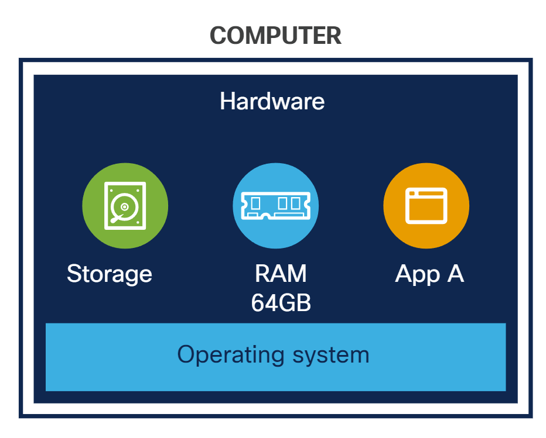
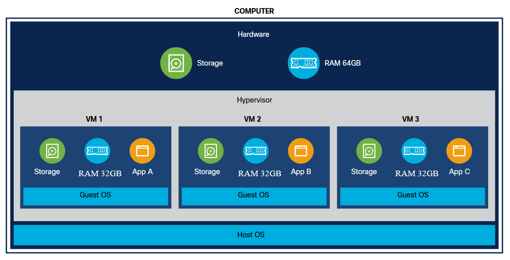
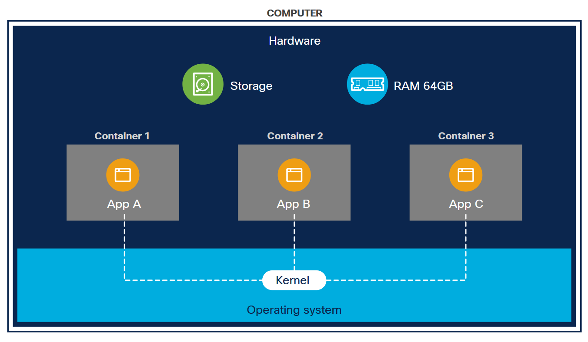
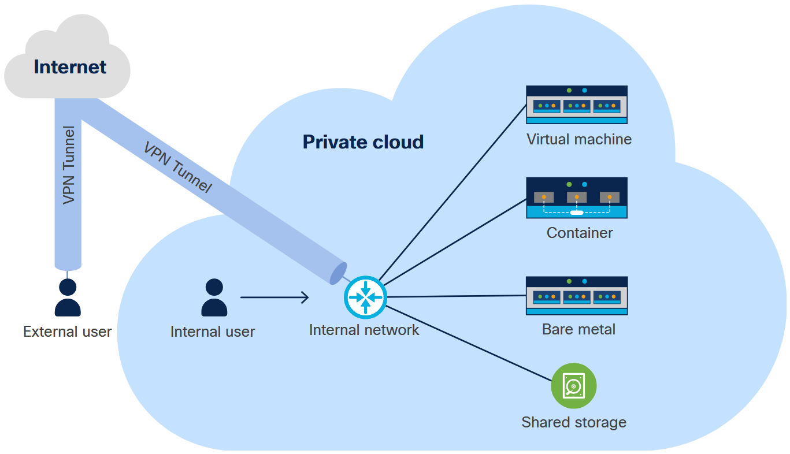
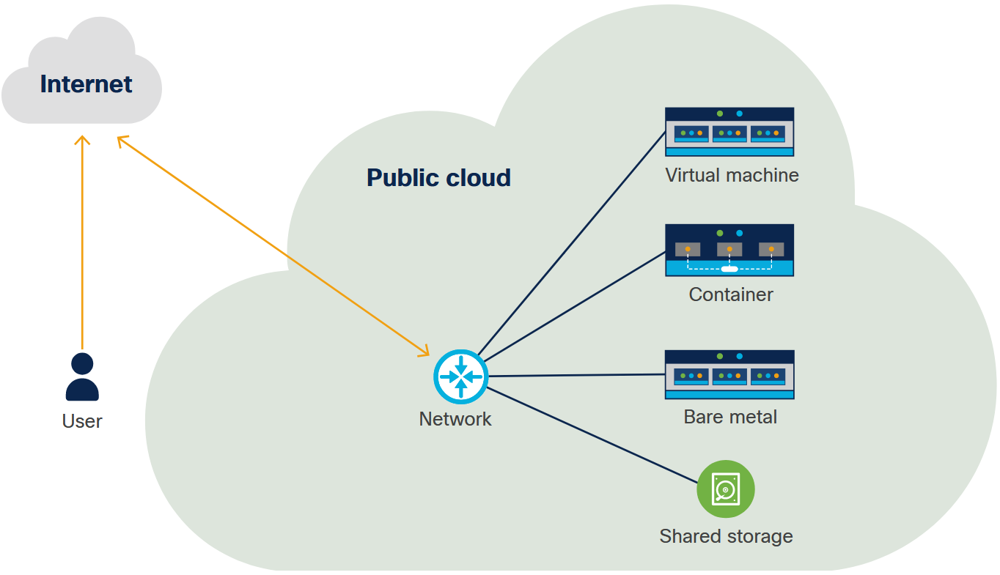
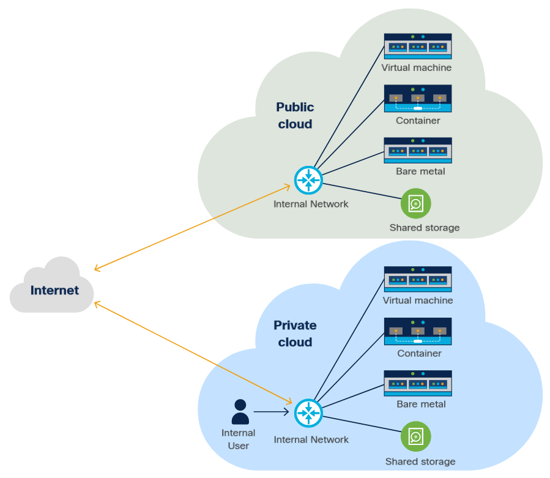

<!-- 6.1.1 -->
## Введение в варианты развертывания

На этом этапе курса вы узнали об основных концепциях разработки программного обеспечения и API. Теперь пора взглянуть на развертывание приложений.

Даже если вы являетесь индивидуальным разработчиком, создающим приложение для себя, при развертывании приложения вы должны учитывать ряд различных факторов, от создания соответствующих сред до правильного определения инфраструктуры и базовых концепций безопасности. Это просто означает, что разработчикам нужно делать больше, чем просто доставлять код приложения: им нужно заботиться о том, как приложения развертываются, защищаются, управляются, отслеживаются, масштабируются и обслуживаются.

Между тем, физическая и виртуальная инфраструктура и платформы, на которых разрабатываются и развертываются приложения, быстро развиваются. Часть этой быстрой эволюции направлена на облегчение жизни разработчиков и операторов. Например, такие парадигмы платформы, как «Контейнеры как услуга» и «Бессерверные вычисления», предназначены для того, чтобы разработчики могли сосредоточиться на создании основных функций приложения, не беспокоясь об обработке базовой конфигурации платформы, механики, масштабирования и других операций.

Но не все текущие разработки происходят на этих платформах. Разработчики сталкиваются с растущим «стеком» вариантов платформ: «голое железо», виртуальные машины, контейнеры и другие размещаются в инфраструктурах и каркасах все большей гибкости и сложности.

В этом модуле обсуждаются некоторые из мест, где «живет» современное программное обеспечение. Далее рассматриваются базовые методы развертывания и тестирования приложений, а также методы рабочего процесса и инструменты для быстрой и эффективной доставки программного обеспечения (на платформы разработки, тестовые среды, промежуточную и производственную среду). Наконец, он охватывает некоторые основы работы в сети и безопасности. Все разработчики должны быть знакомы с этими концепциями.

<!-- 6.1.2 -->
## Среды развертывания

Некоторый хаос на ранних этапах разработки - это нормально, но код должен быть хорошо протестирован к тому времени, когда он попадет к пользователям. Чтобы это произошло, код должен пройти ряд шагов для повышения его надежности. Код проходит через ряд сред, и при этом его качество и надежность повышаются. Эти среды являются самодостаточными и предназначены для имитации конечной среды, в которой будет «жить» код.

Обычно в крупных организациях используется четырехуровневая структура: разработка, тестирование, подготовка и производство.

### Среда разработки

Среда разработки - это то место, где вы пишете код. Обычно ваша среда разработки мало похожа на конечную среду. Среды разработки обычно достаточно для управления фундаментальными аспектами вашей инфраструктуры, такими как контейнеры или облачные сети. Вы можете использовать интегрированную среду разработки (IDE) или другой инструмент, чтобы упростить развертывание.

Эта среда также может включать в себя «фиктивные» ресурсы, которые предоставляют форму реальных ресурсов, но не контент. Например, у вас может быть база данных с минимальным количеством тестовых записей или приложение, которое имитирует вывод удаленной службы. У каждого разработчика обычно есть собственная среда разработки.

### Тестовая среда

Когда вы считаете, что ваш код готов, вы можете перейти ко второй среде, которая была выделена для тестирования кода, хотя при работе над небольшими проектами среды разработки и тестирования часто объединяются. Эта среда тестирования должна быть структурно похожа на окончательную производственную среду, даже если она имеет гораздо меньший масштаб.

Среда тестирования часто включает инструменты автоматического тестирования, такие как Jenkins, CircleCI или Travis CI, а также интеграцию с системой контроля версий. Он должен быть разделен между всей командой. Он также может включать инструменты проверки кода, такие как Gerrit.

### Промежуточная среда

После тестирования кода он переходит в промежуточную среду. Постановка должна быть как можно ближе к реальной производственной среде, чтобы код мог пройти окончательное приемочное тестирование в реалистичной среде. Вместо того, чтобы поддерживать небольшую промежуточную среду, некоторые организации поддерживают две соответствующие производственные среды, одна из которых содержит текущий выпуск приложения, а другая ожидает получения нового выпуска. В этом случае, когда развертывается новая версия, трафик перемещается (постепенно или внезапно, как при «коммутации») из текущей производственной среды в другую. В следующем выпуске все происходит в обратном порядке.

Это, конечно, гораздо более доступно в облаках, где неиспользуемая виртуализированная среда может быть разрушена и автоматически восстановлена при необходимости.

### Производственная среда

Наконец, код попадает в производственную среду, где с ним взаимодействуют конечные пользователи. На данный момент он был протестирован несколько раз и должен быть безошибочным. Сама производственная среда должна быть рассчитана и сконструирована так, чтобы справляться с ожидаемым трафиком, в том числе скачками, которые могут возникать сезонно или в связи с определенным событием.

Обработка этих скачков - это то, что вы можете запланировать при проектировании своей инфраструктуры. Однако, прежде чем рассматривать инфраструктуру, вам нужно знать о различных моделях, которые вы можете использовать для развертывания своего программного обеспечения.

<!-- 6.1.3 -->
## Модели развертывания

На заре компьютеров не было выбора относительно того, как развернуть программное обеспечение; вы просто установили его на сам компьютер. Сегодня эта модель известна как «голое железо», но это лишь одна из множества доступных вам опций. Эти параметры включают виртуальные машины, контейнеры и новые возможности, такие как бессерверные вычисления.

### Голое железо

Самый знакомый и самый простой способ развертывания программного обеспечения - это его установка непосредственно на целевой компьютер или «голое железо». Помимо того, что это самый простой метод, развертывание на «голом железе» имеет и другие преимущества, например тот факт, что программное обеспечение может напрямую обращаться к операционной системе и оборудованию. Это особенно полезно в ситуациях, когда вам нужен доступ к специализированному оборудованию, или для приложений высокопроизводительных вычислений (HPC), в которых важен каждый бит скорости.

<!-- /courses/devnet/9bd0a1b0-b013-11ea-b75f-ab3f17a06d7d/9bd3aef0-b013-11ea-b75f-ab3f17a06d7d/assets/238aee90-c2dd-11ea-9970-b90c4abb30b0.svg -->

Развертывание на «голом железе» - это, по сути, развертывание на реальном компьютере.

Однако одно место, где голое железо может быть недостатком, - это изоляция различных рабочих нагрузок друг от друга. В среде с нуля каждое приложение на машине использует одно и то же ядро, операционную систему, хранилище и т. д. Есть вещи, которые вы можете сделать, чтобы изолировать некоторые ресурсы, но если это проблема, другие модели, вероятно, будут лучшим выбором. . Кроме того, «голое железо» не очень гибко с точки зрения ресурсов; машина с 64 ГБ ОЗУ не станет больше или меньше, если кто-то физически не разбирает ее для добавления или удаления оборудования.

Чаще всего в качестве инфраструктуры для размещения виртуализации (гипервизоры) и облачных платформ (оркестраторы для виртуальных вычислений, хранилищ и сетевых ресурсов) используется «голое железо». Cisco, среди прочего, была пионером в разработке программно-определяемых аппаратных платформ (таких как Cisco UCS), которые позволяют легко настраивать инфраструктуру «голого железа» для обслуживания требований приложений и инфраструктуры как услуги.

### Виртуальные машины

Одним из способов решения проблем гибкости и изоляции является использование виртуальных машин или виртуальных машин. Виртуальная машина похожа на компьютер внутри вашего компьютера; у него есть собственная вычислительная мощность, сетевые интерфейсы и хранилище.

Гипервизор - это программное обеспечение, которое создает виртуальные машины и управляет ими. Гипервизоры доступны как с открытым исходным кодом (OpenStack, Linux KVM, XEN), так и от коммерческих поставщиков, таких как Oracle (VirtualBox), VMware (Horizon, vSphere, Fusion), Microsoft (Hyper-V) и других. Гипервизоры обычно классифицируются как «Тип 1», которые работают непосредственно на физическом оборудовании («голое железо»), так и «Тип 2», которые запускаются, обычно как приложение, под существующей операционной системой.

Использование виртуальных машин преодолевает ряд ограничений. Например, если у вас есть три рабочие нагрузки, которые вы хотите изолировать друг от друга, вы можете создать три отдельные виртуальные машины на одном голом сервере.

<!-- /courses/devnet/9bd0a1b0-b013-11ea-b75f-ab3f17a06d7d/9bd3aef0-b013-11ea-b75f-ab3f17a06d7d/assets/238b15a0-c2dd-11ea-9970-b90c4abb30b0.svg -->

Виртуальные машины разделяют ресурсы хоста.

Здесь следует отметить несколько моментов:

1.	Приложения, работающие на виртуальной машине, ограничены виртуальной машиной. Доступ к ресурсам за пределами виртуальной машины осуществляется через виртуальные сети.
2.	Несмотря на то, что виртуальные машины работают на одном компьютере, они могут запускать разные операционные системы друг от друга (так называемые «гостевые операционные системы») и с «голого железа», на котором работают виртуальные машины (называемого «хост-операционной системой»).
3.	Общий объем виртуальной памяти, выделенной этим трем виртуальным машинам, превышает объем оперативной памяти, доступной на хост-машине. Это называется «чрезмерными обязательствами». Это возможно, потому что маловероятно, что всем трем виртуальным машинам понадобится вся их виртуальная память одновременно, а гипервизор может при необходимости разделять виртуальные машины. Чрезмерное использование ресурсов может привести к проблемам с производительностью, если потребление ресурсов слишком велико.

Виртуальные машины работают поверх гипервизора, такого как KVM, QEMU или VMware, который предоставляет им смоделированное оборудование или контролируемый доступ к базовому физическому оборудованию. Гипервизор находится поверх операционной системы и управляет виртуальными машинами.

Виртуальные машины могут быть удобны по нескольким причинам, не в последнюю очередь из-за того, что образ ВМ можно сохранить для использования в будущем или для того, чтобы другие могли создавать и использовать. Это позволяет вам распространять виртуальную машину или, по крайней мере, средства ее использования. Приложения, которые запускают виртуальные машины, такие как VirtualBox и VMware, также могут делать снимки или резервные копии виртуальной машины, чтобы при необходимости можно было вернуть ее в предыдущее состояние.

Поскольку они очень похожи на физические машины, виртуальные машины могут содержать широкий спектр программного обеспечения, даже устаревшее программное обеспечение. Новые среды приложений, такие как контейнеры, могут быть недостаточно «похожи на настоящие машины» для размещения приложений, написанных без учета их ограничений.

### Инфраструктура на базе контейнеров

Двигаясь вверх по лестнице абстракции от виртуальных машин, вы обнаружите контейнеры. Программное обеспечение для создания контейнеров и управления ими или их оркестрации доступно в Docker, AWS (Elasticized Container Service), Microsoft (Azure Container Service) и других.

Контейнеры были разработаны для обеспечения многих из тех же преимуществ, что и виртуальные машины, таких как изоляция рабочих нагрузок и возможность запускать несколько рабочих нагрузок на одной машине, но их архитектура немного отличается.

Во-первых, контейнеры предназначены для быстрого запуска и, как таковые, не включают в себя так много базовой инфраструктуры программного обеспечения. Виртуальная машина содержит всю гостевую операционную систему, но контейнер использует операционную систему хост-компьютера и использует специфичные для контейнера двоичные файлы и библиотеки.

<!-- /courses/devnet/9bd0a1b0-b013-11ea-b75f-ab3f17a06d7d/9bd3aef0-b013-11ea-b75f-ab3f17a06d7d/assets/238b15a1-c2dd-11ea-9970-b90c4abb30b0.svg -->

Контейнеры совместно используют ресурсы хоста, включая ядро.

Если виртуальные машины эмулируют весь компьютер, контейнер обычно представляет собой только приложение или группу приложений. Ценность использования контейнеров заключается в том, что все библиотеки и двоичные файлы, необходимые для запуска приложения, включены, поэтому пользователю не нужно выполнять этот дополнительный шаг установки.

Важное различие между контейнером Docker и виртуальной машиной заключается в том, что каждая виртуальная машина имеет свою собственную полную операционную систему. Контейнеры содержат только часть операционной системы. Например, у вас может быть хост-компьютер Ubuntu Linux с виртуальной машиной CentOS Linux, виртуальной машиной Ubuntu Linux и виртуальной машиной Windows 10. У каждой из этих виртуальных машин есть собственная полная ОС. Это может быть очень ресурсоемким для главного компьютера.

С Docker контейнеры используют одно и то же ядро своего хост-компьютера. Например, на главном компьютере Ubuntu Linux у вас может быть контейнер Ubuntu Linux и контейнер Centos Linux. Оба этих контейнера используют одно и то же ядро Linux. Однако у вас не может быть контейнера под управлением Windows 10 на том же хост-компьютере Ubuntu Linux, потому что Windows использует другое ядро. Совместное использование одного и того же ядра требует гораздо меньше ресурсов, чем использование отдельных виртуальных машин, каждая со своим собственным ядром.

Контейнеры также решают проблему, которая возникает, когда нескольким приложениям для работы требуются разные версии одной и той же библиотеки. Поскольку каждое приложение находится в собственном контейнере, оно изолировано от любых конфликтующих библиотек и двоичных файлов.

Контейнеры также полезны из-за экосистемы инструментов вокруг них. Такие инструменты, как Kubernetes, делают возможной довольно сложную оркестровку контейнеров, а тот факт, что контейнеры часто спроектированы так, чтобы не иметь состояния и быстро запускаться, означает, что вы можете сэкономить ресурсы, не запуская их, если вам это не нужно.

Контейнеры также являются основой облачных вычислений, в которых приложения, как правило, не имеют состояния. Эта безгражданство позволяет любому экземпляру конкретного контейнера обрабатывать запрос. Когда вы добавляете это к другому аспекту облачных вычислений, который делает упор на услуги, становятся возможными бессерверные вычисления.

### Бессерверные вычисления

Начнем с этого важного момента: сказать, что приложения «бессерверны», - это здорово для маркетинга, но технически это не так. Конечно, ваше приложение работает на сервере. Он просто работает на сервере, который вы не контролируете, и о котором не нужно думать. Отсюда и название «бессерверный».

Бессерверные вычисления используют преимущества современной тенденции к приложениям, основанным на сервисах. То есть приложение обращается к другой программе или рабочей нагрузке для выполнения конкретной задачи, чтобы создать среду, в которой приложения становятся доступными по мере необходимости.

Это работает так:

**Шаг 1**. Вы создаете свое приложение.

**Шаг 2**. Вы развертываете свое приложение как контейнер, чтобы его можно было легко запустить в любой подходящей среде.

**Шаг 3**. Вы развертываете этот контейнер у поставщика бессерверных вычислений, такого как AWS Lambda, функции Google Cloud или даже во внутренней инфраструктуре Function as a Service. Это развертывание включает спецификацию того, как долго функция должна оставаться неактивной, прежде чем она будет остановлена.

**Шаг 4**. При необходимости ваше приложение вызывает функцию.

**Шаг 5**. Провайдер раскручивает экземпляр контейнера, выполняет необходимую задачу и возвращает результат.

<!-- /courses/devnet/9bd0a1b0-b013-11ea-b75f-ab3f17a06d7d/9bd3aef0-b013-11ea-b75f-ab3f17a06d7d/assets/238b15a2-c2dd-11ea-9970-b90c4abb30b0.svg -->

Бессерверные вычисления берут на себя ответственность за распределение ресурсов от разработчика и несут расходы только при запуске приложения.

Здесь важно отметить, что если бессерверное приложение не требуется, оно не работает, и вы не получаете за него плату. С другой стороны, если вы обычно вызываете его несколько раз, провайдер может запустить несколько экземпляров для обработки трафика. Вам не о чем беспокоиться.

Поскольку емкость увеличивается и уменьшается по мере необходимости, ее обычно называют «эластичной», а не «масштабируемой».

Хотя есть огромное преимущество в том, что вы платите только за ресурсы, которые фактически используются, в отличие от виртуальной машины, которая может работать все время, даже когда ее емкость не требуется. Модель бессерверных вычислений означает, что у вас нет контроля над хост-машиной, поэтому она может не подходить с точки зрения безопасности.

<!-- 6.1.4 -->
## Типы инфраструктуры

На заре компьютеров инфраструктура была довольно простой. Программное обеспечение, которое вы так тщательно написали, работало на одном компьютере. В конце концов, у вас была сеть, которая могла связать несколько компьютеров вместе. С этого момента все становилось все более и более сложным. Давайте посмотрим на различные варианты проектирования вашей инфраструктуры, такие как разные типы облаков, и на то, что у каждого из них есть, а что нет.

<!-- 6.1.5 -->
## On-premises

### On-premises

Технически говоря, «on-premises (на территории)» означает любую систему, которая буквально находится в пределах вашего здания. В этом случае мы говорим о традиционных центрах обработки данных, в которых размещены отдельные машины, которые предназначены для приложений, а не облака, внешние или иные.

Эти традиционные инфраструктуры представляют собой центры обработки данных с серверами, выделенными для отдельных приложений или виртуальных машин, которые, по сути, позволяют одному компьютеру работать как несколько компьютеров.

Для работы традиционного локального центра обработки данных требуется, чтобы серверы, устройства хранения и сетевое оборудование были заказаны, получены, собраны в стойки («в стойку и штабелированы»), перемещены в место и подключены для подачи питания и данных. Это оборудование должно быть обеспечено экологическими услугами, такими как защита электропитания, охлаждение и противопожарная защита. Затем серверы должны быть логически настроены для их ролей, должны быть установлены операционные системы и программное обеспечение, и все это необходимо поддерживать и контролировать.

Вся эта инфраструктурная работа требует времени и усилий. Запросы на ресурсы должны проходить через операционную группу, что может привести к задержкам на несколько дней, недель или даже месяцев, пока будет получено, подготовлено и предоставлено новое оборудование.

Кроме того, масштабирование приложения обычно означает перемещение его на более крупный сервер, что делает масштабирование вверх или вниз важным событием. Это означает, что приложение почти всегда либо тратит деньги из-за избыточной емкости, которая не используется, либо работает недостаточно эффективно из-за нехватки ресурсов.

Эти проблемы можно решить, перейдя на облачное решение.

<!-- 6.1.6 -->
## Частное облако

Обратную сторону локальной инфраструктуры можно легко решить с помощью облачных вычислений. Облако - это система, которая обеспечивает самообслуживание для вычислительных ресурсов, сети и хранилища.

<!-- /courses/devnet/9bd0a1b0-b013-11ea-b75f-ab3f17a06d7d/9bd3aef0-b013-11ea-b75f-ab3f17a06d7d/assets/238b15a3-c2dd-11ea-9970-b90c4abb30b0.svg  -->

В инфраструктуре частного облака организация контролирует все ресурсы.

Облако состоит из плоскости управления, которая позволяет выполнять запросы. Вы можете создать новую виртуальную машину, подключить том хранилища, даже создать новую сеть и вычислительные ресурсы.

Облака обеспечивают доступ самообслуживания к вычислительным ресурсам, таким как виртуальные машины, контейнеры и даже голое железо. Это означает, что пользователи могут войти в панель управления или использовать командную строку для самостоятельного запуска новых ресурсов, а не ждать, пока ИТ-специалисты разрешат заявку. Эти платформы иногда называют «инфраструктура как услуга» (IaaS). Распространенные частные облачные платформы включают VMware (проприетарный), OpenStack (открытый исходный код) и Kubernetes (фреймворк оркестровки контейнеров). Базовая аппаратная инфраструктура для облаков может быть предоставлена обычными сетевыми голыми железными серверами или более продвинутыми управляемыми физическими инфраструктурными решениями или «гиперконвергентными» решениями для физической инфраструктуры, такими как Cisco UCS и Cisco HyperFlex соответственно.

Частное облако отличается от других типов облаков тем, что все ресурсы в облаке находятся под контролем вашей организации. В большинстве случаев частное облако будет расположено в вашем центре обработки данных, но технически это не является обязательным требованием, чтобы называться «частным». Важной частью является то, что все ресурсы, работающие на оборудовании, принадлежат организации-владельцу.

Преимущество частного облака заключается в том, что у вас есть полный контроль над его расположением, что важно в ситуациях, когда существуют определенные нормативные требования, и что вам обычно не нужно беспокоиться о других рабочих нагрузках в системе.

С другой стороны, у вас должна быть рабочая группа, которая может управлять облаком и поддерживать его работу.

<!-- 6.1.7 -->
## Публичное облако

Публичное облако по сути то же самое, что и частное облако, но им управляет поставщик общедоступного облака. Общедоступные облака также могут запускать такие системы, как OpenStack или Kubernetes, или они могут быть конкретными проприетарными облаками, такими как Amazon Web Services или Azure.

Клиенты общедоступного облака могут совместно использовать ресурсы с другими организациями: ваша виртуальная машина может работать на том же хосте, что и виртуальная машина, принадлежащая кому-то другому. В качестве альтернативы поставщики общедоступного облака могут предоставить клиентам выделенную инфраструктуру. Большинство из них предоставляет несколько географически обособленных облачных «регионов», в которых могут размещаться рабочие нагрузки. Это позволяет размещать рабочие нагрузки рядом с пользователями (минимизируя задержку), поддерживая географическую избыточность (регионы Восточного и Западного побережья вряд ли будут одновременно отключены) и обеспечит юрисдикционный контроль над местом хранения данных.

<!-- /courses/devnet/9bd0a1b0-b013-11ea-b75f-ab3f17a06d7d/9bd3aef0-b013-11ea-b75f-ab3f17a06d7d/assets/238b15a4-c2dd-11ea-9970-b90c4abb30b0.svg -->

Общедоступные облака могут быть полезны, потому что вам не нужно платить за оборудование, которое вы не собираетесь использовать, поэтому вы можете масштабироваться практически бесконечно, пока этого требует нагрузка, а затем уменьшать масштаб при медленном трафике. Поскольку вы платите только за фактически используемые ресурсы, это решение может быть наиболее экономичным, поскольку у вашего приложения никогда не заканчиваются ресурсы, и вы не платите за ресурсы, которые не используете. Вам также не нужно беспокоиться об обслуживании или эксплуатации оборудования; этим занимается провайдер общедоступного облака. Однако на практике, когда ваше облако достигает определенного размера, преимущества в цене, как правило, исчезают, и вам становится лучше с частным облаком.

У публичного облака есть один недостаток. Поскольку вы совместно используете облако с другими пользователями, вам, возможно, придется столкнуться с ситуациями, когда другие рабочие нагрузки занимают больше, чем их доля ресурсов.

Эта проблема усугубляется, когда облачный провайдер слишком загружен. Провайдер предполагает, что не все ресурсы будут использоваться одновременно, и выделяет больше «виртуальных» ресурсов, чем «физических». Например, нет ничего необычного в том, что для ЦП коэффициент переопределения составляет 16: 1, что означает, что для каждого физического ЦП может быть выделено 16 виртуальных ЦП для виртуальных машин. Память также может быть перегружена. При соотношении памяти 2: 1 на сервере со 128 ГБ ОЗУ может быть 256 ГБ рабочих нагрузок. В общедоступном облаке у вас нет контроля над этим (за исключением того, что вы платите больше за выделенные экземпляры или другие услуги, которые помогают гарантировать уровни обслуживания).

<!-- 6.1.8 -->
## Гибридное облако

Как вы могли догадаться, гибридное облако представляет собой комбинацию двух разных типов облаков. Обычно гибридное облако используется для объединения частного облака и общедоступного облака в рамках одного приложения.

<!-- /courses/devnet/9bd0a1b0-b013-11ea-b75f-ab3f17a06d7d/9bd3aef0-b013-11ea-b75f-ab3f17a06d7d/assets/238b15a5-c2dd-11ea-9970-b90c4abb30b0.svg -->

Гибридное облако объединяет общедоступное и частное облако для предоставления дополнительных ресурсов и безопасности там, где это необходимо.

Например, у вас может быть приложение, которое работает в вашем частном облаке, но «вспыхивает» в публичное облако, если у него заканчиваются ресурсы. Таким образом, вы можете сэкономить деньги, не покупая частное облако слишком дорого, но при этом иметь ресурсы, когда они вам понадобятся.

Вы также можете пойти в другом направлении и иметь приложение, которое в основном работает в общедоступном облаке, но использует ресурсы в частном облаке для обеспечения безопасности или контроля. Например, у вас может быть веб-приложение, которое обслуживает большую часть своего контента из общедоступного облака, но хранит информацию о пользователях в базе данных в частном облаке.

Гибридное облако часто путают с несколькими облаками, в которых организация использует несколько облаков для разных целей. Гибридное облако отличает использование более одного облака в одном приложении. Таким образом, гибридное облачное приложение должно гораздо больше знать о своей среде, чем приложение, живущее в одном облаке.

Негибридное облачное приложение и его облако подобны рыбе и океану; рыбе не нужно знать об океане, потому что океан просто там, вокруг рыбы. Когда вы начинаете добавлять в приложение возможности гибридного облака, это приложение должно знать, какие ресурсы доступны и откуда.

Лучше всего, если самому приложению не придется обрабатывать эти вещи напрямую. Лучше иметь какой-то интерфейс, который приложение может вызывать, когда ему требуется больше ресурсов, и этот интерфейс принимает решение о том, где запускать эти ресурсы, и передает их обратно в приложение. Таким образом, логикой сопоставления ресурсов можно управлять независимо от самого приложения и настраивать ее для различных ситуаций. Например, вы можете сохранить все ресурсы внутри на этапе тестирования и отладки, а затем постепенно увеличивать использование общедоступного облака.

Один из способов добиться этого - использовать такой инструмент, как Cisco Hybrid Cloud Platform для Google Cloud, который управляет сетью, безопасностью, управлением, центром обработки данных, программным обеспечением и инструментами с открытым исходным кодом и API. Это предоставляет вам единую согласованную и безопасную среду для вашего приложения, позволяющую ему работать как в локальных центрах обработки данных, так и в Google Cloud.

Кроме того, оркестраторы контейнеров стали очень популярными среди компаний, использующих развертывание гибридного облака. Оркестраторы обеспечивают независимый от поставщика облака уровень, который приложение может использовать для запроса необходимых ресурсов, снижая осведомленность об окружающей среде, необходимую для самого приложения.

<!-- 6.1.9 -->
## Пограничное облако

Новейший тип облака - пограничное облако. Пограничное облако набирает популярность из-за роста Интернета вещей (IoT). Эти подключенные устройства, такие как подключенные камеры, автономные транспортные средства и даже смартфоны, все больше получают выгоду от вычислительной мощности, которая находится ближе к ним в сети.

Две основные причины, по которым более высокая вычислительная мощность помогает устройствам Интернета вещей, - это скорость и пропускная способность. Например, если вы играете в шутер от первого лица, даже полсекунды задержки между нажатием на спусковой крючок и моментом регистрации выстрела недопустимы. Другой случай, когда задержка может быть фатальной, - это буквально беспилотный транспорт. На скорости 55 миль в час автомобиль преодолевает более 40 футов всего за 500 мс. Если пешеход сойдет с тротуара, машина не может дождаться инструкций, что делать.

Есть вторая проблема. Обычно беспилотный автомобиль предотвращает проблему задержки, принимая собственные решения, но это приводит к своим собственным проблемам. В этих транспортных средствах используется машинное обучение, которое требует передачи огромных объемов данных к транспортному средству и от него. По оценкам, эти автомобили генерируют более 4 ТБ данных каждый час, и большинство сетей не могут обрабатывать такой трафик (особенно с учетом ожидаемого роста количества этих автомобилей на рынке).

Чтобы решить обе эти проблемы, граничное облако перемещает вычисления ближе к тому месту, где они необходимы. Вместо того, чтобы транзакции направлялись от конечного пользователя в Кливленде к основному облаку в Орегоне, в Кливленде может быть промежуточное облако, пограничное облако. Пограничное облако обрабатывает данные или транзакцию. Затем он либо отправляет ответ клиенту, либо выполняет предварительный анализ данных и отправляет результаты в региональное облако, которое может быть дальше.

<!-- /courses/devnet/9bd0a1b0-b013-11ea-b75f-ab3f17a06d7d/9bd3aef0-b013-11ea-b75f-ab3f17a06d7d/assets/238b15a6-c2dd-11ea-9970-b90c4abb30b0.svg -->

Пограничное облако позволяет ресурсам быть ближе к тому месту, где они необходимы

Граничные облачные вычисления включают одно или несколько центральных облаков, которые действуют как концентратор для самих граничных облаков. Аппаратное обеспечение краевых облаков расположено максимально близко к пользователю. Например, у вас может быть периферийное оборудование на фактической вышке сотовой связи, обрабатывающее сигналы на мобильный телефон пользователя и от него.

Еще одна область, где вы можете увидеть периферийные вычисления, - это розничная торговля, где у вас несколько магазинов. У каждого магазина может быть собственное внутреннее облако. Это пограничное облако, которое передается в региональное облако, которое, в свою очередь, может передаваться в центральное облако. Эта архитектура дает местным офисам преимущества наличия собственного облака (например, последовательное развертывание API-интерфейсов для обеспечения эффективного управления, обновления и мониторинга каждым магазином).

В пограничных облаках нет ничего "особенного". Это просто типичные облака. Что делает их «крайними», так это то, где они находятся, и то, что они связаны друг с другом. Однако есть еще одна особенность краевых облаков. Поскольку они часто работают на гораздо меньшем оборудовании, чем «типичные» облака, они могут быть более ограниченными в ресурсах. Кроме того, периферийное облачное оборудование должно быть надежным, эффективным с точки зрения энергопотребления и, желательно, удаленно управляемым, поскольку оно может быть расположено в удаленной области, например на вышке сотовой связи посреди пустыни, где обслуживание оборудования затруднено.
