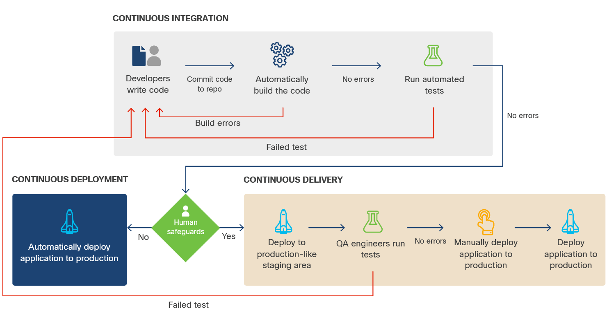
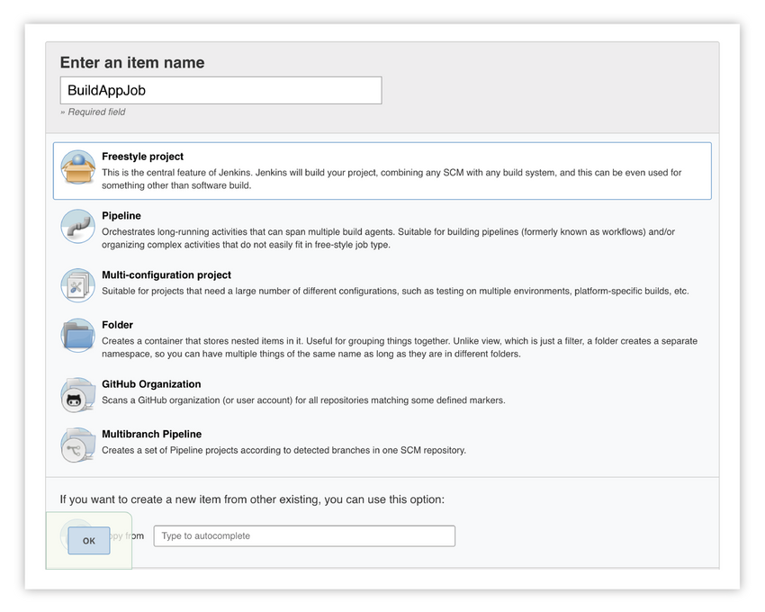
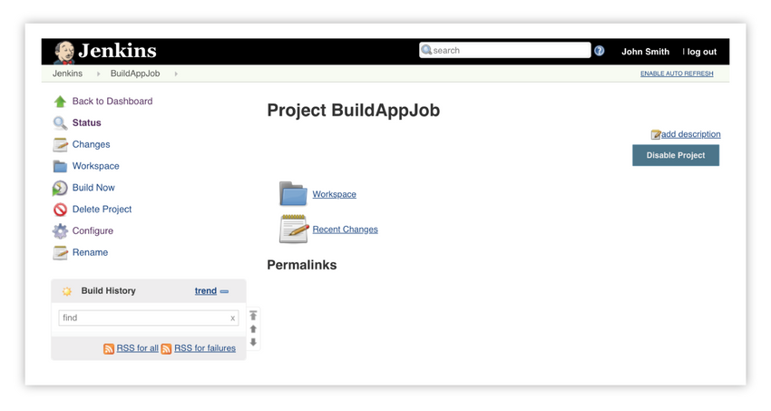
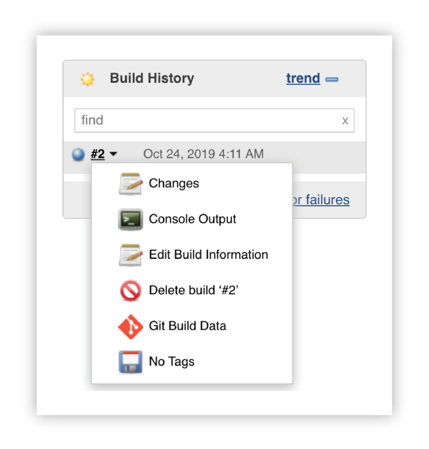
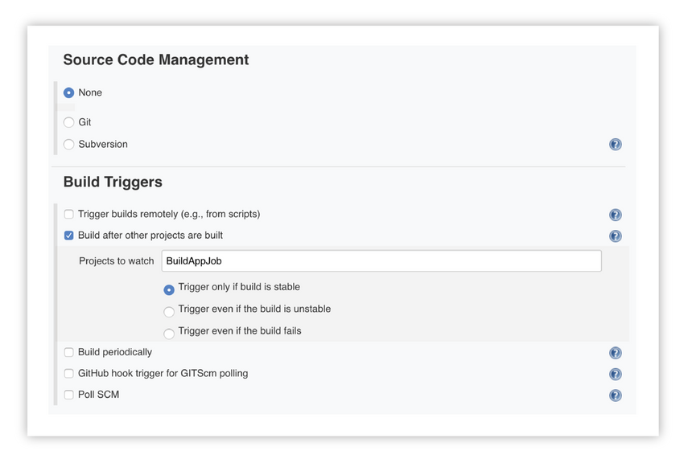
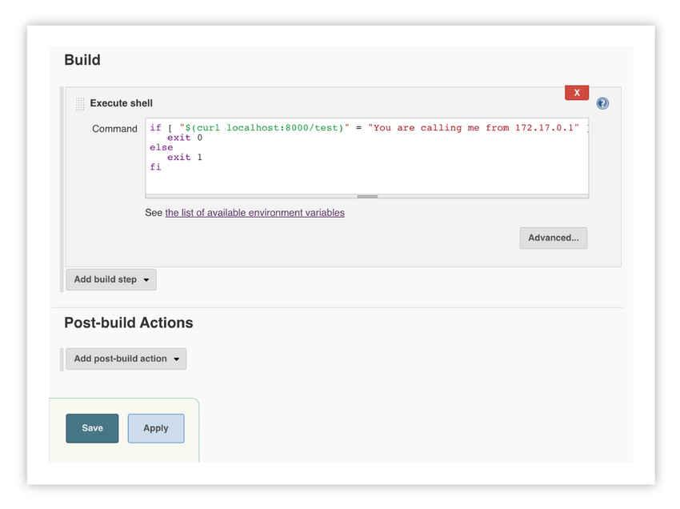
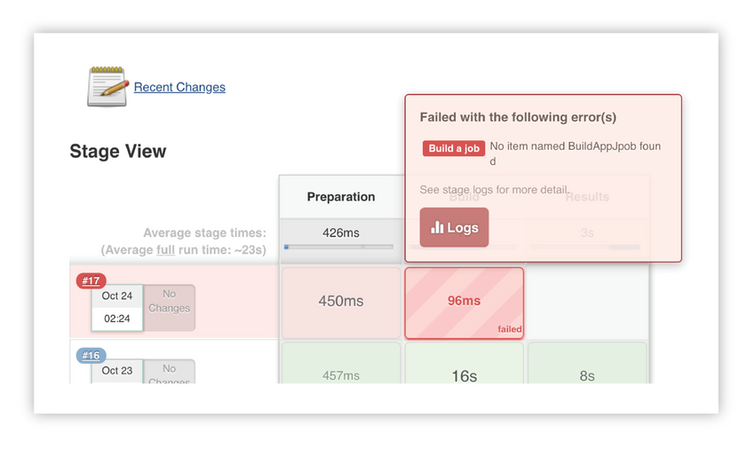
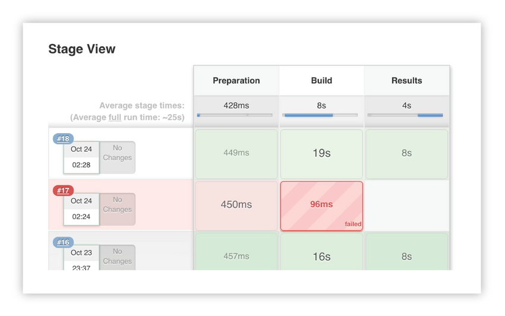

<!-- 6.3.1 -->
## Введение в CI/CD

Непрерывная интеграция/непрерывное развертывание (CI/CD) - это философия развертывания программного обеспечения, которая занимает видное место в области DevOps. DevOps - это общение и обеспечение совместной работы всех членов команды для обеспечения бесперебойной работы.

<!-- 6.3.2 -->
## Непрерывная интеграция

Вы когда-нибудь много работали над приложением, и когда вы пытались объединить его обратно в основное приложение, возникало множество конфликтов слияния, любой из которых мог привести к серьезным ошибкам? Непрерывная интеграция предназначена для устранения этой проблемы.

Идея непрерывной интеграции заключается в том, что вы и все другие разработчики проекта постоянно объединяете свои изменения с основной ветвью существующего приложения. Это означает, что любой заданный набор изменений невелик и вероятность проблем невелика. Если все используют основную ветку, любой, кто проверяет код, получит последнюю версию того, что разрабатывают все остальные.

Ожидается, что в рамках этого процесса разработчики будут выполнять обширное и обычно автоматизированное тестирование своего кода перед тем, как снова слиться с основной ветвью. Идея состоит в том, что большинство проблем обнаруживаются до того, как они станут более серьезной проблемой.

Процесс непрерывной интеграции дает ряд дополнительных преимуществ, поскольку каждая фиксация дает системе возможность выполнять дополнительные задачи. Например, конвейер может быть настроен для выполнения следующих задач:

* Компиляция кода
* Выполнение модульного теста
* Статический анализ кода
* Интеграционное тестирование
* Упаковка и управление версиями
* Публикация пакета версии в Docker Hub или других репозиториях пакетов

Обратите внимание, что есть некоторые ситуации, когда требуются большие и сложные изменения, например добавление новых функций, в которых изменения должны быть сгруппированы вместе. В этом случае каждая фиксация может запускать только часть конвейера CI, при этом шаги упаковки и управления версиями выполняются только тогда, когда вся функция объединяется с мастером.

В некоторых случаях приспособление к этому способу работы требует изменения мышления со стороны организации или со стороны отдельных разработчиков, которые могут работать в своей собственной ветке или в функциональных ветках. Однако это изменение необходимо, если вы собираетесь достичь следующего шага: непрерывной доставки, что не совсем то же самое, что непрерывное развертывание.

### Непрерывная доставка

Непрерывная доставка - это процесс разработки в спринтах, которые достаточно короткие, чтобы код всегда находился в состоянии развертывания. При непрерывной интеграции наборы небольших изменений постоянно интегрируются в основную ветвь кода. Непрерывная доставка означает, что эти изменения спроектированы так, чтобы быть самодостаточными до такой степени, что в любой момент времени вы можете развернуть работающее приложение.

Процесс выглядит примерно так:

**Шаг 1**. Начните с артефакта версии, который был создан в процессе непрерывной интеграции.

**Шаг 2**. Автоматически развернуть версию-кандидат при постановке.

**Шаг 3**. Запускайте интеграционные тесты, тесты безопасности, тесты производительности, тесты масштабирования или другие тесты, определенные командой или организацией. Они известны как стробирующие тесты, потому что они определяют, можно ли продвигать эту версию программного обеспечения в дальнейшем в процессе развертывания.

**Шаг 4**. Если все контрольные тесты пройдены, пометьте эту сборку как подходящую для производства.

Обратите внимание, что непрерывная доставка не означает, что вы развертываете постоянно, этот процесс называется непрерывным развертыванием. Непрерывная доставка гарантирует, что у вас всегда будет версия, которую можно развернуть.


<!-- /courses/devnet/9bd0a1b0-b013-11ea-b75f-ab3f17a06d7d/9beeb100-b013-11ea-b75f-ab3f17a06d7d/assets/238b15a8-c2dd-11ea-9970-b90c4abb30b0.svg -->

CI/CD - это процесс автоматического тестирования и развертывания, который может включать доставку.

Этот процесс говорит нам о двух вещах:

* О тестировании нужно подумать заранее. В модуле «Разработка программного обеспечения» мы обсуждали «Разработка через тестирование», и общая идея состоит в том, что вы пишете автоматизированные процедуры тестирования, которые могут выполняться инфраструктурой CI/CD.
* Если что-то ломается, все останавливается. Идея, лежащая в основе этой концепции, заключается в том, что при обнаружении ошибки вся остальная разработка останавливается, пока она не будет исправлена, возвращая систему в готовое к развертыванию состояние. Это может быть достигнуто путем поиска и исправления ошибки, или это может быть выполнено путем отката изменений до тех пор, пока ошибка не исчезнет, но важная часть состоит в том, что система должна оставаться доступной для развертывания. На практике большинство организаций не следуют этой процедуре, но это основная идея CI/CD.

### Непрерывное развертывание

Непрерывное развертывание - это высшее выражение CI/CD. Когда изменения внесены, протестированы, интегрированы с основной веткой и снова протестированы, они развертываются в производственной среде с использованием автоматизации. Это означает, что код постоянно развертывается в производственной среде, а это значит, что ваши пользователи станут вашими последними тестировщиками. Другими словами, непрерывное развертывание - это особый тип непрерывной доставки, при котором развертывается каждая сборка, помеченная как готовая к производству.

Некоторые организации отдают предпочтение этому типу развертывания, потому что это означает, что у пользователей всегда есть самый последний код. Большинство организаций придерживаются более осторожного подхода, который требует, чтобы человек продвигал код в производство.

### Предотвращение воздействия на пользователей

Хотя мы стараемся проводить всестороннее тестирование в рамках процесса CI/CD, всегда существует вероятность того, что плохая сборка пройдет проверку. Чтобы избежать воздействия на пользователей или, по крайней мере, ограничить воздействие, вы можете использовать такие стратегии развертывания, как:

* **Прокатное обновление** - Это наиболее простая версия непрерывной доставки, в которой изменения периодически развертываются таким образом, что они не влияют на текущих пользователей, и никому не нужно «переустанавливать» программное обеспечение.
* **Канарский трубопровод** - В этом случае новая версия распространяется среди подмножества пользователей (или серверов, в зависимости от архитектуры). Если у этих пользователей возникнут проблемы, изменения можно легко откатить. Если эти пользователи не испытывают проблем, изменения распространяются на остальную часть производственной среды.
* **Сине-зеленое развертывание** - В этом случае создается совершенно новая среда (синий цвет) с новым кодом, но старая среда (зеленый цвет) остается в резерве. Если пользователи в новой среде испытывают проблемы, трафик можно перенаправить обратно в исходную среду. Если в течение определенного периода времени проблем не возникает, новая среда становится производственной средой, а старая удаляется, чтобы использовать ее для следующего изменения.
* 
<!-- 6.3.3 -->
## Преимущества CI/CD

Компании готовы внести такие, казалось бы, «радикальные» изменения в свои процессы из-за преимуществ, которые дает использование CI/CD для разработки. Эти преимущества включают:

* **Интеграция с гибкими методологиями** - Гибкая разработка построена на идее коротких спринтов, после которых команда разработчиков создает функциональное приложение с некоторым подмножеством необходимых функций. CI/CD работает в рамках той же структуры коротких спринтов. Каждый коммит - это версия концепции «предоставить рабочую версию программного обеспечения».
* **Более короткое среднее время разрешения (MTTR)** - Поскольку наборы изменений небольшие, становится намного проще изолировать сбои, когда они все же возникают, и либо исправить их, либо откатить и решить любые проблемы.
* **Автоматическое развертывание** - Благодаря автоматическому тестированию и предсказуемому развертыванию появляется возможность выполнять автоматические развертывания. Это означает, что можно использовать стратегии развертывания, такие как развертывание канареечного конвейера выпуска, при котором один набор пользователей получает новый набор функций, а остальные - старый. Этот процесс позволяет вам протестировать новую функцию в реальном времени, чтобы убедиться, что она работает должным образом, прежде чем развернуть ее для всей пользовательской базы.
* **Менее разрушительные выпуски функций** - Поскольку разработка ведется небольшими порциями, что всегда приводит к развертыванию артефакта, можно представить пользователям инкрементные изменения, а не крупномасштабные изменения, которые могут дезориентировать пользователей.
* **Повышенное качество** - Все эти преимущества позволяют получить более качественное программное обеспечение, поскольку оно было тщательно протестировано перед широкомасштабным внедрением. А поскольку устранение ошибок проще, вероятность того, что они будут устранены своевременно, больше, чем накопление технического долга.
* **Сокращение времени выхода на рынок** - Поскольку функции могут быть развернуты индивидуально, они могут быть предложены пользователям гораздо быстрее, чем если бы их нужно было развертывать все одновременно.
* 
<!-- 6.3.4 -->
## Пример задания сборки для Jenkins

> **Примечание**: Шаги, показанные в оставшейся части этого раздела, предназначены только для инструкций. Дополнительные сведения, необходимые для выполнения этих команд на виртуальной машине DEVASC, не предоставляются. Тем не менее, вы выполните аналогичные шаги в лабораторной работе «Создание конвейера CI/CD с помощью Jenkins» далее в этом разделе.

В этой части мы показываем конвейер развертывания, который обычно создается с помощью инструмента сборки, такого как Jenkins. Эти конвейеры могут обрабатывать такие задачи, как сбор и компиляция исходного кода, тестирование и компиляция артефактов, таких как файлы tar или другие пакеты. Все эти примеры показывают снимки экрана с существующего сервера Jenkins.

### Пример сборки для Jenkins

Основным элементом Jenkins является проект, также известный как работа. Вы можете создавать задания, которые делают все, что угодно, от получения кода из репозитория управления исходным кодом, такого как GitHub, до создания приложения с помощью скрипта или инструмента сборки, до его упаковки и запуска на сервере.

Вот простое задание, которое получает версию примера приложения из GitHub и запускает сценарий сборки. Затем вы выполняете вторую работу, которая тестирует сборку, чтобы убедиться, что она работает правильно.

Сначала создайте новый элемент в интерфейсе Jenkins, щелкнув ссылку **create new jobs** (создать новые задания) на странице приветствия:


<!-- https://contenthub.netacad.com/courses/devnet/9bd0a1b0-b013-11ea-b75f-ab3f17a06d7d/9beeb100-b013-11ea-b75f-ab3f17a06d7d/assets/238b15a9-c2dd-11ea-9970-b90c4abb30b0.png -->


Введите имя, выберите проект **Freestyle** (для максимальной гибкости) и нажмите **OK**.


<!-- https://contenthub.netacad.com/courses/devnet/9bd0a1b0-b013-11ea-b75f-ab3f17a06d7d/9beeb100-b013-11ea-b75f-ab3f17a06d7d/assets/238b15aa-c2dd-11ea-9970-b90c4abb30b0.png -->


Прокрутите вниз до **Source Code Management** (Управление исходным кодом) и выберите **Git**, затем введите URL-адрес репозитория GitHub для URL-адреса репозитория. Обычно это репозиторий, к которому у вас есть доступ на запись, чтобы вы могли объединить скрипты. Лучше всего хранить скрипты сборки в самом репозитории и использовать в скрипте контроль версий.


<!-- https://contenthub.netacad.com/courses/devnet/9bd0a1b0-b013-11ea-b75f-ab3f17a06d7d/9beeb100-b013-11ea-b75f-ab3f17a06d7d/assets/238b3cb0-c2dd-11ea-9970-b90c4abb30b0.png -->

Теперь прокрутите вниз до раздела **Build** (Сборка) и нажмите **Add Build Step** (Добавить этап сборки). Выберите **Execute shell** (Запустить оболочку).


<!-- https://contenthub.netacad.com/courses/devnet/9bd0a1b0-b013-11ea-b75f-ab3f17a06d7d/9beeb100-b013-11ea-b75f-ab3f17a06d7d/assets/238b3cb1-c2dd-11ea-9970-b90c4abb30b0.png -->

В поле **Command** (Команда) добавьте команду:

```
./buildscript.sh
```

Этот сценарий предназначен для использования в репозитории и загружается в качестве первого шага. Отсюда вы можете использовать действие после сборки для запуска другого задания, но вам нужно будет сначала создать его. Нажмите **Save** (Сохранить), чтобы продолжить.


<!-- https://contenthub.netacad.com/courses/devnet/9bd0a1b0-b013-11ea-b75f-ab3f17a06d7d/9beeb100-b013-11ea-b75f-ab3f17a06d7d/assets/238b3cb2-c2dd-11ea-9970-b90c4abb30b0.png -->


Слева нажмите **Build Now** (Построить сейчас), чтобы начать работу.


<!-- https://contenthub.netacad.com/courses/devnet/9bd0a1b0-b013-11ea-b75f-ab3f17a06d7d/9beeb100-b013-11ea-b75f-ab3f17a06d7d/assets/238b3cb3-c2dd-11ea-9970-b90c4abb30b0.png -->

Вы можете увидеть, что задание выполняется в левом столбце. Наведите указатель мыши на номер сборки, чтобы открыть раскрывающееся меню со ссылкой на вывод консоли.


<!-- https://contenthub.netacad.com/courses/devnet/9bd0a1b0-b013-11ea-b75f-ab3f17a06d7d/9beeb100-b013-11ea-b75f-ab3f17a06d7d/assets/238b3cb4-c2dd-11ea-9970-b90c4abb30b0.png -->

Консоль - это то место, где вы можете увидеть все выходные данные задания сборки. Это отличный способ увидеть, что происходит, если сборка отображается в красном кружке, что указывает на сбой сборки.


<!-- https://contenthub.netacad.com/courses/devnet/9bd0a1b0-b013-11ea-b75f-ab3f17a06d7d/9beeb100-b013-11ea-b75f-ab3f17a06d7d/assets/238b3cb5-c2dd-11ea-9970-b90c4abb30b0.png -->

Щелкните ссылку **Jenkins** и **New Item**, чтобы начать новую работу, затем создайте другую работу **Freestyle**, на этот раз под названием **TestAppJob**. На этот раз оставьте **Source Code Management** (Управление исходным кодом) как **None* (Нет), потому что вы уже сделали все это в предыдущем задании. Но у вас есть возможность установить триггер сборки, чтобы это задание выполнялось сразу после предыдущего задания, **BuildAppJob**.


<!-- https://contenthub.netacad.com/courses/devnet/9bd0a1b0-b013-11ea-b75f-ab3f17a06d7d/9beeb100-b013-11ea-b75f-ab3f17a06d7d/assets/238b3cb6-c2dd-11ea-9970-b90c4abb30b0.png -->

Затем прокрутите вниз и еще раз добавьте этап сборки сценария оболочки **Execute**.

Добавьте следующий скрипт в качестве команды, используя IP-адрес примера сервера **Jenkins**. (В этом случае он настраивается локально.)

```
if [ "$(curl localhost:8000/test)" = "You are calling me from 172.17.0.1" ]; then
   exit 0
else
   exit 1
fi
```


<!-- https://contenthub.netacad.com/courses/devnet/9bd0a1b0-b013-11ea-b75f-ab3f17a06d7d/9beeb100-b013-11ea-b75f-ab3f17a06d7d/assets/238b3cb7-c2dd-11ea-9970-b90c4abb30b0.png -->

Рассматривая этот пример шаг за шагом, сначала проверьте, выполняется ли условие. Это условие заключается в том, возвращает ли результат вызова тестового URL-адреса текст, в котором говорится: **You are calling me from** (Вы вызываете меня из), за которым следует ваш IP-адрес. Помните, что процедура выполняется на сервере Jenkins, так что это IP-адрес, который вы хотите использовать в своем сценарии.

Если это вернется правильно, выйдите с кодом 0, что означает, что ошибок нет. Это означает, что сценарий сборки был успешным. Если он не вернется правильно, выйдите со значением 1, что сигнализирует об ошибке.

Затем вы посмотрите на вывод консоли, чтобы увидеть результаты.

Теперь объедините эти задания в конвейер.

<!-- 6.3.5 -->
## Пример конвейера в Jenkins

Теперь, когда вы увидели, как строятся эти две задачи, посмотрите, как построить реальный конвейер. В этом примере показан третий новый элемент, и на этот раз выбранным типом является конвейер.


<!-- https://contenthub.netacad.com/courses/devnet/9bd0a1b0-b013-11ea-b75f-ab3f17a06d7d/9beeb100-b013-11ea-b75f-ab3f17a06d7d/assets/238b3cb8-c2dd-11ea-9970-b90c4abb30b0.png -->

Вы заметите, что у вас есть несколько разных способов запустить конвейер, но в этом случае просто запускайте его вручную.


<!-- https://contenthub.netacad.com/courses/devnet/9bd0a1b0-b013-11ea-b75f-ab3f17a06d7d/9beeb100-b013-11ea-b75f-ab3f17a06d7d/assets/238b3cb9-c2dd-11ea-9970-b90c4abb30b0.png -->

Посмотрите на участок трубопровода, прокручивая его вниз.


<!-- https://contenthub.netacad.com/courses/devnet/9bd0a1b0-b013-11ea-b75f-ab3f17a06d7d/9beeb100-b013-11ea-b75f-ab3f17a06d7d/assets/238b3cba-c2dd-11ea-9970-b90c4abb30b0.png -->

Этот код можно вставить в поле сценария:

```
node {
   stage('Preparation') {
       catchError(buildResult: 'SUCCESS') {
          sh 'sudo docker stop runningsample'
          sh 'sudo docker rm runningsample'
       }
   }
   stage('Build') {
       build 'BuildAppJob'
   }
   stage('Results') {
       build 'TestAppJob'
   }
}
```

Посмотрите на это по очереди. Во-первых, вы запускаете этот конвейер на одном узле. Сам конвейер состоит из трех этапов: подготовка, сборка и результаты. Эти этапы выполняются последовательно. Если на ранней стадии происходит сбой, конвейер останавливается.

Используйте этап подготовки, чтобы остановить и удалить контейнер, если он уже запущен. Если запущенный контейнер еще не запущен, вы получите сообщение об ошибке, поэтому настройте сценарий так, чтобы он обнаруживал любые ошибки и возвращал значение «SUCCESS». Таким образом, конвейер продолжается.

Следующий этап (этап сборки) вы можете просто вызвать **BuildAppJob**. Если это удастся, вы перейдете к вызову **TestAppJob**. Результаты **TestAppJob** определят, успешен ли сам конвейер или нет. Нажмите **Save** (Сохранить) и **Build Now** (Построить сейчас), чтобы запустить конвейер.


<!-- https://contenthub.netacad.com/courses/devnet/9bd0a1b0-b013-11ea-b75f-ab3f17a06d7d/9beeb100-b013-11ea-b75f-ab3f17a06d7d/assets/238b3cbb-c2dd-11ea-9970-b90c4abb30b0.png -->


Каждый раз, когда вы строите конвейер, вы будете видеть успех или неудачу каждого этапа. Если у вас действительно возникла ошибка, вы можете легко увидеть, что происходит, наведя указатель мыши на проблемную стадию:


<!-- https://contenthub.netacad.com/courses/devnet/9bd0a1b0-b013-11ea-b75f-ab3f17a06d7d/9beeb100-b013-11ea-b75f-ab3f17a06d7d/assets/238b3cbc-c2dd-11ea-9970-b90c4abb30b0.png -->

Чтобы внести изменения, щелкните ссылку **Configure** (Настроить), устраните все проблемы, затем сохраните и создайте заново.


<!-- https://contenthub.netacad.com/courses/devnet/9bd0a1b0-b013-11ea-b75f-ab3f17a06d7d/9beeb100-b013-11ea-b75f-ab3f17a06d7d/assets/238b3cbd-c2dd-11ea-9970-b90c4abb30b0.png -->


Теперь все эти задания сборки и части конвейера собраны вместе как компоненты CI/CD в линию, чтобы выполнить набор заданий или сценариев. Хотя это простой пример, он может пригодиться, когда вы хотите проверить чужие задания сборки или начать создавать свой собственный конвейер CI/CD.

<!-- 6.3.6 -->
## Лабораторная работа - Создание конвейера CI/CD с использованием Jenkins

В этой лабораторной работе вы зафиксируете код примера приложения в репозитории GitHub, измените код локально, а затем зафиксируете свои изменения. Затем вы установите контейнер Docker, который включает последнюю версию Jenkins. Вы настроите Jenkins, а затем используете Jenkins для загрузки и запуска программы Sample App. Затем вы создадите задание тестирования внутри Jenkins, которое будет проверять успешное выполнение вашей программы Sample App каждый раз, когда вы ее создаете. Наконец, вы интегрируете образец приложения и задание тестирования в конвейер непрерывной интеграции/непрерывной разработки, который будет проверять готовность вашего образца приложения к развертыванию каждый раз, когда вы меняете код.

Вы выполните следующие задачи:

* Часть 1. Запуск виртуальной машины DEVASC
* Часть 2: Зарегистрируйте образец приложения в Git
* Часть 3. Измените пример приложения и отправьте изменения в Git
* Часть 4: Загрузите и запустите образ Jenkins Docker
* Часть 5: Настройка Jenkins
* Часть 6: Использование Jenkins для запуска сборки вашего приложения
* Часть 7. Использование Jenkins для тестирования сборки
* Часть 8: Создание конвейера в Jenkins

Создайте конвейер CI-CD с помощью Jenkins
