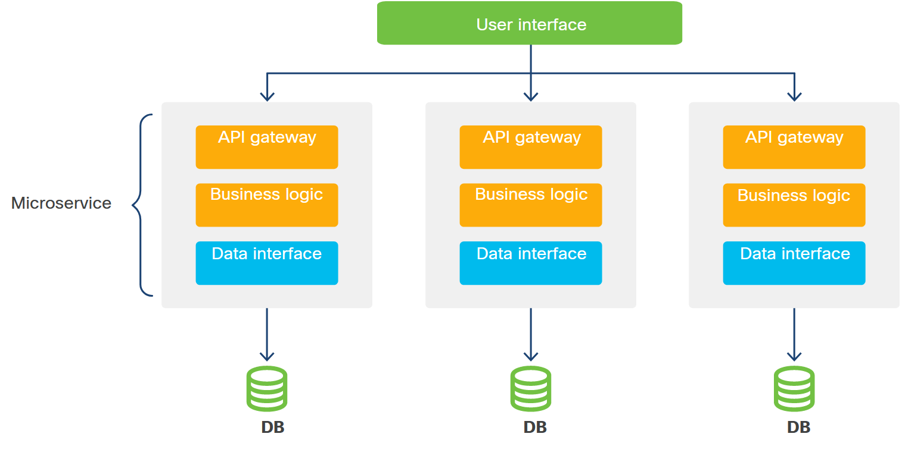

<!-- 7.1.1 -->
## Введение в автоматизацию инфраструктуры

В этом модуле вы узнаете об автоматизации. Автоматизация использует код для настройки, развертывания и управления приложениями вместе с вычислительной, хранилищем и сетевой инфраструктурой, а также службами, на которых они работают.

Инструменты в этой области включают Ansible, Puppet и Chef и многие другие. Для автоматизации с инфраструктурой Cisco платформы могут интегрироваться с этими общими инструментами или предоставлять прямой API-доступ к программируемой инфраструктуре. Будь то конфигурация кампуса/филиала, вашего собственного центра обработки данных или поставщика услуг, есть инструменты Cisco, которые делают больше, чем просто управление конфигурацией сети.

Когда вы поймете, что такое автоматизация и что она может для вас сделать, вы будете готовы посетить Cisco DevNet Automation Exchange, чтобы изучить решения, которые могут работать на вас.

<!-- 7.1.2 -->
## Решения Cisco для автоматизации

Есть несколько вариантов использования автоматизации для сети. В зависимости от операционной модели, которой вы хотите следовать, у вас есть выбор, как программно управлять конфигурациями сети и инфраструктурой. Давайте посмотрим на автоматизацию Cisco через DevNet Automation Exchange, чтобы понять уровни сложности и доступные варианты.

### Иди: автоматизация только для чтения

Используя инструменты автоматизации, вы можете собрать информацию о конфигурации вашей сети. Этот сценарий предлагает ответы на самый простой и распространенный вопрос, который вы можете задать: «Что изменилось?»

Собирая данные только для чтения, вы сводите к минимуму риск внесения изменений, которые могут нарушить работу вашей сетевой среды. Использование запросов GET - также отличный способ начать с написания кодовых решений для задач сбора данных. Кроме того, вы можете использовать сценарий чтения для аудита конфигураций и выполнить следующий естественный шаг, а именно вернуть конфигурацию в соответствие. В Automation Exchange этот переход классифицируется как прогрессия иди-беги-лети.

### Беги: активировать политики и обеспечить самообслуживание в нескольких доменах

С помощью этих сценариев автоматизации «этапа выполнения» вы можете безопасно разрешить пользователям предоставлять свои собственные сетевые обновления. Вы также можете автоматизировать рабочие процессы подключения, управлять повседневными конфигурациями сети и выполнять сценарии дня 0, дня 1 и ежедневного (день n).

### Лети: развертывание приложений, сетевых конфигураций и прочего с помощью CI/CD

Для более сложной автоматизации и программируемых примеров вам нужно перейти на этап Fly в DevNet Automation Exchange. Здесь вы можете опередить потребности, отслеживая и проактивно управляя своими пользователями и устройствами, а также получая аналитические данные с помощью данных телеметрии.

Существует множество вариантов использования автоматизации инфраструктуры, и вы можете добавить его в коллекцию в DevNet Automation Exchange.

<!-- 7.1.3 -->
## Зачем нужна автоматизация?

Предприятия конкурируют и контролируют расходы, работая быстро и имея возможность масштабировать свои операции. Скорость и гибкость позволяют бизнесу исследовать, экспериментировать и использовать возможности, опережая своих конкурентов. Операции масштабирования позволяют бизнесу эффективно захватывать долю рынка и обеспечивать соответствие мощности спросу.

Разработчикам необходимо ускорить каждый этап создания программного обеспечения: кодирование и повторение, тестирование и постановку. Практика DevOps требует от разработчиков развертывания приложений и управления ими в производственной среде, поэтому разработчики также должны автоматизировать эти действия.

Ниже приведены некоторые риски, которые могут возникнуть в средах, развертываемых вручную и управляемых вручную.

### Недостатки ручных операций

Создание простого монолитного сервера веб-приложений может занять у опытного ИТ-оператора 30 минут или больше, особенно при подготовке к производственной среде. Когда этот процесс умножается на десятки или сотни корпоративных приложений, несколько физических расположений, центров обработки данных и/или облаков; ручные процессы в какой-то момент вызовут сбой или даже отказ сети. Это увеличивает затраты и замедляет бизнес.

Ручные процессы, такие как ожидание доступности инфраструктуры, ручная настройка и развертывание приложений, а также обслуживание производственной системы, являются медленными и очень трудно масштабируемыми. Они могут помешать вашей команде предоставлять новые возможности коллегам и клиентам. Ручные процессы всегда подвержены человеческим ошибкам, а документация, предназначенная для людей, часто бывает неполной и неоднозначной, трудной для тестирования и быстро устаревает. Это затрудняет кодирование и использование с трудом добытых знаний об известных хороших конфигурациях и передовых методах работы в крупных организациях и их разрозненных инфраструктурах.

### Финансовые затраты

Сбои и нарушения чаще всего возникают из-за неправильной конфигурации систем. Часто это происходит из-за человеческой ошибки при внесении изменений вручную. Согласно часто цитируемой статистике Gartner (за 2014 год), средняя стоимость отключения IT-инфраструктуры составляет более 5600 долларов США в минуту или более 300 000 долларов США в час. Цена нарушения безопасности может быть даже больше; в худшем случае он представляет собой реальную угрозу жизни людей, собственности, деловой репутации и/или выживанию организации.

<!-- https://contenthub.netacad.com/courses/devnet/1035e850-b0bc-11ea-a04f-618a6d0a372e/103a7c30-b0bc-11ea-a04f-618a6d0a372e/assets/ddc8dc00-c0c5-11ea-a947-f5323e7496e3.png-->

### Риски зависимости

Сегодняшняя программная экосистема децентрализована. Разработчикам больше не нужно создавать монолитные полнофункциональные решения и управлять ими. Вместо этого они специализируются, создавая отдельные компоненты в соответствии со своими потребностями и интересами. Разработчики могут комбинировать и сопоставлять другие компоненты, инфраструктуру и услуги, необходимые для создания полных решений и эффективного управления ими в масштабе.

Эта современная программная экосистема объединяет работу сотен тысяч независимых участников, каждый из которых разделяет преимущества участия в этом обширном сотрудничестве. Участники могут свободно обновлять свою работу по мере необходимости и возможностей, позволяя им быстро выводить на рынок новые функции, исправлять ошибки и повышать безопасность.

Ответственные разработчики стараются предвидеть и минимизировать влияние обновлений и новых выпусков на пользователей, строго следуя стандартам, сознательно разрабатывая обратную совместимость, обязуясь обеспечить долгосрочную поддержку для ключевых версий продукта (например, «LTS»-версий Ubuntu Linux распространение) и другие передовые методы.

Эта экосистема вводит новые требования и новые риски:

* Компоненты должны иметь возможность работать вместе со многими другими компонентами во многих различных ситуациях (это называется гибко настраиваемой), не проявляя большего предпочтения для определенных сопутствующих компонентов или архитектур, чем это абсолютно необходимо (это называется неоптимизированной).
* Разработчики компонентов могут отказаться от поддержки устаревших функций и редко встречающихся интеграций. Это нарушает процессы, которые зависят от этих функций. Также сложно или невозможно полностью протестировать выпуск, учитывая каждую конфигурацию.
* Установки приложений, зависящие от зависимостей, как правило, блокируются в хрупких и все более небезопасных стеках развертывания. Они фактически превращаются в монолиты, которыми нелегко управлять, улучшать, масштабировать или переносить на новые, возможно, более экономичные инфраструктуры. Обновления и исправления могут быть отложены, потому что применять изменения рискованно, и их сложно откатить.

<!-- 7.1.4 -->
## Зачем нам нужна полная автоматизация?

### Зачем нужна полная автоматизация?

Автоматизация инфраструктуры может дать множество преимуществ. Их кратко можно охарактеризовать как скорость, повторяемость и способность работать в масштабе с уменьшенным риском.

Автоматизация - ключевой компонент функциональной программно-определяемой инфраструктуры, а также распределенных и динамических приложений. Ниже приведены дополнительные преимущества полной автоматизации.

### Самообслуживание

Автоматизированные платформы самообслуживания позволяют пользователям запрашивать инфраструктуру по запросу, в том числе:

* Стандартные компоненты инфраструктуры, такие как экземпляры баз данных и конечные точки VPN.
* Платформы для разработки и тестирования
* Защищенные веб-серверы и другие экземпляры приложений, а также изолированные сети и защищенный доступ в Интернет, что делает их полезными, безопасными и устойчивыми к ошибкам.
* Платформы аналитики, такие как Apache Hadoop, Elastic Stack, InfluxData и Splunk

### Масштабирование по запросу

Приложения и платформы должны иметь возможность увеличивать и уменьшать масштаб в соответствии с требованиями трафика и рабочей нагрузки и использовать разнородную емкость. Примером может служить пакетное масштабирование от частного к общедоступному облаку и соответствующее формирование трафика. Облачные платформы могут обеспечивать возможность автоматического масштабирования (автомасштабирования) виртуальных машин, контейнеров или рабочих нагрузок на бессерверной платформе.

### Наблюдаемость

Наблюдаемая система позволяет пользователям делать выводы о внутреннем состоянии сложной системы по ее выходным данным. Наблюдаемость (иногда сокращенно обозначаемая как o11y) может быть достигнута посредством мониторинга платформы и приложений. Наблюдаемость также может быть достигнута за счет упреждающего производственного тестирования на наличие режимов отказа и проблем с производительностью. Но в динамической операции, которая включает в себя автомасштабирование и другие варианты поведения приложения, сложность увеличивается, а объекты становятся эфемерными. В недавнем отчете поставщика инфраструктуры наблюдения DataDog говорится, что среднее время жизни контейнера при оркестровке составляет всего 12 часов; микросервисы и функции могут жить только секунды. Сделать эфемерные объекты наблюдаемыми и протестировать в продакшене возможно только с помощью автоматизации.

### Автоматизированное устранение проблем

Некоторые производители программного обеспечения и эксперты по наблюдениям рекомендуют так называемую Chaos Engineering. Эта философия основана на утверждении, что отказ - это нормально: по мере масштабирования приложения некоторые части всегда выходят из строя. По этой причине приложения и платформы должны быть разработаны так, чтобы:

* Сведите к минимуму последствия проблем: быстро выявляйте проблемы и направляйте трафик на альтернативную пропускную способность, гарантируя, что конечные пользователи не будут серьезно затронуты и что дежурный оперативный персонал не будет без надобности вызван на страницы.
* Самовосстановление: распределение ресурсов в соответствии с политикой и автоматическое повторное развертывание отказавших компонентов по мере необходимости, чтобы вернуть приложение в работоспособное состояние в текущих условиях.
* Отслеживайте события: запомните все, что привело к инциденту, чтобы можно было запланировать исправления и выполнить вскрытие.

Некоторые сторонники Chaos Engineering даже выступают за использование средств автоматизации для создания контролируемых (или случайных) отказов в производственных системах. Это постоянно заставляет разработчиков и сотрудников предвидеть проблемы и повышать устойчивость и способность к самовосстановлению. Проекты с открытым исходным кодом, такие как Chaos Monkey и платформы «Отказ как услуга», такие как Gremlin, специально созданы для взлома вещей, как случайным, так и более контролируемым и эмпирическим способом. Возникающая дисциплина называется «испытание с применением отказов».

<!-- 7.1.5 -->
## Программно-определяемая инфраструктура: аргументы в пользу автоматизации

Программно-определяемая инфраструктура, также известная как облачные вычисления, позволяет разработчикам и операторам использовать программное обеспечение для запроса, настройки, развертывания и управления «голыми» и виртуализированными вычислительными ресурсами, хранилищами и сетевыми ресурсами.

* Облачные вычисления также позволяют использовать более абстрактные платформы и службы, такие как «База данных как услуга» (DaaS), «Платформа как услуга» (PaaS), бессерверные вычисления, оркестровка контейнеров и другие.
* Частные облака позволяют предприятиям более эффективно использовать дорогое локальное оборудование.
* Публичные и размещенные частные облака позволяют предприятиям арендовать мощности по мере необходимости, позволяя им двигаться и расти (или сокращаться) быстрее, упрощая планирование и избегая инвестиций в основной капитал.

### Преимущества облачных парадигм

* **Самообслуживание (платформы по запросу)** - Облачные ресурсы могут быть доступны в течение нескольких часов или минут после того, как они понадобятся. Таким образом ускоряются все этапы разработки и обеспечивается быстрое масштабирование производственных мощностей. Приложения можно масштабировать в общедоступном облачном регионе, наборе услуг или у поставщика, что является наиболее экономичным.
* **Точная спецификация, согласованность, повторяемость** - Разработчики могут собирать и стандартизировать уникальные конфигурации, поддерживая согласованность конфигураций платформ посредством разработки, тестирования, промежуточного и производственного этапов. Развертывание заведомо исправного приложения и конфигурации предотвращает ошибки, которые могут быть внесены при изменении конфигурации платформы вручную.
* **Абстракция платформы** - Контейнерные технологии абстрагируют приложения и платформы друг от друга, инкапсулируя зависимости приложений и позволяя вашему контейнерному приложению работать в общей среде хоста.

### Вызовы облачных парадигм

Разработчики должны уделять пристальное внимание дизайну, архитектуре и безопасности платформы. Облачные среды предъявляют новые требования к приложениям. Фреймворки общедоступного или частного облака имеют разные пользовательские интерфейсы, API-интерфейсы и особенности. Это означает, что пользователи не всегда могут обращаться с облачными ресурсами как с предметами потребления, которыми они действительно должны быть, особенно при попытке управлять облаками вручную.

Контроль доступа имеет решающее значение, потому что облачные пользователи с неправильными разрешениями могут нанести большой ущерб активам своей организации. Разрешениями в облаке также может быть сложно управлять, особенно в сценариях с ручным управлением.

Когда облачные ресурсы можно быстро самообслуживать с помощью ручных операций, трудно управлять потреблением, а затраты сложно подсчитать. Частные облака требуют частого аудита и процедур для удаления неиспользуемой виртуальной инфраструктуры. Пользователи общедоступного облака могут быть удивлены неожиданными расходами, когда ресурсы с оплатой по факту прекращаются, но не уничтожаются.

Многие из этих проблем можно решить с помощью автоматизации.

<!-- 7.1.6 -->
## Распределенные и динамические приложения: еще один случай автоматизации

Крупномасштабным корпоративным и общедоступным приложениям может потребоваться управление большими и переменными нагрузками трафика, вычислений и хранилищ.

* Приложения должны обеспечивать удобство работы своих пользователей.
* Они должны быть устойчивыми, высокодоступными, защищать целостность и безопасность пользовательских данных и соответствовать местным нормам в отношении того, где и как хранятся данные.
* Им необходимо эффективно расти (и сокращаться) для удовлетворения потребностей бизнеса, использования тенденций и рентабельности.

Односерверные «монолитные» архитектуры приложений, хотя и просты в концептуальном плане, не очень хорошо удовлетворяют эти потребности. Один сервер представляет собой единую точку отказа, ограничивает производительность и емкость и имеет ограниченные возможности обновления. Дублирование одного сервера может увеличить емкость для очень простых приложений, но не работает для приложений, требующих согласованности данных во всех экземплярах. И он не защитит пользовательские данные в случае сбоя на сервере, на котором находятся их данные.

По этим и другим причинам современные архитектуры приложений получают все большее распространение. Они состоят из небольших и относительно легких компонентов, которые иногда называют микросервисами. Эти компоненты могут быть изолированы в контейнерах, подключены через службы обнаружения и обмена сообщениями (которые абстрагируются от сетевых подключений) и поддерживаться гибкими масштабируемыми базами данных (которые поддерживают состояние).

<!-- /courses/devnet/1035e850-b0bc-11ea-a04f-618a6d0a372e/103a7c30-b0bc-11ea-a04f-618a6d0a372e/assets/ddc90310-c0c5-11ea-a947-f5323e7496e3.svg -->

Монолитные приложения можно масштабировать только путем дублирования всего приложения на дополнительных машинах.

Приложения на основе микросервисов могут (теоретически) масштабироваться от услуги к услуге, если это необходимо для удовлетворения требований трафика или производительности. Эта архитектура помогает получить максимальную выгоду от гиперконвергентной инфраструктуры, которая обеспечивает точную настройку вычислений, хранилищ, сетевых подключений и служб в соответствии с требованиями динамической нагрузки приложений.

### Приложения на основе микросервисов

<!-- /courses/devnet/1035e850-b0bc-11ea-a04f-618a6d0a372e/103a7c30-b0bc-11ea-a04f-618a6d0a372e/assets/ddc90311-c0c5-11ea-a947-f5323e7496e3.svg -->
### Преимущества микросервисов

* **Масштабируемость** - Микросервисы можно масштабировать и балансировать нагрузку по мере необходимости на многих сетевых серверах или даже в нескольких географически разделенных центрах обработки данных или общедоступных облачных регионах. Это устраняет единые точки отказа и обеспечивает столько ресурсов для каждого конкретного типа задач, сколько требуют условия, везде, где это необходимо, устраняя перегрузку.
* **Инструменты автоматизации инфраструктуры** - Все в большей степени динамизм приложений на основе микросервисов обеспечивается инфраструктурой. Эти контейнерные «оркестраторы», такие как Kubernetes или Mesos, автоматизируют масштабирование по запросу, самовосстановление и многое другое.

### Проблемы микросервисов

* **Повышенная сложность** - Микросервисы означают, что необходимо настроить и развернуть множество движущихся частей. Есть более сложные операции, включая масштабирование по требованию, самовосстановление и другие функции.
* **Автоматизация - это требование** - Ручные методы не могут реально справиться со сложностью развертывания и управления динамическими приложениями и их платформами-оркестраторами, с их высокоскоростными автономными операциями и их временными и эфемерными частями.

<!-- 7.1.7 -->
## Сводка по автоматизации инфраструктуры

Эти деловые и технические потребности, тенденции и динамика побуждают разработчиков и операторов использовать автоматизацию повсюду для решения следующих задач:

* Управляйте всеми этапами создания, настройки, развертывания и жизненного цикла приложений. Это включает в себя кодирование, тестирование, постановку и производство.
* Управляйте программно-определяемыми инфраструктурами от имени создаваемых вами приложений.
* Наряду с вашими приложениями для сохранения, обновления и постоянного улучшения кода автоматизации. Этот код помогает вам разрабатывать, тестировать, настраивать, отслеживать и управлять нашими приложениями в производственных масштабах и в различных средах. Вы можете все чаще рассматривать весь этот код как один рабочий продукт.
