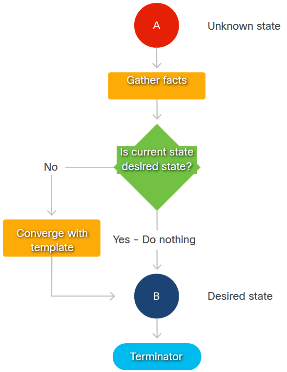
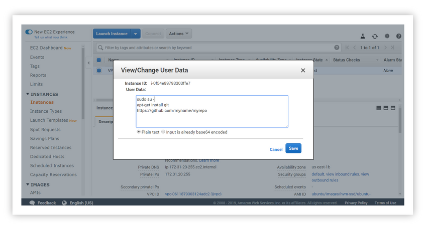

<!-- 7.3.1 -->
## Введение в базовые сценарии автоматизации

Мощные инструменты автоматизации, такие как Ansible, Puppet и Chef, привносят в работу DevOps простоту использования, предсказуемость, дисциплину и возможность масштабной работы. Но это не означает, что вы не можете выполнить некоторую автоматизацию с помощью более простых инструментов, таких как Bash и Python. Инструменты автоматизации частично работают, обертывая функциональность оболочки, служебные программы операционной системы, функции API и другие элементы плоскости управления для простоты, единообразия, расширения возможностей и совместимости в сценариях DevOps. Но инструменты по-прежнему не решают всех проблем развертывания и настройки.

Вот почему каждый инструмент автоматизации имеет одну или несколько функций, которые выполняют базовые команды и сценарии для целей и возвращают результаты. Например, в Ansible эти функции включают `command`, `shell`, а также `raw`.

Иногда бывает быстрее и проще использовать команды оболочки или сценарии. Часто это связано с тем, что многие реализации инструментов начинаются с перевода автоматизации, изначально написанной на Bash, Python или других языках, и вы хотите быстро и точно передать эту функциональность в инструмент перед переносом и рефакторингом.

Таким образом, редко можно глубоко заглянуть в поддерживаемые инструментами репозитории инфраструктуры как кода, не обнаружив каких-либо сценариев. Поэтому важно иметь эти навыки!

<!-- 7.3.2 -->
## Основные инструменты для сценариев автоматизации

Оболочки распространены повсеместно, поэтому создание сценариев оболочки исторически является основой автоматизации.

### Bash

В Linux (и других операционных системах) оболочка взаимодействует с интерактивным вводом-выводом, файловой системой и межпроцессным взаимодействием. Это дает возможность выдавать команды, обеспечивает ввод для обработки и передачу выходных данных в цепочки мощных утилит.

Оболочка Bourne Again Shell (BASH) используется по умолчанию в большинстве дистрибутивов Linux. Из-за его повсеместного распространения термины «Bash» и «оболочка» обычно используются как синонимы.

Использование команд в сценарии Bash во многом аналогично их использованию непосредственно из командной строки. Самая простая разработка сценария может заключаться просто в копировании выражений командной строки в файл после тестирования команд интерфейса командной строки, чтобы убедиться, что они работают.

Напротив, Python или другой сложный высокоуровневый язык для простой процедурной автоматизации обычно более сложен и может оказаться бесполезным для простых проектов.

### Языки программирования за пределами Bash

Сложные языки улучшают Bash, когда возрастают требования к сложности и масштабу. Они особенно полезны при создании и эксплуатации виртуализированной инфраструктуры в облачных средах с использованием таких SDK, как AWS SDK для Python или AWS SDK для javascript в Node.js. Хотя Bash можно использовать для доступа к AWS CLI по сценарию, вы можете использовать встроенные функции и библиотеки более сложных языков для анализа сложных возвращаемых наборов данных (например, JSON), управления множеством параллельных операций, обработки ошибок, обработки асинхронных ответов на команды и многое другое.

Для разработки и выполнения сценариев на желаемом языке вам может потребоваться установить и настроить этот язык в вашей системе разработки и на любых удаленных целевых машинах. Для доступа к служебным функциям системного уровня может потребоваться вызов библиотек (таких как библиотека на Python `os`), а затем заключить команды Bash CLI в дополнительный синтаксис для выполнения. Вам также необходимо обрабатывать коды возврата, тайм-ауты и другие условия в предпочитаемой вами языковой среде.

<!-- 7.3.3 -->
## Процедурная автоматизация

Использование Bash, Python или других традиционных языков для автоматизации обычно означает написание императивной процедуры. Императивная процедура - это упорядоченная последовательность команд, направленных на достижение цели. Последовательность может включать в себя управление потоком, условия, функциональную структуру, классы и многое другое.

Такая процедурная автоматизация может быть очень мощной. Но это останется простым только в том случае, если вы знаете, как работают системные утилиты, CLI/SDK и другие интерфейсы. Вы также должны знать о состоянии целевой системы.

### Разработка процедуры

Как вы знаете, если вы напишете небольшой скрипт для установки и настройки программного обеспечения в удаленной целевой системе, он может нормально работать с первого раза. Однако запустите его второй раз; и ваш простой сценарий может навести беспорядок. Он может выдать ошибку и остановиться, когда обнаружит, что приложение уже установлено, или, что еще хуже, проигнорирует такую ошибку и продолжит вносить избыточные изменения в файлы конфигурации.

Чтобы сделать этот сценарий более безопасным, простым в использовании, более гибким и многоразовым, вам необходимо сделать его более умным и продуманным. Например, вы можете улучшить его до:

* Определите, работает ли он в среде Debian или CentOS, и используйте правильный менеджер пакетов (apt  или yum) и синтаксис.
* Определите, установлено ли уже ваше целевое приложение в соответствующей версии, и попробуйте установить его только в том случае, если его нет, в противном случае остановитесь и не вносите дальнейших изменений.
* Определите, сделал ли он копию каждого файла конфигурации перед его изменением, и используйте потоковые редакторы (awk, sedи т. д.), чтобы внести точные изменения, вместо того, чтобы небрежно добавлять текст в файлы конфигурации, и надеяться, что приложения, которые используют эти файлы, не сломаются.

По мере дальнейшей разработки и уточнения сценариев вы захотите, чтобы они выполняли некоторые из следующих задач:

* Обнаруживайте, инвентаризуйте и компилируйте информацию о целевых системах и убедитесь, что сценарии делают это по умолчанию.
* Инкапсулируйте сложность безопасной установки приложений. Создавайте резервные копии и изменения файлов конфигурации, а также перезапускайте службы в повторно используемых формах, таких как вспомогательные сценарии, содержащие параметры, библиотеки функций и другую информацию.

Чтобы скрипты были эффективными и могли использоваться повторно, вы должны:

* Стандартизируйте порядок и представление параметров, флагов и ошибок.
* Создайте иерархию кода, которая логически и эффективно разделяет задачи.
* Создавайте сценарии высокого уровня для всего развертывания и сценарии более низкого уровня для этапов развертывания.
* Отделите данные, относящиеся к развертыванию, от кода, сделав код максимально универсальным и пригодным для повторного использования.

<!-- /courses/devnet/1035e850-b0bc-11ea-a04f-618a6d0a372e/10450380-b0bc-11ea-a04f-618a6d0a372e/assets/ddc90313-c0c5-11ea-a947-f5323e7496e3.svg -->

Этот тип сценариев имеет тенденцию быть опасным, если начальное состояние не полностью известно и не контролируется. Повторное применение тех же изменений к правильно настроенной системе может даже сломать ее.

### Идемпотентность: повторяющаяся тема автоматизации

В конечном итоге цель практически любого сценария - достичь желаемого состояния в системе, независимо от начальных условий. Тщательно написанные процедурные сценарии и инструменты декларативной конфигурации проверяют цели перед выполнением над ними задач, выполняя только те задачи, которые необходимы для достижения желаемого состояния.

Это качество программного обеспечения называется идемпотентностью. Есть несколько основных принципов идемпотентности, которым нужно следовать:

* **Убедитесь, что изменение, которое вы хотите внести, еще не было сделано** - Также известен как «Во-первых, не навреди». Ничего не делать почти всегда лучше, чем делать что-то неправильно и, возможно, неисправимо.
* **Перед внесением изменений, если возможно, приведите к заведомо исправному состоянию** - Например, вам может потребоваться удалить и очистить более ранние версии приложений перед установкой более поздних версий. В производственной инфраструктуре кода этот принцип становится основой неизменности. Неизменяемость - это идея, что в действующие системы никогда не вносятся изменения. Вместо этого измените автоматизацию и используйте ее для создания совершенно новых, заведомо хороших компонентов с нуля.
* **Тест на идемпотентность** - Тщательно относитесь к автоматизации зданий без побочных эффектов.
* **Все компоненты процедуры должны быть идемпотентными** - Только если известно, что все компоненты процедуры являются идемпотентными, эта процедура в целом может быть идемпотентной.

<!-- /courses/devnet/1035e850-b0bc-11ea-a04f-618a6d0a372e/10450380-b0bc-11ea-a04f-618a6d0a372e/assets/ddc90314-c0c5-11ea-a947-f5323e7496e3.svg -->

<!-- 7.3.4 -->
## Выполнение сценариев локально и удаленно

Чтобы настроить удаленные системы, вам необходимо получить доступ и выполнить на них скрипты. Для этого есть много способов:

* Вы можете хранить сценарии локально, передавать их на целевые машины с помощью служебной программы оболочки, например `scp`, затем войдите на удаленный компьютер, используя `ssh` и казни их.
* Вы можете передать скрипты на удаленный компьютер, используя `cat | ssh` и выполнять их последовательно с другими командами, собирая и возвращая результаты на ваш терминал, все в одной команде.
* Вы можете установить универсальный клиент безопасной передачи файлов, такой как SFTP, затем использовать эту утилиту для подключения к удаленному компьютеру, переноса, установки соответствующих разрешений и выполнения файла сценария.
* Вы можете хранить сценарии на веб-сервере, входить на удаленный компьютер и получать их с помощью `wget`, `curl`, или другие утилиты, либо сохраните скрипты в репозитории Git. Устанавливаем git на удаленный компьютер, клонируем на него репозиторий, проверяем ветку и выполняем найденные там скрипты.
* Вы можете установить полное решение для удаленных операций, такое как VNC или NoMachine, локально, установить его сервер на целевом сервере (обычно для этого также требуется установка графической среды рабочего стола), передавать/копировать и затем выполнять сценарии.
* Если ваши целевые устройства подготовлены в облачной среде, обычно есть способ внедрить сценарий конфигурации с помощью той же команды CLI или действия WebUI, которое проявляет платформу.

<!-- https://contenthub.netacad.com/courses/devnet/1035e850-b0bc-11ea-a04f-618a6d0a372e/10450380-b0bc-11ea-a04f-618a6d0a372e/assets/ddc90315-c0c5-11ea-a947-f5323e7496e3.png -->

Большинство общедоступных облачных сервисов позволяют внедрять сценарии конфигурации непосредственно в экземпляры виртуальных машин для выполнения во время загрузки.

Почти каждый разработчик в конечном итоге будет использовать эти и другие методы в тот или иной момент, в зависимости от задачи (задач), ограничений среды, доступа к Интернету и других ограничений безопасности, а также политики организации.

Понимание этих методов и их применение на практике важно, потому что процедурная автоматизация определенных ручных процессов все еще может быть полезной, даже при использовании расширенных инструментов развертывания для большинства задач DevOps. Чтобы быть ясным, это не лучшая практика, но состояние инструментов еще не является совершенным или достаточно всеобъемлющим, чтобы решить все проблемы, с которыми вы можете столкнуться.

<!-- 7.3.5 -->
## Облачная автоматизация

Инфраструктура облачных вычислений «Инфраструктура как услуга» (IaaS) является типичной целью для автоматизации. Автоматизация облака позволяет вам предоставлять виртуализированные хосты, настраивать виртуальные сети и другие возможности подключения, запрашивать услуги, а затем развертывать приложения в этой инфраструктуре.

Облачные провайдеры и сообщества с открытым исходным кодом часто предоставляют специализированные подсистемы для популярных инструментов развертывания. Эти подсистемы извлекают полную инвентаризацию ресурсов из облачной инфраструктуры и обновляют ее в реальном времени, пока автоматизация вносит изменения, что позволяет вам более легко писать автоматизацию для управления этими ресурсами.

Вы также можете управлять облачными ресурсами с помощью скриптов, написанных на Bash, Python или других языках. Таким сценариям помогают многие инструменты, упрощающие доступ к целям автоматизации. Это включает:

* Интерфейсы командной строки и SDK, которые охватывают REST и другие интерфейсы оборудования, объектов виртуальной инфраструктуры, плоскостей управления более высокого порядка и облачных API. Это делает их функции доступными из оболочек (и через сценарии Bash) и в программах Python.
* Инструменты командной строки и встроенные синтаксические анализаторы Python могут анализировать вывод JSON и YAML, возвращаемый интерфейсами командной строки и SDK, в красивые, удобные для чтения форматы и в собственные структуры данных Python для упрощения манипуляций.

<!-- 7.3.6 -->
## Cloud CLI и SDK

IaaS и другие типы облачной инфраструктуры также предоставляют интерфейсы командной строки и SDK, которые позволяют легко подключаться к их базовым интерфейсам, которые обычно основаны на REST.

### Cisco UCS - облако на голом железе

Если вы знакомы с продуктами Cisco Compute, включая Unified Computing System (UCS), Hyperflex, UCS Manager и систему управления инфраструктурой Intersight, вы знаете, что они фактически являются шлюзом к глобальному SaaS-управлению инфраструктурой UCS/Hyperflex организации.

Основным API Cisco для этой инфраструктуры является API-интерфейс Cisco Intersight RESTful. Это API-интерфейс, совместимый с OpenAPI, который можно запросить с помощью Swagger и других инструментов OpenAPI с открытым исходным кодом. Они позволяют создавать специализированные SDK для произвольных языков и сред и упрощают задачу документирования API (и поддержки SDK).

Cisco предоставляет и поддерживает ряд SDK для Intersight RESTful API, в том числе для Python и Microsoft PowerShell. Они также предоставляют ряд модулей Ansible.

### VMware

Основным интерфейсом командной строки VMware теперь является интерфейс командной строки Datacenter, который обеспечивает работу vCenter Server API и VMware Cloud on AWS из командной строки. Он написан на Python и работает в Linux, Mac и Windows.

VMware также предоставляет vSphere CLI для Linux и Windows, который позволяет управлять хостами виртуализации ESXi, серверами vCenter и предлагает подмножество команд DCLI. Он также предлагает PowerCLI для Windows PowerShell, который предоставляет командлеты для vSphere, vCloud, vRealize Operations Manager, vSAN, NSX-T, VMware Cloud on AWS, VMware HCX, VMware Site Recovery Manager и сред VMware Horizon.

VMware также предлагает множество SDK для популярных языков (включая Python), предназначенных для vSphere Automation, vCloud Suite, vSAN и других продуктов.

### OpenStack

Проект OpenStack предоставляет клиент OpenStack (OSC), написанный на Python. OSC позволяет получить доступ к API OpenStack Compute, Identity, Image, Object Storage и Block Storage.

При установке клиентов командной строки также устанавливается комплект OpenStack Python SDK, позволяющий использовать множество команд OpenStack в Python.

Наборы инструментов OpenStack также доступны для многих других популярных языков.

<!-- 7.3.7 -->
## Обзор базовых сценариев автоматизации

### Резюме

Отлично иметь в своем наборе инструментов базовые методы создания сценариев автоматизации, и их понимание улучшит ваше предприятие как оператора и пользователя зрелых платформ автоматизации.
