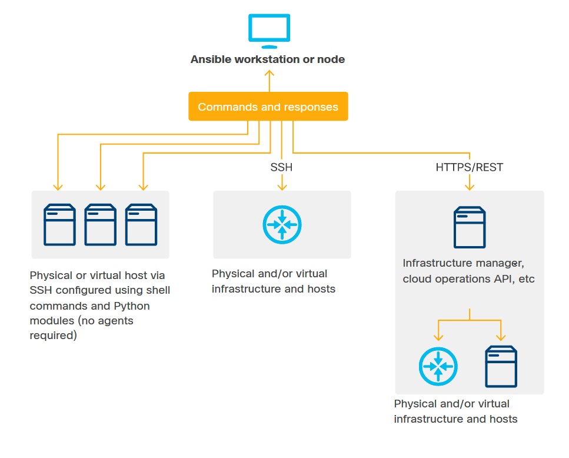
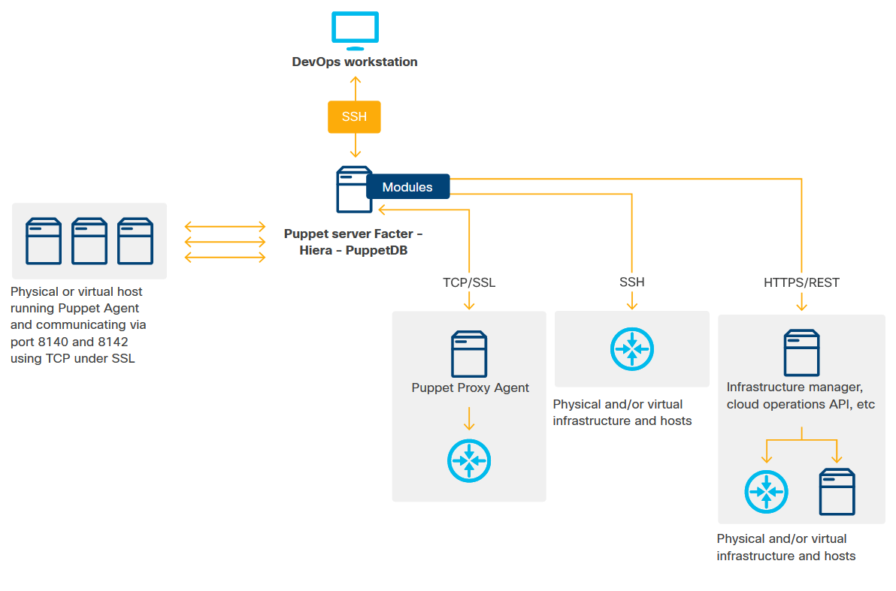
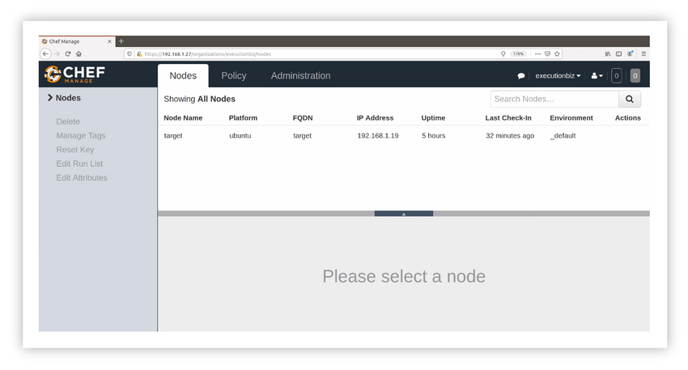

<!-- 7.4.1 -->
## Введение в инструменты автоматизации

В этом разделе вы узнаете о трех самых популярных инструментах автоматизации: Ansible, Puppet и Chef.

У вас также будет возможность установить один или все из них на вашей локальной рабочей станции. Если вы хотите попробовать это, убедитесь, что у вас есть доступ к рабочей станции на базе Linux, такой как Ubuntu или macOS.

Вы всегда должны обращаться к собственной документации по установке инструмента для вашей операционной системы.

<!-- 7.4.2 -->
## Что для нас делают инструменты автоматизации?

### Что для нас делают инструменты автоматизации?

Такие инструменты автоматизации, как Ansible, Puppet или Chef, предлагают мощные возможности по сравнению со специальными стратегиями автоматизации с использованием BASH, Python или других языков программирования.

### Упростите и стандартизируйте

Инструменты автоматизации «обертывают» служебные программы операционной системы и функции API для упрощения и стандартизации доступа. Часто они также устанавливают интеллектуальные параметры по умолчанию, которые ускоряют разработку и тестирование кода. Они делают программный код менее подробным и более понятным, чем скрипты.

Вы по-прежнему можете получить доступ к более глубоким базовым функциям с помощью встроенного доступа к оболочке, который позволяет вам запускать «сырые» команды оболочки, внедрять оболочку и другие сценарии в удаленные системы для обеспечения тонкой настройки. Вы можете повторно использовать устаревший код конфигурации и добавлять функциональные возможности в сам инструмент, составляя модули и плагины на таких языках, как Python или Ruby.

Модули инструментов автоматизации позволяют использовать передовые методы, которые делают код более безопасным и упрощают достижение идемпотентности. Например, многие функции Ansible могут создавать резервные копии файлов конфигурации в целевых системах или извлекать копии и сохранять их локально на машине развертывания перед внесением изменений. Это помогает включить восстановление, если развертывание прерывается или прерывается.

### Ускорьте разработку с помощью готовых функций

Инструменты автоматизации обычно предоставляют очень мощные функции для ускорения разработки. Например, по умолчанию Ansible 2.4+ предоставляет функциональные возможности, которые позволяют легко получать снимки конфигурации из сетевых структур Cisco ACI. Он также имеет дополнительные функции, которые помогут вам выполнить откат конфигураций ACI к предыдущему состоянию моментального снимка.

### Облегчение повторного использования, разделение проблем, повышение безопасности

Современные средства автоматизации стремятся быть «управляемыми данными» и позволяют:

* Составление определений переменных
* Инвентаризация серверов в виде структурированных данных и других деталей отдельно от общего кода
* Упорядоченный означает вставку значений переменных в код, шаблоны файлов конфигурации и другие места назначения во время выполнения.

Например, Ansible Vault поддерживает сложные функции для шифрования конфиденциальных файлов и переменных, безопасного редактирования зашифрованного содержимого файлов и многого другого.

### Выполнять обнаружение и управлять инвентаризацией

Инструменты автоматизации обычно собирают информацию с целевых устройств по умолчанию в ходе нормальной работы. Эта информация включает конфигурацию оборудования, настройки BIOS, операционную систему, конфигурацию сетевых и других периферийных плат и подсистем, установленные приложения и другие детали.

Некоторые инструменты, такие как Cisco ACI, также могут собирать сведения о конфигурации с отдельных устройств и сред виртуализации более высокого уровня. В других есть системы динамической инвентаризации, которые позволяют автоматизировать извлечение, компиляцию и обновление структур данных в реальном времени, описывающих все ресурсы, настроенные в частном или общедоступном облачном хранилище.

### Шкала рукоятки

Большинство инструментов автоматизации могут работать в локальном режиме, а также в режиме клиент/сервер или в режиме распределенного агента. Это позволяет инструменту управлять тысячами или десятками тысяч узлов.

### Вовлекайте сообщество

Самые популярные инструменты доступны в версиях ядра с открытым исходным кодом, помогая сообществу ускорить разработку, а также найти и исправить ошибки. Пользователи этих инструментов также обмениваются руководствами по развертыванию, манифестами, рецептами и т. Д. Они предназначены для использования с инструментом, могут распространяться через GitHub и другие общедоступные репозитории, а также в репозиториях, поддерживаемых поставщиком инструмента, таких как Ansible Galaxy.

<!-- 7.4.3 -->
## Критические концепции

### Идемпотентность: обзор

Идемпотентное программное обеспечение дает один и тот же желаемый результат при каждом запуске. В программном обеспечении для развертывания идемпотентность обеспечивает конвергенцию и компоновку. Компоненты идемпотентного развертывания позволяют:

* Более легко собирать компоненты в коллекции, которые создают новые виды инфраструктуры и выполняют новые операционные задачи.
* Выполняйте целые коллекции сборки/развертывания, чтобы безопасно устранять небольшие проблемы с инфраструктурой, выполнять инкрементные обновления, изменять конфигурацию или управлять масштабированием.

Например, предположим, что неправильная конфигурация оператора вызывает проблему в сложном кластере Kubernetes. Идемпотент позволяет вам отменить самое последнее изменение в коде развертывания и перестроить кластер с нуля за пять минут, будучи полностью уверенным, что у вас будет рабочий продукт.

Это основная идея инфраструктуры как кода. Идемпотентность гарантирует, что ваша кодовая база достигает желаемой цели за счет схождения последовательности зависимых целей. Таким образом, запуск вашей кодовой базы с целевой базовой инфраструктурой приведет к идемпотентному результату создания новой или пересмотренной рабочей инфраструктуры.

### Процедурная vs. декларативной

Процедурный код может достигать идемпотентности, но многие инструменты управления инфраструктурой, развертывания и оркестровки используют другой метод, который создает декларативное. Декларативная - это статическая модель, представляющая желаемый конечный продукт. Эта модель используется промежуточным программным обеспечением, которое включает детали, специфичные для развертывания, исследует текущие обстоятельства и приводит реальную инфраструктуру в соответствие с моделью, используя наименее разрушительный и обычно наименее трудоемкий путь.

В наши дни наиболее популярные инструменты автоматизации характеризуются как процедурные или декларативные. Например, Ansible и Puppet часто описываются как использующие декларативные предметно-ориентированные языки (DSL), тогда как Chef считается более процедурным по своей сути.

Это несколько искусственное различие, потому что все эти платформы (а также BASH, Python и т. д.) Являются процедурными на самом низком уровне; Ansible основан на Python, Puppet и Chef построены на Ruby. При необходимости все могут использовать как декларативные, так и процедурные методы, и многие реальные задачи автоматизации требуют обоих подходов.

```
- name: Install Apache webserver
  apt:
    name: apache2
    state: present
    update-cache: yes
```

Рисунок 1. Типичное краткое объявление Ansible, устанавливающее веб-сервер Apache на хосте Ubuntu.

В этом примере `state: present` можно заменить на `state: absent` удалить пакет, если он найден. В `update-cache: yes` настройка выполняет эквивалент `apt-get update` перед попыткой установки.

### Инициализация, конфигурация, развертывание, и оркестровка

Операторы склонны мыслить в терминах иерархии уровней инфраструктуры и связанных областей задач:

* **Подготовка** относится к получению вычислительной, хранилища и сетевой инфраструктуры (реальной или виртуальной), обеспечению связи, вводу ее в эксплуатацию и подготовке к использованию операторами и разработчиками (например, путем установки операционной системы, показателей уровня машины, ключей ssh , и самый низкий уровень операционной оснастки).
* **Конфигурация** означает установку базовых приложений и служб, а также выполнение операций, задач и тестов, необходимых для подготовки низкоуровневой платформы для развертывания приложений или платформы более высокого уровня.
* **Развертывание** включает создание, организацию, интеграцию и подготовку многокомпонентных приложений (например, кластеров баз данных) или платформ более высокого уровня (например, кластеров Kubernetes), часто на нескольких узлах.
* **Оркестровка** может относиться к нескольким вещам. Если говорить конкретно, это обычно относится к пользовательской или присущей платформе автоматизации, направленной на управление жизненными циклами рабочих нагрузок и динамическое реагирование на изменение условий (например, путем автомасштабирования или самовосстановления), особенно в контейнерных средах. В абстрактном смысле это может относиться к процессам или рабочим процессам, которые связывают задачи автоматизации для предоставления бизнес-преимуществ, например самообслуживания.

Люди, которые приходят в бизнес из отдела разработки программного обеспечения, имеют более слабое представление о том, как следует использовать эти термины. Они обычно используют термин развертывание для всего, что не является оркестровкой. Они проводят сильнейшее различие между «вещами, которые вам нужно сделать, чтобы подготовить систему к тестированию/использованию» и «настройками, которые система должна вносить автоматически или которые вас могут попросить сделать для этого».

Люди также используют фразу «управление конфигурацией» при описании инструментов автоматизации ИТ в целом. Это может означать одно из двух:

* Расширяется представление о «настройке» как об установке приложений и сервисов.
* Различие между конфигурацией и кодированием: домены, в которых статические описания могут аккуратно представлять рабочие продукты, и домены, в которых процессы должны быть явными и предполагаться возможные побочные эффекты. Для получения дополнительной информации изучите связь между декларативной автоматизацией и функциональным/логическим программированием, а также дополнительную связь между процедурной автоматизацией и императивным программированием.

### Без сохранения состояния

Автоматизация работает лучше всего, когда приложения могут не иметь состояния. Это означает, что их повторное развертывание на месте не приведет к уничтожению или потере данных, которые нужны пользователям или операторам.

* **С сохранением состояния** - Приложение, которое сохраняет важную информацию в файлах или в базе данных в локальной файловой системе.
* **Без сохранения состояния** - Приложение, которое сохраняет свое состояние в отдельной базе данных или предоставляет службу, не требующую памяти состояния между вызовами.

Обсуждение автоматизации полного стека (инфраструктура + приложения) в этом разделе предполагает, что обсуждаемые приложения не имеют состояния и/или что вы, разработчик, выяснили, как сохранить состояние в своем приложении, чтобы ваша автоматизация могла работать без потерь.

### Примеры с сохранением состояния и без сохранения состояния


<!-- /courses/devnet/1035e850-b0bc-11ea-a04f-618a6d0a372e/104af6f0-b0bc-11ea-a04f-618a6d0a372e/assets/ddc90316-c0c5-11ea-a947-f5323e7496e3.svg -->

На этом рисунке изображены три типа приложений:

* **Без сохранения состояния / Нет состояния для хранения** - Это приложение требует только атомарного/синхронного взаимодействия между клиентом и сервером. Каждый запрос от клиента к серверу возвращает результат, полностью независимый от предыдущих и последующих запросов. Примером этого приложения является общедоступный веб-сервер, который возвращает HTML-страницу, изображение или другие данные по запросу из браузера. Приложение можно масштабировать, дублируя серверы и данные за простым балансировщиком нагрузки.
* **Без сохранения состояния / Состояние хранится в базе данных** -Состояние пользователя хранится в базе данных, доступной любому веб-серверу среднего уровня. Примером этого приложения является веб-сервер, который должен знать соответствие между идентификатором пользователя и файлом cookie пользователя. Новые веб-серверы и копии веб-сайта могут быть добавлены свободно, не прерывая текущие пользовательские сеансы и не требуя, чтобы каждый запрос от данного пользователя направлялся на конкретный сервер, который поддерживает их сеанс.
* **С сохранением состояния/Состояние хранится на сервере** - запись о состоянии пользователя должна поддерживаться в серии транзакций. Примером этого приложения является веб-сайт, требующий аутентификации. Приложению не разрешено обслуживать страницы для пользователя, который не вошел в систему. Состояние пользователя обычно сохраняется путем предоставления клиенту идентифицирующего файла cookie, который возвращается на сервер с каждым новым запросом и используется для сопоставления сохраненного там идентификатора. Это приложение нельзя масштабировать, просто добавляя серверы. Если вошедший в систему пользователь перенаправляется на сервер, который не сохранил идентификатор, соответствующий cookie пользователя, этот сервер не распознает его как вошедшего в систему и отклонит их запрос.

Приложения, которым необходимо поддерживать состояние, являются неудобными кандидатами для автоматизации полного стека, потому что состояние будет уничтожено в результате специальной перестройки их поддерживающей инфраструктуры. Их также невозможно эффективно перенести из одного пула ресурсов (например, одного набора серверов приложений или хостов) в другой.

<!-- 7.4.4 -->
## Популярные инструменты автоматизации

Первым современным инструментом автоматизации, вероятно, был Puppet, представленный в 2005 году как открытый исходный код, а затем коммерциализированный как Puppet Enterprise компанией Puppet Labs в 2011 году.

В настоящее время наиболее популярными инструментами являются Ansible, Puppet и Chef. У них есть следующие характеристики:

* Относительно легко научиться
* Доступен в версиях с открытым исходным кодом
* Плагины и адаптеры позволяют им прямо или косвенно управлять многими типами ресурсов: программно-определяемой чистой инфраструктурой (Cisco UCS, устройства Cisco), частным облаком (VMware, OpenStack) и общедоступным облаком (Amazon Web Services, Microsoft Azure, Google). Облачная платформа).

Также существует множество других решений. Поставщики частных и общедоступных облаков часто рекомендуют свои собственные инструменты для использования на своих платформах, например, проект OpenStack HEAT и AWS CloudFormation. Другие решения, многие из которых предназначены для быстрорастущего рынка оркестровки контейнеров, чистой инфраструктуры как кода и непрерывной доставки инфраструктуры + приложений, включают SaltStack и Terraform.

<!-- 7.4.5 -->
## Ansible

### Ansible

Ansible, вероятно, является наиболее популярным из существующих решений автоматизации. Он доступен как с открытым исходным кодом, так и в версии с добавленными функциями от IBM/Red Hat, которая называется Ansible Tower. Его название происходит от романов автора фантастики Урсулы К. ЛеГуин, в которых «Ansible» - это технология будущего, позволяющая мгновенно общаться на космических расстояниях.

Базовая архитектура Ansible очень проста и легка.

* Узел управления Ansible работает практически на любой машине Linux, на которой работает Python 2 или 3, включая ноутбук, виртуальную машину Linux, находящуюся на портативном компьютере любого типа, или на небольшой виртуальной машине, смежной с резидентными ресурсами облака под управлением. Все обновления системы выполняются на узле управления.
* Узел управления подключается к управляемым ресурсам через SSH. Благодаря этому соединению Ansible может:
* Запускайте команды оболочки на удаленном сервере или взаимодействуйте с удаленным маршрутизатором или другим сетевым объектом через его интерфейс REST.
* Внедрить скрипты Python в целевые объекты и удалить их после запуска.
* При необходимости установите Python на целевые машины.
* Плагины позволяют Ansible собирать факты и выполнять операции в инфраструктуре, которая не может запускать Python локально, например в интерфейсах REST облачного провайдера.

В значительной степени Ansible управляется из командной строки Bash, а код автоматизации разрабатывается и поддерживается с помощью любого стандартного текстового редактора. Atom - хороший выбор, поскольку он позволяет легко удаленно работать с кодом, хранящимся во вложенных системах каталогов.

### Архитектура Ansible 


<!-- /courses/devnet/1035e850-b0bc-11ea-a04f-618a6d0a372e/104af6f0-b0bc-11ea-a04f-618a6d0a372e/assets/ddc90317-c0c5-11ea-a947-f5323e7496e3.svg-->

### Установка Ansible

Приложение управляющего узла Ansible устанавливается на Linux-машину (часто виртуальную) из публичного репозитория пакетов. Чтобы установить Ansible на вашу рабочую станцию, обратитесь к документации по установке, соответствующей вашему устройству.

### Структура кода Ansible

В структуре кода Ansible работа разделена на YAML (`.yml`) файлы, содержащие последовательность задач, выполняемых в порядке сверху вниз. Типичная задача именует и параметризует модуль, который выполняет работу, аналогично вызову функции с параметрами.

В Ansible есть сотни встроенных модулей Python, которые охватывают функции и мета-функции уровня операционной системы. Некоторые модули вроде `raw` только одно дело; они представляют команду в строковой форме для оболочки, захватывают код возврата и любой вывод консоли и возвращают его в доступных переменных. Модуль `apt` может использоваться для установки, удаления, обновления и изменения отдельных пакетов или списков пакетов на веб-сервере Linux, на котором запущен вариант Debian Linux. Если вы хотите узнать больше, `apt` документация даст вам представление о масштабах и возможностях модулей Ansible.

### Плейбуки и роли

Плейбук Ansible (или «серия игр») может быть написана как монолитный документ с серией модульных именованных задач. Чаще разработчики строят модель сложной задачи DevOps из последовательностей задач низкоуровневого playbook (называемых «ролями»), а затем ссылаются на них в playbooks более высокого уровня, иногда добавляя дополнительные задачи на уровне playbook.

Такое разделение проблем имеет много преимуществ.

* **Ясность** - Учитывая небольшой контекст, почти любой может интерпретировать книгу действий более высокого уровня, ссылающуюся на четко названные роли.
* **Возможность повторного использования и совместного использования** - Роли могут использоваться повторно и могут быть довольно тесно связаны с особенностями инфраструктуры. Роли также могут быть разделены. Проект Ansible поддерживает репозиторий для определений ролей с открытым исходным кодом, который называется Ansible Galaxy.

### Пример сценария

В следующем примере сценария создается трехузловой кластер Kubernetes на коллекции серверов:

* Он устанавливает Python 2 на все серверы и выполняет общие шаги настройки на всех узлах с помощью роли, называемой `configure-nodes`, установка программного обеспечения Kubernetes и Docker в качестве механизма контейнера и настройка Docker для работы с Kubernetes. Фактические команды Ansible не показаны.
* Он назначает один узел как главный, устанавливает контейнерную сеть Weave (одну из многих сетевых платформ, работающих с Kubernetes) и выполняет задачи завершения.
* Он присоединяется к `k8sworker` узлов к `k8smaster` узел.
* Оператор `become: true` предоставляет Ansible root-права (через sudo) перед попыткой выполнения операции.
* Линия `gather_facts: false` в первой строфе предотвращает автоматический `system-facts` запросчик от выполнения на целевой машине до установки Python. Когда исполняются последующие строфы, по умолчанию факты компилируются автоматически.

```yaml
---
- hosts: all
  become: true
  gather_facts: False
  tasks:
  - name: install python 2
    raw: test -e /usr/bin/python || (apt -y update && apt install -y python-minimal)
- hosts: all
  become: true
  roles:
  - configure-nodes
- hosts: k8smaster
  become: true
  roles:
  - create-k8s-master
  - install-weave
  - wrapup
- hosts:
  - k8sworker1
  - k8sworker2
  become: true
  roles:
  - join-workers
...
```

### Организация проекта Ansible

Проекты Ansible обычно организованы во вложенную структуру каталогов, как показано ниже. Иерархию легко поместить под контроль версий и использовать для инфраструктуры в стиле GitOps как код. Например, обратитесь к разделу «Расположение каталогов» в документации Ansible.

### Элементы иерархии папок Ansible

Иерархия папок/файлов Ansible включает следующие основные элементы:

* **Файлы инвентаризации** - Также называется хост-файлами. Они организуют ваш инвентарь ресурсов (например, серверов) под управлением. Это позволяет вам нацелить развертывание в последовательности сред, таких как разработка, тестирование, подготовка, производство. Дополнительные сведения о файлах инвентаризации см. В разделе «Как создать инвентарь» в документации Ansible.
* **Файлы переменных** - Эти файлы описывают значения переменных, которые относятся к группам хостов и отдельным хостам.
* **Файлы библиотеки и служебных программ** - Эти необязательные файлы содержат код Python для пользовательских модулей и утилит, которые им могут потребоваться. Вы можете написать собственные модули и утилиты самостоятельно или получить их из Ansible Galaxy или других источников. Например, Ansible поставляется с большим количеством уже имеющихся модулей для управления основными функциями Cisco ACI, но также предоставляет учебные пособия о том, как составлять дополнительные настраиваемые модули для функций ACI, которые в настоящее время не охвачены.
* **Основные файлы playbook** - Написанные на YAML, эти файлы могут ссылаться друг на друга или на роли более низкого уровня.
* **Папки и файлы ролей** - Каждое дерево папок ролей объединяет ресурсы, которые вместе позволяют выполнять этап подробной настройки. Папка ролей содержит `/tasks` папка с `main.yml` файл задач. Он также содержит папку асинхронных `handler` файлы задач. Дополнительные сведения о ролях см. в разделе «Роли» документации Ansible.

### Ansible в масштабе

Узел управления Ansible спроектирован так, чтобы располагаться рядом с инфраструктурой, которой он управляет. Например, он может находиться на виртуальной машине или в контейнере, работающем в той же подсети, что и управляемые ресурсы. Предприятия и организации с множеством хостов под управлением, как правило, используют множество узлов управления Ansible, распределяя их по пулам инфраструктуры по мере необходимости.

Если вы не выполняете быструю непрерывную доставку, узлы Ansible даже не нужно обслуживать между развертываниями. Если ваш код развертывания Ansible хранится в системе контроля версий, узлы управления можно запускать или создавать с нуля по мере необходимости.

Для крупных организаций существуют проблемы масштабирования, такие как гибкое и безопасное управление и контроль доступа ко многим узлам Ansible. Это также включает в себя плавное и безопасное управление удаленными контроллерами с помощью централизованной автоматизации предприятия. Для этого есть два решения уровня управления:

* Коммерческий продукт Red Hat Ansible Tower предоставляет сложный веб-интерфейс, REST API и богатые возможности управления доступом на основе ролей.
* Альтернатива с открытым исходным кодом, сравнимая по функциям, проект AWX, в котором Ansible Tower является дистрибутивом с добавленной стоимостью. AWX, однако, представляет собой ветвь разработки, которая проходит минимальное тестирование и не предоставляется через подписанные двоичные файлы. Это может стать проблемой для многих предприятий.

Непрерывная доставка в рамках развертывания Ansible может выполняться с помощью любого универсального средства автоматизации CI/CD, такого как Jenkins или Spinnaker. В более крупных и сложных проектах часто используется структура шлюза с открытым исходным кодом Zuul, первоначально разработанная OpenStack Project и выделившаяся независимо в 2018 году. Проект AWX, среди многих других, является проектом с закрытым кодом Zuul.

Для крупномасштабных реализаций Ansible также будет полезна встроенная функция Ansible Vault, которая позволяет шифровать пароли и другую конфиденциальную информацию. Это простая и легко управляемая альтернатива хранению конфиденциальной информации в сценариях, ролях или где-либо еще в виде открытого текста.

### Ресурсы Cisco Ansible

Cisco и сообщество Ansible поддерживают обширные библиотеки модулей Ansible для автоматизации вычислительного и сетевого оборудования Cisco, включая:

* Очень большой набор встроенных модулей для настройки фабрик инфраструктуры Cisco, ориентированной на приложения, через контроллер инфраструктуры политики приложений (APIC). Эти модули выполняются на хосте Ansible (а не на контроллере), взаимодействуя через интерфейс REST контроллера.
* Удаленное управление сетевыми устройствами Cisco под управлением IOS-XR, а также модули для отправки команд и получения результатов с этих устройств через интерфейс командной строки или через стандартный интерфейс NETCONF REST.
* Модули Ansible для настройки инфраструктуры Cisco UCS через интерфейс Intersight REST.

<!-- 7.4.6 -->
## Пример Ansible

Это упражнение позволит вам просмотреть структуру простой книги воспроизведения Ansible, которая извлекает информацию о контейнере, в котором находится демонстрационная среда. Обратите внимание, что Ansible обычно использует `ssh` для подключения к удаленным хостам и выполнения команд. В этом примере строка на верхнем уровне `playbook.yml` файл инструктирует Ansible запускать этот сценарий локально, не требуя `ssh`.

```
connection: local
```
Обычно Ansible используется для выполнения задач развертывания и настройки. Например, вы можете использовать его для создания простого веб-сайта на удаленном хосте. Посмотрим, как это может работать.

### Предпосылки

Вы можете выполнить это упражнение самостоятельно или просто прочитать его. Если вы хотите выполнить это упражнение, вам понадобятся:

* Целевой хост с совместимой операционной системой (например, сервер Ubuntu 18.04).
* SSH и аутентификация по ключам, настроенная на этом хосте
* Ansible установлен на вашей локальной рабочей станции

Обычно так новые виртуальные машины поставляются в частных или общедоступных облачных средах.

Для целевого хоста вы можете создать его с помощью инструмента виртуализации рабочего стола, такого как VirtualBox.

### Создание дерева файлов проекта Ansible

Для целей этого упражнения имя хоста целевой машины (разрешаемое DNS) просто `target`. Если у вас настроен и настроен собственный целевой хост, замените имя хоста при создании файлов.

Имея доступ к целевой машине по SSH, начните создавать базовую структуру папок для вашего проекта Ansible.

```
mkdir myproject
cd myproject
```

На верхнем уровне в папке вашего проекта вам понадобятся:

* Файл инвентаризации, содержащий информацию о машинах, на которых вы хотите выполнить развертывание.
* Верхний уровень `site.yml` файл, содержащий инструкции самого абстрактного уровня для выполнения вашего развертывания.
* Структура папок ролей, содержащая ваши `webserver` роль.

```
touch inventory
touch site.yml
mkdir roles
cd roles  
ansible-galaxy init webservers
```

### Создание файла инвентаря

Ваш инвентарный файл для этого проекта может быть очень простым. Сделайте это DNS-разрешаемое имя хоста вашей целевой машины:

```
[webservers]
target # can also be IP address
```

Вы определяете группу под названием `webservers` и поместив в него имя хоста (или IP) вашей целевой машины. Вы можете добавить новые имена хостов/IP-адреса в этот групповой блок или добавить дополнительные групповые блоки, чтобы назначить хосты для более сложных развертываний. Имя `webservers` совершенно произвольно. Например, если у вас есть шесть серверов, которые вы хотите настроить обычным образом, а затем вы настроите три как веб-серверы и три как серверы баз данных, ваш инвентарь может выглядеть следующим образом:

```
[webservers]
target1
target2
target3
[dbservers]
target4
target5
target6
```

На самом деле вам не нужно создавать группу `common`, потому что Ansible предоставляет средства для применения общей конфигурации ко всем серверам в инвентаризации, которые вы вскоре увидите.

### Создание файла плейбука верхнего уровня

Пособие верхнего уровня обычно описывает порядок, разрешения и другие детали, в соответствии с которыми применяются действия конфигурации нижнего уровня, определенные в ролях. Для этого примера проекта `site.yml` выглядит так:

```yaml
---
- hosts: webservers
  become: true
  roles:
  - webservers
```

`site.yml` определяет, на каких хостах вы хотите выполнить операцию и какие роли вы хотите применить к этим хостам. Линия `hosts: webservers` сообщает Ansible, что вы хотите выполнять роли как root, через sudo.

Обратите внимание, что вместо `hosts: webservers`, вы можете применить эту роль ко всем целевым хостам (что в этом случае будет работать нормально, потому что у вас только одна цель), заменив строку:

```yaml
- hosts: all
```

### Создание роли вашего веб-сервера

Следующим шагом является создание роли, которая устанавливает и настраивает ваш веб-сервер. Вы уже создали структуру папок для роли, используя `ansible-galaxy`. Код для роли обычно содержится в файле с именем `main.yml` в роли `/tasks` каталог. Вы можете редактировать `roles/webserver/tasks/main.yml` файл напрямую, чтобы он выглядел так:

```yaml
---
- name: Perform updates and install apache2
  apt:
    name: apache2
    state: present
    update_cache: yes
- name: Insert new homepage index.html
  copy:
    src: index.html
    dest: /var/www/html
    owner: myname
    mode: '0444'
```

У роли две задачи:

* Развернуть Apache2.
* Скопировать новый `index.html` файл в корень HTML Apache2, заменив значение страницы по умолчанию `index.html`.

В разделе `apt:`, вы называете пакет, его требуемое состояние и даете команду модулю apt обновить свой кеш. Перед установкой Вы выполняете `sudo apt update`.

Во втором разделе процедура копирования Ansible перемещает файл из вашей локальной системы в каталог на целевой машине, а также меняет его владельца и разрешения. Это эквивалент:

```
chown myname index.html
chmod 444 index.html
```

### Создание файла index.html

Конечно, вам нужно будет создать новый `index.html` файл. Команда Ansible copy предполагает, что такие файлы будут храниться в `/files` каталог вызывающей их роли, если не указано иное. Перейдите в этот каталог и создайте следующий `index.html` файл, сохранив после этого изменения:

```html
<html>
<head>
<title>My Website</title>
</head>
<body>
<h1>Hello!</h1>
</body>
</html>
```

### Запуск вашего развертывания

Теперь вы готовы запустить развертывание. Из каталога верхнего уровня вашего проекта вы можете сделать это с помощью оператора:

```
ansible- -i inventory -u myname -K site.yml
```

* `-i`: называет ваш файл инвентаря.
* `-u` аргумент называет вашего пользователя sudo.
* `-K` сообщает Ansible запросить у нас ваш пароль sudo, когда он начинает выполнение.
* `site.yml` это файл, который управляет вашим развертыванием.

Если все в порядке, Ansible должен запросить у нас ваш пароль BECOME (пароль sudo), а затем вернуть результаты, подобные следующим:

```
BECOME password:
PLAY [webservers] **************************************************************
TASK [Gathering Facts] *********************************************************
ok: [192.168.1.33]
TASK [webservers : Perform updates and install apache2] ****************************
changed: [192.168.1.33]
TASK [webservers : Insert new homepage index.html] *********************************
changed: [192.168.1.33]
PLAY RECAP *********************************************************************
192.168.1.33               : ok=3    changed=2    unreachable=0    failed=0    skipped=0    rescued=0    ignored=0
```

А теперь, если вы посетите IP-адрес своей целевой машины в браузере, вы должны увидеть свою новую домашнюю страницу.

Обратите внимание, что Ansible возвращает полный отчет по каждому выполнению, отмечая, был ли фактически выполнен шаг или же Ansible определил, что желаемая цель уже достигнута (в этом случае ничего не произошло, но шаг считался выполненным 'ok' .). Это пример того, как Ansible поддерживает идемпотентность. Обычно развертывание Ansible можно запускать столько раз, сколько необходимо, не переводя целевую систему в неизвестное состояние.

### Прохождение Ansible CI/CD

Давайте рассмотрим пример, как если бы они были частью конвейера CI/CD.

Разработчик, сотрудничающий с вами на GitHub, вносит изменения на веб-сайт, например, в `index.html` файл.

Затем тесты в репозитории выполняют проверки синтаксиса и работоспособности, а также правила проверки кода, например, для каждого запроса на вытягивание.

Если тесты проходят: принимает их фиксацию и уведомляет сервер CI/CD о запуске тестов.

Если тесты терпят неудачу: отклоняет их фиксацию на основании неудавшихся проверок и просит их повторно отправить.

Затем система CI/CD, такая как Jenkins, подготавливает среду и запускает предопределенные тесты для любой книги воспроизведения Ansible. Он должен каждый раз указывать ожидаемую версию и устанавливать ее. Вот пример конвейера:

```
pip install ansible==2.9.2
ansible-version
ansible-playbook main.yml --syntax-check
ansible-playbook -i staging-servers.cfg main.yml --check
ansible-playbook -i staging-servers.cfg main.yml -vvvv
```

С помощью этого конвейера вы убедитесь:

* Нет синтаксических ошибок в `main.yml`.
* Правила проверки кода соблюдаются еще до того, как код будет объединен в репозиторий.
* Все модули написаны правильно и доступны в среде с `-check` параметр.
* Есть обычная версия Ansible, например 2.9.2, потому что она установлена в среде CI.
* Playbook может работать в промежуточной среде на промежуточных серверах.
* Другие люди могут видеть, что было запущено, с помощью очень подробного параметра, `-vvvv`.

После того, как Jenkins завершит выполнение задания, вы можете получить уведомление о том, что все готово к постановке, и вы можете отправить эти изменения в производство с помощью другого конвейера, на этот раз для продвижения в производство. Это мощь контроля версий кода, Ansible и многократного продвижения через среды с использованием CI/CD.

<!-- 7.4.7 -->
## Лабораторная работа - Использование Ansible для резервного копирования и настройки устройства

В этой лабораторной работе вы изучите основы использования Ansible для автоматизации некоторых основных задач управления устройствами. Сначала вы настроите Ansible на своей виртуальной машине DEVASC. Затем вы будете использовать Ansible для подключения к CSR1000v и резервного копирования его конфигурации. Наконец, вы настроите CSR1000v с адресацией IPv6.

Вы выполните следующие задачи:

* Часть 1. Запуск виртуальных машин DEVASC и CSR1000v.
* Часть 2: настройка Ansible
* Часть 3: Использование Ansible для резервного копирования конфигурации
* Часть 4: Использование Ansible для настройки устройства

[Используйте Ansible для резервного копирования и настройки устройства](../07.04.07-lab-use-ansible-to-back-up-and-configure-a-device/README.md)

<!-- 7.4.8 -->
## Лабораторная работа - Использование Ansible для автоматизации установки веб-сервера

В этой лабораторной работе вы сначала настроите Ansible, чтобы он мог взаимодействовать с приложением веб-сервера. Затем вы создадите playbook, который автоматизирует процесс установки Apache на веб-сервере. Вы также создадите настраиваемую книгу для установки Apache с конкретными инструкциями.

Вы выполните следующие задачи:

* Часть 1. Запуск виртуальной машины DEVASC
* Часть 2: Выполните резервное копирование с помощью Ansible
* Часть 3: Настройка адресации IPv6 с помощью Ansible
* Часть 4: Используйте Ansible для установки Apache на веб-серверы
* Часть 5: Добавьте параметры в свой Ansible Playbook для веб-серверов Apache


<!-- 7.4.9 -->
## Puppet

Puppet был основан как открытый исходный код в 2005 году и коммерциализирован как Puppet Enterprise компанией Puppet Labs в 2011 году.

Архитектура ядра Puppet имеет следующие характеристики:

* Выделенный сервер для размещения основных компонентов приложения:
* Сервер Puppet (исторически называемый «Хозяин Марионеток»)
* Facter, служба сбора фактов
* PuppetDB, который может хранить факты, каталоги узлов и историю недавних событий конфигурации.
* Защищенный клиент, также известный как Puppet Agent, установлен и настроен на целевых машинах. Клиенты и сервер взаимно аутентифицируются с помощью самоподписанных сертификатов, а для транспорта используется SSL. Агенты собирают факты (под управлением службы Facter) и вносят изменения в конфигурацию в соответствии с указаниями сервера Puppet.
* Для облачных API и оборудования, на котором не может быть запущен агент, в Puppet есть модули, позволяющие включить эти подключения.
* В горизонтально масштабируемых реализациях, где под управлением находятся многие устройства, не поддерживающие агентов, Puppet позволяет прокси-агенту снимать нагрузку с работы по прямому подключению к интерфейсам командной строки устройства и обмену информацией.

Операторы общаются с Puppet Server в основном через SSH и командную строку.

Puppet Server может быть виртуальной машиной или даже контейнером Docker для небольших самообучающихся реализаций, и Puppet предоставляет для этой цели компактную установку Docker, которая называется PUPPERWARE. Стандартные пакеты доступны для создания Puppet Server в Linux, который в настоящее время является единственным вариантом для установки Сервера. Агенты Puppet (также называемые клиентами) доступны для Linux, Windows и MacOS.

### Архитектура Puppet


<!-- /courses/devnet/1035e850-b0bc-11ea-a04f-618a6d0a372e/104af6f0-b0bc-11ea-a04f-618a6d0a372e/assets/ddc90318-c0c5-11ea-a947-f5323e7496e3.svg -->

### Установка Puppet

Puppet Server требует довольно мощного оборудования (или большой виртуальной машины), а также требует установки, настройки и тестирования клиента Network Time Protocol. Вы можете найти широкий спектр сообщений в блогах об установке Puppet, но проект Puppet быстро развивается, а сторонние сообщения и статьи могут быть устаревшими или ненадежными.

Когда у вас запущен Puppet Server, вы можете начать установку Puppet Agents на хостах, которыми хотите управлять. Затем агентам потребуется `puppet.conf` файл, настроенный для связи с сервером марионеток. После запуска клиентской службы ее сертификат будет подписан сервером. Теперь Сервер сможет собирать факты от клиента и обновлять состояние клиента с любыми изменениями конфигурации.

### Структура кода Puppet

Как и Ansible, Puppet позволяет хранить компоненты проекта или дискретную конфигурацию в дереве каталогов (`/etc/puppetlabs/code/environments`). Дочерние папки создаются в соответствии с конфигурацией в `puppet.conf`, или оператором.

В качестве примера вы можете объявить `environment = production` в `puppet.conf`. Puppet создаст каталог для этой среды по умолчанию, которая будет содержать `modules` подкаталог, в котором вы можете хранить вспомогательные проекты и манифесты для вещей, которые вам нужно построить и настроить (`/etc/puppetlabs/code/environments/production/modules`).

Чтобы начать небольшой проект, вы можете создать папку внутри этого каталога, а затем в этой папке создать еще одну с именем `manifests`, где вы будете хранить файлы манифеста, объявляющие рабочие классы. Это блоки кода, описывающие операцию конфигурации. Файлы манифеста обычно заканчиваются расширением `.pp`, и написаны на декларативном языке Puppet, который похож на Ruby и был вдохновлен форматом файла конфигурации Nagios.

Подобно Ansible и другим инструментам настройки, Puppet предоставляет множество ресурсов, которые можно вызывать для определения действий конфигурации, выполняемых на хостах и подключенной инфраструктуре. Основная идея очень похожа на практику Ansible, где класс, вызывающий ресурс, будет параметризован для работы идемпотентно и будет применяться в контексте для получения одного и того же желаемого результата при каждом запуске.

Puppet поставляется со встроенным набором базовых ресурсов (шаблонов для выполнения действий конфигурации). Многие дополнительные ресурсы для выполнения всевозможных операций со всеми видами инфраструктуры можно загрузить и установить из Puppet Forge с помощью команды модуля puppet.

### Puppet в масштабе

Puppet Server является в некоторой степени монолитным, и разработчики (с открытым исходным кодом) рекомендуют монолитную установку, которые утверждают, что правильно настроенный Puppet Server может управлять "до 4000" хостов.

Первым рекомендуемым шагом для размещения большего количества хостов является создание дополнительных «мастеров компиляции», которые компилируют каталоги для клиентских агентов и помещают их за балансировщиком нагрузки для распределения работы.

Клиенты Puppet Enterprise могут еще больше увеличить емкость, заменив PuppetDB автономной настраиваемой базой данных PE-PostgreSQL. Продукт Puppet Enterprise также предлагает множество других удобств, в том числе веб-консоль, предоставляющую доступ к отчетам, журналам и возможность настройки определенных видов "укажи и щелкни".

### Ресурсы Cisco Puppet

Cisco и сообщество Puppet поддерживают обширные библиотеки модулей для автоматизации вычислительного и сетевого оборудования Cisco, включая:

* Модули Cisco IOS, позволяющие управлять инфраструктурой IOS.
* Модули Cisco UCS, позволяющие управлять UCS через UCS Manager

<!-- 7.4.10 -->
## Пример Puppet

В этом примере описывается, как установить Puppet, а затем использовать Puppet для установки Apache 2 на устройстве. Вы можете просто прочитать, чтобы лучше понять Puppet.

Это приблизительно соответствует обычному рабочему процессу для операций Puppet в автоматизированной среде клиент/сервер. Обратите внимание, что модули могут быть полностью общими и не содержать специфической для сайта информации, а затем по отдельности и повторно использоваться для настройки любого количества хостов или компонентов инфраструктуры. Поскольку модули и манифесты состоят из текстовых файлов, их можно легко скоординированно хранить в репозитории управления версиями, таком как Git.

### Установка Puppet Server

Puppet Server требует довольно мощного оборудования (или большой виртуальной машины), а также требует установки, настройки и тестирования клиента Network Time Protocol. Инструкции по установке сервера можно найти в документации Puppet.

### Установка Puppet Client

Когда у вас запущен Puppet Server, вы можете установить Puppet Agents на хост. Например, в системе Linux типа Debian вы можете установить Puppet Agent с помощью одной команды:

```
sudo apt-get install puppet-agent
```

### Изменение

После установки Puppet Agent необходимо настроить для поиска Puppet Server. Добавьте в файл следующие строки `/etc/puppet/puppet.conf`:

```
[main]
certname = puppetclient
server = puppetserver
environment = production
runinterval = 15m
```

Это сообщает Клиенту имя хоста вашего сервера (разрешается через `/etc/hosts`) и имя сертификата аутентификации, который вы создадите на следующем шаге.

Запустите службу Puppet на клиенте:

```
sudo /opt/puppetlabs/bin/puppet resource service puppet ensure=running enable=true
```

Вы должны получить ответ, подобный следующему:

```
Notice: /Service[puppet]/ensure: ensure changed 'stopped' to 'running'
service { 'puppet':
  ensure => 'running',
  enable => 'true',
}
```

Обратите внимание на декларативный метод настройки Puppet. Puppet использует себя для настройки и активации своей службы. Обратите внимание на декларативный синтаксис, похожий на Ruby.

### Подпись сертификата

Агенты Puppet Agent используют сертификаты для аутентификации на сервере перед получением своих конфигураций. Когда клиентская служба запускается в первый раз, она отправляет на назначенный ей сервер запрос на подпись сертификата, что обеспечивает связь.

На Сервере выдача `ca list` команда возвращает список ожидающих сертификатов:

```
sudo /opt/puppetlabs/bin/puppetserver ca list
```

Ответ должен быть похож на следующий:

```
Requested Certificates:
    puppetclient   (SHA256)  44:9B:9C:02:2E:B5:80:87:17:90:7E:DC:1A:01:FD:35:C7:DB:43:B6:34:6F:1F:CC:DC:C2:E9:DD:72:61:E6:B2
```

Затем вы можете подписать сертификат, разрешив управление удаленным узлом:

```
sudo /opt/puppetlabs/bin/puppetserver ca sign --certname puppetclient
```

Ответ:

```
Successfully signed certificate request for puppetclient
```

Теперь сервер и клиент надежно связаны и могут обмениваться данными. Это позволит Серверу собирать факты от Клиента и позволит вам создавать конфигурации на Сервере, которые получает клиент и использует для сведения его состояния (каждые 15 минут).

### Создание конфигурации

Как и Ansible, Puppet позволяет хранить компоненты проекта или дискретную конфигурацию в дереве каталогов:

```
/etc/puppetlabs/code/environments
```

Дочерние папки создаются в соответствии с конфигурацией в `puppet.conf` или оператором. В этом примере, объявив `environment = production` в puppet.conf Puppet уже создал каталог для этого сайта по умолчанию, содержащий `modules` подкаталог, в котором мы можем хранить вспомогательные проекты и манифесты для вещей, которые нам нужно построить и настроить.

```
/etc/puppetlabs/code/environments/production/modules
```

Теперь вы установите Apache2 на свой управляемый клиент. Операции с марионеткой обычно выполняются от имени пользователя root, поэтому временно станьте пользователем root на сервере, введя:

```
sudo su -
```
Перейдите к `/modules` папка в `/production` среда:

```
cd /etc/puppetlabs/code/environments/production/modules
```
Создайте структуру папок, содержащую `install apache` модуль:

```
mkdir -p apache2/manifests
cd apache2/manifests
```

Внутри этой папки манифестов создайте файл с именем `init.pp`, который является зарезервированным именем файла для шага инициализации в модуле:

```
class apache2 {
  package { 'apache2':
    ensure => installed,
  }
  service { 'apache2':
    ensure  => true,
    enable  => true,
    require => Package['apache2'],
  }
}
```

Определение класса упорядочивает шаги, которые мы хотим выполнить:

**Шаг 1**. Вызвать `package` ресурс для установки указанного пакета. Если вы хотите удалить пакет, вы можете изменить `ensure => installed` читать `ensure => absent`.

**Шаг 2**. Вызовите ресурс службы для запуска, если его требование (в данном случае наличие Apache2) выполнено. Дайте ему указание убедиться, что служба доступна, а затем включите автоматический перезапуск при перезагрузке сервера.

Перейдите к связанному `manifests` папка:

```
cd /etc/puppetlabs/code/environments/production/manifests
```

Создать `site.pp` файл, который вызывает модуль и применяет его к целевой машине:

```
node 'puppetclient' {
   include apache2
}
```

### Развертывание конфигурации

У вас есть два варианта развертывания завершенной конфигурации:

* Перезапуск Puppet Server теперь приведет к компиляции манифестов и предоставлению доступа к Puppet Agent на указанном устройстве. Агент извлечет и применит их, установив Apache2 со следующим циклом обновления:

```
systemctl restart puppetserver.service
```
* Для разработки и отладки вы можете вызвать Puppet Agent на целевой машине (в данном случае на нашей машине Puppet Client):

```
sudo puppet agent -t
```

* Агент немедленно опрашивает сервер, загружает его каталог (конфигурации, которые на него ссылаются) и применяет его. Результаты будут примерно такими:

```
root@target:/etc/puppetlabs/code/environments/production/manifests# puppet agent -tInfo: Using configured environment 'production'Info: Retrieving pluginfactsInfo: Retrieving pluginInfo: Retrieving localesInfo: Caching catalog for puppetagentInfo: Applying configuration version '1575907251'Notice: /Stage[main]/Apache2/Package[apache2]/ensure: createdNotice: Applied catalog in 129.88 seconds
```

После успешного развертывания приложения введите IP-адрес целевой машины в браузере. Это должно вызвать домашнюю страницу Apache2 по умолчанию.

<!-- 7.4.11 -->
## Chef

### Chef

Chef предоставляет полную систему для обработки инфраструктуры как кода. Продукты Chef частично лицензированы, но бесплатны для личного использования (в случае Chef Infra Server для менее 25 управляемых узлов).

Продукты и решения Chef обеспечивают создание, тестирование, организацию инфраструктуры как кода, хранение репозитория и выполнение на удаленных объектах либо с автономной рабочей станции Chef, либо косвенно с центрального сервера Chef Infra Server. Вы должны знать об основных компонентах Chef:

* **Рабочее место Chef** - Автономное рабочее место оператора, которое может быть всем, что нужно для небольших операций.
* **Chef Infra Client (хост-агент)** - Клиенты Chef Infra запускаются на хостах и получают шаблоны конфигурации и вносят необходимые изменения. Кулинарные книги (и прокси-клиенты) позволяют контролировать оборудование и ресурсы, которые не могут запускать Chef Infra Client локально (например, сетевые устройства).
* **Chef Infra Server** - Отвечает на запросы от Chef Infra Agents на проверенных узлах и отвечает обновлениями конфигурации, после чего агенты объединяют конфигурацию узла.

Большинство задач настройки также можно выполнять напрямую между Chef Workstation и управляемыми узлами и устройствами.


<!-- /courses/devnet/1035e850-b0bc-11ea-a04f-618a6d0a372e/104af6f0-b0bc-11ea-a04f-618a6d0a372e/assets/ddc90319-c0c5-11ea-a947-f5323e7496e3.svg -->

Компоненты Chef Workstation

Рабочее место оператора повара обеспечивает:

* Инструменты командной строки для создания, тестирования и поддержки cookbook и их применения непосредственно к хостам.
* Взаимодействие с Chef Infra Servers для загрузки новых узлов и установки политики
* Test Kitchen, которая представляет собой испытательную систему
* ChefSpec, который имитирует эффекты кода перед внесением изменений
* InSpec, среда аудита и тестирования безопасности/соответствия

Chef предоставляет сотни ресурсов для идемпотентного выполнения общих задач настройки, а также Chef Supermarket, поддерживаемый сообществом сайт для совместного использования cookbook, пользовательских ресурсов и других решений.

Код поддерживается в формате локального репозитория, который называется `chef-repo`, который можно синхронизировать с Git для работы с инфраструктурой в масштабе предприятия. В репозитории код организован в папки cookbook (кулинарные книги), включающие recipe (рецепты) (фактический код линейной конфигурации, написанный с использованием расширенного синтаксиса Ruby Chef), отдельные атрибуты, пользовательские ресурсы, тестовый код и метаданные.

Доменно-ориентированный язык (DSL) Chef позволяет решать задачи настройки путем создания последовательности небольших заключенных в скобки шаблонов, каждый из которых объявляет ресурс и параметризует его. Ресурсы Chef имеют тенденцию быть более абстрактными, чем ресурсы Ansible или Puppet, что помогает решать кроссплатформенные проблемы. Например, ресурс пакета может определить тип среды Linux, MacOS или Windows, в которой он работает, и выполнить необходимую установку в зависимости от платформы.

### Установка Chef Workstation

Чтобы начать использовать Chef, хорошим первым шагом будет установка Chef Workstation, которая обеспечивает полную рабочую среду. Рабочая станция доступна для Linux и Windows. Обратитесь к странице загрузок Chef Workstation для получения дополнительной информации.

Когда рабочая станция установлена, вы можете сразу же использовать ее, чтобы начать вносить изменения в конфигурацию доступных хостов. Некоторая подготовка узла полезна перед попыткой управлять целевым узлом с помощью Chef. Вам следует настроить SSH-доступ к хосту по ключам, а не с использованием паролей. И это помогает (если вы не используете DNS) включить IP-адрес и имя хоста целевой машины в вашу рабочую станцию. `/etc/hosts` файл.

### Запуск Chef в масштабе

Chef Infra Server был переписан несколько лет назад в Erlang, чтобы увеличить его емкость и обеспечить управление примерно 10 000 хостами. Его можно настроить для обеспечения высокой доступности, развернув его интерфейсные службы (включая NGINX и логику приложения без сохранения состояния) в массив прокси-серверов с балансировкой нагрузки, которые подключаются к активному/активному кластеру с тремя серверами, поддерживающим внутренние службы, такие как elasticsearch, etcd и PostgreSQL.

Chef также предлагает набор продуктов, которые в совокупности решают большинство проблем, с которыми сталкиваются предприятия при работе со все более сложными крупномасштабными гибридными инфраструктурами. Его на рабочей станции `chef-repo` структуры гармонируют с Git, обеспечивая удобный контроль версий и совместную работу над кодом DevOps, а также упрощая переход в режимы инфраструктуры как кода. Его основная философия непрерывного управления конфигурациями хорошо согласуется с целью непрерывного предоставления ИТ.

Встроенная среда модульного тестирования Test Kitchen от Chef, имитаторы перед развертыванием, а также сопутствующий аудит и средство оценки безопасности InSpec предоставляют остальную часть специально созданной среды разработки DevOps на основе тестирования.

### Ресурсы Cisco Chef

Cisco разработала модифицированные агенты Chef Infra, которые работают в гостевой оболочке оборудования коммутатора NX-OS, что позволяет этому оборудованию работать с Chef, как если бы это был управляемый хост. Cisco также разработала и поддерживает Cisco Chef Cookbook для инфраструктуры NX-OS, доступную в Chef Supermarket.

Также поддерживается общедоступное хранилище рецептов и кода рецептов на GitHub, что позволяет управлять широким спектром продуктов Cisco.

Инфраструктурой Cisco UCS легко управлять с помощью Chef через поваренную книгу, обеспечивающую интеграцию с интегрированными контроллерами управления. Управление через UCS Manager и Intersight возможно через Python и/или PowerShell SDK.

<!-- 7.4.12 -->
## Пример Chef - установка и использование Chef

В этом примере описывается, как установить Chef и использовать его для установки Apache 2 на устройстве. Вы можете просто прочитать, чтобы лучше понять Chef.

### Установка Chef Workstation

Chef Workstation обеспечивает полную рабочую среду. Рабочая станция доступна для Linux и Windows. В следующем примере предполагается, что вы устанавливаете на виртуальную машину Ubuntu 18.04 LTS.

Если на вашем компьютере установлен стандартный рабочий стол, вы можете перейти на страницу загрузок Chef Workstation, найти загрузку для Ubuntu 18.04 и установить ее автоматически с помощью диспетчера пакетов Debian.

Кроме того, вы можете установить из командной строки, скопировав URL-адрес `.deb` package и выполните следующие действия:

```
wget https://packages.chef.io/files/stable/chef-workstation/0.12.20/ubuntu/18.04/chef-workstation_0.12.20-1_amd64.deb
sudo dpkg -i chef-workstation_0.12.20-1_amd64.deb
```

### Базовое управление конфигурацией

После установки Workstation вы можете сразу же использовать ее, чтобы начать вносить изменения в конфигурацию на доступных хостах. Вы будете использовать `chef-run` команда для этого. Это подсистема, которая обеспечивает загрузку агента Chef Infra Agent на целевой хост, а затем выполняет любые команды, которые вы указываете в файлах или предоставляете в аргументах.

При первом использовании `chef-run` (или другие инструменты Chef), вас могут попросить принять условия лицензирования (введите `yes`) для используемой утилиты или для вызываемых ею подсистем.

Для первого упражнения по настройке вы предоставите Chef информацию, необходимую для установки `ntp` пакет. В процессе вы предоставите удаленное имя пользователя, его пароль sudo (become root), имя удаленного хоста `target` (Это файл в вашем `/etc/hosts`. В противном случае вы использовали бы здесь его IP-адрес.) и глагол названия ресурса:

```
chef-run -U myname -sudo <password> target package ntp action=install
```

Chef подключается к узлу, первоначально через SSH, и загружает на него Chef Infra Client (если он еще не установлен). Это может занять некоторое время, но `chef-run` полезно показывает вам индикаторы активности. Когда клиент установлен, задача передается ему, и процесс завершается. Вы получите что-то вроде этого:

```
[✔] Packaging cookbook... done!
[✔] Generating local policyfile... exporting... done!
[✔] Applying package[ntp] from resource to target.
└── [✔] [target] Successfully converged package[ntp].
```

Обратите внимание на словарный запас, который Chef использует для описания того, что он делает. Запрошенное вами действие конфигурации рассматривается как политика, частично описывающая желаемое состояние целевой машины. Chef делает то, что требуется для реализации этой политики, сводя машину к желаемому состоянию, где установлен NTP и его служба синхронизации времени активирована по умолчанию.

### Установка клиента Chef Infra

Chef Infra Client работает локально на обычных вычислительных узлах. Он аутентифицируется на Chef Infra Server с использованием открытых пар ключей, которые генерируются и подписываются, когда узел регистрируется на Chef Infra Server. Это гарантирует, что мошеннические узлы не смогут запрашивать информацию о конфигурации с Сервера. Связь между авторизованными клиентами и их сервером надежно зашифрована с помощью TLS.

Chef Infra Client включает в себя подсистему обнаружения под названием Ohai, которая собирает системные факты и использует их для определения того, отклонилась ли (и как) целевая система от своей конфигурации и нуждается ли она в конвергенции.

Chef Workstation может загружать Infra Client на целевые узлы. Вы также можете предварительно установить Infra Client на узлах, например, при создании новых узлов в общедоступном облаке. Ниже приведен пример сценария, который вы можете запустить на целевом хосте для этого. Обратите внимание, что сценарии пользовательских данных запускаются с правами root, поэтому `sudo` здесь не требуется. Однако, если вы войдете в систему удаленного управления вручную как пользователь (возможно, в группе `sudoers`), а не как root, вам нужно будет принять root-права (используя `sudo su -`) перед созданием и запуском этого сценария локально.

Для этого в сценарии используется программа установки Omnitruck, предоставленная Chef. Сценарий оболочки Omnitruck определяет, какой тип дистрибутива Linux вы используете, и иным образом обеспечивает безопасную и предсказуемую установку программного обеспечения Chef (вы также можете использовать его для установки других продуктов Chef). Также доступна версия этого скрипта для Windows, работающая в PowerShell:

```
#!/bin/bash
apt-get update
apt-get install curl
curl -L https://omnitruck.chef.io/install.sh | bash -s once -c current -p chef
```

Обратите внимание, что указанные выше параметры устанавливают последнюю версию клиента Chef, а не закрепляют версию. Это опасно для производственной работы, поскольку позволяет производить обновления без предупреждения, что может привести к несовместимости между клиентом и рабочей станцией или сервером. Опция –v позволяет вам установить определенную версию клиента и автоматически закрепить ее. При загрузке узла с помощью Chef устанавливается последняя совместимая версия и закрепляется.

### Предварительные требования Chef Infra Server

Chef Infra Server сохраняет конфигурацию и автоматически предоставляет ее клиентам при опросе, позволяя клиентам перейти в желаемое состояние. Доступные для скачивания пакеты перечислены и связаны на этой странице. Сервер можно использовать менее чем для 25 хостов.

Перед установкой Chef Infra Server установите openssh-server и включите доступ по ключам. Вам также потребуется установить NTP для синхронизации времени. Вы можете сделать это с помощью Chef или вручную:

```
sudo apt-get install ntp ntpdate net-tools
```

В системе Ubuntu отключите значение по умолчанию `timedatectl` служба синхронизации, чтобы предотвратить его вмешательство в синхронизацию NTP:

```
sudo timedatectl set-ntp 0
```

После установки NTP убедитесь, что он синхронизируется с сервером времени в своем пуле по умолчанию. Это может занять несколько минут, поэтому повторяйте команду, пока не увидите что-то вроде этого:

```
ntpstat
synchronised to NTP server (198.60.22.240) at stratum 2
   time correct to within 108 ms
   polling server every 256 s
```

Когда это появится, вы можете установить Chef Infra Server.

### Установка Chef Infra Server

Чтобы установить Chef Infra Server в Ubuntu 18.04, вы можете выполнить шаги, аналогичные описанным выше при ручной установке на Рабочую станцию, после получения URL-адреса пакета .deb. На момент написания текущей стабильной версией была 13.1.13-1.

```
wget https://packages.chef.io/files/stable/chef-server/13.1.13/ubuntu/18.04/chef-server-core_13.1.13-1_amd64.deb
sudo dpkg -i chef-server-core_13.1.13-1_amd64.deb
```

После установки Chef Infra Server введите следующую команду, чтобы он прочитал свою конфигурацию по умолчанию, инициализировал и запустил все службы. Это долгий процесс, который выполняется самим Chef, что дает вам возможность увидеть часть логики Chef, которая используется для применения деталей конфигурации при приведении сложного приложения к желаемому состоянию:

```
sudo chef-server-ctl reconfigure
```

Первоначально процесс настройки может завершиться ошибкой на маломощных или иным образом скомпрометированных виртуальных машинах, но поскольку это Chef (следовательно, идемпотентный), его можно запустить более одного раза, чтобы попытаться завершить его. Иногда это срабатывает. Если это не работает, это признак того, что вы пытаетесь запустить на оборудовании (или виртуальном программном обеспечении), которое недостаточно мощно, и перед повторной попыткой его следует обновить.

Когда `chef-server-ctl` запускает процесс перенастройки, при первом запуске ожидается принятие нескольких лицензий на продукт. Тип `yes` по запросу.

Создайте пользователя Infra Server:

```
sudo chef-server-ctl user-create <username> <firstname> <lastname> <email> '<password>' --filename <key_file_path_and_name.pem>
```
Укажите предпочитаемую вами информацию о пользователе в скобках `<>` (удалите `<>` скобки из ваших ответов) и укажите пароль. Аргумент к `--filename` предоставляет существующий и доступный путь и имя файла для `.pem` файл закрытого ключа, который Chef создаст для этого пользователя. Этот ключевой файл необходимо будет загрузить с сервера и установить на рабочей станции, чтобы можно было управлять сервером. Имеет смысл хранить этот ключ в папке, доступной для пользователя вашей ОС (`mynam`) домашний каталог. ВАЖНО: Запомните путь к ключевому файлу и имя файла!

Затем вы создаете организацию, которая представляет собой структуру, которую Chef использует для изоляции различных частей политик конфигурации друг от друга. Это могут быть реальные организации или концепция, больше похожая на «сайты». Chef выдает каждой организации ключ RSA, который используется для аутентификации хостов на сервере и в организации, тем самым обеспечивая многопользовательскую инфраструктуру.

Укажите краткое имя организации, полное описательное имя, имя пользователя, созданное вами на последнем шаге для связи с организацией, и доступный путь для хранения ключа проверки. По соглашению (хотя это необязательно) ключ можно назвать `<ORGANIZATION>-validator.`:

```
sudo chef-server-ctl org-create <short_name> '<full_organization_name>' --association_user <username_you_just_created> --filename <key_file_path_and_name.pem>
```

Имеет смысл хранить этот ключ в том же каталоге, который вы использовали для хранения пользовательского ключа, созданного на предыдущем шаге.

### Установить Chef-Manage

Вы также можете установить веб-интерфейс для Chef server. Это можно сделать, введя:

```
sudo chef-server-ctl install chef-manage
```

Когда процесс завершится, перезапустите сервер и управляйте компонентами. Это операции Chef, которые, как и раньше, могут занять некоторое время.

```
sudo chef-server-ctl reconfigure
(lots of output)
sudo chef-manage-ctl reconfigure --accept-license
(lots of output)
```

Аргумент `--accept-license` предотвращает запросы `chef-manage-ctl` на уникальные лицензии на этот продукт. Когда этот процесс будет завершен, вы можете посетить консоль в браузере через `https://<IP_OF_CHEF_SERVER>`. Обратите внимание, что большинство браузеров возвращают ошибку о самозаверяющем сертификате сервера, и вам нужно будет дать разрешение на подключение. Используйте созданное вами имя пользователя/пароль с помощью` chef-server-ctl user-create`.

Изначально здесь особо не на что посмотреть, но это изменится, когда вы зарегистрируете узел.

### Завершить настройку рабочей станции

Прежде чем Chef Workstation сможет взаимодействовать с вашим Infra Server, вам необходимо выполнить небольшую настройку. Для начала получите ключи, сгенерированные во время настройки Сервера, и сохраните их в папке `/home/myname/.chef`, созданной при установке Рабочей станции:

```
cd /home/myname/.chef
scp myname@chefserver:./path/*.pem .
```
`/path/` - это путь от вашего (`myname`) домашний каталог на Сервере в каталог, в котором Сервер хранит ключи.

Если вы не используете аутентификацию по ключам для своего Сервера, `scp` запросит ваш пароль (ваш исходный пароль пользователя, а не пароль пользователя Chef Server). `.` после `user@host:` относится к домашнему каталогу вашего исходного пользователя, от которого вычисляется путь. Выражение с подстановочным знаком находит файлы, заканчивающиеся на `.pem` на этом пути. Закрывающая точка означает «копировать в текущий рабочий каталог» (который должен быть папкой `.chef`). Запустите команду `ls` в каталоге  `chef` папку, чтобы увидеть, сделали ли ваши ключи.

<!-- 7.4.13 -->
## Пример Chef - подготовка к использованию ножа

Просто прочтите этот пример, чтобы лучше понять Chef.

### Приготовьтесь использовать knife

Knife - это инструмент для управления поваренными книгами, рецептами, узлами и другими активами, а также для взаимодействия с Chef Infra Server. Вам нужно задать Knife начальную конфигурацию.

В папке `.chef` отредактируйте (изначально пустой) файл с именем `config.rb` и включите следующие строки кода, адаптируя их к вашей среде:

```
chef_server_url 'https://chefserver/organizations/<short_name>'
client_key '/home/<myname>/.chef/<userkey.pem>'
cookbook_path [
  '/home/<myname>/cookbooks'
]
data_bag_encrypt_version 2
node_name '<username>'
validation_client_name '<short_name>-validator'
validation_key '/home/<myname>/.chef/<short_name>-validator.pem'
```

Эта конфигурация определяет Chef Server и созданную вами организацию, путь к вашему ключу пользователя (созданный во время настройки после установки Infra Server), путь, который вы хотите использовать для файловых деревьев поваренной книги, желаемый уровень шифрования для хранилища «тегов данных» ( а пока просто установите для него рекомендуемое значение), имя пользователя вашего сервера, имя, полученное из имени вашего ключа проверки, и локальный путь к самому этому ключу. Изменить `<>` заключенные в скобки имена к вашим собственным ценностям.

Спасти `config.rb` файл, затем создайте каталог `/home/myname/cookbooks`:

```
mkdir /home/myname/cookbooks
```

Наконец, введите команду:

```
knife ssl fetch
```
Если вы правильно настроили `config.rb`, Knife проконсультируется с вашим сервером, получит его сертификат и сохранит его в каталоге:

```
Certificate stored in: /home/myname/.chef/trusted_certs
```
Chef обнаружит это автоматически, когда придет время подключиться к серверу, обеспечивая уверенность в подлинности сервера.

### Загрузите целевой узел с помощью Knife

Теперь, когда Knife настроен, вы можете загрузить целевой узел. Это нормально, что вы делаете это второй раз (помните, ранее вы устанавливали Chef Infra Client вручную).

Для начальной загрузки введите следующую команду, заменив поля переменных своей информацией. Команда настроена на использование ключевой аутентификации на целевой машине. Несколько избыточны команды `--sudo` и `--use-sudo-password`. Укажите Knife использовать `sudo` для завершения своей работы. Параметр `-P` предоставляет ваш пароль sudo на целевой машине. `<name_for_your_node>` это произвольное имя. `--ssh-verify-host-key never` и аргумент заставляют команду не приостанавливаться и интерактивно запрашивать ваше разрешение, если/когда она обнаруживает, что вы никогда раньше не входили на этот сервер:

```
knife bootstrap target --connection-user <myname> -i ~/.ssh/id_ed25519 --sudo --use-sudo-password -P <sudo_password> --node-name <name_for_your_node> --ssh-verify-host-key never
```

Если команда работает правильно, вы получите что-то вроде этого. Обратите внимание, что Chef обнаружил более раннюю установку и не перезаписал ее:

```
[target] [sudo] password for myname:
[target] -----> Existing Chef Infra Client installation detected
[target] Starting the first Chef Infra Client Client run...
[target] +---------------------------------------------+
✔ 2 product licenses accepted.
+---------------------------------------------+
[target] Starting Chef Infra Client, version 15.5.17
[target]
[target] Creating a new client identity for target using the validator key.
[target]
[target] resolving cookbooks for run list: []
[target]
[target] Synchronizing Cookbooks:
[target]
[target] Installing Cookbook Gems:
[target]
[target] Compiling Cookbooks...
[target]
[target] [2019-12-10T15:16:56-05:00] WARN: Node target has an empty run list.
[target] Converging 0 resources
[target]
[target]
[target]
[target] Running handlers:
[target]
[target] Running handlers complete
[target] Chef Infra Client finished, 0/0 resources updated in 02 seconds
[target]
```

Теперь, если вы вернетесь в свой браузер и обновите Chef Manage, вы увидите, что ваша целевая машина теперь управляется сервером.

### Chef Manage отображает ваш целевой узел


<!-- https://contenthub.netacad.com/courses/devnet/1035e850-b0bc-11ea-a04f-618a6d0a372e/104af6f0-b0bc-11ea-a04f-618a6d0a372e/assets/ddc9031a-c0c5-11ea-a947-f5323e7496e3.png -->


<!-- 7.4.14 -->
## Пример Chef - Собираем все вместе

Просто прочтите этот пример, чтобы лучше понять Chef.

### Собираем все вместе

Теперь вы будете использовать все вместе, чтобы создать реальный рецепт, отправить его на сервер и сообщить клиенту целевой машины о необходимости подать заявку и перейти к новой конфигурации. Это похоже на то, как Chef используется в производстве, но в меньшем масштабе.

Для начала создайте cookbook, чтобы создать простой веб-сайт. Перейдите в каталог ваших кулинарных книг, создайте новую книгу рецептов под названием `apache2`, и перейдите в него:

```
cd /home/myname/cookbookschef generate cookbook apache2cd apache2
```

Взгляните на структуру папок поваренной книги. Есть уже подготовленные папки для рецептов и атрибутов. Добавьте необязательный каталог и подкаталог для хранения файлов, необходимых для вашего рецепта:

```
mkdir -p files/default
cd files/default
```

Файлы в подкаталоге `/default` каталога `/files` в кулинарной книге можно найти только по имени рецепта, пути не требуются.

Теперь создайте домашнюю страницу для своего сайта:

```
vi index.html
<html>
<head>
<title>Hello!</title>
</head>
<body>
<h1>HELLO!</h1>
</body>
</html>
```

Сохраните файл и выйдите, затем перейдите в каталог рецептов, где Chef уже создал файл `default.rb` для нас. Файл `default.rb` будет запущен по умолчанию при запуске рецепта.

```
cd ../../recipes
```

Добавьте несколько строк к `default.rb` файл. Снова отредактируйте файл:

```
vi default.rb
```

Заголовок вверху создан для вас.

```
#
# Cookbook:: apache2
# Recipe:: default
#
# Copyright:: 2019, The Authors, All Rights Reserved.
apt_update do
  action :update
end
package 'apache2' do
  action :install
end
cookbook_file "/var/www/html/index.html" do
  source "index.html"
  mode "0644"
end
```

Ниже рецепт выполняет три действия. Первый ресурс, который вы вызываете, `apt_update`, обрабатывает менеджер пакетов apt в Debian. Вы могли бы использовать это, чтобы заставить эквивалент `sudo apt-get update` на целевом сервере перед установкой пакета Apache2. Параметр действия ресурса `apt_update` может принимать несколько других значений, что позволяет выполнять обновления только в контролируемых условиях, которые вы указываете в другом месте.

Функция пакета используется для установки пакета apache2 из общедоступных репозиториев. Альтернативные действия включают `:remove`, который в случае обнаружения удалит пакет.

Наконец, вы используете ресурс `cookbook_file` для копирования файл `index.html` из каталога `/files/default` на целевом сервере (корневой веб-каталог Apache по умолчанию). На самом деле происходит то, что поваренная книга, включая этот файл, копируется в соответствующую структуру поваренной книги на сервере, а затем передается клиенту, который выполняет действия. Команда режима выполняет эквивалент `chmod 644` в файле, который, когда он достигает места назначения, делает его универсальным для чтения и записи с правами root.

Сохраните файл `default.rb`, затем загрузите кулинарную книгу на сервер:

```
knife cookbook upload apache2
Uploading apache2      [0.1.0]
Uploaded 1 cookbook.
```

Затем вы можете подтвердить, что сервер управляет вашим целевым узлом:

```
knife node list
target
```

Приложение Knife может взаимодействовать с вашим любимым редактором. Чтобы включить это, выполните следующий экспорт с именем вашего редактора:

```
export EDITOR=vi
```

Это позволяет следующей команде выполняться в интерактивном режиме, помещая определение узла в vi, чтобы вы могли изменить его вручную.

```
knife node edit target{
  "name": "target",
  "chef_environment": "_default",
  "normal": {
    "tags": [
    ]
  },
  "policy_name": null,
  "policy_group": null,
  "run_list": [
  "recipe[apache2]"
]
}
```
Как видите, выражение `"recipe[apache2]"` было добавлено в массив `run_list`, содержащий упорядоченный список рецептов, которые вы хотите применить к этому узлу.

Сохраните файл обычным способом. Knife немедленно отправляет изменение на сервер Infra Server, сохраняя все в синхронизации.

Наконец, вы можете использовать `knife ssh` для идентификации узла, входа в него в неинтерактивном режиме с помощью SSH и выполнения приложения `chef-client`. Это заставляет узел немедленно перезагружать свое состояние с сервера (который был изменен) и реализовывать новый список выполнения на своем хосте.

```
knife ssh 'name:target' 'sudo chef-client'
```

В этом случае вам нужно будет предоставить пароль sudo для целевой машины, когда Knife запросит его. В реальной производственной среде вы должны автоматизировать это, чтобы вы могли обновлять сразу несколько узлов, сохраняя секреты отдельно.

Если все пойдет хорошо, Knife вернет вам очень длинный журнал, который точно показывает содержимое файла, который был перезаписан (что потенциально позволяет откат), и подтверждает каждый шаг рецепта при его выполнении.

```
target
target Starting Chef Infra Client, version 15.5.17
target resolving cookbooks for run list: ["apache2"]
target Synchronizing Cookbooks:
target   - apache2 (0.1.0)
target Installing Cookbook Gems:
target Compiling Cookbooks...
target Converging 3 resources
target Recipe: apache2::default
target   * apt_update[] action update
target     - force update new lists of packages
target     * directory[/var/lib/apt/periodic] action create (up to date)
target     * directory[/etc/apt/apt.conf.d] action create (up to date)
target     * file[/etc/apt/apt.conf.d/15update-stamp] action create_if_missing (up to date)
target     * execute[apt-get -q update] action run
target       - execute ["apt-get", "-q", "update"]
target   
target   * apt_package[apache2] action install
target     - install version 2.4.29-1ubuntu4.11 of package apache2
target   * cookbook_file[/var/www/html/index.html] action create
target     - update content in file /var/www/html/index.html from b66332 to 3137ae
target     --- /var/www/html/index.html	2019-12-10 16:48:41.039633762 -0500
target     +++ /var/www/html/.chef-index20191210-4245-1kusby3.html	2019-12-10 16:48:54.411858482 -0500
target     @@ -1,376 +1,10 @@
target     -
target     -<!DOCTYPE html PUBLIC "-//W3C//DTD XHTML 1.0 Transitional//EN" "http://www.w3.org/TR/xhtml1/DTD/xhtml1-transitional.dtd">
target     -<html xmlns="http://www.w3.org/1999/xhtml">
target     -  <!--
target     -    Modified from the Debian original for Ubuntu
target     -    Last updated: 2016-11-16
target     -    See: https://launchpad.net/bugs/1288690
target     -  -->
target     -  <head>
target     -    <meta http-equiv="Content-Type" content="text/html; charset=UTF-8" />
target     -    <title>Apache2 Ubuntu Default Page: It works</title>
target     -    <style type="text/css" media="screen">
target     -  * {
target     -    margin: 0px 0px 0px 0px;
target     -    padding: 0px 0px 0px 0px;
target     -  }
target     -
target     -  body, html {
target     -    padding: 3px 3px 3px 3px;
target     -
target     -    background-color: #D8DBE2;
target     -
target     -    font-family: Verdana, sans-serif;
target     -    font-size: 11pt;
target     -    text-align: center;
target     -  }
target     -
target     -  div.main_page {
target     -    position: relative;
target     -    display: table;
target     -
target     -    width: 800px;
target     -
target     -    margin-bottom: 3px;
target     -    margin-left: auto;
target     -    margin-right: auto;
target     -    padding: 0px 0px 0px 0px;
target     -
target     -    border-width: 2px;
target     -    border-color: #212738;
target     -    border-style: solid;
target     -
target     -    background-color: #FFFFFF;
target     -
target     -    text-align: center;
target     -  }
target     -
target     -  div.page_header {
target     -    height: 99px;
target     -    width: 100%;
target     -
target     -    background-color: #F5F6F7;
target     -  }
target     -
target     -  div.page_header span {
target     -    margin: 15px 0px 0px 50px;
target     -
target     -    font-size: 180%;
target     -    font-weight: bold;
target     -  }
target     -
target     -  div.page_header img {
target     -    margin: 3px 0px 0px 40px;
target     -
target     -    border: 0px 0px 0px;
target     -  }
target     -
target     -  div.table_of_contents {
target     -    clear: left;
target     -
target     -    min-width: 200px;
target     -
target     -    margin: 3px 3px 3px 3px;
target     -
target     -    background-color: #FFFFFF;
target     -
target     -    text-align: left;
target     -  }
target     -
target     -  div.table_of_contents_item {
target     -    clear: left;
target     -
target     -    width: 100%;
target     -
target     -    margin: 4px 0px 0px 0px;
target     -
target     -    background-color: #FFFFFF;
target     -
target     -    color: #000000;
target     -    text-align: left;
target     -  }
target     -
target     -  div.table_of_contents_item a {
target     -    margin: 6px 0px 0px 6px;
target     -  }
target     -
target     -  div.content_section {
target     -    margin: 3px 3px 3px 3px;
target     -
target     -    background-color: #FFFFFF;
target     -
target     -    text-align: left;
target     -  }
target     -
target     -  div.content_section_text {
target     -    padding: 4px 8px 4px 8px;
target     -
target     -    color: #000000;
target     -    font-size: 100%;
target     -  }
target     -
target     -  div.content_section_text pre {
target     -    margin: 8px 0px 8px 0px;
target     -    padding: 8px 8px 8px 8px;
target     -
target     -    border-width: 1px;
target     -    border-style: dotted;
target     -    border-color: #000000;
target     -
target     -    background-color: #F5F6F7;
target     -
target     -    font-style: italic;
target     -  }
target     -
target     -  div.content_section_text p {
target     -    margin-bottom: 6px;
target     -  }
target     -
target     -  div.content_section_text ul, div.content_section_text li {
target     -    padding: 4px 8px 4px 16px;
target     -  }
target     -
target     -  div.section_header {
target     -    padding: 3px 6px 3px 6px;
target     -
target     -    background-color: #8E9CB2;
target     -
target     -    color: #FFFFFF;
target     -    font-weight: bold;
target     -    font-size: 112%;
target     -    text-align: center;
target     -  }
target     -
target     -  div.section_header_red {
target     -    background-color: #CD214F;
target     -  }
target     -
target     -  div.section_header_grey {
target     -    background-color: #9F9386;
target     -  }
target     -
target     -  .floating_element {
target     -    position: relative;
target     -    float: left;
target     -  }
target     -
target     -  div.table_of_contents_item a,
target     -  div.content_section_text a {
target     -    text-decoration: none;
target     -    font-weight: bold;
target     -  }
target     -
target     -  div.table_of_contents_item a:link,
target     -  div.table_of_contents_item a:visited,
target     -  div.table_of_contents_item a:active {
target     -    color: #000000;
target     -  }
target     -
target     -  div.table_of_contents_item a:hover {
target     -    background-color: #000000;
target     -
target     -    color: #FFFFFF;
target     -  }
target     -
target     -  div.content_section_text a:link,
target     -  div.content_section_text a:visited,
target     -   div.content_section_text a:active {
target     -    background-color: #DCDFE6;
target     -
target     -    color: #000000;
target     -  }
target     -
target     -  div.content_section_text a:hover {
target     -    background-color: #000000;
target     -
target     -    color: #DCDFE6;
target     -  }
target     -
target     -  div.validator {
target     -  }
target     -    </style>
target     -  </head>
target     -  <body>
target     -    <div class="main_page">
target     -      <div class="page_header floating_element">
target     -        
target     -        <span class="floating_element">
target     -          Apache2 Ubuntu Default Page
target     -        </span>
target     -      </div>
target     -<!--      <div class="table_of_contents floating_element">
target     -        <div class="section_header section_header_grey">
target     -          TABLE OF CONTENTS
target     -        </div>
target     -        <div class="table_of_contents_item floating_element">
target     -          <a href="#about">About</a>
target     -        </div>
target     -        <div class="table_of_contents_item floating_element">
target     -          <a href="#changes">Changes</a>
target     -        </div>
target     -        <div class="table_of_contents_item floating_element">
target     -          <a href="#scope">Scope</a>
target     -        </div>
target     -        <div class="table_of_contents_item floating_element">
target     -          <a href="#files">Config files</a>
target     -        </div>
target     -      </div>
target     --->
target     -      <div class="content_section floating_element">
target     -
target     -
target     -        <div class="section_header section_header_red">
target     -          <div id="about"></div>
target     -          It works!
target     -        </div>
target     -        <div class="content_section_text">
target     -          <p>
target     -                This is the default welcome page used to test the correct
target     -                operation of the Apache2 server after installation on Ubuntu systems.
target     -                It is based on the equivalent page on Debian, from which the Ubuntu Apache
target     -                packaging is derived.
target     -                If you can read this page, it means that the Apache HTTP server installed at
target     -                this site is working properly. You should <b>replace this file</b> (located at
target     -                <tt>/var/www/html/index.html</tt>) before continuing to operate your HTTP server.
target     -          </p>
target     -
target     -
target     -          <p>
target     -                If you are a normal user of this web site and don't know what this page is
target     -                about, this probably means that the site is currently unavailable due to
target     -                maintenance.
target     -                If the problem persists, please contact the site's administrator.
target     -          </p>
target     -
target     -        </div>
target     -        <div class="section_header">
target     -          <div id="changes"></div>
target     -                Configuration Overview
target     -        </div>
target     -        <div class="content_section_text">
target     -          <p>
target     -                Ubuntu's Apache2 default configuration is different from the
target     -                upstream default configuration, and split into several files optimized for
target     -                interaction with Ubuntu tools. The configuration system is
target     -                <b>fully documented in
target     -                /usr/share/doc/apache2/README.Debian.gz</b>. Refer to this for the full
target     -                documentation. Documentation for the web server itself can be
target     -                found by accessing the <a href="/manual">manual</a> if the <tt>apache2-doc</tt>
target     -                package was installed on this server.
target     -
target     -          </p>
target     -          <p>
target     -                The configuration layout for an Apache2 web server installation on Ubuntu systems is as follows:
target     -          </p>
target     -          <pre>
target     -/etc/apache2/
target     -|-- apache2.conf
target     -|       `--  ports.conf
target     -|-- mods-enabled
target     -|       |-- *.load
target     -|       `-- *.conf
target     -|-- conf-enabled
target     -|       `-- *.conf
target     -|-- sites-enabled
target     -|       `-- *.conf
target     -          </pre>
target     -          <ul>
target     -                        <li>
target     -                           <tt>apache2.conf</tt> is the main configuration
target     -                           file. It puts the pieces together by including all remaining configuration
target     -                           files when starting up the web server.
target     -                        </li>
target     -
target     -                        <li>
target     -                           <tt>ports.conf</tt> is always included from the
target     -                           main configuration file. It is used to determine the listening ports for
target     -                           incoming connections, and this file can be customized anytime.
target     -                        </li>
target     -
target     -                        <li>
target     -                           Configuration files in the <tt>mods-enabled/</tt>,
target     -                           <tt>conf-enabled/</tt> and <tt>sites-enabled/</tt> directories contain
target     -                           particular configuration snippets which manage modules, global configuration
target     -                           fragments, or virtual host configurations, respectively.
target     -                        </li>
target     -
target     -                        <li>
target     -                           They are activated by symlinking available
target     -                           configuration files from their respective
target     -                           *-available/ counterparts. These should be managed
target     -                           by using your helpers
target     -                           <tt>
target     -                                a2enmod,
target     -                                a2dismod,
target     -                           </tt>
target     -                           <tt>
target     -                                a2ensite,
target     -                                a2dissite,
target     -                            </tt>
target     -                                and
target     -                           <tt>
target     -                                a2enconf,
target     -                                a2disconf
target     -                           </tt>. See their respective man pages for detailed information.
target     -                        </li>
target     -
target     -                        <li>
target     -                           The binary is called apache2. Due to the use of
target     -                           environment variables, in the default configuration, apache2 needs to be
target     -                           started/stopped with <tt>/etc/init.d/apache2</tt> or <tt>apache2ctl</tt>.
target     -                           <b>Calling <tt>/usr/bin/apache2</tt> directly will not work</b> with the
target     -                           default configuration.
target     -                        </li>
target     -          </ul>
target     -        </div>
target     -
target     -        <div class="section_header">
target     -            <div id="docroot"></div>
target     -                Document Roots
target     -        </div>
target     -
target     -        <div class="content_section_text">
target     -            <p>
target     -                By default, Ubuntu does not allow access through the web browser to
target     -                <em>any</em> file apart of those located in <tt>/var/www</tt>,
target     -                <a href="http://httpd.apache.org/docs/2.4/mod/mod_userdir.html" rel="nofollow">public_html</a>
target     -                directories (when enabled) and <tt>/usr/share</tt> (for web
target     -                applications). If your site is using a web document root
target     -                located elsewhere (such as in <tt>/srv</tt>) you may need to whitelist your
target     -                document root directory in <tt>/etc/apache2/apache2.conf</tt>.
target     -            </p>
target     -            <p>
target     -                The default Ubuntu document root is <tt>/var/www/html</tt>. You
target     -                can make your own virtual hosts under /var/www. This is different
target     -                to previous releases which provides better security out of the box.
target     -            </p>
target     -        </div>
target     -
target     -        <div class="section_header">
target     -          <div id="bugs"></div>
target     -                Reporting Problems
target     -        </div>
target     -        <div class="content_section_text">
target     -          <p>
target     -                Please use the <tt>ubuntu-bug</tt> tool to report bugs in the
target     -                Apache2 package with Ubuntu. However, check <a
target     -                href="https://bugs.launchpad.net/ubuntu/+source/apache2"
target     -                rel="nofollow">existing bug reports</a> before reporting a new bug.
target     -          </p>
target     -          <p>
target     -                Please report bugs specific to modules (such as PHP and others)
target     -                to respective packages, not to the web server itself.
target     -          </p>
target     -        </div>
target     -
target     -
target     -
target     -
target     -      </div>
target     -    </div>
target     -    <div class="validator">
target     -    </div>
target     -  </body>
target     +<html>
target     +<head>
target     +<title>Hello!</title>
target     +</head>
target     +<body>
target     +<h1>HELLO!</h1>
target     +</body>
target      </html>
target      
target
target Running handlers:
target Running handlers complete
target Chef Infra Client finished, 4/7 resources updated in 02 minutes 31 seconds
```

На этом этапе вы должны указать браузеру IP-адрес целевой машины и увидеть новую страницу индекса.

Chef будет работать над поддержанием этой конфигурации, предотвращая смещение в конфигурации. Если вы войдете на целевой сервер и внесете изменения в `index.html` файл в `/var/www/html` (например, изменив слово «HELLO» на «GOODBYE») Chef заранее исправит изменение при следующем запуске агента (по умолчанию в течение 30 минут).

<!-- 7.4.15 -->
## Обзор средств автоматизации

### Резюме

Это было общее введение в три современных набора инструментов DevOps. Теперь вы должны быть готовы:

* Развертывайте и интегрируйте бесплатные версии основных компонентов Ansible, Puppet и/или Chef на различных подложках, от виртуальных машин настольных компьютеров (например, виртуальных машин VirtualBox) до виртуальных машин в облаке на Azure, AWS, GCP или других платформах IaaS.
* Познакомьтесь с декларативным языком каждой платформы, стилем построения и организации инфраструктуры как кода и получите представление об объеме ее библиотеки ресурсов, плагинов и интеграций.
* Попрактикуйтесь в автоматизации некоторых стандартных ИТ-задач, которые вы можете выполнять на работе, или в решении задач развертывания и управления жизненным циклом, которые вы ставите перед собой, в домашней лаборатории. Практические упражнения и работа дадут вам полное представление о том, как каждая платформа решает темы конфигурации, и помогут вам преодолеть повседневные ошибки ИТ.

Если вы укрепляете свою репутацию в сообществе, знайте, что почти ничто так не впечатляет ИТ-коллег, как хорошо выполненное, полностью автоматизированное развертывание или управление базой кода для сложного, ломающего голову программного обеспечения. Целые компании построены на знании того, как развертывать сложные системы в надежных конфигурациях, таких как специализированные базы данных, оркестровка контейнеров и облачные инфраструктуры, такие как Kubernetes и Openstack.

Однако будьте реалистами. Каждая из этих платформ представляет собой чрезвычайно сложную и изощренную платформу, на освоение которой у пользователей уходят годы, поэтому не расстраивайтесь, если они вас запутают! Обратитесь к сообществам о продуктах, которые вам нравятся (или которые одобряет ваше рабочее место), и вы узнаете их быстрее.
