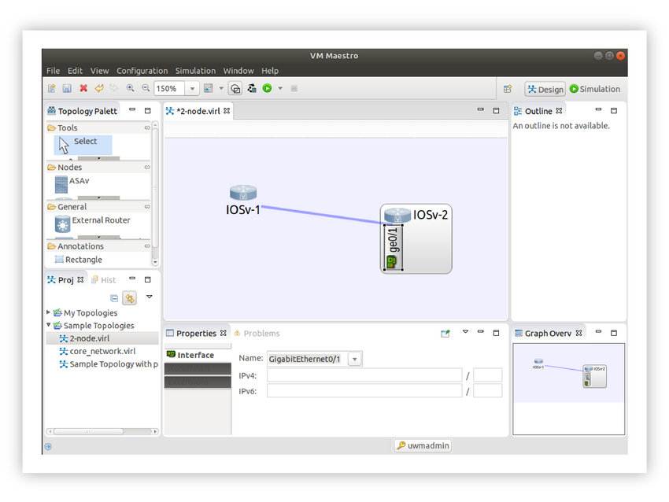

<!-- 7.7.1 -->
## Сетевое моделирование и VIRL

Сетевое моделирование предоставляет средства для тестирования сетевых конфигураций, отладки кода конфигурации, а также для работы и изучения инфраструктуры Cisco и API-интерфейсов безопасным, удобным и недорогим способом.

Cisco Virtual Internet Routing Laboratory (VIRL, произносится как «вайрэл») - коммерческий продукт, изначально разработанный для внутреннего использования в Cisco, при широкой и активной поддержке сообщества. Теперь в версии 2 VIRL может работать на «голом железе» или на больших виртуальных машинах на нескольких гипервизорных платформах (среди них ESXi и VMware Workstation 12+). Официальное название VIRL v 2.0 - Cisco Modeling Labs - Personal (или CML-Personal). Вы можете найти этот инструмент как VIRL 2.0, так и CML - P.

Хотя VIRL не может дублировать производительность элитного оборудования или программных компонентов SDN, работающих в оптимальных производственных условиях, он полностью отражает функциональность Cisco. Виртуальное оборудование, работающее внутри VIRL, использует тот же код, что и в реальных продуктах Cisco. Это делает VIRL идеальным инструментом для обучения, а также полезным механизмом для тестирования сетевых конфигураций и тонкой настройки автоматизации для их построения и тестирования.

### Компоненты и рабочий процесс VIRL

VIRL предоставляет локальный интерфейс командной строки для управления системой, интерфейс REST для интеграции с автоматизацией и мощный пользовательский интерфейс, который предлагает полную графическую среду для построения и настройки топологий моделирования.

Пользовательский интерфейс содержит несколько примеров топологий, которые помогут вам начать работу. Среди них - симуляция сети IOS с двумя маршрутизаторами, которую можно быстро активировать и исследовать. Представление «Перспектива дизайна» VIRL позволяет вам изменять существующие симуляции (после их остановки) или составлять новые симуляции, перетаскивая, отбрасывая и подключая сетевые объекты, настраивая их по мере необходимости.

<!-- -->

Визуализация имеет интерактивные элементы, которые позволяют вам исследовать конфигурацию сущностей и вносить изменения через веб-интерфейс или подключаясь к сетевым элементам через консоль. Вы также можете извлечь конфигурации отдельных устройств или целые смоделированные конфигурации сети, как `.virl` файлы.

### Файлы VIRL

VIRL также позволяет определять моделирование как код, обеспечивая двустороннюю интеграцию с другими программными платформами для управления сетью и тестирования.

Собственный формат конфигурации VIRL называется `.virl` файл, который является читаемым человеком YAML-файлом. В `.virl` Файл содержит полные описания маршрутизаторов IOS, их конфигурации интерфейсов и подключения (плюс другую информацию о конфигурации), учетные данные для доступа к ним и другие детали. Эти файлы можно использовать для запуска моделирования через VIRL REST API, и вы можете конвертировать `.virl` файлы в файлы "тестовой среды" и из них для использования с PyATS и Genie.

В пользовательском интерфейсе VIRL вы выбираете моделирование, заставляете VIRL считывать конфигурацию устройства, а затем он составляет файл `.virl` для его представления. VIRL предлагает сохранить топологию в новом файле, который затем можно открыть в редакторе для просмотра.

Файл `.virl` предоставляет метод определения того, произошел ли дрейф конфигурации при моделировании. Простая команда `diff` может сравнить недавно извлеченный файл `.virl` с оригинальным файлом `.virl`, используемым для запуска моделирования, и различия будут очевидны.

Этот метод сравнения заведомо исправного манифеста конфигурации с извлеченным манифестом, описывающим текущее состояние сети, помогает отлаживать реальные сети, для которых доступны авторитетные полные топологии PyATS.
