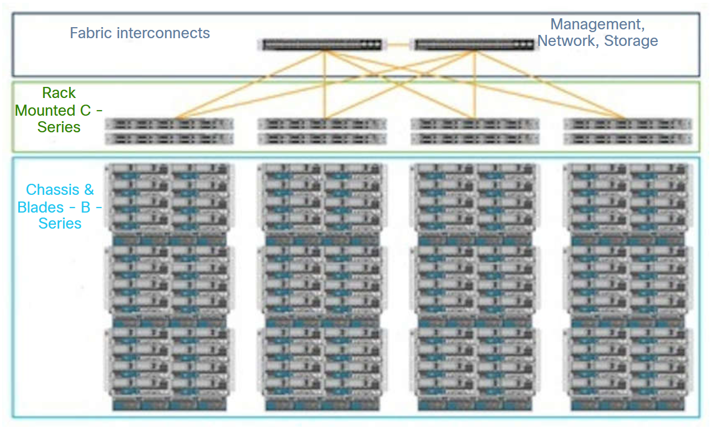
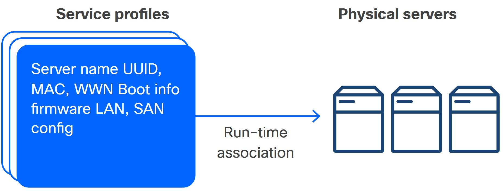
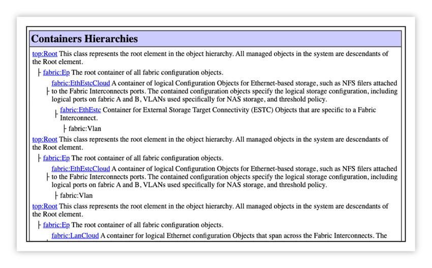
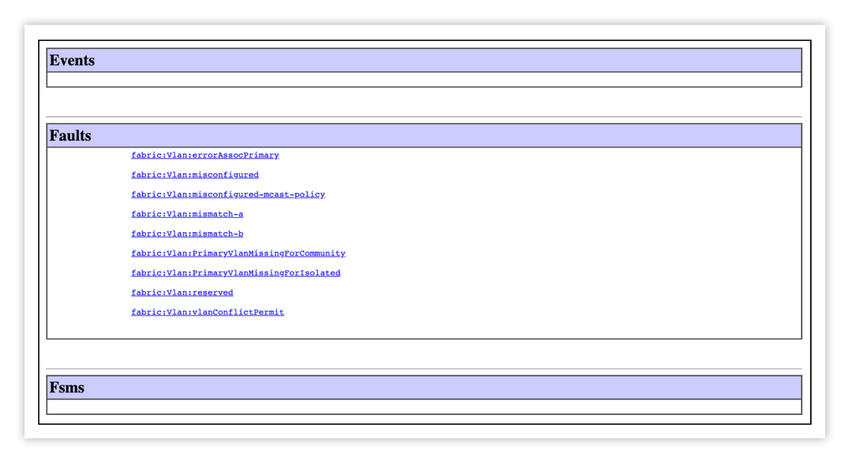
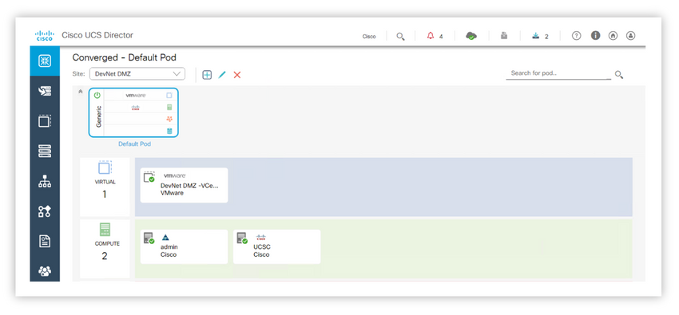
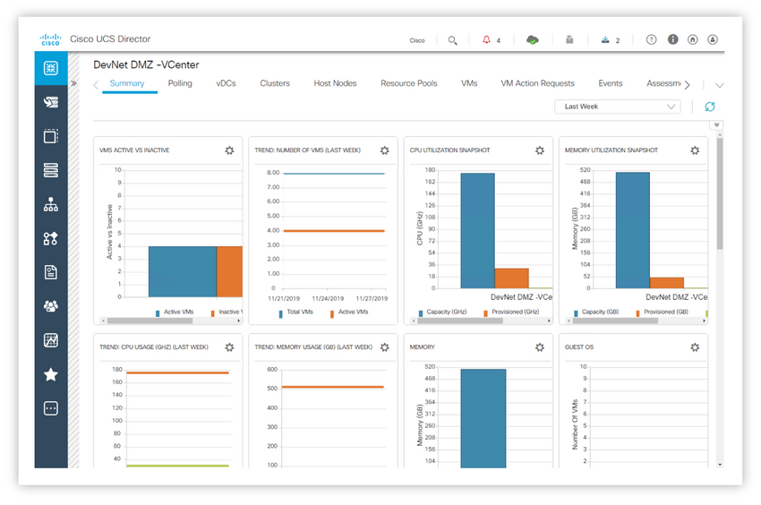
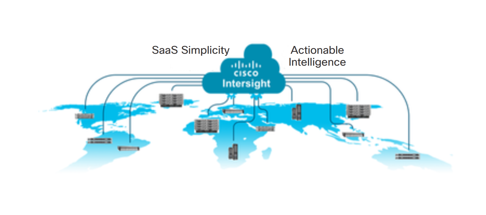
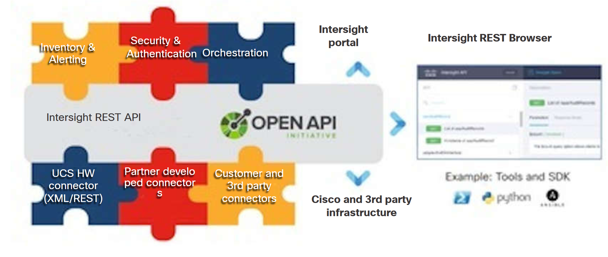

<!-- 8.5.1 -->
## Вычислительные решения Cisco

Унифицированная вычислительная система Cisco (UCS), вместе с ее программным обеспечением и дополнениями SaaS, была представлена в 2009 году для обеспечения полного физического и логического оборудования для вычислений, сетей и хранения в современном центре обработки данных.

Здесь вы более подробно изучите UCS, а затем взаимосвязанные инструменты и службы управления: UCS-Manager, UCS-Director и систему управления глобальной инфраструктурой SaaS, Intersight.

### Обзор UCS

Cisco UCS разработана для повышения гибкости и управляемости традиционной инфраструктуры:

* Решайте проблемы, которые мешают, затрудняют или делают недоступным предоставление оптимальных конфигураций вычислений/хранилищ/сети для разнообразных и динамичных приложений.
* Снижение аппаратных ограничений на эффективность виртуализации, облачных вычислений, PaaS, оркестрации контейнеров и других структур, которые абстрагируют вычислительные, хранилище и сетевые ресурсы.
* Позволяет конечным пользователям предоставлять произвольные конфигурации виртуализированной инфраструктуры, которые эффективно сопоставляются с возможностями, емкостью и конфигурацией базовой физической инфраструктуры.
* Обеспечьте управление физической инфраструктурой, используя тот же тип программно-ориентированной дисциплины «инфраструктура как код», которую применяет DevOps, выше в стеке, для ускорения и масштабирования операций.

UCS - это «гиперконвергентная» инфраструктура. Говоря очень абстрактно, UCS виртуализирует физическую инфраструктуру и делает ее программно определяемой единообразно:

* Базовая физическая установка обеспечивает модульные вычисления и гибкие возможности хранения, которые подключаются с помощью коммутационной фабрики «любой-к-любому», что упрощает добавление емкости.
* Помимо этого, новое микропрограммное обеспечение и встроенное программное обеспечение для управления абстрагируются от физического уровня, делая традиционно жестко запрограммированные характеристики (такие как UUID сервера, MAC-адреса, схемы дисков и настройки BIOS) настраиваемыми во время загрузки под контролем программного обеспечения управления. . Это устраняет необходимость вручную внедрять сложные конфигурации оборудования и обеспечивает единообразное программное обеспечение для автоматизированного управления инфраструктурой.
* На вершине гиперконвергентной инфраструктуры программное обеспечение и службы управления системой UCS обеспечивают автоматическое управление через Интернет, интерфейс командной строки, API и инструментальные средства (например, с использованием Ansible) до десятков тысяч физических серверов, а также возможность управления хостом продуктов инфраструктуры сторонних производителей.

<!-- 8.5.2 -->
## Cisco UCS Manager

Унифицированная вычислительная система Cisco (UCS) - это линейка серверных компьютеров центра обработки данных, состоящая из вычислительного оборудования, коммутационной матрицы, встроенного программного обеспечения для управления и поддержки виртуализации.

Cisco определяет унифицированные вычисления: «Унифицированные вычисления объединяют виртуализацию сети, виртуализацию хранилища и виртуализацию серверов в одно целое в рамках открытых отраслевых стандартных технологий и сети в качестве платформы».

Продукты обеспечивают масштабируемость за счет интеграции многих компонентов центра обработки данных. Это позволяет пользователям управлять ими как единым целым с помощью UCS Manager, UCS Central и Cisco Integrated Management Controller. Различные продукты управления напрямую связаны с количеством управляемых серверов:

* Cisco Integrated Management Controller (CIMC) может управлять одним физическим сервером.
* Cisco UCS Manager (UCSM) может управлять до 160 физическими серверами.
* Cisco UCS Central (UCSC) может управлять до 10 000 физических серверов.


<!-- /courses/devnet/1e7f15f0-b0f6-11ea-983b-a3f6821d6983/1eb01100-b0f6-11ea-983b-a3f6821d6983/assets/98add57e-0106-402b-a5db-13138a0f180d.svg -->


### Графический интерфейс Cisco UCS Manager


<!-- https://contenthub.netacad.com/courses/devnet/1e7f15f0-b0f6-11ea-983b-a3f6821d6983/1eb01100-b0f6-11ea-983b-a3f6821d6983/assets/99745d47-c09d-11ea-ae1e-a733eb29b8ad.png -->

Система или домен Cisco UCS может состоять из двух межсоединений фабрики Cisco UCS и минимум одного шасси Cisco с одним блейд-сервером или сервером, установленным в стойку. С помощью одного Cisco UCS Manager можно подключить до 40 шасси с разными типами блейд-серверов и смонтированных в стойку серверов.

Cisco UCS Manager работает в основном межсоединении фабрики, и ему назначается виртуальный IP-адрес (VIP) с возможностью переключения при отказе на подчиненное межсоединение фабрики. В случае аварийного переключения виртуальный IP-адрес подключится к подчиненному межсоединению фабрики, что сделает его новым первичным межсоединением фабрики.

Запросы на управление Cisco UCS Manager из графического интерфейса или интерфейса командной строки кодируются в XML. Все XML-запросы к Cisco UCS являются асинхронными и завершаются активным Cisco UCS Manager. Cisco UCS Manager обеспечивает все коммуникации внутри системы; прямой доступ пользователя к компонентам Cisco UCS не требуется.

Cisco UCS Manager знает текущую конфигурацию и выполняет автоматическое обнаружение устройств при установке нового ресурса. После обнаружения ресурса Cisco UCS Manager добавляет его и его характеристики в реестр системы. Какой бы тип управления ни был выбран, программное обеспечение управления управляет структурой того же типа для управления настройками сервера. Это информационная модель управления (MIM).

### Применение абстракции к серверам

Cisco UCS начиналась как концепция абстрагирования идентификаторов и свойств оборудования от физических вычислительных устройств, а также конфигураций и настроек компонентов.

Программное обеспечение Cisco UCS Management обеспечивает уровень абстракции между интерфейсами компонентов сервера и администратором. Этот уровень абстракции дает администратору единообразные возможности и методологию приложения для управления компонентами сервера. Уровень абстракции представлен в виде графического веб-интерфейса, интерфейса командной строки SSH и API.

Один сервер обычно имеет некоторые или все следующие характеристики:

* Множество физических дисков в нескольких компоновках, поддерживающих множество избыточностей, протоколов и стандартов безопасности
* Несколько логических конфигураций, связанных с загрузочным диском, доступом к сети, интерфейсами управления, протоколами и стандартами
* Много часов требуется на планирование, настройку и развертывание в центре обработки данных

Идентификаторы и свойства сервера обычно «выгорают» или настраиваются на этапе загрузки сервера с помощью последовательности клавиш прерывания. Встроенные идентификаторы, такие как универсальный уникальный идентификатор сервера (UUID) и адреса управления доступом к среде передачи (MAC), обычно назначаются материнской плате сервера и сетевым адаптерам на производстве. Конфигурации и параметры компонентов, такие как расположение дисков и назначение загрузочного диска, можно настроить во время процесса загрузки сервера с помощью последовательности клавиш для «взлома» процесса загрузки. Точка в процессе, где администратор может «взломать», обычно находится прямо перед тем, как серверу потребуется распознать конкретный ресурс или конфигурацию и укрепить этот компонент или конфигурацию, чтобы последующие процессы могли полагаться на его состояние.

Пользователи обычно думают о серверах как о точке, где работает операционная система. Часто первое, что хочет знать пользователь, - это какая версия ОС работает на сервере. Это покажет, является ли это системой гипервизора, способной запускать несколько виртуальных машин, каждая со своей собственной гостевой операционной системой, или сервером без операционной системы, на котором работает один экземпляр операционной системы Linux или Windows. Мощность UCS - это то, что происходит до загрузки операционной системы.

Обычно каждый компонент сервера имеет индивидуальный интерфейс управления. Метод доступа к интерфейсу компонента и выполнения этой настройки варьируется от компонента к компоненту. Например, поломка ключа во время запуска сервера может дать доступ к настройкам BIOS или конфигурации диска, в то время как USB-накопитель с программным обеспечением адаптера может потребоваться вставить в сервер для настройки сетевых интерфейсов и интерфейсов хранения.

Cisco UCS Manager был первой методологией управления сервером, которая обеспечила полный контроль над конфигурацией компонентов сервера с помощью единой структуры, называемой Service Profile. Перемещая всю конфигурацию сервера в профиль службы, UCS Manager позволяет администраторам определять идентичность, адреса, конфигурацию и настройки сервера, фактически не имея физического сервера. Аппаратное обеспечение, разработанное Cisco, позволяет перезаписывать или переназначать идентификаторы и адреса, даже те, которые были «выжжены». Кроме того, UCS Manager предоставляет пулы адресов и определения политик, которые могут использоваться профилями служб. UCS Manager также предоставляет шаблоны для профилей услуг и шаблоны для сетевых адаптеров и адаптеров хранения.

### Профили услуг Cisco UCS

Cisco UCS Manager использует профили обслуживания для присвоения идентификатора серверу, когда профиль обслуживания связан с сервером. UCS Manager может иметь сотни экземпляров профилей обслуживания, каждый из которых имеет уникальные адреса и идентификаторы, а также использовать общие политики для управления настройками BIOS, порядком загрузки и разметкой диска.

Каждый сервер UCS может иметь только одну ассоциацию профиля обслуживания одновременно, но профили обслуживания могут быть отделены от одного сервера и связаны с другим, тем самым применяя к новому серверу идентичность, которая была применена к предыдущему серверу.

На рисунке показаны 3 основных блока. Вверху находятся коммутаторы с надписью «межкомпонентные соединения фабрики» слева и «Управление, сеть, хранилище» справа. Два коммутатора подключаются друг к другу, а также к установленным в стойку коммутаторам серии c во втором корпусе. В нижнем ящике находятся шасси и лезвия устройств B - серии.


<!-- /courses/devnet/1e7f15f0-b0f6-11ea-983b-a3f6821d6983/1eb01100-b0f6-11ea-983b-a3f6821d6983/assets/99745d48-c09d-11ea-ae1e-a733eb29b8ad.svg -->

<!-- 8.5.3 -->
## Серверы Cisco UCS Manager

Cisco UCS Manager - это прогресс в управлении серверами и их развертывании по нескольким причинам:

* **Встроенное управление** - UCS не требует отдельного сервера управления, потому что он имеет встроенный процессор управления, который имеет глобальную видимость всех элементов, составляющих UCS. Это гарантирует скоординированный контроль и обеспечивает интегрированное управление и диагностику.
* **Единая фабрика** - UCS - это первый сервер, полностью разработанный на основе концепции Unified Fabric. У разных приложений разные требования к вводу-выводу, и без Unified Fabric сложно перемещать приложения с одного сервера на другой, сохраняя при этом соответствующие требования к вводу-выводу. Unified Fabric охватывает LAN, SAN и сеть управления.
* **Конвергентное управление** - Cisco UCS Manager управляет самими серверами и тем, как серверы подключаются к остальной части центра обработки данных, используя политики для распределения портов восходящей связи, переключения при отказе сети, управления портами, подключений к виртуальной LAN и SAN и т.

### Серверы Cisco UCS Manager

Серверы Cisco UCS Manager представляют собой блейд-модули, которые размещаются в шасси (серверы серии B) или монтируются в стойку (серверы серии C). Оба подключены к резервной паре коммутаторов и называются межсоединениями UCS Fabric Interconnects (FI). FI обеспечивают резервирование сети и путей к хранилищу, избыточное управление и единую точку управления для администратора. Когда FI подключаются друг к другу, они автоматически находятся в отношениях «первичный-подчиненный», где первичный обрабатывает все управление и данные.

Когда серверы в системе UCS настроены на использование всех возможностей резервирования, не должно быть единой точки отказа. Серверы UCS могут иметь резервирование, управление, сеть, хранение, питание и охлаждение.

UCS Manager также отслеживает события, предупреждения, ошибки и статистику. Он может сообщать об этих элементах, используя различные стандартные протоколы управления, такие как SNMP и Syslog.

### Возможности, преимущества и варианты использования

Cisco UCS развернута в широком спектре отраслей и предоставляет услуги высокопроизводительных вычислений и виртуальных рабочих столов для машинного обучения и искусственного интеллекта. Серверы UCS доступны в нескольких моделях для конкретных рабочих нагрузок, но могут быть настроены для работы с любыми рабочими нагрузками, от установки ОС без операционной системы до запуска сотен виртуальных машин.

Cisco UCS Manager поддерживает весь портфель серверов Cisco UCS. Он обеспечивает выделение ресурсов сервера, фабрики и хранилища, а также обнаружение устройств, инвентаризацию, настройку, диагностику, мониторинг, обнаружение сбоев, аудит и сбор статистики. С помощью Cisco UCS Central вы можете расширить преимущества Cisco UCS Manager в масштабах всего предприятия на тысячи серверов в нескольких доменах.

Cisco UCS Manager рассматривает инфраструктуру как код. Он расширяет функциональность существующих инструментов управления за счет обширной зрелой партнерской экосистемы. ИТ-организации могут перейти на DevOps, развивая существующий персонал, навыки, инструменты и процессы и делая их более эффективными.

Открытый API облегчает интеграцию Cisco UCS Manager с широким спектром инструментов мониторинга, анализа, настройки, развертывания и оркестровки от других независимых поставщиков программного обеспечения. API также облегчает разработку клиентов с помощью Cisco UCS PowerTool для PowerShell и Python SDK.

Cisco UCS Manager включает следующие функции:

* Поддерживает блейд-серверы Cisco UCS серии B и стоечные серверы серии C, сервер хранения C3260, Cisco UCS Mini и Cisco HyperFlex
* Программно контролирует ресурсы сервера, сети и хранилища с помощью унифицированного управления на основе политик, поэтому ими можно эффективно управлять в масштабе с помощью программного обеспечения
* Работает с графическими пользовательскими интерфейсами HTML 5, Java или CLI.
* Может автоматически обнаруживать, проводить инвентаризацию, управлять и предоставлять компоненты системы, которые добавляются или изменяются
* Облегчает интеграцию со сторонними инструментами управления системами
* Основывается на существующих навыках и поддерживает сотрудничество в разных дисциплинах посредством ролевого администрирования

### Преимущества

По результатам анализа более 160 тематических исследований, клиенты в среднем получали следующие преимущества:

* Сокращение времени инициализации на 83%
* 75% сокращение сроков реализации проекта
* Снижение текущих административных и управленческих расходов на 66 процентов

### Унифицированный API Cisco UCS

Унифицированный API Cisco UCS называется унифицированным, потому что для CIMC, Cisco UCS Manager и Cisco UCS Central используется та же методология API. Приведенная ниже информация относится в основном к XML API Cisco UCS Manager, однако эти концепции применимы к CIMC и Cisco UCS Central.

### Информационная модель управления Cisco UCS

Все физические и логические компоненты, составляющие Cisco UCS, представлены в иерархической информационной модели управления (MIM), также называемой MIT. MIT представляет собой древовидную структуру с узлами. Каждый узел в дереве представляет собой управляемый объект (MO) или группу объектов, которая содержит административное состояние узлов и их рабочее состояние.

Иерархическая структура начинается сверху (`sys`) и содержит родительский и дочерний узлы. Каждый узел в этом дереве является управляемым объектом, и каждый объект в Cisco UCS имеет уникальное отличительное имя (DN), которое описывает объект и его место в дереве. Управляемые объекты - это абстракции ресурсов Cisco UCS, таких как межкомпонентные соединения, шасси, блейд-модули и смонтированные в стойке серверы.

Политики конфигурации составляют большинство политик в системе и описывают конфигурации различных компонентов Cisco UCS. Политики определяют, как система ведет себя при определенных обстоятельствах. Некоторые управляемые объекты не создаются пользователями, но автоматически создаются Cisco UCS, например, объекты источников питания и объекты вентиляторов. При вызове UCS XML API выполняется чтение и запись объектов в MIM.

Информационная модель хранится централизованно и управляется механизмом управления данными (DME), процессом, выполняющимся на межкомпонентных соединениях фабрики. Когда пользователь инициирует административное изменение в компоненте Cisco UCS (например, связывает профиль услуги с сервером), DME сначала применяет это изменение к информационной модели, а затем применяет изменение к фактической управляемой конечной точке. Такой подход называется структурой, управляемой моделями.

Следующая схема ветвления начинается в `sys` из `topRoot` Cisco UCS MIT. На схеме показана иерархия, состоящая из пяти заполненных шасси с восемью блейд-серверами в каждом шасси. Все показанные лезвия имеют один или несколько адаптеров. Для простоты на рисунке ниже раскрыто только шасси номер пять.

### Иерархическая структура Cisco UCS MIT


<!-- https://contenthub.netacad.com/courses/devnet/1e7f15f0-b0f6-11ea-983b-a3f6821d6983/1eb01100-b0f6-11ea-983b-a3f6821d6983/assets/99745d49-c09d-11ea-ae1e-a733eb29b8ad.png -->


<!-- 8.5.4 -->
## Управляемые объекты Cisco UCS

Управляемые объекты Cisco UCS - это XML-представления физических и логических объектов в системе UCS. Объект политики загрузки с именем default с единственным дочерним объектом, который указывает загрузку с виртуального носителя, выглядит следующим образом:

```
<lsbootPolicy
  bootMode="legacy"
  childAction="deleteNonPresent"
  descr="Default Boot Policy"
  dn="org-root/boot-policy-default"
  enforceVnicName="no"
  intId="85315"
  name="default"
  policyLevel="0"
  policyOwner="local"
  propAcl="0"
  purpose="operational"
  rebootOnUpdate="no">
    <lsbootVirtualMedia
      access="read-write"
      childAction="deleteNonPresent"
      lunId="unspecified"
      mappingName=""
      order="4"
      propAcl="0"
      rn="read-write-vm"
      type="virtual-media"/>
</lsbootPolicy>
```

Имя класса - это элемент XML, в данном случае ‘lsbootPolicy’ для объекта политики загрузки, за которым следует ряд атрибутов и потенциально содержащих дочерние объекты, как показано здесь объект ‘lsbootVirtualMedia’. Объект lsbootVirtualMedia принадлежит к классу` lsbootVirtualMedia`.

Управляемый объект UCS может иметь много атрибутов и может содержать много дочерних объектов, дочерние объекты также могут содержать много дочерних объектов и так далее.

### Именование объекта

Вы можете идентифицировать конкретный объект по его отличительному имени или по его относительному имени.

Отличительное имя (DN) позволяет однозначно идентифицировать целевой объект. Все управляемые объекты UCS имеют уникальное DN; ни один другой объект во всем домене управления UCS не может иметь такое же DN.

DN имеет следующий формат, состоящий из серии RN:

```
dn = {rn}/{rn}/{rn}/{rn}...
```

В следующем примере DN предоставляет полный путь для адаптера-1 от вершины дерева объектов к объекту. DN указывает точный управляемый объект, на котором работает вызов API.

```
<dn="sys/chassis-5/blade-2/adaptor-1"/>
```

Относительное имя (RN) идентифицирует объект в контексте его родительского объекта. DN состоит из последовательности RN. Например, это DN:

```
<dn="sys/chassis-5/blade-2/adaptor-1/host-eth-2"/>
```

состоит из следующих RN:

* `topSystem`: `rn="sys"`
* `equipmentChassis`: `rn="chassis-5"`
* `computeBlade`: `rn ="blade-2"`
* `adaptorUnit`: `rn="adaptor-1"`
* `adaptorHostEthIf`: `rn="host-eth-2"`

### Классы объектов

Все управляемые объекты принадлежат классу, указывающему тип ресурса UCS, который представляет объект. Например, `computeBlade` - это класс, к которому принадлежат все лезвия UCS, и `fabricVlan` - это класс для всех объектов VLAN.

### UCS XML API

API XML Cisco UCS Manager, как и другие API, предоставляет методы для аутентификации, запроса и настройки.

### Методы аутентификации

Методы аутентификации аутентифицируют и поддерживают сеанс API с UCS Manager:

* `aaaLogin` - Первоначальный метод входа в систему и получения файла cookie аутентификации.
* `aaaRefresh` - Обновляет текущий файл cookie аутентификации.
* `aaaLogout` - Выход из текущего сеанса и деактивация файла cookie аутентификации.

Операции выполняются с использованием метода HTTP post поверх TCP. Cisco UCS поддерживает запросы HTTP и HTTPS, а HTTP и HTTPS можно настроить для использования разных номеров портов, но TCP/443 (или TCP/80 для незащищенных соединений) используется по умолчанию. Тело HTTP POST содержит конфигурацию XML.

### Методы запроса

Методы запроса получают информацию о текущем состоянии конфигурации объекта. Ниже приведены примеры запросов:

* `configResolveDn` - Извлекает объекты по DN.
* `configResolveDns` - Извлекает объекты по набору DN.
* `configResolveClass` - Извлекает объекты данного класса.
* `configResolveClasses` - Извлекает объекты нескольких классов.
* `configFindDnsByClassId` - Получает DN указанного класса.
* `configResolveChildren` - Извлекает дочерние объекты объекта.
* `configResolveParent` - Извлекает родительский объект объекта.
* `configScope—Performs` - Выполняет запросы классов по DN в MIT.

### Фильтры запросов

API также предоставляет набор фильтров запросов. Эти фильтры могут быть переданы как часть запроса и используются для определения желаемого набора результатов.

### Простые фильтры

Есть два простых фильтра, истинный фильтр и ложный фильтр:

* `True` - Объекты с логическим условием true.
* `False` - Объекты с логическим условием false.

### Фильтры собственности

Фильтры свойств используют значения свойств объекта в качестве критериев для включения в набор результатов. Чтобы создать большинство фильтров свойств, `classId` и `propertyId` целевого объекта или свойства вместе со значением для сравнения.

* `Equality` - Объекты с указанным свойством «равно» указанному значению свойства.
* `Not equal` - Объекты с идентифицированным свойством «не равно» указанному значению свойства.
* `Greater than` - Объекты с идентифицированным свойством "больше, чем" предоставленное значение свойства.
* `Greater than or equal` - Объекты с идентифицированным свойством «больше или равно» указанному значению свойства.
* `Less than` - Объекты с идентифицированным свойством «меньше» предоставленного значения свойства.
* `Less than or equal` - Объекты с идентифицированным свойством «меньше или равно» указанному значению свойства.
* `Wildcard` - Объекты, в которых указанное свойство включает подстановочный знак. Поддерживаемые подстановочные знаки включают «`%`» или «`*`» (любая последовательность символов), «`?`» или «`-`» (любой одиночный символ).

### Композитные фильтры

Составные фильтры состоят из двух или более компонентных фильтров. Они обеспечивают большую гибкость при создании наборов результатов. Например, составной фильтр может ограничить набор результатов только теми объектами, которые были приняты хотя бы одним из содержащихся фильтров.

* `AND` - Набор результатов должен соответствовать критериям фильтрации каждого компонента фильтра. Например, чтобы получить все вычислительные блейды с `totalMemory` более 64 мегабайт и работоспособность, фильтр состоит из одного фильтра «больше чем» и одного фильтра «равенства».
* `OR` - Набор результатов должен соответствовать критериям фильтрации по крайней мере одного из фильтров компонентов. Например, чтобы получить все профили услуг, которые имеют `assignmentState` для неназначенного или несвязанного значения состояния ассоциации, фильтр состоит из двух фильтров «равенства».
* `Between` - Набор результатов - это те объекты, которые попадают в диапазон от первого указанного значения до второго указанного значения включительно. Например, все возникшие неисправности, начиная с первого дня и заканчивая последним днем.
* `XOR` - Набор результатов - это те объекты, которые соответствуют критериям фильтрации не более чем одного из фильтров компонентов композита.

### Фильтр модификатора

Фильтр-модификатор изменяет результаты содержащегося в нем фильтра. Единственный фильтр-модификатор, который в настоящее время поддерживается, - это `NOT` фильтр, который отменяет результат содержащегося фильтра. Используйте этот фильтр для получения объектов, не соответствующих содержащимся критериям.

### Способы настройки

Существует несколько способов изменения конфигурации управляемых объектов. Эти изменения могут применяться ко всему дереву объектов, поддереву с корнем в указанном объекте или отдельному объекту. Ниже приведены примеры методов настройки:

* `configConfMo` - затрагивает один управляемый объект.
* `configConfMos` - Влияет на несколько поддеревьев.
* `configConfMoGroup` - Применяет одни и те же изменения конфигурации к нескольким структурам поддерева или управляемым объектам.

### Документация по API Cisco UCS

Документация Cisco UCS API обычно называется документацией по объектной модели UCS. Документация по объектной модели доступна с эмулятором платформы UCS или в Интернете.

Каждый класс и метод объекта UCS перечислены в документации вместе с типами UCS, событиями, сбоями, ошибками и сообщениями системного журнала. Документация - это обширная информация, содержащая информацию обо всех аспектах управляемого объекта UCS.

В качестве примера работы документации вы можете изучить `fabricVlan` объект.


<!-- https://contenthub.netacad.com/courses/devnet/1e7f15f0-b0f6-11ea-983b-a3f6821d6983/1eb01100-b0f6-11ea-983b-a3f6821d6983/assets/99745d4a-c09d-11ea-ae1e-a733eb29b8ad.png -->

<!-- 8.5.5 -->
## Документация по Cisco UCS Manager

Левое меню навигации позволяет выбрать объект. На правой панели отображается информация об объекте, разделенная на разделы, относящиеся к различным аспектам объекта.

### Обзор в документации

В разделе «Обзор» указывается, является ли объект абстрактным или конкретным. Все объекты, представляющие физическую или логическую сущность, являются Бетонными. Абстрактные объекты используются для наследования, когда несколько разных объектов могут наследовать общие атрибуты от базового объекта. Абстрактные объекты также могут представлять совокупность объектов. Например, `computeServer` - абстрактный объект, представляющий совокупность `computeBlade` объект и `computeRackUnit` объект.

Обзор также содержит информацию, относящуюся к шифрованию, привилегиям, SNMP OID и описание объекта.

### Правила именования

Правила именования указывают префикс объекта. В случае `fabricVlan` если префикс объекта `net-` это означает, что объект VLAN, определенный в UCS, будет иметь `net- перед предоставленным именем VLAN. Например, если создается VLAN с именем backupvlan` часть имени DN объекта будет `net-backupvlan`.

Правила именования также определяют различные DN, которые могут быть назначены объекту `fabricVlan`. Это связано с тем, что сети VLAN UCS могут относиться к различным типам сетей VLAN и находиться в разных частях MIM.

### Иерархии контейнеров

Иерархии контейнеров отображаются, где `fabricVlan`. Другими словами, объект может находиться там, где объект может находиться в MIM.


<!-- https://contenthub.netacad.com/courses/devnet/1e7f15f0-b0f6-11ea-983b-a3f6821d6983/1eb01100-b0f6-11ea-983b-a3f6821d6983/assets/99745d4b-c09d-11ea-ae1e-a733eb29b8ad.png -->

### Содержащаяся иерархия

Содержащаяся иерархия показывает, какие объекты `fabricVlan` могут содержать и какие объекты могут содержать эти содержащиеся объекты и т. д.


<!-- https://contenthub.netacad.com/courses/devnet/1e7f15f0-b0f6-11ea-983b-a3f6821d6983/1eb01100-b0f6-11ea-983b-a3f6821d6983/assets/99745d4c-c09d-11ea-ae1e-a733eb29b8ad.png -->

### Наследование

Наследование отображает все объекты до `fabricVlan` возразить, что `fabricVlan` унаследованные атрибуты от.


<!-- https://contenthub.netacad.com/courses/devnet/1e7f15f0-b0f6-11ea-983b-a3f6821d6983/1eb01100-b0f6-11ea-983b-a3f6821d6983/assets/99745d4d-c09d-11ea-ae1e-a733eb29b8ad.png -->

### События, сбои и конечные автоматы

Объекты могут быть изменены администратором или процессом. Мутации или изменения объекта - это события. Мутации происходят при создании, изменении и удалении объекта и могут вызывать события и сбои. Процесс изменения выполняется одним или несколькими процессами конечного автомата (FSM).

События, сбои и конечные автоматы также являются объектами и прикрепляются к родительскому объекту, для которого они были созданы. У объекта fabricVlan нет событий и связанных автоматов.


<!-- https://contenthub.netacad.com/courses/devnet/1e7f15f0-b0f6-11ea-983b-a3f6821d6983/1eb01100-b0f6-11ea-983b-a3f6821d6983/assets/99745d4e-c09d-11ea-ae1e-a733eb29b8ad.png -->


### Сводка свойств

В сводке свойств перечислены все свойства или атрибуты объекта. Отображаются имя и тип каждого свойства. Свойства группируются по объекту, в котором свойство было определено впервые. Обратите внимание, что объекты могут наследовать свойства от другого определения объекта более высокого уровня.


<!-- https://contenthub.netacad.com/courses/devnet/1e7f15f0-b0f6-11ea-983b-a3f6821d6983/1eb01100-b0f6-11ea-983b-a3f6821d6983/assets/99745d4f-c09d-11ea-ae1e-a733eb29b8ad.png -->


### Детали свойства

Каждое свойство объекта полностью определяется в деталях свойств. Свойство `fabricVlan` содержит подробную информацию о типе, шифровании, доступе и многом другом.

Обратите внимание на валидаторы свойств. Валидатор для диапазона указывает, что свойство `fabricVlan` должно состоять как минимум из одного символа, но не более чем из тридцати двух символов. Валидатор для допустимых символов отображается в виде регулярного выражения : `a-zA-Z0-9_.:-]+`.

Это регулярное выражение указывает, что в имени `FabricVlan` разрешена любая комбинация символов между скобками.


<!-- https://contenthub.netacad.com/courses/devnet/1e7f15f0-b0f6-11ea-983b-a3f6821d6983/1eb01100-b0f6-11ea-983b-a3f6821d6983/assets/99745d50-c09d-11ea-ae1e-a733eb29b8ad.png -->

### XML, SDK, инструменты и ресурсы

UCS XML API использует XML как метод для кодирования запросов и ответов через API, а также использует XML для определения всей объектной модели. Весь XML, используемый для определения MIM, известен как схема XML. Все объекты UCS описаны в схеме XML. Схема определяет объекты, их атрибуты и связанные значения. Все компоненты UCS всегда доступны с XML API.

Для нескольких языков программирования доступно множество библиотек для управления XML и взаимодействия со службой HTTP. SDK предоставляет несколько удобных функций и возможностей. Это устраняет много накладных расходов, связанных с написанием XML напрямую.

Когда Cisco UCS XML API был впервые выпущен, взаимодействия API выполнялись путем создания XML-документов и управления HTTP-взаимодействиями из клиентского приложения. Эти взаимодействия были похожи на следующие примеры.

### Запрос и ответ аутентификации

```
<aaaLogin inName="admin" inPassword="password" />
<aaaLogin
  response="yes"
  outCookie="cookie"
  outRefreshPeriod="600"
  outPriv="aaa,ext-lan-policy,ext-lan-qos,ext-san-policy,operations, pod-policy,pod-qos,read-only"
  outDomains="mgmt02-dummy"
  outChannel="noencssl"
  outEvtChannel="noencssl">
</aaaLogin>
```

Успешные запросы аутентификации возвращают cookie аутентификации. Файл cookie используется для всех последующих запросов. Срок действия файла cookie в конечном итоге истекает, и его необходимо обновить. Обновление файла cookie сбрасывает срок действия и возвращает новый файл cookie.

### Запрос на запрос и ответ

```
<configResolveDn
  cookie="cookie"
  inHierarchical="false"
  dn="mac/10:00:00:00:00:03" />
<configResolveDn
  dn="mac/10:00:00:00:00:03"
  cookie="cookie"
  response="yes">
  <outConfig>
    <macpoolAddr assigned="yes"
      assignedToDn="org-root/ls-SP01/ether-eth1"
      dn="mac/10:00:00:00:00:03"
      id="10:00:00:00:00:03"
      owner="pool" />
  </outConfig>
</configResolveDn>
```

Независимо от того, выполняете ли вы запрос или выполняете конфигурацию, XML-документ должен быть подготовлен для запроса и проанализирован, когда XML будет возвращен в ответ.

<!-- 8.5.6 -->
## Инструмент Cisco UCS Power Tool

UCS PowerTool - это библиотека командлетов PowerShell, которые позволяют управлять средами UCS из операционных систем Microsoft через API XML UCS. Схема UCS XML используется для создания более 98% библиотеки UCS PowerTool. Используя схему XML для создания PowerTool, командлеты гарантируют, что командлеты полностью осведомлены об объектах, их содержании, свойствах и деталях, связанных с каждым свойством.

Командлет для аутентификации с помощью UCS Manager выглядит следующим образом:

```
Connect-Ucs -Name <ip-address-ucs-manager>
```


<!-- https://contenthub.netacad.com/courses/devnet/1e7f15f0-b0f6-11ea-983b-a3f6821d6983/1eb01100-b0f6-11ea-983b-a3f6821d6983/assets/99745d51-c09d-11ea-ae1e-a733eb29b8ad.png -->

Командлет для запроса блейдов UCS и просмотра их DN выглядит следующим образом:

```
Get-UcsBlade | Select-Object Dn
```


<!-- https://contenthub.netacad.com/courses/devnet/1e7f15f0-b0f6-11ea-983b-a3f6821d6983/1eb01100-b0f6-11ea-983b-a3f6821d6983/assets/99745d52-c09d-11ea-ae1e-a733eb29b8ad.png -->

Командлет для создания UCS VLAN 100 выглядит следующим образом:

```
Get-UcsLanCloud | Add-UcsVlan -Name vlan100 -Id 100
```
### Поддержка ОС UCS PowerTool

UCS PowerTool - это библиотека командлетов PowerShell. PowerShell Desktop работает в Windows, а PowerShell Core работает в вариантах Linux, включая macOS. UCS PowerTool и UCS PowerTool Core поддерживают эти версии PowerShell.

UCS PowerTool имеет около 6000 командлетов для управления всеми аспектами систем Cisco UCS.

### UCS Python SDK

UCS Python SDK - это набор модулей Python, каждый из которых содержит один или несколько классов, разработанных специально для автоматизации UCS Manager через UCS XML API. UCS Python SDK разработан с соблюдением требований PEP8 и поддерживает каждый объект в объектной модели UCS. Схема UCS XML используется для создания более 98% UCS Python SDK. Использование схемы XML для создания UCS Python SDK гарантирует, что модули Python полностью осведомлены об объектах, их содержании, свойствах и деталях, связанных с каждым свойством.

Подобно UCS PowerTool, UCS Python SDK предоставляет сотни модулей Python для взаимодействия с объектами UCS.

Код UCS Python SDK для аутентификации с помощью UCS Manager выглядит следующим образом:

```python
from ucsmsdk.ucshandle import UcsHandle
handle = UcsHandle("ucs-manager-ip", "username", "passsword")
handle.login()
```

Код UCS Python SDK для запроса блейдов UCS и просмотра их DN выглядит следующим образом:

```python
from ucsmsdk.ucshandle import UcsHandle
handle = UcsHandle("ucs-manager-ip", "username", "passsword")
handle.login()
blades = handle.query_classid("computeBlade")
for blade in blades:
  print(blade.dn)
```

UCS Python SDK для создания UCS VLAN 100 выглядит следующим образом: приведенный здесь код соответствует PEP8 и при запуске через pylint получит 10 баллов из 10:

```python
from ucsmsdk.ucshandle import UcsHandle
from ucsmsdk.mometa.fabric.FabricVlan import FabricVlan
# Create a Login Handle and Login
HANDLE = UcsHandle("ucs-manager-ip", "username", "password")
HANDLE.login()
# Query the FabricLanCloud, under which VLAN Objects are inserted
FABRIC_LAN_CLOUD = HANDLE.query_classid("FabricLanCloud")
# Instantiate a VLAN Object, minimally "id" and "name" are required
VLAN = FabricVlan(
    parent_mo_or_dn=FABRIC_LAN_CLOUD[0],
    name="vlan100",
    id="100"
    )
# Add the instantiated VLAN Object to the HANDLE
HANDLE.add_mo(VLAN)
# Commit the HANDLE to add the VLAN to UCS Manager
HANDLE.commit()
# Logout
HANDLE.logout()
```

### Поддержка ОС UCS Python SDK

UCS Python SDK поддерживается везде, где поддерживается Python.

### UCS Ansible

UCS Ansible доступен для UCS Manager и Cisco Integrated Management Controller.

Подобно UCS Python SDK, UCS Ansible сочетает аутентификацию UCS Manager с изменением объекта или запросом объекта. Это имеет большой смысл, поскольку модули UCS Ansible написаны с использованием UCS Python SDK.

Модули UCS Ansible называются задачами в сборнике программ Ansible. Все функции и возможности языка Ansible Domain Specific доступны для модулей UCS Ansible.

Ниже приведена таблица воспроизведения Ansible, которая запрашивает диспетчер UCS для сетей VLAN UCS:

```yaml
---
- name: UCS Query
  hosts: ucs
  connection: local
  gather_facts: no
  tasks:
  - name: Query UCS
    ucs_query:
      hostname: "{{ ucs_hostname }}"
      username: "{{ ucs_username }}"
      password: "{{ ucs_password }}"
      class_ids: fabricVlan
    register: response
```

Для создания, обновления и удаления нескольких организаций UCS используйте следующую книгу Ansible Playbook:

```
---
- hosts: ucs
  connection: local
  gather_facts: no
  tasks:
  - name: Test for a UCS hostname,  username, and password
    fail:
      msg: 'Please define the following variables: ucs_hostname, ucs_username and ucs_password.'
    when: ucs_hostname is not defined or ucs_username is not defined or ucs_password is not defined
    vars:
      login_info: &login_info
        hostname: "{{ ucs_hostname }}"
        username: "{{ ucs_username }}"
        password: "{{ ucs_password }}"
  - name: Add UCS Organization
    ucs_org:
      <<: *login_info
      org_name: test
      description: testing org
      state: present
      delegate_to: localhost
  - name: Update UCS Organization
    ucs_org:
      <<: *login_info
      org_name: test
      description: Testing org
      state: present
      delegate_to: localhost
  - name: Add UCS Organization
    ucs_org:
      <<: *login_info
      org_name: level1
      parent_org_path: root
      description: level1 org
      state: present
      delegate_to: localhost
  - name: Add UCS Organization
    ucs_org:
      <<: *login_info
      org_name: level2
      parent_org_path: root/level1
      description: level2 org
      state: present
      delegate_to: localhost
  - name: Add UCS Organization
    ucs_org:
      <<: *login_info
      org_name: level3
      parent_org_path: root/level1/level2
      description: level3 org
      state: present
      delegate_to: localhost
  - name: Remove UCS Organization
    ucs_org:
      <<: *login_info
      org_name: level2
      parent_org_path: root/level1
      state: absent
      delegate_to: localhost
```

### Сводка по XML API Cisco UCS Manager

XML API Cisco UCS Manager, который является частью унифицированного API Cisco UCS, является основой всего в UCS. XML определяет схему объектной модели, кодирует объект в MIM и используется в API для кодирования запросов и ответов от платформ UCS.

Адаптация PowerShell и Python для UCS XML API абстрагирует разработчика от XML и обеспечивает лучший опыт для разработчика. Эти инструменты управляют обновлением файлов cookie и мутациями объектов, обеспечивают возможность заключать взаимодействия в транзакции и создавать методы наблюдения с функциями обратного вызова, которые срабатывают, когда применяется определенный параметр или наблюдается состояние.

Ansible переводит разработчика на другой уровень и предоставляет декларативную модель, которая возлагает на модуль бремя достижения заявленного.

UCS XML API обеспечивает полное покрытие объектов, представленных через интерфейсы управления UCS, позволяя любому инструменту или SDK, основанному на XML API, управлять всеми объектами в объектной модели UCS.

<!-- 8.5.7 -->
## Cisco UCS Director

Cisco Unified Computing System (UCS) Director - это полное, высокозащищенное, сквозное решение для управления, оркестрации и автоматизации для широкого спектра компонентов инфраструктуры центров обработки данных Cisco и сторонних производителей, а также для решений конвергентной инфраструктуры на основе Платформы UCS и Cisco Nexus.

Cisco UCS Director - это 64-разрядное устройство, использующее следующие стандартные шаблоны:

* Открытый формат виртуализации (OVF) для VMware vSphere
* Виртуальный жесткий диск (VHD) для Microsoft Hyper-V

### Управление через Cisco UCS Director

Cisco UCS Director расширяет возможности унификации вычислительного и сетевого уровней с помощью Cisco UCS, чтобы обеспечить видимость и управление компонентами инфраструктуры центра обработки данных. Cisco UCS Director можно использовать для настройки, администрирования и мониторинга поддерживаемых компонентов Cisco и сторонних производителей. Вы можете использовать UCS Director для выполнения следующих задач:

* Создавайте, клонируйте и развертывайте профили услуг и шаблоны для всех серверов Cisco UCS и вычислительных приложений.
* Постоянно отслеживайте использование, тенденции и пропускную способность конвергентной инфраструктуры в организации. Например, вы можете просматривать тепловые карты, которые показывают использование виртуальных машин (ВМ) во всех ваших центрах обработки данных.
* Развертывайте и увеличивайте емкость конвергентных инфраструктур последовательным и повторяемым образом.
* Управляйте, отслеживайте и составляйте отчеты о компонентах центра обработки данных, например доменах Cisco UCS или сетевых устройствах Cisco Nexus.
* Расширьте каталоги виртуальных сервисов, включив в них сервисы для вашей физической инфраструктуры.
* Управляйте безопасными многопользовательскими средами для поддержки виртуализированных рабочих нагрузок, которые выполняются с невиртуализированными рабочими нагрузками.

### Автоматизация и оркестровка с Cisco UCS Director

Cisco UCS Director позволяет создавать рабочие процессы, которые предоставляют услуги автоматизации, а также публиковать рабочие процессы и расширять их услуги для пользователей по запросу. Вы можете создавать рабочие процессы Cisco UCS Director для автоматизации простых или сложных процессов инициализации и настройки.

После создания и проверки эти рабочие процессы каждый раз работают одинаково, независимо от того, кто их запускает. Их может запустить опытный администратор центра обработки данных, или вы можете реализовать управление доступом на основе ролей, чтобы ваши пользователи и клиенты могли запускать рабочие процессы в режиме самообслуживания по мере необходимости.

С помощью Cisco UCS Director вы можете автоматизировать широкий спектр задач и сценариев использования с помощью множества поддерживаемых аппаратных и программных компонентов Cisco и сторонних производителей для центров обработки данных. Несколько примеров сценариев использования, которые вы можете автоматизировать, включают, но не ограничиваются:

* Подготовка виртуальных машин и управление жизненным циклом
* Конфигурация сетевых ресурсов и управление жизненным циклом
* Конфигурация ресурсов хранения и управление жизненным циклом
* Подключение арендатора и настройка инфраструктуры
* Подготовка инфраструктуры приложений
* Каталоги самообслуживания и подготовка виртуальных машин
* Предоставление сервера на чистом железе, включая установку операционной системы


<!-- https://contenthub.netacad.com/courses/devnet/1e7f15f0-b0f6-11ea-983b-a3f6821d6983/1eb01100-b0f6-11ea-983b-a3f6821d6983/assets/99745d53-c09d-11ea-ae1e-a733eb29b8ad.png -->

### Особенности и преимущества

* **Центральное управление** - Предоставляет администраторам единый интерфейс для выделения ресурсов, мониторинга и управления системой в физических, виртуальных средах и средах без операционной системы. Унифицированные информационные панели, отчеты и тепловые карты, которые сокращают устранение неполадок и снижение производительности.
* **Каталог самообслуживания** - Позволяет конечным пользователям заказывать и развертывать новые экземпляры инфраструктуры в соответствии с политиками и управлением, предписанными ИТ.
* **Адаптивная подготовка** - Предоставляет возможности, внутренние политики и требования к рабочей нагрузке приложений в режиме реального времени для оптимизации доступности ваших ресурсов.
* **Динамическое управление мощностью** - Обеспечивает непрерывный мониторинг ресурсов инфраструктуры для улучшения планирования, использования и управления мощностью, а также выявляет недостаточно и чрезмерно используемые ресурсы.
* **Поддержка нескольких гипервизоров** - Поддерживает гипервизоры VMware ESX, ESXi, Microsoft Hyper-V и Red Hat.
* **Управление вычислениями** - Обеспечивает, контролирует и управляет физическими, виртуальными серверами и серверами без операционной системы, а также блейд-серверами. Позволяет конечным пользователям реализовать управление жизненным циклом виртуальных машин и обеспечение непрерывности бизнеса с помощью моментальных снимков. Позволяет администраторам получить доступ к анализу тенденций использования сервера.
* **Сетевое управление** - Обеспечивает предоставление физических и виртуальных коммутаторов и динамических сетевых топологий на основе политик. Позволяет администраторам настраивать VLAN, виртуальные сетевые интерфейсные карты (vNIC), группы портов и профили портов, выделение IP-адресов и протокола динамического управления хостом (DHCP), а также списки управления доступом (ACL) для сетевых устройств.
* **Управление хранилищем** - Обеспечивает инициализацию на основе политик и управление файловыми системами, виртуальными файловыми системами (vFilers), номерами логических устройств (LUN) и томами. Предоставляет унифицированные информационные панели, которые позволяют администраторам получать исчерпывающую информацию об использовании в организации, тенденциях и подробностях анализа емкости.
* **Дашборды** - Предоставляет несколько панелей мониторинга для отслеживания использования ресурсов и политик.


<!-- https://contenthub.netacad.com/courses/devnet/1e7f15f0-b0f6-11ea-983b-a3f6821d6983/1eb01100-b0f6-11ea-983b-a3f6821d6983/assets/99745d54-c09d-11ea-ae1e-a733eb29b8ad.png -->

### Оркестровка на основе модели

Cisco UCS Director включает библиотеку задач, которая содержит более 1000 задач и готовых рабочих процессов. Оркестровка на основе моделей и конструктор рабочих процессов позволяют настраивать и автоматизировать административные и операционные задачи инфраструктуры. Вы можете расширить и настроить систему в соответствии с индивидуальными потребностями.

### Программируемость Cisco UCS Director

Программируемость Cisco UCS Director является гибкой и позволяет автоматизировать различные методологии. UCS Director - это платформа автоматизации и оркестровки с несколькими программными возможностями.

* **REST API** - REST API и браузер REST API позволяют управлять UCS Director. UCS Director обеспечивает управление политиками, группами, виртуальными объектами и т. Д. REST API также предоставляет способ запуска рабочих процессов UCS Director.
* **Задачи** - Задачи либо предоставляются готовыми к использованию, либо могут быть созданы как пользовательские задачи. Задачи могут быть атомарными или монолитными и написаны на CloupiaScript, языке, подобном JavaScript.
* **Библиотеки скриптов** - Может содержать методы CloupiaScript, файлы jar Java, списки значений и многое другое.
* **Хост PowerShell** - Используйте командлеты PowerShell с UCS Director через узел PowerShell.
* **Интеграции ** - UCS Director поддерживает интеграцию с различными службами, обеспечивая все, от отслеживания проблем до платежных услуг и управления исходным кодом.

<!-- 8.5.8 -->
## Cisco UCS Director - REST API

Для доступа к REST API через Cisco UCS Director необходимы действующая учетная запись пользователя Cisco UCS Director и ключ доступа к API. Cisco UCS Director использует ключ доступа к API для аутентификации запросов API. Этот ключ доступа представляет собой уникальный код ключа доступа безопасности, связанный с определенной учетной **Примечание**ю пользователя Cisco UCS Director.

Вы должны передать ключ доступа REST API в виде заголовка HTTP в следующем формате:

```
X-Cloupia-Request-Key: F90ZZF12345678ZZ90Z12ZZ3456FZ789
```

### Использование графического интерфейса


<!-- https://contenthub.netacad.com/courses/devnet/1e7f15f0-b0f6-11ea-983b-a3f6821d6983/1eb01100-b0f6-11ea-983b-a3f6821d6983/assets/99745d55-c09d-11ea-ae1e-a733eb29b8ad.png -->

Когда вы включаете меню разработчика, графический интерфейс Cisco UCS Director предоставляет разработчикам возможность доступа к метаданным отчета и браузеру REST API. После этого вы получите доступ к следующим функциям:

* **Метаданные отчета** - Метаданные отчета позволяют просматривать URL-адрес REST API для каждого отчета, отображаемого в Cisco UCS Director.
* **Браузер REST API** - Браузер REST API доступен из меню Orchestration в Cisco UCS Director. Браузер REST API предоставляет информацию об API и возможности генерации кода API, которые упрощают просмотр и работу со всеми доступными API, включая REST API и Java API.


<!-- https://contenthub.netacad.com/courses/devnet/1e7f15f0-b0f6-11ea-983b-a3f6821d6983/1eb01100-b0f6-11ea-983b-a3f6821d6983/assets/99745d56-c09d-11ea-ae1e-a733eb29b8ad.png -->

Взаимодействие с другими людьми

* **Клиент REST** - Клиент REST - полезный виджет для анализа и просмотра запросов и ответов API. В этом виджете вы можете ввести URL-адрес REST и применить метод HTTP, такой как POST, PUT или DELETE, к URL-адресу для обработки данных. Клиент REST предоставляет простой пользовательский интерфейс для ввода URL-адреса для получения данных с сервера Cisco UCS Director.


<!-- https://contenthub.netacad.com/courses/devnet/1e7f15f0-b0f6-11ea-983b-a3f6821d6983/1eb01100-b0f6-11ea-983b-a3f6821d6983/assets/99745d57-c09d-11ea-ae1e-a733eb29b8ad.png -->

### Как сделать запрос REST API

Клиенты API используют HTTP-запрос для взаимодействия с Cisco UCS Director. Чтобы передать ключ доступа REST API, каждый запрос должен быть связан с заголовком HTTP под названием X-Cloupia-Request-Key со значением, установленным на текущий ключ доступа REST API.

Запросы к API имеют следующие характеристики:

* Они отправляются по HTTP.
* Кодирование формата запроса может быть JSON или XML в UCS Director API Version 1.
* Запрос должен содержать действительный URL.

### ВЕРСИЯ API 1

http: // СЕРВЕР/приложение/api/rest? formatType = json & opName = operationName & opData = operationData

Где:

* `SERVER` - Это IP-адрес или имя хоста Cisco UCS Director.
* `formatType` - это либо JSON, либо XML. По умолчанию используется JSON.
* `opName` - Имя операции API, связанной с запросом. Например,: `userAPIGetMyLoginProfile` или `userAPIGetVMActionStatus`.
* `opData` - Параметры (или аргументы), связанные с операцией.

Cisco UCS Director использует кодировку параметров JSON или XML. Если для операции аргументы не требуются, используйте `{}` как пустой набор. Перед отправкой данных в запросе закодируйте URL-адрес, применив соответствующие escape-символы. Дополнительные сведения о кодировании URL-адреса см. В RFC по адресу http://www.ietf.org/rfc/rfc1738.txt.

### API версии 2

Только XML поддерживается для версии 2 API-интерфейса UCS Director.

http://server/cloupia/api-v2/group

* Метод HTTP: POST.

```xml
<cuicOperationRequest>
  <payload>
    <![CDATA[
      <AddGroupConfig>
      <groupName>TestGroup</groupName>
      <groupDescription></groupDescription>
      <parentGroup>0</parentGroup>
      <groupCode></groupCode>
      <groupContact>jbesai@cisco.com</groupContact>
      <firstName></firstName>
      <lastName></lastName>
      <phone></phone>
      <address></address>
      <groupSharePolicyId></groupSharePolicyId>
      <allowPrivateUsers>false</allowPrivateUsers>
      </AddGroupConfig>
    ]]>
  </payload>
</cuicOperationRequest>
```

### О параметрах или аргументах данных операций

Поскольку метод и тип ресурса API передаются через `opName`, параметры операции должны содержать любые аргументы, которые вы хотите назначить конкретному экземпляру ресурса, над которым будет работать.

### Синтаксис параметров данных операций

Ниже приведены примеры синтаксиса параметров данных операций в формате JSON.

* Без параметров - `{}`
* Один параметр; целое число (например, 10) - `{param0: 10}`
* Один параметр: строка (например, облако) - `{param0: "cloud"}`
* Два параметра: строка и целое число - `{param0: "cloud", param1: 10}`
* Два параметра: строка с нулевым значением и целое число - `{param0: null, param1: 10}`
* Три параметра - `{param0: "cloud ", param1: "cloupia", param2: 100}`

### Рабочие данные Примеры параметров

```
...&opData={param0:"Create NFS Datastore",param1:{"list":[{"name":"Volume Size","value":100},
{"name":"Select Group","value":"14"},{"name":"Select vDC","value":18}]},param2:212}
```

* `param0` - Имя рабочего процесса, вызываемого через REST API.
* `param1` - Входные данные передаются в рабочий процесс. Если имеется более одного ввода, разделите их запятыми и заключите в две одинарные кавычки имена и значения ввода. Если входов нет, используйте ключевое слово null в качестве значения параметра.
* `param2` - Если этот рабочий процесс вызывается как дочерний рабочий процесс другого запроса на обслуживание, используйте идентификатор запроса на обслуживание (SR). Если этот рабочий процесс не вызывается как дочерний рабочий процесс, используйте –1. Когда используется –1, создается новый запрос на обслуживание.

### Как использовать команды cURL

cURL - это инструмент командной строки для получения или отправки данных с использованием синтаксиса URL. Вы можете использовать команду cURL для выполнения запроса REST API.

В следующем примере показано, как выполнить `userAPISubmitWorkflowServiceRequest` API и передайте входные значения:

```
curl  -v -X POST -H 'X-Cloupia-Request-Key:5CF4C115F0034B189616B2B8EBA0F220' -g 'http://172.17.32.75/app/api/rest?formatType=json&opName=userAPISubmitWorkflowServiceRequest&opData={param0:"TestWorkFlowFromAPI",param1:{"list":[{"name":"A1","value":"Hello"},{"name":"A2","value":"World"}]},param2:-1}'
```

### Пользовательские задачи и CloupiaScript

Cisco UCS Director обеспечивает автоматическое выделение ресурсов инфраструктуры, управление ими и создание отчетов по ним. Cisco UCS Director включает мощный механизм оркестровки, который позволяет выполнять сложные операции на любом элементе вашей конвергентной инфраструктуры, как физической, так и виртуальной. Эти операции воплощены в рабочих процессах, которые представляют собой записанные в сценарии последовательности отдельных задач. Cisco UCS Director поставляется в комплекте с большой библиотекой задач.

Задачи в Cisco UCS Director написаны на CloupiaScript, версии JavaScript с библиотеками, которые позволяют выполнять операции оркестровки. С помощью CloupiaScript можно встраивать сценарии в задачи рабочего процесса и писать собственные задачи.

### SSH к сетевому устройству Пример CloupiaScript

```python
function testSSHClient() {
    var client = new SSHClient(input.ipAddress, 22, // 22 = SSH standard port
input.userName, input.password);
    client.connect();
    var session = client.openShell(511,25); // (511, 25) = (columns, rows)
    var shellStream = new PrintStream(session.getOutputStream());
    shellStream.println(input.command);
    shellStream.flush();
    client.disconnect();
}
testSSHClient();
```

### Дополнительные ресурсы UCS Director

API-интерфейсы UCS Director REST можно вызывать из любого языка программирования или инструмента, поддерживающего HTTP-запросы. Например PowerShell и Python или Postman и cURL. CloupiaScript используется напрямую или импортируется во встроенные и настраиваемые задачи. Задачи также могут вызывать командлеты PowerShell через агент PowerShell. Встроенные задачи и пользовательские задачи используются для создания рабочих процессов, и рабочие процессы могут быть вызваны из UCS Director REST API, что делает UCS Director почти полностью автоматизированным.

<!-- 8.5.9 -->
## Cisco Intersight

Cisco Intersight была представлена в 2018 году компанией Cisco Systems. Cisco Intersight - это платформа управления системами «Программное обеспечение как услуга» (SaaS), способная управлять инфраструктурой на периферии и удаленных объектах, а также в центре обработки данных. При использовании службы вы можете масштабировать инфраструктуру вверх или вниз по мере увеличения или уменьшения потребностей. Поскольку он предоставляет REST API для доступа к модели информации управления (MIM), вы можете управлять инфраструктурой как кодом. API Intersight постоянно доступен в облачной модели управления. В службу можно добавлять новые функции, не затрагивая существующие системы автоматизации.


<!-- /courses/devnet/1e7f15f0-b0f6-11ea-983b-a3f6821d6983/1eb01100-b0f6-11ea-983b-a3f6821d6983/assets/86bcfe25-2ec5-4e15-9374-4db438152c3e.svg -->

### Intersight и Cisco Unified Computing System (UCS)

Программное обеспечение Cisco UCS Manager обеспечивает уровень абстракции между интерфейсами компонентов сервера и администратором. Этот уровень абстракции означает, что у администратора есть стандартизированный метод управления компонентами сервера. Уровень абстракции представлен в виде веб-графического пользовательского интерфейса (GUI) и интерфейса прикладного программирования (API).

Cisco Intersight основывается на UCS Unified Fabric и опыте управления UCS с платформой управления, размещенной и обслуживаемой Cisco. С помощью профиля сервера, который выполняет предоставление услуг на основе модели в UCS, вы можете использовать Intersight для настройки серверов, управления ресурсами и обеспечения согласованности политик. При таком подходе вы избегаете сбоев, вызванных несогласованной конфигурацией.

С помощью Intersight API вы можете создать интеграцию с Cisco Intersight для дополнительных задач, таких как мониторинг, анализ, настройка, развертывание и оркестровка.


<!-- /courses/devnet/1e7f15f0-b0f6-11ea-983b-a3f6821d6983/1eb01100-b0f6-11ea-983b-a3f6821d6983/assets/9aaff3b3-d753-41f6-b433-daf61cad86aa.svg -->

### Возможности Intersight API

API Intersight обеспечивает доступ к Intersight MIM. API Intersight принимает и возвращает сообщения, инкапсулированные через документы JavaScript Object Notation (JSON) и использующие HTTP через TLS в качестве транспортного протокола.

Все физические и логические компоненты, видимые в Cisco Intersight, представлены в иерархической MIM, также называемой деревом управляющей информации или MIT. MIT представляет собой древовидную структуру с узлами. Каждый узел в дереве представляет собой управляемый объект (MO) или группу объектов, которая содержит административное состояние узлов и его рабочее состояние.

Дополнительную информацию см. В разделе «Информационная модель управления» документации Intersight.

### Доступ к Intersight API

Есть несколько способов получить доступ к Intersight API. Вы можете использовать веб-браузер в качестве REST-клиента Intersight API или ключи API для удаленного доступа или доступа к услугам.

### REST-клиент Intersight API

Чтобы просматривать и взаимодействовать с Intersight API, откройте https://intersight.com/apidocs в браузере. Страницы **API Reference**, размещенные на intersight.com, содержат оперативную информацию о полной модели ресурсов Intersight. Ресурсы можно искать по имени, и можно просматривать схему модели.


<!-- https://contenthub.netacad.com/courses/devnet/1e7f15f0-b0f6-11ea-983b-a3f6821d6983/1eb01100-b0f6-11ea-983b-a3f6821d6983/assets/99748450-c09d-11ea-ae1e-a733eb29b8ad.png -->

На сайте intersight.com также размещен **REST Client**, который позволяет напрямую взаимодействовать с API.

**REST Client** на сайте также поддерживает полный язык запросов API, а подробные сведения о поддерживаемых параметрах запроса можно просмотреть на страницах **Query Parameters**.

### Клиент REST API Intersight


<!-- https://contenthub.netacad.com/courses/devnet/1e7f15f0-b0f6-11ea-983b-a3f6821d6983/1eb01100-b0f6-11ea-983b-a3f6821d6983/assets/99748451-c09d-11ea-ae1e-a733eb29b8ad.png -->

### Ключи API Intersight

Вы создаете ключи API для своей учетной записи Intersight для обычного удаленного доступа через SDK или другие среды программирования. Например, ключи API используются модулями Intersight Ansible, а ключевая информация указывается в руководствах Ansible. Плейбуки также содержат переменные, которые вы можете редактировать по мере необходимости.

Ключи API Intersight делятся на две категории; идентификатор ключа API и секретный ключ. Идентификатор ключа API - это многосимвольная строка, которая всегда отображается после первоначального создания ключа. Секретный ключ - это закрытый ключ RSA, который доступен только при создании ключа API. Чтобы создать ключи API в Intersight, вы должны войти в систему на https://intersight.com и выполните следующие действия:

**Шаг 1**. Щелкните значок настроек.

**Шаг 2**. Щелкните **API Keys** на левой навигационной панели.

**Шаг 3**. Щелкните **Generate API Key**.

**Шаг 4**. Введите **Description** - описание ключа.

**Шаг 5**. Щелкните **Generate**.

**Шаг 6**. Щелкните значок **Save Secret Key to text file** (Сохранить секретный ключ в текстовый файл). Файл «SecretKey.txt» загружается в папку для загрузки по умолчанию.

> **Примечание**: Вы можете создавать ключи API Intersight, только если у вас есть необходимая лицензия на продукт.

### Модули Ansible для Cisco Intersight

Intersight поддерживает несколько интеграций API, включая модули Ansible, которые позволяют собирать инвентарь и управлять конфигурацией ресурсов Intersight. Ansible написан на Python, а модули Intersight взаимодействуют с API с помощью кода, написанного на Python. Это обеспечивает надежную аутентификацию в Intersight с использованием ключей API и стандартных модулей Ansible для доступа на основе URL.

На GitHub размещено несколько примеров учебников и лабораторных руководств.

### Дополнительные SDK и ресурсы

В дополнение к модулям Ansible Intersight предоставляет модули Python SDK и PowerShell, которые генерируются из схемы Intersight OpenAPI (которая также называется спецификацией Intersight Swagger). На сайте intersight.com размещена последняя спецификация OpenAPI и ссылки на SDK.
