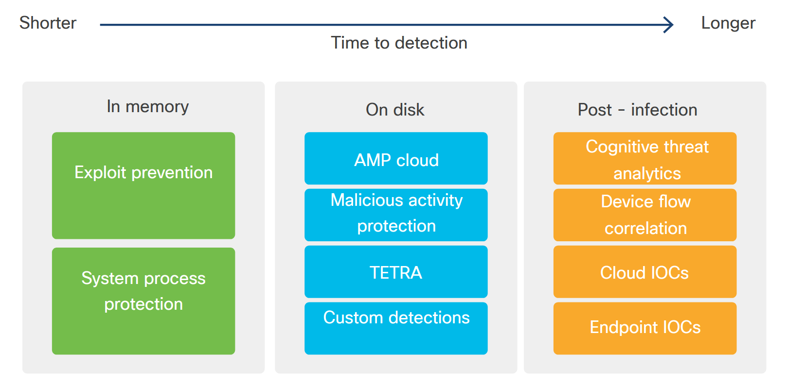
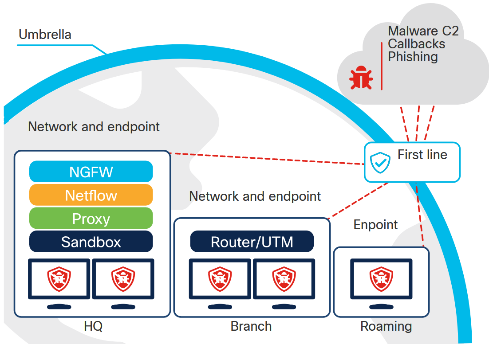

<!-- 8.7.1 -->
## Введение

Для сетевой компании, такой как Cisco, естественно думать о рисках внутри сети и о рисках, связанных с трафиком, проходящим в сети. Если вы задумаетесь о том, сколько информации необходимо принять системе, чтобы отслеживать и отслеживать проблемы, вы скоро поймете, что один человек или даже группа безопасности, полная способных людей, не может постоянно использовать ручные процессы для защиты сети. или защитите приложение. Вам нужны автоматизированные способы выявления угроз и снижения рисков, а также способы настройки систем с учетом требований безопасности.

Скрипты могут получать данные быстрее, чем человек. Сценарии могут искать проблемы и выявлять их намного быстрее, чем человек. Кроме того, сценарии для настройки повторяются и не приводят к нарушениям из-за неправильного ввода в файлах конфигурации.

Cisco предоставляет большой портфель технологий безопасности и семейств продуктов, которые можно настраивать и управлять через API. В этой теме основное внимание будет уделено:

* Расширенная защита от вредоносных программ (AMP) для конечных точек
* Центр управления Cisco Firepower (FMC)
* Cisco Firepower Threat Defense (FTD)
* Cisco Identity Services Engine (ISE)
* Cisco Threat Grid
* Cisco Umbrella

<!-- 8.7.2 -->
## Расширенная защита от вредоносных программ Cisco (AMP)

Cisco Advanced Malware Protection (AMP) для конечных точек обеспечивает доступ к API для автоматизации рабочих процессов безопасности и включает расширенные возможности песочницы для проверки любого файла, который выглядит как вредоносное ПО, безопасным и изолированным способом. AMP работает с устройствами Windows, Mac, Linux, Android и iOS посредством развертывания в публичном или частном облаке.

### Преимущества и цель

С помощью AMP для конечных точек вы можете получать информацию о конечных точках и получать информацию о конкретных событиях или перемещать конечные точки в новые группы с помощью REST API. Продукт AMP непрерывно анализирует файловую активность в расширенной сети. С помощью информации, предоставляемой API AMP, вы можете обнаруживать, сдерживать и удалять сложные вредоносные программы.

### Архитектура

Advanced Malware Protection включает набор продуктов на основе подписки. Вы управляете ими с помощью централизованной веб-консоли и развертываете AMP на устройствах, включая мобильные телефоны, на почтовых серверах или на веб-серверах. Используя AMP для конечных точек, вы устанавливаете соединитель AMP на каждое устройство.

### Интеграции

AMP интегрируется в портфель решений безопасности Cisco с множеством вариантов развертывания. Двумя примерами продуктов с интеграцией AMP являются Cisco Umbrella и Meraki MX.

### Окружающая среда и масштаб

AMP для конечных точек можно использовать в университетском городке, в медицинских организациях, в государственных учреждениях или в промышленных и производственных средах.

### Возможности

AMP предотвращает нарушения и блокирует вредоносное ПО в точке проникновения, а затем обнаруживает, сдерживает и устраняет сложные угрозы, которые могут обойти защиту передовой и проникнуть в вашу сеть.

AMP предлагает три основные категории возможностей:

* Профилактика
* Обнаружение
* Отзывы и автоматизация

### Профилактика

AMP защищает от обнаруженных угроз в файлах вредоносных программ, предотвращая взлом. Вы можете использовать API для создания сеансов изоляции, предотвращая сетевое подключение устройства в течение установленного времени, чтобы у вас было время для предотвращения дальнейших проблем.

AMP использует глобальный анализ угроз и может блокировать файловые и нефайловые вредоносные программы, IP-адреса из списка или блокировать приложения.

### Обнаружение

AMP постоянно отслеживает и записывает всю файловую активность для обнаружения вредоносных программ. Он обеспечивает видимость активности файлов конечных точек и входящих угроз, а также сообщает, какие конечные точки были скомпрометированы.

AMP Cloud предлагает поиск, механизм подписи и механизм машинного обучения для постоянно обновляемой интеллектуальной базы данных, чтобы обнаружение могло происходить на диске. Облако AMP - это сервис, который вы запрашиваете с помощью AMP API.

TETRA - это антивирусный движок, поставляемый как часть AMP Connector для Windows, а ClamAV - аналогичный движок для macOS и Linux.

На рисунке показана стрелка, идущая от левой более короткой стороны, указывающая на более длинную правую сторону со словами «время обнаружения» под ней. Есть три основных раздела: в памяти, на диске и после заражения. У каждой стрелки есть текстовые поля под заголовком. В памяти есть 2 текстовых поля: защита от эксплойтов и защита системных процессов. На диске есть 4 текстовых поля: amp облако, защита от вредоносных действий, тетра и пользовательские детекции. После заражения есть четыре текстовых поля: аналитика когнитивных угроз, корреляция потоков устройств, облачные ИОС и ИОК конечных точек.


<!-- /courses/devnet/1e7f15f0-b0f6-11ea-983b-a3f6821d6983/1ef1d4f0-b0f6-11ea-983b-a3f6821d6983/assets/99748462-c09d-11ea-ae1e-a733eb29b8ad.svg -->

Используя API AMP, вы можете искать компьютеры или устройства, которые связаны с определенным событием или действием, используя параметры запроса. Например, если вам известно о вредоносном ПО с определенным URL-адресом или файл `.exe`, вы можете увидеть, какие компьютеры контактировали с ним.

Ресурсы событий в AMP API v1 предоставляют 95 различных типов событий, от сканирования до установок и определенных действий приложения, которые вы можете использовать для фильтрации результатов событий, происходящих в вашей отслеживаемой среде.

### Отзывы и автоматизация

Ускорьте расследования и автоматически устраните вредоносные программы на ПК, Mac, Linux, серверах и мобильных устройствах (Android и iOS). Обеспечивает расширенную песочницу, чтобы вы могли проверять вредоносное ПО. В этом контексте песочница позволяет активировать неизвестные файлы в безопасной изолированной среде. Затем песочница записывает действия и сообщает о них. Эти действия также сохраняются для дальнейшего использования.

API AMP позволяет запросить изоляцию идентифицированного компьютера или устройства. Изоляция компьютера или устройства блокирует весь сетевой трафик, за исключением связи с облаком AMP и любых других IP-адресов, настроенных в вашем списке разрешенных IP-изоляции. Код разблокировки, который вы можете предоставить с вызовом API, позволяет управлять сеансом изоляции.

Прочтите документацию, чтобы узнать все подробности об API.

### Аутентификация API

Вы можете использовать идентификатор клиента API с ключом API для аутентификации или использовать обычную аутентификацию HTTP со строкой в кодировке Base 64, которая объединяет ваш идентификатор клиента API с ключом API.

### Ограничения скорости API

Три заголовка `X-` предоставляют информацию об ограничении скорости с помощью AMP for Endpoints API:

* `X-Rate-Limit-Limit` - Общее количество разрешенных запросов за текущий период.
* `X-Rate-Limit-Remaining` - Количество запросов, оставшихся до достижения лимита.
* `X-Rate-Limit-Reset` - Количество секунд до сброса лимита.

В качестве примера ответа вы увидите:

```
x-ratelimit-limit: 3000
x-ratelimit-reset: 3588
x-ratelimit-remaining: 2980
```

### Пагинация API

AMP API использует ссылки для перехода к местоположениям в ответе, например к себе, следующему и последнему. Вы также можете использовать `offset` для получения следующего количества результатов в зависимости от значения смещения. В качестве примера:

```json
{
  "offset": 250
}
```

Отправка `offset `value в теле запроса предоставляет следующий набор из 250 значений.

<!-- 8.7.3 -->
## Продукты Cisco Firepower

Firepower Management Center (FMC) - это центральная консоль управления межсетевого экрана нового поколения Firepower Threat Defense (FTD). Эта консоль может настраивать все аспекты вашего FTD, включая ключевые функции, такие как правила контроля доступа (фильтрация трафика) и конфигурацию объектов политики, таких как сетевые объекты. FMC предоставляет централизованную базу данных конфигурации, позволяющую эффективно обмениваться объектами и политиками между устройствами. Он предоставляет REST API для настройки подмножества его функций.

С помощью Firepower Management Center вы управляете устройствами в своей сети, так что ваш сетевой трафик фильтруется и контролируется на основе различных характеристик. Вы также можете управлять доступом к сетевым устройствам, используя сетевое устройство с центральной консолью и базой данных.

 и Firepower Threat Defense (FTD)")
<!-- /courses/devnet/1e7f15f0-b0f6-11ea-983b-a3f6821d6983/1ef1d4f0-b0f6-11ea-983b-a3f6821d6983/assets/99748463-c09d-11ea-ae1e-a733eb29b8ad.svg -->

Ваше приложение Центр управления огневой мощью (FMC) Устройства огневой мощи (FP) Устройства защиты от угроз огневой мощи (FTD) REST API

Другой вариант управления - это прямая настройка устройства Firepower Threat Defense через его REST API на устройстве, который предоставляет возможности API, аналогичные FMC API. FMC API и FTD API не могут сосуществовать напрямую. Вы должны выбрать один из следующих вариантов управления:

* **Firepower Device Manager(FDM)/FTD-API/CDO** - Эти три варианта могут сосуществовать.
* **Firepower Management Center (FMC)** - Для сложных сценариев FMC предоставляет большую часть функциональных возможностей продукта через графический интерфейс пользователя. Возможности API между ними аналогичны.

### Преимущества и цель

Эти продукты помогают программно управлять брандмауэрами, которые предоставляют правила для остановки сетевого трафика, его перенаправления или выбора, какой трафик может проходить, что позволяет вам соблюдать политики безопасности и защищать вашу сеть.

Firepower выполняет следующие действия для управления движением:

* Проверяйте сетевой трафик, регистрируйте его и принимайте меры.
* Используйте данные аналитики безопасности для фильтрации трафика. Вы можете создавать списки заблокированных и разрешенных IP-адресов или блоков адресов, доменных имен или URL-адресов.
* Контролируйте, какие веб-сайты доступны пользователям в вашей сети.
* Блокируйте или фильтруйте определенные файлы на основе списков, содержащих данные о файлах.
* Ограничение скорости сетевого трафика на основе контроля доступа.
* Создайте защитные меры для перенаправления трафика на «сервер воронки», где межсетевой экран может подделать ответ на запрос DNS для известного вредоносного домена. Например, когда пользователь пытается получить доступ к заведомо плохому сайту, конфигурация воронки преобразуется в IP-адрес, который вы определяете. Вы можете отображать информацию для конечного пользователя, пытающегося получить доступ к плохому домену.

### Защита

Конфигурация Firepower Threat Defense с Firepower Device Manager также предоставляет услуги защиты, перечисленные здесь:

* Отслеживание, резервное копирование и защита сертификатов CA.
* Управление, резервное копирование, шифрование и защита закрытых ключей.
* Управление ключами Internet Key Exchange (IKE), которое помогает с межсайтовым IPsec VPN.
* Предоставьте списки контроля доступа для выбора трафика для служб. Вы можете настроить два типа ACL:
    * **Расширенный** - (IPv4 и IPv6) Определяет трафик на основе адресов источника и назначения и портов. Поддерживает адреса IPv4 и IPv6, которые можно смешивать в одном правиле.
    * **Стандартный** - (только IPv4) Определяет трафик только на основе адреса назначения.

### Архитектура

Firepower Management Center может работать на VMware vSphere или Amazon Web Services (AWS). Он также может работать на различных физических устройствах, включая Cisco FMC 1000, 1600, 2000, 2500, 2600, 4000, 4500 и 4600.

Эти инструменты управления специально созданы для того, чтобы клиенты могли управлять своими устройствами Firepower Threat Defense и настраивать их. Инструменты управления огневой мощью работают на VMware vSphere или Amazon Web Services (AWS) и включают:

* **Firepower Management Center (FMC)** - Это диспетчер нескольких устройств для крупных корпоративных развертываний с необходимостью глубокой корреляции и аналитических возможностей.
* **Firepower Device Manager (FDM)** - Это «единый» диспетчер устройств для малых и средних клиентов с небольшим количеством устройств с простыми панелями мониторинга и простыми в использовании мастерами настройки. Он содержит API-интерфейсы FDM и межсетевого экрана нового поколения.

Их можно использовать для управления устройствами и устройствами, включая устройства серий Cisco Firepower 1000, 2100, 4100 и 9300 (которые работают под управлением Cisco Firepower Threat Defense и могут альтернативно поддерживать Cisco Adaptive Security) и устройства серии Cisco ASA 5500-FTD-X. для защиты SOHO и периферийных сетей.

### Интеграции

Центр управления огневой мощью (и диспетчер устройств, хотя в настоящее время с ограниченным набором функций) могут интегрироваться с Cisco Identity Services Engine (ISE). Интеграция ISE с FMC позволяет перемещать определенных пользователей в карантин или из него после того, как они начинают сеанс VPN, блокируя доступ к определенному IP по мере необходимости.

Другие продукты, такие как Threat Grid и Umbrella, могут интегрироваться с устройствами Firepower Threat Defense. Например, Umbrella может идентифицировать вредоносные домены и использовать Firepower Threat Defense, чтобы заблокировать эти домены (или пометить их как безопасные).

### Окружающая среда и масштаб

FMC предназначен для более крупных сред, где автоматическое развертывание и автоматические действия имеют решающее значение для повышения эффективности и точности конфигурации.

В рамках Firepower Threat Defense API-интерфейсы Firepower Device Manager (FDM) и межсетевого экрана нового поколения помогают малому и среднему бизнесу, так что им не нужно нанимать экспертов по безопасности.

Вы можете попробовать обозреватель REST API Центра управления огневой мощью на самом устройстве по следующему URL-адресу: `https://<management_center_IP_or_name>:<https_port>/api/api-explorer`. REST API Firepower Threat Defense также имеет возможность API «опробовать», размещенную на устройстве FTD. Вы можете использовать DevNet Sandbox, если хотите попробовать API Explorer на FMC или FTD.

### Возможности

API-интерфейсы включают REST API Центра управления огневой мощью и REST API-интерфейс Firepower Threat Defense.

* **Firepower Management Center API** - Предоставляет доступ к данным о событиях безопасности сети и конечных точек и информации о хосте.
* **Firepower Threat Defense API** - Используется для обновления настроек конфигурации на устройстве. Вы развертываете эти измененные параметры конфигурации с помощью вызова POST. Подробную информацию о развертывании с использованием REST API см. В документации.

### Аутентификация API

Для API Центра управления огневой мощью вы используете токен доступа для аутентификации в REST API. Токен действует 30 минут, прежде чем клиент должен его обновить. Для звонка вы используете заголовок `X-auth-access-token:<authentication token value>`. Чтобы обновить токен, запросите другой токен из API, а затем отправьте значение X-заголовка токена и `X-auth-refresh-token:<refresh token value>` при следующем звонке.

Для REST API Firepower Threat Defense рабочие процессы OAuth 2.0 проверяют подлинность вызовов от клиентов API. OAuth - это метод на основе токенов доступа, и вы можете прочитать о структуре в RFC7519. Для схемы используются веб-токены JSON (JWT) из RFC7519. Вы указываете имя пользователя и пароль, а затем получаете обычный токен. Затем вы можете определить дополнительные пользовательские токены (разумно названные для облегчения управления). Маркер входит в заголовок запросов Authorization: Bearer. Токены также можно отозвать с помощью API.

### Ограничения API

Для ограничения сетевой нагрузки FMC API принимает максимум 120 сообщений в минуту с индивидуального IP-адреса. В дополнение к этому ограничению скорости существует ограничение полезной нагрузки, когда API не может принимать полезную нагрузку, превышающую 20480 байт.

С помощью API Firepower Threat Defense вы можете отправить предельное значение в качестве параметра вашего запроса, чтобы вернуть ограниченное количество ответов. По умолчанию значение верхнего предела API равно 1000.

<!-- 8.7.4 -->
## Cisco Identity Services Engine (ISE)

Cisco Identity Services Engine, или ISE, можно произносить как «лед» и является неотъемлемой частью портфеля решений безопасности Cisco.

### Преимущества и цель

ISE предоставляет механизм на основе правил для обеспечения доступа к сети на основе политик для пользователей и устройств. Это позволяет обеспечить соблюдение нормативных требований и упростить операции доступа пользователей к сети. С помощью API-интерфейсов ISE вы можете автоматизировать сдерживание угрозы при ее обнаружении. Он интегрируется с существующими развертываниями удостоверений.

В центре находится кружок с надписью «Cisco ise» со словами «согласованная политика безопасного доступа». От круга идет линия, указывающая на сетевое облако, а от сетевого облака обратно на e. Под сетевым облаком находятся значки «Кто, что, где, когда и как». Также есть значок, помеченный данными контекста, со стрелкой, идущей от ise, и стрелкой, идущей от ise.


<!-- /courses/devnet/1e7f15f0-b0f6-11ea-983b-a3f6821d6983/1ef1d4f0-b0f6-11ea-983b-a3f6821d6983/assets/99748464-c09d-11ea-ae1e-a733eb29b8ad.svg -->

### Архитектура

Архитектура Cisco ISE состоит из узлов с определенными типами узлов. Узел - это отдельное физическое или виртуальное устройство Cisco ISE. Эти узлы Cisco ISE могут принимать любой из следующих типов узлов: Administration, Policy Service, Monitoring или pxGrid:

* **Administration node** - В этом узле вы выполняете все административные операции на Cisco ISE. Он обрабатывает все связанные с системой конфигурации, такие как аутентификация, авторизация и учет.
* **Policy Service node** - Узел Cisco ISE с персоной службы политик обеспечивает доступ к сети, состояние, гостевой доступ, предоставление услуг клиентам и профилирование. Точка информации о политике представляет собой точку, в которой внешняя информация передается персонажу службы политик. Например, внешней информацией может быть атрибут облегченного протокола доступа к каталогам (LDAP).
* **Monitoring node** - Узел Cisco ISE с персоной мониторинга является сборщиком журналов. В нем хранятся сообщения журнала от всех узлов службы администрирования и политики в сети.
* **pxGrid node** - Интеграция структуры pxGrid позволяет системе обмениваться данными политики и конфигурации между узлами. Таким образом система может обмениваться тегами и объектами политики между Cisco ISE и сторонними поставщиками.

Остальные части архитектуры ISE - это сетевые ресурсы и конечные точки или устройства, подключающиеся к сети.

Вы можете настроить развертывание узлов для обеспечения высокой доступности, балансировки нагрузки и автоматического переключения при отказе в зависимости от размера развертывания.

Также существует возможность автономного развертывания. В этой архитектуре один узел ISE запускает персонажей Администрирования, Службы политик и Мониторинга.

### Интеграции

Чтобы получить максимальную отдачу от платформы, для Cisco ISE доступно несколько интеграций. Некоторые из них предназначены для обмена информацией и данными, исправления ошибок и отзыва сертификатов. Он также интегрируется с системами идентификации для управления идентификацией, включая управление доступом на основе ролей (RBAC), Okta/SAML Single-Sign On (SSO), Lightweight Directory Access Protocol (LDAP), Active Directory (AD).

### Окружающая среда и масштаб

Cisco ISE используется в средах различного размера, от малого до среднего и крупного бизнеса. В самом крупном масштабе он обеспечивает поддержку 250 000 активных одновременных конечных точек и до 1 000 000 зарегистрированных устройств.

### Возможности и варианты использования

Вы можете прочитать о более чем двадцати вариантах использования на странице Cisco Case Studies для ISE. Возможности ISE можно резюмировать следующим образом:

* **Видимость активов** - Возьмите с собой собственные устройства с гостевым и безопасным беспроводным доступом для сотрудников. Используйте функцию оценки положения ISE, чтобы позволить личным мобильным устройствам подключаться к сети, например, в больнице или магазине.
* **Соответствие политике** - ISE и принудительно согласованная политика безопасности интегрируются с Cisco TrustSec для программно определяемой сегментации в сети.
* **Безопасный проводной доступ** - Cisco ISE идентифицирует каждое отдельное устройство и каждого пользователя, получающего доступ к сети, будь то проводной, беспроводной или удаленный. После того, как они идентифицированы, подключающееся устройство и пользователь автоматически и безопасно помещаются в нужную часть сети. Эта сегментация обеспечивает повышение эффективности, поскольку вы можете использовать одну сеть для двух отдельных организаций. Это обеспечивает безопасный проводной доступ, а также обеспечивает видимость активов.
* **Сегментация** - Например, на большом спортивном мероприятии вам необходимо включить сети устройств участников, а также вывод мультимедиа для видео высокого разрешения, транслируемого по всему миру. Интегрированная система автоматически сегментирует трафик от остальной сети с помощью Cisco ISE.

<!-- 8.7.5 -->
## Cisco Threat Grid

Threat Grid - это платформа анализа вредоносных программ, которая сочетает статический и динамический анализ вредоносных программ с анализом угроз из глобальных источников. Вы можете добавить устройство Threat Grid в свою сеть или использовать сервис Threat Grid в облаке. Он также может быть интегрирован в другие технологии безопасности, такие как Advanced Malware Protection (AMP).

### Преимущества и цель

С помощью Threat Grid вы можете просматривать и анализировать потенциальные угрозы или поведенческие индикаторы активности вредоносных программ.

Устройство Threat Grid обеспечивает локальный анализ вредоносных программ с помощью аналитики угроз и содержимого. Организации с ограничениями соответствия и политик могут анализировать вредоносное ПО локально, отправляя образцы на устройство.

Пользовательский интерфейс и рабочие процессы API предназначены для аналитиков Security Operations Center (SOC), аналитиков вредоносных программ, специалистов по безопасности и судебных следователей.

Слева находятся значки файлов со стрелкой, указывающей на облако с шестеренками, машинами, а также единицами и нулями со словами: автоматизированный движок наблюдает, разбирает и анализирует с использованием нескольких методов. Стрелка идет от облака к бумаге с разделами с отчетом об анализе и поведенческими индикаторами.


<!-- /courses/devnet/1e7f15f0-b0f6-11ea-983b-a3f6821d6983/1ef1d4f0-b0f6-11ea-983b-a3f6821d6983/assets/99748465-c09d-11ea-ae1e-a733eb29b8ad.svg -->
### Интеграции

Threat Grid также доступен благодаря интеграции с другими продуктами Cisco Security, такими как Advanced Malware Protection, межсетевые экраны нового поколения и Cisco ASA с сервисами FirePOWER. Вы можете без дополнительных затрат интегрировать Threat Grid с Threat Response в качестве инструмента для поиска угроз.

### Окружающая среда и масштаб

Лицензия на подписку на контент позволяет отбирать и анализировать от 500 до 10 000 образцов в день.

### Возможности

Threat Grid предлагает возможности анализа вредоносных программ, как статических, так и динамических.

* Статический анализ предоставляет идентифицирующую информацию о файле, заголовках файлов и его содержимом.
* Динамический анализ фактически запускает вредоносное ПО в безопасной специализированной виртуальной среде, называемой «перчаточным ящиком». Это позволяет вам взаимодействовать с вредоносным ПО, не нанося вреда вашей производственной системе, и помогает обнаруживать модификации файлов, вызовы процессов, сетевую активность или соединения.

Вы можете использовать поток аналитики Threat Grid для создания действий на основе анализа.

Отправляя образцы аналитики в Threat Grid, вы можете извлекать соответствующие данные для использования с другими платформами, такими как Firepower или конечные точки AMP.

Организации могут использовать Threat Grid API для создания собственных интерфейсов, информационных панелей или рабочих процессов.

Дополнительные сведения см. В онлайн-документации по API Threat Grid, доступ к которой можно получить с помощью учетной записи Cisco Security.

<!-- 8.7.6 -->
## Cisco Umbrella

Umbrella использует серверы доменных имен (DNS) для обеспечения безопасности в сети. Вы настраиваете свой DNS для направления трафика в Umbrella, а Umbrella применяет параметры безопасности к своему глобальному списку доменных имен в соответствии с политиками вашей организации.

Обозначается дуга, обозначенная зонтиком. Внутри дуги находятся 3 основных ящика. В поле слева обозначены сеть и конечная точка вверху и hq внизу. Внутри коробки находятся прокси-сервер ngfw netflow и песочница. Во втором поле вверху находятся слова сети и конечной точки, а внизу - ветвь. В коробке роутер/ут м. В последнем поле конечная точка находится вверху, а роуминг - внизу. Каждый блок соединяется с блоком, обозначенным первой линией на дуге зонтика. Строки распространяются на облако: вредоносное ПО c 2 обратными вызовами фишинг


<!-- /courses/devnet/1e7f15f0-b0f6-11ea-983b-a3f6821d6983/1ef1d4f0-b0f6-11ea-983b-a3f6821d6983/assets/99748466-c09d-11ea-ae1e-a733eb29b8ad.svg -->

### Преимущества и цель

Umbrella блокирует доступ к вредоносным доменам, URL-адресам, IP-адресам и файлам. Система изучает характер любых DNS-запросов и предпринимает действия на основе своей аналитики угроз, которая представляет собой крупномасштабное хранилище исторических данных об угрозах. В свою очередь, Umbrella создает модели, которые классифицируют запросы, чтобы вы могли опираться на его анализ угроз. Эти запросы могут быть безопасными и разрешенными, вредоносными и заблокированными или считаться «опасными» и отправляться на прокси-сервер для более тщательной проверки.

Данные анализа угроз Umbrella включают канал Cisco Talos. Cisco Talos - это команда исследователей, аналитиков и инженеров, которые создают точные и действенные данные об угрозах и обновляют их для использования продуктами Cisco. Лента Talos включает информацию о вредоносных доменах и IP-адресах, а также данные DNS, которые содержат 120 миллиардов запросов в день.

### Архитектура

API и архитектура, управляемая данными, составляют основу сервиса Umbrella. С Cisco Umbrella можно использовать несколько API:

* **Enforcement API** интегрирует события безопасности с Umbrella.
* **Network Devices API** интегрирует аппаратные устройства с Umbrella.
* **Investigate API** дает вам данные, чтобы узнать больше об инцидентах безопасности.
* **Reporting API** позволяет организациям запускать несколько отчетов.

Чтобы узнать больше о каждом API, обратитесь к https://docs.umbrella.com/developer.

### Интеграции

Чтобы использовать Umbrella, вы добавите аппаратные устройства для управления системой безопасности Umbrella. Существуют также точки интеграции API с вариантами использования защиты от угроз и принудительного применения. Вы можете интегрировать Meraki MR и Umbrella для случаев использования беспроводной защиты.

Разработчики и эксперты по безопасности используют Umbrella Enforcement API для выполнения действий по запросу домена или Umbrella Investigate API для программного извлечения данных аналитики угроз. API принудительного исполнения и его оценка более подробно описаны в разделе «Возможности».

### Окружающая среда и масштаб

Umbrella используется в крупных магазинах розничной торговли, крупных больницах и университетских городках. Umbrella может защитить сотни, тысячи или десятки тысяч конечных точек.

### Возможности

Возможности защиты Umbrella включают:

* Защита Wi-Fi, когда гости находятся в вашей сети
* Блокировка выбранного приложения
* Безопасность конечных точек для устройств вне сети (не на VPN)
* Веб-фильтрация

### Защита гостевого Wi-Fi

Предоставляя гостям Wi-Fi, вы должны учитывать соображения безопасности, а также защиту юридической ответственности. Вы также хотите убедиться, что ваша сеть не может быть заражена, что может привести к краже личных данных или нежелательному доступу к информации.

### Обнаружение и блокировка приложений

Umbrella позволяет вам видеть, к чему осуществляется доступ, упорядочивать приложения по элементам риска, а затем блокировать по мере необходимости с помощью встроенного автоматизированного рабочего процесса блокировки. Вы также можете иметь собственные списки блокировки, настроенные с помощью пользовательского интерфейса Umbrella.


<!-- https://contenthub.netacad.com/courses/devnet/1e7f15f0-b0f6-11ea-983b-a3f6821d6983/1ef1d4f0-b0f6-11ea-983b-a3f6821d6983/assets/99748467-c09d-11ea-ae1e-a733eb29b8ad.png -->

Используйте предварительно настроенные отчеты на уровне приложений, чтобы изучить список предварительно классифицированных приложений: непроверенные, находящиеся в процессе аудита, утвержденные и не утвержденные.

### Безопасность конечных точек вне сети

Umbrella может предотвратить утечки трафика с мобильных устройств, не подключенных к VPN, или с других конечных точек, не всегда использующих VPN. Он обеспечивает защиту от роуминга для устройств Windows, MacOS и iOS за пределами периметра сетевой безопасности.

### Веб-фильтрация и фильтры содержимого

С помощью Umbrella вы можете фильтровать контент, а также разрешать определенным группам получать доступ к именованным сайтам, если это необходимо для их должностных обязанностей.

API принудительного исполнения помогает создавать и поддерживать настраиваемые списки заблокированных и разрешенных. Он проходит несколько этапов принятия решения, которые работают для обновления этих настраиваемых списков.

* Присутствует ли домен уже в разрешенном списке в организации? Если это так, разрешенный список имеет приоритет над любым пользовательским или принадлежащим Umbrella списком блокировки. Это переопределение означает, что, хотя домен может находиться в настраиваемом списке блокировки, принудительного применения не будет.
* Существует ли уже домен в глобальном списке блокировки Umbrella Security в одной из категорий безопасности? Даже если домен существует в глобальном списке блокировки Umbrella, он все равно добавляется в список блокировки клиента. Вы можете проверить статус домена, отправив его в Cisco Umbrella Investigate API или используя панель мониторинга Umbrella Investigate Dashboard. Если возвращается оценка -1, домен считается вредоносным.
* Считается ли домен безвредным или безопасным согласно Umbrella Investigate? Домен считается безопасным, если от Investigate API возвращается оценка +1. Домены, которые считаются безопасными, не добавляются в черный список. Это отказоустойчивый механизм для предотвращения безопасных доменов, таких какhttps://cisco.comот блокировки. Иногда файлы вредоносных программ содержат чистые домены, используемые для проверки подключения к Интернету, что может вызвать ложное злонамеренное срабатывание решения для управления информацией и событиями безопасности (SIEM). К числу обычно безопасных доменов относятся домены, отмеченные группой безопасности Cisco как безопасные, или любой домен, входящий в топ-1000 Alexa.
* Статус домена без категории? Домен считается некатегоризованным, если Umbrella Investigate API возвращает оценку 0. Если домен не классифицирован, он добавляется в черный список клиента Umbrella.
