<!-- 8.4.1 -->
## Платформы управления сетью

Cisco имеет долгую историю изобретения и поддержки сетевых решений, как аппаратных, так и программных. С момента зарождения компьютерных сетей конфигурация сети была сосредоточена на каждом устройстве вручную и часто выполняла сложный набор задач. Этот подход не создавал особых проблем с несколькими сетевыми устройствами, но настройка и обслуживание сотен или даже тысяч устройств в сети становится практически невозможным.

Более того, по мере увеличения масштаба изменения, внесенные людьми, имеют более высокую вероятность неправильной конфигурации. Ошибки могут заключаться в простых опечатках, применении новых изменений не к тому устройству или даже в полном отсутствии устройства. Ручное выполнение повторяющихся задач, требующих высокой степени согласованности, создает риск ошибки. И количество требуемых изменений увеличивается, поскольку от бизнеса все больше требуется развертывать больше приложений и быстрее.

Вы, наверное, знаете, что решение заключается в автоматизации. Программируемость сети помогает снизить эксплуатационные расходы (OPEX), которые составляют значительную часть общей стоимости сети. Команды могут ускорить предоставление услуг за счет автоматизации задач, которые обычно выполняются вручную с помощью интерфейса командной строки (CLI).

Сетевая автоматизация играет решающую роль в упрощении повседневных операций и обслуживания. Когда вы автоматизируете повседневные сетевые задачи и функции и управляете повторяющимися процессами с помощью кода, вы можете уменьшить количество человеческих ошибок и повысить доступность сетевых услуг. Операционные группы могут быстрее реагировать и обрабатывать заявки о неисправностях и даже действовать проактивно. Сетевая автоматизация также снижает затраты, давая операционным группам возможность переносить рутинные и повторяющиеся задачи в автоматизированные процессы.

Сетевая автоматизация используется для решения различных общих задач в организации:

* **Подготовка устройства** - Подготовка устройств - это просто настройка сетевых устройств более эффективно, быстрее и с меньшим количеством ошибок, поскольку взаимодействие человека с каждым сетевым устройством уменьшается.
* **Управление программным обеспечением устройства** - Управление загрузкой и развертыванием обновлений программного обеспечения - относительно простая задача, но она может занять много времени и стать жертвой человеческой ошибки. Для решения этой проблемы было создано множество автоматизированных инструментов, но они могут отставать от требований клиентов. Простое сетевое программируемое решение для управления программным обеспечением устройств полезно во многих средах.
* **Проверки соответствия** - Методы сетевой автоматизации дают уникальную возможность быстро проверять большие группы сетевых устройств на наличие ошибок конфигурации и автоматически вносить соответствующие исправления с помощью встроенных регрессионных тестов.
* **Составление отчетов** - Автоматизация снижает ручные усилия, необходимые для извлечения информации и координации данных из разрозненных источников информации для создания содержательных и удобочитаемых отчетов.
* **Исправление проблем** - Сетевая автоматизация упрощает поиск и устранение неисправностей, делая анализ конфигурации и проверку ошибок в реальном времени быстрыми и простыми даже с множеством сетевых устройств.
* **Сбор данных и телеметрия** - Общей частью эффективного обслуживания сети является сбор данных с сетевых устройств и телеметрии о поведении сети. Меняется даже способ сбора данных, поскольку теперь многие устройства могут отправлять данные (и передавать их) в режиме реального времени, в отличие от опроса через регулярные промежутки времени.

Взгляните на продукты, которые Cisco предоставляет для всех этих общих задач, особенно на те, которые ориентированы на автоматизацию.

<!-- 8.4.2 -->
## Cisco IOS XE

IOS означает «Операционная система межсетевого взаимодействия». IOS была исходной операционной системой для маршрутизаторов Cisco Systems и сетевых коммутаторов Cisco. IOS XE - это программируемая платформа нового поколения. С IOS XE у вас есть доступ к основанным на стандартах, согласованным, программируемым интерфейсам, стандартным моделям данных для конфигурации, развертывания и отката, а также интеграции сервисов с сетью.

### Преимущества и цель

IOS XE основана на Linux. Ключевые сетевые функции выполняются как системные демоны и системные процессы, что обеспечивает большую стабильность. Распределение функций по процессам также позволяет лучше сбалансировать рабочую нагрузку, что приводит к повышению производительности.

В IOS XE плоскость управления и плоскость данных разделены. Плоскость управления «контролирует» сеть, то есть хранит маршруты, отображение, как правило, все «сигналы», которые необходимы для работы маршрутизатора или коммутатора. Плоскость данных содержит фактические данные клиента, пользователя или приложения, которые должны пройти по сети от одного устройства к другому.

Система IOS XE включает службы управления конфигурацией, предоставления и диагностики. Возможности отслеживания, также включенные, поддерживают быстрое решение сетевых проблем. Благодаря возможности программирования на основе модели вы можете создавать и расширять автоматизированное управление устройствами.

### Поддержка программируемости на основе модели в Cisco IOS XE

Благодаря моделям данных YANG, доступным для каждого устройства Cisco, у вас есть доступ к данным конфигурации, информации о состоянии и любым данным, относящимся к конкретной модели устройства Cisco. Модели устройств Cisco YANG можно получить из репозитория моделей устройств Cisco YANG.

IOS XE используется на большинстве высокопроизводительных платформ Cisco, включая коммутаторы, маршрутизаторы, шлюзы. Не все возможности программирования доступны на каждой платформе. См. Справочную документацию для вашего устройства и версии выпуска. См. Сетевое программное обеспечение (IOS и NX-OS) и Руководство по настройке возможностей программирования.

NETCONF/YANG поддерживается в программном обеспечении IOS XE 16.3.1. В Cisco IOS XE Fuji 16.8.1 и более поздних версиях рабочие данные работают на платформах, на которых работает NETCONF, и включены по умолчанию.

### Возможность программирования на основе моделей

На некоторых устройствах сначала необходимо включить сервисы программирования на основе модели.

Войдите в режим конфигурации, используя команду `configure terminal`. (Подробнее см. в справочнике по настройке терминала.)

### Включите NETCONF на IOS XE

Подключения NETCONF должны быть аутентифицированы с использованием учетных данных AAA. Обычно RADIUS, TACACS + или локальные пользователи, определенные с уровнем привилегий 15, разрешены, но запуск из определенного привилегированного режима зависит от платформы.

Команда CLI для включения NETCONF:

```
CSR1kv> enable
CSR1kv# configure terminal
CSR1kv(config)# netconf-yang
```

### Исправление проблем

Если вы получили ответ «Неизвестная команда» на `netconf-yang` как показано ниже, дважды проверьте конфигурацию устройства.

```
CSR1kv(config)# netconf-yang
% Bad IP address or host name% Unknown command or computer name, or unable to find computer address
```

Cisco IOS XE поддерживает два хранилища данных: работающее и потенциальное. Он также поддерживает блокировку хранилищ данных, а также откат конфигурации.

### Включите RESTCONF на IOS XE

Соединения RESTCONF должны быть аутентифицированы с использованием учетных данных AAA. Разрешены RADIUS, TACACS + или локальные пользователи, определенные с уровнем привилегий 15.

RESTCONF работает по HTTPS. Следующие команды должны быть включены для поддержки RESTCONF через порт 443:

```
CSR1kv(config)# ip http secure-server
```

Команда CLI для включения RESTCONF:

```
CSR1kv(config)# restconf
```

При включении с помощью интерфейса командной строки всеми поддерживаемыми операциями можно управлять через интерфейсы модели, включая дополнительные параметры конфигурации RESTCONF и параметры рабочих данных.

### Доступ к моделям YANG

Чтобы полностью ознакомиться с моделями Cisco YANG, просмотрите или клонируйте репозиторий GitHub по адресу https://github.com/YangModels/yang. Подкаталог `vendor/cisco` содержит модели для платформ Cisco.

<!-- 8.4.3 -->
## Cisco DNA Center

Cisco DNA Center - это базовая платформа управления и аналитики для крупных и средних организаций. Он лежит в основе сети Cisco, основанной на намерениях. Он предоставляет единую панель управления для управления сетью, автоматизации сети, обеспечения безопасности сети, мониторинга, аналитики и безопасности.

Cisco DNA Center предоставляет как панель управления с графическим пользовательским интерфейсом, так и API RESTful Intent, используемый для программного доступа к его службам и функциям.

Он поддерживает полный спектр услуг и интеграцию:

* **Северный** - API-интерфейс Intent предоставляет определенные возможности платформы Cisco DNA Center.
* **Восточный** - Это службы для асинхронного уведомления о событиях через WebHooks и уведомления по электронной почте.
* **Южный** - Multivendor SDK используется для интеграции устройств сторонних производителей в сеть Cisco DNA.
* **Западный** - Интеграция со службами обеспечения и управления ИТ-услугами (ITSM), такими как ServiceNow.

Здесь основное внимание уделяется использованию Intent API, но вы также получите краткий обзор служб, непосредственно доступных через графический интерфейс.

### Панель управления Cisco DNA Center (GUI)

Графический интерфейс пользователя организует услуги и действия по следующим направлениям: Дизайн, Политика, Предоставление, Гарантия и Платформа.

* **Проектирование** - Спроектируйте свою сеть с помощью интуитивно понятных рабочих процессов, начиная с мест, где будут развернуты ваши сетевые устройства. Существующие схемы сети, созданные в Cisco Prime Infrastructure или Application Policy Infrastructure, можно импортировать в Cisco DNA Center.
* **Политика** - Определение профилей пользователей и устройств и управление ими для обеспечения безопасного доступа и сегментации сети.
* **Обеспечение** - Развертывание и автоматизация на основе политик для предоставления услуг в сети с учетом приоритетов бизнеса и упрощения развертывания устройств. Автоматическая инициализация устройства и функции управления образами программного обеспечения сокращают время установки или обновления устройства.
* **Уверенность** - Телеметрия и уведомления о производительности приложений и событиях подключения пользователей в режиме реального времени.
* **Платформа** - Информация и документация для API-интерфейса DNA Center Intent, поддерживающего использование сторонних приложений и процессов для сбора и управления данными через API. Это средство для улучшения и автоматизации ИТ-операций, создания настраиваемых и автоматизированных рабочих процессов и интеграции сетевых операций в сторонние приложения.

### Управление доступом на основе ролей (RBAC)

Первоначальному пользователю «admin» назначается SUPER-ADMIN-ROLE, обеспечивающая полный контроль над DNA Center и доступ ко всем разделам.

Администраторы каждого центра Cisco DNA могут создавать дополнительных «ролевых» пользователей. Назначенная роль контролирует уровень и тип доступа к разделам графического интерфейса, а также права службы API.

По мере создания пользователей им назначаются SUPER-ADMIN-ROLE, NETWORK-ADMIN-ROLE или OBSERVER-ROLE. Пользователи, которым назначена NETWORK-ADMIN-ROLE, имеют общий доступ и могут создавать устройства и управлять ими. Пользователи, которым назначена роль OBSERVER-ROLE, имеют доступ только для чтения как к графическому интерфейсу пользователя, так и к API (только GET) и ограничены в некоторых частях интерфейса графического интерфейса пользователя.

### Аппаратное обеспечение продукта

Устройство Cisco DNA Center работает на выделенных стоечных серверах Cisco в различных масштабируемых конфигурациях. См. Поддерживаемые устройства Cisco DNA Center для получения последней информации об оборудовании, требованиях к окружающей среде и ограничениях масштабирования.

Он используется для мониторинга, управления и контроля маршрутизаторов Cisco, коммутаторов, точек беспроводного доступа, платформ Cisco Enterprise NFV Infrastructure Software (NFVIS) и интегрированного оборудования сторонних производителей. См. Информацию о совместимости в разделе «Устройства, поддерживаемые Cisco DNA Center».

### Cisco DNA Center Intent API

Intent API предоставляет средства для программного доступа к сервисам и функциям Cisco DNA Center. Это позволяет автоматизировать и стандартизировать общие действия по управлению, а также интегрировать со сторонними или корпоративными приложениями. Это RESTful API, в котором используются команды HTTPS (GET, POST, PUT и DELETE) со структурами JSON для обнаружения и управления сетью.

Домены и поддомены

Intent API иерархически организован в функциональные группы, известные как домены и субдомены.

| **Authentication** | **Аутентификация пользователя и генерация токена сеанса** | **Authentication** |
| --- | --- | --- |
| Know Your Network | Обнаружение и управление сайтами, топологией, устройствами, пользователями и проблемами. | • Sites 
• Topology 
• Devices 
• Clients 
• Users 
• Issues |
| Site Management | Подготовка, подключение и развертывание корпоративной сети, а также управление образами программного обеспечения. | • Site Design • Network Settings • Software Image Management • Device Onboarding (PnP) • Configuration Templates |
| Connectivity | Управление и настройка проводных и некомбинированных беспроводных сетей SD\-Access, включая корпоративные SSID, профили беспроводной связи, профили RF и точки доступа. | SDA Non-Fabric Wireless |
| Operational Tasks | Команда (CLI). Управление задачами и тегами Обнаружение сети и отслеживание пути ›Управление тегами Управление задачами | • Command Runner • Network Discovery • Path Trace • File • Task • Tag |
| Policy | Приложения, наборы приложений и управление политиками приложений | Authentication |
| Event Management | Настраивать и управлять основанными на событиях уведомлениями для внешних обработчиков | • Sites • Topology • Devices •  Clients • Users • Issues |

<!-- 8.4.4 -->
## Cisco DNA Center - Intent API

### Документация по Intent API

Документацию по Intent API можно найти в DevNet Cisco DNA Center в разделе «Cisco DNA Center - Intent API».


<!-- https://contenthub.netacad.com/courses/devnet/1e7f15f0-b0f6-11ea-983b-a3f6821d6983/1e92c500-b0f6-11ea-983b-a3f6821d6983/assets/99743631-c09d-11ea-ae1e-a733eb29b8ad.png -->

Дополнительная документация и встроенная возможность «TryIt» доступны в графическом интерфейсе продукта в разделе «Платформа» ›Developer Toolkit для пользователей, которым назначена« NETWORK-ADMIN-ROLE »или« SUPER-ADMIN-ROLE ».

### Документация по API Cisco DNA Center через Developer Toolkit

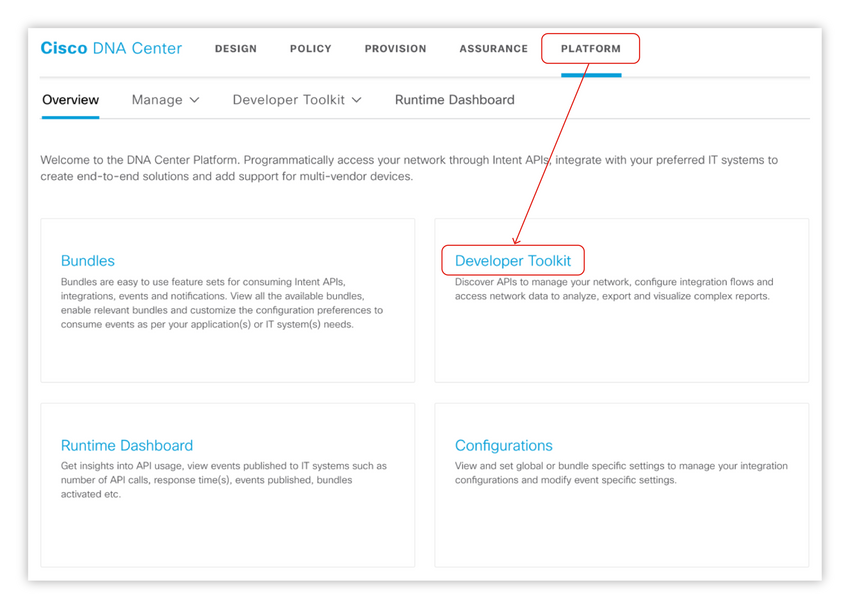
<!-- https://contenthub.netacad.com/courses/devnet/1e7f15f0-b0f6-11ea-983b-a3f6821d6983/1e92c500-b0f6-11ea-983b-a3f6821d6983/assets/99743632-c09d-11ea-ae1e-a733eb29b8ad.png -->


### Описание метода, URI и параметры

Оба источника документации перечисляют все доступные методы API и предоставляют описание, параметры запроса, структуры ответа и диапазон возможных кодов ответа HTTP.

(Документация DevNet организована по группам поддоменов. Инструментарий разработчика платформы графического интерфейса пользователя организован по домену: поддомен.)

### Поддомен DevNet Intent API

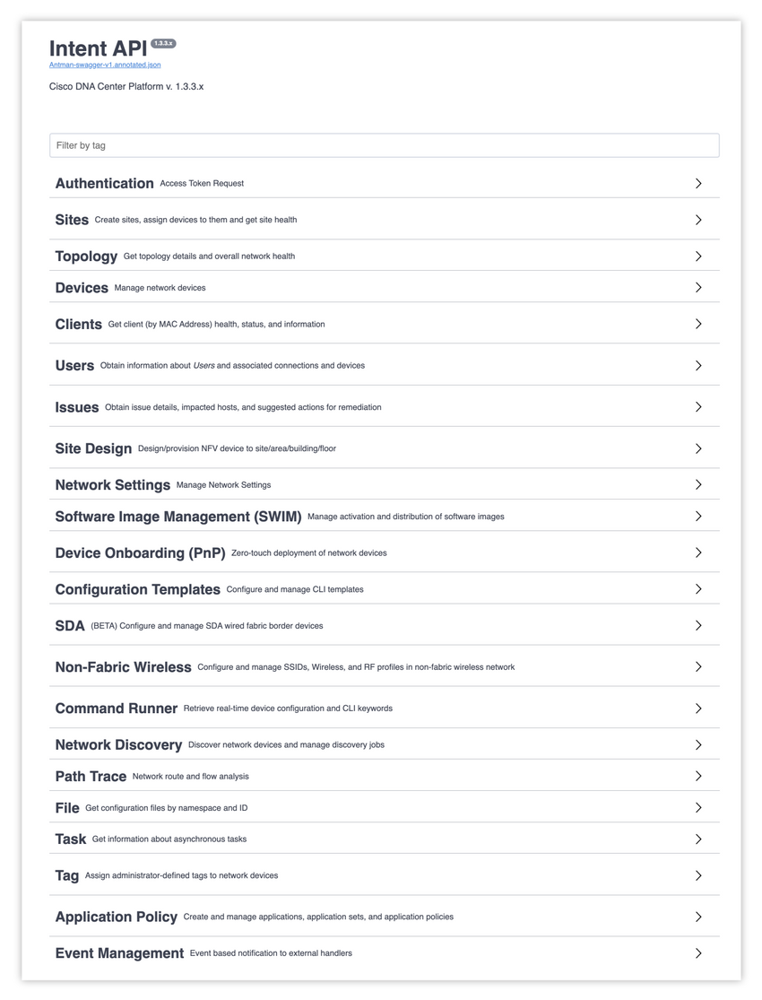
<!-- https://contenthub.netacad.com/courses/devnet/1e7f15f0-b0f6-11ea-983b-a3f6821d6983/1e92c500-b0f6-11ea-983b-a3f6821d6983/assets/99743633-c09d-11ea-ae1e-a733eb29b8ad.png -->


Если щелкнуть любое из имен поддоменов, откроется список методов, связанных с этим поддоменом.

### Методы сайта DevNet Intent API

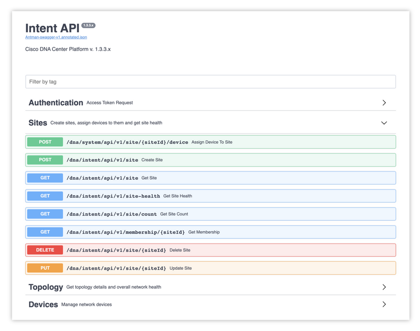
<!-- https://contenthub.netacad.com/courses/devnet/1e7f15f0-b0f6-11ea-983b-a3f6821d6983/1e92c500-b0f6-11ea-983b-a3f6821d6983/assets/99743634-c09d-11ea-ae1e-a733eb29b8ad.png -->


Щелкните любой из отдельных методов, чтобы просмотреть документацию по этому конкретному методу. Каждый API будет иметь имя и описание, параметры запроса и его структура будут показаны и задокументированы, а структуры ответов и коды ответов задокументированы.

В двух наборах документации эта информация отображается немного по-разному. В документации метода DevNet URI метода приводится в сокращенном формате, показывая только суффикс URL. В коде, при фактическом выполнении вызова API, URI должен иметь префикс с конкретным URL-адресом центра ДНК. Инструментарий разработчика платформы графического интерфейса пользователя включает конкретный расширенный URL-адрес, использующий IP-адрес Центра ДНК.

Документация для метода GET Site показана ниже, как видно из DevNet и GUI Platform: Developer Toolkit.

### DevNet Get Site Method Detail

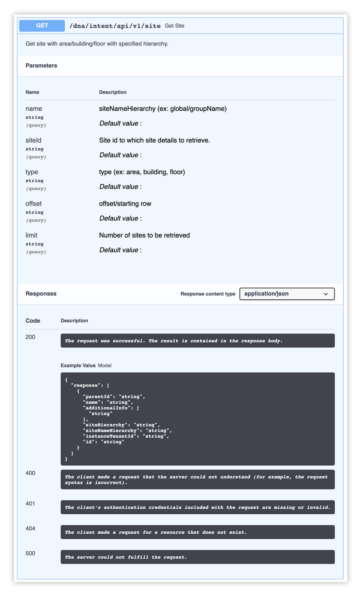
<!-- https://contenthub.netacad.com/courses/devnet/1e7f15f0-b0f6-11ea-983b-a3f6821d6983/1e92c500-b0f6-11ea-983b-a3f6821d6983/assets/99743635-c09d-11ea-ae1e-a733eb29b8ad.png -->


### Инструментарий разработчика платформы GUI Получить сведения о методе сайта


<!-- https://contenthub.netacad.com/courses/devnet/1e7f15f0-b0f6-11ea-983b-a3f6821d6983/1e92c500-b0f6-11ea-983b-a3f6821d6983/assets/99743636-c09d-11ea-ae1e-a733eb29b8ad.png -->


Все методы Intent API отвечают полезной нагрузкой содержимого в формате JSON. Каждая структура ответа описана в документации.

Код ответа HTTP указывает на успех или сбой запроса.

<!-- 8.4.5 -->
## Cisco DNA Center - Создать (POST) - Обновить (PUT)

Методы Intent API PUT и POST требуют полезной нагрузки запроса JSON. Они задокументированы в описании каждого метода.

Запросы POST и PUT обрабатываются в Cisco DNA Center асинхронно, что означает, что запрос на добавление, создание или изменение ресурса инициируется правильно сформированным запросом, но не обязательно завершается до ответа. На успешно инициированный запрос отвечает структура, содержащая `ExecutionId`, `ExecutionStatusUrl`, и статус `message`.

Статус завершения можно получить с помощью методов API задач для отслеживания завершения выполнения. Методы файлового API используются для получения дополнительных результатов после успешного завершения выполнения.

Эта часть модуля работает только с методами GET, доступными только для чтения. Методы POST, PUT и DELETE, которые изменяют целевую сеть, выходят за рамки этой части курса.

### Документация

Документация по Cisco DNA Center разбита на несколько отдельных руководств. Для получения дополнительной информации обратитесь к соответствующим опубликованным руководствам.

См. Руководства пользователя Cisco DNA Center для получения последних редакций следующего:

* Руководство пользователя Cisco DNA Center
* Руководство пользователя Cisco DNA Assurance
* Руководство по интеграции Cisco DNA ITSM
* Руководство пользователя платформы Cisco DNA Center

См. Руководства по обслуживанию и эксплуатации Cisco DNA Center для получения последней версии следующего:

* Руководство администратора Центра архитектуры цифровой сети Cisco
* Руководство по обеспечению высокой доступности Cisco DNA Center

См. Руководства по установке и обновлению Cisco DNA Center для получения последней версии следующего:

* Руководство по установке устройства Cisco DNA Center второго поколения
* Руководство по установке устройства Cisco DNA Center первого поколения
* Руководство по обновлению Cisco DNA Center

<!-- 8.4.6 -->
## Видео - доступ к Cisco DNA Center с помощью REST API в Python


10:49

<!-- 8.4.7 -->
## Cisco ACI

Платформа Cisco Application Centric Infrastructure (ACI), работающая на оборудовании Nexus 9000, представляет собой решение Cisco для программно-определяемых сетей (SDN). Централизованная система управления - это Application Policy Infrastructure Controller (APIC), кластер контроллеров. APIC обеспечивает автоматизацию и управление, программирование политик, развертывание приложений и мониторинг состояния фабрики. С APIC вы получаете унифицированную работу как физической, так и виртуальной или программной инфраструктуры. Эта платформа помогает сетевым инженерам и разработчикам программно управлять сетями.

Вместо открытия подмножества сетевых функций через программные интерфейсы, вся инфраструктура ACI открывается для программного доступа. Эта целостность достигается за счет предоставления доступа к объектной модели Cisco ACI. Объектная модель ACI представляет полную конфигурацию и состояние выполнения каждого программного и аппаратного компонента во всей инфраструктуре. Объектная модель доступна через стандартные интерфейсы REST API, что упрощает доступ и управление конфигурацией и состоянием времени выполнения системы. API принимает и возвращает сообщения HTTP или HTTPS, содержащие документы JSON или XML. Вы можете использовать любой язык программирования для создания сообщений и документов JSON или XML, содержащих описания методов API или управляемых объектов (MO).

Распространенным сценарием автоматизации сети является управление сетью с помощью тех же инструментов, что и для другой инфраструктуры. Комбинируя модели данных ACI с такими инструментами DevOps, как Ansible, Chef или Puppet, вы можете комплексно управлять своей инфраструктурой с учетом приложений. Вы также можете создать интеграцию с другими инструментами управления, безопасности, политик и мониторинга.

> **Примечание**: Вместо режима ACI коммутаторы Nexus 9000 могут быть настроены в режиме NX-OS для доступа к API уровня устройства. В режиме NX-OS вы можете управлять коммутаторами как устройством Linux.

### Варианты использования ACI

Общие варианты использования включают:

* Возможность программирования как единой структуры с доступом к объектным моделям для чтения и записи, представляющим все атрибуты в системе.
* Желаемое состояние определено и принудительно.
* Расширение до общедоступных облаков AWS или Azure (через Multi-Site Orchestrator (MSO) и его API)

Пример пошагового руководства может включать в себя проверку конкретного клиента, постоянный мониторинг того, изменяется ли он, и, если он изменяется, обновление конфигурации до желаемого состояния.

### Инструменты, используемые с ACI

В дополнение к стандартному интерфейсу REST Cisco предоставляет несколько инструментов или сред с открытым исходным кодом, таких как набор инструментов ACI, Cobra (Python), ACIrb (Ruby), Puppet и Ansible для автоматизации и программирования APIC. Помимо REST API также есть интерфейс командной строки и графический интерфейс для повседневного администрирования.

> **Примечание**:Вышеупомянутые инструменты также доступны для доступа к Multi-Site Orchestrator (MSO) для гибридных облаков. API MSO отличается от ACI, последний используется для доступа к частной структуре ACI через его контроллер интерфейса политики приложений (APIC).

### Cobra (Cisco ACI) Python SDK

Cobra SDK предоставляет вам доступ ко всем функциям REST с использованием собственных привязок Python. Объекты в Cobra являются однозначным представлением Дерева информации управления (MIT). Документацию по установке Cobra можно найти по адресу h ttp: //cobra.readthedocs.org. SDK предлагает методы Python, соответствующие методам REST, которые используются в графическом интерфейсе пользователя, например, показанным в API Inspector. Он предлагает полную функциональность и подходит для сложных запросов, включая устройства уровней 4-7, начальные сборки фабрики и т. Д.

### Набор инструментов Cisco ACI

Этот набор инструментов представляет собой набор библиотек Python, которые вы можете использовать для базовой настройки подмножества объектной модели. Доступно на GitHub по адресу h ttps: //github.com/datacenter/acitoolkit. Этот набор предоставляет небольшое подмножество объектной модели Cisco APIC, в отличие от полных функций Cobra SDK.

### Адаптер APIC REST Python (ARYA)

Этот инструмент преобразует объекты XML/JSON в эквивалентный код Python. Часто люди используют его со встроенным в продукт API Inspector. Обратите внимание, что инструмент не проверяет цели и не выполняет поиск. Документация доступна по адресу https://developer.cisco.com/docs/aci/#!Arya.

### ACIrb

Этот инструмент обеспечивает реализацию Cisco APIC REST API на основе Ruby. Он позволяет напрямую управлять MIT через REST API с использованием стандартных шаблонов языка Ruby.

### CLI

ACI также предлагает интерфейс командной строки в стиле NX-OS для настройки и управления ACI традиционным способом. Moquery - это инструмент запроса объектной модели CLI, а Visore - это браузер хранилища объектов (GUI).

### Инспектор API

Когда вы выполняете задачу в графическом интерфейсе пользователя Cisco APIC, графический интерфейс создает и отправляет сообщения внутреннего API в операционную систему для выполнения задачи. Используя API Inspector, который является встроенным инструментом Cisco APIC, вы можете просматривать и копировать эти сообщения API. Администратор может реплицировать эти сообщения для автоматизации ключевых операций, или вы можете использовать сообщения в качестве примеров для разработки внешних приложений, которые будут использовать API.

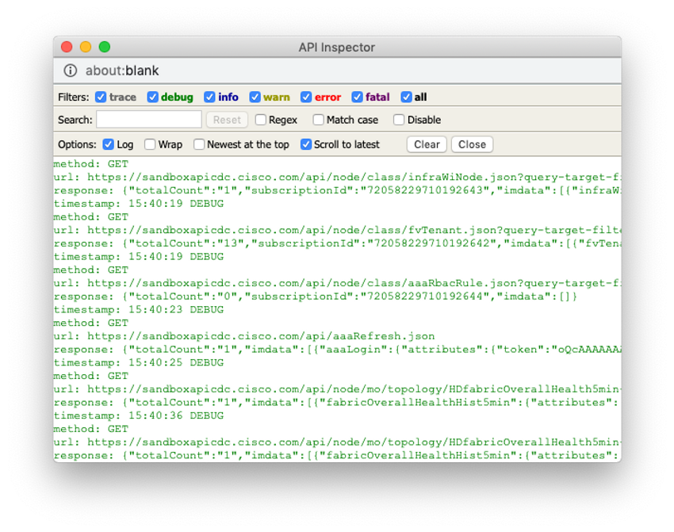
<!-- https://contenthub.netacad.com/courses/devnet/1e7f15f0-b0f6-11ea-983b-a3f6821d6983/1e92c500-b0f6-11ea-983b-a3f6821d6983/assets/99743637-c09d-11ea-ae1e-a733eb29b8ad.png -->

<!-- 8.4.8 -->
## Cisco ACI - модули Ansible

### Модули Ansible для ACI (и MSO)

Cisco и более широкое сообщество совместно работали над широким набором модулей с открытым исходным кодом для Ansible, позволяющих настраивать и управлять структурами ACI как кодом, наряду с другими ресурсами, управляемыми Ansible. Также были созданы модули для обращения к многосайтовым и гибридным облачным ресурсам через API-интерфейсы Multi-Site Orchestrator (MSO). Ansible предоставляет полный указатель модулей со ссылками на документацию.

Модули ACI/MSO позволяют просто создавать элементы playbook для выполнения задач запроса, администрирования и управления в структуре ACI. Например, следующая задача, взятая из документации Ansible, идемпотентно гарантирует, что данная учетная запись клиента существует (создавая ее, если нет). Он использует модуль aci_tenant, который предоставляет ряд функций управления арендаторами.

```
- name: Ensure tenant customer-xyz exists
  aci_tenant:
    host: my-apic-1
    username: admin
    password: my-password
    tenant: customer-xyz
    description: Customer XYZ
    state: present
```

### Пример Cisco ACI REST API

С помощью REST API у вас есть интерфейс к MIT, позволяющий управлять состоянием объектной модели. APIC CLI, GUI и SDK используют один и тот же интерфейс REST API, поэтому при отображении информации данные считываются через REST API, а при внесении изменений в конфигурацию они записываются через REST API. Дополнительные данные, доступные с помощью API, включают статистику, сбои и события аудита. С помощью WebSockets API даже предоставляет средства подписки на push-уведомления о событиях. Когда в MIT происходит изменение, API может отправить уведомление о событии.

APIC REST API поддерживает стандартные методы, такие как операции POST, GET и DELETE через HTTP. Методы POST и DELETE являются идемпотентными, то есть операцию можно повторить без дополнительных эффектов при вызове с теми же входными параметрами. Метод GET является нулевым, что означает, что его многократное выполнение имеет тот же эффект, что и нулевое (нулевое или никогда) выполнение. По сути, вызов GET - это операция только для чтения.

Интерфейс REST принимает полезные данные к ресурсам и от них с кодировкой XML или JSON. Для XML операция кодирования проста: тег элемента - это имя пакета и класса, и любые свойства этого объекта указываются как атрибуты этого элемента. Вы создаете дочерние элементы в XML для определения вложенности в модели.

Любые данные в MIT можно описать как автономный структурированный текстовый древовидный документ, закодированный в XML или JSON. Благодаря этой информационной модели Cisco ACI хорошо вписывается в дизайн REST API: URL-адреса и URI сопоставляются непосредственно с отличительными именами (DN), которые идентифицируют объекты в дереве, а объекты имеют родительско-дочерние отношения, также идентифицируемые с помощью отличительных имен и свойств. Это делает REST API полезным для чтения и изменения данных с помощью набора операций Create, Read, Update, Delete (CRUD).

Вы получаете доступ к этим объектам для извлечения данных объекта Cisco APIC и управления ими с помощью стандартных команд HTTP и четко определенного URL-адреса REST.

Отличительное имя (DN)- Определяет конкретный целевой объект, позволяя сопоставить имя непосредственно с URL-адресами.

Относительное имя (РН)- Называет объект отдельно от его братьев и сестер в контексте родительского объекта.

Экземпляры объектов называются управляемыми объектами (MO). Каждую MO в системе можно идентифицировать по уникальному DN. С помощью MO и его DN вы можете ссылаться на любой объект глобально. Помимо DN, вы можете ссылаться на каждый объект по его RN. RN идентифицирует объект относительно его родительского объекта.

Вы можете использовать либо RN, либо DN для доступа к объекту, в зависимости от текущего местоположения в MIT. Вы можете запросить дерево несколькими способами, поскольку оно является иерархическим. Затем объедините иерархию с системой атрибутов для дальнейшей идентификации объекта. Вы можете выполнить запрос объекта через его DN или класс объектов, таких как шасси коммутатора, или на уровне дерева, чтобы обнаружить все связанные члены объекта.

<!-- 8.4.9 -->
## Формат URL-адреса Cisco ACI

### Формат URL ACI


<!-- /courses/devnet/1e7f15f0-b0f6-11ea-983b-a3f6821d6983/1e92c500-b0f6-11ea-983b-a3f6821d6983/assets/99743638-c09d-11ea-ae1e-a733eb29b8ad.svg -->
Вероятно, это легче понять на нескольких рабочих примерах. Представьте себе представление формата URL следующим образом:

* **http:// | https://**:: По умолчанию включен только HTTPS.
* **узел**: Этот компонент является именем хоста или IP-адресом контроллера APIC, например «SandboxAPIC».
* **порт**: Этот компонент представляет собой номер порта для связи с контроллером APIC, если настроен нестандартный порт.
* **api**: Эта буквальная строка (api) указывает, что сообщение направлено в API.
* **mo | class**: Этот компонент определяет цель операции как управляемый объект или класс объектов.
* **DN**: Этот компонент является DN целевого управляемого объекта, например, topology/pod-1/node-201.
* **className**: Этот компонент представляет собой имя целевого класса, связанного из пакета и класса в контексте пакета, например, `dhcp:Client` является `dhcpClient`. ClassName может быть определено в содержимом DN, например, `topology/pod-1/node-1`.
* **json | xml**: Этот компонент определяет формат кодировки тела команды или ответа как JSON или XML.
* **?параметры**: Этот компонент включает в себя дополнительные фильтры, селекторы или модификаторы запроса. Несколько операторов опций соединены знаком амперсанда (`&`).

URI обеспечивает доступ к целевому ресурсу. Первые два раздела URI запроса определяют протокол и детали доступа APIC. Буквальная строка `api`, указывает, что API должен быть вызван. В следующем разделе пути URI указывается, предназначена ли операция для управляемого объекта или класса.

Следующим по пути идет либо полностью определенное DN для объектных запросов, либо имя пакета и класса для запросов на основе классов. Последняя обязательная часть URI запроса - это формат кодирования: либо `.xml` или `.json`.

REST API поддерживает широкий спектр гибких фильтров, полезных для сужения области поиска и ускорения поиска информации. Сами фильтры добавляются как параметры URI запроса, начиная с вопросительного знака (`?`) и соединены с амперсандом (`&`). Присоединяйтесь к нескольким условиям, если хотите сформировать сложные фильтры.

Имея возможность адресовать отдельный объект или класс объектов с помощью URL-адреса REST, система обеспечивает полный программный доступ ко всему дереву объектов и ко всей системе.

Один из наиболее распространенных вариантов использования этого API - мониторинг Cisco ACI Fabric. Упреждающий мониторинг - очень важная часть работы сетевого администратора, но им часто пренебрегают, потому что тушение пожаров в сети обычно имеет приоритет. Однако, поскольку APIC невероятно упрощает сбор статистики и выполнение анализа, он экономит время и нервы сетевых администраторов.

Например, если вы хотите узнать подробности обо всех доступных узлах коммутационной сети (оконечные и спиновые коммутаторы Cisco ACI) на узле `devasc-aci-1.cisco.com`, включая состояние, IP-адрес и т. д., вы можете использовать следующий вызов API-интерфейса Cisco ACI REST:

### GET https://devasc-aci-1.cisco.com/api/node/class/fabricNode.json

```json
Response code: 200
Response body:
{
    "totalCount": "6,"
    "imdata": [
        {
            "fabricNode": {
                "attributes": {
                    "adSt": "on,"
                    "address": "10.0.240.32,"
                    "annotation": ","
                    "apicType": "apic,"
                    "childAction": ","
                    "delayedHeartbeat": "no,"
                    "dn": "topology/pod-1/node-101,"
                    "extMngdBy": ","
                    "fabricSt": "active,"
                    "id": "101,"
                    "lastStateModTs": "2019-11-17T15:32:30.294+00:00,"
                    "lcOwn": "local,"
                    "modTs": "2019-11-17T15:32:53.511+00:00,"
                    "model": "N9K-C9396PX,"
                    "monPolDn": "uni/fabric/monfab-default,"
                    "name": "leaf-1,"
                    "nameAlias": ","
                    "nodeType": "unspecified,"
                    "role": "leaf,"
                    "serial": "TEP-1-101,"
                    "status": ","
                    "uid": "0,"
                    "vendor": "Cisco Systems, Inc,"
                    "version": ""
                }
            }
        },
        ...
```

Помимо ручных запросов, вы можете автоматически собирать информацию, а затем применять политики, сводя к минимуму возможность человеческой ошибки. Как вы можете видеть на рисунке ниже, когда вы начинаете использовать автоматизацию при мониторинге структуры ACI, вы можете создавать различные приложения, которые могут выполнять различные задачи, если в сети есть определенные изменения.

### Упреждающий мониторинг сети ACI

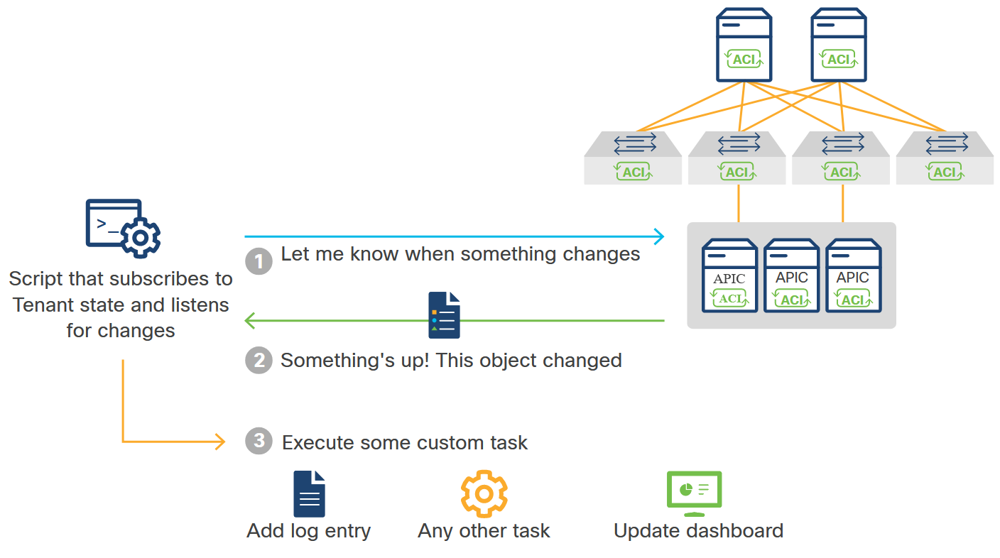
<!-- /courses/devnet/1e7f15f0-b0f6-11ea-983b-a3f6821d6983/1e92c500-b0f6-11ea-983b-a3f6821d6983/assets/99743639-c09d-11ea-ae1e-a733eb29b8ad.svg -->
<!-- 8.4.10 -->
## Cisco ACI Cobra

Как вы видели, платформа Cisco ACI имеет надежный REST API. Однако использование необработанного API может быть утомительным и обременительным. Это потому, что вам нужно знать и настраивать низкоуровневые детали, такие как используемый HTTP-глагол, поддерживаемый URI, заголовки и кодировка. Кроме того, было бы важно закодировать обработку ошибок в пользовательском коде с использованием собственного REST API.

Чтобы упростить разработку приложений с помощью ACI, Cisco разработала Cobra, надежную библиотеку Python для API APIC REST. Объекты в библиотеке Cobra (SDK) сопоставляют 1: 1 с объектами в Cisco ACI MIT. Если вы планируете глубже погрузиться в Cobra, лучше всего начать с официальной документации Cobra. В этих документах рассматривается все, от установки до демонстрации примеров, и даже есть раздел с часто задаваемыми вопросами, чтобы побудить людей начать тестирование Cobra.

Чтобы получить доступ к APIC с помощью Cobra, вы должны войти в систему с действительными учетными данными. В настоящее время Cobra поддерживает аутентификацию на основе имени пользователя и пароля в дополнение к аутентификации на основе сертификатов. Чтобы внести изменения в конфигурацию, у вас должны быть права администратора в домене, в котором вы будете работать. Успешный вход в систему возвращает ссылку на объект каталога, который вы будете использовать для дальнейших операций.

Вы можете использовать Cobra SDK для управления MIT с помощью этого рабочего процесса:

* Определите объект, которым нужно манипулировать.
* Создайте запрос на чтение, изменение атрибутов или добавление или удаление дочерних элементов.
* Зафиксируйте изменения, внесенные в объект.


<!-- /courses/devnet/1e7f15f0-b0f6-11ea-983b-a3f6821d6983/1e92c500-b0f6-11ea-983b-a3f6821d6983/assets/9974363a-c09d-11ea-ae1e-a733eb29b8ad.svg -->

Обычный рабочий процесс для получения данных с помощью Cobra выглядит следующим образом:

1.	Создайте объект сеанса.
2.	Войдите в Cisco APIC.
3.	Выполните поиск по классу или DN.

Стандартный рабочий процесс для настройки Cisco ACI Fabric выглядит следующим образом:

1.	Создайте объект сеанса.
2.	Войдите в Cisco APIC.
3.	Создайте объект конфигурации.
4.	Создайте объект запроса конфигурации.
5.	Добавьте свой объект конфигурации в запрос.
6.	Зафиксируйте.

### Резюме

Теперь у вас есть несколько мощных инструментов для исследования и использования с Cisco ACI. Используя базовый REST API и стандартную модель данных плюс иерархию, вы можете управлять и контролировать множество инфраструктур, как виртуальных, так и аппаратных.

<!-- 8.4.11 -->
## Видео - доступ к Cisco APIC с помощью REST API в Python


7:29

<!-- 8.4.12 -->
## Cisco Meraki

Cisco Meraki - это набор сетевых решений с облачным управлением, которые обеспечивают единый источник управления инфраструктурой, местоположениями и устройствами.

Компоненты включают:

* Integration API
* Полное решение сетевой инфраструктуры с облачным управлением
* Беспроводная связь, коммутация, безопасность, SD-WAN, управление мобильными устройствами (MDM) и интеллектуальные камеры
* Интегрированное оборудование, программное обеспечение и облачные сервисы


<!-- /courses/devnet/1e7f15f0-b0f6-11ea-983b-a3f6821d6983/1e92c500-b0f6-11ea-983b-a3f6821d6983/assets/92480f52-4d63-47fa-9855-0e654656c297.svg -->

### Meraki Integrations

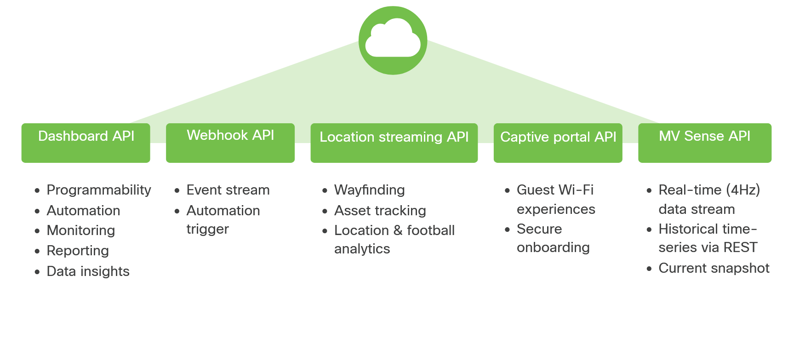
<!-- /courses/devnet/1e7f15f0-b0f6-11ea-983b-a3f6821d6983/1e92c500-b0f6-11ea-983b-a3f6821d6983/assets/9974363c-c09d-11ea-ae1e-a733eb29b8ad.svg -->

Служба корпоративной облачной сетевой инфраструктуры Meraki имеет пять различных API для интеграции:

* **Dashboard API** - Это служба RESTful для инициализации, управления и мониторинга устройств.
* **Webhook API** - Это система уведомлений в реальном времени для сетевых предупреждений, охватывающих события и состояние сети.
* **Location Streaming API** - Это метод HTTP POST, предоставляющий информацию о местоположении клиента Wi-Fi и Bluetooth (GPS, X/Y) на основе расположения точки доступа Meraki (AP) и уровня сигнала клиента.
* **API внешнего адаптивного портала (EXCAP)** - Это позволяет организации создавать индивидуальные модели взаимодействия в точках доступа Wi-Fi.
* **MV Sense API** - Это комбинация API REST и потока MQTT в реальном времени, поддерживающая контроль физического пространства.

### API Meraki Dashboard

Cisco Meraki Dashboard API - это RESTful API, который использует HTTPS для транспорта и JSON для сериализации объектов.

> **Примечание**: Эти инструкции являются только примером. Для выполнения этих шагов вы должны быть пользователем с правами администратора в организации Meraki. У организации Meraki, участвующей в этом курсе, уже есть доступ к API, и ключ API предоставляется в примерах.

1.	Чтобы предоставить доступ к API для организации, сначала включите API для организации в разделе **Organization › Settings**.


<!-- https://contenthub.netacad.com/courses/devnet/1e7f15f0-b0f6-11ea-983b-a3f6821d6983/1e92c500-b0f6-11ea-983b-a3f6821d6983/assets/9974363d-c09d-11ea-ae1e-a733eb29b8ad.png -->

2.	Прокрутите вниз.


<!-- https://contenthub.netacad.com/courses/devnet/1e7f15f0-b0f6-11ea-983b-a3f6821d6983/1e92c500-b0f6-11ea-983b-a3f6821d6983/assets/9974363e-c09d-11ea-ae1e-a733eb29b8ad.png -->

3.	После включения API перейдите на страницу **My Profile**, чтобы сгенерировать ключ API. Ключ API связан с учетной записью администратора Meraki Dashboard. Ключ API можно сгенерировать, отозвать и восстановить для профиля пользователя. **Ключ API необходимо хранить в безопасности**, поскольку он обеспечивает аутентификацию для всех организаций, в которых включен API. Если ключ API является общим, его можно восстановить в любой момент. При повторном создании ключа предыдущий ключ API отменяется.

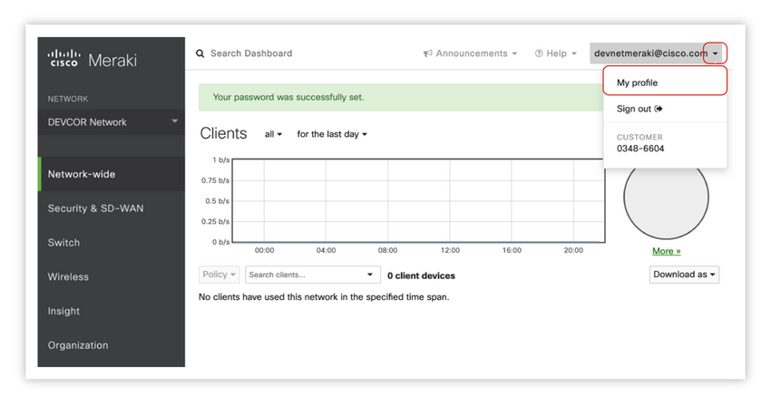
<!-- https://contenthub.netacad.com/courses/devnet/1e7f15f0-b0f6-11ea-983b-a3f6821d6983/1e92c500-b0f6-11ea-983b-a3f6821d6983/assets/9974363f-c09d-11ea-ae1e-a733eb29b8ad.png -->


<!-- https://contenthub.netacad.com/courses/devnet/1e7f15f0-b0f6-11ea-983b-a3f6821d6983/1e92c500-b0f6-11ea-983b-a3f6821d6983/assets/99743640-c09d-11ea-ae1e-a733eb29b8ad.png -->

### Авторизация

Каждый запрос должен указывать ключ API через заголовок запроса. API вернет 404 (а не 403) в ответ на запрос с отсутствующим или неправильным ключом API. Такое поведение предотвращает утечку даже существования ресурсов неавторизованным пользователям.

```
X-Cisco-Meraki-API-Key: <secret key>
```

### Примеры вызовов Meraki API

### Вызов API для получения списка организаций

Ниже приводится `curl` пример, который получает список организаций для ключа API, указанного в `X-Cisco-Meraki-API-Key`. Вы можете скопировать и запустить их в своем терминале, если у вас есть `curl` установлен.

```
curl --request GET -L \
  --url https://api.meraki.com/api/v0/organizations \
  --header 'X-Cisco-Meraki-API-Key: 8f90ecec4fca692f606092279f203c6020ca011c'
```

Результат похож на этот, хотя в JSON может быть указано больше организаций:

```
[
   {
      "id":"566327653141842188",
      "name":"DevNetAssoc",
      "url":"https://n6.meraki.com/o/dcGsWag/manage/organization/overview"
   }
]
```

Обратите внимание, что запрос перенаправляется аргумент `–L`. Ответ HTTP 302 (найден/перенаправлен) действителен для любого запроса, включая те, которые могут изменять состояние, например `DELETE`, `POST`, а также `PUT`. Клиентские приложения должны поддерживать перенаправление. Параметр `–url` содержит Meraki API, который вы вызываете. Параметр `--header` содержит ключ API, который разрешает вызов API. Эти примеры следуют той же схеме.

### Вызов API для получения метаданных организации

Следующий звонок – это пример `curl` получения метаданных о конкретной организации с использованием идентификатора из приведенного выше результата:

```
curl --request GET -L \
  --url https://api.meraki.com/api/v0/organizations/566327653141842188 \
  --header 'X-Cisco-Meraki-API-Key: 8f90ecec4fca692f606092279f203c6020ca011c'
```

Результат:

```
{
  "id": "566327653141842188",
  "name": "DevNetAssoc",
  "url": "https://n6.meraki.com/o/dcGsWag/manage/organization/overview"
}
```

### Вызов API для вывода списка сетей

Последующий пример `curl` показывает, как составить список сетей в организации.

```
curl --request GET -L \
  --url https://api.meraki.com/api/v0/organizations/566327653141842188/networks \
  --header 'X-Cisco-Meraki-API-Key: 8f90ecec4fca692f606092279f203c6020ca011c'
```

Результат похож на этот JSON:

```
[
    {
        "id": "L_566327653141858435",
        "organizationId": "566327653141842188",
        "name": "DevNetAssoc1",
        "timeZone": "America/Los_Angeles",
        "tags": null,
        "productTypes": [
            "appliance",
            "switch",
            "wireless"
        ],
        "type": "combined",
        "disableMyMerakiCom": false,
        "disableRemoteStatusPage": true
    },
    {
        "id": "L_566327653141858436",
        "organizationId": "566327653141842188",
        "name": "DevNetAssoc2",
        "timeZone": "America/Los_Angeles",
        "tags": null,
        "productTypes": [
            "appliance",
            "switch",
            "wireless"
        ],
        "type": "combined",
        "disableMyMerakiCom": false,
        "disableRemoteStatusPage": true
    },
    {
        "id": "L_566327653141858437",
        "organizationId": "566327653141842188",
        "name": "DevNetAssoc3",
        "timeZone": "America/Los_Angeles",
        "tags": null,
        "productTypes": [
            "appliance",
            "switch",
            "wireless"
        ],
        "type": "combined",
        "disableMyMerakiCom": false,
        "disableRemoteStatusPage": true
    },
    {
        "id": "L_566327653141858438",
        "organizationId": "566327653141842188",
        "name": "DevNetAssoc4",
        "timeZone": "America/Los_Angeles",
        "tags": null,
        "productTypes": [
            "appliance",
            "switch",
            "wireless"
        ],
        "type": "combined",
        "disableMyMerakiCom": false,
        "disableRemoteStatusPage": true
    }
]
```

### Оповещения Meraki Webhook

Веб-перехватчики предоставляют POST-запрос на конкретный URL-адрес при соблюдении определенного критерия. С помощью веб-перехватчиков Meraki вы можете настроить системы, которые подписываются на оповещения Meraki Cloud. Вы настраиваете, какие сетевые предупреждения и события могут автоматически запускать следующее действие.

Оповещения, отправляемые с помощью веб-перехватчиков Meraki, различаются по частоте в зависимости от различных факторов. Может потребоваться время вычисления или задержка, необходимая для агрегирования нескольких событий перед доставкой предупреждения. Вы также можете настроить пороговое значение времени, например ожидание простоя в течение пяти минут перед отправкой сообщения.

Вы можете рассчитать срок доставки, сравнив значения параметров `occurredAt` и `sentAt`.

Дополнительные сведения о веб-перехватчиках Meraki, настройке панели инструментов и инструментах интеграции см. В документации к веб-перехватчикам Meraki.

<!-- 8.4.13 -->
## API сканирования местоположения Cisco Meraki

Облако Meraki использует физическое расположение точек доступа (с помощью карты и плана этажа на панели инструментов) для оценки местоположения клиента. Это следует рассматривать как оценку наилучшего усилия, поскольку координаты географического местоположения (широта, долгота) и точность данных местоположения по осям X, Y могут варьироваться в зависимости от ряда факторов. К ним относятся размещение точки доступа, условия окружающей среды и ориентация клиентского устройства. Эксперименты могут помочь повысить точность результатов или определить максимально допустимую неопределенность для точек данных.

### Аналитика местоположения

API сканирования местоположения может использоваться розничными магазинами с несколькими местоположениями, развертываниями конференций, где информация о местоположении может быть полезна для посетителей, или развертываниями, где бизнес хочет знать тенденции в взаимодействии с пользователями. Вы можете прочитать о включении API для обнаружения устройств в реальном времени в документации для разработчиков.

### Bluetooth Scanning API

Примеры устройств Bluetooth с низким энергопотреблением (BLE) включают беспроводные наушники, беспроводные клавиатуры и мыши, контроллеры видеоигр, маячки с батарейным питанием, аппаратные устройства Apple iBeacon, фитнес-мониторы и удаленные датчики. Точки доступа Meraki (AP) могут обнаруживать эти устройства, когда они находятся поблизости. Эти данные о местоположении могут быть интегрированы со сторонними приложениями.

Чтобы включить определение местоположения устройства BLE, включите радиомодуль сканирования BLE на точках доступа. Сканирование BLE можно включить в Wireless › Bluetooth Settings › Scanning.

### Расположение и конфиденциальность

Из-за конфиденциального характера данных о местоположении с точными MAC-адресами как частью этих данных, Meraki хранит только хешированную версию MAC-адреса. Он реализован таким образом, что ни один алгоритм не может восстановить исходный MAC-адрес клиента.

Вы можете прочитать подробную информацию о защите личности при использовании Meraki, а также о механизмах подписки и отказа в документации Meraki Location and Privacy. Глобальный отказ Meraki доступен по адресу https://account.meraki.com/optout.

Смарт-камеры Meraki могут выполнять обнаружение, классификацию и отслеживание объектов непосредственно на границе сети, обеспечивая выполнение вычислительных задач конечной точке.

Через конечные точки REST и MQTT API приложения могут запрашивать или подписываться на исторические, текущие данные или данные в реальном времени, созданные камерой, чтобы использовать камеру не только в целях безопасности. Когда вы получаете доступ к конечным точкам API в MV Sense, вы получаете доступ к данным машинного обучения/компьютерного зрения для использования в приложениях.

### Категории API камеры

Для использования доступен ряд API камеры:

* **MV Sense** - Это включает в себя конечные точки REST и MQTT API, которые предоставляют исторические данные об обнаружении людей и световые показания в реальном времени. См. Документацию по API MV Sense.
* **Live Link API** - REST API, который возвращает ссылку на панель управления для указанной камеры. Если ссылка включает отметку времени, она предоставляет данные за это время. Получить документацию по API сетевой видеокамеры
* **Snapshot API** - REST API, который создает снимок поля зрения указанной камеры в определенное время и возвращает ссылку на это изображение. Создание документации API снимков сетевой камеры

### REST против MQTT API

В коллекции конечных точек API MV Sense доступны два разных типа конечных точек API; На основе REST и MQTT.

**RESTful API** предлагает услугу по запросу. Соединение будет выполнено только при запросе данных. Использование API-интерфейсов MV Sense REST позволяет получать данные об обнаружении людей с камеры в прошлом или почти в реальном времени.

**Протоколы на основе MQTT** используют соединение публикации-подписки между клиентом и сервером. В случае MV Sense сервер постоянно отправляет сообщения на интеллектуальные камеры MV, поэтому устройство может мгновенно реагировать. Использование API MQTT MV Sense позволяет в реальном времени получать информацию об обнаружении людей и их местонахождении. Также можно получить показания уровня освещенности.

### Примеры использования MV API

Вот несколько примеров использования API камеры:

* Обнаружение одного или нескольких человек в непосредственной близости от опасной машины и включение ближайшего предупреждающего сигнала.
* Обнаружение нескольких человек, стоящих в одном месте в течение длительного периода времени, и определение времени ожидания клиентов.
* Обеспечьте лучшее освещение рабочего места за счет интеграции показаний света среднего напряжения в интеллектуальное освещение рабочего места.

Вы, вероятно, сталкивались с "заставкой" при попытке доступа к Wi-Fi в любимой кофейне или в публичной библиотеке. Это известно как захватывающий портал. Это то, что видит пользователь, когда он впервые подключается к SSID Wi-Fi и открывает веб-браузер для серфинга в Интернете, находясь в зоне действия устройства Meraki. Настроив администрирующий портал, вы можете перенаправить весь интернет-трафик на определенный URL-адрес.

С помощью этого URL-адреса вы можете требовать от пользователей выполнения определенных действий, прежде чем их трафик сможет пройти в Интернет. Может быть, вы хотите попросить клиента выполнить различные действия:

* Заполните анкету клиентов
* Выберите и приобретите тарифный план
* Посмотрите видео рекламу
* Примите ряд условий

Все эти действия могут потребоваться до того, как клиенту будет предоставлен доступ в Интернет.

Подробнее о заставках в Руководстве по настройке Meraki Captive Portal.

<!-- 8.4.14 -->
## Видео - доступ к панели инструментов Meraki с помощью REST API в Python


12:25

<!-- 8.4.15 -->
## Платформа Cisco NX-OS

Операционная система Nexus (NX-OS) - это операционная система центра обработки данных для коммутатора Nexus.

### Преимущества и цель

С коммутаторами Nexus, работающими под управлением NX-OS, вы можете автоматически настраивать коммутаторы Cisco в центре обработки данных и управлять изменениями почти так же, как вы настраиваете сервер Linux.

Коммутаторы Nexus очень эффективны в центрах обработки данных и интегрируются со многими системами. Семейство коммутаторов Nexus использует ядро Linux. С помощью этого ядра вы можете получить доступ к среде Bash устройства и управлять коммутатором с помощью команд Linux. Вы можете управлять устройством с помощью существующих систем управления, таких как Ansible или Puppet. NX-OS совместима с родным IOS. NX-OS также предоставляет службу REST API и программный доступ на основе моделей через RESTCONF, NETCONF и OpenConfig.

### Архитектура

Cisco Open NX-OS использует собственный сетевой стек Linux вместо специально созданного стека пользовательского пространства (NetStack), который использовался в предыдущих версиях NX-OS. Действия виртуальной маршрутизации и пересылки (VRF) реализуются с использованием сетевых пространств имен Linux. Сетевые пространства имен обеспечивают те же возможности изоляции, что и VRF.

Интерфейсы коммутатора Nexus, включая физический, порт-канал, vPC, VLAN и другие логические интерфейсы, отображаются на ядро как стандартные сетевые разработки Linux.

Служба REST API предоставляется с помощью веб-сервера NGINX.

### Окружающая среда и масштаб

Коммутаторы семейства Nexus используются в центрах обработки данных по всему миру. Коммутаторы Nexus используются поставщиками услуг, обслуживая большое количество потребителей. Они эффективны и предпочитаются разработчиками, профессионалами DevOps и другими пользователями, которые хотят предоставлять модели сетевой инфраструктуры самообслуживания.

В документе Cisco Nexus 9000 Series NX-OS Verified Scalability Guide описаны ограничения конфигурации Cisco NX-OS для коммутаторов Cisco Nexus серии 9000.

### Возможности

NX-OS выполняет несколько вариантов использования конфигурации, таких как конфигурация интерфейса, конфигурация VLAN, управление VLAN и конфигурация Open Shortest Path First (OSPF).

### Среда и инструменты Linux

Стандартные инструменты Linux, такие как `ifconfig`, `ethtool`, `route`, или `tcpdump` могут использоваться для управления коммутатором Cisco Nexus с NX-OS. Вы также можете использовать `yum` (Yellowdog Updater, изменено), так как это инструмент управления пакетами и репозиториями по умолчанию для NX-OS и имеет под ним RPM. Эти же инструменты можно использовать для исправления процессов NX-OS или установки внешних или специально разработанных программ на коммутатор.

### Поддержка контейнера

NX-OS поддерживает запуск контейнеров Linux (LXC) непосредственно на платформе. Он обеспечивает доступ к гостевой оболочке на основе CentOS 7, которая поддерживает настраиваемые функции непосредственно на устройстве в безопасной изолированной оболочке.

### Телеметрия

Вы можете интегрировать различные приложения телеметрии, такие как Ganglia, Splunk или Nagios, на коммутаторе с NX-OS.

### Открытые программные интерфейсы NX-OS

Open NX-OS - это набор программного обеспечения, используемого для предоставления API, моделей данных и программного доступа. Это включает в себя службу NX-API REST и возможность программирования на основе моделей с использованием моделирования YANG. Интерфейсы NX-API CLI и NX-API REST API обслуживаются веб-сервером NGINX. Модель NX-API REST заимствует несколько концепций от Cisco ACI и делает их доступными для автономной среды Nexus, не основанной на ACI.

Open NX-OS включает собственную модель данных NX-OS в образ программного обеспечения. Если вы используете только Open NX-OS, вам не нужно загружать дополнительные модели.

### YANG, NETCONF и RESTCONF

NX-OS имеет полный набор как собственных, так и открытых моделей YANG, поддерживающих управление коммутатором Nexus. Список поддерживаемых моделей включает собственные модели, модели OpenConfig и Internet Engineering Task Force (IETF). Cisco NX-OS поддерживает модели YANG через интерфейсы NETCONF, RESTCONF в Open NX-OS, необходимо включить функции и установить нужные модели OpenConfig на сетевой коммутатор.

Cisco NX-OS использует агент NETCONF в качестве клиентского интерфейса для обеспечения безопасного транспорта для клиентских запросов и ответов сервера. NETCONF включен на коммутаторах Cisco Nexus серий 3000, 5000, 6000, 7000 и 9000.

### Включение функций управляемой моделью программирования в NX-OS

> **Примечание**: Эти инструкции применимы к Open NX-OS 9.2.1+. Предыдущие версии Open NX-OS требовали ручной установки и активации RPM для агентов протокола. См. Руководства по программированию для вашей платформы, если вы используете более раннюю версию.

Включите следующие функции на коммутаторе с помощью интерфейса командной строки или другого метода (например, NX-API). Включите транспортные протоколы, которые вы хотите использовать.

```
feature bash-shell
 feature netconf
 feature restconf
```

Для получения дополнительной информации о моделях YANG OpenConfig для NX-OS см. NX YANG.

### OpenConfig

В коммутатор необходимо загрузить альтернативную модель OpenConfig.

Модели OpenConfig, поддерживаемые Open NX-OS, можно загрузить с агентов Cisco Artifactory Open NX-OS. Вы найдете папки для конкретных выпусков Open NX-OS, содержащие пакеты RPM для отдельных моделей, а также один RPM со всеми моделями OpenConfig.

Загрузите нужные модели на свою локальную рабочую станцию, а затем скопируйте их в переключатель Open NX-OS, где вы хотите их установить.

```
nx-osv9000-1#copy scp://developer@10.10.20.20/home/developer/Downloads/mtx-openconfig-all-1.0.0.0-9.2.1.lib32_n9000.rpm bootflash: vrf management
```

Использовать `bash-shell` в Open NX-OS для установки только что скопированных файлов RPM. Помните, что функция `bash-shell` должен быть включен на вашем коммутаторе.

```
nx-osv9000-1(config)#run bash sudo su
 bash-4.2#
 bash-4.2# cd /bootflash/
 bash-4.2# yum install mtx-openconfig-all-1.0.0.0-9.2.1.lib32_n9000.rpm
```

<!-- 8.4.16-->
## Cisco NSO

Отрасль быстро движется к сервис-ориентированному подходу к управлению сетью, когда сложные сервисы поддерживаются множеством разнообразных систем и процессов. Для управления услугами операторы переходят от управления частями оборудования к активному управлению различными аспектами услуг.

Настройка служб и затронутого оборудования являются одними из основных факторов затрат в сетях провайдеров. Тем не менее, обычная практика управления конфигурацией включает в себя повсеместную ручную работу или создание специальных сценариев. Почему мы до сих пор применяем такие методы для решения проблемы управления конфигурацией? Две основные причины - это разнообразие услуг и постоянная смена устройств. Эти две основные характеристики в некоторой степени блокируют автоматизированные решения, потому что обновление решения занимает слишком много времени, чтобы справиться с ежедневными изменениями.

Требования к срокам вывода на рынок критически важны для быстрого развертывания новой услуги; любая задержка в настройке инструментов влияет на доход.

В последние несколько лет в качестве решения появилась программно-определяемая сеть (SDN). SDN предоставляет централизованный унифицированный набор API-интерфейсов для автоматического управления сетями и службами в режиме реального времени. Преимущества включают более быстрое и точное управление сетями и услугами, что приводит к повышению производительности и снижению затрат.

Network Services Orchestrator (NSO) позволяет операторам динамически адаптировать решение для конфигурации услуг в соответствии с изменениями в предлагаемом портфеле услуг. Он реализует концепцию SDN, предоставляя логически централизованный интерфейс для сети с несколькими поставщиками.

NSO состоит из трех компонентов:

* Программируемый интерфейс на основе модели (модели YANG)
* База данных конфигурации
* Уровни абстракции устройств и сервисов

### Уровни абстракции устройств и сервисов

Используя стандартные модели данных и язык моделирования для описания сервисов и устройств, NSO может автоматизировать создание, удаление и изменение сетевых сервисов во время выполнения. NSO использует стандартизированный язык моделирования YANG для моделирования и автоматизации любого типа устройства. Сеть, которую вы моделируете, может представлять собой сочетание традиционного оборудования и виртуальных устройств на уровнях 1–7 модели OSI.

Модель данных для сервиса коррелирует определения сервиса с сетевыми операциями. Встроенный алгоритм определяет минимальные сетевые изменения, необходимые для службы, а затем выполняет их. Для моделей данных устройств NSO распознает и может работать с физическими устройствами в центре обработки данных, включая брандмауэры и другие устройства OSI с уровня 4 по 7. Он также работает с виртуальными ресурсами, включая виртуальные машины (ВМ) и сетевые модели на основе контейнеров. Контроллер Cisco Elastic Services Controller (ESC) является частью базовой платформы и предоставляет эти возможности. Кроме того, NSO может автоматизировать запуск, настройку, мониторинг и управление лицензиями виртуальных сетевых функций (VNF).

### Функциональная архитектура

Архитектура NSO логически состоит из двух уровней: диспетчера устройств, который упрощает интеграцию устройств и управляет сценариями конфигурации устройств, и диспетчера служб, который применяет изменения службы к устройствам. На приведенной ниже схеме архитектуры показаны необходимые строительные блоки для NSO для выполнения функций сетевых служб на этих уровнях. Компоненты Device Manager и Service Manager служат для разных целей, но тесно интегрированы в один механизм транзакций и базу данных.

В основе NSO лежит база данных конфигурации (CDB), которая обеспечивает постоянное хранилище данных и синхронизируется с конфигурацией устройств и служб. Он управляет отношениями между службами и устройствами и может обрабатывать изменения интерфейсов устройств. NSO обращается к отображению, работая от желаемой конфигурации службы к соответствующей конфигурации устройства и через выделенный уровень отображения.

На рисунке вверху показаны три основных раздела: проектирование сети, операции и обеспечение, а также разработчики сервисов. Поле с меткой nso содержит два блока с меткой диспетчер служб и диспетчер устройств, ведущих к цилиндру с меткой CD B. Справа от cdb находится поле с меткой диспетчер пакетов. Под ним находятся два основных блока: абстракция устройства и ESC (VNFM). В поле абстракции устройства есть три текстовых поля, каждое из которых помечено как NE D. В поле esc есть два текстовых поля: диспетчер жизненного цикла VNF и мониторинг службы VNF. Серое текстовое поле для многодоменных сетей находится внизу.

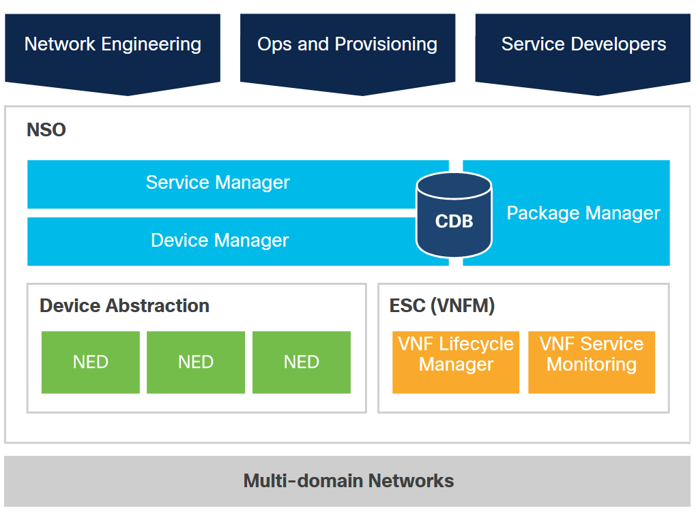
<!-- /courses/devnet/1e7f15f0-b0f6-11ea-983b-a3f6821d6983/1e92c500-b0f6-11ea-983b-a3f6821d6983/assets/99743641-c09d-11ea-ae1e-a733eb29b8ad.svg -->

Назначение диспетчера устройств - управлять различными устройствами с помощью представления YANG и NETCONF. Независимо от того, является ли интерфейс SNMP или CLI, диспетчер устройств создает последовательность транзакционных изменений для целевых устройств. Если устройство изначально поддерживает YANG и NETCONF, процесс диспетчера устройств выполняется автоматически. Устройства, отличные от NETCONF, интегрируются в диспетчер устройств с помощью драйверов сетевых элементов (NED).

Service Manager позволяет разрабатывать приложения с поддержкой служб, такие как модификация порта коммутатора, MPLS, VPN и т. Д., Для настройки устройств. Модели данных, известные как модели услуг, создаются с использованием YANG и основаны на требованиях к услуге. Сопоставление устройств с услугами можно выполнить двумя способами. В простых случаях вы указываете шаблоны конфигурации, которые преобразуют параметры службы в параметры конфигурации устройства. В сложных случаях вам необходимо запрограммировать «Логику отображения», чтобы NSO было понятно. Service Manager обрабатывает полный жизненный цикл (создание, изменение и удаление) экземпляров службы.

Пользовательский код, приложения и определенные NED - это примеры пакетов, загружаемых NSO. Пакет состоит из кода, модулей YANG, пользовательских виджетов пользовательского интерфейса и т. д. NSO загружает их при запуске. Пакеты можно добавлять и обновлять во время выполнения.

### Диспетчер устройств

Диспетчер устройств лежит в основе NSO. Диспетчер устройств ведет список всех управляемых устройств. NSO хранит главную копию конфигурации для каждого управляемого устройства. Всякий раз, когда выполняется изменение конфигурации в списке основных копий конфигурации устройств, задача диспетчера устройств состоит в том, чтобы разделить это «изменение конфигурации сети» на соответствующие изменения для фактических управляемых устройств. В зависимости от типа устройства используются разные протоколы для южного направления. Если в устройстве есть или есть:

* **NETCONF**-совместимость - Диспетчер устройств создает явные операции RPC редактирования конфигурации NETCONF для каждого участвующего устройства, а затем внутри той же транзакции, которая выполняется в NSO, выполняет все индивидуальные операции NETCONF для конкретных устройств.
* **Устройство SNMP** - Диспетчер устройств переводит изменение дерева DOM NCS в соответствующие PDU SET SNMP.
* **Интерфейс командной строки** - например, маршрутизаторы Cisco IOS или IOS XR (или поддерживающие ту же структуру команд). CLI NED используется для создания правильной последовательности команд CLI.

В противном случае для устройств, которые не попадают в эти категории, код Java в Generic NED вызывается с предложенными изменениями. Задача этого кода NED - переводить между `diff` в дереве NCS DOM к соответствующим операциям на устройстве.

Диспетчер устройств поддерживает следующие общие возможности:

* Подготовьте новое устройство путем копирования и редактирования либо из другой конфигурации другого устройства, либо из конфигурации шаблона.
* Безотказно развертывайте изменения конфигурации на нескольких устройствах с помощью распределенных транзакций.
* Перед развертыванием в сети проверьте целостность конфигураций.
* Примените изменения конфигурации к именованным группам устройств.
* Примените шаблоны (с переменными) к названным группам устройств.
* При необходимости откатите изменения.
* Проверить конфигурации, проверить, синхронизировано ли состояние конфигурации устройства с представлением NSO CDB.
* Синхронизируйте CDB и конфигурации на устройствах.
* Подключите устройства к NSO с помощью NED.

### Сервис-менеджер

Диспетчер служб NSO может использоваться для представления сетевых служб, таких как VPN L2 и L3, одноранговые узлы BGP или списки управления доступом. Сетевые сервисы могут быть представлены независимо от производителя, а затем пользователи NSO могут манипулировать сервисами и позволить NSO вычислять и применять изменения устройства. Задача Service Manager - поддерживать полный жизненный цикл сетевой службы.

Услуга в НСО состоит из следующего:

* Модель службы YANG - определяет атрибуты службы. Например, сетевая служба VPN уровня 2 может быть определена с помощью идентификатора виртуального канала, идентификаторов служб и имен интерфейсов. NSO будет использовать сервисную модель YANG для отображения соответствующего интерфейса командной строки и веб-интерфейса.
* Карта конфигурации устройства - при создании службы в устройства должны быть внесены соответствующие изменения. NSO поддерживает способы определения этого с помощью шаблонов или Java.

Service Manager предоставляет следующее:

* Создание, изменение, удаление сервисов. (FASTMAP здесь работает за кадром.)
* Эксплуатационные операции в течение всего жизненного цикла и отчет перед внесением изменений. Отчет о пробном запуске предсказывает изменения в устройствах.
* Отметьте-синхронизируйте все службы или конкретную службу. Проверьте, соответствует ли фактическая конфигурация устройства представлению службы. Это можно использовать, чтобы проверить, была ли конфигурация устройства изменена вне диапазона, или если полученная конфигурация устройства нарушает разрешенные конфигурации службы.
* Поддержание зависимостей устройств. Каждому экземпляру службы в NSO известна соответствующая конфигурация устройства. Конфигурации устройств, которые являются результатом предоставления службы, могут быть сопоставлены с экземплярами службы, которые создали конфигурацию.
* Самотестирование сервиса. С помощью действия самотестирования в NSO вы можете запускать диагностические тесты службы.

### База данных конфигурации (CDB)

NSO использует внутреннюю базу данных конфигурации (CDB) для хранения собственной конфигурации, конфигурации всех служб, а также копии конфигурации всех управляемых устройств. CDB является постоянной, и все транзакции записываются на диск. CDB работает резидентно в ОЗУ, при этом вся конфигурация хранится в памяти, что приводит к высокопроизводительным транзакциям. Однако в качестве компромисса требования к оперативной памяти возрастают с увеличением объема данных конфигурации.

CDB NSO обеспечивает:

* Модель обработки данных конфигурации на сетевых устройствах, включая механизм обновления при подписке.
* Внутренний API для поиска конфигураций сетевых элементов.
* Автоматическая поддержка обновления и понижения версии данных конфигурации.

Потребители служб базы данных включают интерфейс командной строки, веб-интерфейс и сеансы NETCONF. Клиентские приложения CDB должны иметь возможность считывать данные конфигурации из базы данных и реагировать на их обновление.

> **Примечание**:Для ведения журнала CDB требуется файловая система, обеспечивающая достаточную минимальную производительность, а примитивы должны включать синхронизацию и усечение файлов. NFS и другие сетевые файловые системы не подходят и не поддерживаются для использования с CDB в производственном развертывании.

### Модели YANG

NSO управляется моделями с сервисными моделями, выраженными в YANG. Модели устройств также определены в YANG, даже если исходным форматом могут быть MIB или команды CLI. Сама NSO определяется в YANG. Модель данных описывает, как данные представлены и доступны. В YANG модели данных представлены иерархиями определений, называемыми деревьями схем. Экземпляры деревьев схем называются деревьями данных и кодируются в XML. В NSO есть три основных источника YANG:

* Модель данных NSO - определяет встроенные функции NSO.
* Модели данных с устройств, таких как собственные модули YANG с устройств NETCONF, сгенерированные модули YANG из SNMP MIB или реконструированные модули YANG с устройства CLI. Эти модули YANG затем определяют функции устройств, которые интегрированы в NSO.
* Модели службы YANG - при разработке приложений службы разработчик указывает модель службы, такую как одноранговый узел BGP, настройка брандмауэра или MPLS VPN, в YANG.

Эти модели сначала компилируются в NSO, который затем отображает все северные API-интерфейсы, пользовательские интерфейсы (веб-интерфейс, CLI) и схемы базы данных.

### Дизайн сервисной модели

Служба в NSO состоит из следующего:

* Модель службы YANG - определяет атрибуты службы. Например, служба L2 VPN может быть определена с помощью идентификатора виртуального канала, идентификаторов службы и имен интерфейсов. Затем соответствующие интерфейс командной строки и веб-интерфейс отображаются для соответствия. **Примечание**. Хотя большая часть проверки может быть выражена в YANG, в некоторых случаях для проверки данных конфигурации потребуется внешний код, например, при выполнении поиска в базах данных. Этот шаг разработан с использованием MAAPI.
* Сопоставление конфигурации устройства - при создании службы в устройства должны быть внесены соответствующие изменения. Они определяются либо с помощью шаблонов служб, либо программно с использованием Java.
* Шаблоны сервисов могут использоваться для сопоставления сервисов с конфигурациями устройств.
* Программное отображение может потребоваться для более сложного отображения. Он включает сопоставление операции службы с доступными операциями устройства. (Код должен обрабатывать такие операции, как добавление ссылки доступа в VPN и то, как это отражается на маршрутизаторах на границе клиента и поставщика.)

Основная технология NSO - это возможность считывать и записывать конфигурацию на устройства и обратно. NSO хранит экземпляры службы и конфигурации устройств в базе данных конфигурации (CDB). В отличие от «автономных» систем инвентаризации, NSO фокусируется на целостности транзакций между базой данных и сетью, в результате чего база данных в реальном времени всегда синхронизируется с сетью. Таким образом, NSO может быстро сравнить новую желаемую конфигурацию устройства и текущую конфигурацию. Затем NSO может автоматически отображать базовые команды устройства, которые потребуются для изменения новой желаемой конфигурации.

Переход от сервисных моделей к моделям устройств может быть сложным, особенно когда речь идет о фактических деталях конфигурации. Алгоритм FASTMAP, используемый NSO, значительно упрощает эту задачу. Обычно инженер определяет модель обслуживания более высокого уровня, представляющую фактические конфигурации устройства. FASTMAP позволяет автоматически управлять любыми изменениями или удалениями. Все сценарии изменения выводятся из единого определения службы. Сопоставление службы создания с соответствующей конфигурацией устройства определяется в высокоуровневом API или с помощью шаблона. Программисту нужно только определить метод создания службы. Если пользователь изменяет или удаляет существующую службу позже, NSO рассчитывает изменения.

Сопоставление услуг NSO показано ниже.

### Сопоставление услуг NSO


<!-- /courses/devnet/1e7f15f0-b0f6-11ea-983b-a3f6821d6983/1e92c500-b0f6-11ea-983b-a3f6821d6983/assets/99745d40-c09d-11ea-ae1e-a733eb29b8ad.svg -->
устройства

<!-- 8.4.17 -->
## Услуги Cisco NSO

Служба NSO - это функция, предоставляемая сетевыми устройствами. Создание, изменение или удаление службы влияет на фактическую конфигурацию конечных устройств. Однако служба NSO фактически не включает ручных действий. Вместо этого сервисные транзакции выполняли полные логические операции, соответствующие свойствам транзакции ACID (атомарная, согласованная БД, изолированная и долговечная). То есть транзакция должна либо завершиться как единое целое, либо не выполняться вообще, а база данных должна поддерживаться в согласованном состоянии.

Модель службы определяет необходимые входные данные для развертывания службы в сети. NSO сворачивает проблему логики обслуживания в преобразование модели ЯНЬ-YANG. Если сопоставление простое, его можно представить в виде шаблона устройства. Если он более сложный, его можно выразить программным способом с помощью Java или Python. Необходимо определить только «создание услуги». Механизм FASTMAP автоматически управляет всеми другими изменениями жизненного цикла службы, такими как изменение, добавление и удаление.

При наличии модели сервиса логика сопоставления считывает экземпляр модели сервиса и обновляет соответствующее дерево устройств. Логика сопоставления может быть независимой от интерфейса и не учитывать особенности интерфейса, например, если она обрабатывается через CLI, NETCONF или SNMP. Логика сопоставления также не включает обработку ошибок южного интерфейса, которая управляется автоматически менеджером транзакций.

### Северные интерфейсы

Северные интерфейсы позволяют интегрировать NSO с приложениями и порталами. NSO имеет набор северных интерфейсов, включая человеческие интерфейсы, такие как веб-интерфейс и интерфейс командной строки; программируемые интерфейсы, включая RESTCONF, NETCONF, и языковые привязки, включая Java, Python и Erlang. В списке ниже представлены доступные интерфейсы северного направления:

* **CLI** - Интерфейс командной строки - один из флагманов NSO. Это интерфейс командной строки с такими функциями, как завершение табуляции, история команд и осведомленность о модели. Это общесетевой интерфейс командной строки, который обеспечивает транзакции на нескольких устройствах и полную поддержку моделей обслуживания. Это позволяет автоматизировать сеть путем создания сценариев для сети и сетевых служб в едином интерфейсе командной строки, а не сценариев для устройств и собственных интерфейсов командной строки.
* **RESTCONF API** - RESTCONF API - это стандартизированный интерфейс REST, как определено в RFC 8040, и предоставляет ряд улучшений по сравнению с проприетарным и устаревшим интерфейсом REST, включая поддержку автоматического создания документов Swagger/OpenAPI из YANG.
* **NETCONF** - Это дает другим приложениям OSS интерфейс NETCONF для устройств и служб, которыми управляет NSO.
* **Java** - Интерфейс Java используется для создания приложений и клиентов для NSO. Интерфейс Java поддерживает модель; программисты могут работать с классами из моделей данных служб и устройств. Это упрощает обучение программированию и гарантирует правильность программы во время компиляции.
* **JavaScript** - Интерфейс JavaScript используется для создания пользовательских веб-интерфейсов. Интерфейс основан на AJAX, поэтому могут быть созданы истинные асинхронные клиенты.
* **SNMP** - NSO может предоставлять операционные данные по протоколу SNMP системам управления верхнего уровня. Это может быть полезно для обработки сигналов тревоги и сбора данных о производительности. Также имеется выделенная MIB аварийных сигналов SNMP для диспетчера аварийных сигналов NSO.
* **Web UI** - В том же смысле, что и интерфейс командной строки, веб-интерфейс динамически генерируется из моделей. Веб-интерфейс NSO можно настраивать.
* **MAAPI** - MAAPI бывает нескольких видов. Это общий API агента управления. MAAPI доступен в виде утилит командной строки: C-API, Java API и Python API.
* **REST API** - Интерфейс REST предоставляет полную модель через примитивы HTTP. Обмениваемые данные могут быть в формате XML и JSON. **Примечание**. Устаревший REST API устарел с версии NSO 5.1 и планируется удалить в NSO 5.3.

### Интерфейс командной строки (CLI)

NSO CLI предоставляет унифицированный CLI для всей сети. Он поставляется в двух вариантах: в стиле можжевельника и в стиле Cisco XR. NSO CLI - это единый интерфейс для сетевых устройств и сетевых сервисов. Обратите внимание, что это отличается от «сквозного» интерфейса командной строки, который достигает устройств напрямую.

Как и во многих интерфейсах командной строки, существуют режимы работы и настройки. В зависимости от режима команда `show` будет использовать разные наборы данных. В режиме конфигурации он отображает данные конфигурации сети из хранилища конфигурации NSO CDB. В рабочем режиме он будет использовать текущие значения с устройств, а также рабочие данные, хранящиеся в CDB. Интерфейс командной строки запускается в рабочем режиме. Для разных режимов используются разные подсказки, помогающие различать при интерактивном использовании.

Интерфейс командной строки автоматически отображается с использованием моделей данных, описываемых файлами YANG. Существует четыре различных типа моделей YANG: встроенные модели NSO YANG для диспетчера устройств, модели диспетчера служб, модели YANG, импортированные с управляемых устройств, и модели обслуживания. Независимо от типа модели, интерфейс командной строки NSO без проблем обрабатывает все модели в целом для создания автоматически сгенерированного интерфейса командной строки. Автоматически созданный интерфейс командной строки поддерживает:

* Единый интерфейс командной строки для сети, устройств и сетевых служб
* История командной строки и редактор командной строки
* Завершение вкладки для содержимого базы данных конфигурации
* Мониторинг и проверка файлов журналов
* Проверка конфигурации системы и состояния системы
* Копирование и сравнение конфигурации между различными частями интерфейса командной строки, например, между двумя интерфейсами или двумя устройствами.
* Настройка общих настроек для ряда устройств

### Веб-интерфейс пользователя

Веб-интерфейс NSO также автоматически отображается из моделей данных YANG. Он отражает модель данных для самой NSO, а также модели данных для управляемых устройств и служб. Как только модели обновляются или добавляются новые устройства или службы, пользовательский интерфейс также обновляется.

Веб-интерфейс - это браузер модели YANG с дополнительными функциями устройств и услуг. Интерфейс построен на чистом клиентском JavaScript. Веб-интерфейс представляет собой сочетание настраиваемых виджетов и автоматического рендеринга базовых моделей устройств и служб. Поддерживаются все основные веб-браузеры, плагины не требуются. Веб-интерфейс доступен через порт 8080 на сервере NSO. Номер порта настраивается в `ncs.conf`.

### Управляющие услуги (южное направление)

NSO требует модель YANG, адрес устройства, порт управления и учетные данные аутентификации для каждого управляемого устройства. Модели YANG импортируются с помощью компилятора NSO YANG.

Имя идентифицирует каждое управляемое устройство. Чаще всего это DNS-имя или IP-адрес устройства, но может быть любым значением текстовой строки. Каждое управляемое устройство имеет обязательную пару IP/порт, которая вместе с листом authgroup предоставляет информацию о том, как подключиться и аутентифицироваться через SSH/NETCONF или TELNET. Тип устройства определяет метод связи или протокол, используемый для связи с устройством. Они подробно описаны ниже в разделе "**Южные интерфейсы**".

### Южные интерфейсы

Южные интерфейсы позволяют настраивать сетевые элементы и управлять ими. Доступные южные интерфейсы:

* **NETCONF** - (по умолчанию) NSO автоматически обнаруживает и использует устройства, поддерживающие NETCONF.
* **SNMP** - NSO можно настроить для использования SNMP устройства, если он снабжен MIB и дополнительной декларативной информацией.
* **CLI** - Требуется соответствующий CLI NED. Поддерживаются устройства, поддерживающие механизм Cisco CLI.
* **IOS, iOS XR** - Требуется соответствующий NED, который должен быть загружен.
* **Другое/универсальное** - Требуются соответствующие модели NED, YANG и код Java.

### Добавление устройств

Новое устройство можно добавить в NSO любым из следующих способов:

* Обнаружение
* Вручную
* Клонирование
* Шаблоны

Пример последовательности CLI для добавления устройства вручную:

```
ncs(config)# devices device ce9 address 127.0.0.1 port 10031
ncs(config-device-ce9)# device-type cli ned-id cisco-ios
ncs(config-device-ce9)# authgroup default
ncs(config-device-ce9)# commit
```

NSO предоставляет возможность синхронизировать конфигурацию устройства между устройством и NSO. В обычном случае конфигурация на устройстве и копия конфигурации внутри NSO должны быть идентичными. Вы можете принудительно указать направление, чтобы приоритет имел либо NSO, либо устройство.

Устройство НСО `sync-from` пример:

```
ncs(config)# devices sync-from
sync-result {
device ce0
result true
}
sync-result {
device ce1
result true
}
```

### Настройка устройств

Вы также можете настроить несколько устройств внутри одной сетевой транзакции. Сначала инициируйте режим `ncs(config)`.

Пример одновременной конфигурации нескольких устройств:

```
$ ncs_cli -C -u admin
ncs# config
```

Продолжить в режиме `ncs(config)`:

```
ncs(config)# devices device pe1 config cisco-ios-xr:snmp-server community public RO
ncs(config-config)# top
ncs(config)# devices device ce0 config ios:snmp-server community public RO
ncs(config-config)# devices device pe2 config junos:configuration snmp community public view RO
ncs(config-community-public)# top
ncs(config)# show configuration
devices device ce0
config
ios:snmp-server community public RO
!
!
devices device pe1
config
cisco-ios-xr:snmp-server community public RO
!
!
devices device pe2
config
! first
junos:configuration snmp community public
view RO
!
!
!
```

<!-- 8.4.18 -->
## Видео - доступ к Cisco NSO с помощью REST API в Python


6:13

<!-- 8.4.19 -->
## Cisco SD-WAN

Программно-определяемый Cisco - Глобальная сеть (SD-WAN) поддерживает интеграцию сторонних API, что упрощает, настраивает и автоматизирует повседневные операции. Cisco SD-WAN включает общие протоколы, используемые для всех корпоративных развертываний SD-WAN, такие как протокол пограничного шлюза (BGP), сначала открытый кратчайший путь (OSPF), протокол резервирования виртуального маршрутизатора (VRRP) и протокол Интернета версии 6 (IPv6). .

Cisco SD-WAN с помощью панели управления vManage обеспечивает:

* **Транспортная независимость** - Гарантируя нулевое время простоя сети, Cisco SD-WAN автоматизирует гибкость приложений для нескольких подключений, таких как Интернет, MPLS и беспроводной 4G LTE.
* **Сетевые службы** - Предоставляйте комплексные сетевые услуги и услуги безопасности, щелкая мышью на панели управления. Оптимизация WAN, облачная безопасность, брандмауэры, IPS и фильтрация URL-адресов могут быть развернуты везде, где это необходимо, в структуре SD-WAN из одного места.
* **Гибкость конечной точки** - Cisco SD-WAN может упростить подключение между филиалами, кампусами, центрами обработки данных или облачными средами, расширяя структуру SD-WAN везде, где вам нужно.


<!-- /courses/devnet/1e7f15f0-b0f6-11ea-983b-a3f6821d6983/1e92c500-b0f6-11ea-983b-a3f6821d6983/assets/99745d41-c09d-11ea-ae1e-a733eb29b8ad.svg -->

### Ключевые особенности Cisco SD-WAN

* Облачная архитектура
* Встроенная безопасность
* Предсказуемый опыт применения

### Компоненты Cisco SD-WAN

* **Система управления сетью vManage (NMS)** - Централизованная система управления сетью, так что вы можете настраивать оверлейные сети с панели управления.
* ** Контроллер vSmart** - Управляет потоком трафика данных, работая с оркестратором vBond для аутентификации устройств SD-WAN, когда они присоединяются к сети. Он также управляет связью между маршрутизаторами vEdge.
* **Оркестратор vBond** - Управляет связью между маршрутизаторами vEdge и контроллерами vSmart. Если какой-либо маршрутизатор vEdge или контроллер vSmart находится за NAT, оркестратор vBond также служит в качестве начального оркестратора обхода NAT.
* **Маршрутизаторы vEdge** - Маршрутизаторы vEdge, предоставляемые по периметру площадки (например, удаленные офисы, филиалы, кампусы, центры обработки данных) и поставляемые в виде оборудования, программного обеспечения, облачных или виртуализированных компонентов, защищают виртуальную оверлейную сеть через сочетание транспортных сетей WAN.

### Уровень управления vManage

VManage NMS - это централизованная система управления сетью. Панель мониторинга vManage NMS предоставляет визуальное окно в сеть и позволяет настраивать сетевые устройства SD-WAN и управлять ими. Программное обеспечение vManage NMS работает на сервере в сети. Этот сервер обычно расположен в централизованном месте, например в центре обработки данных. Программное обеспечение vManage NMS может работать на том же физическом сервере, что и программное обеспечение контроллера vSmart.

### Плоскость управления vSmart

Уровень управления vSmart поддерживает централизованную таблицу маршрутов, в которой хранится информация о маршруте, называемая маршрутами OMP. Он получает информацию о маршруте от маршрутизаторов vEdge и от любых других контроллеров vSmart в оверлейной сети SD-WAN. В зависимости от настроенной политики контроллер vSmart передает информацию о маршруте сетевым устройствам SD-WAN в сети, чтобы они могли взаимодействовать друг с другом.

### плоскость оркестровки vBond

Оркестратор vBond координирует начальный запуск контроллеров vSmart и маршрутизаторов vEdge, а также обеспечивает связь между контроллерами vSmart и маршрутизаторами vEdge. Во время процессов запуска vBond orchestrator аутентифицирует и проверяет устройства, желающие присоединиться к оверлейной сети. Этот автоматический процесс оркестровки предотвращает ошибки при запуске вручную.

### плоскость данных vEdge

Маршрутизатор vEdge, будь то аппаратное или программное устройство, отвечает за трафик данных, передаваемый по сети. Когда вы размещаете маршрутизатор vEdge в существующей сети, он выглядит как стандартный маршрутизатор. Представьте себе маршрутизатор vEdge и существующий маршрутизатор, которые соединены стандартным интерфейсом Ethernet. Эти два маршрутизатора кажутся друг другу конечными точками уровня 3, и, если требуется маршрутизация между двумя устройствами, через интерфейс можно включить OSPF или BGP. Стандартные функции маршрутизатора, такие как теги VLAN, QoS, списки контроля доступа и политики маршрутизации, также доступны на этом интерфейсе.

### API Cisco SD-WAN

Программное обеспечение Cisco SD-WAN предоставляет REST API, который представляет собой программный интерфейс для управления, настройки и мониторинга устройств в оверлейной сети. Вы получаете доступ к REST API через веб-сервер vManage.

Вы можете получить доступ к документации API в Справочнике команд vManage REST API.

Вызовы Cisco SD-WAN REST API раскрывают функциональные возможности программного и аппаратного обеспечения и обычных операций, которые вы выполняете для обслуживания устройств SD-WAN и самой оверлейной сети. В терминологии REST API каждая из этих функций или операций называется ресурсом. Ресурс - это объект с типом, связанными данными, отношениями с другими ресурсами и набором методов, которые с ним работают.

Ресурсы сгруппированы в коллекции. Каждая коллекция содержит один тип ресурса и поэтому является однородной. В REST API коллекция ресурсов присутствует на верхнем уровне API. Ресурсы SD-WAN REST API сгруппированы в следующие коллекции:

* Administration (Администрация)
* Certificate Management (Управление сертификатами)
* Configuration (Конфигурация)
* Device Inventory (Инвентаризация устройств)
* Monitoring (Мониторинг)
* Real-Time Monitoring (Мониторинг в реальном времени)
* Troubleshooting Tools (Инструменты для устранения неполадок)

### Изучение API с помощью vManage API Explorer

Вы можете изучить документацию по API и даже попробовать ее, войдя в `apidocs` ресурс на вашей платформе vManage как: `https://<vmanage_host>:<vmanage_port>/apidocs`

Попробуй: https://devasc-sdwan-1.cisco.com/apidocs/

Войдите, используя имя пользователя `devnetuser` и пароль `RE!_Yw519_27`.

После входа в систему вы увидите список функциональных групп API.

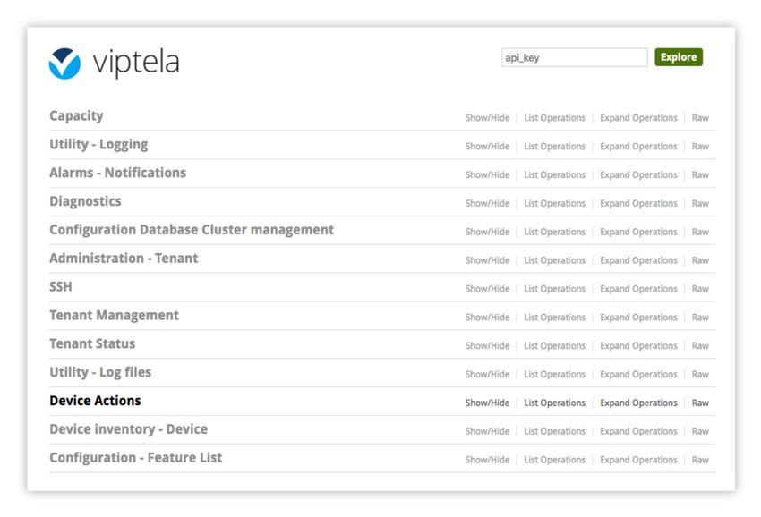
<!-- https://contenthub.netacad.com/courses/devnet/1e7f15f0-b0f6-11ea-983b-a3f6821d6983/1e92c500-b0f6-11ea-983b-a3f6821d6983/assets/99745d42-c09d-11ea-ae1e-a733eb29b8ad.png -->

Щелкните любое имя группы API, и на дисплее появится список API в этой функциональной группе. Ниже показаны различные вызовы API, доступные в категории «Инвентаризация устройств». Обратите внимание, что он предоставляет требуемый метод (GET, PUT, POST, DELETE), а также требуемый URL-адрес конечной точки для каждого вызова API.

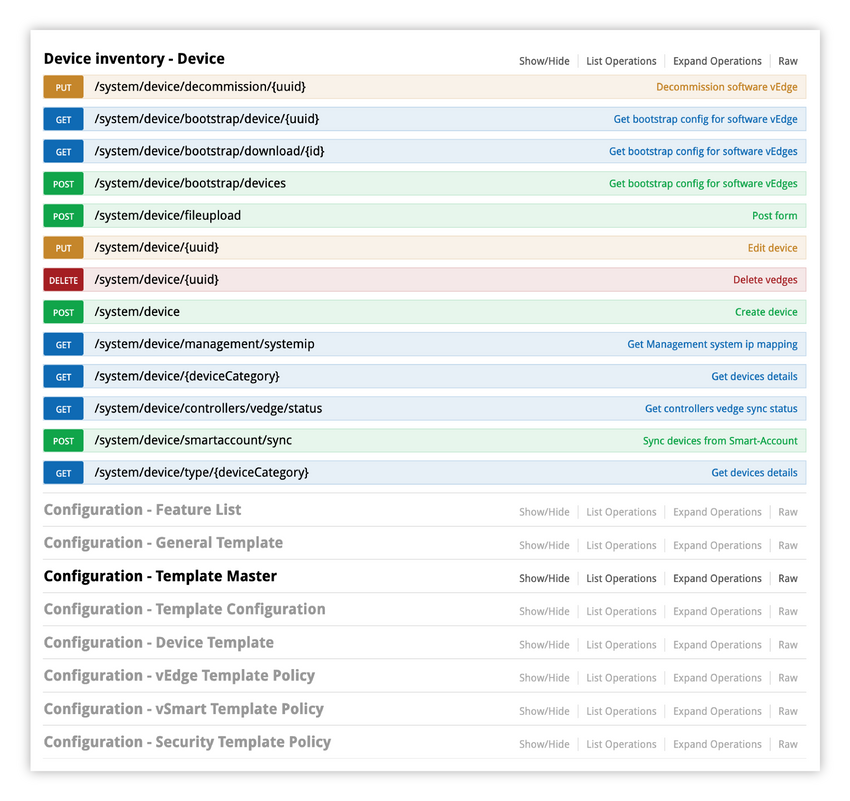
<!-- https://contenthub.netacad.com/courses/devnet/1e7f15f0-b0f6-11ea-983b-a3f6821d6983/1e92c500-b0f6-11ea-983b-a3f6821d6983/assets/99745d43-c09d-11ea-ae1e-a733eb29b8ad.png -->

Выбор `GET /system/device/{deviceCategory}` покажет подробную информацию о том, как использовать API, чтобы получить список устройств для этой категории.

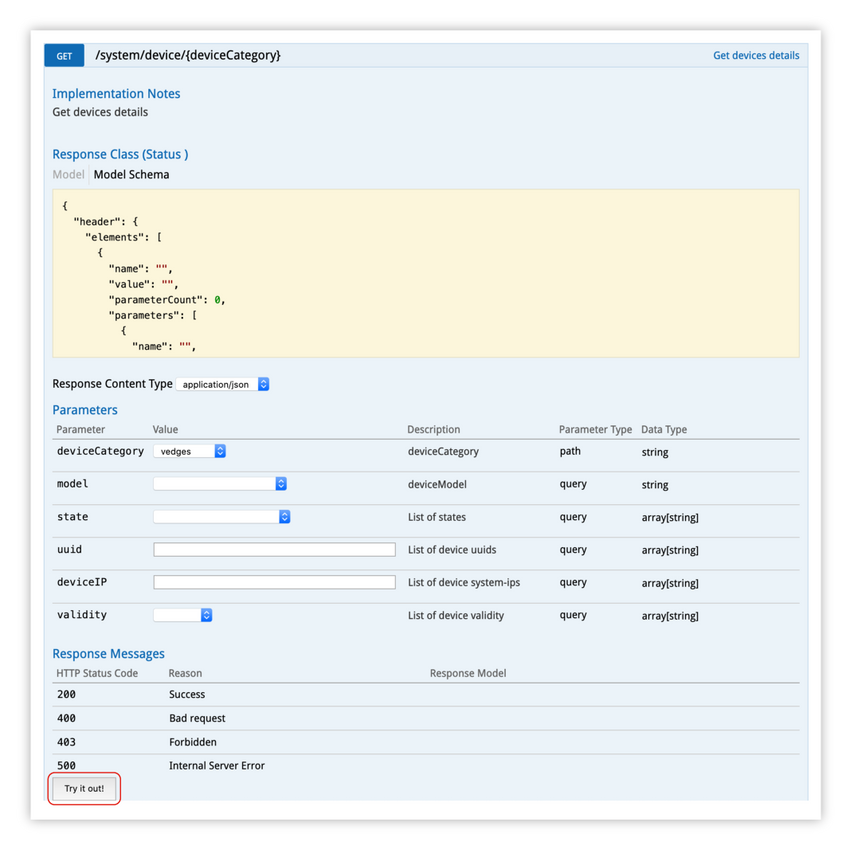
<!-- https://contenthub.netacad.com/courses/devnet/1e7f15f0-b0f6-11ea-983b-a3f6821d6983/1e92c500-b0f6-11ea-983b-a3f6821d6983/assets/99745d44-c09d-11ea-ae1e-a733eb29b8ad.png -->

Важные моменты, которые следует отметить в этом представлении:

* **Тип содержимого ответа** - В этом случае ответ будет в формате JSON, поэтому вам нужно быть готовым к синтаксическому анализу JSON.
* **Параметры** - Это параметры, которые вы можете передать в вызов API для фильтрации возвращаемых данных.
* **Ответные сообщения** - Список кодов HTTP, которые можно вернуть.
* `Try it out!` - Это кнопка активации внизу страницы.

Установите параметр `deviceCategory` для `vedges` и `model` для параметра `vedge-cloud`, затем щелкните `Try it out!`. При нажатии этой кнопки выполняется вызов API и передаются параметры для фильтрации результатов только для моделей vEdge Cloud в инвентаре устройства.

> **Примечание**: При использовании команды «Try it out! (Попробуйте!)» Аутентификация не требуется из vManage, поскольку вы уже вошли в пользовательский интерфейс vManage и имеете соответствующие права.


<!-- https://contenthub.netacad.com/courses/devnet/1e7f15f0-b0f6-11ea-983b-a3f6821d6983/1e92c500-b0f6-11ea-983b-a3f6821d6983/assets/99745d45-c09d-11ea-ae1e-a733eb29b8ad.png -->

Что нужно знать об этом представлении:

* **URL запроса** - Это URL-адрес, используемый для отправки запроса. Имя хоста, отображаемое в этом URL-адресе, является IP-адресом этого хоста vManage.
* **Тело ответа** - В этом случае обратите внимание на `host-name`, `system-ip`, а также `version`.
* **Код ответа** - В данном случае мы получили 200, что означает Успех.

<!-- 8.4.20 -->
## Видео - доступ к Cisco SD-WAN с помощью REST API в Python


