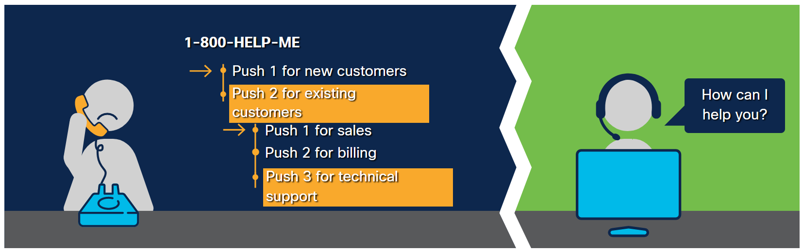
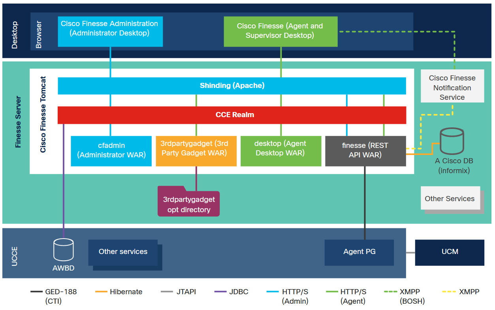
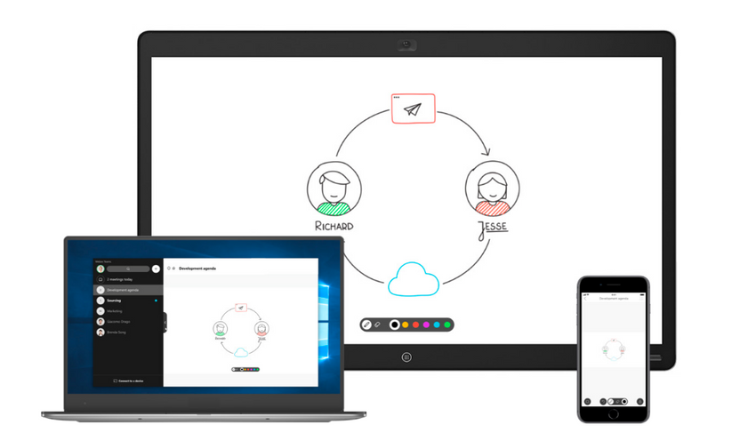
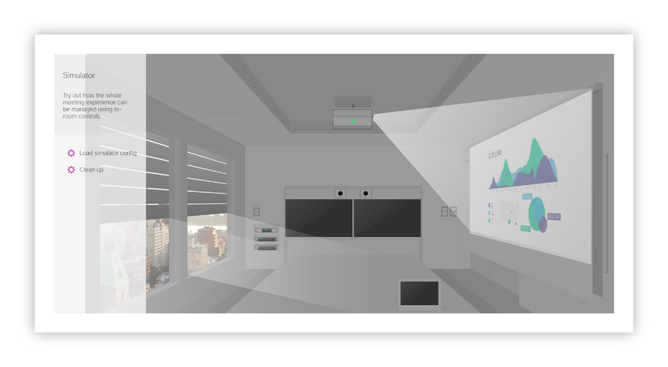

<!-- 8.6.1 -->
## Введение

В этом разделе вы узнаете о наборе решений Cisco для совместной работы как в локальной, так и в облачной среде. Эти эффективные средства связи позволяют предприятиям повысить производительность и снизить затраты.

**Cisco Unified Communications Manager (Unified CM)** изначально был разработан для маршрутизации вызовов по IP-сети, и Cisco быстро добавила дополнительные функции для удовлетворения растущих потребностей бизнеса. Единый CM - это:

* Используется для настройки и автоматизации инициализации устройств, маршрутизации вызовов, а также управления профилями и настройками в одном решении.
* Развернуты в больницах, банках, университетах и государственных учреждениях для управления растущим числом устройств и профилей пользователей.

Cisco создала множество API-интерфейсов для дальнейшего расширения своих возможностей, включая AXL и UDS. Эти API-интерфейсы предоставляют партнерам и разработчикам Cisco более простой способ автоматизации и управления устройствами, профилями пользователей и звонками.

**Contact Center** обеспечивает надежную поддержку клиентов для центров обработки вызовов с помощью рабочего стола оператора, супервизора и отчетности. Контакт-центр можно использовать с Unified CM или как автономный. Контакт-центр используется для управления и маршрутизации объемных вызовов, текста, видео и данных к нужному оператору в нужное время с нужной информацией.

**Finesse** это рабочий стол агента и супервизора. Finesse API предоставляет партнерам и разработчикам Cisco большую гибкость и возможность настройки рабочего стола для предоставления услуг, ориентированных на клиента.

**Webex** включает собрания, команды и устройства. Webex упрощает потребности в передаче голоса, видео и данных в одном решении, чтобы люди могли более эффективно сотрудничать:

* Webex Teams - это приложение для встреч и обмена сообщениями, предназначенное для улучшения совместной работы. API Webex Teams позволяет создавать чат-ботов и интеграции для оптимизации действий.
* Устройства Webex включают цифровые доски, блоки дистанционного присутствия и элементы управления помещением. Настройте и персонализируйте устройства Webex с помощью xAPI.

<!-- 8.6.2 -->
## Cisco Unified Communications Manager

Cisco Unified Communications Manager также известен как Unified CM, CUCM или CallManager. Cisco Unified Communications Manager:

* Это коммуникационное решение на основе IP для поддержки мобильных и удаленных сотрудников малого, среднего и корпоративного уровня.
* Это интеграция голоса, видео и данных в единое локальное решение для управления вызовами и сеансами.
* Очень расширяемый, с различными API-интерфейсами для настройки, управления, мониторинга и управления вызовами.

### Цель

Основная функция Unified CM - управлять пользователями телефонов, IP-телефонами, номерами каталога, а также подключать и управлять вызовами в нужные места назначения. С помощью Unified CM вы можете:

* Определите шлюзы, соединительные линии, удаленные пункты назначения и другую информацию, связанную с телефонией.
* Настройте полный спектр задач обработки вызовов, включая удержание, перевод, переадресацию вызова и начало конференц-связи. Unified CM хранит данные конфигурации во внутренней базе данных с архитектурой кластера Издатель → Подписчик.

### Расширенные возможности Unified CM

Расширенные функции Unified CM включают:

* **AXL** - API-интерфейсы SOAP (запросы XML) для управления различными аспектами CUCM через программы, а не через веб-интерфейс. AXL предназначен для администрирования и настройки CUCM.
* **UDS** - Позволяет конечным пользователям обновлять свои личные настройки, хранящиеся в CUCM.
* **Удобство обслуживания** - RisPort предоставляет информацию о регистрации и IP-адресах телефонов в реальном времени. PerfMon обеспечивает мониторинг оборудования и программного обеспечения Cisco Unified CM в реальном времени.
* **Административные веб-службы платформы (PAWS)** - Позволяет программно выполнять такие операции, как обновления, вместо выполнения шагов вручную.
* **Совместимость софтфона** - Программные телефоны позволяют пользователю Jabber совершать и принимать телефонные звонки.
* **Мобильность расширений** - Пользователи могут войти в систему с любого телефона, и этот телефон переключится со своего абонентского номера по умолчанию на абонентский номер пользователя, пока пользователь находится в системе.
* **Пакет SDK для голоса и видео Cisco Jabber** - Библиотека/надстройка JavaScript и расширение Chrome/Firefox, позволяющее создавать веб-страницы, которые могут работать как программный телефон (аудио и дополнительное видео). Вы также можете использовать веб-страницу для использования своего физического телефона.
* **Java Telephony API (JTAPI) или Telephony API (TAPI)** - Позволяет писать программы, автоматизирующие способ обработки вызовов.
* **Коды вопросов клиента (CMC)** - Позволяет управлять доступом и учетом вызовов. CMC вынуждает пользователя ввести код, чтобы указать, что вызов относится к конкретному клиентскому делу. Вы можете назначать коды сообщений клиентов клиентам, студентам или другим группам населения для целей учета вызовов и выставления счетов.
* **Коды принудительной аутентификации** - Ограничьте доступ для пользователей с определенными номерами каталога, потребовав от пользователей сначала ввести код аутентификации.
* **Списки охоты** - Списки телефонных номеров. Если вы вызываете номер из списка поиска, и этот номер недоступен (например, занят), он звонит по следующему номеру в списке и так далее, пока он не достигнет вызываемого абонента или не закончит номер в списке.
* **Музыка/видео на удержании** - Определите собственную музыку и/или видео для воспроизведения, когда пользователь находится на удержании.

### Расширения

Unified CM интегрируется с другими сервисами:

* **Обмен мгновенными сообщениями Cisco и присутствие (Cisco IM&P)** - Требуется установленный сервер с Cisco IM&P, также известный как CUP. Сервер Cisco IM&P синхронизирует информацию о присутствии и обмен мгновенными сообщениями (IM) между Cisco Unified Communications и другими приложениями.
* **Голосовая почта** - Расширенное управление голосовой почтой, требуется установленный сервер с Cisco Unity Connection (CUC).
* **Контактный центр** - Направляет запросы на обслуживание клиентов пулу агентов для обеспечения эффективной поддержки клиентов.
* 
<!-- 8.6.3 -->
## Административный уровень XML

Административный уровень XML (AXL) - это интерфейс на основе XML/SOAP, который предоставляет механизм для вставки, извлечения, обновления и удаления данных из базы данных конфигурации унифицированной коммуникации. Разработчики могут использовать AXL и предоставленный язык описания веб-служб (WSDL) для создания, чтения, обновления и удаления таких объектов, как шлюзы, пользователи, устройства, шаблоны маршрутов и многое другое.

На рисунке показано 7 рядов. В каждой строке слева есть слово, а справа - текстовое поле. Строка 1, приложение, строка 2, apiaxl (административный xml), строка 3, протокол мыла, строка 4, кодирующая xml, строка 5, транспортный http (s), строка 6, сервер приложений apache/tomcat, строка 7 базы данных хранения данных


<!-- /courses/devnet/1e7f15f0-b0f6-11ea-983b-a3f6821d6983/1ed28d20-b0f6-11ea-983b-a3f6821d6983/assets/99748452-c09d-11ea-ae1e-a733eb29b8ad.svg -->

### Цель

AXL API предназначен для администрирования и настройки. Например, вы можете написать приложение на основе AXL/SOAP для упрощения таких операций, как добавление пользователя, настройка телефонов, которыми пользователь может управлять, настройка мобильности расширений этого пользователя (возможность входить в систему на других телефонах и использовать предварительную настройку). определенный абонентский номер на этом телефоне) и многое другое.

### Что можно делать с AXL

С помощью AXL можно выполнять практически все действия, которые можно выполнить с помощью веб-интерфейса консоли администрирования Unified CM. Примеры вещей, которые могут быть предоставлены с помощью AXL, включают, но не ограничиваются:

* Единые группы CM
* Справочные номера парковки вызовов (DN)
* Группы перехвата вызовов
* Вызов областей поиска
* Точки маршрута интеграции компьютерной телефонии (CTI)
* Пулы устройств
* Профили устройств
* Теги плана набора
* Планы набора
* Инструкции по сбросу цифр
* Справочные номера
* Шлюзы (аналоговые, T1, PRI)
* Локации
* Устройства протокола управления медиашлюзом (MGCP)
* Телефоны
* Узлы процесса
* Сервисы узлов процесса
* Регионы
* Фильтры маршрута
* Группы маршрутов
* Списки маршрутов
* Разделы маршрута
* Параметры обслуживания
* Шаблоны перевода
* Пользователи
* Порты голосовой почты

### Как это устроено

AXL - это интерфейс SOAP, то есть он основан на обмене документами XML (определенными в схеме или языке описания веб-служб (WSDL). Некоторые API-интерфейсы и платформы разработки могут использовать AXL WSDL для создания «собственного» кода/библиотек. Это позволяет использовать AXL без обработки XML. Для простых запросов может быть проще делать запросы AXL, создавая строки XML и отправляя их через HTTP POST.

Методы для объектов начинаются с:

* `list`
* `add`
* `update`
* `get`
* `remove`

Например, `listPhone` перечисляет все телефоны и `addUser` создает нового пользователя.

### SQL запросы

Вы также можете выполнять прямые SQL-запросы для обновления или получения данных в базе данных конфигурации Unified CM, используя `ExecuteSQLupdate` или `ExecuteSQLquery`. Для создания оператора SQL необходимо обратиться к Unified CM Database Dictionary. Обратите внимание на отсутствие обратной совместимости между выпусками Unified CM при использовании запросов SQL.

Если вы хотите загрузить WSDL для создания «родной» библиотеки, загрузите ее из Unified CM:

**Шаг 1*. Войдите в Unified CM как администратор.

**Шаг 2**. Выбрать `Application` -> `Plugin` из меню.

**Шаг 3**. Щелкните кнопку `Find`. Первая запись в списке - это набор инструментов Cisco AXL.

**Шаг 4**. Скачать файл `axlsqltoolkit.zip` и разархивируйте его в рабочий каталог. Этот комплект содержит схему AXL для файлов WSDL и XSD для различных версий Unified CM, так что у вас есть хорошая коллекция для вашей конкретной версии Unified CM.

### Управление версиями

Версия схемы AXL имеет обратную совместимость для двух основных выпусков. Это означает, что разработчики могут использовать схему AXL версии 10.0 (1) для Unified CM версий с 10.0 (1) по 12.5 (1). Версия схемы может быть указана в заголовке SOAP-действия запроса. Если он не указан, система использует самую старую поддерживаемую схему. Вы можете увидеть версию, указанную в примере запроса ниже. Вы можете получить доступ к более подробной информации в документации по версиям.

### Пример запроса

Этот пример запроса возвращает список телефонов и все их настройки. По запросу `name` и указав подстановочный знак `%`, вы можете получить список всех имен телефонов.

```xml
<soapenv:Envelope xmlns:soapenv="http://schemas.xmlsoap.org/soap/envelope/" xmlns:ns="http://www.cisco.com/AXL/API/12.5">
   <soapenv:Header/>
   <soapenv:Body>
      <ns:listPhone>
         <searchCriteria>
            <name>%</name>
         </searchCriteria>
      </ns:listPhone>
   </soapenv:Body>
</soapenv:Envelope>
```

### Расширенные возможности

AXL имеет некоторые расширенные функции. Одна из самых полезных - это функция уведомления об изменениях. Вы можете использовать этот запрос SOAP несколько раз, чтобы увидеть, какие изменения были внесены в систему с момента последнего выполнения запроса. Вы можете запросить просмотр изменений в определенных категориях, таких как «Телефон» или «Пользователь», или просто просмотреть все изменения.

### Связанные API администрирования на основе SOAP

**Удобство обслуживания UC Manager** включает аналогичные запросы API на основе SOAP для получения информации о телефонах, такой как статус регистрации, IP-адрес и т. д.

Он также включает API мониторинга производительности и API для управления и получения статуса сервисов CUCM. Чтобы узнать больше об этих сервисах, просмотрите документацию разработчика по удобству обслуживания.

### Подробнее

Дополнительная информация о AXL доступна в документации для разработчиков AXL.

<!-- 8.6.4 -->
## Службы данных пользователя

Службы пользовательских данных (UDS) - это API на основе REST, который предоставляет механизм для вставки, извлечения, обновления и удаления данных из базы данных конфигурации унифицированной коммуникации. Разработчики могут использовать UDS API для создания, чтения, обновления и удаления пользовательских ресурсов, включая устройства, службы с подпиской и номера быстрого набора.

### Цель

UDS API предназначен для настройки параметров конечными пользователями. Например, API предоставляет доступ с проверкой подлинности, чтобы конечные пользователи могли обновлять свои личные настройки для своих устройств.

### Что вы можете делать с UDS

Одним из примеров того, как вы можете использовать UDS API, является создание поиска в каталоге или управление пользовательскими предпочтениями и настройками в вашем веб-приложении. Поскольку API предоставляет функциональные возможности для входа конечных пользователей, эти конечные пользователи могут затем изменить свои настройки, чтобы включить или отключить такие функции, как «Переадресация всех вызовов» и «Не беспокоить». Примеры действий с UDS:

* Каталог поиска пользователей
* Управление настройками переадресации вызовов, режима "Не беспокоить" и быстрого набора, включая настройки визуальных и звуковых предупреждений
* Установить язык и локаль
* Подписка на приложения службы IP-телефона
* Сбросить учетные данные PIN или пароля
* Настройка удаленных пунктов назначения, используемых с Cisco Mobility & Single Number Reach

### Как это устроено

UDS - это интерфейс на основе REST, который отправляет и принимает данные в формате XML. UDS реализует четыре распространенных метода HTTP-запроса: `GET`, `POST`, `PUT`, а также `DELETE`.

Например, `GET /speedDials` возвращает список номеров быстрого набора пользователя, а `PUT /speedDials` обновляет номера быстрого набора этого пользователя.

UDS поддерживает единый вход (SSO) и базовую аутентификацию для аутентификации. Не все запросы UDS API требуют аутентификации, но ресурсы UDS, которые действительно требуют аутентификации:

* credentials
* device(s)
* extension(s)
* remoteDestination(s)
* speedDial(s)
* subscribedService(s)
* user
* userPolicy

### Пример запроса

Этот образец XML-запроса возвращает список настроек и предпочтений вашего пользователя:

```
GET https://{host}:8443/cucm-uds/user/{userId}
Accept: application/xml
```

Это ответ:

```xml
<user version="{version}" uri="https:¬//{host}:8443/cucm-uds/user/{userId}">
    <id>{userPkid}</id>
    <userName>{userId}</userName>
    <firstName>firstName</firstName>
    <lastName>lastName</lastName>
    <middleName>middleName</middleName>
    <nickName>nickName</nickName>
    <phoneNumber>8134567</phoneNumber>
    <homeNumber>8134455</homeNumber>
    <mobileNumber>8131111</mobileNumber>
    <mobileConnect>true|false</mobileConnect>
    <userLocale uri="https:¬//{host}:8443/cucm-uds/installedLocales" value="0" appliesToAllDevices="true|false">English, United States</userLocale>
    <email>someone@example.com</email>
    <directoryUri>someone@example.com</directoryUri>
    <msUri>someone@example.com</msUri>
    <department>department</department>
    <manager>manager</manager>
    <title>title</title>
    <pager>8137777</pager>
    <primaryExtension uri="https:¬//{host}:8443/cucm-uds/user/{userId}/userExtension/{extensionPkid}">
        <description>extensionDescription</description>
        <directoryNumber>81134953</directoryNumber>
        <callForwardAllDestination>
            <sendToVoiceMailPilotNumber>true|false</sendToVoiceMailPilotNumber>
            <destination>4352134</destination>
        </callForwardAllDestination>
        <messageWaitingVisualAlert>true|false</messageWaitingVisualAlert>
        <messageWaitingVisualAlertPreference appliesToAllLineAppearances="true|false" value="">Use System Default</messageWaitingVisualAlertPreference>
        <messageWaitingAudibleAlertPreference appliesToAllLineAppearances="true|false" value="1">On</messageWaitingAudibleAlertPreference>
        <onACallRingPreference appliesToAllLineAppearances="true|false" value="0" >Use System Default</onACallRingPreference>
        <notOnACallRingPreference appliesToAllLineAppearances="true|false" value="0" >Use System Default</notOnACallRingPrefence>
        <voiceMailPilotNumber>5555</voiceMailPilotNumber>
        <label appliesToAllLineAppearances="true|false">label</label>
        <logMissedCalls appliesToAllLineAppearances="true|false">true|false</logMissedCalls>
    </primaryExtension>
    <accountType useLdapAuth="true|false">ldap|local</accountType>
    <homeCluster enableCalendarPresence="true|false" enableImAndPresence="true|false">true|false</homeCluster>
    <devices uri="https:¬//{host}:8443/cucm-uds/user/{userId}/devices"/>
    <credentials uri="https:¬//{host}:8443/cucm-uds/user/{userId}/credentials"/>
    <userExtensions uri="https:¬//{host}:8443/cucm-uds/user/{userId}/userExtensions"/>
    <enableDoNotDisturb appliesToAllDevices="true|false">true|false</enableDoNotDisturb>
    <callForwardAllDestination appliesToAllExtensions="true|false">
        <sendToVoiceMailPilotNumber>true|false</sendToVoiceMailPilotNumber>
        <destination>43521</destination>
    </callForwardAllDestination>
    <speedDials uri="https:¬//{host}:8443/cucm-uds/user/{userId}/speedDials"/>
    <serviceProfile uri="http:¬//{host}:6970/SPDefault.cnf.xml"/>
</user>
```

### Подробнее

Дополнительные сведения о UDS см. В документации для разработчиков UDS.

<!-- 8.6.5 -->
## Finesse Cisco

Finesse - это браузер оператора контакт-центра Cisco и рабочий стол супервизора. У Finesse есть REST API и JavaScript API, которые можно использовать для создания полностью настраиваемых рабочих столов агентов, интеграции функций контакт-центра в приложения и интеграции приложений в рабочий стол агента Finesse и супервизора. Эта интеграция может быть выполнена в виде гаджетов OpenSocial.


<!-- https://contenthub.netacad.com/courses/devnet/1e7f15f0-b0f6-11ea-983b-a3f6821d6983/1ed28d20-b0f6-11ea-983b-a3f6821d6983/assets/99748453-c09d-11ea-ae1e-a733eb29b8ad.png -->

### Что такое контакт-центр?


<!-- /courses/devnet/1e7f15f0-b0f6-11ea-983b-a3f6821d6983/1ed28d20-b0f6-11ea-983b-a3f6821d6983/assets/99748454-c09d-11ea-ae1e-a733eb29b8ad.svg -->

Контактный центр, также известный как центр обработки вызовов, обычно представляет собой централизованное место, где компания занимается обслуживанием клиентов для своего бизнеса. Обслуживание клиентов может осуществляться в виде звонков, текстовых сообщений, электронной почты и чата.

Контакт-центры имеют две категории задач:

* **Входящие задачи** - Когда клиенты инициируют общение со службой поддержки. Примеры включают клиента, который задает вопросы о своем счете, или ему нужна ИТ-помощь, или новый клиент пытается зарегистрироваться.
* **Исходящие задачи** - Взаимодействие с клиентом от агента контакт-центра к клиенту. Примеры включают телемаркетинг, напоминания о предстоящей встрече или обслуживании или последующие действия после предыдущего взаимодействия со службой поддержки.

Работники контакт-центра называются агентами, а их менеджеры - руководителями. Они помогают клиентам и также известны как представители службы поддержки клиентов. Они используют приложение, называемое рабочим столом агента, для следующих задач:

* Управлять входящей работой (звонок, текст, чат, электронная почта)
* Получите данные о клиенте, которые были предоставлены через подсказку меню или форму
* Получите информацию о клиентах из системы управления взаимоотношениями с клиентами или из внутренней базы данных
* Внесите примечания в учетную запись/файл клиента для дальнейшего использования
* Получите помощь из базы знаний, чтобы помочь клиенту
* Обратитесь за помощью к коллегам или руководителю

### Системы контакт-центра

Системы контакт-центра очень сложны. Это общий обзор функций, необходимых для понимания Finesse.

Системы контакт-центра выполняют так называемую маршрутизацию на основе навыков, используя автоматический распределитель вызовов (ACD) для интеллектуальной маршрутизации входящих взаимодействий с клиентами (таких как звонки, текст, чат, электронная почта) агентам по обслуживанию клиентов, сопоставляя их на основе навыков и специальностей, используя сложные алгоритмы.

Системы контакт-центра также обеспечивают управление операторами и супервизорами. Системный мониторинг состояния агента позволяет ACD знать, кто может получать задачи. Ниже приведены примеры состояний агента:

* **Not Ready** - Агент недоступен для приема входящей задачи (звонок, текст, чат, электронная почта)
* **Ready** - Агент доступен для приема входящей задачи из очереди (звонок, текст, чат, электронная почта)
* **Talking** - В настоящий момент агент обрабатывает вызов из очереди.
* **Work** - Агент только что закончил обработку задачи и завершает работу, добавляя примечания, заполняя формы и т. Д. В этом состоянии агент не получит новую задачу.
* **Logout** - Агент вышел из системы и в данный момент не работает.

Чтобы предоставить дополнительную информацию о состоянии агента, существуют коды причин, которые описывают, почему агент находится в этом состоянии. Обычно существует два типа кодов причин: «Не готов» и «Выход из системы».

### Развертывания Finesse 

У Finesse есть два разных развертывания. В решении для контакт-центра Finesse находится поверх Contact Center Enterprise или Unified Contact Center Express и не может работать без одной из этих систем контакт-центра.

Finesse взаимодействует с системой контакт-центра по протоколу CTI. Этот протокол отличается для систем Contact Center Enterprise и Contact Center Express, но Finesse предоставляет одинаковый интерфейс для двух развертываний, сохраняя при этом различия в поведении.

### Контакт-центр предприятия

Автономное изящество, которое используется с системой Contact Center Enterprise, является одним из типов развертывания.

В окне cisco finesse отображается значок телефона с надписью «Готово». В верхнем разделе отображается история недавних вызовов, а в нижнем разделе - история последних состояний с таблицей времени начала, состояния, причины и продолжительности.


<!-- /courses/devnet/1e7f15f0-b0f6-11ea-983b-a3f6821d6983/1ed28d20-b0f6-11ea-983b-a3f6821d6983/assets/99748455-c09d-11ea-ae1e-a733eb29b8ad.svg -->

Существует две версии Contact Center Enterprise (CCE), Unified Contact Center Enterprise (UCCE) и Packaged Contact Center Enterprise (PCCE). Разница между ними в основном заключается в размерах оборудования, простоте установки и количестве поддерживаемых агентов. Аудитория системы Contact Center Enterprise - крупный бизнес.

### Unified Contact Center Express

Утонченность со-резидентов, которая используется с Unified Contact Center Express.

В окне cisco finesse отображается значок телефона с надписью «Готово». В верхнем разделе отображается история недавних вызовов, а в нижнем разделе - история последних состояний с таблицей времени начала, состояния, причины и продолжительности.


<!-- /courses/devnet/1e7f15f0-b0f6-11ea-983b-a3f6821d6983/1ed28d20-b0f6-11ea-983b-a3f6821d6983/assets/99748456-c09d-11ea-ae1e-a733eb29b8ad.svg -->
Unified Contact Center Express (UCCX) предназначен для малого и среднего бизнеса. По сравнению с системой Contact Center Enterprise занимаемая площадь оборудования мала, поскольку большинство продуктов являются совмещенными. Когда продукты являются совмещенными, это означает, что они используют один сервер/виртуальную машину и, следовательно, один установщик. Поскольку UCCX предназначен для малых предприятий, здесь не так много функций, как в развертывании CCE.

### Finesse API

Finesse создавался с учетом интеграции. Он предоставляет разработчикам обширный список REST и JavaScript API для интеграции функций Finesse в приложения или приложения, которые будут интегрированы в рабочий стол агента Finesse.

### Finesse REST API

Finesse предоставляет REST API для программного выполнения действий агента и супервизора. Их можно использовать для создания настраиваемых рабочих столов агентов, интеграции в существующие приложения и/или создания сценария для автоматизации задач. Поскольку API-интерфейсы основаны на HTTP, их можно использовать как в толстых, так и в тонких приложениях. Подробную информацию о каждом REST API можно найти в Руководстве разработчика Finesse Developer Guide, но здесь представлено общее описание некоторых функций API:

* **User** - Представляет агента, супервизора или администратора и позволяет получать или обновлять сведения о пользователях и информацию о состоянии.
* **Dialog** - Представляет звонок и участников. Если тип мультимедиа голосовой, он позволяет совершать звонки, выполнять действия с вызовами и выполнять действия, связанные с исходящими сообщениями.
* **Media** - Представляет состояние пользователя в неголосовом домене маршрутизации мультимедиа (MRD) и позволяет получать информацию о пользователе и управлять состоянием пользователя.
* **Team** - Представляет группу пользователей и позволяет получать сведения о группе и списки сообщений группы.
* **SystemInfo** -Представляет текущее состояние системы и позволяет получать сведения о системе, такие как XMPP-сервер, домены PubSub, IP-адреса узлов, состояние и тип развертывания.
* **ClientLogs** - Позволяет отправлять журналы на стороне клиента на сервер Finesse Server.

API-интерфейсы Finesse REST, использующие команду GET, являются синхронными, что означает, что сервер Finesse немедленно вернет ответ с запрошенной информацией. Приложение должно дождаться ответа, прежде чем продолжить. Остальные API-интерфейсы Finesse REST являются асинхронными, что означает, что сервер Finesse подтвердит, что запрос был сделан, но отправит уведомление с запрошенной информацией через службу уведомлений Finesse. Асинхронные API-интерфейсы Finesse REST идут рука об руку со службой уведомлений Finesse Notification Service.

### Служба уведомлений Finesse

Служба уведомлений Finesse - это экземпляр сервера OpenFire, который работает на платформе как отдельный процесс. Служба уведомлений предоставляет уведомление о событии от сервера Finesse любому клиенту, который подписан на определенный ресурс. OpenFire использует протокол XMPP в качестве канала передачи данных. Приложения должны взаимодействовать со службой Finesse Notification через XMPP или BOSH (двунаправленные потоки через синхронный HTTP) для веб-приложений.

### Finesse JavaScript API 

Рабочий стол агента Finesse и супервизора - это контейнер OpenSocial, в котором можно разместить гаджеты OpenSocial. Finesse предоставляет API-интерфейсы JavaScript для создания пользовательских гаджетов OpenSocial, которые будут использоваться в готовых агентах Finesse и на рабочем столе супервизора.

Библиотека Finesse JavaScript - это уровень, построенный на основе интерфейса Finesse REST API и службы уведомлений Finesse. Он абстрагирует детали запроса и уведомлений, объединяя их в классы, методы и обратные вызовы JavaScript. Таким образом, разработчикам, использующим API-интерфейсы Finesse JavaScript, не нужно напрямую заниматься настройкой соединения BOSH и выполнять запросы REST API. API-интерфейс Finesse JavaScript содержит почти все те же API-интерфейсы, что и API-интерфейсы Finesse REST. Подробную информацию о каждом JavaScript API можно найти в библиотеке Finesse JavaScript.

### Случаи использования Finesse

Есть бесконечные возможности того, что можно построить с помощью API-интерфейсов Finesse. Вот несколько распространенных вариантов использования;

* **Проблема** - Компаниям необходим рабочий стол оператора контакт-центра, адаптированный к потребностям их операторов. Предоставленного рабочего стола агента Finesse недостаточно. **Решение** - Компания может создать на 100% полностью функциональный рабочий стол агента с фирменной символикой и содержащий все функции, которые можно найти в готовом рабочем столе агента Finesse. Им нужно будет использовать большую часть API-интерфейсов User, Dialog, Team вместе со Службой уведомлений Finesse.
* **Проблема** - Компания использует систему управления взаимоотношениями с клиентами (CRM) в качестве основного приложения для агентов контакт-центра. Они хотят добавить в CRM состояние агента и базовое управление вызовами, чтобы избежать необходимости переключаться между двумя приложениями. **Решение** - Компания будет использовать API-интерфейсы User и Dialog вместе со Службой уведомлений Finesse. Пользовательские API добавят возможности состояния агента, а API диалога добавят базовые возможности управления вызовами.
* **Проблема** - Компания хочет добавить в свое приложение функцию «Звонок по нажатию». **Решение** - Компания будет использовать Dialog - Create a New Dialog API, чтобы добавить эту функциональность.
* **Проблема** - Компания по телемаркетингу хочет настраиваемый рабочий стол агента, который имел бы только исходящие возможности. **Решение** - Компания может создать полностью функциональный рабочий стол агента только для исходящих сообщений. Им потребуется добавить вход/выход агента, состояние агента, исходящие функции и специальный контроль вызовов для исходящих вызовов. Поддерживаемые исходящие функции включают получение исходящего вызова, принятие/закрытие/отклонение/переклассификацию исходящих вызовов и планирование обратных вызовов.
* **Проблема** - Компания хочет иметь специальный настольный компьютер супервизора, потому что его руководители не принимают входящие звонки клиентов. **Решение** - Компания может создать рабочий стол супервизора, содержащий только возможности супервизора. У Finesse есть API для следующих функций для своей команды: командные сообщения, бесшумный мониторинг, баржа, просмотр и изменение состояния агента.
* **Проблема** - Компания использует готовый рабочий стол агента Finesse, но хочет добавить рабочие процессы состояния агента. **Решение** - Компания может создать собственный гаджет для рабочего процесса состояния агента. Пользовательский гаджет может получать все уведомления пользователя. С этими данными гаджет может соответствующим образом запустить рабочий процесс.
* **Проблема** - Компания использует готовый рабочий стол агента Finesse и хочет интегрировать другое приложение, имеющее REST API, в рабочий стол агента. **Решение** - Компания может создать собственный гаджет и интегрировать его в приложение, используя REST API приложения. Гаджет имеет возможность вызывать внешние REST API, анализировать ответы и соответственно отображать данные.
* **Проблема** - Компания хочет интегрировать веб-страницу в рабочий стол агента Finesse. **Решение** - Если веб-страница позволяет загружать себя в iframe, они могут создать собственный гаджет, который так же прост, как iframe, загружающий эту веб-страницу.
* **Проблема** - Компания хочет изменить цвет индикатора на своей гарнитуре с поддержкой Интернета вещей при изменении состояния агента. **Решение** - Компания создаст собственный гаджет, который вызывает API-интерфейсы гарнитуры для изменения цвета света при изменении состояния агента. Гаджет имеет возможность получать все уведомления пользователей, поэтому он будет знать, когда состояние агента изменится.

### Узнать больше о Finesse

Для получения дополнительных сведений о Finesse, таких как технический обзор, включая архитектуру Finesse и бесплатные песочницы, посетите сайт DevNet Finesse.

Чтобы найти документацию по API-интерфейсам Finesse REST, ознакомьтесь с Руководством разработчика Finesse Developer's Guide.

Чтобы найти документацию по API Finesse JavaScript, загляните в библиотеку Finesse JavaScript Library.

<!-- 8.6.6 -->
## Webex Teams

Cisco Webex Teams - это решение для совместной работы в Интернете, позволяющее объединять людей и команды с помощью чата, голоса и видео. С помощью приложения Webex Teams вы получаете доступ к безопасным виртуальным рабочим местам. Вы также используете обмен сообщениями и общий доступ к файлам со сторонними приложениями.

### Преимущества Webex Teams

Webex Teams позволяет использовать одно приложение для хранения содержимого и информации для совместной работы группы. Teams также интегрируется с устройствами Cisco Webex. Информация остается в безопасности благодаря встроенным усовершенствованным средствам защиты и соответствия требованиям.

### Обзор команд Webex

Мобильные, настольные и веб-клиенты доступны для платформы Webex Teams.


<!-- https://contenthub.netacad.com/courses/devnet/1e7f15f0-b0f6-11ea-983b-a3f6821d6983/1ed28d20-b0f6-11ea-983b-a3f6821d6983/assets/99748457-c09d-11ea-ae1e-a733eb29b8ad.png -->

### Особенности Webex Teams

Webex Teams включает следующие возможности и функции:

* **Создать пространства**
* Приглашайте людей и команды в определенные пространства Webex Teams.
* Отправляйте сообщения, обменивайтесь файлами, а также создавайте или редактируйте доски безопасно для одного человека или группы людей.
* **Создавать встречи**
* Высококачественные видеоконференции с демонстрацией экрана и интерактивной доской на всех ваших устройствах.
* Инструменты во время встречи, такие как возможность отключать звук других, добавлять гостей и включать **Примечание**, помогают повысить эффективность и вовлеченность.
* Чаты, файлы и доски, к которым предоставлен общий доступ во время собраний, могут быть просмотрены всеми позже.
* **Работайте одинаково внутри и вне вашей компании**: Добавьте людей в общие области из каталога вашей компании или введите адрес электронной почты напрямую.
* **Совершать звонки**
* Встроенные в приложение возможности голосовых и видеозвонков для связи с другими пользователями Webex Teams и стандартными конечными точками SIP.
* Их можно улучшить с помощью комплексных функций вызовов через УАТС и IP-телефонов Cisco в сочетании с одним из наших решений для вызовов - Cisco Unified Communications Manager, Cisco Hosted Collaboration Solution (HCS) или Cisco Webex Calling.

### Безопасность

Ваши пользователи и конфиденциальная информация надежно защищены с помощью обширных средств управления, которые помогут вам настраивать и контролировать свои политики безопасности.

* Защитите сообщения, файлы и рисунки на доске с помощью сквозного шифрования.
* Управляйте своими собственными ключами шифрования локально.
* Ваши политики сохраняются даже тогда, когда ваши сотрудники сотрудничают с другими людьми за пределами вашей компании, благодаря интеграции с выбранным вами решением DLP.

### Интеграции

Webex Teams включает готовые решения со сторонними приложениями от таких поставщиков, как Microsoft, Google Cloud и Salesforce. Благодаря интеграции с Microsoft Office 365, Microsoft Exchange и Google Calendar вы можете просматривать свой список встреч в Webex Teams:

* Вы сможете планировать встречи.
* Пользователи могут обмениваться файлами из Microsoft OneDrive и SharePoint Online и редактировать их прямо в пространствах Webex Teams.

Другие интеграции можно настроить с помощью Webex App Hub, чтобы соединить Webex Teams с работой, выполняемой с помощью других инструментов, таких как Service Now, Trello, Asana, Salesforce и JIRA.

Webex Teams без проблем взаимодействует с устройствами Webex, обеспечивая наилучшие возможности для проведения видеовстреч и совместной работы без сложных процедур настройки, прокладки кабелей или нарушения производительности.

Гибридные службы Webex объединяют облачные и локальные службы, чтобы упростить переход в облако и повысить рентабельность инвестиций (ROI). Включает интеграцию с локальными активами, такими как служба календаря, каталог, система вызовов, ресурсы для конференц-связи и видеоустройства.

### Особенности API Webex Teams

API-интерфейс Webex Teams - это обширный набор API-интерфейсов, которые позволяют взаимодействовать со всей платформой Webex Teams. От управления организациями, командами, людьми, комнатами, членством и сообщениями до создания диалоговых ботов или встроенных видеозвонков вы можете расширить возможности Webex Teams:

* Используйте Webex API для создания веб-перехватчиков, обеспечивающих точную связь с приложениями и службами и управление ими в ответ на определенные события в Webex Teams.
* Создавайте ботов, которые имитируют пользователей Webex и взаимодействуют с внешними приложениями для предоставления услуг (часто с помощью веб-перехватчиков).
* Используйте API-интерфейсы Webex Embedding для Java, node.js, браузеров, iOS и Android, а также виджеты Webex, чтобы встраивать функции голосовых/видеозвонков и обмена сообщениями Webex в настольные, веб-и мобильные приложения.

Вся эта справочная информация доступна в документации Webex Teams.

### Организации

Организации представляют собой группу людей в Webex Teams. Организации могут управлять другими организациями или управляться ими самостоятельно. Доступ к ресурсам организации может получить только администратор.

| **МЕТОД** | **URL**                                             | **Описание**                       |
| --------- | --------------------------------------------------- | ---------------------------------- |
| **GET**   | https://api.ciscospark.com/v1/organizations         | Список организаций                 |
| **GET**   | https://api.ciscospark.com/v1/organizations/{orgId} | Получить информацию об организации |

### Команды

Команды - это группы людей с набором комнат, которые видны всем членам этой команды. Ресурсы API Teams - это команды, которыми нужно управлять, создавать, обновлять и удалять.

| **МЕТОД**  | **URL**                                      | **Описание**                  |
| ---------- | -------------------------------------------- | ----------------------------- |
| **GET**    | https://api.ciscospark.com/v1/teams          | Список команд                 |
| **POST**   | https://api.ciscospark.com/v1/teams          | Создать команду               |
| **GET**    | https://api.ciscospark.com/v1/teams/{teamId} | Получить информацию о команде |
| **PUT**    | https://api.ciscospark.com/v1/teams/{teamId} | Обновить команду              |
| **DELETE** | https://api.ciscospark.com/v1/teams/{teamId} | Удалить команду               |

### Люди

Люди являются зарегистрированными пользователями Webex Teams.

| **МЕТОД**  | **URL**                                         | **Описание**                    |
| ---------- | ----------------------------------------------- | ------------------------------- |
| **GET**    | https://api.ciscospark.com/v1/people            | Список людей                    |
| **POST**   | https://api.ciscospark.com/v1/people            | Создать человека                |
| **GET**    | https://api.ciscospark.com/v1/people/{personId} | Получить сведения о человеке    |
| **PUT**    | https://api.ciscospark.com/v1/people/{personId} | Обновить человека               |
| **DELETE** | https://api.ciscospark.com/v1/people/{personId} | Удалить человека                |
| **GET**    | https://api.ciscospark.com/v1/people/me         | Получить мои собственные данные |

### Комнаты (Пространства)

> **Примечание**: Обратите внимание, что ресурс в конечной точке API относится к «комнатам». Пользовательский интерфейс ссылается на «пробелы». Это взаимозаменяемые термины.

Комнаты - это виртуальные места для встреч, где люди публикуют сообщения и совместно работают над выполнением работы. API комнат может управлять комнатами, создавать, обновлять и удалять их.

| **МЕТОД**  | **URL**                                         | **Описание**                    |
| ---------- | ----------------------------------------------- | ------------------------------- |
| **GET**    | https://api.ciscospark.com/v1/people            | Список людей                    |
| **POST**   | https://api.ciscospark.com/v1/people            | Создать человека                |
| **GET**    | https://api.ciscospark.com/v1/people/{personId} | Получить сведения о человеке    |
| **PUT**    | https://api.ciscospark.com/v1/people/{personId} | Обновить человека               |
| **DELETE** | https://api.ciscospark.com/v1/people/{personId} | Удалить человека                |
| **GET**    | https://api.ciscospark.com/v1/people/me         | Получить мои собственные данные |

### Членство

Членство представляет собой отношение человека к комнате. Ресурсы API членства позволяют вам составить список участников любой комнаты, в которой вы находитесь, создать или отозвать членство, а членство можно обновить, чтобы сделать кого-то модератором комнаты.

| **МЕТОД**  | **URL**                                                  | **Описание**             |
| ---------- | -------------------------------------------------------- | ------------------------ |
| **GET**    | https://api.ciscospark.com/v1/memberships                | Список участников        |
| **POST**   | https://api.ciscospark.com/v1/memberships                | Создать членство         |
| **GET**    | https://api.ciscospark.com/v1/memberships/{membershipId} | Получить детали членства |
| **PUT**    | https://api.ciscospark.com/v1/memberships/{membershipId} | Обновить членство        |
| **DELETE** | https://api.ciscospark.com/v1/memberships/{membershipId} | Удалить членство         |

### Членство в команде

Членство в команде представляет собой отношение человека к команде.

| **МЕТОД**  | **URL**                                                       | **Описание**                             |
| ---------- | ------------------------------------------------------------- | ---------------------------------------- |
| **GET**    | https://api.ciscospark.com/v1/team/memberships                | Список членов команды                    |
| **POST**   | https://api.ciscospark.com/v1/team/memberships                | Создать членство в команде               |
| **GET**    | https://api.ciscospark.com/v1/team/memberships/{membershipId} | Получить информацию о членстве в команде |
| **PUT**    | https://api.ciscospark.com/v1/team/memberships/{membershipId} | Обновить членство в команде              |
| **DELETE** | https://api.ciscospark.com/v1/team/memberships/{membershipId} | Удалить членство в команде               |

### Сообщения

Сообщения - это то, как мы общаемся в комнате. В Webex Teams каждое сообщение отображается в отдельной строке вместе с отметкой времени и информацией об отправителе. Используйте этот API для составления списка, создания и удаления сообщений.

Сообщение может содержать открытый текст, форматированный текст и вложение файла.

| **МЕТОД**  | **URL**                                            | **Описание**              |
| ---------- | -------------------------------------------------- | ------------------------- |
| **GET**    | https://api.ciscospark.com/v1/messages             | Список сообщений          |
| **GET**    | https://api.ciscospark.com/v1/messages/direct      | Список личных сообщений   |
| **POST**   | https://api.ciscospark.com/v1/messages             | Создать сообщение         |
| **GET**    | https://api.ciscospark.com/v1/messages/{messageId} | Получить детали сообщения |
| **DELETE** | https://api.ciscospark.com/v1/messages/{messageId} | Удалить сообщение         |

<!--8.6.7 -->
## Лабораторная работа - Создание сценария Python для управления Webex Teams

В этой лабораторной работе вы будете использовать API Webex Teams для проверки подлинности, управления людьми, управления комнатами, управления членством в комнатах и отправки сообщений.

Вы выполните следующие задачи:

* Часть 1. Запуск виртуальной машины DEVASC
* Часть 2: Получите свой токен доступа Webex Teams
* Часть 3: Проверьте свой токен доступа
* Часть 4. Управление людьми в Webex Teams
* Часть 5: Управление помещениями в Webex Teams
* Часть 6: Управление членством в Webex Teams
* Часть 7. Управление сообщениями в Webex Teams
* 
<!-- 8.6.8 -->
## Устройства Webex

Устройства Cisco Webex предоставляют доступ ко всем функциям Webex. Доски Webex, комнатные и настольные устройства обеспечивают совместную работу с помощью видео, звонков и программирования.


<!-- https://contenthub.netacad.com/courses/devnet/1e7f15f0-b0f6-11ea-983b-a3f6821d6983/1ed28d20-b0f6-11ea-983b-a3f6821d6983/assets/99748458-c09d-11ea-ae1e-a733eb29b8ad.png -->

### Серия Webex Board

Cisco Webex Board Series - это универсальные устройства для совместной работы в конференц-залах и помещениях. Преимущества включают:

* Полностью сенсорное устройство, упрощающее встречу
* Облачная платформа, которая позволяет сохранять и продолжать работу до, во время и после встречи
* Регистрация в облаке делает его доступным и простым в развертывании с помощью сквозного шифрования.
* Беспроводные презентации без дополнительных ключей и проводов
* Цифровые доски
* Видео- и аудиоконференцсвязь с высоким качеством и точностью
* Экран высокого разрешения 4K


<!-- https://contenthub.netacad.com/courses/devnet/1e7f15f0-b0f6-11ea-983b-a3f6821d6983/1ed28d20-b0f6-11ea-983b-a3f6821d6983/assets/99748459-c09d-11ea-ae1e-a733eb29b8ad.png -->

### Серия Webex Room

Cisco Webex Room Series предлагает интегрированные системы видеоконференцсвязи в каждую комнату. Преимущества включают:

* 55- или 70-дюймовый экран (ы) 4K
* Интеллектуальные возможности просмотра, такие как автоматическое кадрирование и отслеживание выступающих
* Два экрана, два источника контента, беспроводной обмен и контент 4K для презентаций
* Подавление шума на основе искусственного интеллекта, голосовое управление и подсчет людей
* API-интерфейсы и макросы позволяют выразительно персонализировать встречи
* Создан для локального и облачного развертывания
* Цифровые доски


<!-- https://contenthub.netacad.com/courses/devnet/1e7f15f0-b0f6-11ea-983b-a3f6821d6983/1ed28d20-b0f6-11ea-983b-a3f6821d6983/assets/9974845a-c09d-11ea-ae1e-a733eb29b8ad.png -->

### Серия Webex Desk

Устройства Cisco Webex Device Series обеспечивают высококачественную видеоконференцсвязь на вашем рабочем столе. Преимущества включают:

* HD-видео и высококачественный звук
* Интуитивно понятный сенсорный экран
* Создан для локального и облачного развертывания


<!-- https://contenthub.netacad.com/courses/devnet/1e7f15f0-b0f6-11ea-983b-a3f6821d6983/1ed28d20-b0f6-11ea-983b-a3f6821d6983/assets/9974845b-c09d-11ea-ae1e-a733eb29b8ad.png -->

### Cisco Touch 10

Cisco Touch 10 - это устройство с интуитивно понятным сенсорным экраном для взаимодействия с системами конференц-связи Cisco.

* Поддерживает серии Cisco MX, SX, IX и Webex Room Series
* Питание через Ethernet
* Широкая языковая поддержка

Настройка Touch 10 осуществляется с помощью средств управления в помещении, устройств диспетчерской и периферийных устройств Touch 10 и может быть интегрирована с системами управления.


<!-- https://contenthub.netacad.com/courses/devnet/1e7f15f0-b0f6-11ea-983b-a3f6821d6983/1ed28d20-b0f6-11ea-983b-a3f6821d6983/assets/9974845c-c09d-11ea-ae1e-a733eb29b8ad.png -->

### Возможность программирования для устройств Cisco для совместной работы

Устройства Webex можно настроить с помощью API, известного как xAPI. Это обеспечивает двустороннюю связь со сторонними приложениями и системами управления.

Существует несколько способов доступа к xAPI, включая последовательное соединение Telnet/SSH, HTTP и RS-232. Независимо от того, какой метод вы выберете, xAPI имеет один и тот же общий формат, ведет себя аналогичным образом и обеспечивает полный контроль над устройством, оптимизированный для интеграции с системами управления.

xAPI поддерживает как XML, так и JSON и обеспечивает прямой доступ через командную строку. Он также поддерживает макросы JavaScript для настройки на устройстве.


<!-- /courses/devnet/1e7f15f0-b0f6-11ea-983b-a3f6821d6983/1ed28d20-b0f6-11ea-983b-a3f6821d6983/assets/f3d0e730-e614-11ea-988f-e38f56b46f85.svg -->

### Расширения пользовательского интерфейса (элементы управления в номере) и макросы

Говоря об устройствах Webex, Cisco в настоящее время переходит на использование обобщенного термина «расширения пользовательского интерфейса» для описания настраиваемых виджетов, кнопок и других виртуальных контроллеров, которые вы можете создавать и развертывать. Раньше они назывались глобально «элементами управления в номере». Однако в дальнейшем этот последний термин будет зарезервирован для обозначения только подмножества расширений пользовательского интерфейса, которые используются для взаимодействия в конференц-зале (например, для управления освещением).

В настоящее время вы все еще можете встретить термин «элементы управления в номере», который используется в общем смысле на страницах документации. Обязательно внимательно прочитайте контекст!

Аналогичным образом, в будущем (по состоянию на последний квартал 2019 года) есть только один инструмент, называемый редактором расширений пользовательского интерфейса. Но вы можете увидеть более ранние версии этого инструмента, называемые редактором панели управления, даже в учебных пособиях и других материалах за последний квартал 2019 года.

### Что делают расширения пользовательского интерфейса

Расширения пользовательского интерфейса позволяют добавлять пользовательские элементы интерфейса к дисплею Touch 10, используемому для управления устройствами в помещении, а также к экранному интерфейсу управления серией DX. Эти элементы могут запускать приложения для управления аспектами самого устройства или влиять на освещение в комнате, жалюзи, видеопереключатели или другие периферийные устройства.

Расширения пользовательского интерфейса могут быть двунаправленно интегрированы с дополнительными внешними системами управления (такими как AMX/Crestron) с xAPI. Чтобы получить представление о возможностях, предлагаемых настраиваемыми расширениями пользовательского интерфейса, устройства для совместной работы Webex поставляются со встроенным имитатором управления, который можно запускать непосредственно из веб-браузера.


<!-- https://contenthub.netacad.com/courses/devnet/1e7f15f0-b0f6-11ea-983b-a3f6821d6983/1ed28d20-b0f6-11ea-983b-a3f6821d6983/assets/9974845e-c09d-11ea-ae1e-a733eb29b8ad.png -->

Запуск симулятора загрузит виртуальный конференц-зал, оборудованный несколькими автоматизированными системами, управляемыми с помощью переключателей на стенах (и вашего интерфейса Touch10/DX, как вы увидите позже на этом этапе).

С помощью переключателей можно включать и выключать проектор, взаимодействовать с полотном проектора, закрывать/открывать жалюзи и т. Д.


<!-- https://contenthub.netacad.com/courses/devnet/1e7f15f0-b0f6-11ea-983b-a3f6821d6983/1ed28d20-b0f6-11ea-983b-a3f6821d6983/assets/9974845f-c09d-11ea-ae1e-a733eb29b8ad.png -->

### Персонализация устройств для совместной работы

Начиная с версии 9.2 выпуска программного обеспечения Cisco Collaboration Endpoint, экранный брендинг, вывески и параметры настройки сообщений позволяют персонализировать внешний вид устройства в помещении и его интерфейса Touch10. Эта возможность позволяет этим системам согласовываться с вашим корпоративным брендом, передавать информацию пользователям в комнате, обновлять с помощью предупреждений и т. Д. Хотя администратор всегда может статически настроить эти настраиваемые параметры отображения через веб-интерфейс устройства в помещении, вы также можете изучить различные способы использования сценариев, приложений или других инструментов автоматизации через xAPI для автоматизации таких задач.

Брендирование и настройка экрана «Halfwake» комнатного устройства позволяет загружать собственный текст и изображения для настройки внешнего вида экрана и/или интерфейса управления Touch10.

В состоянии «Halfwake» вы можете:

* Добавить фоновое изображение (экран/Touch10)
* Добавьте небольшой логотип в нижний правый угол (экран/Touch10)
* Настройте или удалите приветственное сообщение на экране по умолчанию (только экран)


<!-- https://contenthub.netacad.com/courses/devnet/1e7f15f0-b0f6-11ea-983b-a3f6821d6983/1ed28d20-b0f6-11ea-983b-a3f6821d6983/assets/99748460-c09d-11ea-ae1e-a733eb29b8ad.png -->

В состоянии «Бодрствование» вы можете:

* Добавьте небольшой логотип в нижний правый угол (экран/Touch10)
* Добавьте ярлык или сообщение в нижний левый угол (только на экране)


<!-- https://contenthub.netacad.com/courses/devnet/1e7f15f0-b0f6-11ea-983b-a3f6821d6983/1ed28d20-b0f6-11ea-983b-a3f6821d6983/assets/99748461-c09d-11ea-ae1e-a733eb29b8ad.png -->

### Запуск Javascript на устройствах с макросами

CE v9.2.1 + позволяет развертывать собственный код на самом устройстве с помощью функции макроса. Эта функция позволяет загружать код JavaScript и запускать его непосредственно на устройстве для совместной работы (размещенном в безопасной «песочнице»). Этот настраиваемый код может взаимодействовать с устройством с помощью открытого объекта JavaScript xAPI.

В идеале код, разработанный на внешнем сервере приложений с использованием `jsxapi` могут быть загружены для запуска непосредственно на устройстве для совместной работы без использования внешнего сервера. Однако среда макроса JavaScript имеет некоторые ограничения, включая отсутствие локального хранилища файлов, невозможность установки дополнительных пакетов JavaScript через NPM и ограничения на установление сетевых подключений.
