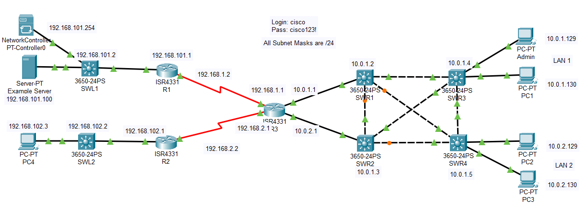

## Топология



## Таблица адресации

> **Примечание**. Все маски подсети — /24 (255.255.255.0).

| Устройство     | Интерфейс     | IP адрес         |
|----------------|---------------|------------------|
| R1             | G0/0/0        | 192.168.101.1/24 |
| R1             | S0/1/0        | 192.168.1.2      |
| R2             | G0/0/0        | 192.168.102.1    |
| R2             | S0/1/1        | 192.168.2.2      |
| R3             | G0/0/0        | 10.0.1.1         |
| R3             | G0/0/1        | 10.0.2.1         |
| R3             | S0/1/0        | 192.168.1.1      |
| R3             | S0/1/1        | 192.168.2.1      |
| SWL1           | VLAN 1        | 192.168.101.2    |
| SWL2           | VLAN 1        | 192.168.102.2    |
| SWR1           | VLAN 1        | 10.0.1.2         |
| SWR2           | VLAN 1        | 10.0.1.3         |
| SWR3           | VLAN 1        | 10.0.1.4         |
| SWR4           | VLAN 1        | 10.0.1.5         |
| Admin          | сетевая карта | 10.0.1.129       |
| PC1            | сетевая карта | 10.0.1.130       |
| PC2            | сетевая карта | 10.0.2.129       |
| PC3            | сетевая карта | 10.0.2.130       |
| PC4            | сетевая карта | 192.168.102.3    |
| Example Server | сетевая карта | 192.168.101.100  |
| PT-Controller  | сетевая карта | 192.168.101.254  |

## Цели

-   Часть 1: Запустите виртуальную машину DEVASC
-   Часть 2. Проверка внешнего подключения к Packet Tracer
-   Часть 3. Запрос токена аутентификации с помощью Postman
-   Часть 4. Отправка запросов REST с помощью Postman
-   Часть 5. Отправка запросов REST с VS Code
-   Часть 6. Отправка запросов REST внутри Packet Tracer

## Предыстория/сценарий

В этом упражнении Packet Tracer вы будете использовать сетевой контроллер Packet Tracer и соответствующую документацию по API для отправки запросов REST от Postman и от Visual Studio Code (VS Code). Packet Tracer также поддерживает среду кодирования Python. Поэтому в заключительной части этого упражнения вы будете отправлять запросы REST из Packet Tracer.

## Требуемые ресурсы

-   1 ПК с выбранной операционной системой
-   Virtual Box или VMWare
-   Виртуальная машина DEVASC

## Инструкции

### Часть 1. Запустите виртуальную машину DEVASC.

Если вы еще не завершили **лабораторную работу «Установка виртуальной лабораторной среды»**, сделайте это сейчас. Если вы уже завершили эту лабораторную работу, запустите виртуальную машину DEVASC сейчас.

### Часть 2. Проверка внешнего подключения к Packet Tracer

В этой части вы убедитесь, что к Packet Tracer могут обращаться другие приложения на виртуальной машине DEVASC. Это действие должно быть полностью выполнено в среде виртуальной машины DEVASC. Поддержка других настроек не предусмотрена.

**Шаг 1. Если вы еще этого не сделали, откройте Packet Tracer Activity.**

1.  В DEVASC VM получите доступ к учебной программе курса в браузере Chromium.
2.  Перейдите на страницу с этой лабораторной работой.
3.  Загрузите и запустите файл **Packet Tracer - Implement REST APIs with an SDN Controller.pka,** для которого предназначены эти инструкции.

**Шаг 2. Проверьте настройки Packet Tracer для внешнего доступа.**

1.  Нажмите **Options \> Preferences \> Miscellaneous**. Убедитесь, что в разделе **External Network Access** установлен флажок **External Access for Network Controller REST API**.
2.  Закройте окно **Preferences.**
3.  Нажмите **PT-Controller0 \> Config**.
4.  Слева в разделе **REAL WORLD** нажмите **Controller**.
5.  Отметьте **Access Enabled** и запишите номер порта, который, скорее всего, **58000**. Это номер порта, который вам понадобится при внешнем доступе к действию Packet Tracer из Chromium, VS Code и Postman позже в этом упражнении.

**Шаг 3. Убедитесь, что вы можете получить доступ к Packet Tracer из другой программы на виртуальной машине DEVASC.**

Откройте Chromium и перейдите по адресу **http://localhost:58000/api/v1/host**.

Вы получите следующий ответ. Этот шаг проверяет наличие внешнего доступа к Packet Tracer и **PT-Controller0**. Обратите внимание, что для авторизации требуется билет. Вы получите токен авторизации в следующей части.

```json
{
    "response": {
        "detail": "Security Authentication Failure",
        "errorCode": "REST_API_EXTERNAL_ACCESS",
        "message": "Ticket-based authorization: empty ticket."
    },
    "version": "1.0"
}
```

### Часть 3. Запрос токена аутентификации с Postman

В этой части вы изучите документацию REST API в Packet Tracer и используете Postman для запроса токена аутентификации у **PT-Controller0**. Вы также можете сделать это в VS Code с помощью скрипта Python.

**Шаг 1. Изучите документацию REST API для сетевого контроллера.**

Чтобы просмотреть документацию REST API для **PT-Controller0**, выполните следующие действия:

1.  Нажмите **Admin \> Desktop \> Web Browser**.
2.  Введите **192.168.101.254**.
3.  Войдите в **PT-Controller0** под пользователем **cisco** и паролем **cisco123!**
4.  Щелкните меню рядом с логотипом Cisco и выберите **API Docs**.
5.  Вы также можете получить доступ к этой же документации из меню справки. Щелкните **Help \> Contents**.
6.  На панели навигации слева прокрутите вниз примерно на две трети и щелкните **Network Controller API**. Это обеспечивает ту же документацию, которую вы нашли на **PT-Controller0**.
7.  В документации по API нажмите **addTicket**. Вы будете использовать эту документацию на следующем шаге.

   > **Примечание**. Некоторые функции REST API могут быть недоступны в текущей версии Packet Tracer.

**Шаг 2. Создайте новый POST-запрос.**

1.  Изучив документацию по методу API REST **addTicket**, откройте Postman. В области **Launch** щелкните знак «плюс», чтобы создать новый запрос **Untitled Request**.
2.  Щелкните стрелку вниз и измените тип с **GET** на **POST**.
3.  Введите URL-адрес **http://localhost:58000/api/v1/ticket**.
4.  Под полем URL нажмите **Body** . Измените тип на **raw**.
5.  Щелкните стрелку вниз рядом с **Text** и измените его на **JSON**. Это изменение также установит для HTTP-заголовка «Content-type» значение «application/json», необходимое для этого вызова API.
6.  Вставьте следующий объект JSON в поле **Body**. Убедитесь, что ваш код правильно отформатирован

    ```json
    {
        "username": "cisco",
        "password": "cisco123!"
    }
    ```

**Шаг 3. Отправить POST-запрос**

1.  Щелкните **Отправить**, чтобы отправить запрос POST на **PT-Controller0** .

    Вы должны получить ответ, подобный следующему. Однако **your_serviceTicket** будет фактическим значением.

    ```json
    {
        "response": {
            "idleTimeout": 900,
            "serviceTicket": "your_serviceTicket",
            "sessionTimeout": 3600
        },
        "version": "1.0"
    }
    ```

1.  Скопируйте значение **serviceTicket** без кавычек в текстовый файл для последующего использования.

### Часть 4. Отправляйте REST-запросы с помощью Postman

В этой части вы будете использовать свой сервисный тикет для отправки трех запросов REST на PT-Controller0.

**Шаг 1. Создайте новый запрос GET для всех сетевых устройств в сети.**

1.  В Postman щелкните знак плюса, чтобы создать новый запрос **Untitled Request**.
2.  Введите URL-адрес **http://localhost:58000/api/v1/network-device**.
3.  Под полем URL нажмите **Headers**.
4.  Под последним **KEY** щелкните поле **Key** и введите **X-Auth-Token**.
5.  В поле **Value** введите значение вашего сервисного тикета.

**Шаг 2. Отправьте GET-запрос.**

Щелкните **Send**, чтобы отправить запрос GET на **PT-Controller0**.

Вы должны получить ответ со списком деталей, которые есть у контроллера для девяти сетевых устройств в сети. Здесь показан ответ для первого устройства.

```json
{
    "response": [
        {
            "collectionStatus": "Managed",
            "connectedInterfaceName": [
                "GigabitEthernet0/0/0",
                "GigabitEthernet0",
                "FastEthernet0"
            ],
            "connectedNetworkDeviceIpAddress": [
                "192.168.101.1",
                "192.168.101.254",
                "192.168.101.100"
            ],
            "connectedNetworkDeviceName": [
                "R1",
                "NetworkController",
                "Example Server"
            ],
            "errorDescription": "",
            "globalCredentialId": "53046ecc-88c3-49f6-9626-ca8ab9db6725",
            "hostname": "SWL1",
            "id": "CAT1010BT47-uuid",
            "interfaceCount": "29",
            "inventoryStatusDetail": "Managed",
            "lastUpdateTime": "6",
            "lastUpdated": "2020-06-11 22:55:51",
            "macAddress": "000C.CF42.2B11",
            "managementIpAddress": "192.168.101.2",
            "platformId": "3650",
            "productId": "3650-24PS",
            "reachabilityFailureReason": "",
            "reachabilityStatus": "Reachable",
            "serialNumber": "CAT1010BT47-",
            "softwareVersion": "16.3.2",
            "type": "MultiLayerSwitch",
            "upTime": "4 hours, 55 minutes, 11 seconds"
        },
<output omitted>
    ],
    "version": "1.0"
}
```

**Шаг 3. Дублируйте запрос GET и измените его для всех хостов в сети.**

1.  **GET** хоста и выберите **Duplicate Tab**.
2.  Вся информация в билете та же, за исключением URL. Просто измените **network-device** на **host**:

    **http://localhost:58000/api/v1/host**.

**Шаг 4. Отправьте GET-запрос.**

Щелкните **Send**, чтобы отправить запрос GET на **PT-Controller0**.

Вы должны получить ответ со списком деталей, которые есть у контроллера для шести хост-устройств в сети. Здесь показан ответ для первого устройства.

```json
{
    "response": [
        {
            "connectedAPMacAddress": "",
            "connectedAPName": "",
            "connectedInterfaceName": "GigabitEthernet1/0/24",
            "connectedNetworkDeviceIpAddress": "192.168.102.2",
            "connectedNetworkDeviceName": "SWL2",
            "hostIp": "192.168.102.3",
            "hostMac": "00E0.F96C.155B",
            "hostName": "PC4",
            "hostType": "Pc",
            "id": "PTT08108MO8-uuid",
            "lastUpdated": "2020-06-11 22:49:32",
            "pingStatus": "SUCCESS"
        },
<output omitted>
    ],
    "version": "1.0"
}
```

**Шаг 5. Закройте Postman, чтобы освободить память в виртуальной машине DEVASC.**

### Часть 5. Отправка запросов REST с VS Code

В этой части вы будете использовать скрипт Python в VS Code для отправки тех же запросов API, которые вы отправляли в Postman. Однако вы также будете использовать циклы Python for для анализа JSON и отображения только определенных пар ключ-значение.

**Шаг 1. Используйте скрипт для запроса сервисного билета.**

1.  Откройте код VS.
1.  Щелкните **File \> Open** **Folder...** и перейдите в каталог **devnet-src/ptna**.
1.  Нажмите **ОК**.

    Обратите внимание, что на панели **EXPLORE** слева показаны три сценария: **01_get-ticket.py**, **02_get-network-device.py** и **03_get-host.py**. Просмотрите код для каждого. Обратите внимание, что сценарии для сетевых устройств и хостов требуют, чтобы вы заменили значение **your_serviceTicket** значением, которое Packet Tracer дал вам при запросе тикета. Запросите новый сервисный тикет, чтобы увидеть функцию скрипта **01_get-ticket.py**.

1.  Откройте окно терминала в VS Code: **Terminal \> New Terminal**.
2.  Запустите **01_get-ticket.py**, чтобы увидеть вывод, подобный следующему.

    ```
    devasc@labvm:~/labs/devnet-src/ptna$ python3 01_get-ticket.py 
    Ticket request status:  201
    The service ticket number is:  your_serviceTicket
    devasc@labvm:~/labs/devnet-src/ptna$
    ```

1.  Замените значение **your_serviceTicket** в **02_get-network-device.py** и **03_get-host.py** значением, которое дал вам Packet Tracer.

**Шаг 2. Используйте сценарий для запроса списка сетевых устройств.**

Ранее в Postman вызов API сетевого устройства возвращал список всех девяти сетевых устройств и всю информацию, доступную для каждого устройства. Однако скрипт **02_get-network-device.py** выводит только интересующие программиста значения ключей: **hostname**, **platformId** и **managementIpAddress**.

В окне терминала запустите скрипт **02_get-network-device.py**.

```
devasc@labvm:~/labs/devnet-src/ptna$ python3 02_get-network-device.py 
Request status:  200
SWL1     3650    192.168.101.2
R1       ISR4300         192.168.1.2
R3       ISR4300         192.168.2.1
SWR1     3650    10.0.1.2
SWR2     3650    10.0.1.3
R2       ISR4300         192.168.2.2
SWL2     3650    192.168.102.2
SWR4     3650    10.0.1.5
SWR3     3650    10.0.1.4
devasc@labvm:~/labs/devnet-src/ptna$
```

**Шаг 3. Используйте сценарий для запроса списка хост-устройств.**

Точно так же программист решил указать конкретную информацию для каждого из шести хост-устройств, подключенных к сети.

В окне терминала запустите скрипт **03_get-host.py**.

```
devasc@labvm:~/labs/devnet-src/ptna$ python3 03_get-host.py 
Request status:  200
PC4      192.168.102.3   00E0.F96C.155B          GigabitEthernet1/0/24
PC3      10.0.2.129      0004.9A42.C245          GigabitEthernet1/0/24
PC1      10.0.1.129      00E0.A330.3359          GigabitEthernet1/0/22
PC2      10.0.2.130      0060.47C1.A4DB          GigabitEthernet1/0/23
Admin    10.0.1.130      0050.0FCE.B095          GigabitEthernet1/0/21
Example Server   192.168.101.100         000A.413D.D793          GigabitEthernet1/0/3
devasc@labvm:~/labs/devnet-src/ptna$
```

### Часть 6. Отправка запросов REST внутри Packet Tracer (необязательно)

В этой части вы будете использовать те же сценарии с одним небольшим изменением для отправки тех же запросов API внутри Packet Tracer, которые вы отправляли из VS Code.

**Шаг 1. Создайте проект в Packet Tracer**

1.  В Packet Tracer щелкните ПК **Admin.**
2.  Щелкните вкладку **Programming**.
3.  На данный момент проекта нет. Щелкните **New**.
4.  Введите **REST API** в качестве имени **Name** и выберите **Empty - Python** в качестве шаблона.
5.  Щелкните **Create**.

    Проект **REST API (Python)** теперь создается с пустым сценарием **main.py.**

**Шаг 2. Измените сценарии, чтобы они выполнялись внутри Packet Tracer.**

Для доступа из одного приложения к другому на том же хост-компьютере необходимо, чтобы в URL-адресе был указан номер порта. Однако Packet Tracer имитирует реальную сеть. В реальном мире вы обычно не указываете номер порта при выполнении запросов API. Кроме того, вы должны использовать доменное имя или IP-адрес в URL-адресе.

1.  В **VS Code** скопируйте код для **03_get-host.py**.
2.  На вкладке **Admin \> Programming** дважды щелкните сценарий **main.py**, чтобы открыть его.
3.  Вставьте код в скрипт **main.py.**
4.  Измените **api_url**. Замените **localhost:58000/api/v1/host** на **192.168.101.254/api/v1/host.**
5.  Правки сохраняются автоматически. Нажмите **Run**. Вывод Packet Tracer не совсем точно имитирует то, что вы видите в командной строке Linux. Однако вы должны увидеть аналогичный вывод, как показано ниже.

    ```
    Starting REST APIs (Python)...
    ('Request status: ', 200)
    ('PC4', '\t', '192.168.102.3', '\t', '00E0.F96C.155B', '\t', 'GigabitEthernet1/0/24')
    ('PC3', '\t', '10.0.2.129', '\t', '0004.9A42.C245', '\t', 'GigabitEthernet1/0/24')
    ('PC1', '\t', '10.0.1.129', '\t', '00E0.A330.3359', '\t', 'GigabitEthernet1/0/22')
    ('PC2', '\t', '10.0.2.130', '\t', '0060.47C1.A4DB', '\t', 'GigabitEthernet1/0/23')
    ('Admin', '\t', '10.0.1.130', '\t', '0050.0FCE.B095', '\t', 'GigabitEthernet1/0/21')
    ('Example Server', '\t', '192.168.101.100', '\t', '000A.413D.D793', '\t', 'GigabitEthernet1/0/3')
    REST APIs (Python) finished running.
    ```

1.  Скопируйте и вставьте **02_get-network-device.py** в **main.py.** Измените URL-адрес и запустите его.

    ```
    REST APIs (Python) finished running.
    Starting REST APIs (Python)...
    ('Request status: ', 200)
    ('SWL1', '\t', '3650', '\t', '192.168.101.2')
    ('R1', '\t', 'ISR4300', '\t', '192.168.1.2')
    ('R3', '\t', 'ISR4300', '\t', '192.168.2.1')
    ('SWR1', '\t', '3650', '\t', '10.0.1.2')
    ('SWR2', '\t', '3650', '\t', '10.0.1.3')
    ('R2', '\t', 'ISR4300', '\t', '192.168.2.2')
    ('SWL2', '\t', '3650', '\t', '192.168.102.2')
    ('SWR4', '\t', '3650', '\t', '10.0.1.5')
    ('SWR3', '\t', '3650', '\t', '10.0.1.4')
    REST APIs (Python) finished running
    ```
